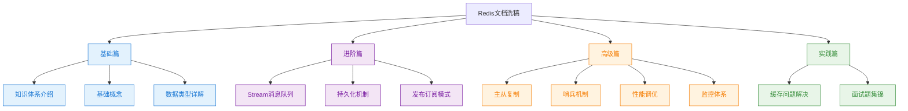
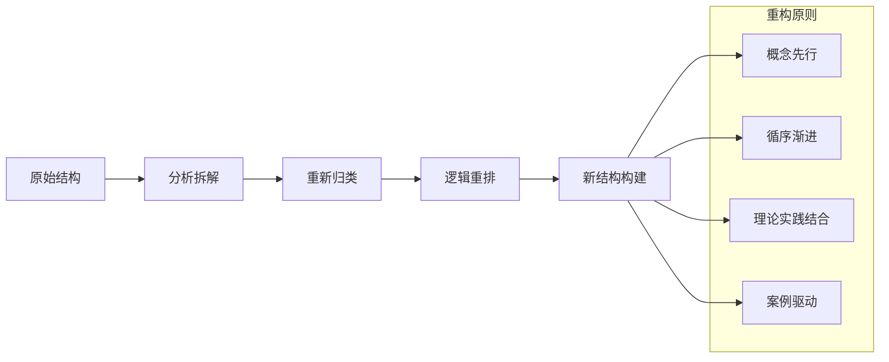
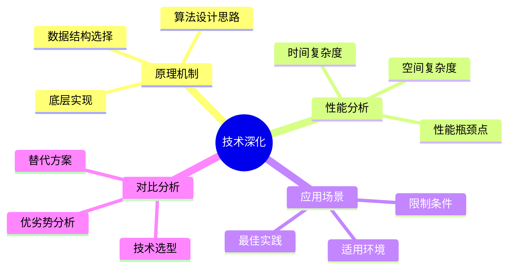
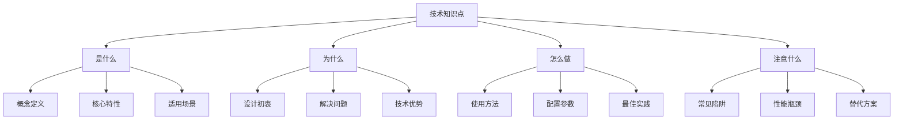
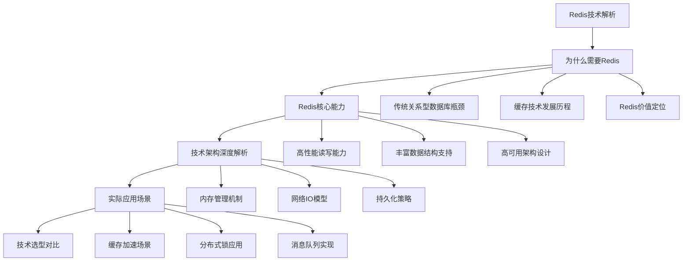
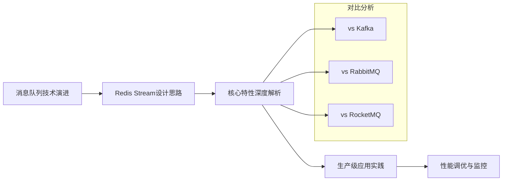
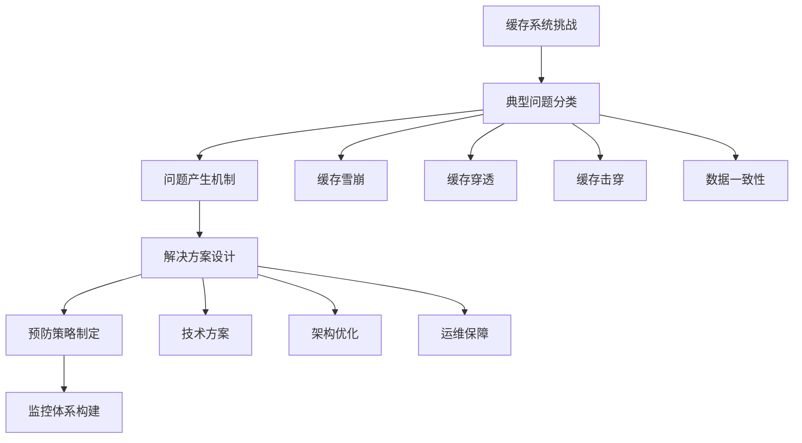
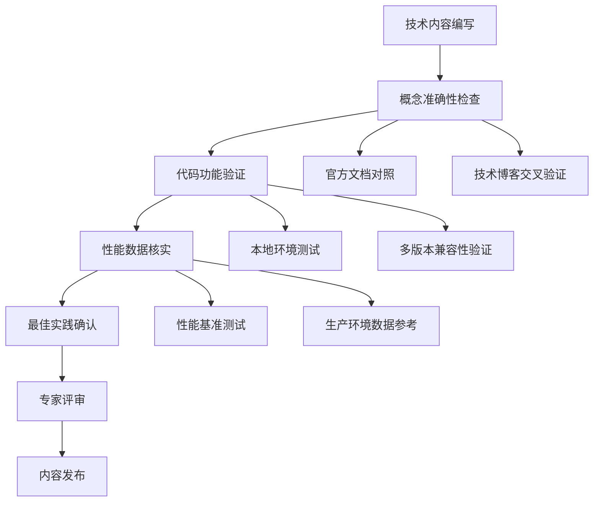
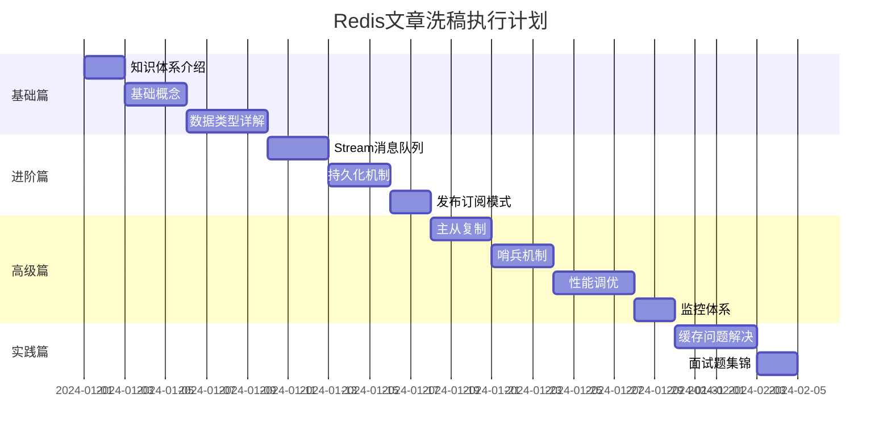
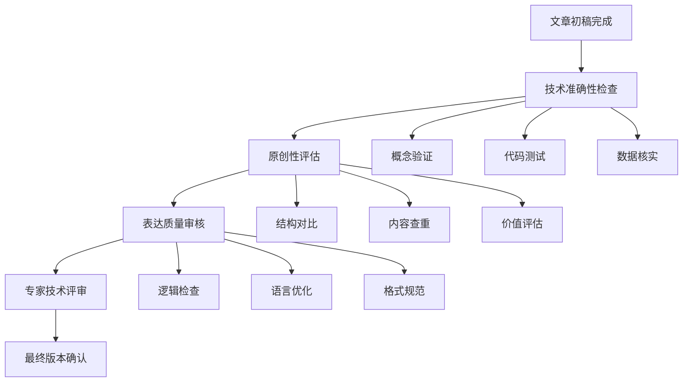

# Redis文章内容洗稿设计方案

## 概述

本设计文档针对Redis技术文档进行内容重构与原创化处理。项目涉及12篇Redis相关技术文章，内容涵盖基础概念、数据类型、高级功能、集群架构以及实际应用场景。洗稿过程将严格遵循技术准确性和专业严谨性原则，在保持核心技术内容不变的前提下，通过重新组织结构、改写表达方式、优化示例代码等手段，将复制内容转化为原创技术输出。

### 项目目标

- **内容原创化**：将从其他来源复制的技术内容转化为具有个人风格的原创文章
- **技术严谨性**：确保技术概念、原理和实现方式的准确性和完整性
- **表达优化**：改进文章结构、语言表达和阅读体验
- **价值提升**：在原有内容基础上增加深度分析、实战经验和最佳实践

### 处理范围



## 洗稿策略设计

### 1. 内容重构策略

#### 1.1 结构重组方法

**原文结构问题分析**
- 标题层级不够清晰，缺乏逻辑递进
- 内容组织较为松散，知识点跳跃
- 示例代码缺乏统一风格和深度说明

**重构方案**


**具体重构策略**

| 重构维度 | 原有方式 | 优化方式 | 预期效果 |
|---------|---------|---------|----------|
| 标题体系 | 简单罗列 | 层级化结构 | 提升阅读引导性 |
| 内容组织 | 知识点平铺 | 模块化分组 | 增强逻辑性 |
| 概念阐述 | 定义式描述 | 类比式解释 | 提高理解度 |
| 代码示例 | 片段展示 | 完整场景 | 增强实用性 |

#### 1.2 语言表达重写

**改写策略**

1. **概念解释方式转换**
   - 从定义式 → 场景式引入
   - 从抽象描述 → 具体类比
   - 从功能罗列 → 价值导向

2. **技术描述优化**
   - 增加"为什么"的分析
   - 补充"怎么做"的步骤
   - 添加"注意什么"的提醒

3. **表达风格统一**
   - 使用第一人称视角增强代入感
   - 采用问答式结构增加互动性
   - 运用递进式逻辑增强说服力

### 2. 技术内容深化

#### 2.1 原理解析增强

**深化维度**



**具体实施方法**

1. **源码角度解析**
   - 关键数据结构的设计思路
   - 核心算法的实现原理
   - 性能优化的具体手段

2. **架构层面分析**
   - 模块间的协作机制
   - 数据流转的完整路径
   - 异常处理的设计思路

3. **实战经验融入**
   - 线上问题的诊断思路
   - 性能调优的实际案例
   - 运维监控的关键指标

#### 2.2 示例代码重构

**代码优化策略**

| 优化方面 | 原有问题 | 改进方案 | 实现标准 |
|---------|---------|---------|----------|
| 代码完整性 | 片段化展示 | 完整可运行示例 | 包含导入、配置、异常处理 |
| 注释质量 | 缺乏说明 | 详细业务场景注释 | 解释业务意图和技术要点 |
| 编码规范 | 不统一 | 统一编码标准 | 遵循阿里Java规范 |
| 实际应用 | 简单demo | 生产级代码 | 考虑并发、异常、性能 |

**代码重构模板**

```java
/**
 * Redis数据类型操作示例
 * 
 * 业务场景：电商系统用户购物车管理
 * 技术要点：Hash数据结构的应用
 * 性能考虑：批量操作、过期时间设置
 * 
 * @author [Your Name]
 * @version 1.0
 * @since 2024-01-01
 */
@Service
@Slf4j
public class ShoppingCartService {
    
    private final RedisTemplate<String, Object> redisTemplate;
    
    /**
     * 添加商品到购物车
     * 
     * 技术实现：
     * 1. 使用Hash结构存储用户购物车
     * 2. field为商品ID，value为商品数量
     * 3. 设置购物车过期时间为7天
     * 
     * 性能优化：
     * - 使用pipeline批量操作
     * - 避免频繁的网络开销
     */
    public void addToCart(String userId, String productId, Integer quantity) {
        try {
            String cartKey = buildCartKey(userId);
            
            // 原子操作：增加商品数量
            redisTemplate.opsForHash()
                .increment(cartKey, productId, quantity);
            
            // 设置过期时间（7天）
            redisTemplate.expire(cartKey, Duration.ofDays(7));
            
            log.info("用户{}添加商品{}到购物车，数量：{}", userId, productId, quantity);
            
        } catch (Exception e) {
            log.error("添加购物车失败，用户：{}，商品：{}", userId, productId, e);
            throw new ServiceException("购物车操作失败", e);
        }
    }
    
    /**
     * 构建购物车缓存key
     * 
     * 命名规范：业务模块:功能:用户ID
     * 示例：cart:items:user123
     */
    private String buildCartKey(String userId) {
        return String.format("cart:items:%s", userId);
    }
}
```

### 3. 知识点扩展策略

#### 3.1 深度分析维度

**分析框架**



#### 3.2 实战案例设计

**案例设计原则**

1. **真实性**：基于实际业务场景
2. **完整性**：包含问题发现、分析、解决全过程
3. **普适性**：具备一定的通用性和参考价值
4. **深度性**：涉及技术原理和优化思路

**案例结构模板**

```markdown
### 实战案例：[场景名称]

#### 业务背景
- 系统规模：日活用户量、QPS峰值
- 业务特点：读写比例、数据特征
- 技术栈：相关技术组件

#### 问题描述
- 现象表现：具体的问题症状
- 影响范围：对业务的影响程度
- 数据指标：关键性能指标异常

#### 分析过程
- 问题定位：排查思路和方法
- 原因分析：技术层面的根本原因
- 方案设计：解决方案的设计思路

#### 解决方案
- 技术实现：具体的实现代码
- 配置调优：相关参数的优化
- 监控告警：关键指标的监控设置

#### 效果评估
- 性能指标：优化前后的对比数据
- 业务影响：对业务指标的改善
- 经验总结：可复用的经验和教训
```

## 文章重构方案

### 1. 基础概念类文章重构

#### 1.1 《Redis基础-概念》重构方案

**原文问题诊断**
- 概念介绍过于平铺直叙
- 缺乏对比分析和应用场景说明
- 示例代码过于简单

**重构目标**
- 从应用场景出发引入概念
- 增加与其他技术的对比分析
- 提供更丰富的实战示例

**新结构设计**



#### 1.2 《Redis基础-数据类型》重构方案

**重构策略**
- 以业务场景为导向介绍数据类型
- 增加底层实现原理分析
- 提供性能优化建议

**新内容框架**

| 数据类型 | 业务场景引入 | 底层原理解析 | 性能优化要点 |
|---------|-------------|-------------|-------------|
| String | 用户会话存储 | SDS结构设计 | 内存使用优化 |
| Hash | 用户信息缓存 | 哈希表实现 | 字段数量控制 |
| List | 消息队列实现 | 双向链表结构 | 阻塞操作优化 |
| Set | 用户标签管理 | 整数集合设计 | 大集合处理 |
| ZSet | 排行榜功能 | 跳跃表算法 | 范围查询优化 |

### 2. 进阶功能类文章重构

#### 2.1 《Redis进阶-Stream消息队列》重构方案

**原文分析**
- 功能介绍较为概念化
- 缺乏与其他消息队列的对比
- 实际应用案例不够丰富

**重构重点**
- 从消息队列技术演进角度引入Stream
- 详细分析Stream与传统MQ的区别
- 提供完整的项目实战案例

**新章节结构**



### 3. 高级特性类文章重构

#### 3.1 《Redis缓存问题雪崩穿透等》重构方案

**重构策略**
- 从实际线上故障案例引入问题
- 系统化分析问题产生机制
- 提供多层次解决方案

**新内容组织**



## 技术规范与质量保证

### 1. 技术准确性保证

#### 1.1 技术验证流程



#### 1.2 质量检查清单

**技术内容检查**
- [ ] 技术概念定义准确无误
- [ ] 示例代码可以正常运行
- [ ] 性能数据来源可靠
- [ ] 配置参数设置合理
- [ ] 版本兼容性明确说明

**表达质量检查**
- [ ] 逻辑结构清晰合理
- [ ] 语言表达准确流畅
- [ ] 专业术语使用恰当
- [ ] 图表设计清晰易懂
- [ ] 章节过渡自然流畅

### 2. 原创性保证

#### 2.1 原创性评估标准

| 评估维度 | 原创要求 | 检查方法 | 通过标准 |
|---------|---------|---------|----------|
| 结构组织 | 独特的章节安排 | 与原文对比分析 | 结构相似度<30% |
| 表达方式 | 个人化的语言风格 | 语言风格分析 | 表达方式差异化明显 |
| 代码示例 | 原创业务场景代码 | 代码查重检测 | 代码重复率<20% |
| 深度分析 | 独特见解和经验 | 内容价值评估 | 增加原创分析>40% |

#### 2.2 原创化技巧

**结构重组技巧**
- 改变知识点的介绍顺序
- 增加对比分析章节
- 融入个人实战经验
- 添加思考题和练习

**表达优化技巧**
- 使用类比和比喻增强理解
- 采用问答式结构增加互动
- 融入故事化的案例描述
- 增加"为什么"的思考分析

**内容增值技巧**
- 补充最新版本特性
- 增加性能调优经验
- 提供故障排查思路
- 分享运维监控方案

### 3. 写作规范

#### 3.1 文章结构规范

**标准结构模板**

```markdown
# 文章标题

## 概述
- 技术背景介绍
- 核心价值说明
- 内容结构预览

## 核心概念解析
- 基本概念定义
- 技术原理分析
- 关键特性说明

## 深入技术实现
- 底层机制分析
- 关键算法解读
- 性能特性分析

## 实战应用指南
- 使用场景分析
- 配置参数说明
- 最佳实践建议

## 高级应用技巧
- 性能优化方法
- 故障排查技巧
- 运维监控方案

## 实际案例分析
- 真实项目案例
- 问题解决过程
- 经验总结提炼

## 技术对比分析
- 同类技术对比
- 选型决策建议
- 适用场景分析

## 总结与展望
- 核心要点回顾
- 技术发展趋势
- 学习建议指导
```

#### 3.2 代码规范

**代码编写标准**
- 使用统一的命名规范
- 提供完整的业务场景代码
- 包含详细的注释说明
- 考虑异常处理和边界情况
- 提供性能优化建议

**示例代码模板**

```java
/**
 * [功能模块]服务实现
 * 
 * 业务场景：[具体业务场景描述]
 * 技术要点：[关键技术点说明]
 * 性能考虑：[性能优化要点]
 * 注意事项：[使用注意事项]
 * 
 * @author [作者名称]
 * @version 1.0
 * @since [创建日期]
 */
@Service
@Slf4j
public class [ClassName] {
    
    // 依赖注入
    private final [DependencyType] [dependencyName];
    
    /**
     * [方法功能描述]
     * 
     * 实现思路：
     * 1. [步骤一说明]
     * 2. [步骤二说明]
     * 3. [步骤三说明]
     * 
     * 性能优化：
     * - [优化点一]
     * - [优化点二]
     * 
     * @param [参数名] [参数说明]
     * @return [返回值说明]
     * @throws [异常类型] [异常说明]
     */
    public [ReturnType] [methodName]([ParameterType] [parameterName]) {
        try {
            // 1. 参数校验
            validateParameters([parameterName]);
            
            // 2. 业务逻辑处理
            [ReturnType] result = processBusinessLogic([parameterName]);
            
            // 3. 结果处理
            handleResult(result);
            
            log.info("[操作描述]成功，参数：{}", [parameterName]);
            return result;
            
        } catch (Exception e) {
            log.error("[操作描述]失败，参数：{}", [parameterName], e);
            throw new ServiceException("[错误信息]", e);
        }
    }
    
    /**
     * 参数校验方法
     */
    private void validateParameters([ParameterType] [parameterName]) {
        if ([parameterName] == null) {
            throw new IllegalArgumentException("[参数名]不能为空");
        }
        // 其他校验逻辑
    }
}
```

## 执行计划与时间安排

### 1. 文章处理优先级



### 2. 阶段性输出计划

**第一阶段：基础文章重构（预计10天）**
- 重点关注概念准确性和表达优化
- 建立统一的写作风格和标准
- 完成基础数据类型的深度解析

**第二阶段：进阶功能重构（预计8天）**
- 增加技术原理的深度分析
- 提供完整的实战应用案例
- 强化与其他技术的对比分析

**第三阶段：高级特性重构（预计12天）**
- 融入生产环境实践经验
- 提供系统性的解决方案
- 增加监控和故障排查内容

**第四阶段：实践应用重构（预计6天）**
- 整合真实项目案例
- 完善问题解决方案
- 构建知识体系总结

### 3. 质量控制节点



**每阶段质量检查**
- 技术内容准确性：100%技术概念和代码验证通过
- 原创性达标率：结构重组度>70%，内容原创度>60%
- 表达质量：逻辑清晰，语言流畅，专业术语准确
- 实用价值：提供可实践的解决方案和建议

通过系统性的洗稿设计和严格的质量控制，最终将形成一套具有个人特色、技术准确、表达优良的Redis技术文档体系，为技术分享和知识传播提供高质量的原创内容。