# MySQL数据库知识体系重构设计

## 概述

基于现有MySQL数据库文件和Redis数据库的文件结构经验，本设计旨在为MySQL数据库知识脉络创建一个系统化的分类整理方案。通过参考Redis数据库的成功文件组织模式，构建从基础概念到高级应用的完整学习路径。

## 设计目标

### 核心原则
1. **知识体系化**：建立完整的MySQL技术知识架构
2. **层次递进性**：从基础到高级的学习路径设计
3. **实用导向性**：结合真实业务场景的技术应用
4. **维护便利性**：便于后续知识内容的更新和扩展

### 学习路径设计
遵循"概念理解 → 基础操作 → 进阶功能 → 高级特性 → 性能优化 → 运维实践"的完整技术成长路径。

## 技术架构

### MySQL知识体系架构图

```mermaid
graph TD
A[MySQL知识体系] --> B[基础概念]
A --> C[核心功能]
A --> D[高级特性]
A --> E[性能优化]
A --> F[运维管理]
A --> G[问题排查]

B --> B1[数据库概述]
B --> B2[数据类型]
B --> B3[存储引擎]

C --> C1[SQL基础]
C --> C2[索引机制]
C --> C3[事务处理]
C --> C4[备份恢复]

D --> D1[主从复制]
D --> D2[分库分表]
D --> D3[集群方案]
D --> D4[安全认证]

E --> E1[查询优化]
E --> E2[参数调优]
E --> E3[监控分析]

F --> F1[安装部署]
F --> F2[版本升级]
F --> F3[日常维护]

G --> G1[错误诊断]
G --> G2[性能问题]
G --> G3[故障恢复]

classDef basic fill:#E8F5E8,stroke:#4CAF50
classDef core fill:#E3F2FD,stroke:#2196F3
classDef advanced fill:#FFF3E0,stroke:#FF9800
classDef optimization fill:#F3E5F5,stroke:#9C27B0
classDef operation fill:#FFEBEE,stroke:#F44336
classDef troubleshoot fill:#E0F2F1,stroke:#009688

class B,B1,B2,B3 basic
class C,C1,C2,C3,C4 core
class D,D1,D2,D3,D4 advanced
class E,E1,E2,E3 optimization
class F,F1,F2,F3 operation
class G,G1,G2,G3 troubleshoot
```



## 文件结构设计

### 新增文件列表

基于Redis数据库的命名规范和MySQL技术特点，设计以下文件结构：

#### 基础知识层（1-5）
1. **1.MySQL知识体系介绍.md** - MySQL整体技术架构概述
2. **2.MySQL基础-概念与架构.md** - 核心概念和系统架构
3. **3.MySQL基础-数据类型详解.md** - 数据类型和存储引擎
4. **4.MySQL基础-SQL语言基础.md** - SQL基础语法和操作
5. **5.MySQL基础-索引机制.md** - 索引原理和优化策略

#### 核心功能层（6-10）
6. **6.MySQL核心-事务处理机制.md** - 事务ACID特性和隔离级别
7. **7.MySQL核心-存储过程与函数.md** - 存储过程和自定义函数
8. **8.MySQL核心-视图与触发器.md** - 视图创建和触发器应用
9. **9.MySQL核心-备份与恢复.md** - 数据备份和灾难恢复策略
10. **10.MySQL核心-用户权限管理.md** - 用户管理和权限控制

#### 高级特性层（11-15）
11. **11.MySQL高级-主从复制.md**（保留现有文件内容）
12. **12.MySQL高级-集群与分片.md** - 集群部署和分库分表
13. **13.MySQL高级-SSL安全认证.md**（基于现有文件重构）
14. **14.MySQL高级-JSON数据处理.md** - JSON字段和NoSQL特性
15. **15.MySQL高级-分区表技术.md** - 表分区策略和实现

#### 性能优化层（16-20）
16. **16.MySQL优化-查询性能调优.md** - SQL查询优化技巧
17. **17.MySQL优化-服务器参数配置.md** - 配置参数优化指南
18. **18.MySQL优化-监控与分析.md** - 性能监控和分析工具
19. **19.MySQL优化-连接池管理.md** - 连接池配置和优化
20. **20.MySQL优化-大数据量处理.md** - 大表优化和处理策略

#### 运维管理层（21-25）
21. **21.MySQL运维-安装与配置.md** - 安装部署和环境配置
22. **22.MySQL运维-版本升级.md**（基于现有文件重构）
23. **23.MySQL运维-日志管理.md** - 错误日志和二进制日志管理
24. **24.MySQL运维-自动化脚本.md** - 运维自动化和脚本工具
25. **25.MySQL运维-容器化部署.md** - Docker和K8s部署方案

#### 问题排查层（26-30）
26. **26.MySQL故障-错误码参考.md**（基于现有文件重构）
27. **27.MySQL故障-性能问题诊断.md** - 性能瓶颈识别和解决
28. **28.MySQL故障-死锁问题分析.md** - 死锁检测和处理
29. **29.MySQL故障-数据恢复实战.md** - 数据丢失和恢复案例
30. **30.MySQL面试题集锦.md** - 常见面试题和解答

### 文件命名规范

遵循Redis数据库的命名模式：
- **序号规则**：使用两位数字编号（01-30）
- **分类标识**：文件名包含技术层级标识（基础、核心、高级、优化、运维、故障）
- **主题描述**：清晰描述文件内容的核心主题
- **文件格式**：统一使用.md扩展名

### 内容组织架构

#### 文档结构模板
每个文件遵循统一的文档结构：

```markdown
---
title: [文件名称]
order: [序号]
---

# [文件名称]

## 业务场景引入
从实际业务问题出发，引出技术需求

## 核心概念解析
技术概念的详细解释和原理分析

## 技术实现方案
具体的技术实现步骤和代码示例

## 生产环境实践
真实生产环境的应用案例和最佳实践

## 性能优化建议
性能调优的具体建议和实施方案

## 常见问题解决
常见问题的诊断方法和解决方案

## 相关技术扩展
与其他技术的集成和扩展应用
```

#### 内容质量标准
1. **业务场景导向**：每个技术点都有对应的业务应用场景
2. **代码示例完整**：提供完整的业务逻辑代码示例
3. **生产实践指导**：包含生产环境的最佳实践建议
4. **图表辅助理解**：使用Mermaid图表辅助复杂概念理解

## 技术特色

### 创新亮点

#### 1. 业务场景驱动的学习路径
每个技术文档都从实际业务问题出发，通过具体的业务场景引出技术解决方案，使学习更具针对性和实用性。

#### 2. 渐进式技术深度
按照技术难度和应用复杂度设计学习路径，确保知识的连贯性和系统性，便于读者循序渐进地掌握MySQL技术。

#### 3. 生产环境实践指导
每个技术点都包含生产环境的最佳实践建议，帮助读者将理论知识转化为实际工作能力。

#### 4. 可视化技术架构
大量使用Mermaid图表和架构图，将抽象的技术概念可视化，提升理解效率和学习体验。

### 技术优势

#### 1. 完整的知识覆盖
从MySQL基础概念到高级特性，从性能优化到运维管理，构建完整的MySQL技术知识体系。

#### 2. 实战案例丰富
结合电商、金融、物流等真实业务场景，提供丰富的实战案例和解决方案。

#### 3. 与现代技术栈集成
涵盖MySQL与Spring Boot、Docker、Kubernetes等现代技术栈的集成应用。

#### 4. 问题解决导向
不仅讲解技术原理，更重要的是提供问题解决的思路和方法。

## 实施计划

### 阶段划分

#### 第一阶段：基础知识层（1-5）
- 重点建立MySQL核心概念认知
- 提供SQL基础和索引机制的深度解析
- 预计完成时间：2周

#### 第二阶段：核心功能层（6-10）
- 深入事务处理和存储过程应用
- 完善备份恢复和权限管理方案
- 预计完成时间：3周

#### 第三阶段：高级特性层（11-15）
- 整合现有主从复制和SSL认证内容
- 新增集群、分片和JSON处理等高级主题
- 预计完成时间：3周

#### 第四阶段：优化运维层（16-25）
- 构建完整的性能优化和运维管理体系
- 整合现有版本升级内容
- 预计完成时间：4周

#### 第五阶段：问题排查层（26-30）
- 完善故障诊断和问题解决方案
- 整合现有错误码参考内容
- 预计完成时间：2周

### 质量保证

#### 内容审核机制
1. **技术准确性审核**：确保技术内容的准确性和时效性
2. **实践可行性验证**：验证所有代码示例和操作步骤的可执行性
3. **文档规范性检查**：统一文档格式和写作风格

#### 持续更新策略
1. **版本跟踪更新**：跟踪MySQL版本更新，及时调整文档内容
2. **用户反馈优化**：收集用户反馈，持续优化文档质量
3. **技术发展适配**：适配新技术发展，扩展相关内容

## 预期效果

### 学习效果提升
1. **系统性掌握**：通过结构化的知识体系，系统掌握MySQL技术
2. **实践能力增强**：通过丰富的实战案例，提升实际应用能力
3. **问题解决能力**：培养独立分析和解决MySQL相关问题的能力

### 知识库价值
1. **技术权威性**：建立MySQL技术领域的权威知识参考
2. **应用实用性**：提供可直接应用于生产环境的技术方案
3. **学习高效性**：通过可视化和场景化设计，提升学习效率

### 生态系统完善
1. **与Redis协同**：与Redis知识库形成互补，构建完整的数据库技术体系
2. **与框架集成**：与Spring Boot等框架知识库形成技术栈闭环
3. **实际项目支撑**：为实际项目开发提供全面的技术支撑