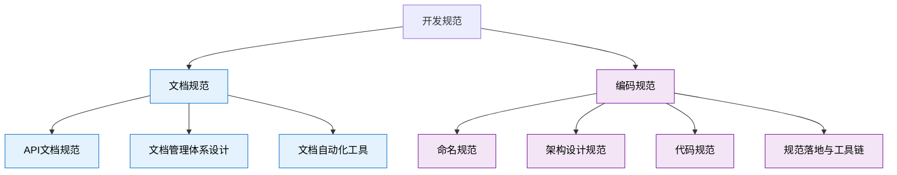
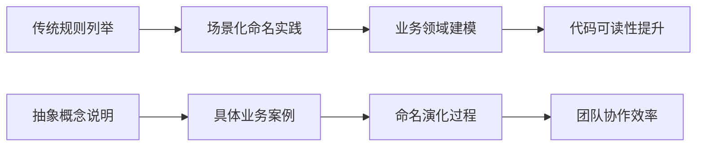
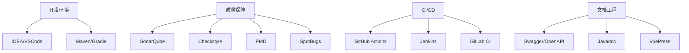

# 开发规范文档洗稿重构设计

## 概述
本设计文档旨在对现有开发规范文档进行全面的内容重构和原创化改写，确保文档内容在保持技术准确性和专业性的前提下，形成具有独特表达风格的原创技术文档。重构范围涵盖文档规范和编码规范两大核心模块，通过业务场景驱动的方式重新组织内容结构，增强文档的实用性和可读性。

## 架构分析

### 当前文档结构

### 重构策略设计
本次重构采用"业务场景驱动 + 技术实践结合"的策略，通过以下方式实现内容的原创化：

1. **表达方式转换**
   - 从规则陈述转向场景化说明
   - 从理论阐述转向实践引导
   - 从抽象概念转向具体案例

2. **内容结构重组**
   - 重新设计章节逻辑关系
   - 调整知识点呈现顺序
   - 增加实战案例与避坑指南

3. **技术深度增强**
   - 增加业务场景分析
   - 补充最佳实践建议
   - 完善技术决策依据

## 重构实施方案

### 文档规范模块重构

#### API文档规范重构要点
- **原始特点**: 偏向规则罗列，缺乏业务场景
- **重构方向**: 以电商系统用户管理为核心场景，展示API文档设计的完整流程
- **技术增强**: 增加Swagger/OpenAPI规范集成实践，补充自动化文档生成工具链

#### 文档管理体系重构要点  
- **原始特点**: 理论性强，缺乏落地指导
- **重构方向**: 以企业级技术文档平台建设为背景，展示分层管理策略
- **实践增强**: 增加GitOps文档工作流，补充版本控制与协作机制

#### 文档自动化工具重构要点
- **原始特点**: 工具介绍为主，缺乏集成方案
- **重构方向**: 构建完整的文档自动化CI/CD流水线
- **工具链升级**: 集成现代化工具栈（VuePress、Docusaurus、GitBook等）

### 编码规范模块重构

#### 命名规范重构策略

- **内容重组**: 从"规则 → 示例"转为"业务场景 → 命名策略 → 实践验证"
- **案例升级**: 使用订单系统、用户管理、支付流程等真实业务场景
- **深度增强**: 增加命名演化历程，补充团队协作中的命名冲突解决方案

#### 架构设计规范重构策略
- **理论升华**: 从SOLID原则陈述转向微服务架构实践指导
- **案例丰富**: 增加分布式系统设计模式，补充高并发场景解决方案
- **工程实践**: 集成Spring Cloud技术栈，展示现代化架构设计思路

#### 代码规范重构策略
- **全面性提升**: 增加安全编码、性能优化、异常处理等维度
- **工具集成**: 完善SonarQube、Checkstyle、SpotBugs等质量工具配置
- **实战导向**: 增加代码审查checklist，补充持续集成实践

#### 规范落地工具链重构策略
- **现代化升级**: 集成GitHub Actions、GitLab CI等现代CI/CD平台
- **自动化增强**: 完善质量门禁配置，增加自动化修复建议
- **团队协作**: 增加规范培训体系，补充跨团队协作机制

## 重构质量保障

### 技术准确性验证
- **代码示例验证**: 所有代码片段必须经过编译和运行测试
- **最佳实践校对**: 参考Spring官方文档、阿里Java开发手册等权威资料
- **工具配置验证**: 确保所有工具配置在实际项目中可用

### 原创性保障措施
- **表达方式原创**: 重新组织语言表达，避免直接照搬原文
- **案例场景原创**: 设计独特的业务场景，避免使用通用示例
- **技术见解原创**: 增加个人技术思考和工程实践总结

### 实用性增强
- **可操作性**: 所有规范都提供具体的实施步骤和工具支持
- **场景适配**: 针对不同团队规模和项目类型提供差异化建议
- **问题导向**: 重点解决实际开发中的常见痛点和难题

## 内容组织原则

### 业务场景驱动
每个技术规范都以真实业务问题作为引入，通过场景化描述帮助读者理解规范的价值和必要性。例如：
- 命名规范通过电商系统重构案例展示命名一致性的重要性
- 异常处理通过支付系统故障分析展示异常设计的关键作用

### 渐进式深度递增
- **基础层**: 核心概念和基本规则
- **实践层**: 具体实施方法和工具使用
- **进阶层**: 复杂场景处理和性能优化
- **架构层**: 团队协作和规范落地

### 实战价值导向
所有规范内容都围绕提升工程效率和代码质量展开，避免纯理论阐述，重点关注：
- 如何在实际项目中应用规范
- 如何通过工具自动化规范检查
- 如何在团队中推广和落地规范

## 技术工具集成

### 现代化开发工具栈

### 自动化工作流设计
集成现代化CI/CD流水线，实现规范的自动化检查和执行：
- **代码提交阶段**: 自动格式化、命名规范检查
- **构建阶段**: 静态代码分析、安全漏洞扫描
- **测试阶段**: 单元测试覆盖率检查、集成测试执行
- **部署阶段**: 文档自动生成、API文档发布

## 内容创新亮点

### 技术深度增强
- **微服务架构实践**: 增加分布式系统设计规范
- **云原生适配**: 集成容器化部署和Kubernetes最佳实践
- **性能优化**: 增加高并发场景下的编码优化策略

### 工程化升级  
- **DevOps集成**: 完善开发运维一体化工作流
- **质量工程**: 构建代码质量度量和持续改进机制
- **团队协作**: 增加跨地域分布式团队的规范协同方案

### 实践案例丰富
通过引入以下业务场景增强文档实用性：
- **电商平台**: 订单处理、库存管理、支付系统
- **金融系统**: 风控规则、交易处理、账户管理  
- **IoT平台**: 设备接入、数据采集、实时分析

## 实施路径

### 阶段一：基础重构（文档规范）
1. API文档规范重构
2. 文档管理体系重构  
3. 文档自动化工具重构

### 阶段二：核心重构（编码规范）
1. 命名规范重构
2. 架构设计规范重构
3. 代码规范重构
4. 规范落地工具链重构

### 阶段三：质量验证与优化
1. 技术准确性校验
2. 原创性检查
3. 实用性测试
4. 内容优化调整

文章第一行不做任何调整

通过这种系统化的重构设计，将原有的开发规范文档转化为具有独特价值和强实践指导意义的原创技术文档，既保持了技术内容的准确性，又实现了表达方式和组织结构的全面创新。