# MongoDB数据库知识体系重构设计

## 概述

本设计文档旨在重构MongoDB数据库知识体系，参考MySQL数据库的文件结构和命名规范，创建一个从基础到高级的完整知识脉络。通过系统化的分类整理，将现有的MongoDB文档重新组织为层次分明、逻辑清晰的技术文档体系。

## 项目背景分析

### 现状分析

当前MongoDB文档结构：
- `1.Mongo数据库概述.md` - 基础概念介绍
- `2.Mongo数据库实践-增删改查.md` - CRUD操作实践
- `3.Mongo数据库进阶-聚合操作.md` - 聚合框架应用
- `4.Mongo数据库高级用法.md` - 高级特性
- `5.Mongo数据库命令参考.md` - 命令手册

### MySQL文档结构参考

MySQL数据库采用30个文档的完整体系：
- 基础部分（1-5）：知识体系、概念架构、数据类型、SQL基础、索引机制
- 核心部分（6-10）：事务处理、存储过程、视图触发器、备份恢复、权限管理
- 高级部分（11-15）：主从复制、集群分片、SSL认证、JSON处理、分区技术
- 优化部分（16-20）：性能调优、参数配置、监控分析、连接池、大数据处理
- 运维部分（21-25）：备份恢复、高可用、升级迁移、安全管理、容器化
- 问题排查（26-30）：性能诊断、连接问题、数据一致性、故障恢复、日志分析

## 新MongoDB文档体系架构

### 技术架构设计

```mermaid
graph TD
    A[MongoDB知识体系] --> B[基础部分 1-5]
    A --> C[核心部分 6-10]
    A --> D[高级部分 11-15]
    A --> E[优化部分 16-20]
    A --> F[运维部分 21-25]
    A --> G[问题排查 26-30]

    B --> B1[1.MongoDB知识体系介绍]
    B --> B2[2.MongoDB基础-概念与架构]
    B --> B3[3.MongoDB基础-数据类型详解]
    B --> B4[4.MongoDB基础-查询语言基础]
    B --> B5[5.MongoDB基础-索引机制]

    C --> C1[6.MongoDB核心-CRUD操作详解]
    C --> C2[7.MongoDB核心-聚合框架]
    C --> C3[8.MongoDB核心-事务处理]
    C --> C4[9.MongoDB核心-数据建模]
    C --> C5[10.MongoDB核心-权限管理]

    D --> D1[11.MongoDB高级-复制集]
    D --> D2[12.MongoDB高级-分片集群]
    D --> D3[13.MongoDB高级-安全认证]
    D --> D4[14.MongoDB高级-GridFS文件存储]
    D --> D5[15.MongoDB高级-变更流]

    E --> E1[16.MongoDB优化-查询性能调优]
    E --> E2[17.MongoDB优化-索引策略优化]
    E --> E3[18.MongoDB优化-监控与分析]
    E --> E4[19.MongoDB优化-连接池管理]
    E --> E5[20.MongoDB优化-大数据量处理]

    F --> F1[21.MongoDB运维-备份与恢复]
    F --> F2[22.MongoDB运维-高可用架构]
    F --> F3[23.MongoDB运维-升级与迁移]
    F --> F4[24.MongoDB运维-安全管理]
    F --> F5[25.MongoDB运维-容器化部署]

    G --> G1[26.MongoDB问题排查-性能问题诊断]
    G --> G2[27.MongoDB问题排查-连接问题处理]
    G --> G3[28.MongoDB问题排查-数据一致性处理]
    G --> G4[29.MongoDB问题排查-故障恢复实战]
    G --> G5[30.MongoDB问题排查-日志分析技巧]

    classDef basic fill:#E3F2FD,stroke:#1976D2,color:#000
    classDef core fill:#E8F5E8,stroke:#388E3C,color:#000
    classDef advanced fill:#FFF3E0,stroke:#F57C00,color:#000
    classDef optimize fill:#F3E5F5,stroke:#7B1FA2,color:#000
    classDef ops fill:#FFEBEE,stroke:#C62828,color:#000
    classDef troubleshoot fill:#E0F2F1,stroke:#00695C,color:#000

    class B,B1,B2,B3,B4,B5 basic
    class C,C1,C2,C3,C4,C5 core
    class D,D1,D2,D3,D4,D5 advanced
    class E,E1,E2,E3,E4,E5 optimize
    class F,F1,F2,F3,F4,F5 ops
    class G,G1,G2,G3,G4,G5 troubleshoot
```

### 文档分类与重构策略

#### 基础部分（1-5）：夯实理论基础
1. **MongoDB知识体系介绍** - 技术生态、应用场景、学习路径
2. **MongoDB基础-概念与架构** - 核心概念、存储引擎、架构原理
3. **MongoDB基础-数据类型详解** - BSON类型、文档结构、字段约束
4. **MongoDB基础-查询语言基础** - 查询语法、操作符、表达式
5. **MongoDB基础-索引机制** - 索引类型、创建策略、性能影响

#### 核心部分（6-10）：掌握核心功能
6. **MongoDB核心-CRUD操作详解** - 增删改查最佳实践
7. **MongoDB核心-聚合框架** - 管道操作、聚合表达式、MapReduce
8. **MongoDB核心-事务处理** - ACID特性、多文档事务、会话管理
9. **MongoDB核心-数据建模** - 文档设计、关系建模、性能考量
10. **MongoDB核心-权限管理** - 用户角色、访问控制、认证机制

#### 高级部分（11-15）：深入高级特性
11. **MongoDB高级-复制集** - 高可用架构、选举机制、读写分离
12. **MongoDB高级-分片集群** - 水平扩展、分片键设计、负载均衡
13. **MongoDB高级-安全认证** - SSL/TLS、LDAP集成、审计日志
14. **MongoDB高级-GridFS文件存储** - 大文件处理、文件元数据、流式操作
15. **MongoDB高级-变更流** - 实时数据变更、事件驱动架构

#### 优化部分（16-20）：性能调优实践
16. **MongoDB优化-查询性能调优** - 执行计划、查询优化、缓存策略
17. **MongoDB优化-索引策略优化** - 复合索引、部分索引、索引维护
18. **MongoDB优化-监控与分析** - 性能指标、监控工具、预警机制
19. **MongoDB优化-连接池管理** - 连接配置、池化策略、资源管理
20. **MongoDB优化-大数据量处理** - 批量操作、内存管理、IO优化

#### 运维部分（21-25）：生产环境管理
21. **MongoDB运维-备份与恢复** - 备份策略、恢复流程、灾难恢复
22. **MongoDB运维-高可用架构** - 故障转移、负载均衡、架构设计
23. **MongoDB运维-升级与迁移** - 版本升级、数据迁移、平滑过渡
24. **MongoDB运维-安全管理** - 安全加固、漏洞防护、合规要求
25. **MongoDB运维-容器化部署** - Docker部署、Kubernetes编排、微服务架构

#### 问题排查（26-30）：故障诊断与解决
26. **MongoDB问题排查-性能问题诊断** - 慢查询分析、资源瓶颈、调优方案
27. **MongoDB问题排查-连接问题处理** - 连接超时、池耗尽、网络问题
28. **MongoDB问题排查-数据一致性处理** - 数据校验、一致性检查、修复方案
29. **MongoDB问题排查-故障恢复实战** - 故障定位、恢复流程、预防措施
30. **MongoDB问题排查-日志分析技巧** - 日志配置、分析工具、问题定位

## 内容重构原则

### 文档编写规范

1. **结构标准化**
   - 第一行必须是文件名称作为一级标题
   - 使用统一的章节结构：概述、知识要点、知识扩展、深度思考
   - 每个文档包含业务场景、代码示例、最佳实践

2. **内容原创化**
   - 从实际业务问题出发引出技术解决方案
   - 增加真实案例、完整代码示例
   - 使用Mermaid图表辅助理解复杂概念
   - 包含生产环境的最佳实践建议

3. **技术深度递进**
   - 基础部分：概念理解、语法掌握
   - 核心部分：功能应用、实践操作
   - 高级部分：架构设计、特性深入
   - 优化部分：性能调优、监控分析
   - 运维部分：生产实践、问题解决

### 业务场景驱动

每个文档都将结合具体的业务场景：
- **电商系统**：商品管理、订单处理、库存同步
- **内容管理**：文档存储、全文检索、版本控制
- **物联网应用**：传感器数据、时序分析、实时监控
- **金融系统**：交易记录、风控数据、合规审计

### 代码示例标准

提供完整的业务逻辑代码示例：
- Java Spring Boot框架为主
- 包含异常处理和性能优化
- 真实业务场景的完整实现
- 单元测试和集成测试示例

## 技术实现方案

### 文件重构策略

1. **保留现有文件结构**：基于现有5个文档进行扩展重构
2. **新增文档创建**：按照30个文档的完整体系创建新文件
3. **内容迁移优化**：将现有内容重新分配到对应的新文档中
4. **统一命名规范**：采用"序号.MongoDB分类-具体功能.md"格式

### 实施步骤

1. **第一阶段**：创建基础部分文档（1-5），重构现有概述和基础内容
2. **第二阶段**：创建核心部分文档（6-10），重构CRUD和聚合内容
3. **第三阶段**：创建高级部分文档（11-15），新增复制集、分片等内容
4. **第四阶段**：创建优化部分文档（16-20），新增性能调优内容
5. **第五阶段**：创建运维部分文档（21-25），新增运维实践内容
6. **第六阶段**：创建问题排查文档（26-30），新增故障诊断内容

## 预期成果

通过本次重构，将实现：

1. **知识体系完整化**：从5个文档扩展到30个文档，覆盖MongoDB全技术栈
2. **内容深度提升**：每个技术点都包含理论、实践、优化、故障处理
3. **学习路径清晰化**：从基础到高级的递进式学习体系
4. **实用性增强**：结合真实业务场景，提供可落地的解决方案
5. **维护性改善**：统一的文档结构和编写规范，便于后续维护和扩展

这将构建一个与MySQL文档体系同等完善的MongoDB知识库，为开发者提供系统性、实用性的技术文档资源。