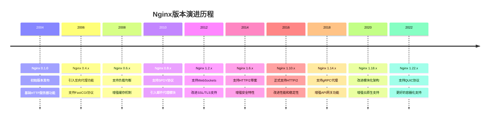
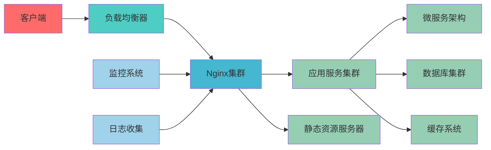

# Nginx知识体系重构设计文档

## 1. 概述

### 1.1 项目背景
本项目旨在对现有的Nginx技术文档进行系统性重构，参考MySQL数据库知识体系的文件结构和命名规范，创建一个从基础到高级的完整知识脉络。通过系统化的分类整理，将现有的Nginx文档重新组织为层次分明、逻辑清晰的技术文档体系。

### 1.2 重构目标
- 建立完整的Nginx知识体系架构，涵盖基础概念、核心功能、高级特性、性能优化、运维管理等层面
- 参考MySQL数据库文档的结构化组织方式，形成统一的知识分类标准
- 增强文档的可读性、可维护性和可扩展性
- 提供清晰的学习路径和实践指导

### 1.3 业务场景驱动
在现代Web应用架构中，Nginx作为高性能的反向代理和负载均衡器，承担着关键的基础设施角色。通过业务场景驱动的方式，我们将从实际应用需求出发，系统化地梳理Nginx的各项技术特性。

## 2. 知识体系架构设计

### 2.1 整体架构
参考MySQL知识体系架构，我们将Nginx知识体系划分为以下层次：

```mermaid
graph TB
    A[Nginx知识体系] --> B[基础概念层]
    A --> C[核心功能层]
    A --> D[高级特性层]
    A --> E[性能优化层]
    A --> F[运维管理层]
    A --> G[故障排查层]

    B --> B1[Nginx概述]
    B --> B2[安装与配置]
    B --> B3[基础指令]
    B --> B4[核心概念]

    C --> C1[反向代理]
    C --> C2[负载均衡]
    C --> C3[虚拟主机]
    C --> C4[静态资源处理]
    C --> C5[动静分离]

    D --> D1[HTTPS配置]
    D --> D2[访问控制]
    D --> D3[限流策略]
    D --> D4[重写规则]
    D --> D5[缓存机制]

    E --> E1[性能调优]
    E --> E2[连接优化]
    E --> E3[内存管理]
    E --> E4[并发处理]

    F --> F1[日志管理]
    F --> F2[监控配置]
    F --> F3[版本升级]
    F --> F4[安全加固]

    G --> G1[错误诊断]
    G --> G2[性能问题]
    G --> G3[连接异常]
    G --> G4[配置故障]

    classDef basic fill:#E8F5E8,stroke:#4CAF50
    classDef core fill:#E3F2FD,stroke:#2196F3
    classDef advanced fill:#FFF3E0,stroke:#FF9800
    classDef optimization fill:#F3E5F5,stroke:#9C27B0
    classDef operation fill:#FFEBEE,stroke:#F44336
    classDef troubleshoot fill:#E0F2F1,stroke:#009688

    class B,B1,B2,B3,B4 basic
    class C,C1,C2,C3,C4,C5 core
    class D,D1,D2,D3,D4,D5 advanced
    class E,E1,E2,E3,E4 optimization
    class F,F1,F2,F3,F4 operation
    class G,G1,G2,G3,G4 troubleshoot
```



### 2.2 技术发展历程


## 3. 核心技术特性

### 3.1 架构模型
Nginx采用异步非阻塞事件驱动模型，具有以下特点：

1. **Master-Worker进程模型**
   - Master进程负责管理工作进程
   - Worker进程处理实际请求
   - 支持平滑重启和升级

2. **事件处理机制**
   - 基于epoll/kqueue等高效I/O多路复用
   - 单线程异步非阻塞处理
   - 高并发连接处理能力

### 3.2 核心功能模块
Nginx的核心功能模块包括：

| 模块 | 功能描述 | 应用场景 |
|------|---------|---------|
| HTTP Core | HTTP基础功能 | Web服务器 |
| Proxy | 反向代理 | 负载均衡 |
| Upstream | 上游服务器 | 集群管理 |
| Rewrite | URL重写 | SEO优化 |
| Access | 访问控制 | 安全防护 |
| Log | 日志记录 | 运维监控 |

### 3.3 高可用性保障
Nginx通过以下机制保障高可用性：

1. **健康检查**
   - 主动检测后端服务器状态
   - 自动剔除故障节点
   - 故障恢复后自动加入

2. **负载均衡策略**
   - 轮询(Round Robin)
   - 加权轮询(Weight)
   - IP哈希(IP Hash)
   - 最少连接(Least Connections)

## 4. 学习路径规划

### 4.1 初级阶段（基础概念层）
**学习目标**：掌握Nginx基础概念和基本配置
- Nginx架构和工作原理
- 安装部署和基础配置
- 虚拟主机和静态资源服务
- 基本的反向代理配置

**实践项目**：搭建简单的静态网站服务器

### 4.2 中级阶段（核心功能层）
**学习目标**：深入理解Nginx核心功能特性
- 反向代理和负载均衡配置
- 动静分离和缓存优化
- SSL/TLS配置和HTTPS支持
- 访问控制和安全防护

**实践项目**：构建高可用的Web应用架构

### 4.3 高级阶段（高级特性层）
**学习目标**：掌握Nginx高级特性和架构设计
- 高级负载均衡算法
- 限流和熔断机制
- 重写规则和变量使用
- 自定义模块开发

**实践项目**：构建API网关和微服务架构

### 4.4 专家阶段（优化运维层）
**学习目标**：具备生产环境优化和运维能力
- 性能调优和监控分析
- 故障诊断和快速恢复
- 自动化部署和配置管理
- 安全加固和漏洞防护

**实践项目**：构建企业级Nginx运维平台

## 5. 技术生态集成

### 5.1 与现代技术栈的集成


### 5.2 Docker容器化部署
在Docker环境中部署Nginx的配置示例：

```dockerfile
# Dockerfile
FROM nginx:1.22-alpine

# 复制配置文件
COPY nginx.conf /etc/nginx/nginx.conf
COPY conf.d/ /etc/nginx/conf.d/

# 复制静态文件
COPY html/ /usr/share/nginx/html/

# 暴露端口
EXPOSE 80 443

# 健康检查
HEALTHCHECK --interval=30s --timeout=3s --start-period=5s --retries=3 \
  CMD curl -f http://localhost/ || exit 1
```

### 5.3 Kubernetes集成
在Kubernetes中部署Nginx Ingress Controller：

```yaml
# ingress-controller.yaml
apiVersion: apps/v1
kind: Deployment
metadata:
  name: nginx-ingress-controller
spec:
  replicas: 2
  selector:
    matchLabels:
      app: nginx-ingress
  template:
    metadata:
      labels:
        app: nginx-ingress
    spec:
      containers:
      - name: nginx-ingress-controller
        image: k8s.gcr.io/ingress-nginx/controller:v1.2.0
        args:
        - /nginx-ingress-controller
        - --configmap=$(POD_NAMESPACE)/nginx-configuration
        - --tcp-services-configmap=$(POD_NAMESPACE)/tcp-services
        - --udp-services-configmap=$(POD_NAMESPACE)/udp-services
        env:
        - name: POD_NAME
          valueFrom:
            fieldRef:
              fieldPath: metadata.name
        - name: POD_NAMESPACE
          valueFrom:
            fieldRef:
              fieldPath: metadata.namespace
        ports:
        - name: http
          containerPort: 80
        - name: https
          containerPort: 443
```

## 6. 实践应用场景

### 6.1 Web应用架构案例
以下是一个典型的Web应用架构中Nginx的配置示例：

```nginx
# nginx.conf
user nginx;
worker_processes auto;
error_log /var/log/nginx/error.log;
pid /run/nginx.pid;

events {
    worker_connections 1024;
}

http {
    log_format main '$remote_addr - $remote_user [$time_local] "$request" '
                    '$status $body_bytes_sent "$http_referer" '
                    '"$http_user_agent" "$http_x_forwarded_for"';
    
    access_log /var/log/nginx/access.log main;
    
    # 基础配置
    sendfile on;
    tcp_nopush on;
    tcp_nodelay on;
    keepalive_timeout 65;
    types_hash_max_size 2048;
    
    # Gzip压缩
    gzip on;
    gzip_vary on;
    gzip_min_length 1024;
    gzip_types text/plain text/css application/json application/javascript text/xml application/xml;
    
    # 负载均衡配置
    upstream backend {
        server 192.168.1.10:8080 weight=3;
        server 192.168.1.11:8080 weight=2;
        server 192.168.1.12:8080 backup;
    }
    
    # 虚拟主机配置
    server {
        listen 80;
        server_name example.com www.example.com;
        
        # 重定向到HTTPS
        return 301 https://$server_name$request_uri;
    }
    
    server {
        listen 443 ssl http2;
        server_name example.com www.example.com;
        
        # SSL配置
        ssl_certificate /etc/nginx/ssl/example.com.crt;
        ssl_certificate_key /etc/nginx/ssl/example.com.key;
        ssl_protocols TLSv1.2 TLSv1.3;
        ssl_ciphers ECDHE-RSA-AES256-GCM-SHA512:DHE-RSA-AES256-GCM-SHA512;
        ssl_prefer_server_ciphers off;
        
        # 安全头
        add_header X-Frame-Options "SAMEORIGIN" always;
        add_header X-XSS-Protection "1; mode=block" always;
        add_header X-Content-Type-Options "nosniff" always;
        
        # 静态资源
        location ~* \.(jpg|jpeg|png|gif|ico|css|js)$ {
            root /usr/share/nginx/html;
            expires 1y;
            add_header Cache-Control "public, immutable";
        }
        
        # API代理
        location /api/ {
            proxy_pass http://backend;
            proxy_set_header Host $host;
            proxy_set_header X-Real-IP $remote_addr;
            proxy_set_header X-Forwarded-For $proxy_add_x_forwarded_for;
            proxy_set_header X-Forwarded-Proto $scheme;
        }
        
        # 应用根路径
        location / {
            root /usr/share/nginx/html;
            index index.html index.htm;
            try_files $uri $uri/ =404;
        }
    }
}
```

### 6.2 微服务网关案例
Nginx作为微服务网关的配置示例：

```nginx
# 微服务网关配置
upstream user-service {
    server user-service:8080;
}

upstream order-service {
    server order-service:8080;
}

upstream product-service {
    server product-service:8080;
}

# 限流配置
limit_req_zone $binary_remote_addr zone=user_api:10m rate=10r/s;
limit_req_zone $binary_remote_addr zone=order_api:10m rate=5r/s;

server {
    listen 80;
    server_name api.example.com;
    
    # 用户服务API
    location /api/users {
        limit_req zone=user_api burst=20 nodelay;
        proxy_pass http://user-service;
        proxy_set_header Host $host;
        proxy_set_header X-Real-IP $remote_addr;
    }
    
    # 订单服务API
    location /api/orders {
        limit_req zone=order_api burst=10 nodelay;
        proxy_pass http://order-service;
        proxy_set_header Host $host;
        proxy_set_header X-Real-IP $remote_addr;
    }
    
    # 产品服务API
    location /api/products {
        proxy_pass http://product-service;
        proxy_set_header Host $host;
        proxy_set_header X-Real-IP $remote_addr;
    }
    
    # 健康检查端点
    location /health {
        access_log off;
        return 200 "healthy\n";
        add_header Content-Type text/plain;
    }
}
```

## 7. 学习资源推荐

### 7.1 官方资源
- **Nginx官方文档**：http://nginx.org/en/docs/
- **Nginx官方模块参考**：http://nginx.org/en/docs/dirindex.html
- **Nginx社区**：https://www.nginx.com/resources/wiki/

### 7.2 实践平台
- **Nginx Playground**：在线测试Nginx配置
- **Docker Hub Nginx镜像**：官方Docker镜像文档
- **Kubernetes Ingress文档**：Nginx Ingress Controller使用指南

### 7.3 进阶学习方向
1. **Nginx模块开发**：学习C语言开发Nginx模块
2. **性能优化专家**：深入理解Nginx性能调优技巧
3. **云原生集成**：掌握Nginx在云环境中的部署和管理
4. **安全加固**：学习Nginx安全配置和防护策略

## 8. 总结与展望

通过本次重构，我们将建立一个完整的Nginx知识体系，涵盖从基础概念到高级应用的各个层面。该体系将帮助技术人员系统化地学习和掌握Nginx技术，为构建高性能、高可用的Web应用架构提供坚实的技术基础。

随着云原生和微服务架构的普及，Nginx作为关键的基础设施组件，其重要性将进一步提升。我们将持续更新和完善Nginx知识体系，紧跟技术发展趋势，为技术团队提供最前沿的技术指导和实践参考。


