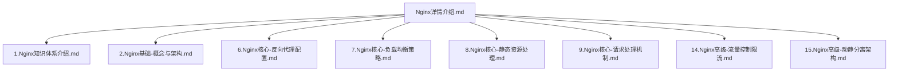
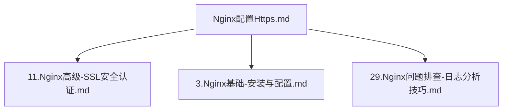
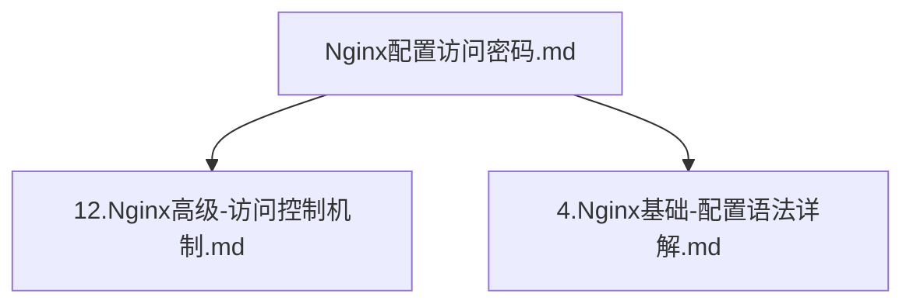
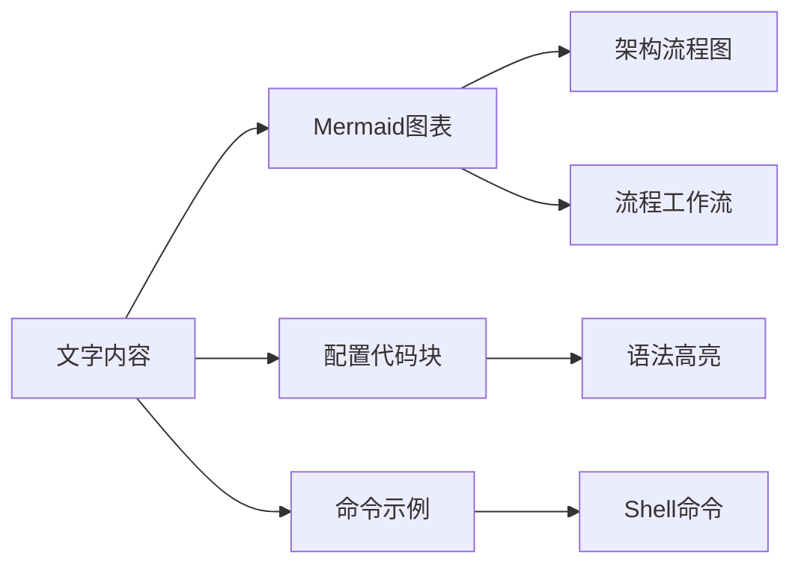

# Nginx知识体系重构设计

## 概述

本设计文档概述了对现有Nginx知识体系的重构，目标是遵循MySQL数据库文档结构和命名规范，创建一个全面、系统化组织的知识库，从基本概念逐步推进到高级实现、故障排除和运维最佳实践。

## 现状分析

### 现有文档结构
当前Nginx文档包含三个文件：
- `Nginx详情介绍.md` - 全面概述和基本概念
- `Nginx配置Https.md` - SSL/HTTPS配置指南
- `Nginx配置访问密码.md` - 访问控制和身份验证

### 内容覆盖范围评估
现有内容涵盖：
- 基本概念和架构理解
- 性能特征和事件处理
- 虚拟主机配置模式
- 负载均衡策略和算法
- 安全配置（HTTPS、访问控制）
- 限流和流量管理
- 请求处理工作流

### 缺口分析
缺少系统化覆盖的内容：
- 安装和初始设置程序
- 核心配置管理
- 高级性能优化
- 运维监控和维护
- 故障排除方法论
- 高可用架构

## 目标架构设计

### 知识体系层次结构

遵循MySQL知识体系模式，重构后的Nginx文档将组织为六个主要类别，采用编号文件进行逻辑推进：

#### 1. Nginx基础（Nginx基础知识）
**文件1-5：核心概念和基本操作**
- `1.Nginx知识体系介绍.md` - 知识体系概述和学习路径
- `2.Nginx基础-概念与架构.md` - 核心概念、架构和设计原理
- `3.Nginx基础-安装与配置.md` - 安装方法和基本配置
- `4.Nginx基础-配置语法详解.md` - 配置语法、指令和上下文层次
- `5.Nginx基础-虚拟主机配置.md` - 虚拟主机设置和域名管理

#### 2. Nginx核心（Nginx核心功能）
**文件6-10：基本功能和操作**
- `6.Nginx核心-反向代理配置.md` - 反向代理设置和配置
- `7.Nginx核心-负载均衡策略.md` - 负载均衡算法和实现
- `8.Nginx核心-静态资源处理.md` - 静态文件服务和优化
- `9.Nginx核心-请求处理机制.md` - 请求处理工作流和生命周期
- `10.Nginx核心-模块系统详解.md` - 模块架构和扩展机制

#### 3. Nginx高级（Nginx高级功能）
**文件11-15：高级配置和专业实现**
- `11.Nginx高级-SSL安全认证.md` - HTTPS配置和SSL管理
- `12.Nginx高级-访问控制机制.md` - 身份验证、授权和访问限制
- `13.Nginx高级-缓存策略配置.md` - 缓存机制和性能优化
- `14.Nginx高级-流量控制限流.md` - 限流、流量整形和DDoS防护
- `15.Nginx高级-动静分离架构.md` - 静态动态分离和微服务集成

#### 4. Nginx优化（Nginx性能优化）
**文件16-20：性能调优和优化策略**
- `16.Nginx优化-性能调优策略.md` - 性能调优方法论和最佳实践
- `17.Nginx优化-内存与连接优化.md` - 内存管理和连接优化
- `18.Nginx优化-缓存策略优化.md` - 高级缓存策略和CDN集成
- `19.Nginx优化-监控与分析.md` - 性能监控、指标收集和分析
- `20.Nginx优化-大流量处理.md` - 高流量场景和可扩展性模式

#### 5. Nginx运维（Nginx运维管理）
**文件21-25：运维管理和维护**
- `21.Nginx运维-日志管理分析.md` - 日志配置、轮转和分析技术
- `22.Nginx运维-健康检查监控.md` - 健康监控、告警和服务发现
- `23.Nginx运维-高可用架构.md` - 高可用设置和故障转移机制
- `24.Nginx运维-容器化部署.md` - Docker容器化和编排
- `25.Nginx运维-升级与维护.md` - 版本管理、更新和维护程序

#### 6. Nginx问题排查（Nginx故障诊断）
**文件26-30：诊断和问题解决**
- `26.Nginx问题排查-性能问题诊断.md` - 性能问题识别和解决
- `27.Nginx问题排查-配置错误处理.md` - 配置验证和错误解决
- `28.Nginx问题排查-连接问题分析.md` - 连接问题和网络故障排除
- `29.Nginx问题排查-日志分析技巧.md` - 日志分析方法论和调试技术
- `30.Nginx问题排查-常见错误处理.md` - 常见错误模式和解决策略

## 内容迁移策略

### 内容重新分配计划

#### 从现有结构到新结构的映射

**Nginx详情介绍.md内容映射：**

**Nginx配置Https.md内容映射：**

**Nginx配置访问密码.md内容映射：**

### 内容增强需求

#### 新内容开发领域

**基础概念增强：**
- 跨不同操作系统的安装程序
- 配置文件结构和继承
- 基本安全加固实践
- 服务管理和systemd集成

**核心功能扩展：**
- 高级代理配置和上游管理
- WebSocket代理和实时应用
- HTTP/2和HTTP/3协议支持
- Gzip压缩和带宽优化

**高级功能开发：**
- Lua脚本和可编程配置
- 第三方模块集成
- API网关实现
- 微服务路由模式

**运维卓越内容：**
- 自动化部署策略
- 版本控制配置管理
- 灾难恢复程序
- 容量规划方法论

## 文档标准

### 写作指南

#### 内容结构模板
每个文档应遵循以下结构：
1. **概述** - 简要介绍和范围
2. **核心概念** - 基本原理和术语
3. **配置示例** - 实际实现代码
4. **最佳实践** - 行业标准建议
5. **常见问题** - 典型挑战和解决方案
6. **相关资源** - 交叉引用和外部链接

#### 视觉设计标准

**图表集成：**

**代码块标准：**
- 为配置文件使用适当的语法高亮
- 包含解释复杂指令的注释
- 提供最小和全面的示例
- 添加何时使用特定配置的上下文

#### 一致性要求

**命名约定：**
- 文件名使用中文描述性标题和英文技术术语
- 类别内逻辑排序的编号前缀
- 所有文档中的一致术语
- 相关主题之间的交叉引用链接

**内容深度标准：**
- 初学者友好的解释，渐进式复杂性
- 真实世界场景和用例
- 每个配置的安全考虑
- 优化主题的性能影响讨论

## 实施方法

### 第一阶段：基础设置（第1-2周）
- 创建目录结构和文件模板
- 从现有文档迁移基本内容
- 建立交叉引用链接系统
- 建立文档审查流程

### 第二阶段：核心内容开发（第3-6周）
- 开发基础概念文档（文件1-5）
- 创建核心功能指南（文件6-10）
- 实施高级功能文档（文件11-15）
- 添加实际示例和配置模板

### 第三阶段：运维内容（第7-9周）
- 构建优化指南（文件16-20）
- 创建运维程序（文件21-25）
- 开发故障排除方法论（文件26-30）
- 添加监控和维护程序

### 第四阶段：质量保证（第10周）
- 内容审查和技术准确性验证
- 交叉引用验证和链接测试
- 目标受众用户体验测试
- 最终格式化和一致性检查

## 成功指标

### 定量指标
- **内容完整性**：30个涵盖所有方面的综合文档
- **交叉引用密度**：每个文档至少5个内部链接
- **代码示例覆盖率**：每个技术文档至少3个实际示例
- **视觉内容比例**：20%的内容应为图表或结构化示例

### 定性指标
- **学习进度**：从初学者到专家级别的清晰路径
- **实用适用性**：所有示例应为生产就绪
- **故障排除有效性**：常见问题的问题-解决方案映射
- **知识保留**：支持快速参考使用的结构化格式

这个重构的知识体系将把当前的Nginx文档从基础覆盖转变为全面、专业组织的技术资源，既服务于学习目的，也服务于运维参考目的。