# Redis缓存问题雪崩穿透等 - 技术文档设计

## 概述

本设计文档旨在为Redis知识库中的《16.Redis缓存问题雪崩穿透等》文档提供完整的内容架构和技术方案。该文档将深入探讨Redis在生产环境中常见的缓存问题，包括缓存雪崩、缓存穿透、缓存击穿等核心问题，并提供系统性的解决方案。

文档将遵循项目现有的技术写作风格，结合Mermaid图表、Java代码示例和实际案例，为Java全栈开发者提供实用的技术指导。

## 项目背景分析

## 项目背景分析

### 知识库特点
该Redis知识库是一个基于VuePress的Java全栈技术文档项目，具有以下显著特点：

- **结构化组织**：采用清晰的标题层级和知识要点划分
- **视觉化丰富**：大量使用Mermaid流程图和架构图进行可视化说明
- **实践导向**：结合Java代码示例和实际应用场景
- **深度适中**：既有理论基础，又有实践指导
- **中文表达**：使用中文技术写作，术语准确，表达清晰

### 现有Redis知识体系
通过分析现有文档结构，可以看出知识库遵循了从基础到高级的递进式组织：

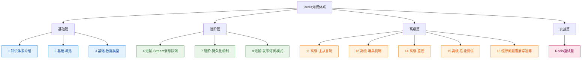

### 目标文档定位
《16.Redis缓存问题雪崩穿透等》作为高级篇的重要组成部分，应当：

- **衔接作用**：连接理论知识与实战应用
- **问题导向**：重点解决生产环境中的实际问题
- **深度合适**：适合已掌握Redis基础的中高级开发者
- **实用性强**：提供可直接应用的解决方案和代码示例

## 核心缓存问题架构

### 问题分类与关系
缓存问题是分布式系统中的常见挑战，主要包括以下几个核心问题：

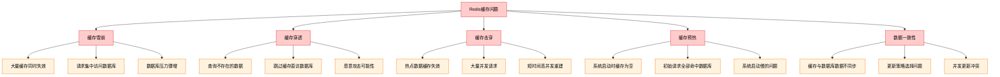

### 问题影响分析
各类缓存问题对系统的影响程度和特点如下：

| 问题类型 | 影响范围 | 严重程度 | 持续时间 | 预防难度 |
|------------|----------|----------|----------|----------|
| 缓存雪崩 | 全局性 | 极高 | 中等 | 中等 |
| 缓存穿透 | 局部性 | 高 | 持续 | 低 |
| 缓存击穿 | 局部性 | 高 | 短暂 | 中等 |
| 缓存预热 | 全局性 | 中等 | 短暂 | 低 |
| 数据一致性 | 局部性 | 中等 | 持续 | 中等 |

### 问题产生原理
下面详细分析各个问题的产生原理和影响机制：

#### 1. 缓存雪崩 (Cache Avalanche)

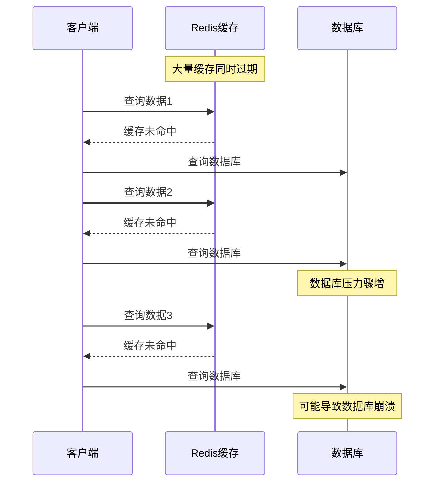

#### 2. 缓存穿透 (Cache Penetration)

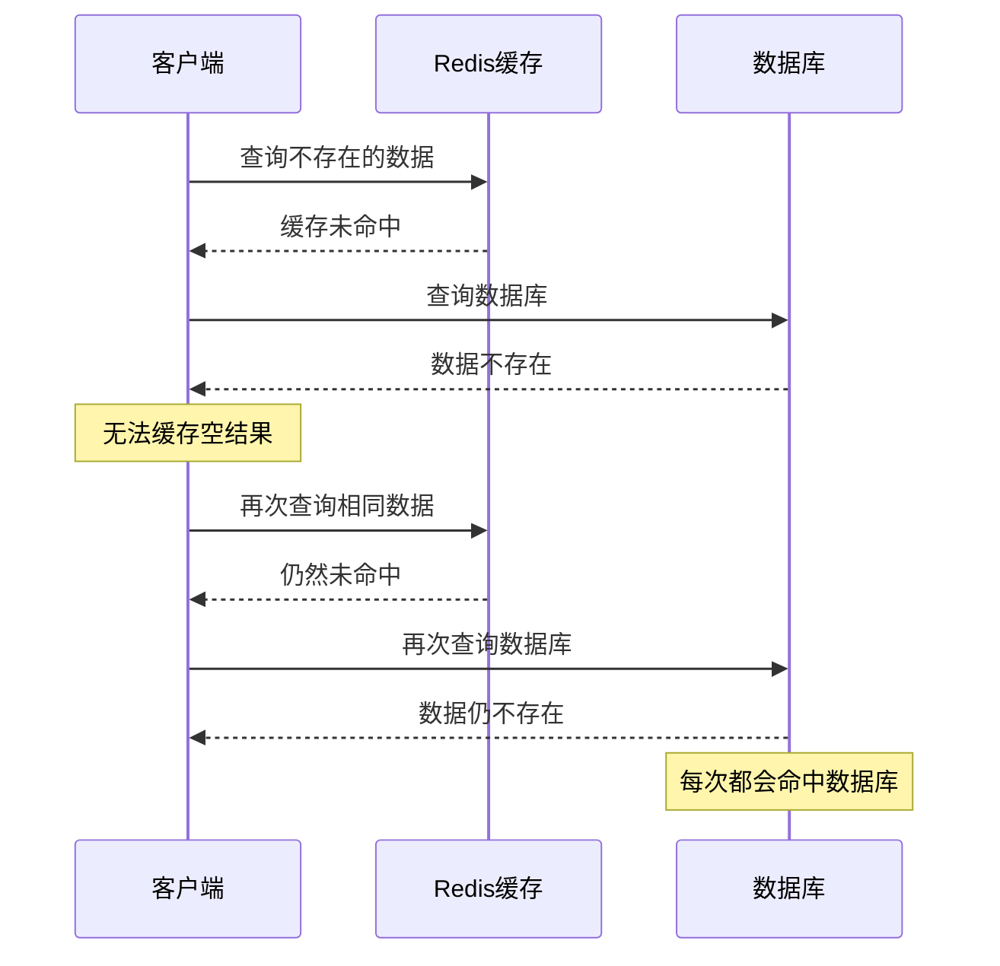

#### 3. 缓存击穿 (Cache Breakdown)

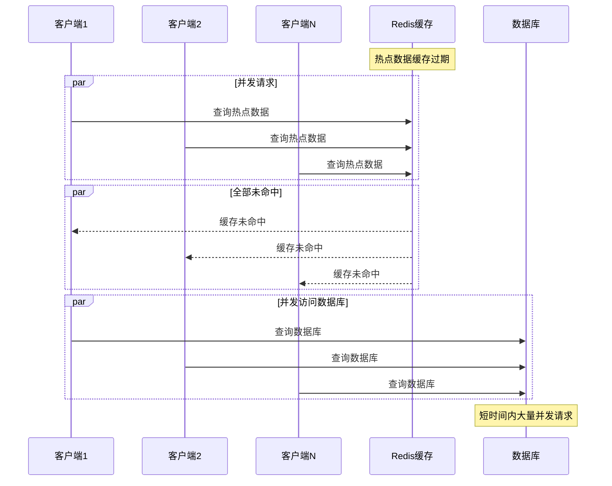

## 解决方案设计架构

### 综合解决方案框架

针对不同类型的缓存问题，需要采用对应的解决策略组合：

```mermaid
graph TD
    A[缓存问题解决方案] --> B[缓存雪崩解决]
    A --> C[缓存穿透解决]
    A --> D[缓存击穿解决]
    A --> E[缓存预热策略]
    A --> F[一致性保证]
    
    B --> B1[过期时间随机化]
    B --> B2[多级缓存架构]
    B --> B3[限流与熟断]
    B --> B4[服务降级]
    
    C --> C1[布隆过滤器]
    C --> C2[参数校验]
    C --> C3[空值缓存]
    C --> C4[请求限流]
    
    D --> D1[互斥锁机制]
    D --> D2[热点数据预加载]
    D --> D3[缓存永不过期]
    D --> D4[逖级降级]
    
    E --> E1[系统启动预热]
    E --> E2[定时刷新]
    E --> E3[懒加载策略]
    E --> E4[分批预热]
    
    F --> F1[旁路缓存模式]
    F --> F2[写穿模式]
    F --> F3[写回模式]
    F --> F4[异步更新]
    
    classDef solution fill:#e8f5e8,stroke:#4caf50,color:#000
    classDef strategy fill:#e3f2fd,stroke:#2196f3,color:#000
    
    class A solution
    class B,C,D,E,F solution
    class B1,B2,B3,B4,C1,C2,C3,C4,D1,D2,D3,D4,E1,E2,E3,E4,F1,F2,F3,F4 strategy
```

### 方案选择决策矩阵

| 解决方案 | 适用场景 | 实现复杂度 | 性能影响 | 成本 | 推荐级别 |
|------------|----------|------------|----------|------|----------|
| 过期时间随机化 | 缓存雪崩 | 低 | 无 | 低 | ★★★★★ |
| 布隆过滤器 | 缓存穿透 | 中 | 低 | 中 | ★★★★★ |
| 互斥锁 | 缓存击穿 | 中 | 中 | 低 | ★★★★ |
| 多级缓存 | 所有问题 | 高 | 高 | 高 | ★★★ |
| 空值缓存 | 缓存穿透 | 低 | 低 | 低 | ★★★★ |
| 服务降级 | 系统过载 | 高 | 高 | 中 | ★★★ |

### 核心解决方案详解

#### 1. 缓存雪崩解决方案

**方案一：过期时间随机化**

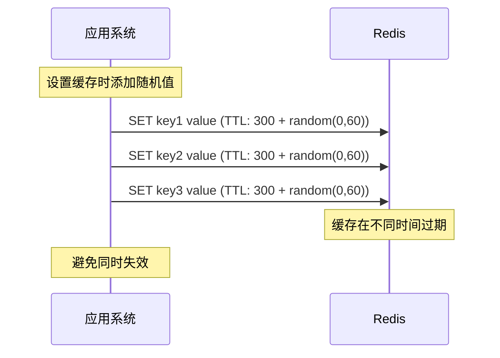

**方案二：多级缓存架构**

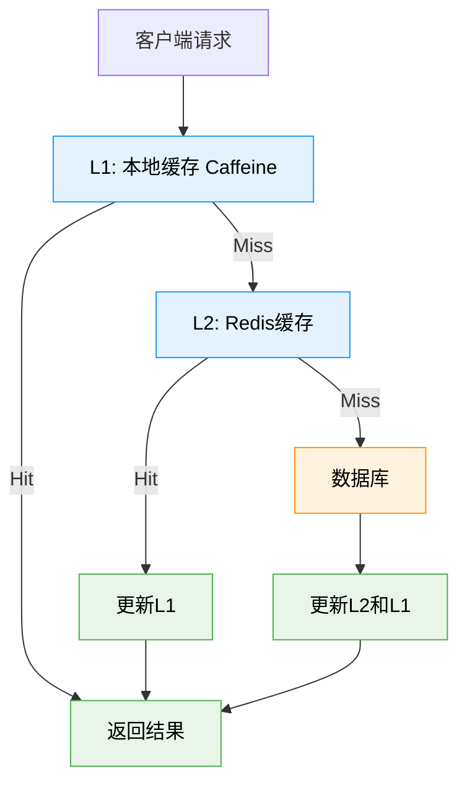

#### 2. 缓存穿透解决方案

**方案一：布隆过滤器**

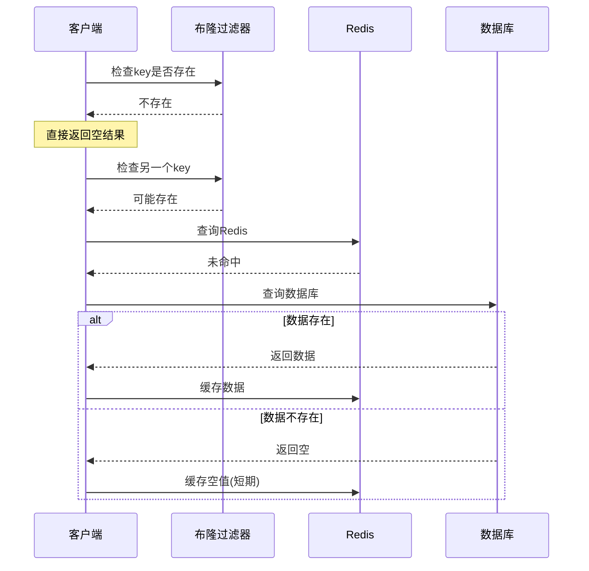

**方案二：空值缓存**

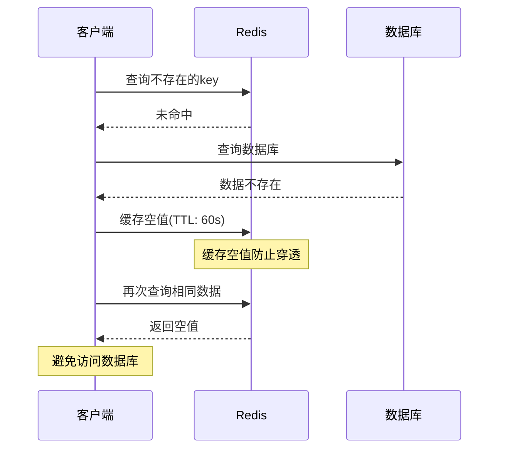

#### 3. 缓存击穿解决方案

**方案一：互斥锁机制**

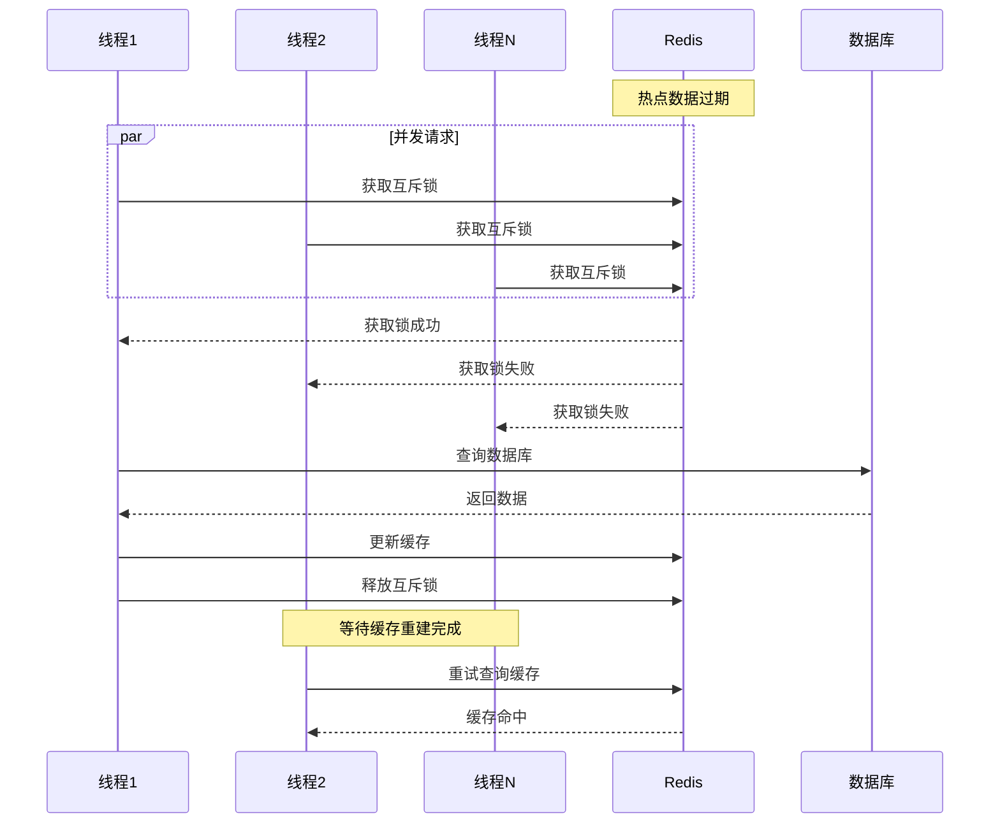

**方案二：热点数据预加载**

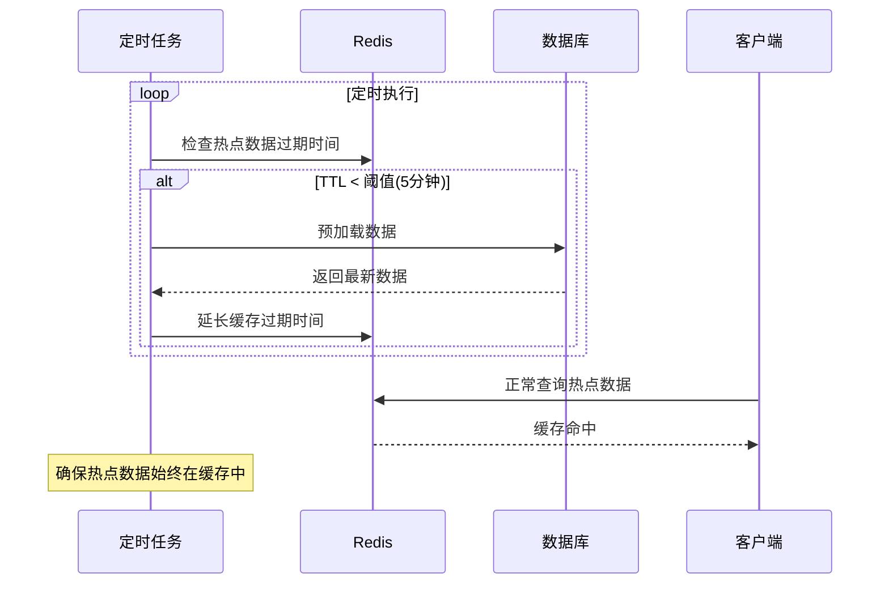

## Java实践案例设计

### 核心类结构设计

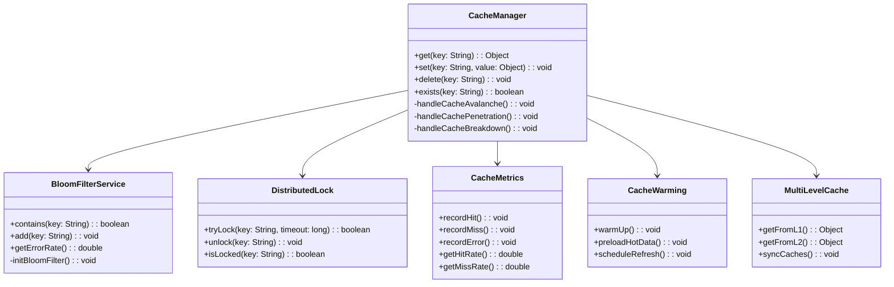

### 主要技术组件

#### 1. 核心缓存管理器

```java
@Component
@Slf4j
public class RedisCacheManager {
    
    @Autowired
    private RedisTemplate<String, Object> redisTemplate;
    
    @Autowired
    private BloomFilterService bloomFilterService;
    
    @Autowired
    private DistributedLock distributedLock;
    
    @Autowired
    private CacheMetrics cacheMetrics;
    
    private static final String NULL_VALUE = "NULL";
    private static final int NULL_VALUE_TTL = 60; // 空值缓存时间
    private static final int MUTEX_LOCK_TIMEOUT = 10; // 互斥锁超时时间
    
    /**
     * 获取缓存数据 - 综合解决方案
     */
    public <T> T get(String key, Class<T> clazz, Function<String, T> dataLoader) {
        try {
            // 1. 防止缓存穿透 - 布隆过滤器检查
            if (!bloomFilterService.contains(key)) {
                log.info("布隆过滤器判断数据不存在: {}", key);
                cacheMetrics.recordMiss();
                return null;
            }
            
            // 2. 查询Redis缓存
            Object cached = redisTemplate.opsForValue().get(key);
            if (cached != null) {
                if (NULL_VALUE.equals(cached)) {
                    cacheMetrics.recordHit();
                    return null; // 空值缓存
                }
                cacheMetrics.recordHit();
                return (T) cached;
            }
            
            // 3. 防止缓存击穿 - 互斥锁机制
            String lockKey = "lock:" + key;
            if (distributedLock.tryLock(lockKey, MUTEX_LOCK_TIMEOUT)) {
                try {
                    // 双重检查
                    cached = redisTemplate.opsForValue().get(key);
                    if (cached != null) {
                        cacheMetrics.recordHit();
                        return NULL_VALUE.equals(cached) ? null : (T) cached;
                    }
                    
                    // 加载数据
                    T data = dataLoader.apply(key);
                    
                    if (data != null) {
                        // 防止缓存雪崩 - 随机过期时间
                        int randomTtl = getRandomTtl(3600); // 基础时间 + 随机值
                        redisTemplate.opsForValue().set(key, data, randomTtl, TimeUnit.SECONDS);
                        
                        // 更新布隆过滤器
                        bloomFilterService.add(key);
                    } else {
                        // 缓存空值防止穿透
                        redisTemplate.opsForValue().set(key, NULL_VALUE, NULL_VALUE_TTL, TimeUnit.SECONDS);
                    }
                    
                    cacheMetrics.recordMiss();
                    return data;
                    
                } finally {
                    distributedLock.unlock(lockKey);
                }
            } else {
                // 获取锁失败，等待片刻后重试
                Thread.sleep(50);
                return get(key, clazz, dataLoader);
            }
            
        } catch (Exception e) {
            log.error("缓存操作异常: {}", e.getMessage(), e);
            cacheMetrics.recordError();
            // 降级处理，直接查询数据源
            return dataLoader.apply(key);
        }
    }
    
    /**
     * 生成随机过期时间 - 防止缓存雪崩
     */
    private int getRandomTtl(int baseTtl) {
        Random random = new Random();
        return baseTtl + random.nextInt(300); // 基础时间 + 0-300秒随机值
    }
}
```

#### 2. 布隆过滤器服务

```java
@Component
@Slf4j
public class BloomFilterService {
    
    private BloomFilter<String> bloomFilter;
    
    @PostConstruct
    public void initBloomFilter() {
        // 初始化布隆过滤器：预期元素数量100万，误判率0.01
        this.bloomFilter = BloomFilter.create(
            Funnels.stringFunnel(Charset.defaultCharset()),
            1000000,
            0.01
        );
        
        // 预加载已存在的数据键
        preloadExistingKeys();
    }
    
    public boolean contains(String key) {
        return bloomFilter.mightContain(key);
    }
    
    public void add(String key) {
        bloomFilter.put(key);
    }
    
    public double getErrorRate() {
        return bloomFilter.expectedFpp();
    }
    
    /**
     * 预加载已存在的数据键
     */
    private void preloadExistingKeys() {
        // 这里可以从数据库加载已存在的数据键
        // 简化示例，实际中需要根据业务实现
        log.info("布隆过滤器初始化完成，误判率: {}", getErrorRate());
    }
}
```

#### 3. 分布式锁实现

```java
@Component
@Slf4j
public class RedisDistributedLock implements DistributedLock {
    
    @Autowired
    private RedisTemplate<String, String> redisTemplate;
    
    private static final String LOCK_PREFIX = "distributed_lock:";
    private static final String UNLOCK_SCRIPT = 
        "if redis.call('get', KEYS[1]) == ARGV[1] then " +
        "return redis.call('del', KEYS[1]) else return 0 end";
    
    @Override
    public boolean tryLock(String key, long timeoutSeconds) {
        String lockKey = LOCK_PREFIX + key;
        String lockValue = UUID.randomUUID().toString();
        
        Boolean success = redisTemplate.opsForValue().setIfAbsent(
            lockKey, lockValue, timeoutSeconds, TimeUnit.SECONDS
        );
        
        if (Boolean.TRUE.equals(success)) {
            // 将锁值存储在ThreadLocal中，用于后续解锁
            ThreadLocalLockContext.setLockValue(lockKey, lockValue);
            log.debug("获取分布式锁成功: {}", lockKey);
            return true;
        }
        
        log.debug("获取分布式锁失败: {}", lockKey);
        return false;
    }
    
    @Override
    public void unlock(String key) {
        String lockKey = LOCK_PREFIX + key;
        String lockValue = ThreadLocalLockContext.getLockValue(lockKey);
        
        if (lockValue != null) {
            // 使用Lua脚本保证原子性
            DefaultRedisScript<Long> script = new DefaultRedisScript<>(UNLOCK_SCRIPT, Long.class);
            Long result = redisTemplate.execute(script, Collections.singletonList(lockKey), lockValue);
            
            if (result != null && result == 1) {
                log.debug("释放分布式锁成功: {}", lockKey);
            } else {
                log.warn("释放分布式锁失败，锁可能已过期: {}", lockKey);
            }
            
            ThreadLocalLockContext.clearLockValue(lockKey);
        }
    }
    
    @Override
    public boolean isLocked(String key) {
        String lockKey = LOCK_PREFIX + key;
        return Boolean.TRUE.equals(redisTemplate.hasKey(lockKey));
    }
}

/**
 * ThreadLocal管理锁上下文
 */
class ThreadLocalLockContext {
    private static final ThreadLocal<Map<String, String>> LOCK_CONTEXT = 
        ThreadLocal.withInitial(HashMap::new);
    
    public static void setLockValue(String lockKey, String lockValue) {
        LOCK_CONTEXT.get().put(lockKey, lockValue);
    }
    
    public static String getLockValue(String lockKey) {
        return LOCK_CONTEXT.get().get(lockKey);
    }
    
    public static void clearLockValue(String lockKey) {
        LOCK_CONTEXT.get().remove(lockKey);
    }
    
    public static void clear() {
        LOCK_CONTEXT.remove();
    }
}
```

#### 4. 缓存监控指标

```java
@Component
public class CacheMetrics {
    
    private final Counter hitCounter;
    private final Counter missCounter;
    private final Counter errorCounter;
    private final Timer cacheTimer;
    
    public CacheMetrics(MeterRegistry meterRegistry) {
        this.hitCounter = Counter.builder("cache.hit")
            .description("缓存命中次数")
            .register(meterRegistry);
            
        this.missCounter = Counter.builder("cache.miss")
            .description("缓存未命中次数")
            .register(meterRegistry);
            
        this.errorCounter = Counter.builder("cache.error")
            .description("缓存错误次数")
            .register(meterRegistry);
            
        this.cacheTimer = Timer.builder("cache.operation")
            .description("缓存操作耗时")
            .register(meterRegistry);
    }
    
    public void recordHit() {
        hitCounter.increment();
    }
    
    public void recordMiss() {
        missCounter.increment();
    }
    
    public void recordError() {
        errorCounter.increment();
    }
    
    public double getHitRate() {
        double total = hitCounter.count() + missCounter.count();
        return total > 0 ? hitCounter.count() / total : 0.0;
    }
    
    public double getMissRate() {
        return 1.0 - getHitRate();
    }
    
    public Timer.Sample startTimer() {
        return Timer.start();
    }
    
    public void recordTime(Timer.Sample sample) {
        sample.stop(cacheTimer);
    }
}
```

## 监控与诊断策略

### 关键指标监控

为了及时发现和处理缓存问题，需要建立完善的监控体系：

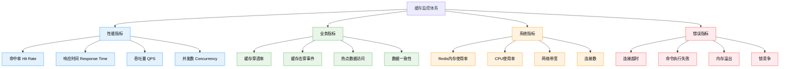

#### 监控指标配置

```java
@Component
@ConfigurationProperties(prefix = "cache.monitoring")
public class CacheMonitoringConfig {
    
    /**
     * 缓存命中率监控配置
     */
    @Component
    public static class HitRateMonitor {
        
        @Autowired
        private MeterRegistry meterRegistry;
        
        @Scheduled(fixedRate = 60000) // 每分钟检查
        public void monitorHitRate() {
            double hitRate = calculateHitRate();
            
            // 记录指标
            Gauge.builder("cache.hit_rate")
                .description("缓存命中率")
                .register(meterRegistry, hitRate);
            
            // 预警检查
            if (hitRate < 0.8) { // 命中率低于80%
                sendAlert("Cache hit rate is low: " + hitRate);
            }
        }
        
        private double calculateHitRate() {
            // 从监控系统获取命中率数据
            return 0.85; // 示例值
        }
        
        private void sendAlert(String message) {
            log.warn("缓存监控预警: {}", message);
            // 可以集成钉钉、邮件等通知方式
        }
    }
    
    /**
     * 缓存穿透监控
     */
    @Component
    public static class PenetrationMonitor {
        
        private final AtomicLong penetrationCount = new AtomicLong(0);
        private final AtomicLong lastResetTime = new AtomicLong(System.currentTimeMillis());
        
        public void recordPenetration() {
            penetrationCount.incrementAndGet();
        }
        
        @Scheduled(fixedRate = 30000) // 30秒检查一次
        public void checkPenetrationRate() {
            long currentTime = System.currentTimeMillis();
            long lastReset = lastResetTime.get();
            long timeWindow = currentTime - lastReset;
            
            if (timeWindow >= 30000) { // 30秒窗口
                long count = penetrationCount.getAndSet(0);
                lastResetTime.set(currentTime);
                
                double rate = (double) count / (timeWindow / 1000.0); // 每秒穿透率
                
                if (rate > 10) { // 每秒超过10次穿透
                    sendAlert(String.format("High cache penetration rate: %.2f/s", rate));
                }
            }
        }
        
        private void sendAlert(String message) {
            log.error("缓存穿透预警: {}", message);
        }
    }
}
```

### 问题诊断流程

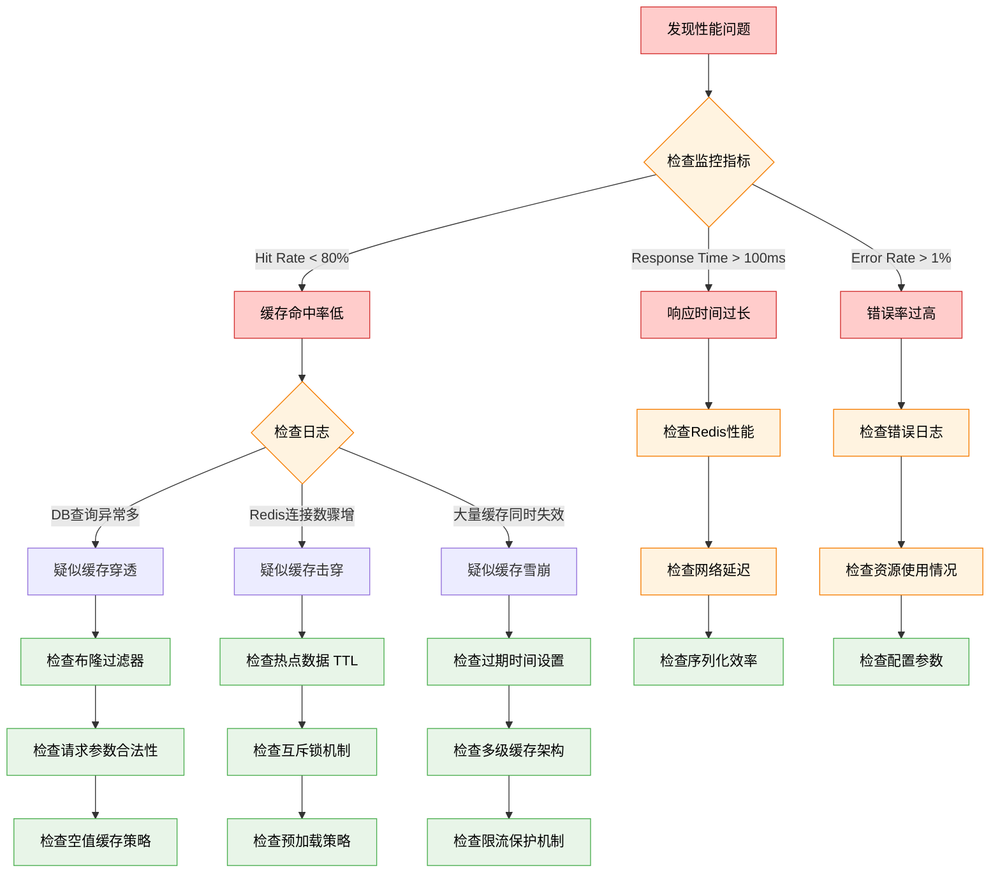

### 常用诊断命令

```bash
# 1. 检查Redis基本信息
redis-cli info

# 2. 查看缓存命中率
redis-cli info stats | grep keyspace

# 3. 监控实时命令
redis-cli monitor

# 4. 查看慢查询日志
redis-cli slowlog get 10

# 5. 检查内存使用
redis-cli info memory

# 6. 查看连接数
redis-cli info clients

# 7. 检查数据库大小
redis-cli --bigkeys

# 8. 监控网络延迟
redis-cli --latency
```

## 最佳实践与优化建议

### 缓存设计原则

#### 1. 数据类型选择

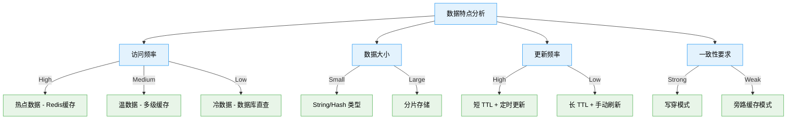

#### 2. TTL策略设计

```java
@Component
public class TTLStrategy {
    
    /**
     * 根据数据类型获取TTL
     */
    public int getTTL(String dataType, String key) {
        int baseTtl;
        
        switch (dataType) {
            case "hot_data":
                baseTtl = 3600; // 热点数据 1小时
                break;
            case "warm_data":
                baseTtl = 7200; // 温数据 2小时
                break;
            case "cold_data":
                baseTtl = 86400; // 冷数据 24小时
                break;
            case "static_data":
                baseTtl = 604800; // 静态数据 7天
                break;
            default:
                baseTtl = 1800; // 默认 30分钟
        }
        
        // 添加随机扰动防止雪崩
        Random random = new Random();
        int randomOffset = random.nextInt(baseTtl / 10); // 10%的随机扰动
        
        return baseTtl + randomOffset;
    }
    
    /**
     * 动态调整TTL策略
     */
    public int getAdaptiveTTL(String key, double hitRate, long accessCount) {
        int baseTtl = 3600;
        
        // 根据命中率调整
        if (hitRate > 0.95) {
            baseTtl *= 2; // 高命中率，延长缓存时间
        } else if (hitRate < 0.8) {
            baseTtl /= 2; // 低命中率，缩短缓存时间
        }
        
        // 根据访问频率调整
        if (accessCount > 1000) {
            baseTtl *= 1.5; // 高频访问，延长缓存
        }
        
        return baseTtl;
    }
}
```

### 容量规划指导

#### Redis内存估算

```java
@Component
public class CapacityPlanner {
    
    /**
     * 估算Redis内存需求
     */
    public MemoryEstimate estimateMemoryUsage(
            long expectedKeys, 
            int avgValueSize, 
            double replicationFactor,
            double memoryOverhead) {
        
        // 基础数据大小
        long dataSize = expectedKeys * (50 + avgValueSize); // 50字节key开销
        
        // 考虑Redis内部开销（索引、过期等）
        long totalSize = (long) (dataSize * (1 + memoryOverhead));
        
        // 考虑主从复制
        long finalSize = (long) (totalSize * replicationFactor);
        
        return new MemoryEstimate(dataSize, totalSize, finalSize);
    }
    
    /**
     * 内存使用情况监控
     */
    @Scheduled(fixedRate = 300000) // 5分钟检查一次
    public void monitorMemoryUsage() {
        // 获取内存使用情况
        RedisMemoryInfo memInfo = getRedisMemoryInfo();
        
        double usageRatio = (double) memInfo.getUsedMemory() / memInfo.getMaxMemory();
        
        if (usageRatio > 0.85) {
            log.warn("Redis内存使用率过高: {:.2f}%", usageRatio * 100);
            
            // 触发清理策略
            triggerCleanupStrategy();
        }
    }
    
    private void triggerCleanupStrategy() {
        // 1. 清理已过期的key
        // 2. 清理低频访问的key
        // 3. 调整缓存策略
        log.info("执行内存清理策略");
    }
    
    @Data
    @AllArgsConstructor
    public static class MemoryEstimate {
        private long dataSize;
        private long totalSize;
        private long finalSize;
    }
}
```

### 性能优化建议

1. **网络优化**
   - 使用连接池减少连接开销
   - 启用Pipeline批量操作
   - 使用压缩减少网络传输

2. **序列化优化**
   - 选择高效的序列化协议（Protobuf、Kryo）
   - 避免存储复杂对象，优先JSON等简单格式

3. **数据结构优化**
   - 合理使用Hash、List等集合类型
   - 避免大Key，适当分片
   - 使用适当的数据类型减少内存开销

4. **并发优化**
   - 合理设置连接池参数
   - 使用异步处理非关键操作
   - 实现限流保护机制