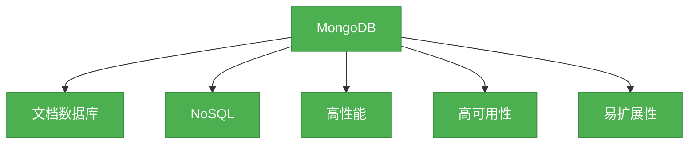

# 1. Mongo数据库概述

## 概述
MongoDB是一个开源的NoSQL文档数据库，它使用类似JSON的BSON格式来存储数据。MongoDB的设计理念是提供高性能、高可用性和易扩展性的数据库解决方案，适合处理大量的非结构化或半结构化数据。



## 知识要点
### 1. 核心概念
- **文档(Document)**: MongoDB中最基本的数据单元，类似于关系型数据库中的行，使用BSON格式存储。
- **集合(Collection)**: 文档的集合，类似于关系型数据库中的表，但不需要固定的 schema。
- **数据库(Database)**: 集合的容器，一个MongoDB实例可以包含多个数据库。
- **字段(Field)**: 文档中的键值对，类似于关系型数据库中的列。

```java
// 示例：MongoDB中的文档结构
{
  "_id": ObjectId("60f7a4b3e9a2c34567890123"),
  "name": "张三",
  "age": 30,
  "address": {
    "city": "北京",
    "street": "朝阳区"
  },
  "hobbies": ["读书", "旅行"]
}
```

### 2. 支持的数据类型
- 基本类型: 字符串、数字、布尔值、null
- 复杂类型: 数组、对象、日期、正则表达式
- 特殊类型: ObjectId、Binary Data、Code、Timestamp

### 3. MongoDB的主要优势
- ** schema 灵活性**: 不需要预定义表结构，可以灵活地存储不同结构的数据。
- **查询能力**: 支持丰富的查询操作，包括过滤、排序、分页等。
- **索引支持**: 支持多种类型的索引，提高查询性能。
- **聚合框架**: 提供强大的聚合功能，可以进行复杂的数据处理。
- **高可用性**: 通过复制集(replica set)实现高可用性和数据冗余。
- **可扩展性**: 通过分片(sharding)实现水平扩展。

## 知识扩展
### 1. 设计思想
MongoDB的设计思想是拥抱数据的多样性和变化性，不再强制要求数据符合固定的 schema，而是允许数据结构随着应用的发展而演变。这种设计理念使得MongoDB特别适合处理快速变化的业务需求和非结构化数据。

### 2. 避坑指南
- 不要过度使用嵌套文档，这会使查询和更新变得复杂。
- 合理设计索引，避免创建过多的索引导致写性能下降。
- 注意数据一致性问题，MongoDB默认是最终一致性的。
- 对于大量的小文档，考虑使用批量操作来提高性能。

### 3. 深度思考题
- MongoDB和关系型数据库的主要区别是什么？各自的适用场景是什么？
- 什么是CAP定理？MongoDB是如何在CAP之间做出权衡的？
- 为什么说MongoDB是无模式的？这带来了哪些优势和挑战？

**深度思考题回答:**
- MongoDB和关系型数据库的主要区别在于数据模型、schema灵活性、扩展方式等。关系型数据库适合处理结构化数据、复杂的事务和关联查询；MongoDB适合处理非结构化或半结构化数据、需要快速迭代的业务需求和大规模的数据存储。
- CAP定理指出，一个分布式系统不可能同时满足一致性(Consistency)、可用性(Availability)和分区容错性(Partition Tolerance)。MongoDB在设计上优先考虑了可用性和分区容错性，同时提供了一些机制来提高一致性，如读写关注级别。
- MongoDB的无模式是指不需要预定义表结构，文档可以有不同的字段和结构。这带来的优势是灵活性高、开发效率高；挑战是数据一致性难以保证、查询和索引设计更加复杂。