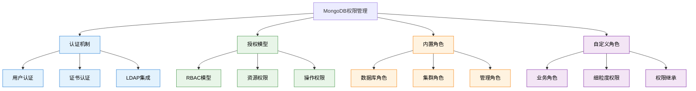

# 核心-权限管理

## 概述

MongoDB权限管理是企业级部署的重要组成部分，通过基于角色的访问控制（RBAC）模型，为数据库提供细粒度的安全保护。合理的权限设计不仅能保护敏感数据，还能实现职责分离，确保系统的安全性和合规性。

在实际企业环境中，权限管理涉及用户认证、角色定义、资源授权、审计日志等多个层面。从开发环境到生产环境，从普通开发者到数据库管理员，不同的用户需要不同的权限级别。



## 知识要点

### 1. 认证与授权基础

#### 1.1 用户管理

MongoDB用户管理基于数据库级别，每个用户属于特定的数据库：

```javascript
// MongoDB Shell - 用户管理操作

// 1. 创建管理员用户（在admin数据库）
use admin
db.createUser({
  user: "dbAdmin",
  pwd: "securePassword123!",
  roles: [
    { role: "userAdminAnyDatabase", db: "admin" },
    { role: "dbAdminAnyDatabase", db: "admin" },
    { role: "readWriteAnyDatabase", db: "admin" }
  ]
})

// 2. 创建应用用户（在业务数据库）
use ecommerce
db.createUser({
  user: "appUser",
  pwd: "appPassword456!",
  roles: [
    { role: "readWrite", db: "ecommerce" },
    { role: "read", db: "analytics" }
  ]
})

// 3. 创建只读用户
use ecommerce
db.createUser({
  user: "reportUser",
  pwd: "reportPassword789!",
  roles: [
    { role: "read", db: "ecommerce" },
    { role: "read", db: "analytics" }
  ]
})

// 4. 查看用户信息
db.getUser("appUser")

// 5. 修改用户权限
db.updateUser("appUser", {
  roles: [
    { role: "readWrite", db: "ecommerce" },
    { role: "read", db: "analytics" },
    { role: "read", db: "logs" }
  ]
})

// 6. 删除用户
db.dropUser("oldUser")
```

#### 1.2 认证配置

```yaml
# mongod.conf - 安全配置
security:
  authorization: enabled
  clusterAuthMode: keyFile
  keyFile: /etc/mongodb/mongodb-keyfile
  
# 网络安全
net:
  bindIp: 127.0.0.1,10.0.0.100
  port: 27017
  ssl:
    mode: requireSSL
    PEMKeyFile: /etc/ssl/mongodb.pem
    CAFile: /etc/ssl/ca.pem

# 审计日志
auditLog:
  destination: file
  format: JSON
  path: /var/log/mongodb/audit.json
  filter: '{ atype: { $in: ["authenticate", "authCheck", "createUser", "dropUser"] } }'
```

### 2. 内置角色体系

#### 2.1 数据库级别角色

```java
// Java Spring Boot中的MongoDB权限配置
@Configuration
@EnableMongoSecurity
public class MongoSecurityConfig {
    
    // 不同环境的用户配置
    @Bean
    @Profile("development")
    public MongoClientSettings devMongoClientSettings() {
        MongoCredential credential = MongoCredential.createCredential(
            "devUser",
            "ecommerce",
            "devPassword".toCharArray()
        );
        
        return MongoClientSettings.builder()
            .applyToClusterSettings(builder -> 
                builder.hosts(Arrays.asList(new ServerAddress("localhost", 27017))))
            .credential(credential)
            .build();
    }
    
    @Bean
    @Profile("production")
    public MongoClientSettings prodMongoClientSettings() {
        MongoCredential credential = MongoCredential.createCredential(
            "prodAppUser",
            "ecommerce",
            System.getenv("MONGO_PASSWORD").toCharArray()
        );
        
        return MongoClientSettings.builder()
            .applyToClusterSettings(builder -> 
                builder.hosts(Arrays.asList(
                    new ServerAddress("mongo1.example.com", 27017),
                    new ServerAddress("mongo2.example.com", 27017),
                    new ServerAddress("mongo3.example.com", 27017)
                )))
            .credential(credential)
            .applyToSslSettings(builder -> 
                builder.enabled(true)
                    .invalidHostNameAllowed(false))
            .build();
    }
}

// 权限检查服务
@Service
public class DatabasePermissionService {
    
    @Autowired
    private MongoTemplate mongoTemplate;
    
    // 检查当前用户权限
    public UserPermissions getCurrentUserPermissions() {
        try {
            // 执行权限检查命令
            Document result = mongoTemplate.getDb()
                .runCommand(new Document("usersInfo", 1));
            
            List<Document> users = result.getList("users", Document.class);
            if (users.isEmpty()) {
                throw new UnauthorizedException("No authenticated user found");
            }
            
            Document currentUser = users.get(0);
            List<Document> roles = currentUser.getList("roles", Document.class);
            
            return UserPermissions.builder()
                .username(currentUser.getString("user"))
                .database(currentUser.getString("db"))
                .roles(parseRoles(roles))
                .build();
                
        } catch (Exception e) {
            log.error("Failed to get user permissions", e);
            throw new SecurityException("Permission check failed");
        }
    }
    
    // 验证操作权限
    public boolean hasPermission(String collection, String action) {
        UserPermissions permissions = getCurrentUserPermissions();
        
        return permissions.getRoles().stream()
            .anyMatch(role -> role.hasPermission(collection, action));
    }
    
    // 基于权限的查询
    public <T> List<T> findWithPermissionCheck(
            Query query, 
            Class<T> entityClass,
            String requiredPermission) {
        
        String collection = getCollectionName(entityClass);
        
        if (!hasPermission(collection, requiredPermission)) {
            throw new AccessDeniedException(
                "Insufficient permissions for " + requiredPermission + 
                " on collection " + collection
            );
        }
        
        return mongoTemplate.find(query, entityClass);
    }
}
```

### 3. 自定义角色设计

#### 3.1 业务角色定义

```javascript
// 电商系统自定义角色设计

// 1. 商品管理员角色
use ecommerce
db.createRole({
  role: "productManager",
  privileges: [
    {
      resource: { db: "ecommerce", collection: "products" },
      actions: ["find", "insert", "update", "remove"]
    },
    {
      resource: { db: "ecommerce", collection: "categories" },
      actions: ["find", "insert", "update", "remove"]
    },
    {
      resource: { db: "ecommerce", collection: "inventory" },
      actions: ["find", "update"]
    },
    // 只能查看订单，不能修改
    {
      resource: { db: "ecommerce", collection: "orders" },
      actions: ["find"]
    }
  ],
  roles: []
})

// 2. 订单管理员角色
db.createRole({
  role: "orderManager",
  privileges: [
    {
      resource: { db: "ecommerce", collection: "orders" },
      actions: ["find", "update"]  // 可以查看和更新订单状态
    },
    {
      resource: { db: "ecommerce", collection: "customers" },
      actions: ["find"]  // 只能查看客户信息
    },
    {
      resource: { db: "ecommerce", collection: "products" },
      actions: ["find"]  // 只能查看商品信息
    },
    {
      resource: { db: "ecommerce", collection: "shipping" },
      actions: ["find", "insert", "update"]
    }
  ],
  roles: []
})

// 3. 客服角色
db.createRole({
  role: "customerService",
  privileges: [
    {
      resource: { db: "ecommerce", collection: "customers" },
      actions: ["find", "update"]
    },
    {
      resource: { db: "ecommerce", collection: "orders" },
      actions: ["find"]
    },
    {
      resource: { db: "ecommerce", collection: "support_tickets" },
      actions: ["find", "insert", "update"]
    }
  ],
  roles: []
})

// 4. 分析师角色（只读权限）
db.createRole({
  role: "dataAnalyst",
  privileges: [
    {
      resource: { db: "ecommerce", collection: "" },
      actions: ["find"]  // 对所有集合的只读权限
    },
    {
      resource: { db: "analytics", collection: "" },
      actions: ["find", "insert", "update"]  // 分析数据库的读写权限
    }
  ],
  roles: []
})

// 5. 创建具有自定义角色的用户
db.createUser({
  user: "productManager1",
  pwd: "productMgrPassword!",
  roles: [
    { role: "productManager", db: "ecommerce" }
  ]
})
```

#### 3.2 细粒度权限控制

```java
// Java中实现细粒度权限控制
@Service
public class FinegrainedPermissionService {
    
    @Autowired
    private MongoTemplate mongoTemplate;
    
    // 基于用户角色的数据过滤
    public List<Order> getOrdersForCurrentUser(String userRole, String userId) {
        Query query = new Query();
        
        switch (userRole) {
            case "customer":
                // 客户只能查看自己的订单
                query.addCriteria(Criteria.where("customerId").is(userId));
                break;
                
            case "customerService":
                // 客服可以查看所有订单，但不包含敏感信息
                query.fields()
                    .exclude("payment.cardDetails")
                    .exclude("customer.personalId");
                break;
                
            case "orderManager":
                // 订单管理员可以查看所有订单信息
                break;
                
            case "dataAnalyst":
                // 分析师只能查看匿名化的数据
                query.fields()
                    .exclude("customer.name")
                    .exclude("customer.email")
                    .exclude("customer.phone")
                    .exclude("shipping.address");
                break;
                
            default:
                throw new AccessDeniedException("Invalid role: " + userRole);
        }
        
        return mongoTemplate.find(query, Order.class);
    }
    
    // 基于权限的写入控制
    @PreAuthorize("hasPermission(#order, 'UPDATE')")
    public Order updateOrder(Order order, String userRole) {
        // 根据角色限制可更新的字段
        Update update = new Update();
        
        switch (userRole) {
            case "orderManager":
                // 订单管理员可以更新状态和物流信息
                if (order.getStatus() != null) {
                    update.set("status", order.getStatus());
                }
                if (order.getShipping() != null) {
                    update.set("shipping", order.getShipping());
                }
                break;
                
            case "customerService":
                // 客服只能更新客户备注
                if (order.getCustomerNotes() != null) {
                    update.set("customerNotes", order.getCustomerNotes());
                }
                break;
                
            default:
                throw new AccessDeniedException("User role cannot update orders: " + userRole);
        }
        
        Query query = Query.query(Criteria.where("_id").is(order.getId()));
        mongoTemplate.updateFirst(query, update, Order.class);
        
        return mongoTemplate.findById(order.getId(), Order.class);
    }
}

// 权限注解实现
@Target(ElementType.METHOD)
@Retention(RetentionPolicy.RUNTIME)
public @interface RequirePermission {
    String collection();
    String action();
    String message() default "Access denied";
}

@Aspect
@Component
public class PermissionAspect {
    
    @Autowired
    private DatabasePermissionService permissionService;
    
    @Before