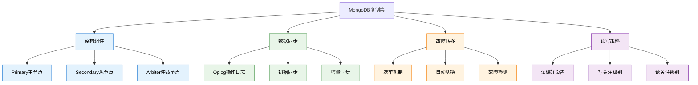

# 高级-复制集

## 概述

MongoDB复制集（Replica Set）是实现高可用性和数据冗余的核心机制，通过在多个服务器之间自动同步数据，确保即使在单点故障的情况下，数据库服务依然可用。复制集不仅提供了自动故障转移能力，还支持读写分离，提升了系统的整体性能和可靠性。

在企业级部署中，复制集是生产环境的标准配置。从金融系统的交易数据到电商平台的用户信息，从物联网的传感器数据到内容管理系统，复制集为关键业务数据提供了可靠的保护机制。



## 知识要点

### 1. 复制集架构与配置

#### 1.1 复制集初始化

```javascript
// MongoDB Shell - 复制集配置

// 1. 初始化复制集配置
rs.initiate({
  _id: "ecommerce-replica",
  members: [
    {
      _id: 0,
      host: "mongo1.example.com:27017",
      priority: 2,        // 高优先级，优先成为Primary
      tags: { datacenter: "dc1", usage: "primary" }
    },
    {
      _id: 1,
      host: "mongo2.example.com:27017",
      priority: 1,
      tags: { datacenter: "dc1", usage: "secondary" }
    },
    {
      _id: 2,
      host: "mongo3.example.com:27017",
      priority: 1,
      tags: { datacenter: "dc2", usage: "secondary" }
    }
  ],
  settings: {
    electionTimeoutMillis: 10000,    // 选举超时时间
    heartbeatIntervalMillis: 2000,   // 心跳间隔
    heartbeatTimeoutSecs: 10,        // 心跳超时
    catchUpTimeoutMillis: 60000      // 追赶超时时间
  }
})

// 2. 查看复制集状态
rs.status()

// 3. 查看复制集配置
rs.conf()

// 4. 添加新成员
rs.add({
  host: "mongo4.example.com:27017",
  priority: 0.5,
  hidden: true,        // 隐藏节点，不参与读取
  tags: { usage: "backup" }
})

// 5. 添加仲裁节点
rs.addArb("arbiter.example.com:27017")

// 6. 移除成员
rs.remove("mongo4.example.com:27017")

// 7. 修改成员配置
cfg = rs.conf()
cfg.members[1].priority = 0.5
cfg.members[1].hidden = true
rs.reconfig(cfg)
```

#### 1.2 Java应用连接配置

```java
// Spring Boot中的复制集连接配置
@Configuration
public class MongoReplicaSetConfig {
    
    // 生产环境复制集配置
    @Bean
    @Profile("production")
    public MongoClientSettings prodMongoClientSettings() {
        
        // 连接字符串配置
        String connectionString = "mongodb://appUser:password@" +
            "mongo1.example.com:27017," +
            "mongo2.example.com:27017," +
            "mongo3.example.com:27017/" +
            "ecommerce?replicaSet=ecommerce-replica&" +
            "readPreference=secondaryPreferred&" +
            "w=majority&" +
            "retryWrites=true&" +
            "authSource=ecommerce";
        
        return MongoClientSettings.builder()
            .applyConnectionString(new ConnectionString(connectionString))
            .applyToConnectionPoolSettings(builder ->
                builder.maxSize(100)                     // 最大连接数
                    .minSize(10)                         // 最小连接数
                    .maxWaitTime(30, TimeUnit.SECONDS)   // 获取连接超时
                    .maxConnectionIdleTime(0, TimeUnit.SECONDS)
                    .maxConnectionLifeTime(0, TimeUnit.SECONDS)
            )
            .applyToServerSettings(builder ->
                builder.heartbeatFrequency(10, TimeUnit.SECONDS)
                    .minHeartbeatFrequency(500, TimeUnit.MILLISECONDS)
            )
            .applyToSocketSettings(builder ->
                builder.connectTimeout(10, TimeUnit.SECONDS)
                    .readTimeout(0, TimeUnit.SECONDS)
            )
            .retryWrites(true)                           // 启用写重试
            .build();
    }
    
    // 开发环境单节点配置
    @Bean
    @Profile("development")
    public MongoClientSettings devMongoClientSettings() {
        return MongoClientSettings.builder()
            .applyConnectionString(new ConnectionString(
                "mongodb://localhost:27017/ecommerce"))
            .build();
    }
}

// 复制集状态监控服务
@Service
public class ReplicaSetMonitoringService {
    
    @Autowired
    private MongoClient mongoClient;
    
    // 获取复制集状态
    public ReplicaSetStatus getReplicaSetStatus() {
        try {
            MongoDatabase adminDb = mongoClient.getDatabase("admin");
            Document result = adminDb.runCommand(new Document("replSetGetStatus", 1));
            
            return parseReplicaSetStatus(result);
            
        } catch (Exception e) {
            log.error("Failed to get replica set status", e);
            throw new MonitoringException("Replica set status check failed", e);
        }
    }
    
    private ReplicaSetStatus parseReplicaSetStatus(Document result) {
        String setName = result.getString("set");
        Date date = result.getDate("date");
        int myState = result.getInteger("myState");
        
        List<Document> members = result.getList("members", Document.class);
        List<MemberStatus> memberStatuses = members.stream()
            .map(this::parseMemberStatus)
            .collect(Collectors.toList());
        
        return ReplicaSetStatus.builder()
            .setName(setName)
            .date(date)
            .myState(myState)
            .members(memberStatuses)
            .build();
    }
    
    private MemberStatus parseMemberStatus(Document member) {
        return MemberStatus.builder()
            .id(member.getInteger("_id"))
            .name(member.getString("name"))
            .health(member.getInteger("health"))
            .state(member.getInteger("state"))
            .stateStr(member.getString("stateStr"))
            .uptime(member.getLong("uptime"))
            .optimeDate(member.getDate("optimeDate"))
            .lastHeartbeat(member.getDate("lastHeartbeat"))
            .pingMs(member.getLong("pingMs"))
            .build();
    }
    
    // 检查复制集健康状态
    @Scheduled(fixedRate = 60000)  // 每分钟检查一次
    public void checkReplicaSetHealth() {
        try {
            ReplicaSetStatus status = getReplicaSetStatus();
            
            // 检查主节点状态
            Optional<MemberStatus> primary = status.getMembers().stream()
                .filter(member -> member.getState() == 1)  // PRIMARY = 1
                .findFirst();
            
            if (!primary.isPresent()) {
                alertService.sendAlert("No primary node found in replica set");
                return;
            }
            
            // 检查从节点同步延迟
            MemberStatus primaryNode = primary.get();
            Date primaryOptime = primaryNode.getOptimeDate();
            
            for (MemberStatus member : status.getMembers()) {
                if (member.getState() == 2) {  // SECONDARY = 2
                    Date memberOptime = member.getOptimeDate();
                    long lagMs = primaryOptime.getTime() - memberOptime.getTime();
                    
                    if (lagMs > 30000) {  // 超过30秒延迟
                        alertService.sendAlert(String.format(
                            "High replication lag detected: %s is %dms behind primary",
                            member.getName(), lagMs
                        ));
                    }
                }
            }
            
            // 检查节点健康状态
            long unhealthyNodes = status.getMembers().stream()
                .filter(member -> member.getHealth() != 1)
                .count();
            
            if (unhealthyNodes > 0) {
                alertService.sendAlert(String.format(
                    "%d unhealthy nodes detected in replica set", unhealthyNodes
                ));
            }
            
        } catch (Exception e) {
            log.error("Replica set health check failed", e);
        }
    }
}
```

### 2. 读写策略配置

#### 2.1 读偏好设置

```java
// 不同业务场景的读偏好配置
@Service
public class ReadPreferenceOptimizationService {
    
    @Autowired
    private MongoTemplate mongoTemplate;
    
    // 强一致性读取 - 重要业务数据
    public User getUserForCriticalOperation(String userId) {
        Query query = Query.query(Criteria.where("_id").is(userId));
        
        // 强制从主节点读取，确保数据最新
        MongoTemplate primaryTemplate = createTemplateWithReadPreference(
            ReadPreference.primary()
        );
        
        return primaryTemplate.findOne(query, User.class);
    }
    
    // 最终一致性读取 - 分析统计数据
    public List<OrderStatistics> getOrderStatistics(Date startDate, Date endDate) {
        Query query = Query.query(
            Criteria.where("createdAt").gte(startDate).lt(endDate)
        );
        
        // 从次要节点读取，减轻主节点压力
        MongoTemplate secondaryTemplate = createTemplateWithReadPreference(
            ReadPreference.secondaryPreferred()
        );
        
        return secondaryTemplate.find(query, OrderStatistics.class);
    }
    
    // 地理位置就近读取 - 跨地域部署
    public List<Product> getProductsNearUser(String userLocation) {
        Query query = Query.query(Criteria.where("isActive").is(true));
        
        // 根据用户位置选择读偏好
        ReadPreference readPreference = selectReadPreferenceByLocation(userLocation);
        MongoTemplate locationTemplate = createTemplateWithReadPreference(readPreference);
        
        return locationTemplate.find(query, Product.class);
    }
    
    private ReadPreference selectReadPreferenceByLocation(String userLocation) {
        if ("Beijing".equals(userLocation)) {
            // 北京用户优先读取北京数据中心的节点
            return ReadPreference.secondary(
                TagSet.builder().add("datacenter", "beijing").build()
            );
        } else if ("Shanghai".equals(userLocation)) {
            // 上海用户优先读取上海数据中心的节点
            return ReadPreference.secondary(
                TagSet.builder().add("datacenter", "shanghai").build()
            );
        } else {
            // 其他地区用户使用默认策略
            return ReadPreference.secondaryPreferred();
        }
    }
    
    private MongoTemplate createTemplateWithReadPreference(ReadPreference readPreference) {
        MongoClientSettings settings = MongoClientSettings.builder()
            .applyConnectionString(connectionString)
            .readPreference(readPreference)
            .build();
        
        MongoClient client = MongoClients.create(settings);
        return new MongoTemplate(client, "ecommerce");
    }
}
```

#### 2.2 写关注级别配置

```java
// 不同业务场景的写关注配置
@Service
public class WriteConcernOptimizationService {
    
    // 关键业务数据 - 高可靠性写入
    @Transactional
    public PaymentResult processPayment(PaymentRequest request) {
        // 使用majority写关注，确保数据写入到大多数节点
        MongoTemplate majorityTemplate = createTemplateWithWriteConcern(
            WriteConcern.MAJORITY.withWTimeout(5, TimeUnit.SECONDS)
        );
        
        Payment payment = Payment.builder()
            .transactionId(request.getTransactionId())
            .amount(request.getAmount())
            .status("processing")
            .createdAt(Instant.now())
            .build();
        
        try {
            majorityTemplate.insert(payment);
            
            // 更新账户余额 - 也使用majority写关注
            Query accountQuery = Query.query(
                Criteria.where("accountId").is(request.getAccountId())
            );
            Update balanceUpdate = new Update()
                .inc("balance", request.getAmount().negate())
                .currentDate("lastTransactionAt");
            
            UpdateResult result = majorityTemplate.updateFirst(
                accountQuery, balanceUpdate, Account.class
            );
            
            if (result.getMatchedCount() == 0) {
                throw new PaymentException("Account not found or update failed");
            }
            
            return PaymentResult.builder()
                .success(true)
                .transactionId(payment.getTransactionId())
                .build();
                
        } catch (MongoWriteException e) {
            log.error("Payment write failed with majority concern", e);
            throw new PaymentException("Payment processing failed", e);
        }
    }
    
    // 日志数据 - 高性能写入
    public void logUserActivity(UserActivity activity) {
        // 使用w=1写关注，只要主节点确认即可
        MongoTemplate fastTemplate = createTemplateWithWriteConcern(
            WriteConcern.W1.withWTimeout(1, TimeUnit.SECONDS)
        );
        
        try {
            fastTemplate.insert(activity);
        } catch (Exception e) {
            // 日志写入失败不影响主要业务流程
            log.warn("Failed to log user activity", e);
        }
    }
    
    // 配置数据 - 最高可靠性
    public void updateSystemConfiguration(SystemConfig config) {
        // 使用w="all"写关注，要求所有节点都确认
        MongoTemplate allNodesTemplate = createTemplateWithWriteConcern(
            WriteConcern.ACKNOWLEDGED.withW("all").withWTimeout(10, TimeUnit.SECONDS)
        );
        
        Query query = Query.query(Criteria.where("configKey").is(config.getKey()));
        Update update = new Update()
            .set("configValue", config.getValue())
            .set("updatedAt", Instant.now())
            .set("updatedBy", getCurrentUserId());
        
        try {
            UpdateResult result = allNodesTemplate.upsert(query, update, SystemConfig.class);
            log.info("System configuration updated: key={}, acknowledged={}",
                config.getKey(), result.wasAcknowledged());
                
        } catch (MongoWriteException e) {
            log.error("Failed to update system configuration", e);
            throw new ConfigurationException("Configuration update failed", e);
        }
    }
    
    private MongoTemplate createTemplateWithWriteConcern(WriteConcern writeConcern) {
        MongoClientSettings settings = MongoClientSettings.builder()
            .applyConnectionString(connectionString)
            .writeConcern(writeConcern)
            .build();
        
        MongoClient client = MongoClients.create(settings);
        return new MongoTemplate(client, "ecommerce");
    }
}
```

### 3. 故障转移与恢复

#### 3.3 故障场景处理

```java
// 故障转移监控和处理服务
@Service
public class FailoverHandlingService {
    
    @Autowired
    private MongoClient mongoClient;
    
    // 监控主节点变更
    @EventListener
    public void handlePrimaryChangeEvent(PrimaryChangeEvent event) {
        log.info("Primary node changed from {} to {}", 
            event.getOldPrimary(), event.getNewPrimary());
        
        // 通知应用层重新初始化连接
        applicationEventPublisher.publishEvent(
            new DatabaseTopologyChangedEvent(event.getNewPrimary())
        );
        
        // 记录故障转移事件
        FailoverEvent failoverEvent = FailoverEvent.builder()
            .eventType("PRIMARY_CHANGE")
            .oldPrimary(event.getOldPrimary())
            .newPrimary(event.getNewPrimary())
            .timestamp(Instant.now())
            .build();
        
        // 使用独立的日志数据库记录
        logFailoverEvent(failoverEvent);
    }
    
    // 处理复制集重新配置
    public void handleReplicaSetReconfiguration(ReplicaSetConfig newConfig) {
        try {
            MongoDatabase adminDb = mongoClient.getDatabase("admin");
            
            // 执行复制集重新配置
            Document reconfigCommand = new Document("replSetReconfig", newConfig.toDocument())
                .append("force", false);
            
            Document result = adminDb.runCommand(reconfigCommand);
            
            if (result.getDouble("ok") == 1.0) {
                log.info("Replica set reconfiguration successful");
                
                // 等待配置生效
                Thread.sleep(5000);
                
                // 验证新配置
                verifyReplicaSetConfiguration();
                
            } else {
                throw new ReplicaSetException("Reconfiguration failed: " + result.toJson());
            }
            
        } catch (Exception e) {
            log.error("Replica set reconfiguration failed", e);
            
            // 发送紧急告警
            alertService.sendUrgentAlert(
                "Replica set reconfiguration failed: " + e.getMessage()
            );
            
            throw new ReplicaSetException("Reconfiguration failed", e);
        }
    }
    
    // 自动故障恢复
    @Scheduled(fixedRate = 30000)  // 每30秒检查一次
    public void performAutomaticRecovery() {
        try {
            ReplicaSetStatus status = getReplicaSetStatus();
            
            // 检查是否有失效的节点
            List<MemberStatus> failedMembers = status.getMembers().stream()
                .filter(member -> member.getHealth() != 1)
                .collect(Collectors.toList());
            
            if (!failedMembers.isEmpty()) {
                for (MemberStatus failedMember : failedMembers) {
                    attemptMemberRecovery(failedMember);
                }
            }
            
            // 检查数据同步延迟
            checkAndHandleReplicationLag(status);
            
        } catch (Exception e) {
            log.error("Automatic recovery check failed", e);
        }
    }
    
    private void attemptMemberRecovery(MemberStatus failedMember) {
        log.warn("Attempting recovery for failed member: {}", failedMember.getName());
        
        try {
            // 尝试重启失效节点的连接
            restartMemberConnection(failedMember.getName());
            
            // 等待节点恢复
            Thread.sleep(10000);
            
            // 验证节点状态
            ReplicaSetStatus updatedStatus = getReplicaSetStatus();
            Optional<MemberStatus> recoveredMember = updatedStatus.getMembers().stream()
                .filter(m -> m.getName().equals(failedMember.getName()))
                .findFirst();
            
            if (recoveredMember.isPresent() && recoveredMember.get().getHealth() == 1) {
                log.info("Member {} recovered successfully", failedMember.getName());
                
                // 通知运维团队恢复成功
                alertService.sendInfo(
                    "Replica set member auto-recovery successful: " + failedMember.getName()
                );
            } else {
                log.error("Member {} recovery failed", failedMember.getName());
                
                // 发送人工干预告警
                alertService.sendAlert(
                    "Manual intervention required for member: " + failedMember.getName()
                );
            }
            
        } catch (Exception e) {
            log.error("Recovery attempt failed for member: {}", failedMember.getName(), e);
        }
    }
    
    private void checkAndHandleReplicationLag(ReplicaSetStatus status) {
        // 查找主节点
        Optional<MemberStatus> primary = status.getMembers().stream()
            .filter(member -> member.getState() == 1)
            .findFirst();
        
        if (!primary.isPresent()) {
            log.warn("No primary node found, skipping lag check");
            return;
        }
        
        Date primaryOptime = primary.get().getOptimeDate();
        
        // 检查从节点延迟
        for (MemberStatus member : status.getMembers()) {
            if (member.getState() == 2) {  // SECONDARY
                Date memberOptime = member.getOptimeDate();
                long lagMs = primaryOptime.getTime() - memberOptime.getTime();
                
                if (lagMs > 60000) {  // 超过1分钟延迟
                    log.warn("High replication lag detected: {} is {}ms behind",
                        member.getName(), lagMs);
                    
                    // 尝试优化同步
                    optimizeReplicationForMember(member.getName());
                }
            }
        }
    }
}
```

## 知识扩展

### 1. 性能优化策略

```java
// 复制集性能优化服务
@Service
public class ReplicaSetPerformanceService {
    
    // 读写分离优化
    public void optimizeReadWriteDistribution() {
        // 写操作使用主节点
        // 分析查询使用从节点
        // 实时查询使用主节点
    }
    
    // Oplog大小优化
    public void optimizeOplogSize() {
        // 监控Oplog使用情况
        // 动态调整Oplog大小
        // 确保有足够的时间窗口进行同步
    }
}
```

### 2. 监控和告警

```java
// 复制集监控指标收集
@Component
public class ReplicaSetMetricsCollector {
    
    @EventListener
    @Scheduled(fixedRate = 30000)
    public void collectMetrics() {
        // 收集复制延迟指标
        // 监控节点健康状态
        // 跟踪选举频率
        // 监控Oplog增长速度
    }
}
```

## 深度思考

### 1. 复制集设计原则

1. **奇数节点规则**：确保能够进行有效选举
2. **地理分布**：跨数据中心部署提高可用性
3. **优先级设置**：控制主节点选举偏好
4. **标签使用**：实现精细化的读写控制

### 2. 常见问题与解决方案

- **脑裂问题**：通过多数派机制避免
- **同步延迟**：优化网络和磁盘性能
- **选举风暴**：合理设置选举参数
- **Oplog溢出**：监控和调整Oplog大小

### 3. 最佳实践建议

1. **至少3个节点**：满足高可用基本要求
2. **监控延迟**：设置合理的延迟告警阈值
3. **定期备份**：即使有复制也要定期备份
4. **网络优化**：确保节点间网络稳定
5. **容量规划**：考虑数据增长对同步的影响

通过合理配置和管理MongoDB复制集，企业能够构建高可用、高性能的数据存储架构，为关键业务提供可靠的数据保障。