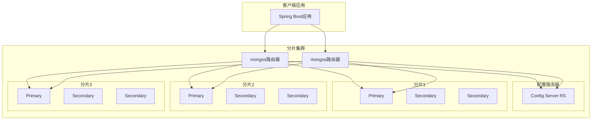

# 高级-分片集群

## 概述

当应用程序的数据量增长到单个服务器无法处理时，MongoDB的分片集群（Sharded Cluster）提供了水平扩展的解决方案。分片是一种将数据分布存储在多个机器上的方法，它可以显著提高系统的存储容量和处理能力。

想象一下，某电商平台的订单系统每天产生数百万条订单记录，单个MongoDB实例的存储和查询性能已经无法满足需求。通过分片集群，我们可以将订单数据按照时间、地区或用户ID等维度分散到多个分片上，实现系统的水平扩展。



## 知识要点

### 1. 分片集群架构组件

#### 1.1 mongos查询路由器

mongos作为分片集群的查询路由器，负责将客户端请求路由到正确的分片：

```java
@Configuration
@EnableMongoRepositories
public class MongoShardConfig {
    
    @Value("${mongodb.sharded.uri}")
    private String mongoUri;
    
    @Bean
    public MongoClient mongoClient() {
        // 连接到mongos实例
        MongoClientSettings settings = MongoClientSettings.builder()
            .applyConnectionString(new ConnectionString(mongoUri))
            .applyToConnectionPoolSettings(builder -> 
                builder.maxSize(100)
                       .minSize(10)
                       .maxConnectionIdleTime(30, TimeUnit.SECONDS))
            .applyToSocketSettings(builder -> 
                builder.connectTimeout(5, TimeUnit.SECONDS)
                       .readTimeout(10, TimeUnit.SECONDS))
            .readPreference(ReadPreference.secondaryPreferred())
            .writeConcern(WriteConcern.MAJORITY)
            .build();
        
        return MongoClients.create(settings);
    }
    
    @Bean
    public MongoTemplate mongoTemplate() {
        return new MongoTemplate(mongoClient(), "ecommerce");
    }
}
```

#### 1.2 配置服务器

配置服务器存储分片集群的元数据，包括分片键范围和数据分布信息：

```javascript
// 初始化配置服务器复制集
rs.initiate({
  _id: "configReplSet",
  configsvr: true,
  members: [
    { _id: 0, host: "config1:27019" },
    { _id: 1, host: "config2:27019" },
    { _id: 2, host: "config3:27019" }
  ]
})
```

#### 1.3 分片服务器

每个分片都是一个独立的MongoDB实例或复制集：

```javascript
// 初始化分片复制集
rs.initiate({
  _id: "shard1",
  members: [
    { _id: 0, host: "shard1-primary:27018" },
    { _id: 1, host: "shard1-secondary1:27018" },
    { _id: 2, host: "shard1-secondary2:27018" }
  ]
})
```

### 2. 分片键设计与策略

#### 2.1 分片键选择原则

分片键的选择直接影响分片集群的性能和数据分布：

```java
@Service
public class ShardKeyAnalysisService {
    
    @Autowired
    private MongoTemplate mongoTemplate;
    
    /**
     * 分析分片键的基数（Cardinality）
     */
    public void analyzeShardKeyCardinality(String collection, String field) {
        AggregationOperation match = Aggregation.match(
            Criteria.where(field).exists(true)
        );
        
        AggregationOperation group = Aggregation.group(field);
        AggregationOperation count = Aggregation.count().as("distinctCount");
        
        Aggregation aggregation = Aggregation.newAggregation(
            match, group, count
        );
        
        AggregationResults<Document> results = mongoTemplate.aggregate(
            aggregation, collection, Document.class
        );
        
        System.out.println("分片键基数分析结果: " + results.getRawResults());
    }
    
    /**
     * 分析分片键的频率分布
     */
    public void analyzeShardKeyFrequency(String collection, String field) {
        AggregationOperation group = Aggregation.group(field)
            .count().as("frequency");
        
        AggregationOperation sort = Aggregation.sort(
            Sort.Direction.DESC, "frequency"
        );
        
        AggregationOperation limit = Aggregation.limit(20);
        
        Aggregation aggregation = Aggregation.newAggregation(
            group, sort, limit
        );
        
        List<Document> results = mongoTemplate.aggregate(
            aggregation, collection, Document.class
        ).getMappedResults();
        
        System.out.println("分片键频率分布TOP20:");
        results.forEach(doc -> 
            System.out.println(doc.toJson())
        );
    }
}
```

#### 2.2 电商订单系统分片键设计

```java
@Document(collection = "orders")
@ShardKey(keys = @ShardKey.Key(value = "userId"))
public class Order {
    @Id
    private String id;
    
    @Indexed
    private String userId;  // 分片键
    
    @Indexed
    private Date createTime;
    
    private String region;
    private BigDecimal totalAmount;
    private List<OrderItem> items;
    private OrderStatus status;
    
    // 复合分片键设计
    @CompoundIndex(def = "{'userId': 1, 'createTime': 1}")
    public static class CompoundShardKey {}
    
    // getter/setter省略
}

@Service
public class OrderShardingService {
    
    @Autowired
    private MongoTemplate mongoTemplate;
    
    /**
     * 启用分片并配置分片键
     */
    public void enableSharding() {
        try {
            // 对数据库启用分片
            Document enableDbSharding = new Document("enableSharding", "ecommerce");
            mongoTemplate.getCollection("admin").runCommand(enableDbSharding);
            
            // 为订单集合配置分片键
            Document shardCollection = new Document("shardCollection", "ecommerce.orders")
                .append("key", new Document("userId", 1));
            
            mongoTemplate.getCollection("admin").runCommand(shardCollection);
            
            System.out.println("分片配置完成");
            
        } catch (Exception e) {
            System.err.println("分片配置失败: " + e.getMessage());
        }
    }
    
    /**
     * 基于时间的范围分片策略
     */
    public void enableTimeBasedSharding() {
        try {
            // 使用复合分片键：userId + createTime
            Document shardCollection = new Document("shardCollection", "ecommerce.orders")
                .append("key", new Document("userId", 1)
                    .append("createTime", 1));
            
            mongoTemplate.getCollection("admin").runCommand(shardCollection);
            
            // 预分片：为未来的时间范围创建分片
            createTimeSplits();
            
        } catch (Exception e) {
            System.err.println("时间分片配置失败: " + e.getMessage());
        }
    }
    
    private void createTimeSplits() {
        Calendar cal = Calendar.getInstance();
        for (int i = 0; i < 12; i++) {
            cal.add(Calendar.MONTH, 1);
            Date splitDate = cal.getTime();
            
            Document splitCmd = new Document("split", "ecommerce.orders")
                .append("middle", new Document("userId", "")
                    .append("createTime", splitDate));
            
            try {
                mongoTemplate.getCollection("admin").runCommand(splitCmd);
            } catch (Exception e) {
                // 忽略已存在的分片点
            }
        }
    }
}
```

### 3. 查询路由与性能优化

#### 3.1 查询路由原理

```java
@Service
public class QueryRoutingService {
    
    @Autowired
    private MongoTemplate mongoTemplate;
    
    /**
     * 目标查询（Targeted Query）- 包含分片键
     */
    public List<Order> findOrdersByUser(String userId) {
        Query query = new Query(Criteria.where("userId").is(userId));
        
        // 这个查询会直接路由到包含该用户数据的分片
        return mongoTemplate.find(query, Order.class);
    }
    
    /**
     * 散射收集查询（Scatter-Gather Query）- 不包含分片键
     */
    public List<Order> findOrdersByStatus(OrderStatus status) {
        Query query = new Query(Criteria.where("status").is(status));
        
        // 这个查询需要在所有分片上执行，然后合并结果
        return mongoTemplate.find(query, Order.class);
    }
    
    /**
     * 查询解释计划分析
     */
    public void explainQuery(String userId, OrderStatus status) {
        Query query = new Query(
            Criteria.where("userId").is(userId)
                .and("status").is(status)
        );
        
        // 获取查询执行计划
        AggregationOptions options = AggregationOptions.builder()
            .explain(true)
            .build();
        
        Aggregation aggregation = Aggregation.newAggregation(
            Aggregation.match(query.getQueryObject())
        ).withOptions(options);
        
        AggregationResults<Document> results = mongoTemplate.aggregate(
            aggregation, "orders", Document.class
        );
        
        System.out.println("查询执行计划:");
        System.out.println(results.getRawResults().toJson());
    }
}
```

#### 3.2 分片集群监控

```java
@Service
public class ShardMonitoringService {
    
    @Autowired
    private MongoTemplate mongoTemplate;
    
    /**
     * 获取分片状态信息
     */
    public Document getShardStatus() {
        Document shardStatus = mongoTemplate.getCollection("admin")
            .runCommand(new Document("sh.status", 1));
        
        return shardStatus;
    }
    
    /**
     * 监控数据分布情况
     */
    public void monitorDataDistribution() {
        // 获取集合分片统计
        Document collStats = new Document("collStats", "orders")
            .append("indexDetails", true);
        
        Document stats = mongoTemplate.getCollection("ecommerce")
            .runCommand(collStats);
        
        System.out.println("集合统计信息:");
        System.out.println(stats.toJson());
        
        // 检查块分布
        monitorChunkDistribution();
    }
    
    private void monitorChunkDistribution() {
        MongoCollection<Document> chunks = mongoTemplate.getCollection("config.chunks");
        
        AggregationPipeline pipeline = new AggregationPipeline()
            .match(Criteria.where("ns").is("ecommerce.orders"))
            .group("shard")
            .count().as("chunkCount")
            .sort(Sort.Direction.DESC, "chunkCount");
        
        List<Document> distribution = chunks.aggregate(pipeline.getPipeline())
            .into(new ArrayList<>());
        
        System.out.println("块分布情况:");
        distribution.forEach(doc -> System.out.println(doc.toJson()));
    }
    
    /**
     * 监控平衡器状态
     */
    public void monitorBalancer() {
        Document balancerStatus = mongoTemplate.getCollection("admin")
            .runCommand(new Document("balancerStatus", 1));
        
        System.out.println("平衡器状态:");
        System.out.println(balancerStatus.toJson());
        
        // 获取最近的平衡操作
        MongoCollection<Document> actionlog = mongoTemplate.getCollection("config.actionlog");
        
        Query recentBalancing = new Query(
            Criteria.where("what").regex("balancer.*")
        ).with(Sort.by(Sort.Direction.DESC, "time")).limit(10);
        
        List<Document> recentActions = mongoTemplate.find(
            recentBalancing, Document.class, "config.actionlog"
        );
        
        System.out.println("最近的平衡操作:");
        recentActions.forEach(doc -> System.out.println(doc.toJson()));
    }
}
```

### 4. 分片集群管理操作

#### 4.1 动态添加分片

```java
@Service
public class ShardManagementService {
    
    @Autowired
    private MongoTemplate mongoTemplate;
    
    /**
     * 添加新分片
     */
    public void addShard(String shardName, String shardHost) {
        try {
            Document addShardCmd = new Document("addShard", shardHost)
                .append("name", shardName);
            
            Document result = mongoTemplate.getCollection("admin")
                .runCommand(addShardCmd);
            
            if (result.getDouble("ok") == 1.0) {
                System.out.println("分片添加成功: " + result.toJson());
            } else {
                System.err.println("分片添加失败: " + result.toJson());
            }
            
        } catch (Exception e) {
            System.err.println("添加分片时发生错误: " + e.getMessage());
        }
    }
    
    /**
     * 移除分片（数据迁移）
     */
    public void removeShard(String shardName) {
        try {
            Document removeShardCmd = new Document("removeShard", shardName);
            
            Document result = mongoTemplate.getCollection("admin")
                .runCommand(removeShardCmd);
            
            System.out.println("分片移除进度: " + result.toJson());
            
            // 监控数据迁移进度
            monitorShardRemoval(shardName);
            
        } catch (Exception e) {
            System.err.println("移除分片时发生错误: " + e.getMessage());
        }
    }
    
    private void monitorShardRemoval(String shardName) {
        // 定期检查移除进度
        Timer timer = new Timer();
        timer.scheduleAtFixedRate(new TimerTask() {
            @Override
            public void run() {
                Document removeShardCmd = new Document("removeShard", shardName);
                
                try {
                    Document result = mongoTemplate.getCollection("admin")
                        .runCommand(removeShardCmd);
                    
                    System.out.println("迁移进度: " + result.toJson());
                    
                    if ("completed".equals(result.getString("state"))) {
                        System.out.println("分片移除完成");
                        timer.cancel();
                    }
                    
                } catch (Exception e) {
                    System.err.println("检查移除进度失败: " + e.getMessage());
                    timer.cancel();
                }
            }
        }, 0, 30000); // 每30秒检查一次
    }
    
    /**
     * 手动分割块
     */
    public void splitChunk(String namespace, Document splitPoint) {
        try {
            Document splitCmd = new Document("split", namespace)
                .append("middle", splitPoint);
            
            Document result = mongoTemplate.getCollection("admin")
                .runCommand(splitCmd);
            
            System.out.println("块分割结果: " + result.toJson());
            
        } catch (Exception e) {
            System.err.println("分割块失败: " + e.getMessage());
        }
    }
    
    /**
     * 手动迁移块
     */
    public void moveChunk(String namespace, Document chunkMin, 
                         String toShard) {
        try {
            Document moveCmd = new Document("moveChunk", namespace)
                .append("find", chunkMin)
                .append("to", toShard);
            
            Document result = mongoTemplate.getCollection("admin")
                .runCommand(moveCmd);
            
            System.out.println("块迁移结果: " + result.toJson());
            
        } catch (Exception e) {
            System.err.println("迁移块失败: " + e.getMessage());
        }
    }
}
```

## 知识扩展

### 1. 设计思想

MongoDB分片集群的设计遵循以下核心原则：

1. **透明分片**：应用程序无需了解分片的内部细节，通过mongos路由器提供统一的访问接口
2. **自动平衡**：平衡器自动监控数据分布，确保各分片的负载均衡
3. **高可用性**：每个组件都支持复制集，确保系统的高可用性
4. **灵活扩展**：支持动态添加和移除分片，实现弹性扩展

### 2. 避坑指南

1. **分片键选择**：
   - 避免单调递增的分片键（如时间戳、ObjectId），会导致写热点
   - 选择具有良好基数和频率分布的字段
   - 考虑查询模式，包含分片键的查询性能更好

2. **预分片策略**：
   - 对于已知数据分布的场景，创建预分片避免初始写入热点
   - 合理设置块大小，默认64MB可能不适合所有场景

3. **监控告警**：
   - 监控平衡器状态，确保数据均匀分布
   - 关注查询性能，散射收集查询的性能影响
   - 监控各分片的存储使用情况

### 3. 深度思考题

1. **分片键变更**：如何在生产环境中安全地更改分片键？

2. **跨分片事务**：MongoDB 4.2引入的跨分片事务对性能有什么影响？

3. **分片数量规划**：如何根据业务增长预测来规划分片数量？

**深度思考题解答：**

1. **分片键变更策略**：
   - 创建新集合使用新分片键
   - 使用聚合管道迁移数据
   - 应用双写策略确保数据一致性
   - 切换应用访问新集合

2. **跨分片事务影响**：
   - 增加网络通信开销
   - 涉及两阶段提交协议
   - 建议尽量避免跨分片事务，优化数据模型

3. **分片数量规划**：
   - 考虑单分片的存储容量限制（通常2-3TB）
   - 评估查询QPS和写入QPS需求
   - 预留30-50%的容量缓冲
   - 考虑硬件资源和运维复杂度

MongoDB分片集群为大规模应用提供了强大的水平扩展能力，但需要仔细的设计和持续的监控管理，才能发挥其最大价值。