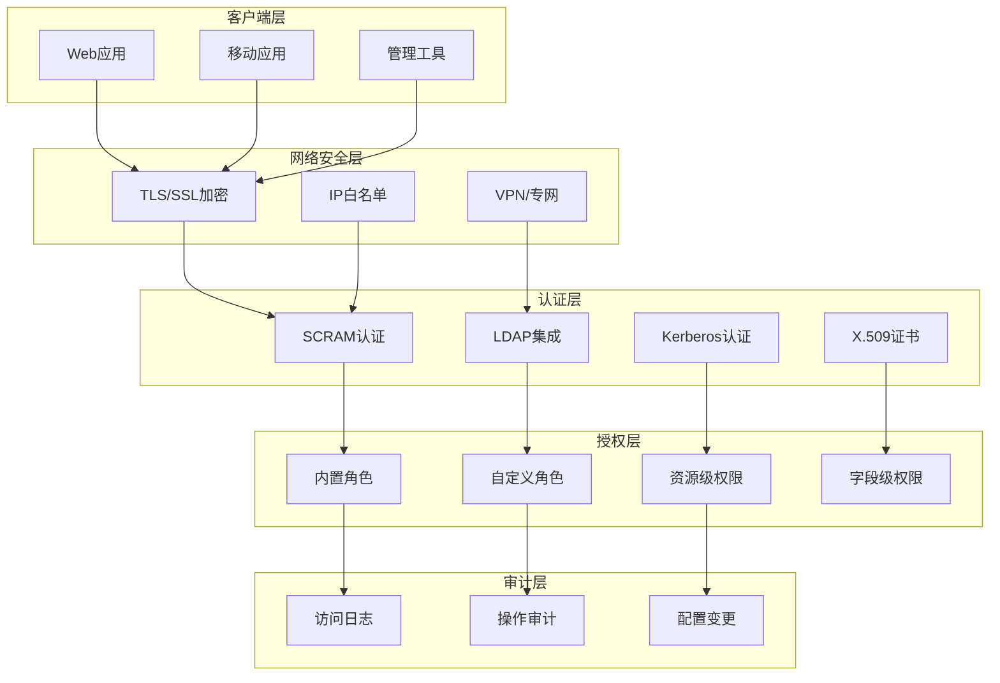

# 高级-安全认证

## 概述

在企业级应用中，数据安全是最重要的考虑因素之一。MongoDB提供了全面的安全认证机制，包括用户认证、角色权限控制、网络加密、审计日志等功能。本章将详细介绍如何构建安全可靠的MongoDB部署环境。

想象一个金融科技公司的用户系统，包含敏感的个人信息、交易记录和财务数据。这样的系统需要多层次的安全防护：数据库管理员只能访问特定的管理操作，应用程序只能访问必要的业务数据，审计人员需要查看所有的数据访问日志。MongoDB的安全认证体系正是为这样的复杂需求而设计。



## 知识要点

### 1. 认证机制配置

#### 1.1 SCRAM认证（默认）

SCRAM（Salted Challenge Response Authentication Mechanism）是MongoDB的默认认证机制：

```java
@Configuration
public class MongoSecurityConfig {
    
    @Value("${mongodb.host}")
    private String host;
    
    @Value("${mongodb.port}")
    private int port;
    
    @Value("${mongodb.database}")
    private String database;
    
    @Value("${mongodb.username}")
    private String username;
    
    @Value("${mongodb.password}")
    private String password;
    
    @Bean
    public MongoClient secureMongoClient() {
        // SCRAM-SHA-256认证
        MongoCredential credential = MongoCredential.createScramSha256Credential(
            username, database, password.toCharArray()
        );
        
        MongoClientSettings settings = MongoClientSettings.builder()
            .applyToClusterSettings(builder -> 
                builder.hosts(Arrays.asList(new ServerAddress(host, port))))
            .credential(credential)
            .applyToSslSettings(builder -> 
                builder.enabled(true)
                       .invalidHostNameAllowed(false))
            .build();
        
        return MongoClients.create(settings);
    }
}
```

#### 1.2 X.509证书认证

对于更高安全级别的场景，可以使用X.509证书认证：

```java
@Configuration
public class X509MongoConfig {
    
    @Value("${mongodb.ssl.keystore.path}")
    private String keystorePath;
    
    @Value("${mongodb.ssl.keystore.password}")
    private String keystorePassword;
    
    @Value("${mongodb.ssl.truststore.path}")
    private String truststorePath;
    
    @Bean
    public MongoClient x509MongoClient() throws Exception {
        // 配置SSL上下文
        SSLContext sslContext = createSSLContext();
        
        MongoClientSettings settings = MongoClientSettings.builder()
            .applyToClusterSettings(builder -> 
                builder.hosts(Arrays.asList(new ServerAddress("localhost", 27017))))
            .applyToSslSettings(builder -> 
                builder.enabled(true)
                       .context(sslContext))
            .credential(MongoCredential.createMongoX509Credential())
            .build();
        
        return MongoClients.create(settings);
    }
    
    private SSLContext createSSLContext() throws Exception {
        // 加载客户端证书
        KeyStore keyStore = KeyStore.getInstance("PKCS12");
        try (InputStream keyStoreStream = new FileInputStream(keystorePath)) {
            keyStore.load(keyStoreStream, keystorePassword.toCharArray());
        }
        
        KeyManagerFactory kmf = KeyManagerFactory.getInstance(
            KeyManagerFactory.getDefaultAlgorithm());
        kmf.init(keyStore, keystorePassword.toCharArray());
        
        // 加载信任证书
        KeyStore trustStore = KeyStore.getInstance("PKCS12");
        try (InputStream trustStoreStream = new FileInputStream(truststorePath)) {
            trustStore.load(trustStoreStream, null);
        }
        
        TrustManagerFactory tmf = TrustManagerFactory.getInstance(
            TrustManagerFactory.getDefaultAlgorithm());
        tmf.init(trustStore);
        
        // 创建SSL上下文
        SSLContext sslContext = SSLContext.getInstance("TLS");
        sslContext.init(kmf.getKeyManagers(), tmf.getTrustManagers(), new SecureRandom());
        
        return sslContext;
    }
}
```

#### 1.3 LDAP集成

对于企业环境，通常需要与现有的LDAP系统集成：

```yaml
# MongoDB配置文件 (mongod.conf)
security:
  authorization: enabled
  ldap:
    servers: "ldap.company.com:389"
    bind:
      method: "simple"
      saslMechanisms: "PLAIN"
      queryUser: "cn=mongodb,ou=services,dc=company,dc=com"
      queryPassword: "password"
    userToDNMapping: '[
      {
        "match": "(.+)",
        "ldapQuery": "ou=users,dc=company,dc=com??sub?(uid={0})"
      }
    ]'
    authz:
      queryTemplate: "ou=groups,dc=company,dc=com??sub?(&(objectClass=groupOfNames)(member={USER}))"
```

### 2. 角色权限管理

#### 2.1 内置角色体系

```java
@Service
public class RoleManagementService {
    
    @Autowired
    private MongoTemplate mongoTemplate;
    
    /**
     * 创建数据库管理员
     */
    public void createDatabaseAdmin(String username, String password, String database) {
        Document createUserCmd = new Document("createUser", username)
            .append("pwd", password)
            .append("roles", Arrays.asList(
                new Document("role", "dbAdmin").append("db", database),
                new Document("role", "readWrite").append("db", database)
            ));
        
        mongoTemplate.getDb().runCommand(createUserCmd);
        System.out.println("数据库管理员创建成功: " + username);
    }
    
    /**
     * 创建只读用户
     */
    public void createReadOnlyUser(String username, String password, String database) {
        Document createUserCmd = new Document("createUser", username)
            .append("pwd", password)
            .append("roles", Arrays.asList(
                new Document("role", "read").append("db", database)
            ));
        
        mongoTemplate.getDb().runCommand(createUserCmd);
        System.out.println("只读用户创建成功: " + username);
    }
    
    /**
     * 创建应用程序用户
     */
    public void createApplicationUser(String username, String password, String database) {
        Document createUserCmd = new Document("createUser", username)
            .append("pwd", password)
            .append("roles", Arrays.asList(
                new Document("role", "readWrite").append("db", database)
            ))
            .append("authenticationRestrictions", Arrays.asList(
                new Document("clientSource", Arrays.asList("10.0.0.0/8", "192.168.0.0/16"))
            ));
        
        mongoTemplate.getDb().runCommand(createUserCmd);
        System.out.println("应用程序用户创建成功: " + username);
    }
}
```

#### 2.2 自定义角色

```java
@Service
public class CustomRoleService {
    
    @Autowired
    private MongoTemplate mongoTemplate;
    
    /**
     * 创建自定义业务角色
     */
    public void createBusinessRole() {
        // 创建订单管理角色
        Document orderManagerRole = new Document("createRole", "orderManager")
            .append("privileges", Arrays.asList(
                // 订单集合的完全访问权限
                new Document("resource", 
                    new Document("db", "ecommerce").append("collection", "orders"))
                    .append("actions", Arrays.asList(
                        "find", "insert", "update", "remove", "createIndex"
                    )),
                // 用户集合的只读权限
                new Document("resource", 
                    new Document("db", "ecommerce").append("collection", "users"))
                    .append("actions", Arrays.asList("find")),
                // 产品集合的只读权限
                new Document("resource", 
                    new Document("db", "ecommerce").append("collection", "products"))
                    .append("actions", Arrays.asList("find"))
            ))
            .append("roles", Arrays.asList()); // 不继承其他角色
        
        mongoTemplate.getDb().runCommand(orderManagerRole);
        System.out.println("订单管理角色创建成功");
    }
    
    /**
     * 创建数据分析师角色
     */
    public void createAnalystRole() {
        Document analystRole = new Document("createRole", "dataAnalyst")
            .append("privileges", Arrays.asList(
                // 所有集合的只读权限
                new Document("resource", 
                    new Document("db", "ecommerce").append("collection", ""))
                    .append("actions", Arrays.asList("find", "listCollections")),
                // 聚合查询权限
                new Document("resource", 
                    new Document("db", "ecommerce").append("collection", ""))
                    .append("actions", Arrays.asList(
                        "find", "aggregate", "mapReduce", "listIndexes"
                    ))
            ))
            .append("roles", Arrays.asList());
        
        mongoTemplate.getDb().runCommand(analystRole);
        System.out.println("数据分析师角色创建成功");
    }
    
    /**
     * 创建带有字段级权限的角色
     */
    public void createFieldLevelRole() {
        // 注意：字段级权限需要MongoDB Enterprise版本
        Document fieldLevelRole = new Document("createRole", "customerService")
            .append("privileges", Arrays.asList(
                // 用户基本信息的访问权限（排除敏感字段）
                new Document("resource", 
                    new Document("db", "ecommerce").append("collection", "users"))
                    .append("actions", Arrays.asList("find"))
                    .append("fieldRestrictions", Arrays.asList(
                        new Document("projection", 
                            new Document("ssn", 0)      // 排除身份证号
                                .append("bankAccount", 0) // 排除银行账户
                                .append("password", 0)    // 排除密码
                        )
                    ))
            ))
            .append("roles", Arrays.asList());
        
        try {
            mongoTemplate.getDb().runCommand(fieldLevelRole);
            System.out.println("字段级权限角色创建成功");
        } catch (Exception e) {
            System.err.println("字段级权限需要Enterprise版本: " + e.getMessage());
        }
    }
}
```

### 3. 网络安全配置

#### 3.1 TLS/SSL加密

```java
@Component
public class NetworkSecurityConfig {
    
    /**
     * 配置TLS加密连接
     */
    @Bean
    public MongoClient tlsMongoClient() {
        MongoClientSettings settings = MongoClientSettings.builder()
            .applyToClusterSettings(builder -> 
                builder.hosts(Arrays.asList(new ServerAddress("mongo.company.com", 27017))))
            .applyToSslSettings(builder -> 
                builder.enabled(true)
                       .invalidHostNameAllowed(false)
                       .context(createTLSContext()))
            .credential(MongoCredential.createScramSha256Credential(
                "appUser", "production", "securePassword".toCharArray()))
            .build();
        
        return MongoClients.create(settings);
    }
    
    private SSLContext createTLSContext() {
        try {
            // 创建信任所有证书的上下文（仅用于开发环境）
            TrustManager[] trustAllCerts = new TrustManager[] {
                new X509TrustManager() {
                    public X509Certificate[] getAcceptedIssuers() { return null; }
                    public void checkClientTrusted(X509Certificate[] certs, String authType) {}
                    public void checkServerTrusted(X509Certificate[] certs, String authType) {}
                }
            };
            
            SSLContext sslContext = SSLContext.getInstance("TLS");
            sslContext.init(null, trustAllCerts, new SecureRandom());
            return sslContext;
            
        } catch (Exception e) {
            throw new RuntimeException("TLS配置失败", e);
        }
    }
    
    /**
     * IP白名单配置
     */
    public void configureIPWhitelist() {
        // 这通常在MongoDB配置文件中设置
        System.out.println("""
            # MongoDB配置文件示例
            net:
              port: 27017
              bindIp: 127.0.0.1,10.0.0.100  # 只允许特定IP访问
            security:
              authorization: enabled
            """);
    }
}
```

### 4. 审计与监控

#### 4.1 审计日志配置

```javascript
// MongoDB Enterprise 审计配置
{
  "auditLog": {
    "destination": "file",
    "format": "JSON",
    "path": "/var/log/mongodb/audit.json",
    "filter": {
      "atype": { "$in": ["authenticate", "authCheck", "createUser", "dropUser"] }
    }
  }
}
```

#### 4.2 安全监控服务

```java
@Service
public class SecurityMonitoringService {
    
    @Autowired
    private MongoTemplate mongoTemplate;
    
    private static final Logger securityLogger = LoggerFactory.getLogger("SECURITY");
    
    /**
     * 监控登录失败次数
     */
    @EventListener
    public void handleAuthenticationFailure(AuthenticationFailureEvent event) {
        String username = event.getUsername();
        String clientIP = event.getClientIP();
        
        // 记录安全日志
        securityLogger.warn("认证失败 - 用户: {}, IP: {}, 时间: {}", 
            username, clientIP, new Date());
        
        // 检查是否需要锁定账户
        checkAccountLockout(username, clientIP);
    }
    
    private void checkAccountLockout(String username, String clientIP) {
        // 查询最近15分钟内的失败次数
        Date fifteenMinutesAgo = new Date(System.currentTimeMillis() - 15 * 60 * 1000);
        
        Query query = new Query(
            Criteria.where("username").is(username)
                .and("event").is("AUTH_FAILURE")
                .and("timestamp").gte(fifteenMinutesAgo)
        );
        
        long failureCount = mongoTemplate.count(query, "security_events");
        
        if (failureCount >= 5) {
            // 锁定账户
            lockUserAccount(username, clientIP);
        }
    }
    
    private void lockUserAccount(String username, String clientIP) {
        securityLogger.error("账户锁定 - 用户: {}, IP: {}, 原因: 连续认证失败", username, clientIP);
        
        // 禁用用户账户
        Document updateUserCmd = new Document("updateUser", username)
            .append("roles", Arrays.asList()) // 移除所有角色
            .append("customData", new Document("locked", true)
                .append("lockTime", new Date())
                .append("lockReason", "连续认证失败"));
        
        try {
            mongoTemplate.getDb().runCommand(updateUserCmd);
        } catch (Exception e) {
            securityLogger.error("锁定账户失败: " + e.getMessage());
        }
    }
    
    /**
     * 监控敏感操作
     */
    public void monitorSensitiveOperations() {
        // 监控用户管理操作
        List<String> sensitiveOperations = Arrays.asList(
            "createUser", "updateUser", "dropUser", 
            "createRole", "updateRole", "dropRole",
            "dropDatabase", "dropCollection"
        );
        
        // 这里可以通过MongoDB的oplog或审计日志来监控
        securityLogger.info("开始监控敏感操作: {}", sensitiveOperations);
    }
    
    /**
     * 权限变更通知
     */
    public void notifyPermissionChange(String username, String operation, String details) {
        SecurityEvent event = new SecurityEvent();
        event.setUsername(username);
        event.setOperation(operation);
        event.setDetails(details);
        event.setTimestamp(new Date());
        event.setClientIP(getCurrentClientIP());
        
        mongoTemplate.save(event, "security_events");
        
        // 发送通知给安全团队
        sendSecurityNotification(event);
    }
    
    private String getCurrentClientIP() {
        // 获取当前请求的客户端IP
        return "127.0.0.1"; // 简化实现
    }
    
    private void sendSecurityNotification(SecurityEvent event) {
        // 发送邮件或消息到安全团队
        securityLogger.info("安全事件通知: {}", event);
    }
    
    // 安全事件实体类
    @Document(collection = "security_events")
    public static class SecurityEvent {
        @Id
        private String id;
        private String username;
        private String operation;
        private String details;
        private Date timestamp;
        private String clientIP;
        
        // getters and setters
        public String getUsername() { return username; }
        public void setUsername(String username) { this.username = username; }
        public String getOperation() { return operation; }
        public void setOperation(String operation) { this.operation = operation; }
        public String getDetails() { return details; }
        public void setDetails(String details) { this.details = details; }
        public Date getTimestamp() { return timestamp; }
        public void setTimestamp(Date timestamp) { this.timestamp = timestamp; }
        public String getClientIP() { return clientIP; }
        public void setClientIP(String clientIP) { this.clientIP = clientIP; }
    }
}
```

## 知识扩展

### 1. 设计思想

MongoDB安全认证体系的设计遵循以下核心原则：

1. **深度防御**：多层次的安全控制，从网络到应用层全覆盖
2. **最小权限原则**：用户和应用只获得必要的最小权限
3. **审计追踪**：所有安全相关的操作都有完整的审计记录
4. **标准兼容**：支持行业标准的认证协议和加密算法

### 2. 避坑指南

1. **认证配置**：
   - 不要在生产环境中禁用认证
   - 使用强密码策略，定期更换密码
   - 配置适当的会话超时时间

2. **网络安全**：
   - 始终启用TLS加密传输
   - 配置防火墙和IP白名单
   - 避免使用默认端口

3. **权限管理**：
   - 定期审查用户权限，移除不必要的权限
   - 使用角色继承简化权限管理
   - 为不同环境使用不同的认证策略

### 3. 深度思考题

1. **零信任架构**：如何在MongoDB中实现零信任安全模型？

2. **合规要求**：如何满足GDPR、SOX等法规对数据安全的要求？

3. **性能影响**：安全机制对MongoDB性能有什么影响，如何优化？

**深度思考题解答：**

1. **零信任实现**：
   - 每个连接都需要认证和授权
   - 实施网络微分段
   - 持续监控和验证
   - 基于风险的动态访问控制

2. **合规策略**：
   - 数据加密（传输和静态）
   - 完整的审计日志
   - 数据访问控制和脱敏
   - 定期安全评估和漏洞扫描

3. **性能优化**：
   - TLS加密增加约5-10%的CPU开销
   - 认证缓存减少重复认证开销
   - 合理配置连接池
   - 使用硬件加速（如果可用）

MongoDB的安全认证体系为企业级应用提供了全面的安全保障，但需要根据具体的业务需求和合规要求进行合理的配置和管理。