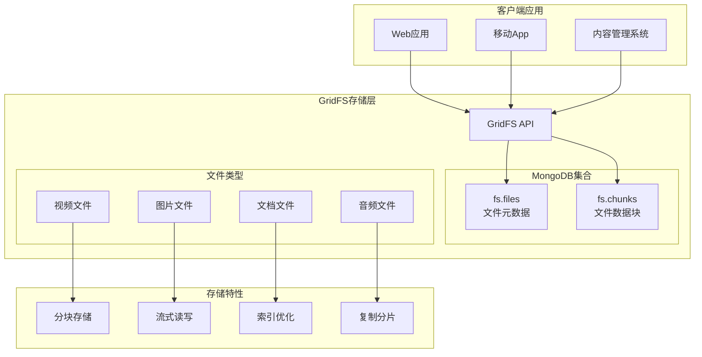

# 高级-GridFS文件存储

## 概述

GridFS是MongoDB的分布式文件存储规范，专门用于存储和检索超过BSON文档大小限制（16MB）的大文件。它将大文件分割成较小的块（chunks），并将这些块存储在两个集合中：`fs.files`（文件元数据）和`fs.chunks`（文件数据块）。

想象一个在线教育平台，需要存储大量的视频课程、PDF教材、图片资源等文件。传统的文件系统虽然可以存储这些文件，但在分布式环境中面临着文件同步、备份、权限管理等挑战。GridFS提供了一个统一的解决方案，将文件存储与数据库的ACID特性、复制、分片等特性完美结合。



## 知识要点

### 1. GridFS架构与原理

#### 1.1 存储结构

GridFS使用两个集合来存储文件：

```java
// fs.files 集合结构
{
  "_id": ObjectId("..."),           // 文件唯一标识
  "filename": "course_video.mp4",   // 文件名
  "length": 52428800,               // 文件大小（字节）
  "chunkSize": 261120,              // 块大小（默认255KB）
  "uploadDate": ISODate("..."),     // 上传时间
  "md5": "d85b1407a0c3dc2a56340...", // MD5校验和
  "contentType": "video/mp4",       // MIME类型
  "metadata": {                     // 自定义元数据
    "course": "MongoDB进阶教程",
    "instructor": "张老师",
    "duration": 3600,
    "quality": "1080p"
  }
}

// fs.chunks 集合结构
{
  "_id": ObjectId("..."),           // 块唯一标识
  "files_id": ObjectId("..."),      // 关联的文件ID
  "n": 0,                          // 块序号（从0开始）
  "data": BinData(0,"...")          // 二进制数据
}
```

#### 1.2 GridFS配置

```java
@Configuration
public class GridFSConfig {
    
    @Autowired
    private MongoTemplate mongoTemplate;
    
    @Bean
    public GridFSBucket gridFSBucket() {
        MongoDatabase database = mongoTemplate.getDb();
        return GridFSBuckets.create(database);
    }
    
    @Bean
    public GridFSTemplate gridFSTemplate() {
        return new GridFSTemplate(mongoTemplate.getDbFactory(), 
                                 mongoTemplate.getConverter());
    }
    
    /**
     * 自定义GridFS存储桶
     */
    @Bean
    public GridFSBucket customGridFSBucket() {
        MongoDatabase database = mongoTemplate.getDb();
        return GridFSBuckets.create(database, "courses"); // 自定义桶名
    }
}
```

### 2. 文件上传与存储

#### 2.1 基础文件上传

```java
@Service
public class FileStorageService {
    
    @Autowired
    private GridFSBucket gridFSBucket;
    
    @Autowired
    private GridFSTemplate gridFSTemplate;
    
    /**
     * 上传文件到GridFS
     */
    public ObjectId uploadFile(MultipartFile file, Map<String, Object> metadata) {
        try {
            // 创建上传选项
            GridFSUploadOptions options = new GridFSUploadOptions()
                .chunkSizeBytes(1024 * 1024) // 1MB块大小
                .metadata(new Document(metadata));
            
            // 上传文件
            ObjectId fileId = gridFSBucket.uploadFromStream(
                file.getOriginalFilename(),
                file.getInputStream(),
                options
            );
            
            System.out.println("文件上传成功，ID: " + fileId);
            return fileId;
            
        } catch (IOException e) {
            throw new RuntimeException("文件上传失败", e);
        }
    }
    
    /**
     * 流式上传大文件
     */
    public ObjectId uploadLargeFile(String filename, InputStream inputStream, 
                                   String contentType, Map<String, Object> metadata) {
        
        // 添加文件信息到元数据
        metadata.put("contentType", contentType);
        metadata.put("uploadTime", new Date());
        metadata.put("status", "uploading");
        
        GridFSUploadOptions options = new GridFSUploadOptions()
            .chunkSizeBytes(2 * 1024 * 1024) // 2MB块大小，适合大文件
            .metadata(new Document(metadata));
        
        try {
            ObjectId fileId = gridFSBucket.uploadFromStream(filename, inputStream, options);
            
            // 更新上传状态
            updateFileStatus(fileId, "completed");
            
            return fileId;
            
        } catch (Exception e) {
            // 更新状态为失败
            System.err.println("大文件上传失败: " + e.getMessage());
            throw new RuntimeException("大文件上传失败", e);
        }
    }
    
    /**
     * 分片上传（支持断点续传）
     */
    public ObjectId uploadFileInChunks(String filename, byte[] fileData, 
                                      String contentType, Map<String, Object> metadata) {
        
        int chunkSize = 1024 * 1024; // 1MB per chunk
        int totalChunks = (int) Math.ceil((double) fileData.length / chunkSize);
        
        metadata.put("totalChunks", totalChunks);
        metadata.put("contentType", contentType);
        
        GridFSUploadOptions options = new GridFSUploadOptions()
            .chunkSizeBytes(chunkSize)
            .metadata(new Document(metadata));
        
        try (ByteArrayInputStream inputStream = new ByteArrayInputStream(fileData)) {
            ObjectId fileId = gridFSBucket.uploadFromStream(filename, inputStream, options);
            
            System.out.println("分片上传完成，总块数: " + totalChunks + "，文件ID: " + fileId);
            return fileId;
            
        } catch (Exception e) {
            throw new RuntimeException("分片上传失败", e);
        }
    }
    
    private void updateFileStatus(ObjectId fileId, String status) {
        Query query = new Query(Criteria.where("_id").is(fileId));
        Update update = new Update().set("metadata.status", status);
        
        gridFSTemplate.getCollection("fs.files").updateOne(
            query.getQueryObject(), update.getUpdateObject()
        );
    }
}
```

#### 2.2 高级上传功能

```java
@Service
public class AdvancedFileService {
    
    @Autowired
    private GridFSBucket gridFSBucket;
    
    @Autowired
    private MongoTemplate mongoTemplate;
    
    /**
     * 带进度跟踪的文件上传
     */
    public ObjectId uploadWithProgress(MultipartFile file, String userId) {
        String filename = file.getOriginalFilename();
        long fileSize = file.getSize();
        
        // 创建上传记录
        UploadProgress progress = new UploadProgress();
        progress.setUserId(userId);
        progress.setFilename(filename);
        progress.setTotalSize(fileSize);
        progress.setUploadedSize(0L);
        progress.setStatus("uploading");
        progress.setStartTime(new Date());
        
        mongoTemplate.save(progress, "upload_progress");
        
        try {
            // 使用自定义输入流跟踪进度
            ProgressTrackingInputStream progressStream = new ProgressTrackingInputStream(
                file.getInputStream(), fileSize, progress.getId(), mongoTemplate
            );
            
            Map<String, Object> metadata = new HashMap<>();
            metadata.put("userId", userId);
            metadata.put("progressId", progress.getId());
            metadata.put("originalSize", fileSize);
            
            GridFSUploadOptions options = new GridFSUploadOptions()
                .metadata(new Document(metadata));
            
            ObjectId fileId = gridFSBucket.uploadFromStream(filename, progressStream, options);
            
            // 更新完成状态
            progress.setFileId(fileId.toString());
            progress.setStatus("completed");
            progress.setEndTime(new Date());
            mongoTemplate.save(progress);
            
            return fileId;
            
        } catch (Exception e) {
            // 更新失败状态
            progress.setStatus("failed");
            progress.setErrorMessage(e.getMessage());
            progress.setEndTime(new Date());
            mongoTemplate.save(progress);
            
            throw new RuntimeException("上传失败", e);
        }
    }
    
    /**
     * 自定义输入流类，用于跟踪上传进度
     */
    public static class ProgressTrackingInputStream extends InputStream {
        private final InputStream inputStream;
        private final long totalSize;
        private final String progressId;
        private final MongoTemplate mongoTemplate;
        private long bytesRead = 0;
        private long lastUpdateTime = 0;
        
        public ProgressTrackingInputStream(InputStream inputStream, long totalSize, 
                                         String progressId, MongoTemplate mongoTemplate) {
            this.inputStream = inputStream;
            this.totalSize = totalSize;
            this.progressId = progressId;
            this.mongoTemplate = mongoTemplate;
        }
        
        @Override
        public int read() throws IOException {
            int data = inputStream.read();
            if (data != -1) {
                bytesRead++;
                updateProgress();
            }
            return data;
        }
        
        @Override
        public int read(byte[] b, int off, int len) throws IOException {
            int bytesReadNow = inputStream.read(b, off, len);
            if (bytesReadNow != -1) {
                bytesRead += bytesReadNow;
                updateProgress();
            }
            return bytesReadNow;
        }
        
        private void updateProgress() {
            long currentTime = System.currentTimeMillis();
            // 每秒更新一次进度，避免频繁数据库操作
            if (currentTime - lastUpdateTime > 1000) {
                Query query = new Query(Criteria.where("_id").is(progressId));
                Update update = new Update()
                    .set("uploadedSize", bytesRead)
                    .set("percentage", (double) bytesRead / totalSize * 100);
                
                mongoTemplate.updateFirst(query, update, "upload_progress");
                lastUpdateTime = currentTime;
            }
        }
        
        @Override
        public void close() throws IOException {
            inputStream.close();
        }
    }
    
    /**
     * 上传进度实体
     */
    @Document(collection = "upload_progress")
    public static class UploadProgress {
        @Id
        private String id;
        private String userId;
        private String filename;
        private String fileId;
        private Long totalSize;
        private Long uploadedSize;
        private Double percentage;
        private String status;
        private Date startTime;
        private Date endTime;
        private String errorMessage;
        
        // getters and setters
        public String getId() { return id; }
        public void setId(String id) { this.id = id; }
        public String getUserId() { return userId; }
        public void setUserId(String userId) { this.userId = userId; }
        public String getFilename() { return filename; }
        public void setFilename(String filename) { this.filename = filename; }
        public String getFileId() { return fileId; }
        public void setFileId(String fileId) { this.fileId = fileId; }
        public Long getTotalSize() { return totalSize; }
        public void setTotalSize(Long totalSize) { this.totalSize = totalSize; }
        public Long getUploadedSize() { return uploadedSize; }
        public void setUploadedSize(Long uploadedSize) { this.uploadedSize = uploadedSize; }
        public String getStatus() { return status; }
        public void setStatus(String status) { this.status = status; }
        public Date getStartTime() { return startTime; }
        public void setStartTime(Date startTime) { this.startTime = startTime; }
        public Date getEndTime() { return endTime; }
        public void setEndTime(Date endTime) { this.endTime = endTime; }
        public String getErrorMessage() { return errorMessage; }
        public void setErrorMessage(String errorMessage) { this.errorMessage = errorMessage; }
    }
}
```

### 3. 文件检索与下载

#### 3.1 基础文件检索

```java
@Service
public class FileRetrievalService {
    
    @Autowired
    private GridFSBucket gridFSBucket;
    
    @Autowired
    private GridFSTemplate gridFSTemplate;
    
    /**
     * 根据文件ID下载文件
     */
    public void downloadFile(ObjectId fileId, OutputStream outputStream) {
        try {
            gridFSBucket.downloadToStream(fileId, outputStream);
        } catch (Exception e) {
            throw new RuntimeException("文件下载失败", e);
        }
    }
    
    /**
     * 根据文件名下载最新版本文件
     */
    public void downloadFileByName(String filename, OutputStream outputStream) {
        try {
            gridFSBucket.downloadToStream(filename, outputStream);
        } catch (Exception e) {
            throw new RuntimeException("文件下载失败: " + filename, e);
        }
    }
    
    /**
     * 获取文件信息
     */
    public GridFSFile getFileInfo(ObjectId fileId) {
        GridFSFindIterable files = gridFSBucket.find(eq("_id", fileId));
        return files.first();
    }
    
    /**
     * 搜索文件
     */
    public List<GridFSFile> searchFiles(String keyword, String contentType, 
                                       Date startDate, Date endDate) {
        
        List<Bson> filters = new ArrayList<>();
        
        if (keyword != null && !keyword.isEmpty()) {
            filters.add(regex("filename", keyword, "i"));
        }
        
        if (contentType != null && !contentType.isEmpty()) {
            filters.add(eq("metadata.contentType", contentType));
        }
        
        if (startDate != null && endDate != null) {
            filters.add(and(gte("uploadDate", startDate), lte("uploadDate", endDate)));
        }
        
        Bson combinedFilter = filters.isEmpty() ? 
            new Document() : and(filters.toArray(new Bson[0]));
        
        GridFSFindIterable files = gridFSBucket.find(combinedFilter);
        
        List<GridFSFile> result = new ArrayList<>();
        for (GridFSFile file : files) {
            result.add(file);
        }
        
        return result;
    }
    
    /**
     * 流式读取文件
     */
    public GridFSDownloadStream openDownloadStream(ObjectId fileId) {
        return gridFSBucket.openDownloadStream(fileId);
    }
    
    /**
     * 分块读取大文件
     */
    public void readFileInChunks(ObjectId fileId, Consumer<byte[]> chunkProcessor) {
        try (GridFSDownloadStream downloadStream = gridFSBucket.openDownloadStream(fileId)) {
            
            byte[] buffer = new byte[1024 * 1024]; // 1MB buffer
            int bytesRead;
            
            while ((bytesRead = downloadStream.read(buffer)) != -1) {
                byte[] chunk = Arrays.copyOf(buffer, bytesRead);
                chunkProcessor.accept(chunk);
            }
            
        } catch (IOException e) {
            throw new RuntimeException("读取文件失败", e);
        }
    }
}
```

#### 3.2 高级检索功能

```java
@Service
public class AdvancedRetrievalService {
    
    @Autowired
    private GridFSBucket gridFSBucket;
    
    @Autowired
    private MongoTemplate mongoTemplate;
    
    /**
     * 支持范围请求的文件下载（HTTP Range）
     */
    public void downloadFileRange(ObjectId fileId, long start, long end, 
                                 OutputStream outputStream) {
        
        GridFSFile gridFSFile = getFileInfo(fileId);
        if (gridFSFile == null) {
            throw new RuntimeException("文件不存在");
        }
        
        long fileLength = gridFSFile.getLength();
        
        // 验证范围
        if (start < 0 || end >= fileLength || start > end) {
            throw new IllegalArgumentException("无效的字节范围");
        }
        
        try (GridFSDownloadStream downloadStream = gridFSBucket.openDownloadStream(fileId)) {
            
            // 跳过开始位置之前的字节
            downloadStream.skip(start);
            
            long bytesToRead = end - start + 1;
            byte[] buffer = new byte[8192];
            long totalBytesRead = 0;
            
            while (totalBytesRead < bytesToRead) {
                int maxBytesToRead = (int) Math.min(buffer.length, bytesToRead - totalBytesRead);
                int bytesRead = downloadStream.read(buffer, 0, maxBytesToRead);
                
                if (bytesRead == -1) {
                    break;
                }
                
                outputStream.write(buffer, 0, bytesRead);
                totalBytesRead += bytesRead;
            }
            
        } catch (IOException e) {
            throw new RuntimeException("范围下载失败", e);
        }
    }
    
    /**
     * 文件缓存服务
     */
    @Cacheable(value = "fileCache", key = "#fileId")
    public byte[] getCachedFile(ObjectId fileId) {
        try (ByteArrayOutputStream outputStream = new ByteArrayOutputStream()) {
            gridFSBucket.downloadToStream(fileId, outputStream);
            return outputStream.toByteArray();
        } catch (IOException e) {
            throw new RuntimeException("文件缓存失败", e);
        }
    }
    
    /**
     * 文件内容搜索（需要外部搜索引擎支持）
     */
    public List<GridFSFile> searchFileContent(String searchText) {
        // 这里假设有一个文本索引集合存储文件内容
        Query query = new Query(
            Criteria.where("content").regex(searchText, "i")
        );
        
        List<Document> searchResults = mongoTemplate.find(query, Document.class, "file_index");
        
        List<ObjectId> fileIds = searchResults.stream()
            .map(doc -> new ObjectId(doc.getString("fileId")))
            .collect(Collectors.toList());
        
        GridFSFindIterable files = gridFSBucket.find(in("_id", fileIds));
        
        List<GridFSFile> result = new ArrayList<>();
        for (GridFSFile file : files) {
            result.add(file);
        }
        
        return result;
    }
    
    private GridFSFile getFileInfo(ObjectId fileId) {
        GridFSFindIterable files = gridFSBucket.find(eq("_id", fileId));
        return files.first();
    }
}
```

### 4. 文件管理与维护

#### 4.1 文件删除与清理

```java
@Service
public class FileMaintenanceService {
    
    @Autowired
    private GridFSBucket gridFSBucket;
    
    @Autowired
    private MongoTemplate mongoTemplate;
    
    /**
     * 删除文件
     */
    public void deleteFile(ObjectId fileId) {
        try {
            gridFSBucket.delete(fileId);
            System.out.println("文件删除成功: " + fileId);
        } catch (Exception e) {
            throw new RuntimeException("文件删除失败", e);
        }
    }
    
    /**
     * 批量删除文件
     */
    public void deleteFiles(List<ObjectId> fileIds) {
        for (ObjectId fileId : fileIds) {
            try {
                gridFSBucket.delete(fileId);
            } catch (Exception e) {
                System.err.println("删除文件失败: " + fileId + ", 错误: " + e.getMessage());
            }
        }
    }
    
    /**
     * 清理过期文件
     */
    public void cleanupExpiredFiles(int daysOld) {
        Date cutoffDate = new Date(System.currentTimeMillis() - daysOld * 24 * 60 * 60 * 1000L);
        
        // 查找过期文件
        GridFSFindIterable expiredFiles = gridFSBucket.find(lt("uploadDate", cutoffDate));
        
        List<ObjectId> fileIdsToDelete = new ArrayList<>();
        for (GridFSFile file : expiredFiles) {
            fileIdsToDelete.add(file.getObjectId());
        }
        
        System.out.println("发现 " + fileIdsToDelete.size() + " 个过期文件");
        
        // 批量删除
        deleteFiles(fileIdsToDelete);
    }
    
    /**
     * 清理孤儿块（没有对应文件记录的数据块）
     */
    public void cleanupOrphanChunks() {
        MongoCollection<Document> filesCollection = mongoTemplate.getCollection("fs.files");
        MongoCollection<Document> chunksCollection = mongoTemplate.getCollection("fs.chunks");
        
        // 获取所有有效的文件ID
        List<ObjectId> validFileIds = new ArrayList<>();
        try (MongoCursor<Document> cursor = filesCollection.find().iterator()) {
            while (cursor.hasNext()) {
                Document file = cursor.next();
                validFileIds.add(file.getObjectId("_id"));
            }
        }
        
        // 删除没有对应文件的块
        DeleteResult result = chunksCollection.deleteMany(
            nin("files_id", validFileIds)
        );
        
        System.out.println("清理了 " + result.getDeletedCount() + " 个孤儿块");
    }
    
    /**
     * 修复文件完整性
     */
    public void repairFileIntegrity(ObjectId fileId) {
        GridFSFile gridFSFile = getFileInfo(fileId);
        if (gridFSFile == null) {
            throw new RuntimeException("文件不存在: " + fileId);
        }
        
        // 检查块的完整性
        long expectedChunks = (long) Math.ceil((double) gridFSFile.getLength() / gridFSFile.getChunkSize());
        
        Query chunksQuery = new Query(Criteria.where("files_id").is(fileId));
        long actualChunks = mongoTemplate.count(chunksQuery, "fs.chunks");
        
        if (expectedChunks != actualChunks) {
            System.err.println("文件块不完整: " + fileId + 
                             ", 期望: " + expectedChunks + ", 实际: " + actualChunks);
            
            // 这里可以尝试修复或标记文件为损坏
            markFileAsCorrupted(fileId);
        }
        
        // 验证MD5校验和
        if (!verifyFileMD5(fileId)) {
            markFileAsCorrupted(fileId);
        }
    }
    
    private GridFSFile getFileInfo(ObjectId fileId) {
        GridFSFindIterable files = gridFSBucket.find(eq("_id", fileId));
        return files.first();
    }
    
    private boolean verifyFileMD5(ObjectId fileId) {
        try (ByteArrayOutputStream outputStream = new ByteArrayOutputStream()) {
            gridFSBucket.downloadToStream(fileId, outputStream);
            
            MessageDigest md = MessageDigest.getInstance("MD5");
            byte[] fileData = outputStream.toByteArray();
            byte[] hash = md.digest(fileData);
            
            String calculatedMD5 = DatatypeConverter.printHexBinary(hash).toLowerCase();
            
            GridFSFile gridFSFile = getFileInfo(fileId);
            String storedMD5 = gridFSFile.getMD5();
            
            return calculatedMD5.equals(storedMD5);
            
        } catch (Exception e) {
            System.err.println("MD5验证失败: " + e.getMessage());
            return false;
        }
    }
    
    private void markFileAsCorrupted(ObjectId fileId) {
        Query query = new Query(Criteria.where("_id").is(fileId));
        Update update = new Update()
            .set("metadata.corrupted", true)
            .set("metadata.corruptedDate", new Date());
        
        mongoTemplate.updateFirst(query, update, "fs.files");
    }
}
```

## 知识扩展

### 1. 设计思想

GridFS的设计基于以下核心理念：

1. **分块存储**：将大文件分割成小块，便于分布式存储和传输
2. **元数据分离**：文件元数据和数据块分开存储，提高查询效率
3. **数据库集成**：文件存储享受MongoDB的所有特性（复制、分片、索引等）
4. **流式处理**：支持流式读写，适合大文件处理

### 2. 避坑指南

1. **性能考虑**：
   - GridFS不适合存储大量小文件（<16MB）
   - 读写性能不如专业的文件系统
   - 适当调整块大小以优化性能

2. **索引优化**：
   - 为`fs.files`的查询字段创建索引
   - `fs.chunks`默认在`files_id`和`n`上有索引

3. **存储管理**：
   - 定期清理过期和损坏的文件
   - 监控存储空间使用情况
   - 考虑文件压缩以节省空间

### 3. 深度思考题

1. **GridFS vs 文件系统**：在什么场景下选择GridFS而不是传统文件系统？

2. **分片策略**：如何为GridFS设计合适的分片策略？

3. **备份恢复**：GridFS的备份和恢复策略有什么特殊考虑？

**深度思考题解答：**

1. **选择GridFS的场景**：
   - 需要分布式文件存储
   - 要求文件存储的ACID特性
   - 需要复杂的元数据查询
   - 希望统一数据和文件的备份策略

2. **分片策略**：
   - 基于`files_id`进行分片
   - 考虑文件访问模式
   - 避免单点热数据
   - 预估存储增长规划分片

3. **备份考虑**：
   - 确保files和chunks集合的一致性
   - 考虑增量备份策略
   - 验证备份文件的完整性
   - 制定灾难恢复计划

GridFS为MongoDB提供了强大的文件存储能力，特别适合需要统一管理结构化数据和非结构化文件的应用场景。