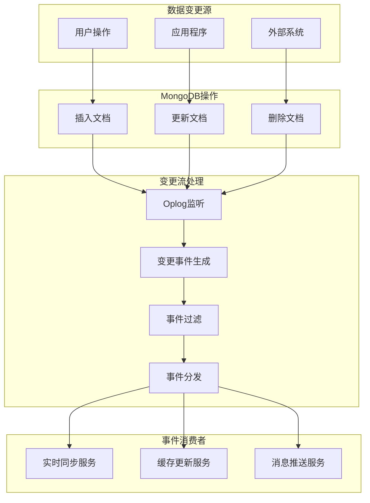

# 高级-变更流

## 概述

变更流（Change Streams）是MongoDB 3.6引入的一个强大特性，允许应用程序实时监听数据库、集合或特定文档的变更事件。通过变更流，应用程序可以在数据发生变化时立即收到通知，无需轮询数据库，实现真正的实时数据同步和事件驱动架构。

想象一个实时协作的在线文档编辑系统，当用户A修改文档内容时，用户B和C需要立即看到这些变更。MongoDB的变更流提供了一个优雅的解决方案，让应用程序能够直接监听数据库的变更事件，实现毫秒级的数据同步。



## 知识要点

### 1. 变更流基础配置

#### 1.1 集合级别的变更流

```java
@Configuration
public class ChangeStreamConfig {
    
    @Autowired
    private MongoTemplate mongoTemplate;
    
    /**
     * 监听订单集合的变更
     */
    @Bean
    public void orderChangeStream() {
        
        // 创建过滤器，只监听特定操作
        List<Bson> pipeline = Arrays.asList(
            Aggregation.match(
                Criteria.where("operationType").in("insert", "update", "replace")
            ).getPipeline().get(0)
        );
        
        ChangeStreamOptions options = ChangeStreamOptions.builder()
            .fullDocument(FullDocument.UPDATE_LOOKUP)
            .batchSize(100)
            .maxAwaitTime(5, TimeUnit.SECONDS)
            .build();
        
        // 异步监听变更
        CompletableFuture.runAsync(() -> {
            mongoTemplate.getCollection("orders", Order.class)
                .watch(pipeline, Order.class)
                .withOptions(options)
                .forEach(this::handleOrderChange);
        });
    }
    
    private void handleOrderChange(ChangeStreamDocument<Order> changeEvent) {
        Order order = changeEvent.getFullDocument();
        OperationType operationType = changeEvent.getOperationType();
        
        System.out.println("订单变更: " + operationType + ", ID: " + order.getId());
        
        switch (operationType) {
            case INSERT:
                handleOrderInsert(order);
                break;
            case UPDATE:
                handleOrderUpdate(order, changeEvent.getUpdateDescription());
                break;
            case DELETE:
                handleOrderDelete(changeEvent.getDocumentKey());
                break;
        }
    }
    
    private void handleOrderInsert(Order order) {
        System.out.println("新订单创建: " + order.getId());
        // 发送新订单通知
        sendOrderNotification(order, "ORDER_CREATED");
    }
    
    private void handleOrderUpdate(Order order, BsonDocument updateDescription) {
        if (updateDescription != null && updateDescription.containsKey("updatedFields")) {
            BsonDocument updatedFields = updateDescription.getDocument("updatedFields");
            
            // 检查订单状态变更
            if (updatedFields.containsKey("status")) {
                String newStatus = updatedFields.getString("status").getValue();
                handleOrderStatusChange(order, newStatus);
            }
        }
    }
    
    private void handleOrderDelete(BsonDocument documentKey) {
        String orderId = documentKey.getString("_id").getValue();
        System.out.println("订单删除: " + orderId);
        // 处理订单删除逻辑
    }
    
    private void handleOrderStatusChange(Order order, String newStatus) {
        System.out.println("订单状态变更: " + order.getId() + " -> " + newStatus);
        
        // 根据状态执行业务逻辑
        switch (newStatus) {
            case "paid":
                handleOrderPaid(order);
                break;
            case "shipped":
                handleOrderShipped(order);
                break;
            case "delivered":
                handleOrderDelivered(order);
                break;
        }
    }
    
    private void handleOrderPaid(Order order) {
        // 支付完成处理
        sendOrderNotification(order, "ORDER_PAID");
        updateInventory(order);
    }
    
    private void handleOrderShipped(Order order) {
        // 发货处理
        sendOrderNotification(order, "ORDER_SHIPPED");
        generateTrackingNumber(order);
    }
    
    private void handleOrderDelivered(Order order) {
        // 送达处理
        sendOrderNotification(order, "ORDER_DELIVERED");
        triggerReviewReminder(order);
    }
    
    private void sendOrderNotification(Order order, String eventType) {
        // 发送通知到消息队列或WebSocket
        System.out.println("发送通知: " + eventType + " for order " + order.getId());
    }
    
    private void updateInventory(Order order) { /* 更新库存 */ }
    private void generateTrackingNumber(Order order) { /* 生成跟踪号 */ }
    private void triggerReviewReminder(Order order) { /* 触发评价提醒 */ }
}
```

### 2. 实时数据同步

#### 2.1 用户状态同步

```java
@Service
public class UserSyncService {
    
    @Autowired
    private MongoTemplate mongoTemplate;
    
    @Autowired
    private RedisTemplate<String, Object> redisTemplate;
    
    /**
     * 监听用户数据变更并同步到缓存
     */
    @PostConstruct
    public void startUserSyncStream() {
        
        List<Bson> pipeline = Arrays.asList(
            Aggregation.match(
                Criteria.where("operationType").in("update", "replace")
            ).getPipeline().get(0)
        );
        
        ChangeStreamOptions options = ChangeStreamOptions.builder()
            .fullDocument(FullDocument.UPDATE_LOOKUP)
            .build();
        
        CompletableFuture.runAsync(() -> {
            mongoTemplate.getCollection("users", User.class)
                .watch(pipeline, User.class)
                .withOptions(options)
                .forEach(this::handleUserChange);
        });
    }
    
    private void handleUserChange(ChangeStreamDocument<User> changeEvent) {
        User user = changeEvent.getFullDocument();
        BsonDocument updateDesc = changeEvent.getUpdateDescription();
        
        if (user != null && updateDesc != null) {
            BsonDocument updatedFields = updateDesc.getDocument("updatedFields");
            
            // 同步在线状态
            if (updatedFields.containsKey("isOnline")) {
                syncUserOnlineStatus(user);
            }
            
            // 同步个人资料
            if (hasProfileFieldsChanged(updatedFields)) {
                syncUserProfile(user);
            }
            
            // 推送实时通知
            pushUserChangeNotification(user, updatedFields);
        }
    }
    
    private boolean hasProfileFieldsChanged(BsonDocument updatedFields) {
        return updatedFields.containsKey("name") || 
               updatedFields.containsKey("avatar") || 
               updatedFields.containsKey("status");
    }
    
    private void syncUserOnlineStatus(User user) {
        String cacheKey = "user:online:" + user.getId();
        
        if (user.getIsOnline()) {
            redisTemplate.opsForValue().set(cacheKey, "true", Duration.ofHours(24));
            redisTemplate.opsForSet().add("users:online", user.getId());
        } else {
            redisTemplate.delete(cacheKey);
            redisTemplate.opsForSet().remove("users:online", user.getId());
        }
        
        System.out.println("用户在线状态同步: " + user.getId() + " -> " + user.getIsOnline());
    }
    
    private void syncUserProfile(User user) {
        String cacheKey = "user:profile:" + user.getId();
        
        UserProfile profile = new UserProfile();
        profile.setId(user.getId());
        profile.setName(user.getName());
        profile.setAvatar(user.getAvatar());
        profile.setStatus(user.getStatus());
        
        redisTemplate.opsForValue().set(cacheKey, profile, Duration.ofHours(12));
        System.out.println("用户资料缓存更新: " + user.getId());
    }
    
    private void pushUserChangeNotification(User user, BsonDocument updatedFields) {
        // 构建变更通知
        Map<String, Object> notification = new HashMap<>();
        notification.put("userId", user.getId());
        notification.put("timestamp", new Date());
        notification.put("changes", extractChangedFields(updatedFields));
        
        // 推送给相关用户
        List<String> recipients = getNotificationRecipients(user.getId());
        for (String recipientId : recipients) {
            // 通过WebSocket或消息队列推送
            pushNotification(recipientId, notification);
        }
    }
    
    private Map<String, Object> extractChangedFields(BsonDocument updatedFields) {
        Map<String, Object> changes = new HashMap<>();
        for (String key : updatedFields.keySet()) {
            changes.put(key, updatedFields.get(key).toString());
        }
        return changes;
    }
    
    private List<String> getNotificationRecipients(String userId) {
        // 获取好友列表或关注者列表
        return Arrays.asList("friend1", "friend2");
    }
    
    private void pushNotification(String userId, Map<String, Object> notification) {
        // 推送通知实现
        System.out.println("推送通知给用户: " + userId);
    }
    
    public static class UserProfile {
        private String id;
        private String name;
        private String avatar;
        private String status;
        
        // getters and setters
        public String getId() { return id; }
        public void setId(String id) { this.id = id; }
        public String getName() { return name; }
        public void setName(String name) { this.name = name; }
        public String getAvatar() { return avatar; }
        public void setAvatar(String avatar) { this.avatar = avatar; }
        public String getStatus() { return status; }
        public void setStatus(String status) { this.status = status; }
    }
}
```

### 3. 断点续传与错误处理

#### 3.1 Resume Token管理

```java
@Service
public class ChangeStreamManager {
    
    @Autowired
    private MongoTemplate mongoTemplate;
    
    private volatile boolean running = true;
    
    /**
     * 带断点续传的变更流
     */
    public void startResilientChangeStream(String collectionName) {
        
        BsonDocument resumeToken = getLastResumeToken(collectionName);
        
        while (running) {
            try {
                ChangeStreamOptions.Builder optionsBuilder = ChangeStreamOptions.builder()
                    .fullDocument(FullDocument.UPDATE_LOOKUP)
                    .batchSize(100);
                
                // 如果有resume token，从该位置开始
                if (resumeToken != null) {
                    optionsBuilder.resumeAfter(resumeToken);
                }
                
                ChangeStreamOptions options = optionsBuilder.build();
                
                mongoTemplate.getCollection(collectionName)
                    .watch()
                    .withOptions(options)
                    .forEach(changeEvent -> {
                        try {
                            processChangeEvent(changeEvent);
                            // 保存最新的resume token
                            saveResumeToken(collectionName, changeEvent.getResumeToken());
                        } catch (Exception e) {
                            System.err.println("处理变更事件失败: " + e.getMessage());
                        }
                    });
                    
            } catch (Exception e) {
                System.err.println("变更流连接异常: " + e.getMessage());
                
                // 等待一段时间后重连
                try {
                    Thread.sleep(5000);
                } catch (InterruptedException ie) {
                    Thread.currentThread().interrupt();
                    break;
                }
            }
        }
    }
    
    private void processChangeEvent(ChangeStreamDocument<Document> changeEvent) {
        System.out.println("处理变更事件: " + changeEvent.getOperationType());
        
        // 实际的业务处理逻辑
        switch (changeEvent.getOperationType()) {
            case INSERT:
                handleInsert(changeEvent);
                break;
            case UPDATE:
                handleUpdate(changeEvent);
                break;
            case DELETE:
                handleDelete(changeEvent);
                break;
        }
    }
    
    private BsonDocument getLastResumeToken(String collectionName) {
        Query query = new Query(Criteria.where("collectionName").is(collectionName));
        ResumeTokenRecord record = mongoTemplate.findOne(query, ResumeTokenRecord.class, "resume_tokens");
        
        if (record != null && record.getResumeToken() != null) {
            return BsonDocument.parse(record.getResumeToken());
        }
        
        return null;
    }
    
    private void saveResumeToken(String collectionName, BsonDocument resumeToken) {
        Query query = new Query(Criteria.where("collectionName").is(collectionName));
        Update update = new Update()
            .set("resumeToken", resumeToken.toJson())
            .set("lastUpdated", new Date());
        
        mongoTemplate.upsert(query, update, "resume_tokens");
    }
    
    public void stopChangeStream() {
        running = false;
    }
    
    private void handleInsert(ChangeStreamDocument<Document> changeEvent) {
        System.out.println("处理插入事件: " + changeEvent.getFullDocument());
    }
    
    private void handleUpdate(ChangeStreamDocument<Document> changeEvent) {
        System.out.println("处理更新事件: " + changeEvent.getDocumentKey());
    }
    
    private void handleDelete(ChangeStreamDocument<Document> changeEvent) {
        System.out.println("处理删除事件: " + changeEvent.getDocumentKey());
    }
    
    @Document(collection = "resume_tokens")
    public static class ResumeTokenRecord {
        @Id
        private String id;
        private String collectionName;
        private String resumeToken;
        private Date lastUpdated;
        
        // getters and setters
        public String getId() { return id; }
        public void setId(String id) { this.id = id; }
        public String getCollectionName() { return collectionName; }
        public void setCollectionName(String collectionName) { this.collectionName = collectionName; }
        public String getResumeToken() { return resumeToken; }
        public void setResumeToken(String resumeToken) { this.resumeToken = resumeToken; }
        public Date getLastUpdated() { return lastUpdated; }
        public void setLastUpdated(Date lastUpdated) { this.lastUpdated = lastUpdated; }
    }
}
```

## 知识扩展

### 1. 设计思想

MongoDB变更流基于以下核心理念：

1. **实时性**：基于oplog实现毫秒级的变更通知
2. **可靠性**：支持resume token确保事件不丢失
3. **可扩展性**：支持分片集群的全局变更监听
4. **灵活性**：提供丰富的过滤和转换选项

### 2. 避坑指南

1. **资源管理**：
   - 变更流会占用数据库连接，注意连接池配置
   - 长时间运行的变更流需要合理的错误处理和重连机制

2. **性能考虑**：
   - 过滤条件应该尽可能精确，减少不必要的事件处理
   - 批量处理事件以提高效率

3. **数据一致性**：
   - 变更流是最终一致性的，不适用于强一致性要求
   - 需要考虑事件的顺序性和幂等性

### 3. 深度思考题

1. **事件顺序性**：如何保证分布式环境下变更事件的顺序性？

2. **性能优化**：大量变更事件时如何优化处理性能？

3. **故障恢复**：变更流断开后如何确保事件不丢失？

**深度思考题解答：**

1. **事件顺序性**：
   - 使用集群时间戳确保全局顺序
   - 在应用层实现事件排序机制
   - 考虑使用操作时间戳而非接收时间戳

2. **性能优化**：
   - 实现事件批处理机制
   - 使用异步处理和队列缓冲
   - 合理设置batchSize和maxAwaitTime
   - 考虑事件的优先级处理

3. **故障恢复**：
   - 定期保存resume token
   - 实现重连和重试机制
   - 设计事件处理的幂等性
   - 考虑使用专业的消息队列作为中介

MongoDB变更流为构建实时、响应式应用提供了强大的基础设施，是实现事件驱动架构的重要工具。
