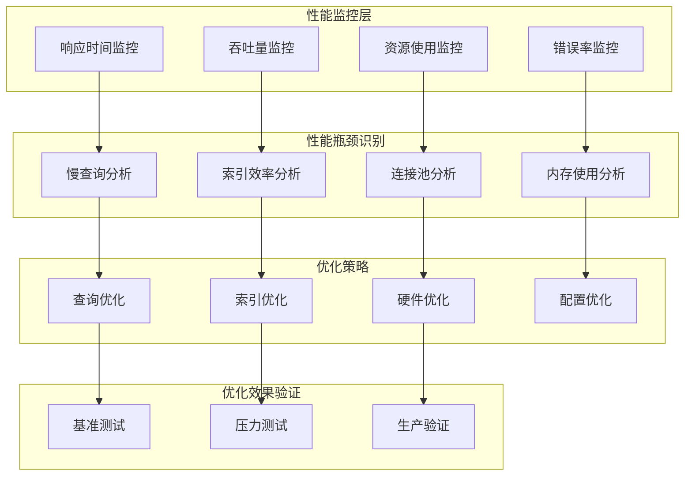

# 16. MongoDB优化-性能调优

## 概述

MongoDB性能调优是一个系统性工程，涉及硬件配置、数据建模、索引设计、查询优化、系统参数调整等多个层面。随着数据量的增长和并发请求的增加，性能瓶颈会逐渐显现，需要通过科学的调优方法来提升系统的响应速度和吞吐量。

想象一个电商平台在双十一期间面临巨大的流量冲击，订单查询响应时间从平时的50ms飙升到2秒，用户体验急剧下降。通过系统的性能调优，包括优化查询语句、调整索引策略、配置合适的读写关注级别、优化连接池参数等措施，最终将响应时间降低到100ms以内，成功应对了流量洪峰。



## 知识要点

### 1. 性能监控与诊断

#### 1.1 性能指标监控

```java
@Service
public class PerformanceMonitorService {
    
    @Autowired
    private MongoTemplate mongoTemplate;
    
    /**
     * 获取数据库性能统计信息
     */
    public DatabaseStats getDatabaseStats() {
        Document serverStatus = mongoTemplate.getDb().runCommand(new Document("serverStatus", 1));
        Document dbStats = mongoTemplate.getDb().runCommand(new Document("dbStats", 1));
        
        return DatabaseStats.builder()
            .connections(serverStatus.getEmbedded(Arrays.asList("connections", "current"), Integer.class))
            .opcounters(extractOpCounters(serverStatus))
            .memory(extractMemoryInfo(serverStatus))
            .network(extractNetworkInfo(serverStatus))
            .storage(extractStorageInfo(dbStats))
            .build();
    }
    
    /**
     * 监控慢查询
     */
    public List<SlowQuery> getSlowQueries(int durationThreshold) {
        // 启用慢查询日志
        mongoTemplate.getDb().runCommand(
            new Document("setParameter", 1)
                .append("logLevel", 1)
                .append("slowOpThresholdMs", durationThreshold)
        );
        
        // 从系统日志中提取慢查询
        List<SlowQuery> slowQueries = new ArrayList<>();
        
        // 这里应该解析MongoDB日志文件或使用profiler
        // 简化实现，实际应该从log文件或profiler集合中读取
        return slowQueries;
    }
    
    /**
     * 实时性能监控
     */
    @Scheduled(fixedRate = 30000) // 每30秒执行一次
    public void monitorPerformance() {
        try {
            DatabaseStats stats = getDatabaseStats();
            
            // 检查关键指标
            checkConnectionUsage(stats.getConnections());
            checkMemoryUsage(stats.getMemory());
            checkOperationCounters(stats.getOpcounters());
            
            // 记录性能指标
            logPerformanceMetrics(stats);
            
        } catch (Exception e) {
            System.err.println("性能监控失败: " + e.getMessage());
        }
    }
    
    private void checkConnectionUsage(Integer currentConnections) {
        Integer maxConnections = getMaxConnections();
        double usage = (double) currentConnections / maxConnections;
        
        if (usage > 0.8) {
            System.err.println("警告: 连接使用率过高 " + (usage * 100) + "%");
            // 发送告警
            sendAlert("CONNECTION_HIGH", "连接使用率: " + (usage * 100) + "%");
        }
    }
    
    private void checkMemoryUsage(MemoryInfo memory) {
        long residentMB = memory.getResident();
        long virtualMB = memory.getVirtual();
        
        if (residentMB > 4096) { // 大于4GB
            System.err.println("警告: 内存使用过高 " + residentMB + "MB");
            sendAlert("MEMORY_HIGH", "内存使用: " + residentMB + "MB");
        }
    }
    
    private void checkOperationCounters(OpCounters opcounters) {
        // 计算QPS
        long totalOps = opcounters.getQuery() + opcounters.getInsert() + 
                       opcounters.getUpdate() + opcounters.getDelete();
        
        // 这里应该与之前的计数器比较计算QPS
        System.out.println("总操作数: " + totalOps);
    }
    
    private OpCounters extractOpCounters(Document serverStatus) {
        Document opcounters = serverStatus.get("opcounters", Document.class);
        return OpCounters.builder()
            .insert(opcounters.getLong("insert"))
            .query(opcounters.getLong("query"))
            .update(opcounters.getLong("update"))
            .delete(opcounters.getLong("delete"))
            .getmore(opcounters.getLong("getmore"))
            .command(opcounters.getLong("command"))
            .build();
    }
    
    private MemoryInfo extractMemoryInfo(Document serverStatus) {
        Document mem = serverStatus.get("mem", Document.class);
        return MemoryInfo.builder()
            .resident(mem.getInteger("resident"))
            .virtual(mem.getInteger("virtual"))
            .mapped(mem.getInteger("mapped"))
            .build();
    }
    
    private NetworkInfo extractNetworkInfo(Document serverStatus) {
        Document network = serverStatus.get("network", Document.class);
        return NetworkInfo.builder()
            .bytesIn(network.getLong("bytesIn"))
            .bytesOut(network.getLong("bytesOut"))
            .numRequests(network.getLong("numRequests"))
            .build();
    }
    
    private StorageInfo extractStorageInfo(Document dbStats) {
        return StorageInfo.builder()
            .dataSize(dbStats.getLong("dataSize"))
            .storageSize(dbStats.getLong("storageSize"))
            .indexSize(dbStats.getLong("indexSize"))
            .totalSize(dbStats.getLong("totalSize"))
            .build();
    }
    
    private Integer getMaxConnections() {
        Document result = mongoTemplate.getDb().runCommand(
            new Document("getParameter", 1).append("maxConns", 1)
        );
        return result.getInteger("maxConns", 1000000); // 默认值
    }
    
    private void logPerformanceMetrics(DatabaseStats stats) {
        System.out.println("=== 性能指标 ===");
        System.out.println("当前连接数: " + stats.getConnections());
        System.out.println("内存使用: " + stats.getMemory().getResident() + "MB");
        System.out.println("存储大小: " + stats.getStorage().getTotalSize() / 1024 / 1024 + "MB");
    }
    
    private void sendAlert(String alertType, String message) {
        // 发送告警通知
        System.err.println("ALERT [" + alertType + "]: " + message);
    }
    
    // 数据模型类
    @Data
    @Builder
    public static class DatabaseStats {
        private Integer connections;
        private OpCounters opcounters;
        private MemoryInfo memory;
        private NetworkInfo network;
        private StorageInfo storage;
    }
    
    @Data
    @Builder
    public static class OpCounters {
        private Long insert;
        private Long query;
        private Long update;
        private Long delete;
        private Long getmore;
        private Long command;
    }
    
    @Data
    @Builder
    public static class MemoryInfo {
        private Integer resident;
        private Integer virtual;
        private Integer mapped;
    }
    
    @Data
    @Builder
    public static class NetworkInfo {
        private Long bytesIn;
        private Long bytesOut;
        private Long numRequests;
    }
    
    @Data
    @Builder
    public static class StorageInfo {
        private Long dataSize;
        private Long storageSize;
        private Long indexSize;
        private Long totalSize;
    }
    
    @Data
    @Builder
    public static class SlowQuery {
        private String command;
        private String collection;
        private Long duration;
        private Date timestamp;
        private Document query;
    }
}
```

### 2. 查询性能优化

#### 2.1 查询分析与优化

```java
@Service
public class QueryOptimizationService {
    
    @Autowired
    private MongoTemplate mongoTemplate;
    
    /**
     * 分析查询性能
     */
    public QueryExplainResult explainQuery(Query query, String collectionName) {
        AggregationOptions options = AggregationOptions.builder()
            .explain(true)
            .build();
        
        Aggregation aggregation = Aggregation.newAggregation(
            Aggregation.match(query.getQueryObject())
        ).withOptions(options);
        
        AggregationResults<Document> results = mongoTemplate.aggregate(
            aggregation, collectionName, Document.class
        );
        
        Document explainResult = results.getRawResults();
        return parseExplainResult(explainResult);
    }
    
    /**
     * 优化查询建议
     */
    public List<OptimizationSuggestion> analyzeAndSuggest(Query query, String collectionName) {
        List<OptimizationSuggestion> suggestions = new ArrayList<>();
        
        QueryExplainResult explainResult = explainQuery(query, collectionName);
        
        // 检查是否使用了索引
        if ("COLLSCAN".equals(explainResult.getStage())) {
            suggestions.add(OptimizationSuggestion.builder()
                .type("INDEX_MISSING")
                .description("查询未使用索引，建议为查询字段创建索引")
                .priority(Priority.HIGH)
                .suggestedIndex(suggestIndex(query))
                .build());
        }
        
        // 检查索引效率
        if (explainResult.getDocsExamined() > explainResult.getDocsReturned() * 10) {
            suggestions.add(OptimizationSuggestion.builder()
                .type("INDEX_INEFFICIENT")
                .description("索引效率较低，检查了 " + explainResult.getDocsExamined() + 
                           " 个文档但只返回 " + explainResult.getDocsReturned() + " 个")
                .priority(Priority.MEDIUM)
                .build());
        }
        
        // 检查排序性能
        if (query.getSortObject() != null && !explainResult.isIndexSort()) {
            suggestions.add(OptimizationSuggestion.builder()
                .type("SORT_IN_MEMORY")
                .description("排序在内存中进行，建议为排序字段创建索引")
                .priority(Priority.MEDIUM)
                .suggestedIndex(createSortIndex(query.getSortObject()))
                .build());
        }
        
        // 检查投影使用
        if (query.getFieldsObject().isEmpty()) {
            suggestions.add(OptimizationSuggestion.builder()
                .type("NO_PROJECTION")
                .description("建议使用投影只返回需要的字段")
                .priority(Priority.LOW)
                .build());
        }
        
        return suggestions;
    }
    
    /**
     * 查询重写优化
     */
    public Query optimizeQuery(Query originalQuery) {
        Query optimizedQuery = new Query();
        
        // 复制原始查询条件
        optimizedQuery.addCriteria(originalQuery.getQueryObject());
        
        // 优化字段投影
        if (originalQuery.getFieldsObject().isEmpty()) {
            // 如果没有指定投影，建议只返回必要字段
            optimizedQuery.fields().include("_id", "name", "status", "createTime");
        } else {
            optimizedQuery.fields().include(originalQuery.getFieldsObject());
        }
        
        // 优化分页
        if (originalQuery.getSkip() > 10000) {
            // 大偏移量分页优化，使用范围查询替代skip
            System.out.println("警告: 使用了大偏移量分页，建议使用范围查询优化");
        }
        
        // 优化排序
        Document sortObject = originalQuery.getSortObject();
        if (!sortObject.isEmpty()) {
            // 检查排序字段是否有对应的索引
            optimizedQuery.with(Sort.by(convertToSort(sortObject)));
        }
        
        return optimizedQuery;
    }
    
    /**
     * 批量查询优化
     */
    public <T> List<T> optimizedBatchQuery(List<String> ids, Class<T> entityClass, String collectionName) {
        // 使用$in操作符代替多次单独查询
        Query query = new Query(Criteria.where("_id").in(ids));
        
        // 限制批量大小，避免单次查询过大
        if (ids.size() > 1000) {
            List<T> results = new ArrayList<>();
            List<List<String>> batches = partition(ids, 1000);
            
            for (List<String> batch : batches) {
                Query batchQuery = new Query(Criteria.where("_id").in(batch));
                results.addAll(mongoTemplate.find(batchQuery, entityClass, collectionName));
            }
            
            return results;
        }
        
        return mongoTemplate.find(query, entityClass, collectionName);
    }
    
    private QueryExplainResult parseExplainResult(Document explainResult) {
        // 解析explain结果
        Document stages = explainResult.get("stages", Document.class);
        String winningPlan = stages != null ? "INDEXED" : "COLLSCAN";
        
        return QueryExplainResult.builder()
            .stage(winningPlan)
            .docsExamined(explainResult.getInteger("totalDocsExamined", 0))
            .docsReturned(explainResult.getInteger("totalDocsReturned", 0))
            .executionTimeMs(explainResult.getInteger("executionTimeMillis", 0))
            .indexSort(explainResult.getBoolean("indexSort", false))
            .build();
    }
    
    private Document suggestIndex(Query query) {
        Document indexKeys = new Document();
        
        // 分析查询条件中的字段
        Document queryObject = query.getQueryObject();
        for (String key : queryObject.keySet()) {
            if (!key.startsWith("$")) {
                indexKeys.put(key, 1);
            }
        }
        
        return indexKeys;
    }
    
    private Document createSortIndex(Document sortObject) {
        Document indexKeys = new Document();
        
        for (String key : sortObject.keySet()) {
            indexKeys.put(key, sortObject.get(key));
        }
        
        return indexKeys;
    }
    
    private Sort convertToSort(Document sortObject) {
        List<Sort.Order> orders = new ArrayList<>();
        
        for (String key : sortObject.keySet()) {
            Integer direction = sortObject.getInteger(key);
            Sort.Direction sortDirection = direction == 1 ? Sort.Direction.ASC : Sort.Direction.DESC;
            orders.add(new Sort.Order(sortDirection, key));
        }
        
        return Sort.by(orders);
    }
    
    private <T> List<List<T>> partition(List<T> list, int size) {
        List<List<T>> partitions = new ArrayList<>();
        for (int i = 0; i < list.size(); i += size) {
            partitions.add(list.subList(i, Math.min(i + size, list.size())));
        }
        return partitions;
    }
    
    @Data
    @Builder
    public static class QueryExplainResult {
        private String stage;
        private Integer docsExamined;
        private Integer docsReturned;
        private Integer executionTimeMs;
        private Boolean indexSort;
    }
    
    @Data
    @Builder
    public static class OptimizationSuggestion {
        private String type;
        private String description;
        private Priority priority;
        private Document suggestedIndex;
    }
    
    public enum Priority {
        HIGH, MEDIUM, LOW
    }
}
```

### 3. 系统配置优化

#### 3.1 MongoDB参数调优

```java
@Service
public class ConfigurationOptimizationService {
    
    @Autowired
    private MongoTemplate mongoTemplate;
    
    /**
     * 优化数据库配置参数
     */
    public void optimizeConfiguration() {
        
        // 设置适当的慢查询阈值
        setSlowOpThreshold(100); // 100ms
        
        // 调整日志级别
        setLogLevel(1);
        
        // 配置写关注级别
        configureWriteConcern();
        
        // 配置读偏好
        configureReadPreference();
        
        // 优化连接池配置
        optimizeConnectionPool();
        
        System.out.println("数据库配置优化完成");
    }
    
    private void setSlowOpThreshold(int thresholdMs) {
        try {
            mongoTemplate.getDb().runCommand(
                new Document("setParameter", 1)
                    .append("slowOpThresholdMs", thresholdMs)
            );
            System.out.println("慢查询阈值设置为: " + thresholdMs + "ms");
        } catch (Exception e) {
            System.err.println("设置慢查询阈值失败: " + e.getMessage());
        }
    }
    
    private void setLogLevel(int level) {
        try {
            mongoTemplate.getDb().runCommand(
                new Document("setParameter", 1)
                    .append("logLevel", level)
            );
            System.out.println("日志级别设置为: " + level);
        } catch (Exception e) {
            System.err.println("设置日志级别失败: " + e.getMessage());
        }
    }
    
    private void configureWriteConcern() {
        // 根据业务需求配置写关注级别
        // 高一致性要求：WriteConcern.MAJORITY
        // 高性能要求：WriteConcern.UNACKNOWLEDGED
        System.out.println("建议根据业务需求配置写关注级别");
    }
    
    private void configureReadPreference() {
        // 配置读偏好
        // 主节点读：ReadPreference.primary()
        // 从节点读：ReadPreference.secondary()
        // 就近读：ReadPreference.nearest()
        System.out.println("建议根据读写比例配置读偏好");
    }
    
    private void optimizeConnectionPool() {
        System.out.println("连接池优化建议:");
        System.out.println("- maxSize: 100-200 (根据并发量调整)");
        System.out.println("- minSize: 10-20");
        System.out.println("- maxIdleTime: 30000ms");
        System.out.println("- maxConnectionLifeTime: 600000ms");
    }
    
    /**
     * 内存配置优化
     */
    public void optimizeMemoryConfiguration() {
        System.out.println("内存配置优化建议:");
        System.out.println("- WiredTiger缓存大小: 物理内存的50-60%");
        System.out.println("- 操作系统文件系统缓存: 物理内存的25-30%");
        System.out.println("- 应用程序内存: 物理内存的10-20%");
        
        // 获取当前内存配置
        checkCurrentMemoryConfiguration();
    }
    
    private void checkCurrentMemoryConfiguration() {
        try {
            Document serverStatus = mongoTemplate.getDb().runCommand(new Document("serverStatus", 1));
            Document wiredTiger = serverStatus.get("wiredTiger", Document.class);
            
            if (wiredTiger != null) {
                Document cache = wiredTiger.get("cache", Document.class);
                if (cache != null) {
                    Long maxBytes = cache.getLong("maximum bytes configured");
                    Long currentBytes = cache.getLong("bytes currently in the cache");
                    
                    System.out.println("WiredTiger缓存配置:");
                    System.out.println("- 最大缓存: " + (maxBytes / 1024 / 1024) + "MB");
                    System.out.println("- 当前使用: " + (currentBytes / 1024 / 1024) + "MB");
                }
            }
        } catch (Exception e) {
            System.err.println("获取内存配置失败: " + e.getMessage());
        }
    }
    
    /**
     * 存储引擎优化
     */
    public void optimizeStorageEngine() {
        System.out.println("WiredTiger存储引擎优化建议:");
        System.out.println("- 压缩算法: snappy (平衡压缩率和性能)");
        System.out.println("- 块大小: 32KB (SSD) 或 4KB (传统硬盘)");
        System.out.println("- 检查点间隔: 60秒");
        System.out.println("- 事务日志大小: 100MB");
        
        checkStorageEngineConfiguration();
    }
    
    private void checkStorageEngineConfiguration() {
        try {
            Document serverStatus = mongoTemplate.getDb().runCommand(new Document("serverStatus", 1));
            String storageEngine = serverStatus.getString("storageEngine");
            
            System.out.println("当前存储引擎: " + storageEngine);
            
            if ("wiredTiger".equals(storageEngine)) {
                Document wiredTiger = serverStatus.get("wiredTiger", Document.class);
                // 检查WiredTiger特定配置
                analyzeWiredTigerConfig(wiredTiger);
            }
        } catch (Exception e) {
            System.err.println("检查存储引擎配置失败: " + e.getMessage());
        }
    }
    
    private void analyzeWiredTigerConfig(Document wiredTiger) {
        if (wiredTiger != null) {
            Document concurrent = wiredTiger.get("concurrent-transactions", Document.class);
            if (concurrent != null) {
                System.out.println("并发事务配置:");
                System.out.println("- 读票据: " + concurrent.get("read"));
                System.out.println("- 写票据: " + concurrent.get("write"));
            }
        }
    }
}
```

## 知识扩展

### 1. 设计思想

MongoDB性能调优基于以下核心原则：

1. **系统性思维**：从硬件、网络、数据库、应用多层面综合优化
2. **数据驱动**：基于监控指标和性能测试数据进行优化决策
3. **渐进式优化**：先解决影响最大的瓶颈，逐步优化
4. **业务导向**：根据具体业务场景选择合适的优化策略

### 2. 避坑指南

1. **过度优化**：
   - 避免没有性能问题时进行过度优化
   - 优化应该基于实际的性能指标，而非猜测

2. **配置误区**：
   - 不要盲目调整所有参数
   - 每次只调整一个参数，观察效果

3. **索引策略**：
   - 避免创建过多索引影响写性能
   - 定期清理无用索引

### 3. 深度思考题

1. **性能权衡**：读性能和写性能之间如何平衡？

2. **资源分配**：如何在有限的硬件资源下实现最优性能？

3. **扩展策略**：什么时候选择垂直扩展，什么时候选择水平扩展？

**深度思考题解答：**

1. **性能权衡**：
   - 根据业务读写比例调整策略
   - 使用读写分离减少冲突
   - 合理设计索引平衡读写性能
   - 考虑最终一致性vs强一致性

2. **资源分配**：
   - 优先保证内存充足（缓存效果）
   - SSD存储提升I/O性能
   - 网络带宽匹配数据吞吐量
   - CPU核数匹配并发连接数

3. **扩展策略**：
   - 垂直扩展：单机性能瓶颈，成本效益高
   - 水平扩展：数据量巨大，需要分布式处理
   - 混合策略：先垂直后水平，逐步演进

MongoDB性能调优是一个持续的过程，需要结合业务特点和系统实际情况，采用科学的方法进行分析和优化。