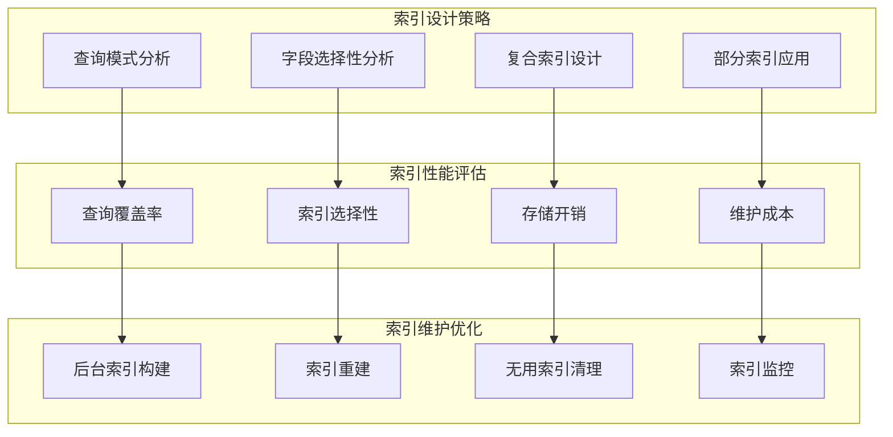

# 17. MongoDB优化-索引优化

## 概述

索引是MongoDB查询性能的核心，合理的索引设计可以将查询时间从秒级优化到毫秒级。但索引也是一把双刃剑，过多或不当的索引会显著影响写入性能和存储空间。本章将深入探讨索引的优化策略，帮助开发者构建高效的索引体系。

想象一个社交媒体平台，用户动态表包含数亿条记录。在没有索引的情况下，查询某用户的最新动态需要扫描整个集合，耗时数十秒。通过创建复合索引(userId, createTime)，查询时间缩短到10毫秒以内。



## 知识要点

### 1. 索引策略分析

#### 1.1 查询模式分析

```java
@Service
public class IndexAnalysisService {
    
    @Autowired
    private MongoTemplate mongoTemplate;
    
    /**
     * 分析集合的查询模式
     */
    public QueryPattern analyzeQueryPatterns(String collectionName) {
        
        // 启用profiler收集查询统计
        enableProfiler();
        
        // 分析查询记录
        Query profilerQuery = new Query(
            Criteria.where("ns").is("mydb." + collectionName)
                .and("command.find").exists(true)
        );
        
        List<Document> profileData = mongoTemplate.find(profilerQuery, Document.class, "system.profile");
        
        return analyzeQueries(profileData);
    }
    
    /**
     * 复合索引设计建议 - ESR原则
     */
    public List<CompoundIndexSuggestion> suggestCompoundIndexes(String collectionName) {
        
        List<CompoundIndexSuggestion> suggestions = new ArrayList<>();
        QueryPattern pattern = analyzeQueryPatterns(collectionName);
        
        // 根据ESR原则设计复合索引
        // E (Equality): 等值查询字段
        // S (Sort): 排序字段  
        // R (Range): 范围查询字段
        
        for (QueryFrequency freq : pattern.getFrequentQueries()) {
            CompoundIndexSuggestion suggestion = designESRIndex(freq);
            if (suggestion != null) {
                suggestions.add(suggestion);
            }
        }
        
        return suggestions;
    }
    
    private CompoundIndexSuggestion designESRIndex(QueryFrequency queryFreq) {
        List<IndexField> equalityFields = new ArrayList<>();
        List<IndexField> sortFields = new ArrayList<>();
        List<IndexField> rangeFields = new ArrayList<>();
        
        // 分析查询条件
        Document query = queryFreq.getQuery();
        Document sort = queryFreq.getSort();
        
        // 提取等值查询字段
        for (String field : query.keySet()) {
            Object value = query.get(field);
            if (!(value instanceof Document)) {
                equalityFields.add(new IndexField(field, 1));
            } else {
                Document condition = (Document) value;
                if (hasRangeOperators(condition)) {
                    rangeFields.add(new IndexField(field, 1));
                }
            }
        }
        
        // 提取排序字段
        if (sort != null) {
            for (String field : sort.keySet()) {
                Integer direction = sort.getInteger(field);
                sortFields.add(new IndexField(field, direction));
            }
        }
        
        // 构建ESR索引
        List<IndexField> esrIndex = new ArrayList<>();
        esrIndex.addAll(equalityFields);  // E: Equality
        esrIndex.addAll(sortFields);      // S: Sort
        esrIndex.addAll(rangeFields);     // R: Range
        
        if (!esrIndex.isEmpty()) {
            return CompoundIndexSuggestion.builder()
                .fields(esrIndex)
                .queryFrequency(queryFreq.getCount())
                .reason("ESR原则复合索引优化")
                .build();
        }
        
        return null;
    }
    
    /**
     * 部分索引建议
     */
    public List<PartialIndexSuggestion> suggestPartialIndexes(String collectionName) {
        
        List<PartialIndexSuggestion> suggestions = new ArrayList<>();
        
        // 为活跃状态数据建议部分索引
        Document statusFilter = new Document("status", new Document("$in", Arrays.asList("active", "pending")));
        
        suggestions.add(PartialIndexSuggestion.builder()
            .indexKey(new Document("userId", 1).append("status", 1))
            .partialFilter(statusFilter)
            .reason("只为活跃状态创建索引，减少70%索引大小")
            .build());
        
        // 为近期数据建议部分索引
        Date threeMonthsAgo = new Date(System.currentTimeMillis() - 90L * 24 * 60 * 60 * 1000);
        Document timeFilter = new Document("createTime", new Document("$gte", threeMonthsAgo));
        
        suggestions.add(PartialIndexSuggestion.builder()
            .indexKey(new Document("createTime", -1))
            .partialFilter(timeFilter)
            .reason("只为最近3个月的数据创建索引")
            .build());
        
        return suggestions;
    }
    
    private void enableProfiler() {
        try {
            mongoTemplate.getDb().runCommand(
                new Document("profile", 2)
                    .append("slowms", 0)
                    .append("sampleRate", 0.1)
            );
        } catch (Exception e) {
            System.err.println("启用profiler失败: " + e.getMessage());
        }
    }
    
    private QueryPattern analyzeQueries(List<Document> profileData) {
        Map<String, Integer> queryFrequency = new HashMap<>();
        
        for (Document profile : profileData) {
            Document command = profile.get("command", Document.class);
            if (command != null) {
                String queryKey = generateQueryKey(command);
                queryFrequency.merge(queryKey, 1, Integer::sum);
            }
        }
        
        List<QueryFrequency> frequentQueries = queryFrequency.entrySet().stream()
            .filter(entry -> entry.getValue() > 10)
            .map(entry -> QueryFrequency.builder()
                .queryKey(entry.getKey())
                .count(entry.getValue())
                .build())
            .collect(Collectors.toList());
        
        return QueryPattern.builder()
            .totalQueries(profileData.size())
            .frequentQueries(frequentQueries)
            .build();
    }
    
    private boolean hasRangeOperators(Document condition) {
        return condition.containsKey("$gte") || condition.containsKey("$gt") || 
               condition.containsKey("$lte") || condition.containsKey("$lt");
    }
    
    private String generateQueryKey(Document command) {
        Document filter = command.get("filter", Document.class);
        Document sort = command.get("sort", Document.class);
        
        StringBuilder key = new StringBuilder();
        if (filter != null) {
            key.append("filter:").append(simplifyFilter(filter));
        }
        if (sort != null) {
            key.append("|sort:").append(sort.toJson());
        }
        
        return key.toString();
    }
    
    private String simplifyFilter(Document filter) {
        Document simplified = new Document();
        for (String field : filter.keySet()) {
            if (!field.startsWith("$")) {
                simplified.put(field, "VALUE");
            }
        }
        return simplified.toJson();
    }
    
    // 数据模型类
    @Data
    @Builder
    public static class QueryPattern {
        private Integer totalQueries;
        private List<QueryFrequency> frequentQueries;
    }
    
    @Data
    @Builder
    public static class QueryFrequency {
        private String queryKey;
        private Integer count;
        private Document query;
        private Document sort;
    }
    
    @Data
    @Builder
    public static class CompoundIndexSuggestion {
        private List<IndexField> fields;
        private Integer queryFrequency;
        private String reason;
    }
    
    @Data
    @Builder
    public static class PartialIndexSuggestion {
        private Document indexKey;
        private Document partialFilter;
        private String reason;
    }
    
    @Data
    @AllArgsConstructor
    public static class IndexField {
        private String name;
        private Integer direction;
    }
}
```

### 2. 索引维护优化

#### 2.1 索引构建与清理

```java
@Service
public class IndexMaintenanceService {
    
    @Autowired
    private MongoTemplate mongoTemplate;
    
    /**
     * 后台构建索引
     */
    public void createIndexInBackground(String collectionName, Document indexKey, String indexName) {
        
        IndexOptions options = new IndexOptions()
            .background(true)
            .name(indexName);
        
        try {
            System.out.println("开始后台构建索引: " + indexName);
            mongoTemplate.getCollection(collectionName).createIndex(indexKey, options);
            
            monitorIndexBuildProgress(collectionName, indexName);
            
        } catch (Exception e) {
            System.err.println("索引构建失败: " + e.getMessage());
        }
    }
    
    /**
     * 批量创建索引
     */
    public void createIndexesBatch(String collectionName, List<IndexDefinition> indexDefinitions) {
        
        List<IndexModel> indexModels = indexDefinitions.stream()
            .map(def -> {
                IndexOptions options = new IndexOptions()
                    .background(true)
                    .name(def.getName());
                
                if (def.isUnique()) options.unique(true);
                if (def.isSparse()) options.sparse(true);
                if (def.getPartialFilter() != null) {
                    options.partialFilterExpression(def.getPartialFilter());
                }
                
                return new IndexModel(def.getKeys(), options);
            })
            .collect(Collectors.toList());
        
        try {
            System.out.println("开始批量创建 " + indexModels.size() + " 个索引");
            mongoTemplate.getCollection(collectionName).createIndexes(indexModels);
            System.out.println("批量索引创建完成");
        } catch (Exception e) {
            System.err.println("批量索引创建失败: " + e.getMessage());
        }
    }
    
    /**
     * 清理无用索引
     */
    public void cleanupUnusedIndexes(String collectionName) {
        
        List<Document> indexStats = getIndexStats(collectionName);
        List<String> unusedIndexes = new ArrayList<>();
        
        for (Document stat : indexStats) {
            String indexName = stat.getString("name");
            Document accesses = stat.get("accesses", Document.class);
            
            if (!"_id_".equals(indexName) && accesses != null) {
                Long ops = accesses.getLong("ops");
                if (ops == 0) {
                    unusedIndexes.add(indexName);
                }
            }
        }
        
        // 删除无用索引
        if (!unusedIndexes.isEmpty()) {
            System.out.println("发现 " + unusedIndexes.size() + " 个无用索引");
            
            for (String indexName : unusedIndexes) {
                try {
                    mongoTemplate.getCollection(collectionName).dropIndex(indexName);
                    System.out.println("已删除无用索引: " + indexName);
                } catch (Exception e) {
                    System.err.println("删除索引失败: " + indexName);
                }
            }
        }
    }
    
    /**
     * 索引性能分析
     */
    public IndexPerformanceReport analyzeIndexPerformance(String collectionName) {
        
        List<Document> indexStats = getIndexStats(collectionName);
        List<IndexMetric> metrics = new ArrayList<>();
        
        for (Document stat : indexStats) {
            String indexName = stat.getString("name");
            Document accesses = stat.get("accesses", Document.class);
            
            IndexMetric metric = IndexMetric.builder()
                .indexName(indexName)
                .accessCount(accesses != null ? accesses.getLong("ops") : 0L)
                .efficiency(calculateIndexEfficiency(indexName, stat))
                .build();
            
            metrics.add(metric);
        }
        
        return IndexPerformanceReport.builder()
            .collectionName(collectionName)
            .indexMetrics(metrics)
            .recommendations(generateRecommendations(metrics))
            .build();
    }
    
    private void monitorIndexBuildProgress(String collectionName, String indexName) {
        // 定期检查索引构建进度
        Timer timer = new Timer();
        timer.scheduleAtFixedRate(new TimerTask() {
            @Override
            public void run() {
                try {
                    Document result = mongoTemplate.getDb().runCommand(new Document("currentOp", 1));
                    List<Document> inprog = result.getList("inprog", Document.class);
                    
                    if (inprog.isEmpty()) {
                        System.out.println("索引构建完成: " + indexName);
                        timer.cancel();
                    } else {
                        System.out.println("索引构建进行中...");
                    }
                } catch (Exception e) {
                    timer.cancel();
                }
            }
        }, 0, 10000);
    }
    
    private List<Document> getIndexStats(String collectionName) {
        Aggregation aggregation = Aggregation.newAggregation(Aggregation.indexStats());
        return mongoTemplate.aggregate(aggregation, collectionName, Document.class)
            .getMappedResults();
    }
    
    private double calculateIndexEfficiency(String indexName, Document stat) {
        // 简化的效率计算
        Document accesses = stat.get("accesses", Document.class);
        if (accesses != null) {
            Long ops = accesses.getLong("ops");
            return Math.min(ops / 1000.0, 1.0); // 归一化到0-1
        }
        return 0.0;
    }
    
    private List<String> generateRecommendations(List<IndexMetric> metrics) {
        List<String> recommendations = new ArrayList<>();
        
        for (IndexMetric metric : metrics) {
            if (!"_id_".equals(metric.getIndexName()) && metric.getAccessCount() == 0) {
                recommendations.add("考虑删除未使用的索引: " + metric.getIndexName());
            }
            
            if (metric.getEfficiency() < 0.1) {
                recommendations.add("索引效率较低，建议优化: " + metric.getIndexName());
            }
        }
        
        return recommendations;
    }
    
    @Data
    @Builder
    public static class IndexDefinition {
        private String name;
        private Document keys;
        private boolean unique;
        private boolean sparse;
        private Document partialFilter;
    }
    
    @Data
    @Builder
    public static class IndexPerformanceReport {
        private String collectionName;
        private List<IndexMetric> indexMetrics;
        private List<String> recommendations;
    }
    
    @Data
    @Builder
    public static class IndexMetric {
        private String indexName;
        private Long accessCount;
        private Double efficiency;
    }
}
```

### 3. 索引最佳实践

#### 3.1 索引设计原则

```java
@Component
public class IndexBestPractices {
    
    /**
     * 索引设计最佳实践示例
     */
    public void demonstrateIndexBestPractices() {
        
        System.out.println("=== MongoDB索引设计最佳实践 ===");
        
        // 1. 复合索引字段顺序（ESR原则）
        demonstrateESRPrinciple();
        
        // 2. 部分索引减少存储
        demonstratePartialIndexes();
        
        // 3. 稀疏索引优化
        demonstrateSparseIndexes();
        
        // 4. 覆盖查询优化
        demonstrateCoveringQueries();
    }
    
    private void demonstrateESRPrinciple() {
        System.out.println("\n1. ESR原则设计复合索引:");
        System.out.println("查询: db.orders.find({userId: 'u123', status: 'active'}).sort({createTime: -1})");
        System.out.println("最优索引: {userId: 1, status: 1, createTime: -1}");
        System.out.println("原因: Equality(userId) -> Equality(status) -> Sort(createTime)");
    }
    
    private void demonstratePartialIndexes() {
        System.out.println("\n2. 部分索引减少存储:");
        System.out.println("普通索引: {userId: 1, status: 1}");
        System.out.println("部分索引: {userId: 1, status: 1} with filter {status: {$in: ['active', 'pending']}}");
        System.out.println("优势: 只为活跃数据创建索引，减少70%存储空间");
    }
    
    private void demonstrateSparseIndexes() {
        System.out.println("\n3. 稀疏索引优化:");
        System.out.println("场景: email字段只有30%的文档有值");
        System.out.println("稀疏索引: {email: 1} with sparse: true");
        System.out.println("优势: 只为有email值的文档创建索引条目");
    }
    
    private void demonstrateCoveringQueries() {
        System.out.println("\n4. 覆盖查询优化:");
        System.out.println("查询: db.users.find({status: 'active'}, {name: 1, email: 1})");
        System.out.println("覆盖索引: {status: 1, name: 1, email: 1}");
        System.out.println("优势: 查询结果完全来自索引，无需访问文档");
    }
    
    /**
     * 常见索引反模式
     */
    public void demonstrateIndexAntiPatterns() {
        
        System.out.println("\n=== 常见索引反模式 ===");
        
        System.out.println("\n1. 避免的反模式:");
        System.out.println("❌ 为每个字段都创建单独索引");
        System.out.println("❌ 复合索引字段顺序错误");
        System.out.println("❌ 创建冗余索引");
        System.out.println("❌ 忽略查询模式分析");
        
        System.out.println("\n2. 正确的做法:");
        System.out.println("✅ 根据查询模式设计复合索引");
        System.out.println("✅ 遵循ESR原则排列字段");
        System.out.println("✅ 定期清理无用索引");
        System.out.println("✅ 使用部分索引减少存储");
    }
}
```

## 知识扩展

### 1. 设计思想

MongoDB索引优化基于以下核心原则：

1. **查询驱动**：索引设计应该基于实际的查询模式，而非理论假设
2. **平衡权衡**：在查询性能、写入性能和存储空间之间找到平衡
3. **持续优化**：索引不是一次性设计，需要根据业务发展持续调整
4. **精准覆盖**：每个索引都应该有明确的用途和目标查询

### 2. 避坑指南

1. **索引数量控制**：
   - 单个集合索引数量不宜超过10个
   - 每增加一个索引会影响写入性能约10-15%

2. **复合索引设计**：
   - 严格遵循ESR原则排列字段顺序
   - 考虑索引前缀的复用性

3. **索引维护**：
   - 定期分析索引使用情况
   - 及时清理无用索引
   - 在业务低峰期进行索引重建

### 3. 深度思考题

1. **索引选择性**：如何评估和优化索引的选择性？

2. **写入性能影响**：如何量化索引对写入性能的影响？

3. **索引策略演进**：随着数据量增长，索引策略应该如何演进？

**深度思考题解答：**

1. **索引选择性评估**：
   - 计算公式：选择性 = 唯一值数量 / 总文档数量
   - 理想选择性接近1，选择性低于0.1的字段不适合单独索引
   - 可通过db.collection.distinct(field).length来计算

2. **写入性能影响量化**：
   - 每个索引增加约10-15%的写入延迟
   - 监控metrics: writeOps延迟、锁等待时间
   - 通过A/B测试对比有无索引的写入性能

3. **索引策略演进**：
   - 小数据量阶段：重点关注查询性能，索引相对宽松
   - 中等数据量：开始关注索引数量和写入性能平衡
   - 大数据量阶段：精细化索引设计，考虑分片键和部分索引

MongoDB索引优化是一个需要持续关注和调整的过程，需要结合具体的业务场景和数据特征来制定最适合的索引策略。