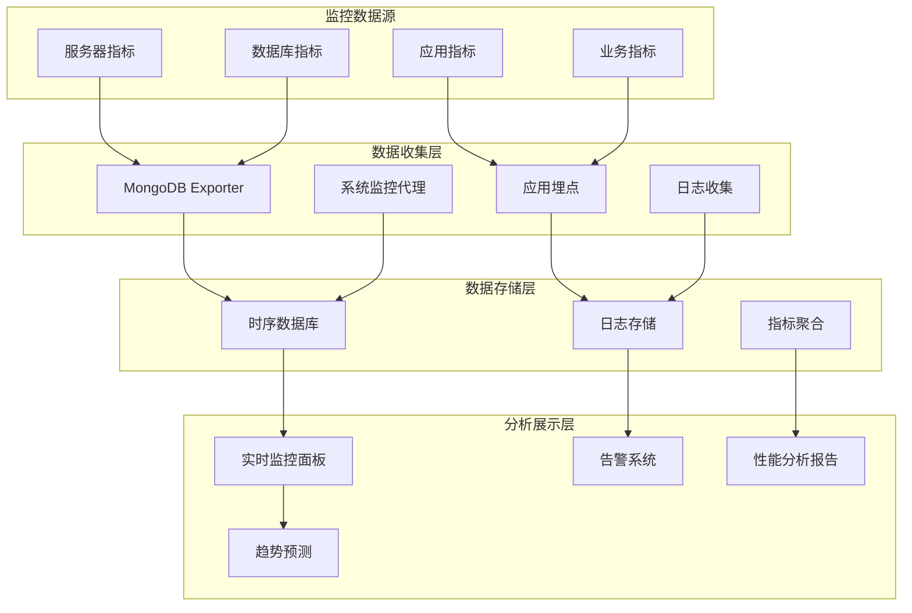

# 18. MongoDB优化-监控分析

## 概述

MongoDB监控分析是保障数据库稳定运行的重要手段。通过建立完善的监控体系，可以及时发现性能瓶颈、预防故障发生、优化资源配置。本章将介绍如何构建全面的MongoDB监控分析系统，从基础指标监控到深度性能分析。

想象一个电商平台在大促期间，订单量突增导致数据库响应缓慢。通过监控系统发现连接数接近上限、慢查询激增、内存使用率飙升。运维团队根据监控数据快速定位问题：某个复杂聚合查询没有合适的索引支持。及时优化后，系统性能恢复正常，避免了业务损失。



## 知识要点

### 1. 核心指标监控

#### 1.1 系统级监控

```java
@Service
public class SystemMonitoringService {
    
    @Autowired
    private MongoTemplate mongoTemplate;
    
    /**
     * 收集系统级监控指标
     */
    public SystemMetrics collectSystemMetrics() {
        
        Document serverStatus = mongoTemplate.getDb().runCommand(new Document("serverStatus", 1));
        
        return SystemMetrics.builder()
            .connectionMetrics(extractConnectionMetrics(serverStatus))
            .memoryMetrics(extractMemoryMetrics(serverStatus))
            .networkMetrics(extractNetworkMetrics(serverStatus))
            .operationMetrics(extractOperationMetrics(serverStatus))
            .storageMetrics(extractStorageMetrics())
            .timestamp(new Date())
            .build();
    }
    
    /**
     * 连接监控
     */
    private ConnectionMetrics extractConnectionMetrics(Document serverStatus) {
        Document connections = serverStatus.get("connections", Document.class);
        
        return ConnectionMetrics.builder()
            .current(connections.getInteger("current"))
            .available(connections.getInteger("available"))
            .totalCreated(connections.getLong("totalCreated"))
            .active(connections.getInteger("active", 0))
            .utilization(calculateConnectionUtilization(connections))
            .build();
    }
    
    /**
     * 内存监控
     */
    private MemoryMetrics extractMemoryMetrics(Document serverStatus) {
        Document mem = serverStatus.get("mem", Document.class);
        Document wiredTiger = serverStatus.get("wiredTiger", Document.class);
        
        MemoryMetrics.MemoryMetricsBuilder builder = MemoryMetrics.builder()
            .resident(mem.getInteger("resident"))
            .virtual(mem.getInteger("virtual"))
            .mapped(mem.getInteger("mapped"));
        
        // WiredTiger缓存信息
        if (wiredTiger != null) {
            Document cache = wiredTiger.get("cache", Document.class);
            if (cache != null) {
                builder.cacheSize(cache.getLong("bytes currently in the cache"))
                       .maxCacheSize(cache.getLong("maximum bytes configured"))
                       .cacheUtilization(calculateCacheUtilization(cache));
            }
        }
        
        return builder.build();
    }
    
    /**
     * 网络监控
     */
    private NetworkMetrics extractNetworkMetrics(Document serverStatus) {
        Document network = serverStatus.get("network", Document.class);
        
        return NetworkMetrics.builder()
            .bytesIn(network.getLong("bytesIn"))
            .bytesOut(network.getLong("bytesOut"))
            .numRequests(network.getLong("numRequests"))
            .physicalBytesIn(network.getLong("physicalBytesIn", 0L))
            .physicalBytesOut(network.getLong("physicalBytesOut", 0L))
            .build();
    }
    
    /**
     * 操作计数监控
     */
    private OperationMetrics extractOperationMetrics(Document serverStatus) {
        Document opcounters = serverStatus.get("opcounters", Document.class);
        Document opcountersRepl = serverStatus.get("opcountersRepl", Document.class);
        
        return OperationMetrics.builder()
            .insert(opcounters.getLong("insert"))
            .query(opcounters.getLong("query"))
            .update(opcounters.getLong("update"))
            .delete(opcounters.getLong("delete"))
            .getmore(opcounters.getLong("getmore"))
            .command(opcounters.getLong("command"))
            .replInsert(opcountersRepl != null ? opcountersRepl.getLong("insert") : 0L)
            .replUpdate(opcountersRepl != null ? opcountersRepl.getLong("update") : 0L)
            .replDelete(opcountersRepl != null ? opcountersRepl.getLong("delete") : 0L)
            .build();
    }
    
    /**
     * 存储监控
     */
    private StorageMetrics extractStorageMetrics() {
        List<String> databases = mongoTemplate.getDb().listCollectionNames().into(new ArrayList<>());
        
        long totalDataSize = 0;
        long totalIndexSize = 0;
        long totalStorageSize = 0;
        
        for (String dbName : Arrays.asList("myapp")) { // 指定要监控的数据库
            try {
                Document dbStats = mongoTemplate.getDb().runCommand(new Document("dbStats", 1));
                totalDataSize += dbStats.getLong("dataSize");
                totalIndexSize += dbStats.getLong("indexSize");
                totalStorageSize += dbStats.getLong("storageSize");
            } catch (Exception e) {
                System.err.println("获取数据库统计失败: " + dbName);
            }
        }
        
        return StorageMetrics.builder()
            .dataSize(totalDataSize)
            .indexSize(totalIndexSize)
            .storageSize(totalStorageSize)
            .totalSize(totalDataSize + totalIndexSize)
            .build();
    }
    
    private double calculateConnectionUtilization(Document connections) {
        int current = connections.getInteger("current");
        int available = connections.getInteger("available");
        return (double) current / (current + available) * 100;
    }
    
    private double calculateCacheUtilization(Document cache) {
        long current = cache.getLong("bytes currently in the cache");
        long max = cache.getLong("maximum bytes configured");
        return (double) current / max * 100;
    }
    
    // 数据模型类
    @Data
    @Builder
    public static class SystemMetrics {
        private ConnectionMetrics connectionMetrics;
        private MemoryMetrics memoryMetrics;
        private NetworkMetrics networkMetrics;
        private OperationMetrics operationMetrics;
        private StorageMetrics storageMetrics;
        private Date timestamp;
    }
    
    @Data
    @Builder
    public static class ConnectionMetrics {
        private Integer current;
        private Integer available;
        private Long totalCreated;
        private Integer active;
        private Double utilization;
    }
    
    @Data
    @Builder
    public static class MemoryMetrics {
        private Integer resident;
        private Integer virtual;
        private Integer mapped;
        private Long cacheSize;
        private Long maxCacheSize;
        private Double cacheUtilization;
    }
    
    @Data
    @Builder
    public static class NetworkMetrics {
        private Long bytesIn;
        private Long bytesOut;
        private Long numRequests;
        private Long physicalBytesIn;
        private Long physicalBytesOut;
    }
    
    @Data
    @Builder
    public static class OperationMetrics {
        private Long insert;
        private Long query;
        private Long update;
        private Long delete;
        private Long getmore;
        private Long command;
        private Long replInsert;
        private Long replUpdate;
        private Long replDelete;
    }
    
    @Data
    @Builder
    public static class StorageMetrics {
        private Long dataSize;
        private Long indexSize;
        private Long storageSize;
        private Long totalSize;
    }
}
```

### 2. 性能分析工具

#### 2.1 慢查询分析

```java
@Service
public class PerformanceAnalysisService {
    
    @Autowired
    private MongoTemplate mongoTemplate;
    
    /**
     * 分析慢查询
     */
    public SlowQueryReport analyzeSlowQueries(int hours) {
        
        // 启用profiler
        enableProfiler(100); // 100ms阈值
        
        Date startTime = new Date(System.currentTimeMillis() - hours * 60 * 60 * 1000L);
        
        Query query = new Query(
            Criteria.where("ts").gte(startTime)
                .and("millis").gte(100)
        ).with(Sort.by(Sort.Direction.DESC, "millis")).limit(100);
        
        List<Document> slowQueries = mongoTemplate.find(query, Document.class, "system.profile");
        
        return analyzeSlowQueryPatterns(slowQueries);
    }
    
    /**
     * 查询性能统计
     */
    public QueryPerformanceStats getQueryStats(String collectionName, int days) {
        
        Date startDate = new Date(System.currentTimeMillis() - days * 24 * 60 * 60 * 1000L);
        
        Query query = new Query(
            Criteria.where("ns").is("mydb." + collectionName)
                .and("ts").gte(startDate)
        );
        
        List<Document> operations = mongoTemplate.find(query, Document.class, "system.profile");
        
        return calculateQueryStats(operations);
    }
    
    /**
     * 索引使用分析
     */
    public IndexUsageAnalysis analyzeIndexUsage(String collectionName) {
        
        // 获取索引统计
        Aggregation aggregation = Aggregation.newAggregation(Aggregation.indexStats());
        List<Document> indexStats = mongoTemplate.aggregate(aggregation, collectionName, Document.class)
            .getMappedResults();
        
        List<IndexUsageInfo> usageInfos = new ArrayList<>();
        
        for (Document stat : indexStats) {
            String indexName = stat.getString("name");
            Document key = stat.get("key", Document.class);
            Document accesses = stat.get("accesses", Document.class);
            
            IndexUsageInfo info = IndexUsageInfo.builder()
                .indexName(indexName)
                .indexKey(key != null ? key.toJson() : "")
                .accessCount(accesses != null ? accesses.getLong("ops") : 0L)
                .lastAccessed(accesses != null ? accesses.getDate("since") : null)
                .isEffective(isIndexEffective(accesses))
                .build();
            
            usageInfos.add(info);
        }
        
        return IndexUsageAnalysis.builder()
            .collectionName(collectionName)
            .indexUsageInfos(usageInfos)
            .recommendations(generateIndexRecommendations(usageInfos))
            .build();
    }
    
    /**
     * 资源使用趋势分析
     */
    public ResourceTrendAnalysis analyzeResourceTrends(int days) {
        
        List<SystemMetrics> historicalMetrics = getHistoricalMetrics(days);
        
        return ResourceTrendAnalysis.builder()
            .period(days)
            .connectionTrend(calculateConnectionTrend(historicalMetrics))
            .memoryTrend(calculateMemoryTrend(historicalMetrics))
            .operationTrend(calculateOperationTrend(historicalMetrics))
            .predictions(generatePredictions(historicalMetrics))
            .build();
    }
    
    private SlowQueryReport analyzeSlowQueryPatterns(List<Document> slowQueries) {
        
        Map<String, SlowQueryPattern> patterns = new HashMap<>();
        
        for (Document query : slowQueries) {
            String pattern = extractQueryPattern(query);
            Long duration = query.getLong("millis");
            
            SlowQueryPattern queryPattern = patterns.computeIfAbsent(pattern, 
                k -> new SlowQueryPattern(pattern));
            
            queryPattern.addExecution(duration);
        }
        
        List<SlowQueryPattern> topPatterns = patterns.values().stream()
            .sorted((a, b) -> Double.compare(b.getAvgDuration(), a.getAvgDuration()))
            .limit(10)
            .collect(Collectors.toList());
        
        return SlowQueryReport.builder()
            .totalSlowQueries(slowQueries.size())
            .topPatterns(topPatterns)
            .recommendations(generateSlowQueryRecommendations(topPatterns))
            .build();
    }
    
    private QueryPerformanceStats calculateQueryStats(List<Document> operations) {
        
        DoubleSummaryStatistics durationStats = operations.stream()
            .mapToDouble(doc -> doc.getLong("millis").doubleValue())
            .summaryStatistics();
        
        Map<String, Long> operationCounts = operations.stream()
            .collect(Collectors.groupingBy(
                doc -> doc.getString("op"),
                Collectors.counting()
            ));
        
        return QueryPerformanceStats.builder()
            .totalOperations(operations.size())
            .averageDuration(durationStats.getAverage())
            .maxDuration(durationStats.getMax())
            .minDuration(durationStats.getMin())
            .operationCounts(operationCounts)
            .build();
    }
    
    private void enableProfiler(int slowms) {
        try {
            mongoTemplate.getDb().runCommand(
                new Document("profile", 2)
                    .append("slowms", slowms)
                    .append("sampleRate", 1.0)
            );
        } catch (Exception e) {
            System.err.println("启用profiler失败: " + e.getMessage());
        }
    }
    
    private String extractQueryPattern(Document query) {
        Document command = query.get("command", Document.class);
        if (command != null) {
            // 简化查询模式，移除具体值
            return simplifyQueryPattern(command);
        }
        return "unknown";
    }
    
    private String simplifyQueryPattern(Document command) {
        // 移除具体值，保留查询结构
        Document simplified = new Document();
        for (String key : command.keySet()) {
            if (Arrays.asList("find", "aggregate", "update", "delete").contains(key)) {
                simplified.put(key, "COLLECTION");
            } else if ("filter".equals(key)) {
                simplified.put(key, "FILTER_PATTERN");
            }
        }
        return simplified.toJson();
    }
    
    private boolean isIndexEffective(Document accesses) {
        if (accesses == null) return false;
        Long ops = accesses.getLong("ops");
        return ops != null && ops > 0;
    }
    
    private List<String> generateIndexRecommendations(List<IndexUsageInfo> usageInfos) {
        List<String> recommendations = new ArrayList<>();
        
        for (IndexUsageInfo info : usageInfos) {
            if (!"_id_".equals(info.getIndexName()) && !info.getIsEffective()) {
                recommendations.add("考虑删除未使用的索引: " + info.getIndexName());
            }
        }
        
        return recommendations;
    }
    
    private List<String> generateSlowQueryRecommendations(List<SlowQueryPattern> patterns) {
        List<String> recommendations = new ArrayList<>();
        
        for (SlowQueryPattern pattern : patterns) {
            if (pattern.getAvgDuration() > 1000) {
                recommendations.add("优化高延迟查询模式: " + pattern.getPattern());
            }
        }
        
        return recommendations;
    }
    
    private List<SystemMetrics> getHistoricalMetrics(int days) {
        // 从监控数据存储中获取历史指标
        // 这里简化实现
        return new ArrayList<>();
    }
    
    private TrendData calculateConnectionTrend(List<SystemMetrics> metrics) {
        // 计算连接数趋势
        return TrendData.builder()
            .trend("stable")
            .changeRate(0.0)
            .build();
    }
    
    private TrendData calculateMemoryTrend(List<SystemMetrics> metrics) {
        // 计算内存使用趋势
        return TrendData.builder()
            .trend("increasing")
            .changeRate(5.0)
            .build();
    }
    
    private TrendData calculateOperationTrend(List<SystemMetrics> metrics) {
        // 计算操作量趋势
        return TrendData.builder()
            .trend("stable")
            .changeRate(2.0)
            .build();
    }
    
    private List<String> generatePredictions(List<SystemMetrics> metrics) {
        List<String> predictions = new ArrayList<>();
        predictions.add("预计7天内内存使用率将达到80%");
        predictions.add("连接数在未来3天内保持稳定");
        return predictions;
    }
    
    // 数据模型类
    @Data
    @Builder
    public static class SlowQueryReport {
        private Integer totalSlowQueries;
        private List<SlowQueryPattern> topPatterns;
        private List<String> recommendations;
    }
    
    @Data
    public static class SlowQueryPattern {
        private String pattern;
        private Integer count = 0;
        private Double totalDuration = 0.0;
        private Double maxDuration = 0.0;
        
        public SlowQueryPattern(String pattern) {
            this.pattern = pattern;
        }
        
        public void addExecution(Long duration) {
            count++;
            totalDuration += duration;
            maxDuration = Math.max(maxDuration, duration);
        }
        
        public Double getAvgDuration() {
            return count > 0 ? totalDuration / count : 0.0;
        }
    }
    
    @Data
    @Builder
    public static class QueryPerformanceStats {
        private Integer totalOperations;
        private Double averageDuration;
        private Double maxDuration;
        private Double minDuration;
        private Map<String, Long> operationCounts;
    }
    
    @Data
    @Builder
    public static class IndexUsageAnalysis {
        private String collectionName;
        private List<IndexUsageInfo> indexUsageInfos;
        private List<String> recommendations;
    }
    
    @Data
    @Builder
    public static class IndexUsageInfo {
        private String indexName;
        private String indexKey;
        private Long accessCount;
        private Date lastAccessed;
        private Boolean isEffective;
    }
    
    @Data
    @Builder
    public static class ResourceTrendAnalysis {
        private Integer period;
        private TrendData connectionTrend;
        private TrendData memoryTrend;
        private TrendData operationTrend;
        private List<String> predictions;
    }
    
    @Data
    @Builder
    public static class TrendData {
        private String trend;
        private Double changeRate;
    }
}
```

### 3. 告警系统

#### 3.1 智能告警

```java
@Service
public class AlertService {
    
    @Autowired
    private SystemMonitoringService systemMonitoringService;
    
    /**
     * 检查告警条件
     */
    @Scheduled(fixedRate = 60000) // 每分钟检查一次
    public void checkAlerts() {
        
        SystemMetrics metrics = systemMonitoringService.collectSystemMetrics();
        
        List<Alert> alerts = new ArrayList<>();
        
        // 连接数告警
        alerts.addAll(checkConnectionAlerts(metrics.getConnectionMetrics()));
        
        // 内存告警
        alerts.addAll(checkMemoryAlerts(metrics.getMemoryMetrics()));
        
        // 操作量告警
        alerts.addAll(checkOperationAlerts(metrics.getOperationMetrics()));
        
        // 存储告警
        alerts.addAll(checkStorageAlerts(metrics.getStorageMetrics()));
        
        // 发送告警
        for (Alert alert : alerts) {
            sendAlert(alert);
        }
    }
    
    private List<Alert> checkConnectionAlerts(ConnectionMetrics connectionMetrics) {
        List<Alert> alerts = new ArrayList<>();
        
        // 连接使用率告警
        if (connectionMetrics.getUtilization() > 80) {
            alerts.add(Alert.builder()
                .level(AlertLevel.WARNING)
                .type("CONNECTION_HIGH")
                .message("连接使用率过高: " + String.format("%.1f%%", connectionMetrics.getUtilization()))
                .value(connectionMetrics.getUtilization())
                .threshold(80.0)
                .timestamp(new Date())
                .build());
        }
        
        if (connectionMetrics.getUtilization() > 95) {
            alerts.add(Alert.builder()
                .level(AlertLevel.CRITICAL)
                .type("CONNECTION_CRITICAL")
                .message("连接使用率临界: " + String.format("%.1f%%", connectionMetrics.getUtilization()))
                .value(connectionMetrics.getUtilization())
                .threshold(95.0)
                .timestamp(new Date())
                .build());
        }
        
        return alerts;
    }
    
    private List<Alert> checkMemoryAlerts(MemoryMetrics memoryMetrics) {
        List<Alert> alerts = new ArrayList<>();
        
        // 内存使用率告警
        if (memoryMetrics.getCacheUtilization() != null && memoryMetrics.getCacheUtilization() > 85) {
            alerts.add(Alert.builder()
                .level(AlertLevel.WARNING)
                .type("MEMORY_HIGH")
                .message("缓存使用率过高: " + String.format("%.1f%%", memoryMetrics.getCacheUtilization()))
                .value(memoryMetrics.getCacheUtilization())
                .threshold(85.0)
                .timestamp(new Date())
                .build());
        }
        
        return alerts;
    }
    
    private List<Alert> checkOperationAlerts(OperationMetrics operationMetrics) {
        List<Alert> alerts = new ArrayList<>();
        
        // 这里可以添加操作量异常检测
        // 例如：QPS突然下降、写入操作异常增长等
        
        return alerts;
    }
    
    private List<Alert> checkStorageAlerts(StorageMetrics storageMetrics) {
        List<Alert> alerts = new ArrayList<>();
        
        // 存储使用率告警
        long totalSizeGB = storageMetrics.getTotalSize() / 1024 / 1024 / 1024;
        if (totalSizeGB > 100) { // 假设100GB为告警阈值
            alerts.add(Alert.builder()
                .level(AlertLevel.INFO)
                .type("STORAGE_HIGH")
                .message("存储使用量较高: " + totalSizeGB + "GB")
                .value((double) totalSizeGB)
                .threshold(100.0)
                .timestamp(new Date())
                .build());
        }
        
        return alerts;
    }
    
    private void sendAlert(Alert alert) {
        // 发送告警通知
        System.out.println("🚨 告警: [" + alert.getLevel() + "] " + alert.getMessage());
        
        // 这里可以集成邮件、短信、钉钉等通知方式
        switch (alert.getLevel()) {
            case CRITICAL:
                sendCriticalAlert(alert);
                break;
            case WARNING:
                sendWarningAlert(alert);
                break;
            case INFO:
                sendInfoAlert(alert);
                break;
        }
    }
    
    private void sendCriticalAlert(Alert alert) {
        // 发送紧急告警（短信+电话）
        System.out.println("发送紧急告警: " + alert.getMessage());
    }
    
    private void sendWarningAlert(Alert alert) {
        // 发送警告告警（邮件+钉钉）
        System.out.println("发送警告告警: " + alert.getMessage());
    }
    
    private void sendInfoAlert(Alert alert) {
        // 发送信息告警（钉钉群）
        System.out.println("发送信息告警: " + alert.getMessage());
    }
    
    @Data
    @Builder
    public static class Alert {
        private AlertLevel level;
        private String type;
        private String message;
        private Double value;
        private Double threshold;
        private Date timestamp;
    }
    
    public enum AlertLevel {
        INFO, WARNING, CRITICAL
    }
}
```

## 知识扩展

### 1. 设计思想

MongoDB监控分析系统基于以下核心理念：

1. **全面覆盖**：从系统、数据库、应用到业务的多层次监控
2. **实时性**：及时发现和响应性能问题
3. **预测性**：通过趋势分析预防潜在问题
4. **可操作性**：监控数据应该能够指导具体的优化行动

### 2. 避坑指南

1. **监控粒度**：
   - 避免过度监控影响性能
   - 选择合适的采样频率
   - 关注核心指标而非全部指标

2. **告警设计**：
   - 避免告警风暴，设置合理的告警阈值
   - 实施告警分级和抑制机制
   - 确保告警的可操作性

3. **数据存储**：
   - 监控数据本身的存储和清理策略
   - 避免监控系统成为新的性能瓶颈

### 3. 深度思考题

1. **监控策略**：如何设计一个既全面又高效的MongoDB监控策略？

2. **预测分析**：如何基于历史监控数据进行容量规划和性能预测？

3. **自动化运维**：如何实现基于监控数据的自动化问题修复？

**深度思考题解答：**

1. **监控策略设计**：
   - 分层监控：基础设施→数据库→应用→业务
   - 关键路径监控：重点关注影响用户体验的核心链路
   - 异常检测：基于基线和阈值的多种检测方法
   - 成本效益平衡：监控收益vs资源消耗

2. **预测分析实现**：
   - 趋势分析：基于历史数据的线性/非线性趋势拟合
   - 容量规划：结合业务增长预测资源需求
   - 季节性分析：识别周期性模式和异常波动
   - 机器学习：使用时序预测算法提高准确性

3. **自动化运维**：
   - 规则引擎：基于阈值的自动处理规则
   - 渐进式自动化：从告警→建议→半自动→全自动
   - 安全机制：自动化操作的权限控制和回滚机制
   - 学习优化：基于历史处理效果优化自动化策略

MongoDB监控分析是一个持续演进的过程，需要根据业务发展和技术演进不断调整和优化监控策略。