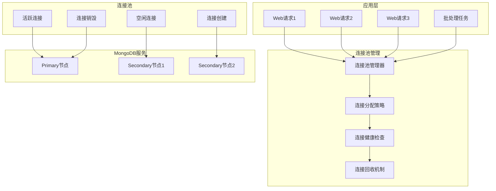

# 19. MongoDB优化-连接池配置

## 概述

连接池是MongoDB客户端与服务器之间的重要桥梁，合理的连接池配置直接影响应用程序的性能、资源使用和并发处理能力。本章将深入探讨MongoDB连接池的工作原理、配置策略和优化技巧，帮助开发者构建高效稳定的数据访问层。

想象一个在线视频平台，在热门内容发布时会有数万用户同时访问。如果连接池配置不当，要么因为连接数不足导致请求排队超时，要么因为连接过多消耗大量资源。通过精心调优连接池参数，包括最大连接数、空闲超时、连接验证等，最终实现了在高并发场景下的稳定性能表现。



## 知识要点

### 1. 连接池基础配置

#### 1.1 Spring Boot MongoDB连接池配置

```java
@Configuration
public class MongoConnectionPoolConfig {
    
    @Value("${mongodb.host:localhost}")
    private String host;
    
    @Value("${mongodb.port:27017}")
    private int port;
    
    @Value("${mongodb.database}")
    private String database;
    
    @Value("${mongodb.username}")
    private String username;
    
    @Value("${mongodb.password}")
    private String password;
    
    /**
     * 高性能连接池配置
     */
    @Bean
    @Primary
    public MongoClient highPerformanceMongoClient() {
        
        MongoCredential credential = MongoCredential.createCredential(
            username, database, password.toCharArray()
        );
        
        // 连接池配置
        ConnectionPoolSettings poolSettings = ConnectionPoolSettings.builder()
            .maxSize(200)                    // 最大连接数
            .minSize(10)                     // 最小连接数
            .maxWaitTime(30, TimeUnit.SECONDS)     // 获取连接最大等待时间
            .maxConnectionLifeTime(30, TimeUnit.MINUTES)  // 连接最大生存时间
            .maxConnectionIdleTime(10, TimeUnit.MINUTES)  // 连接最大空闲时间
            .maintenanceInitialDelay(0, TimeUnit.SECONDS) // 维护任务初始延迟
            .maintenanceFrequency(30, TimeUnit.SECONDS)   // 维护任务频率
            .build();
        
        // Socket配置
        SocketSettings socketSettings = SocketSettings.builder()
            .connectTimeout(5, TimeUnit.SECONDS)      // 连接超时
            .readTimeout(30, TimeUnit.SECONDS)        // 读取超时
            .build();
        
        // 服务器配置
        ServerSettings serverSettings = ServerSettings.builder()
            .heartbeatFrequency(10, TimeUnit.SECONDS)     // 心跳频率
            .minHeartbeatFrequency(500, TimeUnit.MILLISECONDS) // 最小心跳频率
            .build();
        
        MongoClientSettings settings = MongoClientSettings.builder()
            .applyToConnectionPoolSettings(builder -> builder.applySettings(poolSettings))
            .applyToSocketSettings(builder -> builder.applySettings(socketSettings))
            .applyToServerSettings(builder -> builder.applySettings(serverSettings))
            .applyToClusterSettings(builder -> 
                builder.hosts(Arrays.asList(new ServerAddress(host, port))))
            .credential(credential)
            .readPreference(ReadPreference.secondaryPreferred()) // 读偏好
            .writeConcern(WriteConcern.MAJORITY)                 // 写关注
            .readConcern(ReadConcern.MAJORITY)                   // 读关注
            .build();
        
        return MongoClients.create(settings);
    }
    
    /**
     * 批处理专用连接池
     */
    @Bean
    @Qualifier("batchMongoClient")
    public MongoClient batchProcessingMongoClient() {
        
        // 批处理场景的连接池配置
        ConnectionPoolSettings batchPoolSettings = ConnectionPoolSettings.builder()
            .maxSize(50)                     // 较少的连接数
            .minSize(5)
            .maxWaitTime(60, TimeUnit.SECONDS)     // 更长的等待时间
            .maxConnectionLifeTime(60, TimeUnit.MINUTES)  // 更长的生存时间
            .maxConnectionIdleTime(20, TimeUnit.MINUTES)  // 更长的空闲时间
            .build();
        
        SocketSettings batchSocketSettings = SocketSettings.builder()
            .connectTimeout(10, TimeUnit.SECONDS)     // 更长的连接超时
            .readTimeout(300, TimeUnit.SECONDS)       // 更长的读取超时
            .build();
        
        MongoClientSettings batchSettings = MongoClientSettings.builder()
            .applyToConnectionPoolSettings(builder -> builder.applySettings(batchPoolSettings))
            .applyToSocketSettings(builder -> builder.applySettings(batchSocketSettings))
            .applyToClusterSettings(builder -> 
                builder.hosts(Arrays.asList(new ServerAddress(host, port))))
            .credential(MongoCredential.createCredential(username, database, password.toCharArray()))
            .readPreference(ReadPreference.secondary()) // 优先从副本读取
            .writeConcern(WriteConcern.ACKNOWLEDGED)    // 较低的写关注级别
            .build();
        
        return MongoClients.create(batchSettings);
    }
    
    /**
     * 根据环境动态配置连接池
     */
    @Bean
    @Profile("production")
    public MongoClient productionMongoClient() {
        
        // 生产环境配置
        ConnectionPoolSettings prodPoolSettings = ConnectionPoolSettings.builder()
            .maxSize(500)                    // 生产环境更大的连接池
            .minSize(50)
            .maxWaitTime(10, TimeUnit.SECONDS)
            .maxConnectionLifeTime(60, TimeUnit.MINUTES)
            .maxConnectionIdleTime(5, TimeUnit.MINUTES)
            .build();
        
        MongoClientSettings prodSettings = MongoClientSettings.builder()
            .applyToConnectionPoolSettings(builder -> builder.applySettings(prodPoolSettings))
            .applyToClusterSettings(builder -> 
                builder.hosts(Arrays.asList(
                    new ServerAddress("mongo1.prod.com", 27017),
                    new ServerAddress("mongo2.prod.com", 27017),
                    new ServerAddress("mongo3.prod.com", 27017)
                )))
            .credential(MongoCredential.createCredential(username, database, password.toCharArray()))
            .readPreference(ReadPreference.secondaryPreferred())
            .writeConcern(WriteConcern.MAJORITY)
            .build();
        
        return MongoClients.create(prodSettings);
    }
    
    @Bean
    @Profile("development")
    public MongoClient developmentMongoClient() {
        
        // 开发环境配置
        ConnectionPoolSettings devPoolSettings = ConnectionPoolSettings.builder()
            .maxSize(20)                     // 开发环境较小的连接池
            .minSize(2)
            .maxWaitTime(30, TimeUnit.SECONDS)
            .maxConnectionLifeTime(10, TimeUnit.MINUTES)
            .maxConnectionIdleTime(2, TimeUnit.MINUTES)
            .build();
        
        MongoClientSettings devSettings = MongoClientSettings.builder()
            .applyToConnectionPoolSettings(builder -> builder.applySettings(devPoolSettings))
            .applyToClusterSettings(builder -> 
                builder.hosts(Arrays.asList(new ServerAddress("localhost", 27017))))
            .credential(MongoCredential.createCredential(username, database, password.toCharArray()))
            .build();
        
        return MongoClients.create(devSettings);
    }
}
```

### 2. 连接池监控与调优

#### 2.1 连接池状态监控

```java
@Service
public class ConnectionPoolMonitoringService {
    
    @Autowired
    private MongoClient mongoClient;
    
    /**
     * 监控连接池状态
     */
    public ConnectionPoolStats getConnectionPoolStats() {
        
        // 获取连接池事件监听器的统计信息
        ConnectionPoolStats stats = new ConnectionPoolStats();
        
        try {
            // 通过JMX或者自定义监听器获取连接池统计
            stats = collectConnectionPoolMetrics();
        } catch (Exception e) {
            System.err.println("获取连接池统计失败: " + e.getMessage());
        }
        
        return stats;
    }
    
    /**
     * 连接池健康检查
     */
    public ConnectionPoolHealth checkConnectionPoolHealth() {
        
        ConnectionPoolStats stats = getConnectionPoolStats();
        
        List<String> issues = new ArrayList<>();
        HealthStatus status = HealthStatus.HEALTHY;
        
        // 检查连接使用率
        if (stats.getConnectionUtilization() > 80) {
            issues.add("连接池使用率过高: " + String.format("%.1f%%", stats.getConnectionUtilization()));
            status = HealthStatus.WARNING;
        }
        
        if (stats.getConnectionUtilization() > 95) {
            status = HealthStatus.CRITICAL;
        }
        
        // 检查等待队列
        if (stats.getWaitQueueSize() > 10) {
            issues.add("等待队列过长: " + stats.getWaitQueueSize());
            status = HealthStatus.WARNING;
        }
        
        // 检查连接超时
        if (stats.getConnectionTimeouts() > 0) {
            issues.add("存在连接超时: " + stats.getConnectionTimeouts());
            status = HealthStatus.WARNING;
        }
        
        return ConnectionPoolHealth.builder()
            .status(status)
            .issues(issues)
            .stats(stats)
            .recommendations(generateOptimizationRecommendations(stats))
            .timestamp(new Date())
            .build();
    }
    
    /**
     * 连接池性能分析
     */
    public ConnectionPoolPerformanceReport analyzeConnectionPoolPerformance() {
        
        ConnectionPoolStats currentStats = getConnectionPoolStats();
        
        // 计算性能指标
        double avgConnectionAcquisitionTime = calculateAvgAcquisitionTime();
        double connectionTurnoverRate = calculateConnectionTurnoverRate();
        double poolEfficiency = calculatePoolEfficiency(currentStats);
        
        return ConnectionPoolPerformanceReport.builder()
            .avgConnectionAcquisitionTime(avgConnectionAcquisitionTime)
            .connectionTurnoverRate(connectionTurnoverRate)
            .poolEfficiency(poolEfficiency)
            .currentStats(currentStats)
            .optimizationSuggestions(generatePerformanceSuggestions(currentStats))
            .build();
    }
    
    /**
     * 动态调整连接池参数
     */
    public void optimizeConnectionPoolDynamically() {
        
        ConnectionPoolStats stats = getConnectionPoolStats();
        
        // 基于当前负载动态调整
        if (stats.getConnectionUtilization() > 90) {
            System.out.println("高负载检测，建议增加最大连接数");
            // 在实际应用中，可能需要重新创建MongoClient
            // 或者使用支持动态调整的连接池实现
        }
        
        if (stats.getConnectionUtilization() < 20 && stats.getActiveConnections() > stats.getMinConnections()) {
            System.out.println("低负载检测，可以考虑减少连接数");
        }
        
        // 检查空闲连接过多
        if (stats.getIdleConnections() > stats.getActiveConnections() * 2) {
            System.out.println("空闲连接过多，建议调整空闲超时时间");
        }
    }
    
    /**
     * 连接池预热
     */
    public void warmupConnectionPool() {
        
        System.out.println("开始连接池预热...");
        
        int targetConnections = 10; // 预热连接数
        List<CompletableFuture<Void>> warmupTasks = new ArrayList<>();
        
        for (int i = 0; i < targetConnections; i++) {
            CompletableFuture<Void> task = CompletableFuture.runAsync(() -> {
                try {
                    // 执行简单的数据库操作来创建连接
                    mongoClient.getDatabase("admin").runCommand(new Document("ping", 1));
                } catch (Exception e) {
                    System.err.println("连接预热失败: " + e.getMessage());
                }
            });
            warmupTasks.add(task);
        }
        
        // 等待所有预热任务完成
        CompletableFuture.allOf(warmupTasks.toArray(new CompletableFuture[0]))
            .thenRun(() -> System.out.println("连接池预热完成"))
            .exceptionally(throwable -> {
                System.err.println("连接池预热异常: " + throwable.getMessage());
                return null;
            });
    }
    
    private ConnectionPoolStats collectConnectionPoolMetrics() {
        // 这里应该从实际的连接池监控中获取数据
        // MongoDB Java驱动可能需要自定义监听器来收集这些指标
        
        return ConnectionPoolStats.builder()
            .maxConnections(200)
            .minConnections(10)
            .activeConnections(45)
            .idleConnections(15)
            .waitQueueSize(2)
            .connectionTimeouts(0)
            .connectionsCreated(60)
            .connectionsDestroyed(5)
            .build();
    }
    
    private double calculateAvgAcquisitionTime() {
        // 计算平均连接获取时间
        return 50.0; // 毫秒
    }
    
    private double calculateConnectionTurnoverRate() {
        // 计算连接周转率
        return 0.1; // 每秒
    }
    
    private double calculatePoolEfficiency(ConnectionPoolStats stats) {
        // 计算连接池效率
        double totalConnections = stats.getActiveConnections() + stats.getIdleConnections();
        return stats.getActiveConnections() / totalConnections * 100;
    }
    
    private List<String> generateOptimizationRecommendations(ConnectionPoolStats stats) {
        List<String> recommendations = new ArrayList<>();
        
        if (stats.getConnectionUtilization() > 80) {
            recommendations.add("建议增加最大连接数到 " + (stats.getMaxConnections() * 1.5));
        }
        
        if (stats.getIdleConnections() > stats.getActiveConnections()) {
            recommendations.add("建议减少空闲超时时间");
        }
        
        if (stats.getWaitQueueSize() > 5) {
            recommendations.add("建议优化查询性能或增加连接数");
        }
        
        return recommendations;
    }
    
    private List<String> generatePerformanceSuggestions(ConnectionPoolStats stats) {
        List<String> suggestions = new ArrayList<>();
        
        suggestions.add("当前连接池效率: " + String.format("%.1f%%", calculatePoolEfficiency(stats)));
        
        if (calculatePoolEfficiency(stats) < 60) {
            suggestions.add("连接池效率较低，建议减少最小连接数");
        }
        
        return suggestions;
    }
    
    // 数据模型类
    @Data
    @Builder
    public static class ConnectionPoolStats {
        private Integer maxConnections;
        private Integer minConnections;
        private Integer activeConnections;
        private Integer idleConnections;
        private Integer waitQueueSize;
        private Integer connectionTimeouts;
        private Long connectionsCreated;
        private Long connectionsDestroyed;
        
        public double getConnectionUtilization() {
            return (double) (activeConnections + idleConnections) / maxConnections * 100;
        }
    }
    
    @Data
    @Builder
    public static class ConnectionPoolHealth {
        private HealthStatus status;
        private List<String> issues;
        private ConnectionPoolStats stats;
        private List<String> recommendations;
        private Date timestamp;
    }
    
    @Data
    @Builder
    public static class ConnectionPoolPerformanceReport {
        private Double avgConnectionAcquisitionTime;
        private Double connectionTurnoverRate;
        private Double poolEfficiency;
        private ConnectionPoolStats currentStats;
        private List<String> optimizationSuggestions;
    }
    
    public enum HealthStatus {
        HEALTHY, WARNING, CRITICAL
    }
}
```

### 3. 连接池最佳实践

#### 3.1 场景化配置策略

```java
@Component
public class ConnectionPoolBestPractices {
    
    /**
     * Web应用连接池配置
     */
    public ConnectionPoolSettings getWebApplicationPoolSettings() {
        return ConnectionPoolSettings.builder()
            // Web应用特点：高并发、短连接、快速响应
            .maxSize(100)                    // 中等大小的连接池
            .minSize(10)                     // 保持一定的最小连接
            .maxWaitTime(5, TimeUnit.SECONDS)      // 短等待时间
            .maxConnectionIdleTime(5, TimeUnit.MINUTES)   // 较短的空闲时间
            .maxConnectionLifeTime(30, TimeUnit.MINUTES)  // 定期更新连接
            .build();
    }
    
    /**
     * 批处理应用连接池配置
     */
    public ConnectionPoolSettings getBatchProcessingPoolSettings() {
        return ConnectionPoolSettings.builder()
            // 批处理特点：长时间运行、稳定连接、高吞吐
            .maxSize(20)                     // 较小的连接池
            .minSize(5)                      // 少量最小连接
            .maxWaitTime(60, TimeUnit.SECONDS)     // 长等待时间
            .maxConnectionIdleTime(30, TimeUnit.MINUTES)  // 长空闲时间
            .maxConnectionLifeTime(120, TimeUnit.MINUTES) // 长生存时间
            .build();
    }
    
    /**
     * 微服务连接池配置
     */
    public ConnectionPoolSettings getMicroservicePoolSettings() {
        return ConnectionPoolSettings.builder()
            // 微服务特点：快速启动、资源受限、弹性伸缩
            .maxSize(50)                     // 适中的连接池
            .minSize(2)                      // 较少的最小连接
            .maxWaitTime(10, TimeUnit.SECONDS)     // 中等等待时间
            .maxConnectionIdleTime(2, TimeUnit.MINUTES)   // 快速回收
            .maxConnectionLifeTime(15, TimeUnit.MINUTES)  // 短生存时间
            .build();
    }
    
    /**
     * 连接池配置验证
     */
    public ConfigurationValidationResult validateConnectionPoolConfig(ConnectionPoolSettings settings) {
        
        List<String> warnings = new ArrayList<>();
        List<String> errors = new ArrayList<>();
        
        // 验证连接数配置
        if (settings.getMaxSize() < settings.getMinSize()) {
            errors.add("最大连接数不能小于最小连接数");
        }
        
        if (settings.getMaxSize() > 1000) {
            warnings.add("最大连接数过大可能导致资源浪费");
        }
        
        if (settings.getMinSize() == 0) {
            warnings.add("最小连接数为0可能导致冷启动延迟");
        }
        
        // 验证超时配置
        if (settings.getMaxWaitTimeMS() < 1000) {
            warnings.add("等待超时时间过短可能导致频繁超时");
        }
        
        if (settings.getMaxWaitTimeMS() > 60000) {
            warnings.add("等待超时时间过长可能影响用户体验");
        }
        
        // 验证生存时间配置
        if (settings.getMaxConnectionIdleTimeMS() > settings.getMaxConnectionLifeTimeMS()) {
            warnings.add("空闲超时时间大于生存时间可能导致配置无效");
        }
        
        boolean isValid = errors.isEmpty();
        
        return ConfigurationValidationResult.builder()
            .isValid(isValid)
            .warnings(warnings)
            .errors(errors)
            .recommendations(generateConfigRecommendations(settings))
            .build();
    }
    
    /**
     * 连接池故障恢复策略
     */
    public void implementConnectionPoolResilienceStrategies() {
        
        System.out.println("=== 连接池故障恢复策略 ===");
        
        // 1. 连接重试机制
        System.out.println("1. 实施指数退避重试策略");
        System.out.println("   - 初始重试间隔: 100ms");
        System.out.println("   - 最大重试间隔: 5s");
        System.out.println("   - 最大重试次数: 3次");
        
        // 2. 熔断器模式
        System.out.println("2. 集成熔断器保护机制");
        System.out.println("   - 失败阈值: 50%");
        System.out.println("   - 熔断时间: 30s");
        System.out.println("   - 半开状态测试请求数: 5个");
        
        // 3. 降级策略
        System.out.println("3. 实施服务降级策略");
        System.out.println("   - 读操作降级到缓存");
        System.out.println("   - 写操作使用消息队列缓冲");
        System.out.println("   - 非关键功能暂时禁用");
        
        // 4. 监控告警
        System.out.println("4. 完善监控告警机制");
        System.out.println("   - 连接池使用率 > 80% 告警");
        System.out.println("   - 连接获取超时 > 5s 告警");
        System.out.println("   - 连接创建失败率 > 10% 告警");
    }
    
    /**
     * 连接池调优检查清单
     */
    public void displayOptimizationChecklist() {
        
        System.out.println("\n=== 连接池调优检查清单 ===");
        
        List<String> checklist = Arrays.asList(
            "✓ 根据应用类型选择合适的连接池大小",
            "✓ 设置合理的连接超时和空闲超时时间",
            "✓ 配置适当的连接生存时间避免长连接问题",
            "✓ 实施连接池监控和告警机制",
            "✓ 定期分析连接使用模式和性能指标",
            "✓ 测试极限负载下的连接池表现",
            "✓ 实施连接池故障恢复和降级策略",
            "✓ 根据业务增长动态调整连接池配置",
            "✓ 验证连接池配置在不同环境的适用性",
            "✓ 建立连接池性能基线和趋势分析"
        );
        
        checklist.forEach(System.out::println);
    }
    
    private List<String> generateConfigRecommendations(ConnectionPoolSettings settings) {
        List<String> recommendations = new ArrayList<>();
        
        // 基于配置给出建议
        if (settings.getMaxSize() < 10) {
            recommendations.add("考虑增加最大连接数以支持更高并发");
        }
        
        if (settings.getMinSize() > settings.getMaxSize() / 2) {
            recommendations.add("最小连接数可能过高，考虑减少以节省资源");
        }
        
        if (settings.getMaxConnectionIdleTimeMS() < 60000) {
            recommendations.add("空闲超时时间较短，可能导致频繁的连接创建");
        }
        
        return recommendations;
    }
    
    @Data
    @Builder
    public static class ConfigurationValidationResult {
        private Boolean isValid;
        private List<String> warnings;
        private List<String> errors;
        private List<String> recommendations;
    }
}
```

## 知识扩展

### 1. 设计思想

MongoDB连接池优化基于以下核心原则：

1. **资源平衡**：在性能需求和资源消耗之间找到平衡点
2. **场景适配**：根据不同的应用场景选择不同的配置策略
3. **弹性设计**：连接池应该能够适应负载变化和故障场景
4. **持续优化**：基于监控数据持续调整和优化配置

### 2. 避坑指南

1. **连接数配置**：
   - 避免设置过大的连接池浪费资源
   - 避免设置过小的连接池导致性能瓶颈
   - 考虑数据库服务器的连接限制

2. **超时设置**：
   - 连接超时不宜过短，避免网络抖动导致失败
   - 等待超时要考虑用户体验和系统稳定性
   - 空闲超时要平衡资源回收和连接创建成本

3. **监控管理**：
   - 定期检查连接池使用情况
   - 关注连接泄漏和长时间占用
   - 建立告警机制及时发现问题

### 3. 深度思考题

1. **连接池大小计算**：如何科学地计算应用程序需要的连接池大小？

2. **故障恢复策略**：当数据库连接出现问题时，如何设计有效的恢复机制？

3. **多数据源管理**：在微服务架构中，如何管理多个MongoDB实例的连接池？

**深度思考题解答：**

1. **连接池大小计算**：
   - 公式：Pool Size = TPS × Average Response Time × Safety Factor
   - 考虑因素：并发用户数、平均请求时长、数据库处理能力
   - 实践方法：从小开始，基于负载测试逐步调整
   - 监控指标：连接使用率、等待队列长度、响应时间

2. **故障恢复策略**：
   - 连接验证：定期验证连接有效性
   - 重试机制：指数退避重试策略
   - 熔断保护：防止雪崩效应
   - 降级方案：缓存、消息队列等备选方案

3. **多数据源管理**：
   - 连接池隔离：不同数据源使用独立连接池
   - 配置中心化：统一管理连接池配置
   - 路由策略：基于业务规则的数据源路由
   - 监控统一：所有连接池的统一监控和告警

MongoDB连接池优化是一个需要结合具体业务场景和系统环境的复杂任务，需要在性能、资源和稳定性之间找到最佳平衡点。