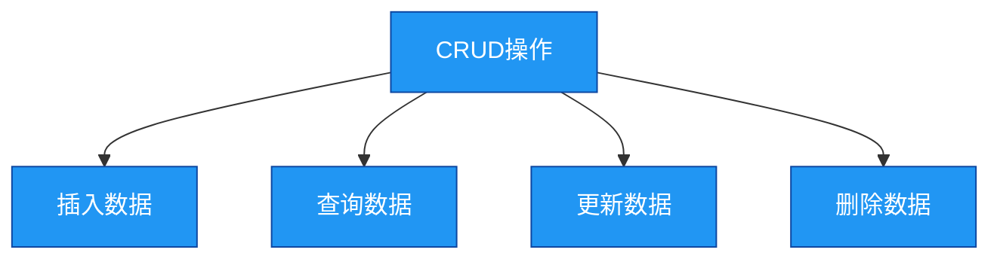

# 2. Mongo数据库实践-增删改查

## 概述
增删改查(CRUD)是数据库操作的基础，MongoDB提供了丰富的API来支持这些操作。本章将详细介绍MongoDB中的CRUD操作，包括插入数据、查询数据、更新数据和删除数据。



## 知识要点
### 1. 插入数据
- **插入单个文档**: 使用`insertOne()`方法
- **插入多个文档**: 使用`insertMany()`方法

```java
// 示例：插入单个文档
Document document = new Document();
document.append("name", "张三");
document.append("age", 30);
document.append("address", new Document("city", "北京").append("street", "朝阳区"));
document.append("hobbies", Arrays.asList("读书", "旅行"));

collection.insertOne(document);

// 示例：插入多个文档
List<Document> documents = new ArrayList<>();
// 添加多个文档...
collection.insertMany(documents);
```

### 2. 查询数据
- **查询所有文档**: 使用`find()`方法
- **查询单个文档**: 使用`findOne()`方法
- **条件查询**: 使用查询过滤器
- **排序**: 使用`sort()`方法
- **分页**: 使用`skip()`和`limit()`方法

```java
// 示例：查询所有文档
FindIterable<Document> documents = collection.find();

// 示例：条件查询
Document filter = new Document("age", new Document("$gt", 25));
FindIterable<Document> documents = collection.find(filter);

// 示例：排序和分页
FindIterable<Document> documents = collection.find()
    .sort(new Document("age", 1))
    .skip(10)
    .limit(5);
```

### 3. 更新数据
- **更新单个文档**: 使用`updateOne()`方法
- **更新多个文档**: 使用`updateMany()`方法
- **替换文档**: 使用`replaceOne()`方法
- **更新操作符**: 如`$set`, `$inc`, `$push`等

```java
// 示例：更新单个文档
Document filter = new Document("name", "张三");
Document update = new Document("$set", new Document("age", 31));
collection.updateOne(filter, update);

// 示例：更新多个文档
Document filter = new Document("age", new Document("$lt", 30));
Document update = new Document("$inc", new Document("age", 1));
collection.updateMany(filter, update);
```

### 4. 删除数据
- **删除单个文档**: 使用`deleteOne()`方法
- **删除多个文档**: 使用`deleteMany()`方法
- **删除所有文档**: 使用空过滤器

```java
// 示例：删除单个文档
Document filter = new Document("name", "张三");
collection.deleteOne(filter);

// 示例：删除多个文档
Document filter = new Document("age", new Document("$gt", 40));
collection.deleteMany(filter);
```

## 知识扩展
### 1. 设计思想
MongoDB的CRUD操作设计遵循了简单直观的原则，API设计类似于自然语言，容易理解和使用。同时，MongoDB提供了丰富的选项和参数，使得操作更加灵活，可以满足各种复杂的业务需求。

### 2. 避坑指南
- 插入数据时，确保设置了合适的索引，否则查询性能会下降。
- 查询数据时，尽量避免全表扫描，使用过滤器来限制返回的文档数量。
- 更新数据时，尽量使用`$set`操作符而不是替换整个文档，这样可以减少网络传输和写入开销。
- 删除数据时，要小心谨慎，确保过滤器正确，避免误删数据。

### 3. 深度思考题
- 什么是MongoDB中的批量操作？它有什么优势？
- 如何在MongoDB中实现分页查询？有哪些注意事项？
- 什么是乐观并发控制？MongoDB是如何实现的？

**深度思考题回答:**
- 批量操作是指一次性执行多个操作，如`insertMany()`, `updateMany()`, `deleteMany()`等。它的优势是减少网络传输次数，提高操作效率。
- 在MongoDB中，可以使用`skip()`和`limit()`方法来实现分页查询。需要注意的是，当`skip()`的参数很大时，性能会下降，因为MongoDB需要跳过大量的文档。可以考虑使用基于游标的分页方式来优化。
- 乐观并发控制是一种并发控制机制，它假设冲突很少发生，因此不进行锁操作，而是在提交时检查是否有冲突。MongoDB通过`_id`字段和版本控制来实现乐观并发控制。