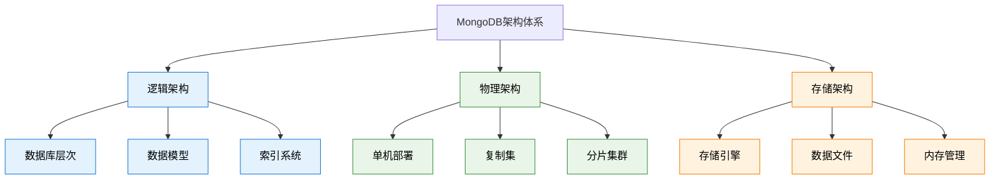
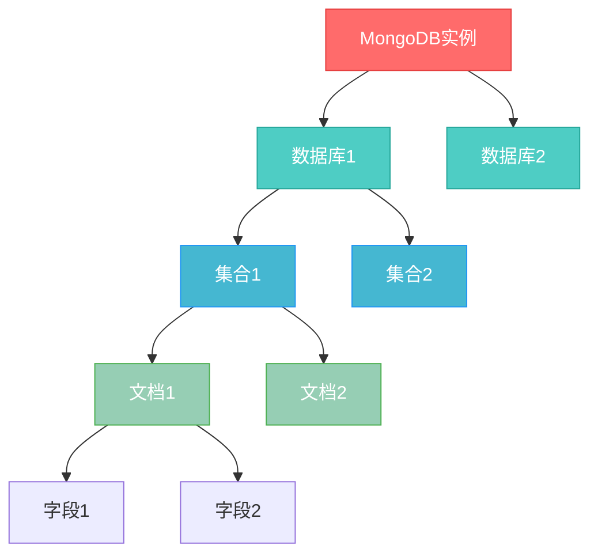
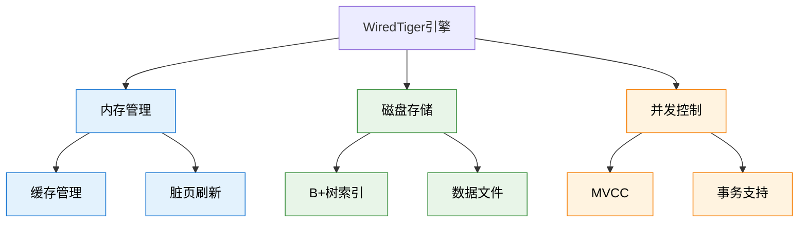
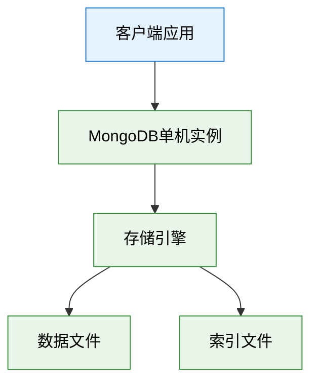
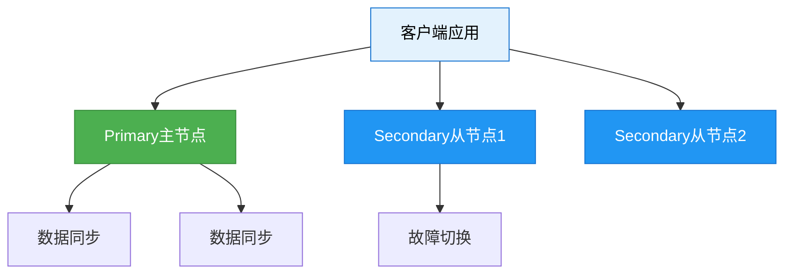
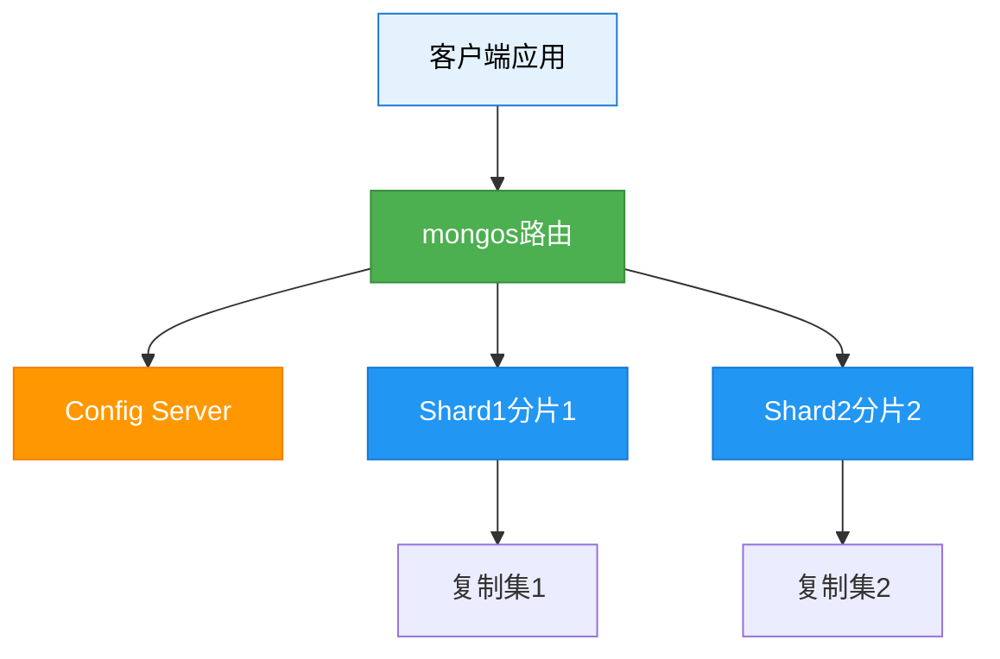

# 基础-概念与架构

## 概述

深入理解MongoDB的核心概念和架构设计是掌握这一NoSQL数据库的基础。与传统关系型数据库不同，MongoDB采用了文档存储模型和分布式架构设计，这使得它在处理非结构化数据和大规模应用时具有独特的优势。本文将从实际业务场景出发，详细解析MongoDB的核心概念、存储引擎、架构设计原理，帮助开发者构建对MongoDB系统性的认知框架。

在企业级应用中，正确理解MongoDB的架构设计对于系统性能优化、容量规划和故障排查至关重要。无论是电商平台的高并发读写，还是物联网系统的海量数据处理，MongoDB的架构特性都直接影响着应用的性能表现和扩展能力。



## 知识要点

### 1. MongoDB逻辑架构层次

#### 1.1 数据库层次结构

MongoDB的逻辑架构采用层次化设计，从上到下依次为：实例 → 数据库 → 集合 → 文档 → 字段。



**电商平台实际案例：**

```java
// MongoDB实例：production-ecommerce-cluster
// └── 数据库：ecommerce_db
//     ├── 集合：products (商品集合)
//     ├── 集合：orders (订单集合)
//     └── 集合：users (用户集合)

// 商品文档示例
{
  "_id": ObjectId("65a1b2c3d4e5f67890123456"),
  "productCode": "PHONE-IPHONE15-PRO-256",
  "name": "iPhone 15 Pro 256GB",
  "category": {
    "primary": "electronics",
    "secondary": "smartphones"
  },
  "pricing": {
    "basePrice": 7999.00,
    "currentPrice": 7199.00,
    "currency": "CNY"
  },
  "inventory": {
    "totalStock": 1000,
    "availableStock": 756
  },
  "metadata": {
    "createdAt": ISODate("2023-09-22T10:00:00Z"),
    "updatedAt": ISODate("2024-01-15T14:30:00Z")
  }
}
```

#### 1.2 BSON数据类型系统

MongoDB使用BSON（Binary JSON）格式存储数据，支持比JSON更丰富的数据类型：

```java
// BSON核心数据类型及应用场景
{
  // 基础类型
  "stringField": "UTF-8字符串",
  "numberField": 42,
  "doubleField": 3.14159,
  "booleanField": true,
  "nullField": null,
  
  // 特殊类型
  "_id": ObjectId("65a1b2c3d4e5f67890123456"),   // 唯一标识符
  "dateField": ISODate("2024-01-15T10:30:00Z"),  // ISO日期
  "binaryField": BinData(0, "base64data..."),     // 二进制数据
  
  // 复合类型
  "arrayField": [1, 2, 3, "mixed", true],         // 数组
  "documentField": {                              // 嵌套文档
    "nestedField1": "value1",
    "nestedField2": "value2"
  }
}
```

### 2. MongoDB存储引擎架构

#### 2.1 WiredTiger存储引擎

WiredTiger是MongoDB的默认存储引擎，采用多版本并发控制（MVCC）和数据压缩技术：



**存储引擎配置示例：**

```java
// mongod.conf 配置文件
storage:
  engine: wiredTiger
  wiredTiger:
    engineConfig:
      cacheSizeGB: 8              // 缓存大小
      checkpointSizeMB: 1000      // 检查点间隔
    collectionConfig:
      blockCompressor: snappy     // 压缩算法
    indexConfig:
      prefixCompression: true     // 索引压缩

// Java应用监控存储状态
@Service
public class StorageMonitorService {
    
    @Autowired
    private MongoTemplate mongoTemplate;
    
    public StorageStats getStorageStats() {
        Document stats = mongoTemplate.getDb()
            .runCommand(new Document("dbStats", 1));
        
        return StorageStats.builder()
            .dataSize(stats.getLong("dataSize"))
            .storageSize(stats.getLong("storageSize"))
            .indexSize(stats.getLong("indexSize"))
            .build();
    }
}
```

### 3. MongoDB物理架构模式

#### 3.1 单机部署架构

适用于开发测试环境：



#### 3.2 复制集架构

提供高可用性的生产环境架构：



#### 3.3 分片集群架构

支持水平扩展的大规模架构：



## 知识扩展

### 1. 架构选择决策指南

```java
// 架构选择决策工具
public class ArchitectureDecisionTool {
    
    public enum ArchitectureType {
        STANDALONE,     // 单机
        REPLICA_SET,    // 复制集
        SHARDED_CLUSTER // 分片集群
    }
    
    public static ArchitectureType recommend(
            long expectedDataSize,      // 预期数据量（GB）
            int expectedQPS,           // 预期每秒查询数
            boolean requireHA,         // 是否需要高可用
            String environment) {      // 环境类型
        
        if ("development".equals(environment)) {
            return ArchitectureType.STANDALONE;
        }
        
        if (expectedDataSize > 1000 || expectedQPS > 10000) {
            return ArchitectureType.SHARDED_CLUSTER;
        } else if (requireHA || expectedQPS > 1000) {
            return ArchitectureType.REPLICA_SET;
        } else {
            return ArchitectureType.STANDALONE;
        }
    }
}
```

### 2. 性能调优最佳实践

```java
// 连接池优化配置
@Configuration
public class MongoConnectionConfig {
    
    @Bean
    public MongoClientSettings mongoClientSettings() {
        return MongoClientSettings.builder()
            .connectionPoolSettings(
                ConnectionPoolSettings.builder()
                    .maxSize(100)                    // 最大连接数
                    .minSize(10)                     // 最小连接数
                    .maxWaitTime(30, TimeUnit.SECONDS)
                    .build())
            .build();
    }
}

// 批量操作优化
@Service
public class BatchOperationService {
    
    @Autowired
    private MongoTemplate mongoTemplate;
    
    public void batchInsert(List<Document> documents) {
        int batchSize = 1000;
        for (int i = 0; i < documents.size(); i += batchSize) {
            List<Document> batch = documents.subList(i, 
                Math.min(i + batchSize, documents.size()));
            
            BulkOperations bulkOps = mongoTemplate.bulkOps(
                BulkOperations.BulkMode.UNORDERED, "collection");
            batch.forEach(bulkOps::insert);
            bulkOps.execute();
        }
    }
}
```

### 3. 监控与诊断

```java
// 架构健康监控
@Component
public class ArchitectureMonitor {
    
    @Scheduled(fixedRate = 60000)
    public void monitorHealth() {
        checkReplicaSetStatus();
        checkStorageStats();
        checkConnectionPool();
    }
    
    private void checkReplicaSetStatus() {
        try {
            Document replStatus = mongoTemplate.getDb()
                .runCommand(new Document("replSetGetStatus", 1));
            
            String state = replStatus.getString("myState");
            if (!"1".equals(state) && !"2".equals(state)) {
                alertManager.sendAlert("Replica set unhealthy: " + state);
            }
        } catch (Exception e) {
            log.debug("Not in replica set environment");
        }
    }
}
```

## 深度思考

### 1. 架构演进策略

MongoDB架构的演进通常遵循以下路径：
1. **起始阶段**：单机部署 → 原型验证
2. **成长阶段**：复制集 → 高可用性
3. **扩展阶段**：分片集群 → 水平扩展

### 2. 与微服务的集成

MongoDB的文档模型与微服务的数据独立性要求高度契合，每个微服务可以使用独立的MongoDB实例，通过事件驱动架构实现数据一致性。

### 3. 容量规划考虑

在进行容量规划时，需要考虑：
- 数据增长速度
- 读写比例
- 索引空间开销
- 压缩效果
- 复制和分片的额外开销

通过深入理解MongoDB的概念与架构，开发者能够做出更好的设计决策，构建高性能、可扩展的数据存储解决方案。