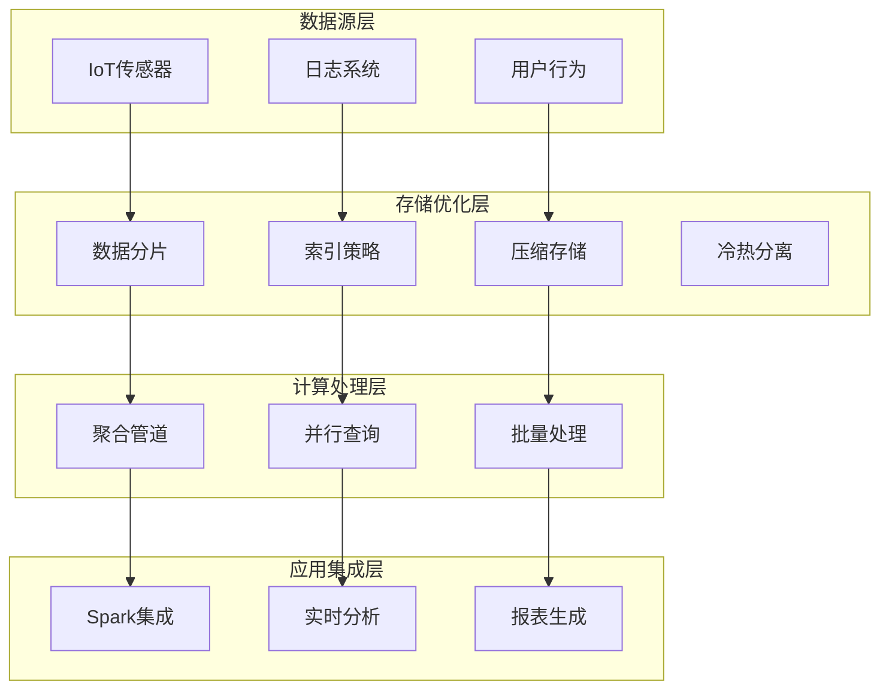

# 优化-大数据处理

## 概述

随着数据量的爆炸式增长，MongoDB在大数据处理场景中面临着存储容量、查询性能、数据传输等多重挑战。本章将探讨如何在大数据环境下优化MongoDB的性能，包括数据分区策略、批量处理技术、内存优化和分布式计算集成等关键技术。

想象一个物联网平台每天产生数十亿条传感器数据，单表数据量达到TB级别。通过分片集群、数据分层存储、聚合管道优化等技术手段，将原本需要数小时的分析任务优化到分钟级完成。



## 知识要点

### 1. 大数据存储优化

#### 1.1 分片策略设计

```java
@Service
public class BigDataStorageOptimizationService {
    
    @Autowired
    private MongoTemplate mongoTemplate;
    
    /**
     * 时间序列数据分片策略
     */
    public void optimizeTimeSeriesSharding(String collectionName) {
        
        // 基于时间的复合分片键设计
        Document shardKey = new Document("timestamp", 1)
            .append("deviceId", "hashed");
        
        try {
            // 启用分片
            mongoTemplate.getDb().runCommand(
                new Document("enableSharding", mongoTemplate.getDb().getName())
            );
            
            // 配置集合分片
            mongoTemplate.getDb().runCommand(
                new Document("shardCollection", mongoTemplate.getDb().getName() + "." + collectionName)
                    .append("key", shardKey)
            );
            
            // 预分片优化
            createTimeBasedPresplits(collectionName);
            
            System.out.println("时间序列数据分片配置完成");
            
        } catch (Exception e) {
            System.err.println("分片配置失败: " + e.getMessage());
        }
    }
    
    /**
     * 数据压缩策略
     */
    public void implementDataCompression(String collectionName) {
        
        System.out.println("=== 数据压缩策略 ===");
        System.out.println("1. 集合级压缩: 使用zstd压缩算法");
        System.out.println("2. 索引压缩: 创建时启用compression选项");
        System.out.println("3. 数据类型优化:");
        System.out.println("   - 使用NumberInt代替NumberLong");
        System.out.println("   - 使用数值编码代替长字符串");
        System.out.println("   - 避免存储null值字段");
        
        // 数据类型优化示例
        optimizeDataTypes();
    }
    
    /**
     * 冷热数据分离
     */
    public void implementHotColdDataSeparation(String hotCollection, String coldCollection) {
        
        Date thirtyDaysAgo = new Date(System.currentTimeMillis() - 30L * 24 * 60 * 60 * 1000);
        
        // 将30天前的数据迁移到冷存储
        Query coldDataQuery = new Query(Criteria.where("createTime").lt(thirtyDaysAgo));
        
        List<Document> coldData = mongoTemplate.find(coldDataQuery, Document.class, hotCollection);
        
        if (!coldData.isEmpty()) {
            System.out.println("开始迁移 " + coldData.size() + " 条冷数据");
            
            // 批量插入到冷存储集合
            mongoTemplate.insert(coldData, coldCollection);
            
            // 从热存储中删除
            mongoTemplate.remove(coldDataQuery, hotCollection);
            
            System.out.println("冷数据迁移完成");
        }
    }
    
    private void createTimeBasedPresplits(String collectionName) {
        Calendar cal = Calendar.getInstance();
        
        // 为未来12个月创建预分片
        for (int i = 0; i < 12; i++) {
            cal.add(Calendar.MONTH, 1);
            Date splitDate = cal.getTime();
            
            Document splitPoint = new Document("timestamp", splitDate);
            
            try {
                mongoTemplate.getDb().runCommand(
                    new Document("split", mongoTemplate.getDb().getName() + "." + collectionName)
                        .append("middle", splitPoint)
                );
            } catch (Exception e) {
                // 忽略已存在的分片点
            }
        }
        
        System.out.println("时间预分片创建完成");
    }
    
    private void optimizeDataTypes() {
        System.out.println("数据类型优化示例:");
        System.out.println("原始: {status: 'waiting_for_payment', amount: '100.50'}");
        System.out.println("优化: {status: 1, amount: NumberDecimal('100.50')}");
    }
}
```

### 2. 大数据查询优化

#### 2.1 聚合管道优化

```java
@Service
public class BigDataQueryOptimizationService {
    
    @Autowired
    private MongoTemplate mongoTemplate;
    
    /**
     * 优化大数据聚合查询
     */
    public AggregationResult optimizedBigDataAggregation(String collectionName, Date startDate, Date endDate) {
        
        // 使用allowDiskUse处理大数据集
        AggregationOptions options = AggregationOptions.builder()
            .allowDiskUse(true)
            .batchSize(1000)
            .maxTime(300, TimeUnit.SECONDS)
            .build();
        
        Aggregation aggregation = Aggregation.newAggregation(
            // 1. 首先过滤数据
            Aggregation.match(
                Criteria.where("timestamp").gte(startDate).lte(endDate)
                    .and("status").in("active", "completed")
            ),
            
            // 2. 投影只需要的字段
            Aggregation.project("deviceId", "timestamp", "value", "status"),
            
            // 3. 按时间窗口分组
            Aggregation.group(
                Fields.from(
                    Fields.field("deviceId", "deviceId"),
                    Fields.field("hour", new Document("$dateToString", 
                        new Document("format", "%Y-%m-%d-%H")
                            .append("date", "$timestamp")))
                )
            )
            .avg("value").as("avgValue")
            .sum("value").as("totalValue")
            .count().as("recordCount"),
            
            // 4. 排序和限制
            Aggregation.sort(Sort.Direction.ASC, "_id.hour"),
            Aggregation.limit(10000)
            
        ).withOptions(options);
        
        long startTime = System.currentTimeMillis();
        
        AggregationResults<Document> results = mongoTemplate.aggregate(
            aggregation, collectionName, Document.class
        );
        
        long executionTime = System.currentTimeMillis() - startTime;
        
        return AggregationResult.builder()
            .results(results.getMappedResults())
            .executionTimeMs(executionTime)
            .resultCount(results.getMappedResults().size())
            .build();
    }
    
    /**
     * 并行聚合查询
     */
    public List<AggregationResult> parallelAggregation(String collectionName, int numberOfThreads) {
        
        // 将数据范围分割为多个子区间
        List<DateRange> dateRanges = createDateRanges(numberOfThreads);
        
        List<CompletableFuture<AggregationResult>> futures = dateRanges.stream()
            .map(range -> CompletableFuture.supplyAsync(() -> 
                optimizedBigDataAggregation(collectionName, range.getStartDate(), range.getEndDate())
            ))
            .collect(Collectors.toList());
        
        // 等待所有任务完成
        return futures.stream()
            .map(CompletableFuture::join)
            .collect(Collectors.toList());
    }
    
    /**
     * 基于游标的分页查询
     */
    public PageResult<Document> cursorBasedPagination(String collectionName, String lastId, int pageSize) {
        
        Query query = new Query();
        
        // 使用_id作为游标
        if (lastId != null) {
            query.addCriteria(Criteria.where("_id").gt(new ObjectId(lastId)));
        }
        
        query.limit(pageSize + 1);
        query.with(Sort.by(Sort.Direction.ASC, "_id"));
        
        List<Document> results = mongoTemplate.find(query, Document.class, collectionName);
        
        boolean hasNext = results.size() > pageSize;
        if (hasNext) {
            results.remove(results.size() - 1);
        }
        
        String nextCursor = null;
        if (!results.isEmpty()) {
            Document lastDoc = results.get(results.size() - 1);
            nextCursor = lastDoc.getObjectId("_id").toString();
        }
        
        return PageResult.<Document>builder()
            .data(results)
            .hasNext(hasNext)
            .nextCursor(nextCursor)
            .pageSize(pageSize)
            .build();
    }
    
    /**
     * 流式处理大结果集
     */
    public void streamLargeResultSet(String collectionName, Consumer<Document> processor) {
        
        Query query = new Query();
        query.limit(1000);
        
        boolean hasMore = true;
        int skip = 0;
        
        while (hasMore) {
            query.skip(skip);
            
            List<Document> batch = mongoTemplate.find(query, Document.class, collectionName);
            
            if (batch.isEmpty()) {
                hasMore = false;
            } else {
                batch.forEach(processor);
                skip += batch.size();
                
                if (batch.size() < 1000) {
                    hasMore = false;
                }
            }
        }
    }
    
    private List<DateRange> createDateRanges(int numberOfRanges) {
        List<DateRange> ranges = new ArrayList<>();
        
        Calendar cal = Calendar.getInstance();
        cal.add(Calendar.DAY_OF_MONTH, -numberOfRanges);
        
        for (int i = 0; i < numberOfRanges; i++) {
            Date start = cal.getTime();
            cal.add(Calendar.DAY_OF_MONTH, 1);
            Date end = cal.getTime();
            
            ranges.add(new DateRange(start, end));
        }
        
        return ranges;
    }
    
    // 数据模型类
    @Data
    @Builder
    public static class AggregationResult {
        private List<Document> results;
        private Long executionTimeMs;
        private Integer resultCount;
    }
    
    @Data
    @Builder
    public static class PageResult<T> {
        private List<T> data;
        private Boolean hasNext;
        private String nextCursor;
        private Integer pageSize;
    }
    
    @Data
    @AllArgsConstructor
    public static class DateRange {
        private Date startDate;
        private Date endDate;
    }
}
```

### 3. 大数据处理集成

#### 3.1 与外部计算框架集成

```java
@Service
public class BigDataIntegrationService {
    
    @Autowired
    private MongoTemplate mongoTemplate;
    
    /**
     * Spark集成配置
     */
    public void integrateWithSpark() {
        
        System.out.println("=== MongoDB与Spark集成 ===");
        
        System.out.println("1. Spark配置:");
        System.out.println("spark.mongodb.input.uri=mongodb://localhost/mydb.mycollection");
        System.out.println("spark.mongodb.output.uri=mongodb://localhost/mydb.results");
        
        System.out.println("\n2. 数据读取:");
        System.out.println("df = spark.read.format('mongo').load()");
        
        System.out.println("\n3. 聚合下推优化:");
        System.out.println("df.filter($'amount' > 1000).groupBy($'category').agg(sum($'amount'))");
        
        System.out.println("\n4. 结果写回:");
        System.out.println("result_df.write.format('mongo').mode('overwrite').save()");
    }
    
    /**
     * ETL流水线设计
     */
    public void designETLPipeline() {
        
        System.out.println("=== 大数据ETL流水线 ===");
        
        System.out.println("1. Extract阶段:");
        System.out.println("   - 增量数据提取");
        System.out.println("   - 并行数据读取");
        System.out.println("   - 变更数据捕获");
        
        System.out.println("\n2. Transform阶段:");
        System.out.println("   - 数据清洗和验证");
        System.out.println("   - 格式转换标准化");
        System.out.println("   - 数据关联聚合");
        
        System.out.println("\n3. Load阶段:");
        System.out.println("   - 批量写入优化");
        System.out.println("   - 分片策略配置");
        System.out.println("   - 错误处理重试");
        
        // 实现ETL示例
        implementETLExample();
    }
    
    /**
     * 实时数据管道
     */
    public void setupRealTimeDataPipeline() {
        
        System.out.println("=== 实时数据管道 ===");
        
        System.out.println("1. 数据摄入:");
        System.out.println("   - Kafka Consumer接收数据");
        System.out.println("   - 数据解析验证");
        System.out.println("   - 背压控制");
        
        System.out.println("\n2. 流处理:");
        System.out.println("   - 窗口聚合计算");
        System.out.println("   - 状态管理");
        System.out.println("   - 容错机制");
        
        System.out.println("\n3. 存储优化:");
        System.out.println("   - 批量写入缓冲");
        System.out.println("   - 分区策略");
        System.out.println("   - 压缩索引");
        
        // 实现实时管道示例
        implementRealTimePipelineExample();
    }
    
    /**
     * 数据生命周期管理
     */
    public void implementDataLifecycleManagement() {
        
        System.out.println("=== 数据生命周期管理 ===");
        
        System.out.println("1. 数据分层策略:");
        System.out.println("   - 热数据: 最近7天，SSD存储，完整索引");
        System.out.println("   - 温数据: 7-90天，混合存储，部分索引");
        System.out.println("   - 冷数据: 90天以上，对象存储，压缩存储");
        
        System.out.println("\n2. 自动化策略:");
        System.out.println("   - TTL索引自动清理");
        System.out.println("   - 定期归档压缩");
        System.out.println("   - 合规性删除");
        
        // 实现数据清理
        scheduleDataCleanup();
    }
    
    private void implementETLExample() {
        
        System.out.println("\n=== ETL实现示例 ===");
        
        // Extract - 模拟数据提取
        List<Document> rawData = Arrays.asList(
            new Document("id", 1).append("value", 100).append("timestamp", new Date())
        );
        
        // Transform - 数据转换
        List<Document> transformedData = rawData.stream()
            .map(doc -> doc.append("processed", true))
            .collect(Collectors.toList());
        
        // Load - 批量加载
        if (!transformedData.isEmpty()) {
            mongoTemplate.insert(transformedData, "processed_data");
            System.out.println("ETL处理完成: " + transformedData.size() + " 条记录");
        }
    }
    
    private void implementRealTimePipelineExample() {
        
        System.out.println("\n=== 实时管道示例 ===");
        
        // 模拟实时数据处理
        CompletableFuture.runAsync(() -> {
            for (int i = 0; i < 5; i++) {
                try {
                    // 模拟接收实时数据
                    List<Document> realTimeData = Arrays.asList(
                        new Document("timestamp", new Date())
                            .append("value", Math.random() * 100)
                            .append("deviceId", "device_" + i)
                    );
                    
                    // 批量写入
                    mongoTemplate.insert(realTimeData, "realtime_data");
                    System.out.println("实时数据写入: " + realTimeData.size() + " 条");
                    
                    Thread.sleep(1000);
                    
                } catch (Exception e) {
                    System.err.println("实时处理异常: " + e.getMessage());
                }
            }
        });
    }
    
    private void scheduleDataCleanup() {
        
        System.out.println("\n=== 数据清理配置 ===");
        
        // TTL索引示例
        System.out.println("1. 创建TTL索引:");
        System.out.println("db.logs.createIndex({createdAt: 1}, {expireAfterSeconds: 2592000})");
        
        // 定期清理任务
        System.out.println("\n2. 定期清理任务:");
        System.out.println("- 每日凌晨2点: 清理临时数据");
        System.out.println("- 每周日: 归档历史数据");
        System.out.println("- 每月1号: 清理过期数据");
        
        // 实际清理逻辑
        Date thirtyDaysAgo = new Date(System.currentTimeMillis() - 30L * 24 * 60 * 60 * 1000);
        Query oldDataQuery = new Query(Criteria.where("createTime").lt(thirtyDaysAgo));
        
        long deletedCount = mongoTemplate.remove(oldDataQuery, "temp_data").getDeletedCount();
        System.out.println("清理过期数据: " + deletedCount + " 条");
    }
}
```

## 知识扩展

### 1. 设计思想

MongoDB大数据处理优化基于以下核心理念：

1. **分而治之**：通过分片、分区等技术将大数据分解为可管理的小块
2. **层次存储**：根据数据访问频率采用不同的存储策略
3. **并行处理**：利用分布式计算提高处理效率
4. **资源优化**：平衡存储空间、内存使用和计算性能

### 2. 避坑指南

1. **存储优化**：
   - 避免单个文档过大影响性能
   - 合理选择分片键避免热点
   - 定期清理和压缩数据

2. **查询优化**：
   - 避免跨分片的复杂查询
   - 使用投影减少数据传输
   - 合理使用聚合管道的allowDiskUse选项

3. **系统配置**：
   - 监控内存使用避免OOM
   - 配置合适的批处理大小
   - 建立完善的监控和告警

### 3. 深度思考题

1. **扩展策略**：面对数据量持续增长，如何设计可持续的扩展策略？

2. **性能权衡**：在大数据场景下，如何平衡查询性能和存储成本？

3. **架构演进**：从单机MongoDB到分布式大数据架构的演进路径？

**深度思考题解答：**

1. **扩展策略设计**：
   - 垂直扩展：提升单机性能（CPU、内存、存储）
   - 水平扩展：增加分片节点
   - 混合架构：结合关系型数据库和NoSQL
   - 云原生：利用云平台的弹性扩展能力

2. **性能成本平衡**：
   - 数据分层：热温冷数据使用不同存储策略
   - 压缩算法：在存储空间和CPU之间权衡
   - 索引策略：精准的索引设计减少存储开销
   - 查询优化：避免全表扫描和跨分片查询

3. **架构演进路径**：
   - 阶段1：单机MongoDB + 基础优化
   - 阶段2：复制集 + 读写分离
   - 阶段3：分片集群 + 负载均衡
   - 阶段4：混合架构 + 大数据平台集成

MongoDB在大数据处理场景中需要综合考虑业务需求、数据特征和系统资源，制定合适的优化策略，实现性能和成本的最佳平衡。