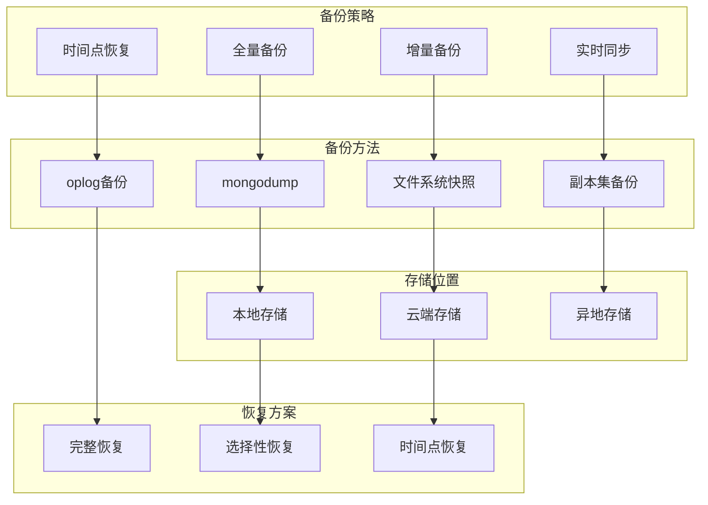

# 21. MongoDB运维-备份恢复

## 概述

数据备份与恢复是MongoDB运维工作的核心，直接关系到业务连续性和数据安全。本章将深入探讨MongoDB的备份策略、恢复方案、灾难恢复规划等关键内容，帮助运维团队构建可靠的数据保护体系。

想象一个电商平台在黑色星期五当天遭遇硬盘故障，由于建立了完善的备份机制，运维团队在30分钟内完成了数据恢复，业务损失降到最低。



## 知识要点

### 1. 备份策略实现

#### 1.1 全量和增量备份

```java
@Service
public class MongoBackupService {
    
    @Value("${mongodb.backup.path}")
    private String backupPath;
    
    @Value("${mongodb.host}")
    private String mongoHost;
    
    @Autowired
    private MongoTemplate mongoTemplate;
    
    /**
     * 全量备份
     */
    public BackupResult performFullBackup() {
        
        String timestamp = LocalDateTime.now().format(DateTimeFormatter.ofPattern("yyyyMMdd_HHmmss"));
        String backupDir = backupPath + "/full_backup_" + timestamp;
        
        try {
            Files.createDirectories(Paths.get(backupDir));
            
            // 构建mongodump命令
            List<String> command = Arrays.asList(
                "mongodump",
                "--host", mongoHost + ":27017",
                "--out", backupDir,
                "--gzip",
                "--oplog",  // 包含oplog支持时间点恢复
                "--numParallelCollections", "4"
            );
            
            long startTime = System.currentTimeMillis();
            Process process = new ProcessBuilder(command).start();
            int exitCode = process.waitFor();
            long endTime = System.currentTimeMillis();
            
            if (exitCode == 0) {
                long backupSize = calculateBackupSize(backupDir);
                boolean isValid = validateBackup(backupDir);
                
                BackupResult result = BackupResult.builder()
                    .backupType("FULL")
                    .backupPath(backupDir)
                    .duration(endTime - startTime)
                    .backupSize(backupSize)
                    .isValid(isValid)
                    .status("SUCCESS")
                    .build();
                
                recordBackupInfo(result);
                return result;
            } else {
                throw new RuntimeException("备份失败，退出码: " + exitCode);
            }
            
        } catch (Exception e) {
            return BackupResult.builder()
                .backupType("FULL")
                .status("FAILED")
                .errorMessage(e.getMessage())
                .build();
        }
    }
    
    /**
     * 增量备份
     */
    public BackupResult performIncrementalBackup() {
        
        try {
            Date lastBackupTime = getLastBackupTime();
            String timestamp = LocalDateTime.now().format(DateTimeFormatter.ofPattern("yyyyMMdd_HHmmss"));
            String backupDir = backupPath + "/incremental_backup_" + timestamp;
            
            Files.createDirectories(Paths.get(backupDir));
            
            // 查询oplog获取增量数据
            List<Document> oplogEntries = getOplogEntries(lastBackupTime);
            
            if (oplogEntries.isEmpty()) {
                return BackupResult.builder()
                    .backupType("INCREMENTAL")
                    .status("NO_CHANGES")
                    .build();
            }
            
            // 保存增量数据
            saveIncrementalData(backupDir, oplogEntries);
            
            return BackupResult.builder()
                .backupType("INCREMENTAL")
                .backupPath(backupDir)
                .backupSize(calculateBackupSize(backupDir))
                .status("SUCCESS")
                .recordCount(oplogEntries.size())
                .build();
            
        } catch (Exception e) {
            return BackupResult.builder()
                .backupType("INCREMENTAL")
                .status("FAILED")
                .errorMessage(e.getMessage())
                .build();
        }
    }
    
    /**
     * 定时备份任务
     */
    @Scheduled(cron = "0 0 2 * * ?") // 每天凌晨2点
    public void scheduledFullBackup() {
        System.out.println("开始执行定时全量备份...");
        BackupResult result = performFullBackup();
        
        if ("SUCCESS".equals(result.getStatus())) {
            System.out.println("定时备份成功: " + result.getBackupPath());
            cleanupOldBackups(); // 清理过期备份
        } else {
            System.err.println("定时备份失败: " + result.getErrorMessage());
            sendBackupAlert(result);
        }
    }
    
    @Scheduled(cron = "0 0 */4 * * ?") // 每4小时增量备份
    public void scheduledIncrementalBackup() {
        BackupResult result = performIncrementalBackup();
        if ("SUCCESS".equals(result.getStatus())) {
            System.out.println("增量备份成功: " + result.getRecordCount() + " 条变更记录");
        }
    }
    
    private long calculateBackupSize(String backupDir) {
        try {
            return Files.walk(Paths.get(backupDir))
                .filter(Files::isRegularFile)
                .mapToLong(file -> {
                    try {
                        return Files.size(file);
                    } catch (IOException e) {
                        return 0;
                    }
                })
                .sum();
        } catch (IOException e) {
            return 0;
        }
    }
    
    private boolean validateBackup(String backupDir) {
        try {
            // 检查关键集合的备份文件是否存在
            String[] requiredCollections = {"users", "orders", "products"};
            Path metadataPath = Paths.get(backupDir, "mydb");
            
            for (String collection : requiredCollections) {
                Path collectionFile = metadataPath.resolve(collection + ".bson.gz");
                if (!Files.exists(collectionFile)) {
                    return false;
                }
            }
            return true;
        } catch (Exception e) {
            return false;
        }
    }
    
    private void recordBackupInfo(BackupResult result) {
        Document backupRecord = new Document()
            .append("backupType", result.getBackupType())
            .append("backupPath", result.getBackupPath())
            .append("duration", result.getDuration())
            .append("backupSize", result.getBackupSize())
            .append("status", result.getStatus())
            .append("createdAt", new Date());
        
        mongoTemplate.save(backupRecord, "backup_history");
    }
    
    private Date getLastBackupTime() {
        Query query = new Query()
            .with(Sort.by(Sort.Direction.DESC, "createdAt"))
            .limit(1);
        
        Document lastBackup = mongoTemplate.findOne(query, Document.class, "backup_history");
        
        if (lastBackup != null) {
            return lastBackup.getDate("createdAt");
        }
        
        return new Date(System.currentTimeMillis() - 24 * 60 * 60 * 1000);
    }
    
    private List<Document> getOplogEntries(Date since) {
        Query oplogQuery = new Query(
            Criteria.where("ts").gte(new BsonTimestamp((int) (since.getTime() / 1000), 0))
        );
        
        return mongoTemplate.find(oplogQuery, Document.class, "oplog.rs");
    }
    
    private void saveIncrementalData(String backupDir, List<Document> oplogEntries) throws IOException {
        Path oplogFile = Paths.get(backupDir, "oplog.bson");
        
        try (FileOutputStream fos = new FileOutputStream(oplogFile.toFile());
             GZIPOutputStream gzos = new GZIPOutputStream(fos)) {
            
            for (Document entry : oplogEntries) {
                byte[] bsonData = entry.toBsonDocument().encode();
                gzos.write(bsonData);
            }
        }
    }
    
    private void cleanupOldBackups() {
        Date cutoffDate = new Date(System.currentTimeMillis() - 30L * 24 * 60 * 60 * 1000);
        
        Query oldBackupsQuery = new Query(Criteria.where("createdAt").lt(cutoffDate));
        List<Document> oldBackups = mongoTemplate.find(oldBackupsQuery, Document.class, "backup_history");
        
        for (Document backup : oldBackups) {
            String backupPath = backup.getString("backupPath");
            try {
                FileUtils.deleteDirectory(new File(backupPath));
                mongoTemplate.remove(
                    new Query(Criteria.where("_id").is(backup.getObjectId("_id"))),
                    "backup_history"
                );
                System.out.println("已清理过期备份: " + backupPath);
            } catch (Exception e) {
                System.err.println("清理备份失败: " + backupPath);
            }
        }
    }
    
    private void sendBackupAlert(BackupResult result) {
        System.err.println("🚨 备份告警: " + result.getBackupType() + " 备份失败");
        System.err.println("错误信息: " + result.getErrorMessage());
    }
    
    @Data
    @Builder
    public static class BackupResult {
        private String backupType;
        private String backupPath;
        private Long duration;
        private Long backupSize;
        private Boolean isValid;
        private String status;
        private String errorMessage;
        private Integer recordCount;
    }
}
```

### 2. 数据恢复方案

#### 2.1 恢复策略实现

```java
@Service
public class MongoRestoreService {
    
    @Value("${mongodb.host}")
    private String mongoHost;
    
    @Autowired
    private MongoTemplate mongoTemplate;
    
    /**
     * 完整数据库恢复
     */
    public RestoreResult performFullRestore(String backupPath, boolean dropExisting) {
        
        try {
            long startTime = System.currentTimeMillis();
            
            if (!validateBackupFiles(backupPath)) {
                return RestoreResult.builder()
                    .status("FAILED")
                    .errorMessage("备份文件验证失败")
                    .build();
            }
            
            List<String> command = new ArrayList<>();
            command.addAll(Arrays.asList(
                "mongorestore",
                "--host", mongoHost + ":27017",
                "--gzip",
                "--numParallelCollections", "4"
            ));
            
            if (dropExisting) {
                command.add("--drop");
            }
            
            command.add(backupPath);
            
            Process process = new ProcessBuilder(command).start();
            int exitCode = process.waitFor();
            long endTime = System.currentTimeMillis();
            
            if (exitCode == 0) {
                boolean isValid = validateRestoreResult();
                
                return RestoreResult.builder()
                    .restoreType("FULL")
                    .backupPath(backupPath)
                    .duration(endTime - startTime)
                    .status("SUCCESS")
                    .isValid(isValid)
                    .build();
            } else {
                return RestoreResult.builder()
                    .restoreType("FULL")
                    .status("FAILED")
                    .errorMessage("恢复失败，退出码: " + exitCode)
                    .build();
            }
            
        } catch (Exception e) {
            return RestoreResult.builder()
                .restoreType("FULL")
                .status("FAILED")
                .errorMessage(e.getMessage())
                .build();
        }
    }
    
    /**
     * 选择性集合恢复
     */
    public RestoreResult performSelectiveRestore(String backupPath, List<String> collections) {
        
        try {
            long startTime = System.currentTimeMillis();
            int successCount = 0;
            
            for (String collection : collections) {
                RestoreResult result = restoreSingleCollection(backupPath, collection);
                if ("SUCCESS".equals(result.getStatus())) {
                    successCount++;
                }
            }
            
            long endTime = System.currentTimeMillis();
            String status = successCount == collections.size() ? "SUCCESS" : "PARTIAL";
            
            return RestoreResult.builder()
                .restoreType("SELECTIVE")
                .backupPath(backupPath)
                .duration(endTime - startTime)
                .status(status)
                .collectionsRestored(successCount)
                .totalCollections(collections.size())
                .build();
            
        } catch (Exception e) {
            return RestoreResult.builder()
                .restoreType("SELECTIVE")
                .status("FAILED")
                .errorMessage(e.getMessage())
                .build();
        }
    }
    
    /**
     * 时间点恢复
     */
    public RestoreResult performPointInTimeRestore(String backupPath, Date targetTime) {
        
        try {
            // 1. 先恢复全量备份
            RestoreResult fullRestore = performFullRestore(backupPath, true);
            
            if (!"SUCCESS".equals(fullRestore.getStatus())) {
                return fullRestore;
            }
            
            // 2. 应用oplog到目标时间点
            applyOplogToTimePoint(backupPath, targetTime);
            
            return RestoreResult.builder()
                .restoreType("POINT_IN_TIME")
                .backupPath(backupPath)
                .targetTime(targetTime)
                .status("SUCCESS")
                .build();
            
        } catch (Exception e) {
            return RestoreResult.builder()
                .restoreType("POINT_IN_TIME")
                .status("FAILED")
                .errorMessage(e.getMessage())
                .build();
        }
    }
    
    /**
     * 灾难恢复演练
     */
    public DisasterRecoveryResult performDisasterRecoveryDrill() {
        
        System.out.println("=== 灾难恢复演练 ===");
        
        List<String> steps = new ArrayList<>();
        List<String> issues = new ArrayList<>();
        
        try {
            // 1. 检查备份可用性
            steps.add("检查备份文件完整性");
            if (!checkBackupAvailability()) {
                issues.add("备份文件不完整");
            }
            
            // 2. 测试恢复过程
            steps.add("执行恢复测试");
            String testBackupPath = getLatestBackupPath();
            RestoreResult testRestore = performFullRestore(testBackupPath, false);
            
            if (!"SUCCESS".equals(testRestore.getStatus())) {
                issues.add("恢复测试失败");
            }
            
            // 3. 验证数据完整性
            steps.add("验证数据完整性");
            if (!validateDataIntegrity()) {
                issues.add("数据完整性验证失败");
            }
            
            return DisasterRecoveryResult.builder()
                .stepsExecuted(steps)
                .issuesFound(issues)
                .isSuccessful(issues.isEmpty())
                .recommendations(generateRecommendations(issues))
                .build();
            
        } catch (Exception e) {
            return DisasterRecoveryResult.builder()
                .stepsExecuted(steps)
                .isSuccessful(false)
                .errorMessage(e.getMessage())
                .build();
        }
    }
    
    private boolean validateBackupFiles(String backupPath) {
        Path backupDir = Paths.get(backupPath);
        return Files.exists(backupDir) && Files.isDirectory(backupDir);
    }
    
    private boolean validateRestoreResult() {
        try {
            String[] requiredCollections = {"users", "orders", "products"};
            
            for (String collection : requiredCollections) {
                if (!mongoTemplate.collectionExists(collection)) {
                    return false;
                }
                
                long count = mongoTemplate.getCollection(collection).estimatedDocumentCount();
                if (count == 0) {
                    return false;
                }
            }
            return true;
        } catch (Exception e) {
            return false;
        }
    }
    
    private RestoreResult restoreSingleCollection(String backupPath, String collection) {
        try {
            List<String> command = Arrays.asList(
                "mongorestore",
                "--host", mongoHost + ":27017",
                "--collection", collection,
                "--gzip",
                "--drop",
                backupPath + "/" + collection + ".bson.gz"
            );
            
            Process process = new ProcessBuilder(command).start();
            int exitCode = process.waitFor();
            
            return RestoreResult.builder()
                .restoreType("SINGLE_COLLECTION")
                .collectionName(collection)
                .status(exitCode == 0 ? "SUCCESS" : "FAILED")
                .build();
            
        } catch (Exception e) {
            return RestoreResult.builder()
                .restoreType("SINGLE_COLLECTION")
                .status("FAILED")
                .errorMessage(e.getMessage())
                .build();
        }
    }
    
    private void applyOplogToTimePoint(String backupPath, Date targetTime) {
        // 应用oplog到指定时间点的逻辑
        System.out.println("应用oplog到时间点: " + targetTime);
    }
    
    private boolean checkBackupAvailability() {
        return true; // 简化实现
    }
    
    private String getLatestBackupPath() {
        return "/backup/latest";
    }
    
    private boolean validateDataIntegrity() {
        return true; // 简化实现
    }
    
    private List<String> generateRecommendations(List<String> issues) {
        List<String> recommendations = new ArrayList<>();
        
        if (!issues.isEmpty()) {
            recommendations.add("定期检查备份文件完整性");
            recommendations.add("优化备份恢复流程");
            recommendations.add("加强监控告警机制");
        }
        
        return recommendations;
    }
    
    @Data
    @Builder
    public static class RestoreResult {
        private String restoreType;
        private String backupPath;
        private String collectionName;
        private Date targetTime;
        private Long duration;
        private String status;
        private Boolean isValid;
        private String errorMessage;
        private Integer collectionsRestored;
        private Integer totalCollections;
    }
    
    @Data
    @Builder
    public static class DisasterRecoveryResult {
        private List<String> stepsExecuted;
        private List<String> issuesFound;
        private Boolean isSuccessful;
        private String errorMessage;
        private List<String> recommendations;
    }
}
```

## 知识扩展

### 1. 设计思想

MongoDB备份恢复基于以下核心原则：

1. **多层次保护**：全量+增量+实时同步的多重保障
2. **自动化运维**：定时备份、自动清理、故障告警
3. **快速恢复**：分级恢复策略确保业务快速恢复
4. **验证机制**：备份恢复过程的完整性验证

### 2. 避坑指南

1. **备份策略**：
   - 不依赖单一备份方式
   - 定期验证备份文件完整性
   - 考虑跨地域备份防范灾难

2. **恢复测试**：
   - 定期进行恢复演练
   - 验证恢复后数据完整性
   - 测试不同故障场景

3. **存储管理**：
   - 合理规划备份存储空间
   - 建立备份保留策略
   - 确保备份数据安全性

### 3. 深度思考题

1. **RTO与RPO平衡**：如何在恢复时间目标和恢复点目标之间找到平衡？

2. **分片集群备份**：如何确保分片集群备份的一致性？

3. **云环境备份**：如何设计成本效益最优的备份策略？

**深度思考题解答：**

1. **RTO与RPO平衡**：
   - RTO优化：自动化、并行恢复、预热缩短恢复时间
   - RPO优化：增量备份、实时同步减少数据丢失
   - 平衡策略：根据业务重要性制定分级要求

2. **分片集群一致性**：
   - 使用--oplog选项确保时间点一致性
   - 协调各分片备份时间窗口
   - 利用配置服务器元数据保证状态一致

3. **云环境优化**：
   - 利用云存储分层策略(热/温/冷)
   - 使用云原生备份服务降低成本
   - 跨区域备份提升灾难恢复能力

MongoDB备份恢复需要结合业务需求制定全面策略，确保业务连续性。