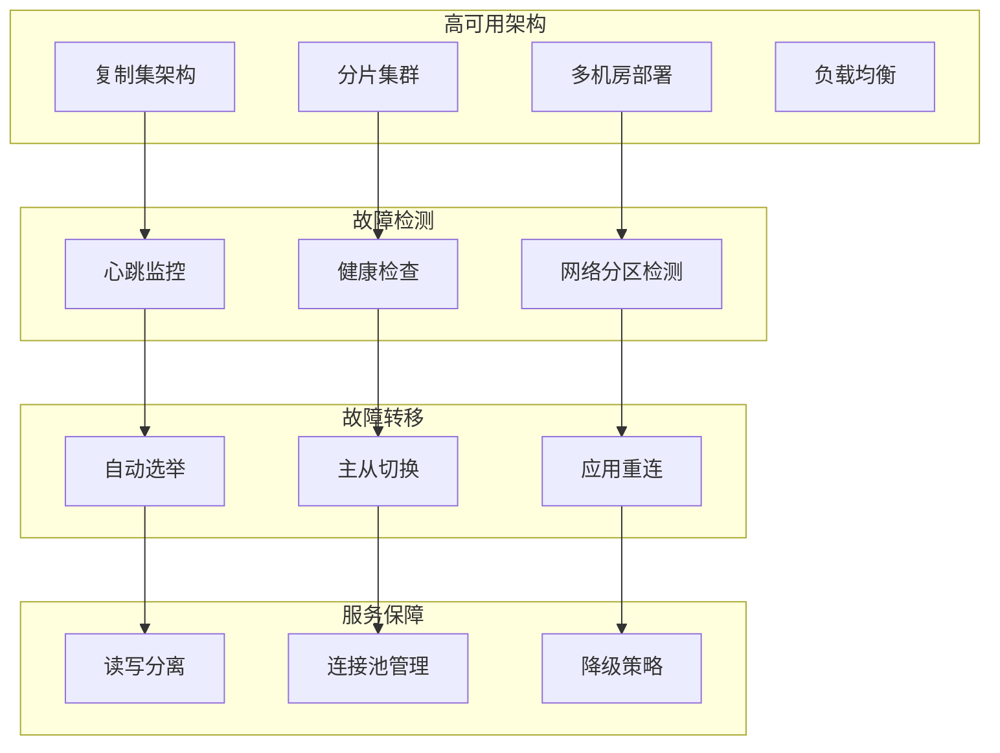

# 运维-高可用架构

## 概述

高可用性是企业级MongoDB部署的核心要求，通过复制集、分片集群、故障转移等技术确保系统在面临硬件故障、网络中断或维护停机时仍能持续提供服务。本章将深入探讨MongoDB高可用架构的设计原则、实施方案和运维管理。

想象一个金融交易系统，要求99.99%的可用性。通过部署三节点复制集、跨机房分布、自动故障转移等方案，即使某个数据中心完全失效，系统也能在30秒内自动切换，确保交易服务不中断。



## 知识要点

### 1. 复制集高可用配置

#### 1.1 高可用客户端配置

```java
@Configuration
public class HighAvailabilityMongoConfig {
    
    @Value("${mongodb.replicaset.name}")
    private String replicaSetName;
    
    @Value("${mongodb.replicaset.members}")
    private String replicaSetMembers;
    
    /**
     * 高可用MongoDB客户端配置
     */
    @Bean
    @Primary
    public MongoClient highAvailabilityMongoClient() {
        
        List<ServerAddress> serverAddresses = parseServerAddresses(replicaSetMembers);
        
        ConnectionPoolSettings poolSettings = ConnectionPoolSettings.builder()
            .maxSize(100)
            .minSize(10)
            .maxWaitTime(30, TimeUnit.SECONDS)
            .maxConnectionLifeTime(30, TimeUnit.MINUTES)
            .build();
        
        SocketSettings socketSettings = SocketSettings.builder()
            .connectTimeout(5, TimeUnit.SECONDS)
            .readTimeout(30, TimeUnit.SECONDS)
            .build();
        
        ClusterSettings clusterSettings = ClusterSettings.builder()
            .hosts(serverAddresses)
            .mode(ClusterConnectionMode.REPLICA_SET)
            .requiredReplicaSetName(replicaSetName)
            .serverSelectionTimeout(30, TimeUnit.SECONDS)
            .build();
        
        MongoClientSettings settings = MongoClientSettings.builder()
            .applyToConnectionPoolSettings(builder -> builder.applySettings(poolSettings))
            .applyToSocketSettings(builder -> builder.applySettings(socketSettings))
            .applyToClusterSettings(builder -> builder.applySettings(clusterSettings))
            .readPreference(ReadPreference.secondaryPreferred())
            .writeConcern(WriteConcern.MAJORITY)
            .readConcern(ReadConcern.MAJORITY)
            .retryWrites(true)
            .retryReads(true)
            .build();
        
        return MongoClients.create(settings);
    }
    
    /**
     * 读写分离配置
     */
    @Bean
    @Qualifier("readOnlyMongoClient")
    public MongoClient readOnlyMongoClient() {
        
        List<ServerAddress> serverAddresses = parseServerAddresses(replicaSetMembers);
        
        MongoClientSettings settings = MongoClientSettings.builder()
            .applyToClusterSettings(builder -> 
                builder.hosts(serverAddresses)
                       .mode(ClusterConnectionMode.REPLICA_SET)
                       .requiredReplicaSetName(replicaSetName))
            .readPreference(ReadPreference.secondary())
            .readConcern(ReadConcern.LOCAL)
            .build();
        
        return MongoClients.create(settings);
    }
    
    private List<ServerAddress> parseServerAddresses(String members) {
        return Arrays.stream(members.split(","))
            .map(String::trim)
            .map(member -> {
                String[] parts = member.split(":");
                return new ServerAddress(parts[0], Integer.parseInt(parts[1]));
            })
            .collect(Collectors.toList());
    }
}
```

#### 1.2 复制集状态监控

```java
@Service
public class ReplicaSetMonitoringService {
    
    @Autowired
    private MongoTemplate mongoTemplate;
    
    /**
     * 获取复制集状态
     */
    public ReplicaSetStatus getReplicaSetStatus() {
        
        try {
            Document rsStatus = mongoTemplate.getDb().runCommand(new Document("replSetGetStatus", 1));
            
            List<MemberStatus> members = new ArrayList<>();
            List<Document> memberDocs = rsStatus.getList("members", Document.class);
            
            for (Document memberDoc : memberDocs) {
                MemberStatus member = MemberStatus.builder()
                    .id(memberDoc.getInteger("_id"))
                    .name(memberDoc.getString("name"))
                    .health(memberDoc.getInteger("health"))
                    .state(memberDoc.getInteger("state"))
                    .stateStr(memberDoc.getString("stateStr"))
                    .uptime(memberDoc.getLong("uptime"))
                    .pingMs(memberDoc.getLong("pingMs"))
                    .build();
                
                members.add(member);
            }
            
            return ReplicaSetStatus.builder()
                .set(rsStatus.getString("set"))
                .myState(rsStatus.getInteger("myState"))
                .members(members)
                .ok(rsStatus.getDouble("ok"))
                .build();
            
        } catch (Exception e) {
            return ReplicaSetStatus.builder()
                .ok(0.0)
                .errorMessage(e.getMessage())
                .build();
        }
    }
    
    /**
     * 检查复制集健康状况
     */
    public HealthCheckResult checkReplicaSetHealth() {
        
        ReplicaSetStatus status = getReplicaSetStatus();
        List<String> issues = new ArrayList<>();
        List<String> warnings = new ArrayList<>();
        
        if (status.getOk() != 1.0) {
            issues.add("复制集状态查询失败");
            return HealthCheckResult.builder()
                .isHealthy(false)
                .issues(issues)
                .build();
        }
        
        // 检查主节点
        Optional<MemberStatus> primary = status.getMembers().stream()
            .filter(m -> "PRIMARY".equals(m.getStateStr()))
            .findFirst();
        
        if (!primary.isPresent()) {
            issues.add("没有发现主节点");
        }
        
        // 检查副本节点
        long secondaryCount = status.getMembers().stream()
            .filter(m -> "SECONDARY".equals(m.getStateStr()))
            .count();
        
        if (secondaryCount < 1) {
            issues.add("副本节点数量不足");
        } else if (secondaryCount < 2) {
            warnings.add("建议至少配置2个副本节点");
        }
        
        // 检查节点健康状态
        for (MemberStatus member : status.getMembers()) {
            if (member.getHealth() != 1) {
                issues.add("节点不健康: " + member.getName());
            }
            
            if (member.getPingMs() != null && member.getPingMs() > 1000) {
                warnings.add("节点延迟过高: " + member.getName() + " (" + member.getPingMs() + "ms)");
            }
        }
        
        return HealthCheckResult.builder()
            .isHealthy(issues.isEmpty())
            .issues(issues)
            .warnings(warnings)
            .primaryNode(primary.map(MemberStatus::getName).orElse("无"))
            .secondaryCount((int) secondaryCount)
            .totalNodes(status.getMembers().size())
            .build();
    }
    
    /**
     * 故障转移测试
     */
    public FailoverTestResult performFailoverTest() {
        
        System.out.println("=== 开始故障转移测试 ===");
        
        List<String> testSteps = new ArrayList<>();
        
        try {
            // 1. 记录当前主节点
            testSteps.add("识别当前主节点");
            ReplicaSetStatus beforeStatus = getReplicaSetStatus();
            Optional<MemberStatus> currentPrimary = beforeStatus.getMembers().stream()
                .filter(m -> "PRIMARY".equals(m.getStateStr()))
                .findFirst();
            
            if (!currentPrimary.isPresent()) {
                return FailoverTestResult.builder()
                    .testSteps(testSteps)
                    .success(false)
                    .errorMessage("未找到当前主节点")
                    .build();
            }
            
            String primaryNode = currentPrimary.get().getName();
            testSteps.add("当前主节点: " + primaryNode);
            
            // 2. 模拟主节点故障
            testSteps.add("模拟主节点故障");
            Document stepDownCmd = new Document("replSetStepDown", 60);
            
            try {
                mongoTemplate.getDb().runCommand(stepDownCmd);
            } catch (Exception e) {
                testSteps.add("主节点已下线");
            }
            
            // 3. 等待新主节点选举
            testSteps.add("等待新主节点选举");
            String newPrimary = waitForNewPrimary(primaryNode, 30000);
            
            if (newPrimary == null) {
                return FailoverTestResult.builder()
                    .testSteps(testSteps)
                    .success(false)
                    .errorMessage("30秒内未选出新主节点")
                    .build();
            }
            
            testSteps.add("新主节点: " + newPrimary);
            
            return FailoverTestResult.builder()
                .testSteps(testSteps)
                .success(true)
                .oldPrimary(primaryNode)
                .newPrimary(newPrimary)
                .build();
            
        } catch (Exception e) {
            return FailoverTestResult.builder()
                .testSteps(testSteps)
                .success(false)
                .errorMessage("故障转移测试异常: " + e.getMessage())
                .build();
        }
    }
    
    private String waitForNewPrimary(String oldPrimary, long timeoutMs) {
        
        long startTime = System.currentTimeMillis();
        
        while (System.currentTimeMillis() - startTime < timeoutMs) {
            try {
                Thread.sleep(1000);
                
                ReplicaSetStatus status = getReplicaSetStatus();
                Optional<MemberStatus> newPrimary = status.getMembers().stream()
                    .filter(m -> "PRIMARY".equals(m.getStateStr()))
                    .filter(m -> !oldPrimary.equals(m.getName()))
                    .findFirst();
                
                if (newPrimary.isPresent()) {
                    return newPrimary.get().getName();
                }
                
            } catch (Exception e) {
                // 继续等待
            }
        }
        
        return null;
    }
    
    // 数据模型类
    @Data
    @Builder
    public static class ReplicaSetStatus {
        private String set;
        private Integer myState;
        private List<MemberStatus> members;
        private Double ok;
        private String errorMessage;
    }
    
    @Data
    @Builder
    public static class MemberStatus {
        private Integer id;
        private String name;
        private Integer health;
        private Integer state;
        private String stateStr;
        private Long uptime;
        private Long pingMs;
    }
    
    @Data
    @Builder
    public static class HealthCheckResult {
        private Boolean isHealthy;
        private List<String> issues;
        private List<String> warnings;
        private String primaryNode;
        private Integer secondaryCount;
        private Integer totalNodes;
    }
    
    @Data
    @Builder
    public static class FailoverTestResult {
        private List<String> testSteps;
        private Boolean success;
        private String oldPrimary;
        private String newPrimary;
        private String errorMessage;
    }
}
```

### 2. 应用层高可用设计

#### 2.1 重试机制与故障转移

```java
@Service
public class HighAvailabilityDataService {
    
    @Autowired
    private MongoTemplate mongoTemplate;
    
    @Autowired
    @Qualifier("readOnlyMongoClient")
    private MongoClient readOnlyMongoClient;
    
    /**
     * 带重试机制的写操作
     */
    public <T> T executeWithRetry(Supplier<T> operation, int maxRetries) {
        
        int attempts = 0;
        Exception lastException = null;
        
        while (attempts < maxRetries) {
            try {
                return operation.get();
                
            } catch (MongoException e) {
                lastException = e;
                attempts++;
                
                System.err.println("操作失败，第 " + attempts + " 次重试: " + e.getMessage());
                
                if (attempts < maxRetries) {
                    try {
                        Thread.sleep(Math.min(1000 * (1L << (attempts - 1)), 10000));
                    } catch (InterruptedException ie) {
                        Thread.currentThread().interrupt();
                        break;
                    }
                }
            }
        }
        
        throw new RuntimeException("操作在 " + maxRetries + " 次重试后仍然失败", lastException);
    }
    
    /**
     * 读写分离查询
     */
    public <T> List<T> findWithReadPreference(Query query, Class<T> entityClass, String collectionName) {
        
        try {
            // 优先从副本节点读取
            MongoTemplate readOnlyTemplate = new MongoTemplate(readOnlyMongoClient, mongoTemplate.getDb().getName());
            return readOnlyTemplate.find(query, entityClass, collectionName);
            
        } catch (Exception e) {
            System.err.println("从副本节点读取失败，切换到主节点: " + e.getMessage());
            
            // 回退到主节点
            return mongoTemplate.find(query, entityClass, collectionName);
        }
    }
    
    /**
     * 降级策略实现
     */
    public <T> T executeWithFallback(Supplier<T> operation, Supplier<T> fallback) {
        
        try {
            return executeWithRetry(operation, 3);
            
        } catch (Exception e) {
            System.err.println("主要操作失败，执行降级策略: " + e.getMessage());
            
            try {
                return fallback.get();
                
            } catch (Exception fallbackException) {
                System.err.println("降级策略也失败: " + fallbackException.getMessage());
                throw new RuntimeException("主要操作和降级策略都失败", e);
            }
        }
    }
    
    /**
     * 批量操作故障恢复
     */
    public BulkOperationResult executeBulkWithRecovery(List<WriteModel<Document>> operations, String collectionName) {
        
        try {
            BulkWriteResult result = mongoTemplate.getCollection(collectionName)
                .bulkWrite(operations, new BulkWriteOptions().ordered(false));
            
            return BulkOperationResult.builder()
                .success(true)
                .insertedCount(result.getInsertedCount())
                .modifiedCount(result.getModifiedCount())
                .deletedCount(result.getDeletedCount())
                .build();
                
        } catch (MongoBulkWriteException e) {
            // 处理部分失败的情况
            List<BulkWriteError> errors = e.getWriteErrors();
            
            System.err.println("批量操作部分失败，错误数量: " + errors.size());
            
            BulkWriteResult originalResult = e.getWriteResult();
            return BulkOperationResult.builder()
                .success(false)
                .insertedCount(originalResult.getInsertedCount())
                .modifiedCount(originalResult.getModifiedCount())
                .deletedCount(originalResult.getDeletedCount())
                .errorCount(errors.size())
                .build();
        }
    }
    
    @Data
    @Builder
    public static class BulkOperationResult {
        private Boolean success;
        private Integer insertedCount;
        private Integer modifiedCount;
        private Integer deletedCount;
        private Integer errorCount;
    }
}
```

### 3. 监控告警系统

#### 3.1 实时监控服务

```java
@Service
public class HighAvailabilityMonitoringService {
    
    @Autowired
    private ReplicaSetMonitoringService replicaSetMonitoringService;
    
    /**
     * 高可用性监控检查
     */
    @Scheduled(fixedRate = 30000) // 每30秒检查一次
    public void performHighAvailabilityCheck() {
        
        try {
            // 检查复制集健康状况
            HealthCheckResult healthCheck = replicaSetMonitoringService.checkReplicaSetHealth();
            
            if (!healthCheck.getIsHealthy()) {
                sendCriticalAlert("复制集健康检查失败", healthCheck.getIssues());
            }
            
            if (!healthCheck.getWarnings().isEmpty()) {
                sendWarningAlert("复制集健康检查警告", healthCheck.getWarnings());
            }
            
            // 记录监控指标
            recordMonitoringMetrics(healthCheck);
            
        } catch (Exception e) {
            System.err.println("高可用性监控检查失败: " + e.getMessage());
            sendCriticalAlert("监控系统异常", Arrays.asList(e.getMessage()));
        }
    }
    
    private void sendCriticalAlert(String title, List<String> issues) {
        System.err.println("🚨 关键告警: " + title);
        issues.forEach(issue -> System.err.println("  - " + issue));
    }
    
    private void sendWarningAlert(String title, List<String> warnings) {
        System.out.println("⚠️ 警告告警: " + title);
        warnings.forEach(warning -> System.out.println("  - " + warning));
    }
    
    private void recordMonitoringMetrics(HealthCheckResult healthCheck) {
        System.out.println("记录监控指标:");
        System.out.println("  复制集健康: " + healthCheck.getIsHealthy());
        System.out.println("  主节点: " + healthCheck.getPrimaryNode());
        System.out.println("  副本节点数: " + healthCheck.getSecondaryCount());
    }
}
```

## 知识扩展

### 1. 设计思想

MongoDB高可用架构基于以下核心原则：

1. **冗余设计**：通过复制集提供数据冗余和服务冗余
2. **自动故障转移**：无需人工干预的自动主节点选举
3. **读写分离**：合理分散读写负载提高整体性能
4. **优雅降级**：在部分节点故障时保持服务可用

### 2. 避坑指南

1. **网络分区**：
   - 部署奇数个节点避免脑裂
   - 合理配置心跳超时时间
   - 跨机房部署提高容灾能力

2. **故障转移**：
   - 应用程序必须正确处理连接断开
   - 使用重试机制和熔断器
   - 监控故障转移时间确保符合RTO要求

3. **数据一致性**：
   - 合理配置读写关注级别
   - 理解不同一致性级别的权衡
   - 监控复制延迟确保数据及时同步

### 3. 深度思考题

1. **一致性权衡**：在高可用和强一致性之间如何取舍？

2. **故障检测**：如何设计更精确的故障检测机制减少误报？

3. **多活架构**：如何在多个数据中心实现MongoDB多活部署？

**深度思考题解答：**

1. **一致性权衡**：
   - 业务关键操作使用MAJORITY写关注确保强一致性
   - 查询操作可以使用secondary读取提高性能
   - 根据业务容忍度选择合适的一致性级别
   - 使用因果一致性session确保读写顺序

2. **故障检测优化**：
   - 多维度健康检查：心跳、响应时间、错误率
   - 智能阈值调整避免网络抖动误报
   - 区分不同类型故障制定差异化策略
   - 结合业务指标判断服务真实健康状态

3. **多活架构实现**：
   - 使用分片将不同业务数据分布到不同数据中心
   - 实施应用级别的数据路由和冲突解决
   - 建立跨数据中心的数据同步机制
   - 设计业务级别的降级和容错策略

MongoDB高可用架构需要在可用性、一致性和性能之间找到适合业务需求的平衡点。