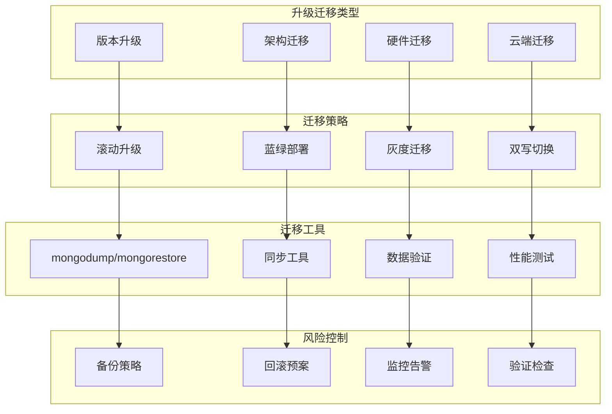

# 运维-升级迁移

## 概述

MongoDB升级迁移是运维工作中的重要环节，涉及版本升级、硬件迁移、架构调整等多种场景。本章将详细介绍MongoDB升级迁移的策略、方法和最佳实践，确保在最小化业务影响的前提下完成系统的平滑过渡。

想象一个电商平台需要从MongoDB 4.4升级到6.0版本，同时将单机部署升级为分片集群。通过制定详细的升级计划、执行灰度迁移、实施回滚预案，最终在业务无感知的情况下完成了整个升级过程。



## 知识要点

### 1. 版本升级策略

#### 1.1 滚动升级实现

```java
@Service
public class MongoUpgradeService {
    
    @Value("${mongodb.upgrade.target-version}")
    private String targetVersion;
    
    @Autowired
    private MongoTemplate mongoTemplate;
    
    /**
     * 复制集滚动升级
     */
    public UpgradeResult performRollingUpgrade() {
        
        System.out.println("=== 开始复制集滚动升级 ===");
        
        List<String> upgradeSteps = new ArrayList<>();
        
        try {
            // 1. 升级前检查
            upgradeSteps.add("执行升级前检查");
            PreUpgradeCheckResult preCheck = performPreUpgradeCheck();
            
            if (!preCheck.getCanUpgrade()) {
                return UpgradeResult.builder()
                    .upgradeSteps(upgradeSteps)
                    .success(false)
                    .errorMessage("升级前检查失败: " + preCheck.getIssues())
                    .build();
            }
            
            // 2. 备份数据
            upgradeSteps.add("创建升级前备份");
            boolean backupSuccess = createPreUpgradeBackup();
            if (!backupSuccess) {
                return UpgradeResult.builder()
                    .upgradeSteps(upgradeSteps)
                    .success(false)
                    .errorMessage("升级前备份失败")
                    .build();
            }
            
            // 3. 升级副本节点
            upgradeSteps.add("升级副本节点");
            List<String> secondaryNodes = getSecondaryNodes();
            
            for (String node : secondaryNodes) {
                boolean nodeUpgraded = upgradeSecondaryNode(node);
                if (!nodeUpgraded) {
                    return UpgradeResult.builder()
                        .upgradeSteps(upgradeSteps)
                        .success(false)
                        .errorMessage("副本节点升级失败: " + node)
                        .build();
                }
                upgradeSteps.add("副本节点升级完成: " + node);
            }
            
            // 4. 主节点切换
            upgradeSteps.add("执行主节点切换");
            String oldPrimary = getCurrentPrimary();
            boolean stepDownSuccess = stepDownPrimary();
            
            if (!stepDownSuccess) {
                return UpgradeResult.builder()
                    .upgradeSteps(upgradeSteps)
                    .success(false)
                    .errorMessage("主节点切换失败")
                    .build();
            }
            
            // 5. 升级原主节点
            upgradeSteps.add("升级原主节点");
            boolean primaryUpgraded = upgradeNode(oldPrimary);
            
            if (!primaryUpgraded) {
                return UpgradeResult.builder()
                    .upgradeSteps(upgradeSteps)
                    .success(false)
                    .errorMessage("原主节点升级失败")
                    .build();
            }
            
            // 6. 升级后验证
            upgradeSteps.add("执行升级后验证");
            PostUpgradeCheckResult postCheck = performPostUpgradeCheck();
            
            if (!postCheck.getUpgradeSuccessful()) {
                return UpgradeResult.builder()
                    .upgradeSteps(upgradeSteps)
                    .success(false)
                    .errorMessage("升级后验证失败")
                    .build();
            }
            
            return UpgradeResult.builder()
                .upgradeSteps(upgradeSteps)
                .success(true)
                .targetVersion(targetVersion)
                .actualVersion(postCheck.getCurrentVersion())
                .build();
            
        } catch (Exception e) {
            return UpgradeResult.builder()
                .upgradeSteps(upgradeSteps)
                .success(false)
                .errorMessage("升级过程异常: " + e.getMessage())
                .build();
        }
    }
    
    /**
     * 升级前检查
     */
    private PreUpgradeCheckResult performPreUpgradeCheck() {
        
        List<String> issues = new ArrayList<>();
        
        try {
            // 检查当前版本
            String currentVersion = getCurrentVersion();
            System.out.println("当前版本: " + currentVersion);
            
            // 检查版本兼容性
            if (!isCompatibleUpgrade(currentVersion, targetVersion)) {
                issues.add("版本升级路径不兼容");
            }
            
            // 检查复制集状态
            if (!isReplicaSetHealthy()) {
                issues.add("复制集状态不健康");
            }
            
            // 检查磁盘空间
            if (!hasSufficientDiskSpace()) {
                issues.add("磁盘空间不足");
            }
            
            // 检查备份状态
            if (!hasRecentBackup()) {
                issues.add("缺少最近的有效备份");
            }
            
            return PreUpgradeCheckResult.builder()
                .canUpgrade(issues.isEmpty())
                .currentVersion(currentVersion)
                .targetVersion(targetVersion)
                .issues(issues)
                .build();
            
        } catch (Exception e) {
            issues.add("升级前检查异常: " + e.getMessage());
            return PreUpgradeCheckResult.builder()
                .canUpgrade(false)
                .issues(issues)
                .build();
        }
    }
    
    /**
     * 升级后验证
     */
    private PostUpgradeCheckResult performPostUpgradeCheck() {
        
        try {
            // 检查版本
            String currentVersion = getCurrentVersion();
            boolean versionCorrect = targetVersion.equals(currentVersion);
            
            // 检查复制集状态
            boolean replicaSetHealthy = isReplicaSetHealthy();
            
            // 检查数据完整性
            boolean dataIntegrityOk = verifyDataIntegrity();
            
            // 检查应用连接
            boolean applicationConnected = testApplicationConnection();
            
            // 性能基准测试
            PerformanceBenchmark benchmark = runPerformanceBenchmark();
            
            boolean upgradeSuccessful = versionCorrect && replicaSetHealthy && 
                                       dataIntegrityOk && applicationConnected;
            
            return PostUpgradeCheckResult.builder()
                .upgradeSuccessful(upgradeSuccessful)
                .currentVersion(currentVersion)
                .replicaSetHealthy(replicaSetHealthy)
                .dataIntegrityOk(dataIntegrityOk)
                .applicationConnected(applicationConnected)
                .performanceBenchmark(benchmark)
                .build();
            
        } catch (Exception e) {
            return PostUpgradeCheckResult.builder()
                .upgradeSuccessful(false)
                .errorMessage(e.getMessage())
                .build();
        }
    }
    
    private String getCurrentVersion() {
        try {
            Document buildInfo = mongoTemplate.getDb().runCommand(new Document("buildInfo", 1));
            return buildInfo.getString("version");
        } catch (Exception e) {
            return "unknown";
        }
    }
    
    private boolean isCompatibleUpgrade(String current, String target) {
        // 简化的版本兼容性检查
        return true;
    }
    
    private boolean isReplicaSetHealthy() {
        try {
            Document rsStatus = mongoTemplate.getDb().runCommand(new Document("replSetGetStatus", 1));
            return rsStatus.getDouble("ok") == 1.0;
        } catch (Exception e) {
            return false;
        }
    }
    
    private boolean hasSufficientDiskSpace() {
        // 检查磁盘空间
        return true;
    }
    
    private boolean hasRecentBackup() {
        // 检查最近的备份
        return true;
    }
    
    private boolean createPreUpgradeBackup() {
        System.out.println("创建升级前备份...");
        return true;
    }
    
    private List<String> getSecondaryNodes() {
        try {
            Document rsStatus = mongoTemplate.getDb().runCommand(new Document("replSetGetStatus", 1));
            List<Document> members = rsStatus.getList("members", Document.class);
            
            return members.stream()
                .filter(member -> "SECONDARY".equals(member.getString("stateStr")))
                .map(member -> member.getString("name"))
                .collect(Collectors.toList());
        } catch (Exception e) {
            return new ArrayList<>();
        }
    }
    
    private String getCurrentPrimary() {
        try {
            Document rsStatus = mongoTemplate.getDb().runCommand(new Document("replSetGetStatus", 1));
            List<Document> members = rsStatus.getList("members", Document.class);
            
            return members.stream()
                .filter(member -> "PRIMARY".equals(member.getString("stateStr")))
                .map(member -> member.getString("name"))
                .findFirst()
                .orElse("");
        } catch (Exception e) {
            return "";
        }
    }
    
    private boolean upgradeSecondaryNode(String node) {
        System.out.println("升级副本节点: " + node);
        // 实际的节点升级逻辑
        return true;
    }
    
    private boolean stepDownPrimary() {
        try {
            mongoTemplate.getDb().runCommand(new Document("replSetStepDown", 60));
            return true;
        } catch (Exception e) {
            return false;
        }
    }
    
    private boolean upgradeNode(String node) {
        System.out.println("升级节点: " + node);
        return true;
    }
    
    private boolean verifyDataIntegrity() {
        // 数据完整性验证
        return true;
    }
    
    private boolean testApplicationConnection() {
        try {
            mongoTemplate.getDb().runCommand(new Document("ping", 1));
            return true;
        } catch (Exception e) {
            return false;
        }
    }
    
    private PerformanceBenchmark runPerformanceBenchmark() {
        return PerformanceBenchmark.builder()
            .averageResponseTime(100L)
            .throughput(1000)
            .build();
    }
    
    // 数据模型类
    @Data
    @Builder
    public static class UpgradeResult {
        private List<String> upgradeSteps;
        private Boolean success;
        private String targetVersion;
        private String actualVersion;
        private String errorMessage;
    }
    
    @Data
    @Builder
    public static class PreUpgradeCheckResult {
        private Boolean canUpgrade;
        private String currentVersion;
        private String targetVersion;
        private List<String> issues;
    }
    
    @Data
    @Builder
    public static class PostUpgradeCheckResult {
        private Boolean upgradeSuccessful;
        private String currentVersion;
        private Boolean replicaSetHealthy;
        private Boolean dataIntegrityOk;
        private Boolean applicationConnected;
        private String errorMessage;
        private PerformanceBenchmark performanceBenchmark;
    }
    
    @Data
    @Builder
    public static class PerformanceBenchmark {
        private Long averageResponseTime;
        private Integer throughput;
    }
}
```

### 2. 数据迁移方案

#### 2.1 在线迁移实现

```java
@Service
public class MongoMigrationService {
    
    @Autowired
    private MongoTemplate sourceMongoTemplate;
    
    @Autowired
    @Qualifier("targetMongoTemplate")
    private MongoTemplate targetMongoTemplate;
    
    /**
     * 在线数据迁移
     */
    public MigrationResult performOnlineMigration(MigrationConfig config) {
        
        System.out.println("=== 开始在线数据迁移 ===");
        
        List<String> migrationSteps = new ArrayList<>();
        
        try {
            // 1. 迁移前准备
            migrationSteps.add("执行迁移前准备");
            prepareMigration(config);
            
            // 2. 全量数据同步
            migrationSteps.add("执行全量数据同步");
            FullSyncResult fullSync = performFullSync(config.getCollections());
            
            if (!fullSync.getSuccess()) {
                return MigrationResult.builder()
                    .migrationSteps(migrationSteps)
                    .success(false)
                    .errorMessage("全量同步失败")
                    .build();
            }
            
            // 3. 增量数据同步
            migrationSteps.add("开始增量数据同步");
            startIncrementalSync(config);
            
            // 4. 数据一致性验证
            migrationSteps.add("验证数据一致性");
            ConsistencyCheckResult consistencyCheck = verifyDataConsistency(config.getCollections());
            
            if (!consistencyCheck.getConsistent()) {
                return MigrationResult.builder()
                    .migrationSteps(migrationSteps)
                    .success(false)
                    .errorMessage("数据一致性验证失败")
                    .build();
            }
            
            // 5. 应用切换
            migrationSteps.add("执行应用切换");
            boolean switchSuccess = switchApplicationToTarget(config);
            
            if (!switchSuccess) {
                return MigrationResult.builder()
                    .migrationSteps(migrationSteps)
                    .success(false)
                    .errorMessage("应用切换失败")
                    .build();
            }
            
            // 6. 迁移后验证
            migrationSteps.add("执行迁移后验证");
            PostMigrationCheckResult postCheck = performPostMigrationCheck(config);
            
            return MigrationResult.builder()
                .migrationSteps(migrationSteps)
                .success(postCheck.getMigrationSuccessful())
                .totalDocuments(fullSync.getTotalDocuments())
                .migratedDocuments(fullSync.getMigratedDocuments())
                .migrationDuration(postCheck.getMigrationDuration())
                .build();
            
        } catch (Exception e) {
            return MigrationResult.builder()
                .migrationSteps(migrationSteps)
                .success(false)
                .errorMessage("迁移过程异常: " + e.getMessage())
                .build();
        }
    }
    
    /**
     * 全量数据同步
     */
    private FullSyncResult performFullSync(List<String> collections) {
        
        long totalDocuments = 0;
        long migratedDocuments = 0;
        
        try {
            for (String collectionName : collections) {
                System.out.println("同步集合: " + collectionName);
                
                long collectionCount = sourceMongoTemplate.getCollection(collectionName).estimatedDocumentCount();
                totalDocuments += collectionCount;
                
                // 分批同步数据
                int batchSize = 1000;
                int skip = 0;
                
                while (skip < collectionCount) {
                    Query query = new Query().skip(skip).limit(batchSize);
                    List<Document> batch = sourceMongoTemplate.find(query, Document.class, collectionName);
                    
                    if (batch.isEmpty()) {
                        break;
                    }
                    
                    // 插入到目标数据库
                    targetMongoTemplate.insert(batch, collectionName);
                    
                    migratedDocuments += batch.size();
                    skip += batch.size();
                    
                    // 打印进度
                    double progress = (double) skip / collectionCount * 100;
                    System.out.printf("集合 %s 同步进度: %.2f%%\n", collectionName, progress);
                }
                
                // 同步索引
                syncIndexes(collectionName);
                
                System.out.println("集合 " + collectionName + " 同步完成");
            }
            
            return FullSyncResult.builder()
                .success(true)
                .totalDocuments(totalDocuments)
                .migratedDocuments(migratedDocuments)
                .build();
            
        } catch (Exception e) {
            return FullSyncResult.builder()
                .success(false)
                .errorMessage(e.getMessage())
                .totalDocuments(totalDocuments)
                .migratedDocuments(migratedDocuments)
                .build();
        }
    }
    
    /**
     * 增量数据同步
     */
    private void startIncrementalSync(MigrationConfig config) {
        
        System.out.println("开始增量数据同步...");
        
        // 获取当前oplog位置
        Date syncStartTime = new Date();
        
        CompletableFuture.runAsync(() -> {
            try {
                while (config.isSyncActive()) {
                    // 查询oplog中的变更
                    List<Document> oplogEntries = getOplogEntries(syncStartTime);
                    
                    for (Document entry : oplogEntries) {
                        applyOplogEntry(entry);
                    }
                    
                    // 更新同步位置
                    if (!oplogEntries.isEmpty()) {
                        syncStartTime = oplogEntries.get(oplogEntries.size() - 1).getDate("ts");
                    }
                    
                    Thread.sleep(1000); // 每秒检查一次
                }
            } catch (Exception e) {
                System.err.println("增量同步异常: " + e.getMessage());
            }
        });
    }
    
    /**
     * 数据一致性验证
     */
    private ConsistencyCheckResult verifyDataConsistency(List<String> collections) {
        
        List<String> inconsistencies = new ArrayList<>();
        
        try {
            for (String collectionName : collections) {
                // 比较文档数量
                long sourceCount = sourceMongoTemplate.getCollection(collectionName).estimatedDocumentCount();
                long targetCount = targetMongoTemplate.getCollection(collectionName).estimatedDocumentCount();
                
                if (sourceCount != targetCount) {
                    inconsistencies.add("集合 " + collectionName + " 文档数量不一致: 源=" + sourceCount + ", 目标=" + targetCount);
                }
                
                // 抽样验证文档内容
                boolean contentConsistent = verifySampleDocuments(collectionName);
                if (!contentConsistent) {
                    inconsistencies.add("集合 " + collectionName + " 内容不一致");
                }
            }
            
            return ConsistencyCheckResult.builder()
                .consistent(inconsistencies.isEmpty())
                .inconsistencies(inconsistencies)
                .build();
            
        } catch (Exception e) {
            return ConsistencyCheckResult.builder()
                .consistent(false)
                .errorMessage(e.getMessage())
                .build();
        }
    }
    
    private void prepareMigration(MigrationConfig config) {
        System.out.println("准备迁移环境...");
    }
    
    private void syncIndexes(String collectionName) {
        System.out.println("同步集合索引: " + collectionName);
    }
    
    private List<Document> getOplogEntries(Date since) {
        // 获取oplog变更记录
        return new ArrayList<>();
    }
    
    private void applyOplogEntry(Document entry) {
        // 应用oplog变更到目标数据库
        System.out.println("应用oplog变更: " + entry.getString("op"));
    }
    
    private boolean verifySampleDocuments(String collectionName) {
        // 抽样验证文档内容一致性
        return true;
    }
    
    private boolean switchApplicationToTarget(MigrationConfig config) {
        System.out.println("切换应用到目标数据库...");
        return true;
    }
    
    private PostMigrationCheckResult performPostMigrationCheck(MigrationConfig config) {
        return PostMigrationCheckResult.builder()
            .migrationSuccessful(true)
            .migrationDuration(60000L)
            .build();
    }
    
    // 数据模型类
    @Data
    @Builder
    public static class MigrationConfig {
        private List<String> collections;
        private boolean syncActive = true;
    }
    
    @Data
    @Builder
    public static class MigrationResult {
        private List<String> migrationSteps;
        private Boolean success;
        private Long totalDocuments;
        private Long migratedDocuments;
        private Long migrationDuration;
        private String errorMessage;
    }
    
    @Data
    @Builder
    public static class FullSyncResult {
        private Boolean success;
        private Long totalDocuments;
        private Long migratedDocuments;
        private String errorMessage;
    }
    
    @Data
    @Builder
    public static class ConsistencyCheckResult {
        private Boolean consistent;
        private List<String> inconsistencies;
        private String errorMessage;
    }
    
    @Data
    @Builder
    public static class PostMigrationCheckResult {
        private Boolean migrationSuccessful;
        private Long migrationDuration;
    }
}
```

## 知识扩展

### 1. 设计思想

MongoDB升级迁移基于以下核心原则：

1. **风险最小化**：通过充分的测试和验证降低升级风险
2. **业务连续性**：确保升级过程中业务服务不中断
3. **可回滚性**：任何阶段都能快速回滚到原始状态
4. **数据完整性**：确保升级后数据的完整性和一致性

### 2. 避坑指南

1. **升级规划**：
   - 详细制定升级计划和时间窗口
   - 在测试环境充分验证升级过程
   - 准备完整的回滚预案

2. **版本兼容性**：
   - 严格遵循MongoDB版本升级路径
   - 注意应用程序驱动版本兼容性
   - 验证新特性对现有功能的影响

3. **性能验证**：
   - 升级后进行完整的性能基准测试
   - 监控关键业务指标
   - 验证查询性能没有明显下降

### 3. 深度思考题

1. **零停机升级**：如何实现真正的零停机MongoDB版本升级？

2. **大规模迁移**：TB级别数据的迁移如何优化时间和资源消耗？

3. **跨云迁移**：如何安全高效地进行跨云服务商的MongoDB迁移？

**深度思考题解答：**

1. **零停机升级实现**：
   - 使用蓝绿部署策略并行运行新旧版本
   - 实施双写机制确保数据同步
   - 通过负载均衡器实现无缝切换
   - 分阶段验证和回滚机制

2. **大规模迁移优化**：
   - 并行迁移多个集合减少总时间
   - 使用专用网络和高带宽连接
   - 分时段迁移避免业务高峰期
   - 增量同步减少最终切换时间

3. **跨云迁移策略**：
   - 建立专用网络连接确保安全性
   - 分阶段迁移降低风险
   - 数据加密传输保护敏感信息
   - 充分的灾难恢复和回滚计划

MongoDB升级迁移需要精心规划和执行，确保在提升系统能力的同时保障业务连续性。