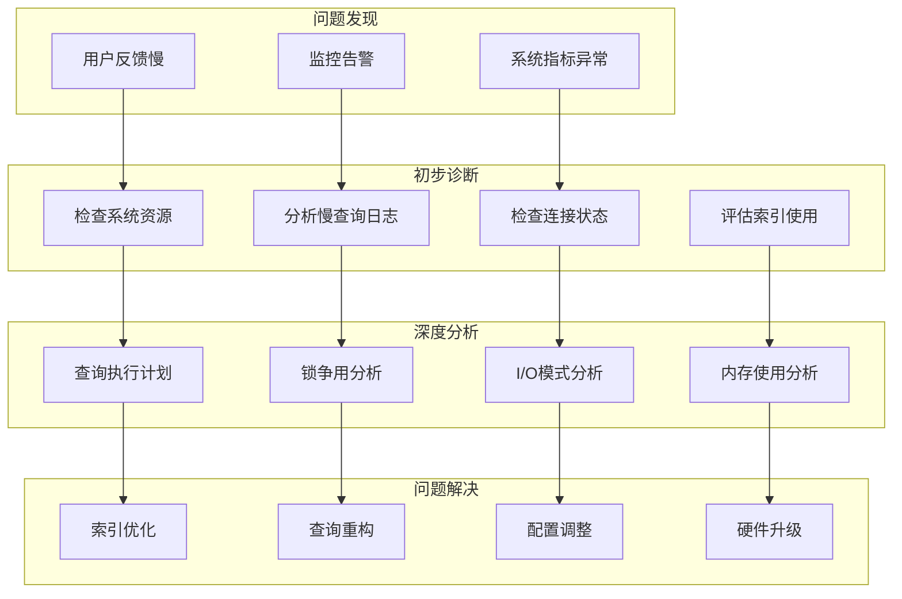

# 26. MongoDB问题排查-性能诊断

## 概述

性能问题是MongoDB生产环境中最常见的问题之一，涉及查询缓慢、连接超时、资源使用率高等多种症状。有效的性能诊断需要结合系统监控、查询分析、资源评估等多个维度，快速定位根本原因并制定解决方案。

想象一个电商平台在促销活动期间出现页面响应缓慢的问题，用户投诉不断。通过系统化的性能诊断流程，发现是由于某个复杂聚合查询缺少索引导致的，同时连接池配置不当加剧了问题。通过创建合适的索引和调整连接池参数，最终将响应时间从5秒降低到200毫秒。



## 知识要点

### 1. 性能问题识别

#### 1.1 监控指标分析

```java
@Service
public class PerformanceDiagnosisService {
    
    @Autowired
    private MongoTemplate mongoTemplate;
    
    /**
     * 全面的性能健康检查
     */
    public PerformanceHealthReport performHealthCheck() {
        
        PerformanceHealthReport report = new PerformanceHealthReport();
        
        // 1. 系统资源检查
        SystemResourceStatus resourceStatus = checkSystemResources();
        report.setResourceStatus(resourceStatus);
        
        // 2. 数据库连接检查
        ConnectionStatus connectionStatus = checkConnectionStatus();
        report.setConnectionStatus(connectionStatus);
        
        // 3. 查询性能检查
        QueryPerformanceStatus queryStatus = analyzeQueryPerformance();
        report.setQueryStatus(queryStatus);
        
        // 4. 索引效率检查
        IndexEfficiencyStatus indexStatus = analyzeIndexEfficiency();
        report.setIndexStatus(indexStatus);
        
        // 5. 锁争用检查
        LockContentionStatus lockStatus = analyzeLockContention();
        report.setLockStatus(lockStatus);
        
        // 生成诊断建议
        report.setRecommendations(generateRecommendations(report));
        
        return report;
    }
    
    /**
     * 系统资源分析
     */
    private SystemResourceStatus checkSystemResources() {
        
        Document serverStatus = mongoTemplate.getDb().runCommand(new Document("serverStatus", 1));
        
        // 内存使用分析
        Document mem = serverStatus.get("mem", Document.class);
        double residentMB = mem.getInteger("resident", 0);
        double virtualMB = mem.getInteger("virtual", 0);
        double memoryPressure = residentMB / 4096.0; // 假设4GB内存
        
        // CPU使用分析
        Document globalLock = serverStatus.get("globalLock", Document.class);
        double lockRatio = globalLock.getDouble("ratio");
        
        // 磁盘I/O分析
        Document wiredTiger = serverStatus.get("wiredTiger", Document.class);
        double diskPressure = 0.0;
        if (wiredTiger != null) {
            Document cache = wiredTiger.get("cache", Document.class);
            if (cache != null) {
                Long bytesRead = cache.getLong("bytes read into cache");
                Long bytesWritten = cache.getLong("bytes written from cache");
                diskPressure = (bytesRead + bytesWritten) / 1000000.0; // MB/s
            }
        }
        
        // 评估资源状态
        ResourceLevel memLevel = evaluateResourceLevel(memoryPressure, 0.7, 0.9);
        ResourceLevel cpuLevel = evaluateResourceLevel(lockRatio, 0.1, 0.3);
        ResourceLevel diskLevel = evaluateResourceLevel(diskPressure / 100, 0.7, 0.9);
        
        return SystemResourceStatus.builder()
            .memoryUsageMB(residentMB)
            .memoryPressureLevel(memLevel)
            .cpuLockRatio(lockRatio)
            .cpuPressureLevel(cpuLevel)
            .diskIOPressure(diskPressure)
            .diskPressureLevel(diskLevel)
            .build();
    }
    
    /**
     * 连接状态分析
     */
    private ConnectionStatus checkConnectionStatus() {
        
        Document serverStatus = mongoTemplate.getDb().runCommand(new Document("serverStatus", 1));
        Document connections = serverStatus.get("connections", Document.class);
        
        Integer current = connections.getInteger("current", 0);
        Integer available = connections.getInteger("available", 0);
        Integer totalCreated = connections.getInteger("totalCreated", 0);
        
        double connectionUtilization = (double) current / (current + available);
        ResourceLevel connectionLevel = evaluateResourceLevel(connectionUtilization, 0.7, 0.9);
        
        return ConnectionStatus.builder()
            .currentConnections(current)
            .availableConnections(available)
            .totalCreated(totalCreated)
            .utilizationRate(connectionUtilization)
            .pressureLevel(connectionLevel)
            .build();
    }
    
    /**
     * 查询性能分析
     */
    private QueryPerformanceStatus analyzeQueryPerformance() {
        
        // 启用profiler分析慢查询
        mongoTemplate.getDb().runCommand(new Document("profile", 2).append("slowms", 100));
        
        // 获取慢查询统计
        Query profileQuery = new Query(Criteria.where("ts").gte(new Date(System.currentTimeMillis() - 300000))); // 最近5分钟
        List<Document> slowQueries = mongoTemplate.find(profileQuery, Document.class, "system.profile");
        
        int slowQueryCount = slowQueries.size();
        double avgExecutionTime = slowQueries.stream()
            .mapToLong(doc -> doc.getLong("millis"))
            .average()
            .orElse(0.0);
        
        // 分析查询类型分布
        Map<String, Long> queryTypeDistribution = slowQueries.stream()
            .collect(Collectors.groupingBy(
                doc -> doc.getString("command"),
                Collectors.counting()
            ));
        
        QueryLevel performanceLevel = evaluateQueryPerformance(slowQueryCount, avgExecutionTime);
        
        return QueryPerformanceStatus.builder()
            .slowQueryCount(slowQueryCount)
            .avgExecutionTimeMs(avgExecutionTime)
            .queryTypeDistribution(queryTypeDistribution)
            .performanceLevel(performanceLevel)
            .build();
    }
    
    /**
     * 索引效率分析
     */
    private IndexEfficiencyStatus analyzeIndexEfficiency() {
        
        // 获取索引使用统计
        List<String> collections = getCollectionNames();
        Map<String, Double> indexEfficiencyMap = new HashMap<>();
        int totalIndexes = 0;
        int unusedIndexes = 0;
        
        for (String collection : collections) {
            try {
                Aggregation aggregation = Aggregation.newAggregation(Aggregation.indexStats());
                List<Document> indexStats = mongoTemplate.aggregate(aggregation, collection, Document.class)
                    .getMappedResults();
                
                for (Document stat : indexStats) {
                    String indexName = stat.getString("name");
                    Document accesses = stat.get("accesses", Document.class);
                    Long ops = accesses != null ? accesses.getLong("ops") : 0L;
                    
                    indexEfficiencyMap.put(collection + "." + indexName, ops.doubleValue());
                    totalIndexes++;
                    
                    if (!"_id_".equals(indexName) && ops == 0) {
                        unusedIndexes++;
                    }
                }
            } catch (Exception e) {
                System.err.println("分析集合索引失败: " + collection);
            }
        }
        
        double unusedIndexRatio = totalIndexes > 0 ? (double) unusedIndexes / totalIndexes : 0.0;
        IndexLevel efficiencyLevel = evaluateIndexEfficiency(unusedIndexRatio);
        
        return IndexEfficiencyStatus.builder()
            .totalIndexes(totalIndexes)
            .unusedIndexes(unusedIndexes)
            .unusedIndexRatio(unusedIndexRatio)
            .indexEfficiencyMap(indexEfficiencyMap)
            .efficiencyLevel(efficiencyLevel)
            .build();
    }
    
    /**
     * 锁争用分析
     */
    private LockContentionStatus analyzeLockContention() {
        
        Document serverStatus = mongoTemplate.getDb().runCommand(new Document("serverStatus", 1));
        
        // 全局锁统计
        Document globalLock = serverStatus.get("globalLock", Document.class);
        Long currentQueue = globalLock.getLong("currentQueue");
        Long activeReaders = globalLock.getLong("activeClients");
        
        // WiredTiger锁统计
        Document wiredTiger = serverStatus.get("wiredTiger", Document.class);
        Long lockWaits = 0L;
        if (wiredTiger != null) {
            Document concurrentTransactions = wiredTiger.get("concurrent-transactions", Document.class);
            if (concurrentTransactions != null) {
                // 分析并发事务情况
                lockWaits = concurrentTransactions.getLong("write", 0L);
            }
        }
        
        LockLevel contentionLevel = evaluateLockContention(currentQueue, lockWaits);
        
        return LockContentionStatus.builder()
            .globalLockQueue(currentQueue)
            .activeReaders(activeReaders)
            .lockWaits(lockWaits)
            .contentionLevel(contentionLevel)
            .build();
    }
    
    /**
     * 生成诊断建议
     */
    private List<String> generateRecommendations(PerformanceHealthReport report) {
        
        List<String> recommendations = new ArrayList<>();
        
        // 内存建议
        if (report.getResourceStatus().getMemoryPressureLevel() == ResourceLevel.CRITICAL) {
            recommendations.add("CRITICAL: 内存使用率过高，建议增加物理内存或调整WiredTiger缓存大小");
        }
        
        // 连接建议
        if (report.getConnectionStatus().getPressureLevel() == ResourceLevel.WARNING) {
            recommendations.add("WARNING: 连接使用率较高，建议优化连接池配置或增加最大连接数");
        }
        
        // 查询性能建议
        if (report.getQueryStatus().getPerformanceLevel() == QueryLevel.POOR) {
            recommendations.add("优化查询性能：存在大量慢查询，建议检查索引设计和查询语句");
        }
        
        // 索引建议
        if (report.getIndexStatus().getUnusedIndexRatio() > 0.3) {
            recommendations.add("清理无用索引：发现" + report.getIndexStatus().getUnusedIndexes() + "个未使用的索引");
        }
        
        // 锁争用建议
        if (report.getLockStatus().getContentionLevel() == LockLevel.HIGH) {
            recommendations.add("减少锁争用：考虑优化并发写入模式或使用更细粒度的锁");
        }
        
        return recommendations;
    }
    
    private List<String> getCollectionNames() {
        try {
            return mongoTemplate.getCollectionNames().stream().collect(Collectors.toList());
        } catch (Exception e) {
            return Arrays.asList("defaultCollection");
        }
    }
    
    private ResourceLevel evaluateResourceLevel(double usage, double warningThreshold, double criticalThreshold) {
        if (usage >= criticalThreshold) return ResourceLevel.CRITICAL;
        if (usage >= warningThreshold) return ResourceLevel.WARNING;
        return ResourceLevel.NORMAL;
    }
    
    private QueryLevel evaluateQueryPerformance(int slowQueryCount, double avgTime) {
        if (slowQueryCount > 50 || avgTime > 2000) return QueryLevel.POOR;
        if (slowQueryCount > 20 || avgTime > 1000) return QueryLevel.FAIR;
        return QueryLevel.GOOD;
    }
    
    private IndexLevel evaluateIndexEfficiency(double unusedRatio) {
        if (unusedRatio > 0.5) return IndexLevel.POOR;
        if (unusedRatio > 0.3) return IndexLevel.FAIR;
        return IndexLevel.GOOD;
    }
    
    private LockLevel evaluateLockContention(Long queueLength, Long lockWaits) {
        if (queueLength > 10 || lockWaits > 100) return LockLevel.HIGH;
        if (queueLength > 5 || lockWaits > 50) return LockLevel.MEDIUM;
        return LockLevel.LOW;
    }
    
    // 数据模型类
    @Data
    public static class PerformanceHealthReport {
        private SystemResourceStatus resourceStatus;
        private ConnectionStatus connectionStatus;
        private QueryPerformanceStatus queryStatus;
        private IndexEfficiencyStatus indexStatus;
        private LockContentionStatus lockStatus;
        private List<String> recommendations;
    }
    
    @Data
    @Builder
    public static class SystemResourceStatus {
        private Double memoryUsageMB;
        private ResourceLevel memoryPressureLevel;
        private Double cpuLockRatio;
        private ResourceLevel cpuPressureLevel;
        private Double diskIOPressure;
        private ResourceLevel diskPressureLevel;
    }
    
    @Data
    @Builder
    public static class ConnectionStatus {
        private Integer currentConnections;
        private Integer availableConnections;
        private Integer totalCreated;
        private Double utilizationRate;
        private ResourceLevel pressureLevel;
    }
    
    @Data
    @Builder
    public static class QueryPerformanceStatus {
        private Integer slowQueryCount;
        private Double avgExecutionTimeMs;
        private Map<String, Long> queryTypeDistribution;
        private QueryLevel performanceLevel;
    }
    
    @Data
    @Builder
    public static class IndexEfficiencyStatus {
        private Integer totalIndexes;
        private Integer unusedIndexes;
        private Double unusedIndexRatio;
        private Map<String, Double> indexEfficiencyMap;
        private IndexLevel efficiencyLevel;
    }
    
    @Data
    @Builder
    public static class LockContentionStatus {
        private Long globalLockQueue;
        private Long activeReaders;
        private Long lockWaits;
        private LockLevel contentionLevel;
    }
    
    public enum ResourceLevel { NORMAL, WARNING, CRITICAL }
    public enum QueryLevel { GOOD, FAIR, POOR }
    public enum IndexLevel { GOOD, FAIR, POOR }
    public enum LockLevel { LOW, MEDIUM, HIGH }
}
```

### 2. 深度性能分析

#### 2.1 查询执行计划分析

```java
@Service
public class QueryAnalysisService {
    
    @Autowired
    private MongoTemplate mongoTemplate;
    
    /**
     * 深度查询分析
     */
    public QueryAnalysisResult analyzeQuery(Query query, String collectionName) {
        
        // 获取查询执行计划
        ExplainResult explainResult = explainQuery(query, collectionName);
        
        // 分析查询模式
        QueryPattern pattern = analyzeQueryPattern(query);
        
        // 性能预测
        PerformancePrediction prediction = predictPerformance(explainResult, pattern);
        
        // 优化建议
        List<OptimizationSuggestion> suggestions = generateOptimizationSuggestions(explainResult, pattern);
        
        return QueryAnalysisResult.builder()
            .explainResult(explainResult)
            .queryPattern(pattern)
            .performancePrediction(prediction)
            .optimizationSuggestions(suggestions)
            .build();
    }
    
    private ExplainResult explainQuery(Query query, String collectionName) {
        
        AggregationOptions options = AggregationOptions.builder()
            .explain(true)
            .build();
        
        Aggregation aggregation = Aggregation.newAggregation(
            Aggregation.match(query.getQueryObject())
        ).withOptions(options);
        
        AggregationResults<Document> results = mongoTemplate.aggregate(
            aggregation, collectionName, Document.class
        );
        
        Document explainDoc = results.getRawResults();
        
        return ExplainResult.builder()
            .executionTimeEstimateMs(explainDoc.getInteger("executionTimeMillis", 0))
            .totalDocsExamined(explainDoc.getInteger("totalDocsExamined", 0))
            .totalDocsReturned(explainDoc.getInteger("totalDocsReturned", 0))
            .indexUsed(explainDoc.getBoolean("indexUsed", false))
            .winningPlan(explainDoc.getString("winningPlan"))
            .rejectedPlans(explainDoc.getList("rejectedPlans", String.class))
            .build();
    }
    
    private QueryPattern analyzeQueryPattern(Query query) {
        
        Document queryDoc = query.getQueryObject();
        Document sortDoc = query.getSortObject();
        
        // 分析查询类型
        List<String> queryFields = new ArrayList<>(queryDoc.keySet());
        List<String> sortFields = new ArrayList<>(sortDoc.keySet());
        
        // 计算查询复杂度
        int complexity = calculateQueryComplexity(queryDoc);
        
        // 识别查询模式
        String patternType = identifyQueryPattern(queryDoc, sortDoc);
        
        return QueryPattern.builder()
            .queryFields(queryFields)
            .sortFields(sortFields)
            .complexity(complexity)
            .patternType(patternType)
            .hasRangeQuery(hasRangeOperators(queryDoc))
            .hasTextSearch(hasTextSearch(queryDoc))
            .hasArrayQuery(hasArrayOperators(queryDoc))
            .build();
    }
    
    private PerformancePrediction predictPerformance(ExplainResult explainResult, QueryPattern pattern) {
        
        // 基于历史数据和查询模式预测性能
        double predictedTimeMs = 0.0;
        String performanceLevel = "GOOD";
        
        if (!explainResult.getIndexUsed()) {
            predictedTimeMs = explainResult.getTotalDocsExamined() * 0.1; // 估算全表扫描时间
            performanceLevel = "POOR";
        } else {
            double selectivity = (double) explainResult.getTotalDocsReturned() / explainResult.getTotalDocsExamined();
            predictedTimeMs = explainResult.getTotalDocsExamined() * selectivity * 0.01;
            
            if (predictedTimeMs > 1000) performanceLevel = "POOR";
            else if (predictedTimeMs > 100) performanceLevel = "FAIR";
        }
        
        // 考虑查询复杂度影响
        predictedTimeMs *= Math.log(pattern.getComplexity() + 1);
        
        return PerformancePrediction.builder()
            .predictedExecutionTimeMs(predictedTimeMs)
            .performanceLevel(performanceLevel)
            .bottleneckType(identifyBottleneck(explainResult, pattern))
            .scaleabilityFactor(calculateScaleability(pattern))
            .build();
    }
    
    private List<OptimizationSuggestion> generateOptimizationSuggestions(ExplainResult explainResult, QueryPattern pattern) {
        
        List<OptimizationSuggestion> suggestions = new ArrayList<>();
        
        // 索引建议
        if (!explainResult.getIndexUsed()) {
            suggestions.add(OptimizationSuggestion.builder()
                .type("INDEX_MISSING")
                .priority("HIGH")
                .description("查询未使用索引，建议为查询字段创建合适的索引")
                .expectedImprovement("90%")
                .implementation("db." + "collection" + ".createIndex({" + String.join(",", pattern.getQueryFields()) + "})")
                .build());
        }
        
        // 查询重构建议
        if (pattern.getComplexity() > 5) {
            suggestions.add(OptimizationSuggestion.builder()
                .type("QUERY_RESTRUCTURE")
                .priority("MEDIUM")
                .description("查询过于复杂，建议拆分为多个简单查询")
                .expectedImprovement("50%")
                .implementation("将复杂查询拆分为多个简单查询，使用应用层聚合")
                .build());
        }
        
        // 投影优化建议
        if (pattern.getQueryFields().size() > 3) {
            suggestions.add(OptimizationSuggestion.builder()
                .type("PROJECTION_OPTIMIZE")
                .priority("LOW")
                .description("使用投影只返回需要的字段")
                .expectedImprovement("20%")
                .implementation("添加.projection()方法指定返回字段")
                .build());
        }
        
        return suggestions;
    }
    
    private int calculateQueryComplexity(Document queryDoc) {
        int complexity = 0;
        for (String key : queryDoc.keySet()) {
            if (key.startsWith("$")) complexity += 2;
            else complexity += 1;
            
            Object value = queryDoc.get(key);
            if (value instanceof Document) {
                complexity += calculateQueryComplexity((Document) value);
            }
        }
        return complexity;
    }
    
    private String identifyQueryPattern(Document queryDoc, Document sortDoc) {
        if (queryDoc.containsKey("$text")) return "TEXT_SEARCH";
        if (queryDoc.containsKey("$near") || queryDoc.containsKey("$geoNear")) return "GEO_QUERY";
        if (hasRangeOperators(queryDoc) && !sortDoc.isEmpty()) return "RANGE_WITH_SORT";
        if (hasRangeOperators(queryDoc)) return "RANGE_QUERY";
        if (!sortDoc.isEmpty()) return "EQUALITY_WITH_SORT";
        return "EQUALITY_QUERY";
    }
    
    private boolean hasRangeOperators(Document doc) {
        for (Object value : doc.values()) {
            if (value instanceof Document) {
                Document subdoc = (Document) value;
                if (subdoc.containsKey("$gte") || subdoc.containsKey("$gt") || 
                    subdoc.containsKey("$lte") || subdoc.containsKey("$lt")) {
                    return true;
                }
            }
        }
        return false;
    }
    
    private boolean hasTextSearch(Document doc) {
        return doc.containsKey("$text");
    }
    
    private boolean hasArrayOperators(Document doc) {
        for (Object value : doc.values()) {
            if (value instanceof Document) {
                Document subdoc = (Document) value;
                if (subdoc.containsKey("$in") || subdoc.containsKey("$nin") || 
                    subdoc.containsKey("$all") || subdoc.containsKey("$elemMatch")) {
                    return true;
                }
            }
        }
        return false;
    }
    
    private String identifyBottleneck(ExplainResult explainResult, QueryPattern pattern) {
        if (!explainResult.getIndexUsed()) return "MISSING_INDEX";
        if (explainResult.getTotalDocsExamined() > explainResult.getTotalDocsReturned() * 10) return "INDEX_INEFFICIENT";
        if (pattern.getComplexity() > 5) return "QUERY_COMPLEXITY";
        return "NONE";
    }
    
    private double calculateScaleability(QueryPattern pattern) {
        double factor = 1.0;
        if (pattern.getHasRangeQuery()) factor *= 0.8;
        if (pattern.getHasTextSearch()) factor *= 0.6;
        if (pattern.getComplexity() > 3) factor *= 0.7;
        return factor;
    }
    
    @Data
    @Builder
    public static class QueryAnalysisResult {
        private ExplainResult explainResult;
        private QueryPattern queryPattern;
        private PerformancePrediction performancePrediction;
        private List<OptimizationSuggestion> optimizationSuggestions;
    }
    
    @Data
    @Builder
    public static class ExplainResult {
        private Integer executionTimeEstimateMs;
        private Integer totalDocsExamined;
        private Integer totalDocsReturned;
        private Boolean indexUsed;
        private String winningPlan;
        private List<String> rejectedPlans;
    }
    
    @Data
    @Builder
    public static class QueryPattern {
        private List<String> queryFields;
        private List<String> sortFields;
        private Integer complexity;
        private String patternType;
        private Boolean hasRangeQuery;
        private Boolean hasTextSearch;
        private Boolean hasArrayQuery;
    }
    
    @Data
    @Builder
    public static class PerformancePrediction {
        private Double predictedExecutionTimeMs;
        private String performanceLevel;
        private String bottleneckType;
        private Double scaleabilityFactor;
    }
    
    @Data
    @Builder
    public static class OptimizationSuggestion {
        private String type;
        private String priority;
        private String description;
        private String expectedImprovement;
        private String implementation;
    }
}
```

## 知识扩展

### 1. 诊断思路

MongoDB性能诊断应遵循系统化的方法：

1. **问题定义**：明确性能问题的具体表现和影响范围
2. **数据收集**：收集系统指标、日志、配置等相关数据
3. **假设验证**：基于经验提出假设并逐一验证
4. **根因分析**：深入分析找到问题的根本原因
5. **解决方案**：制定并实施有效的解决方案

### 2. 常见性能瓶颈

1. **索引问题**：缺失索引、索引不当、索引冗余
2. **查询问题**：复杂查询、低效聚合、全表扫描
3. **资源限制**：内存不足、CPU瓶颈、I/O限制
4. **配置问题**：连接池配置、缓存设置、并发参数

### 3. 深度思考题

1. **性能基线**：如何建立和维护MongoDB的性能基线？

2. **预防性监控**：如何设计预防性的性能监控体系？

3. **性能测试**：如何设计有效的MongoDB性能测试方案？

MongoDB性能诊断需要结合理论知识和实践经验，通过系统化的方法快速定位和解决性能问题。