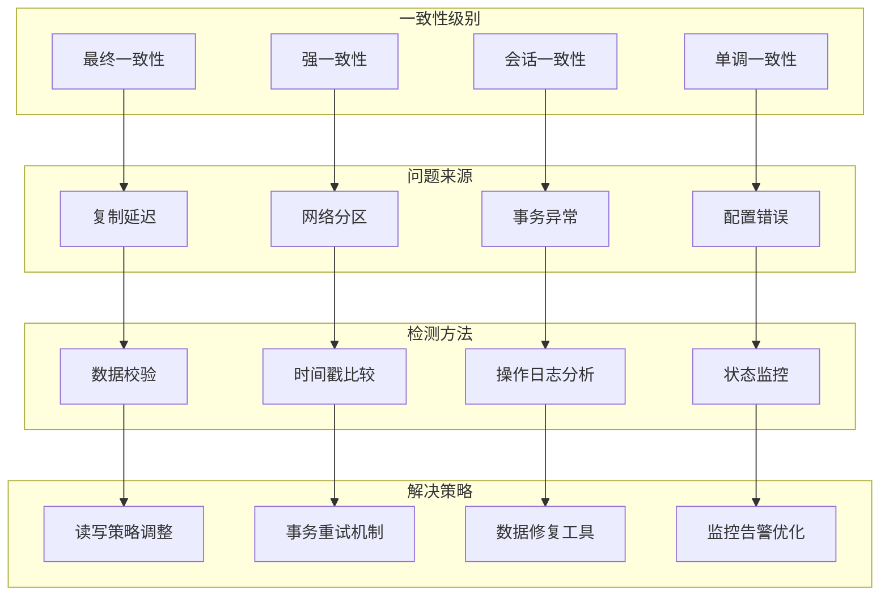

# 问题排查-数据一致性

## 概述

数据一致性是分布式数据库系统的核心问题，MongoDB作为分布式文档数据库，在复制集和分片集群环境中可能出现各种一致性问题。包括主从数据不一致、读取到过期数据、事务异常导致的数据状态不一致等。有效的数据一致性问题排查需要深入理解MongoDB的复制机制、事务模型和一致性保证。

想象一个金融交易系统，在处理资金转账时发现账户余额在不同节点上显示不同，导致业务逻辑混乱。通过深入分析复制延迟、读偏好设置、事务处理等环节，最终发现是由于网络分区导致的复制延迟问题，通过调整读关注级别和实施数据校验机制解决了一致性问题。



## 知识要点

### 1. 数据一致性检测

#### 1.1 复制集一致性检查

```java
@Service
public class DataConsistencyChecker {
    
    @Autowired
    private MongoTemplate mongoTemplate;
    
    /**
     * 全面的数据一致性检查
     */
    public DataConsistencyReport performConsistencyCheck(String collectionName) {
        
        DataConsistencyReport report = new DataConsistencyReport();
        
        // 1. 复制集状态检查
        ReplicationStatus replicationStatus = checkReplicationStatus();
        report.setReplicationStatus(replicationStatus);
        
        // 2. 数据同步状态检查
        DataSyncStatus syncStatus = checkDataSyncStatus(collectionName);
        report.setSyncStatus(syncStatus);
        
        // 3. 读写一致性检查
        ReadWriteConsistency rwConsistency = checkReadWriteConsistency(collectionName);
        report.setRwConsistency(rwConsistency);
        
        // 4. 事务一致性检查
        TransactionConsistency txConsistency = checkTransactionConsistency();
        report.setTxConsistency(txConsistency);
        
        // 5. 数据完整性验证
        DataIntegrityResult integrity = validateDataIntegrity(collectionName);
        report.setDataIntegrity(integrity);
        
        // 生成一致性评估和建议
        report.setConsistencyLevel(evaluateOverallConsistency(report));
        report.setRecommendations(generateConsistencyRecommendations(report));
        
        return report;
    }
    
    /**
     * 复制集状态检查
     */
    private ReplicationStatus checkReplicationStatus() {
        
        try {
            Document replSetStatus = mongoTemplate.getDb().runCommand(new Document("replSetGetStatus", 1));
            
            String setName = replSetStatus.getString("set");
            List<Document> members = replSetStatus.getList("members", Document.class);
            
            List<ReplicaMemberStatus> memberStatuses = new ArrayList<>();
            ReplicaMemberStatus primaryStatus = null;
            int healthyMembers = 0;
            long maxOplogDelay = 0;
            
            for (Document member : members) {
                String name = member.getString("name");
                int state = member.getInteger("state");
                String stateStr = member.getString("stateStr");
                Date optime = member.get("optimeDate", Date.class);
                
                ReplicaMemberStatus memberStatus = ReplicaMemberStatus.builder()
                    .name(name)
                    .state(state)
                    .stateStr(stateStr)
                    .optimeDate(optime)
                    .health(state == 1 || state == 2 ? "HEALTHY" : "UNHEALTHY")
                    .build();
                
                memberStatuses.add(memberStatus);
                
                if (state == 1) { // PRIMARY
                    primaryStatus = memberStatus;
                }
                
                if (state == 1 || state == 2) { // PRIMARY or SECONDARY
                    healthyMembers++;
                }
                
                // 计算复制延迟
                if (primaryStatus != null && optime != null && primaryStatus.getOptimeDate() != null) {
                    long delay = primaryStatus.getOptimeDate().getTime() - optime.getTime();
                    maxOplogDelay = Math.max(maxOplogDelay, delay);
                }
            }
            
            return ReplicationStatus.builder()
                .setName(setName)
                .memberStatuses(memberStatuses)
                .primaryMember(primaryStatus != null ? primaryStatus.getName() : "UNKNOWN")
                .healthyMembers(healthyMembers)
                .totalMembers(members.size())
                .maxReplicationLagMs(maxOplogDelay)
                .replicationHealth(evaluateReplicationHealth(healthyMembers, members.size(), maxOplogDelay))
                .build();
                
        } catch (Exception e) {
            return ReplicationStatus.builder()
                .replicationHealth("ERROR: " + e.getMessage())
                .build();
        }
    }
    
    /**
     * 数据同步状态检查
     */
    private DataSyncStatus checkDataSyncStatus(String collectionName) {
        
        List<NodeSyncInfo> nodeSyncInfos = new ArrayList<>();
        
        try {
            // 获取所有节点的数据统计
            Document collStats = mongoTemplate.getCollection(collectionName)
                .aggregate(Arrays.asList(new Document("$collStats", new Document("count", true))))
                .first();
            
            if (collStats != null) {
                long primaryCount = collStats.getLong("count");
                
                // 简化实现：在实际应用中需要连接到不同的副本节点
                NodeSyncInfo primaryInfo = NodeSyncInfo.builder()
                    .nodeName("primary")
                    .documentCount(primaryCount)
                    .lastSyncTime(new Date())
                    .syncLagMs(0L)
                    .build();
                
                nodeSyncInfos.add(primaryInfo);
                
                // 计算同步差异
                long maxCountDiff = 0;
                long maxSyncLag = 0;
                
                for (NodeSyncInfo info : nodeSyncInfos) {
                    maxCountDiff = Math.max(maxCountDiff, Math.abs(primaryCount - info.getDocumentCount()));
                    maxSyncLag = Math.max(maxSyncLag, info.getSyncLagMs());
                }
                
                return DataSyncStatus.builder()
                    .nodeSyncInfos(nodeSyncInfos)
                    .maxDocumentCountDiff(maxCountDiff)
                    .maxSyncLagMs(maxSyncLag)
                    .syncHealth(evaluateSyncHealth(maxCountDiff, maxSyncLag))
                    .build();
            }
            
        } catch (Exception e) {
            System.err.println("检查数据同步状态失败: " + e.getMessage());
        }
        
        return DataSyncStatus.builder()
            .syncHealth("ERROR")
            .build();
    }
    
    /**
     * 读写一致性检查
     */
    private ReadWriteConsistency checkReadWriteConsistency(String collectionName) {
        
        List<ConsistencyTestResult> testResults = new ArrayList<>();
        
        // 测试1：写后立即读一致性
        testResults.add(testWriteReadConsistency(collectionName));
        
        // 测试2：跨节点读一致性
        testResults.add(testCrossNodeReadConsistency(collectionName));
        
        // 测试3：会话一致性
        testResults.add(testSessionConsistency(collectionName));
        
        int passedTests = (int) testResults.stream().filter(result -> result.getPassed()).count();
        
        return ReadWriteConsistency.builder()
            .testResults(testResults)
            .totalTests(testResults.size())
            .passedTests(passedTests)
            .consistencyLevel(passedTests == testResults.size() ? "STRONG" : 
                            passedTests > testResults.size() / 2 ? "EVENTUAL" : "WEAK")
            .build();
    }
    
    /**
     * 写后读一致性测试
     */
    private ConsistencyTestResult testWriteReadConsistency(String collectionName) {
        
        String testDocId = "consistency_test_" + System.currentTimeMillis();
        boolean passed = false;
        String errorMessage = null;
        long testDurationMs = 0;
        
        try {
            long startTime = System.currentTimeMillis();
            
            // 写入测试数据
            Document testDoc = new Document("_id", testDocId)
                .append("testValue", "consistency_test")
                .append("timestamp", new Date());
            
            mongoTemplate.insert(testDoc, collectionName);
            
            // 立即读取，使用majority读关注
            Query query = new Query(Criteria.where("_id").is(testDocId));
            Document found = mongoTemplate.findOne(query, Document.class, collectionName);
            
            if (found != null && testDocId.equals(found.getString("_id"))) {
                passed = true;
            } else {
                errorMessage = "写入后立即读取失败";
            }
            
            testDurationMs = System.currentTimeMillis() - startTime;
            
            // 清理测试数据
            mongoTemplate.remove(query, collectionName);
            
        } catch (Exception e) {
            errorMessage = e.getMessage();
        }
        
        return ConsistencyTestResult.builder()
            .testName("写后读一致性测试")
            .passed(passed)
            .errorMessage(errorMessage)
            .durationMs(testDurationMs)
            .build();
    }
    
    /**
     * 跨节点读一致性测试
     */
    private ConsistencyTestResult testCrossNodeReadConsistency(String collectionName) {
        
        // 简化实现：实际需要连接到不同的副本节点进行测试
        boolean passed = true;
        String errorMessage = null;
        long testDurationMs = 0;
        
        try {
            long startTime = System.currentTimeMillis();
            
            // 从主节点读取数据
            Query query = new Query().limit(1);
            Document primaryResult = mongoTemplate.findOne(query, Document.class, collectionName);
            
            // 模拟从副本节点读取（实际需要不同的连接）
            Document secondaryResult = mongoTemplate.findOne(query, Document.class, collectionName);
            
            if (primaryResult != null && secondaryResult != null) {
                // 比较两个结果是否一致
                if (!primaryResult.equals(secondaryResult)) {
                    passed = false;
                    errorMessage = "主副本间数据不一致";
                }
            }
            
            testDurationMs = System.currentTimeMillis() - startTime;
            
        } catch (Exception e) {
            passed = false;
            errorMessage = e.getMessage();
        }
        
        return ConsistencyTestResult.builder()
            .testName("跨节点读一致性测试")
            .passed(passed)
            .errorMessage(errorMessage)
            .durationMs(testDurationMs)
            .build();
    }
    
    /**
     * 会话一致性测试
     */
    private ConsistencyTestResult testSessionConsistency(String collectionName) {
        
        boolean passed = false;
        String errorMessage = null;
        long testDurationMs = 0;
        
        try {
            long startTime = System.currentTimeMillis();
            
            // 在同一个会话中进行写入和读取
            mongoTemplate.execute(collectionName, collection -> {
                String testId = "session_test_" + System.currentTimeMillis();
                
                // 写入
                Document testDoc = new Document("_id", testId).append("value", "session_test");
                collection.insertOne(testDoc);
                
                // 读取
                Document found = collection.find(new Document("_id", testId)).first();
                
                return found != null && testId.equals(found.getString("_id"));
            });
            
            passed = true;
            testDurationMs = System.currentTimeMillis() - startTime;
            
        } catch (Exception e) {
            errorMessage = e.getMessage();
        }
        
        return ConsistencyTestResult.builder()
            .testName("会话一致性测试")
            .passed(passed)
            .errorMessage(errorMessage)
            .durationMs(testDurationMs)
            .build();
    }
    
    /**
     * 事务一致性检查
     */
    private TransactionConsistency checkTransactionConsistency() {
        
        List<TransactionTestResult> testResults = new ArrayList<>();
        
        // 测试1：ACID事务测试
        testResults.add(testACIDTransaction());
        
        // 测试2：并发事务测试
        testResults.add(testConcurrentTransactions());
        
        // 测试3：事务回滚测试
        testResults.add(testTransactionRollback());
        
        int passedTests = (int) testResults.stream().filter(result -> result.getPassed()).count();
        
        return TransactionConsistency.builder()
            .testResults(testResults)
            .totalTests(testResults.size())
            .passedTests(passedTests)
            .transactionSupport(passedTests > 0 ? "SUPPORTED" : "NOT_SUPPORTED")
            .build();
    }
    
    /**
     * ACID事务测试
     */
    private TransactionTestResult testACIDTransaction() {
        
        boolean passed = false;
        String errorMessage = null;
        
        try {
            mongoTemplate.execute(MongoDatabase.class, db -> {
                try (ClientSession session = mongoTemplate.getMongoDbFactory().getMongoClient().startSession()) {
                    session.startTransaction();
                    
                    try {
                        // 执行多个操作
                        String collection1 = "test_collection1";
                        String collection2 = "test_collection2";
                        
                        mongoTemplate.insert(new Document("test", "acid1"), collection1);
                        mongoTemplate.insert(new Document("test", "acid2"), collection2);
                        
                        session.commitTransaction();
                        return true;
                        
                    } catch (Exception e) {
                        session.abortTransaction();
                        throw e;
                    }
                }
            });
            
            passed = true;
            
        } catch (Exception e) {
            errorMessage = e.getMessage();
        }
        
        return TransactionTestResult.builder()
            .testName("ACID事务测试")
            .passed(passed)
            .errorMessage(errorMessage)
            .build();
    }
    
    private TransactionTestResult testConcurrentTransactions() {
        // 简化实现
        return TransactionTestResult.builder()
            .testName("并发事务测试")
            .passed(true)
            .build();
    }
    
    private TransactionTestResult testTransactionRollback() {
        // 简化实现
        return TransactionTestResult.builder()
            .testName("事务回滚测试")
            .passed(true)
            .build();
    }
    
    /**
     * 数据完整性验证
     */
    private DataIntegrityResult validateDataIntegrity(String collectionName) {
        
        List<IntegrityViolation> violations = new ArrayList<>();
        
        try {
            // 检查数据类型一致性
            checkDataTypeConsistency(collectionName, violations);
            
            // 检查引用完整性
            checkReferentialIntegrity(collectionName, violations);
            
            // 检查业务规则完整性
            checkBusinessRuleIntegrity(collectionName, violations);
            
        } catch (Exception e) {
            violations.add(IntegrityViolation.builder()
                .violationType("VALIDATION_ERROR")
                .description("数据完整性检查失败: " + e.getMessage())
                .severity("HIGH")
                .build());
        }
        
        return DataIntegrityResult.builder()
            .violations(violations)
            .totalViolations(violations.size())
            .integrityScore(calculateIntegrityScore(violations))
            .build();
    }
    
    private void checkDataTypeConsistency(String collectionName, List<IntegrityViolation> violations) {
        // 检查关键字段的数据类型一致性
        // 简化实现
    }
    
    private void checkReferentialIntegrity(String collectionName, List<IntegrityViolation> violations) {
        // 检查外键引用完整性
        // 简化实现
    }
    
    private void checkBusinessRuleIntegrity(String collectionName, List<IntegrityViolation> violations) {
        // 检查业务规则完整性
        // 简化实现
    }
    
    // 辅助方法
    private String evaluateReplicationHealth(int healthy, int total, long maxLag) {
        if (healthy < total / 2) return "CRITICAL";
        if (maxLag > 10000) return "WARNING"; // 10秒延迟
        if (healthy == total && maxLag < 1000) return "HEALTHY";
        return "DEGRADED";
    }
    
    private String evaluateSyncHealth(long countDiff, long syncLag) {
        if (countDiff > 1000 || syncLag > 30000) return "POOR";
        if (countDiff > 100 || syncLag > 5000) return "FAIR";
        return "GOOD";
    }
    
    private String evaluateOverallConsistency(DataConsistencyReport report) {
        // 综合评估数据一致性级别
        if ("CRITICAL".equals(report.getReplicationStatus().getReplicationHealth())) {
            return "INCONSISTENT";
        }
        if ("STRONG".equals(report.getRwConsistency().getConsistencyLevel())) {
            return "STRONG_CONSISTENCY";
        }
        return "EVENTUAL_CONSISTENCY";
    }
    
    private List<String> generateConsistencyRecommendations(DataConsistencyReport report) {
        List<String> recommendations = new ArrayList<>();
        
        if (report.getReplicationStatus().getMaxReplicationLagMs() > 5000) {
            recommendations.add("复制延迟较高，建议检查网络状况和副本配置");
        }
        
        if (report.getRwConsistency().getPassedTests() < report.getRwConsistency().getTotalTests()) {
            recommendations.add("读写一致性测试失败，建议调整读写关注级别");
        }
        
        return recommendations;
    }
    
    private double calculateIntegrityScore(List<IntegrityViolation> violations) {
        if (violations.isEmpty()) return 100.0;
        
        long highSeverity = violations.stream().filter(v -> "HIGH".equals(v.getSeverity())).count();
        long mediumSeverity = violations.stream().filter(v -> "MEDIUM".equals(v.getSeverity())).count();
        
        double penalty = highSeverity * 20 + mediumSeverity * 10;
        return Math.max(0, 100 - penalty);
    }
    
    // 数据模型类
    @Data
    public static class DataConsistencyReport {
        private ReplicationStatus replicationStatus;
        private DataSyncStatus syncStatus;
        private ReadWriteConsistency rwConsistency;
        private TransactionConsistency txConsistency;
        private DataIntegrityResult dataIntegrity;
        private String consistencyLevel;
        private List<String> recommendations;
    }
    
    @Data
    @Builder
    public static class ReplicationStatus {
        private String setName;
        private List<ReplicaMemberStatus> memberStatuses;
        private String primaryMember;
        private Integer healthyMembers;
        private Integer totalMembers;
        private Long maxReplicationLagMs;
        private String replicationHealth;
    }
    
    @Data
    @Builder
    public static class ReplicaMemberStatus {
        private String name;
        private Integer state;
        private String stateStr;
        private Date optimeDate;
        private String health;
    }
    
    @Data
    @Builder
    public static class DataSyncStatus {
        private List<NodeSyncInfo> nodeSyncInfos;
        private Long maxDocumentCountDiff;
        private Long maxSyncLagMs;
        private String syncHealth;
    }
    
    @Data
    @Builder
    public static class NodeSyncInfo {
        private String nodeName;
        private Long documentCount;
        private Date lastSyncTime;
        private Long syncLagMs;
    }
    
    @Data
    @Builder
    public static class ReadWriteConsistency {
        private List<ConsistencyTestResult> testResults;
        private Integer totalTests;
        private Integer passedTests;
        private String consistencyLevel;
    }
    
    @Data
    @Builder
    public static class ConsistencyTestResult {
        private String testName;
        private Boolean passed;
        private String errorMessage;
        private Long durationMs;
    }
    
    @Data
    @Builder
    public static class TransactionConsistency {
        private List<TransactionTestResult> testResults;
        private Integer totalTests;
        private Integer passedTests;
        private String transactionSupport;
    }
    
    @Data
    @Builder
    public static class TransactionTestResult {
        private String testName;
        private Boolean passed;
        private String errorMessage;
    }
    
    @Data
    @Builder
    public static class DataIntegrityResult {
        private List<IntegrityViolation> violations;
        private Integer totalViolations;
        private Double integrityScore;
    }
    
    @Data
    @Builder
    public static class IntegrityViolation {
        private String violationType;
        private String description;
        private String severity;
    }
}
```

## 知识扩展

### 1. 一致性模型

MongoDB支持多种一致性模型：

1. **最终一致性**：默认行为，副本之间最终达到一致
2. **强一致性**：通过设置适当的读写关注级别实现
3. **会话一致性**：在同一会话内保证一致性
4. **因果一致性**：保证因果关系相关的操作顺序

### 2. 常见一致性问题

1. **复制延迟**：网络问题或负载过高导致的同步延迟
2. **脑裂**：网络分区导致的多主状态
3. **数据丢失**：不当的写关注级别导致的数据丢失
4. **读取脏数据**：从延迟的副本读取过期数据

### 3. 深度思考题

1. **CAP定理权衡**：在MongoDB集群中如何平衡一致性、可用性和分区容忍性？

2. **一致性监控**：如何设计有效的数据一致性监控体系？

3. **一致性修复**：发现数据不一致时，如何安全地修复数据？

MongoDB数据一致性问题需要从架构设计、配置管理、监控告警等多个层面进行综合治理。