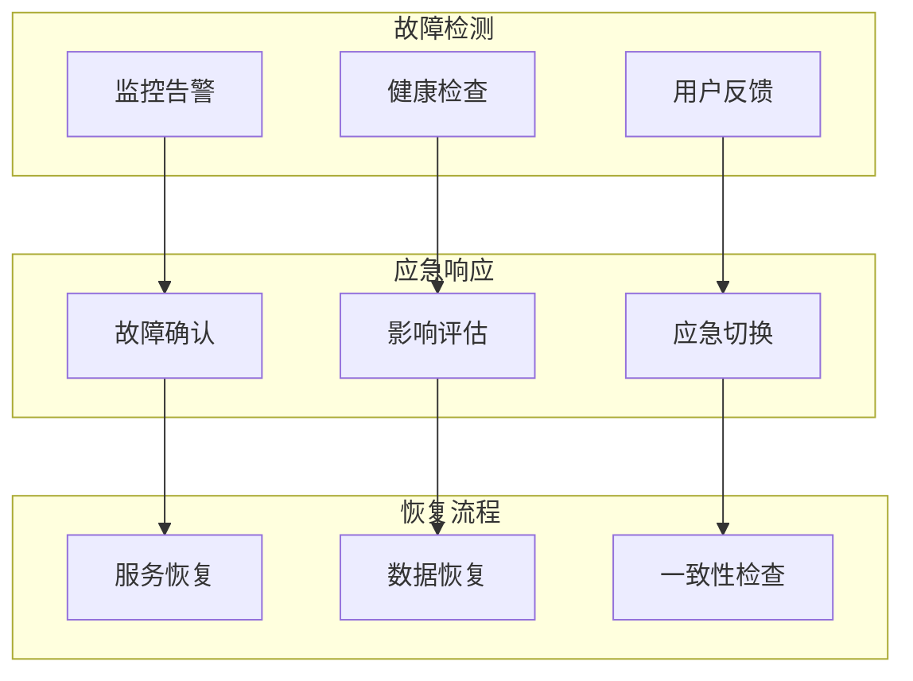

# 问题排查-故障恢复

## 概述

故障恢复是MongoDB运维中的重要环节，涉及数据丢失、服务不可用、性能异常等紧急情况的快速响应和恢复。有效的故障恢复需要预先制定完善的应急预案，建立自动化的监控告警机制，以及熟练掌握各种故障场景的处理方法。

想象一个电商平台在促销期间突然出现数据库主节点宕机，通过预设的故障恢复流程，在5分钟内完成主从切换，恢复了服务可用性，同时启动数据一致性检查和备份恢复程序。



## 知识要点

### 1. 故障检测与分类

#### 1.1 自动故障检测

```java
@Service
public class FailureDetectionService {
    
    @Autowired
    private MongoTemplate mongoTemplate;
    
    /**
     * 综合故障检测
     */
    public FailureDetectionResult detectFailures() {
        
        FailureDetectionResult result = new FailureDetectionResult();
        
        // 服务可用性检测
        result.setServiceAvailable(checkServiceAvailability());
        
        // 复制集健康检测
        result.setReplicationHealthy(checkReplicationHealth());
        
        // 性能异常检测
        result.setPerformanceNormal(checkPerformanceStatus());
        
        // 资源状态检测
        result.setResourcesAdequate(checkResourceStatus());
        
        // 综合评估故障级别
        result.setFailureLevel(evaluateFailureLevel(result));
        result.setRecommendedActions(generateActions(result));
        
        return result;
    }
    
    /**
     * 服务可用性检测
     */
    private boolean checkServiceAvailability() {
        try {
            // 基础连接测试
            Document result = mongoTemplate.getDb().runCommand(new Document("ping", 1));
            if (result.getDouble("ok") != 1.0) return false;
            
            // 读写操作测试
            Document testDoc = new Document("_id", "health_check_" + System.currentTimeMillis());
            mongoTemplate.insert(testDoc, "health_check");
            mongoTemplate.remove(new Query(Criteria.where("_id").is(testDoc.getString("_id"))), "health_check");
            
            return true;
        } catch (Exception e) {
            System.err.println("服务可用性检测失败: " + e.getMessage());
            return false;
        }
    }
    
    /**
     * 复制集健康检测
     */
    private boolean checkReplicationHealth() {
        try {
            Document replStatus = mongoTemplate.getDb().runCommand(new Document("replSetGetStatus", 1));
            List<Document> members = replStatus.getList("members", Document.class);
            
            boolean hasPrimary = false;
            int healthyMembers = 0;
            
            for (Document member : members) {
                int state = member.getInteger("state");
                if (state == 1) hasPrimary = true; // PRIMARY
                if (state == 1 || state == 2) healthyMembers++; // PRIMARY or SECONDARY
            }
            
            return hasPrimary && healthyMembers >= (members.size() / 2 + 1);
        } catch (Exception e) {
            System.err.println("复制集检测失败: " + e.getMessage());
            return false;
        }
    }
    
    /**
     * 性能状态检测
     */
    private boolean checkPerformanceStatus() {
        try {
            // 检查慢查询数量
            Query slowQuery = new Query(
                Criteria.where("ts").gte(new Date(System.currentTimeMillis() - 300000))
                    .and("millis").gte(1000)
            );
            long slowQueryCount = mongoTemplate.count(slowQuery, "system.profile");
            
            // 检查锁争用
            Document serverStatus = mongoTemplate.getDb().runCommand(new Document("serverStatus", 1));
            Document globalLock = serverStatus.get("globalLock", Document.class);
            Long currentQueue = globalLock != null ? globalLock.getLong("currentQueue") : 0L;
            
            return slowQueryCount < 10 && currentQueue < 5;
        } catch (Exception e) {
            return true; // 如果无法检测，假设正常
        }
    }
    
    /**
     * 资源状态检测
     */
    private boolean checkResourceStatus() {
        try {
            Document serverStatus = mongoTemplate.getDb().runCommand(new Document("serverStatus", 1));
            
            // 内存检查
            Document mem = serverStatus.get("mem", Document.class);
            Integer residentMB = mem.getInteger("resident", 0);
            
            // 连接数检查
            Document connections = serverStatus.get("connections", Document.class);
            Integer current = connections.getInteger("current", 0);
            Integer available = connections.getInteger("available", 0);
            
            double memoryUsage = residentMB / 4096.0; // 假设4GB内存
            double connectionUsage = (double) current / (current + available);
            
            return memoryUsage < 0.9 && connectionUsage < 0.9;
        } catch (Exception e) {
            return true;
        }
    }
    
    private String evaluateFailureLevel(FailureDetectionResult result) {
        if (!result.getServiceAvailable() || !result.getReplicationHealthy()) {
            return "CRITICAL";
        }
        if (!result.getPerformanceNormal() || !result.getResourcesAdequate()) {
            return "WARNING";
        }
        return "NORMAL";
    }
    
    private List<String> generateActions(FailureDetectionResult result) {
        List<String> actions = new ArrayList<>();
        
        if ("CRITICAL".equals(result.getFailureLevel())) {
            actions.add("立即启动紧急恢复流程");
            actions.add("通知相关技术人员");
            actions.add("准备故障切换");
        } else if ("WARNING".equals(result.getFailureLevel())) {
            actions.add("加强监控频率");
            actions.add("分析性能问题");
            actions.add("准备预防措施");
        }
        
        return actions;
    }
    
    @Data
    public static class FailureDetectionResult {
        private Boolean serviceAvailable;
        private Boolean replicationHealthy;
        private Boolean performanceNormal;
        private Boolean resourcesAdequate;
        private String failureLevel;
        private List<String> recommendedActions;
    }
}
```

### 2. 自动化恢复流程

#### 2.1 故障自动恢复

```java
@Service
public class AutoRecoveryService {
    
    @Autowired
    private FailureDetectionService failureDetectionService;
    
    @Autowired
    private MongoTemplate mongoTemplate;
    
    /**
     * 执行自动恢复
     */
    public RecoveryResult executeAutoRecovery() {
        
        RecoveryResult result = new RecoveryResult();
        result.setStartTime(new Date());
        
        try {
            // 1. 检测故障
            FailureDetectionResult detection = failureDetectionService.detectFailures();
            result.setDetectionResult(detection);
            
            // 2. 选择恢复策略
            String strategy = selectRecoveryStrategy(detection);
            result.setStrategy(strategy);
            
            // 3. 执行恢复操作
            boolean success = executeRecoveryStrategy(strategy);
            result.setSuccess(success);
            
            // 4. 验证恢复效果
            if (success) {
                boolean verified = verifyRecovery();
                result.setVerified(verified);
                
                if (verified) {
                    performPostRecoveryTasks();
                    result.setStatus("SUCCESS");
                } else {
                    result.setStatus("RECOVERY_INCOMPLETE");
                }
            } else {
                escalateToManualIntervention();
                result.setStatus("FAILED");
            }
            
        } catch (Exception e) {
            result.setStatus("ERROR");
            result.setErrorMessage(e.getMessage());
        }
        
        result.setEndTime(new Date());
        return result;
    }
    
    /**
     * 选择恢复策略
     */
    private String selectRecoveryStrategy(FailureDetectionResult detection) {
        
        if ("CRITICAL".equals(detection.getFailureLevel())) {
            if (!detection.getReplicationHealthy()) {
                return "REPLICA_SET_RECOVERY";
            } else if (!detection.getServiceAvailable()) {
                return "SERVICE_RESTART";
            }
        } else if ("WARNING".equals(detection.getFailureLevel())) {
            if (!detection.getPerformanceNormal()) {
                return "PERFORMANCE_OPTIMIZATION";
            } else if (!detection.getResourcesAdequate()) {
                return "RESOURCE_CLEANUP";
            }
        }
        
        return "NO_ACTION";
    }
    
    /**
     * 执行恢复策略
     */
    private boolean executeRecoveryStrategy(String strategy) {
        
        switch (strategy) {
            case "REPLICA_SET_RECOVERY":
                return recoverReplicaSet();
            case "SERVICE_RESTART":
                return restartService();
            case "PERFORMANCE_OPTIMIZATION":
                return optimizePerformance();
            case "RESOURCE_CLEANUP":
                return cleanupResources();
            default:
                return true;
        }
    }
    
    /**
     * 复制集恢复
     */
    private boolean recoverReplicaSet() {
        try {
            System.out.println("开始复制集恢复...");
            
            // 1. 检查复制集状态
            Document replStatus = mongoTemplate.getDb().runCommand(new Document("replSetGetStatus", 1));
            System.out.println("复制集当前状态: " + replStatus.toJson());
            
            // 2. 尝试重新配置
            // 实际环境中需要根据具体情况调整
            System.out.println("尝试重新配置复制集");
            
            // 3. 等待选举完成
            Thread.sleep(10000);
            
            return true;
        } catch (Exception e) {
            System.err.println("复制集恢复失败: " + e.getMessage());
            return false;
        }
    }
    
    /**
     * 服务重启
     */
    private boolean restartService() {
        try {
            System.out.println("开始服务重启...");
            
            // 实际环境中通过系统命令重启MongoDB
            System.out.println("模拟重启MongoDB服务");
            
            // 等待服务启动
            Thread.sleep(5000);
            
            // 验证服务可用性
            Document result = mongoTemplate.getDb().runCommand(new Document("ping", 1));
            return result.getDouble("ok") == 1.0;
            
        } catch (Exception e) {
            System.err.println("服务重启失败: " + e.getMessage());
            return false;
        }
    }
    
    /**
     * 性能优化
     */
    private boolean optimizePerformance() {
        try {
            System.out.println("开始性能优化...");
            
            // 1. 杀死长时间运行的查询
            killLongRunningQueries();
            
            // 2. 清理无用连接
            cleanupIdleConnections();
            
            // 3. 刷新统计信息
            refreshStatistics();
            
            return true;
        } catch (Exception e) {
            System.err.println("性能优化失败: " + e.getMessage());
            return false;
        }
    }
    
    /**
     * 资源清理
     */
    private boolean cleanupResources() {
        try {
            System.out.println("开始资源清理...");
            
            // 1. 清理临时集合
            cleanupTempCollections();
            
            // 2. 压缩数据库
            compactDatabase();
            
            // 3. 回收内存
            System.gc();
            
            return true;
        } catch (Exception e) {
            System.err.println("资源清理失败: " + e.getMessage());
            return false;
        }
    }
    
    // 辅助方法
    private void killLongRunningQueries() {
        System.out.println("清理长时间运行的查询");
    }
    
    private void cleanupIdleConnections() {
        System.out.println("清理空闲连接");
    }
    
    private void refreshStatistics() {
        System.out.println("刷新统计信息");
    }
    
    private void cleanupTempCollections() {
        System.out.println("清理临时集合");
    }
    
    private void compactDatabase() {
        System.out.println("压缩数据库");
    }
    
    /**
     * 验证恢复效果
     */
    private boolean verifyRecovery() {
        try {
            FailureDetectionResult postRecovery = failureDetectionService.detectFailures();
            return "NORMAL".equals(postRecovery.getFailureLevel());
        } catch (Exception e) {
            return false;
        }
    }
    
    /**
     * 恢复后处理
     */
    private void performPostRecoveryTasks() {
        System.out.println("执行恢复后处理:");
        System.out.println("- 记录恢复日志");
        System.out.println("- 通知相关人员");
        System.out.println("- 分析故障原因");
        System.out.println("- 更新监控配置");
    }
    
    /**
     * 升级到人工干预
     */
    private void escalateToManualIntervention() {
        System.err.println("自动恢复失败，升级到人工处理");
        System.err.println("- 发送紧急通知");
        System.err.println("- 准备详细报告");
        System.err.println("- 联系专家支持");
    }
    
    @Data
    public static class RecoveryResult {
        private Date startTime;
        private Date endTime;
        private FailureDetectionService.FailureDetectionResult detectionResult;
        private String strategy;
        private Boolean success;
        private Boolean verified;
        private String status;
        private String errorMessage;
    }
}
```

### 3. 故障恢复最佳实践

#### 3.1 恢复流程规范

```java
@Component
public class RecoveryBestPractices {
    
    /**
     * 故障恢复检查清单
     */
    public void displayRecoveryChecklist() {
        
        System.out.println("=== MongoDB故障恢复检查清单 ===");
        
        System.out.println("\n1. 紧急响应阶段:");
        System.out.println("   ✓ 确认故障类型和影响范围");
        System.out.println("   ✓ 评估业务影响和优先级");
        System.out.println("   ✓ 通知相关人员和业务方");
        System.out.println("   ✓ 启动相应的恢复预案");
        
        System.out.println("\n2. 故障诊断阶段:");
        System.out.println("   ✓ 检查系统日志和错误信息");
        System.out.println("   ✓ 分析监控数据和性能指标");
        System.out.println("   ✓ 确定故障根本原因");
        System.out.println("   ✓ 评估数据完整性状况");
        
        System.out.println("\n3. 恢复执行阶段:");
        System.out.println("   ✓ 选择合适的恢复策略");
        System.out.println("   ✓ 按步骤执行恢复操作");
        System.out.println("   ✓ 实时监控恢复进度");
        System.out.println("   ✓ 验证每个恢复步骤");
        
        System.out.println("\n4. 验证确认阶段:");
        System.out.println("   ✓ 验证服务可用性");
        System.out.println("   ✓ 检查数据一致性");
        System.out.println("   ✓ 确认性能指标正常");
        System.out.println("   ✓ 验证业务功能完整");
        
        System.out.println("\n5. 后续处理阶段:");
        System.out.println("   ✓ 记录详细的故障和恢复日志");
        System.out.println("   ✓ 分析故障原因和改进措施");
        System.out.println("   ✓ 更新恢复预案和流程");
        System.out.println("   ✓ 加强监控和预防机制");
    }
    
    /**
     * 常见故障恢复场景
     */
    public void demonstrateRecoveryScenarios() {
        
        System.out.println("\n=== 常见故障恢复场景 ===");
        
        System.out.println("\n场景1: 主节点宕机");
        System.out.println("恢复策略: 自动故障转移");
        System.out.println("关键步骤: 等待副本选举新主节点");
        System.out.println("注意事项: 确保数据不丢失");
        
        System.out.println("\n场景2: 复制集分裂");
        System.out.println("恢复策略: 手动重新配置");
        System.out.println("关键步骤: 分析网络分区并修复");
        System.out.println("注意事项: 防止脑裂问题");
        
        System.out.println("\n场景3: 数据损坏");
        System.out.println("恢复策略: 从备份恢复");
        System.out.println("关键步骤: 选择最近可用备份");
        System.out.println("注意事项: 评估数据丢失范围");
        
        System.out.println("\n场景4: 性能急剧下降");
        System.out.println("恢复策略: 性能优化");
        System.out.println("关键步骤: 识别性能瓶颈并优化");
        System.out.println("注意事项: 平衡性能和稳定性");
    }
}
```

## 知识扩展

### 1. 故障恢复原则

1. **快速响应**：建立监控告警机制，第一时间发现故障
2. **优先级管理**：根据业务影响确定恢复优先级
3. **数据安全**：在恢复过程中确保数据不丢失
4. **可回滚性**：确保恢复操作可以安全回滚

### 2. 常见故障类型

1. **硬件故障**：服务器宕机、磁盘损坏、网络中断
2. **软件故障**：MongoDB进程崩溃、配置错误
3. **性能问题**：查询缓慢、连接耗尽、资源不足
4. **数据问题**：数据损坏、一致性问题、误删除

### 3. 深度思考题

1. **RTO和RPO**：如何根据业务需求设定合理的恢复时间目标和恢复点目标？

2. **自动化程度**：故障恢复中哪些环节适合自动化，哪些需要人工干预？

3. **演练机制**：如何设计有效的故障恢复演练来验证预案可行性？

MongoDB故障恢复需要结合具体业务场景，制定完善的应急预案和自动化流程，确保在故障发生时能够快速有效地恢复服务。