# 3. MongoDB基础-数据类型详解

## 概述

MongoDB作为文档型数据库，其数据类型系统基于BSON（Binary JSON）格式，为开发者提供了比传统JSON更丰富、更精确的数据表示能力。深入理解MongoDB的数据类型不仅是正确设计数据模型的基础，更是优化存储效率、提升查询性能的关键。

从电商平台的商品属性管理到金融系统的精确计算，从地理位置服务到大文件存储，不同的业务场景对数据类型有着不同的要求。选择合适的数据类型不仅能够确保数据的准确性和完整性，还能显著影响应用的性能表现和存储成本。

```mermaid
graph TD
    A[BSON数据类型体系] --> B[基础数据类型]
    A --> C[数字类型]
    A --> D[日期时间类型]
    A --> E[复合数据类型]
    A --> F[特殊数据类型]
    
    B --> B1[String字符串]
    B --> B2[Boolean布尔值]
    B --> B3[Null空值]
    
    C --> C1[Double双精度]
    C --> C2[Int32整数]
    C --> C3[Int64长整数]
    C --> C4[Decimal128精确小数]
    
    D --> D1[Date日期]
    D --> D2[Timestamp时间戳]
    
    E --> E1[Object对象]
    E --> E2[Array数组]
    E --> E3[Binary二进制]
    
    F --> F1[ObjectId唯一标识]
    F --> F2[RegEx正则表达式]
    F --> F3[Code代码]
    
    classDef basic fill:#E3F2FD,stroke:#1976D2,color:#000
    classDef numeric fill:#E8F5E8,stroke:#388E3C,color:#000
    classDef datetime fill:#FFF3E0,stroke:#F57C00,color:#000
    classDef complex fill:#F3E5F5,stroke:#7B1FA2,color:#000
    classDef special fill:#FFEBEE,stroke:#C62828,color:#000
    
    class B,B1,B2,B3 basic
    class C,C1,C2,C3,C4 numeric
    class D,D1,D2 datetime
    class E,E1,E2,E3 complex
    class F,F1,F2,F3 special
```



## 知识要点

### 1. 基础数据类型

#### 1.1 String 字符串类型

MongoDB中的字符串必须是UTF-8编码，支持多语言文本存储：

```java
// 电商系统中的多语言商品信息
{
  "_id": ObjectId("65a1b2c3d4e5f67890123456"),
  "name": {
    "zh-CN": "苹果 iPhone 15 Pro 深空黑色",
    "en-US": "Apple iPhone 15 Pro Space Black",
    "ja-JP": "アップル iPhone 15 Pro スペースブラック",
    "ko-KR": "애플 아이폰 15 프로 스페이스 블랙"
  },
  "description": {
    "zh-CN": "搭载A17 Pro芯片，支持钛金属设计，拍照性能卓越",
    "en-US": "Featuring A17 Pro chip with titanium design and exceptional photography"
  },
  "tags": ["smartphone", "5G", "titanium", "pro", "高端手机", "钛合金"],
  "seoKeywords": "iPhone 15 Pro,苹果手机,5G手机,钛合金手机,专业摄影手机"
}

// Java代码中的字符串处理
@Document(collection = "products")
public class Product {
    
    @Field("name")
    private Map<String, String> nameByLocale;
    
    @Field("description") 
    private Map<String, String> descriptionByLocale;
    
    // 字符串索引优化
    @Indexed
    private String productCode;
    
    // 文本搜索字段
    @TextIndexed(weight = 2.0f)
    private String searchableText;
    
    // 字符串长度验证
    @Size(min = 1, max = 200)
    private String title;
    
    // 正则表达式验证
    @Pattern(regexp = "^[A-Z]{2,3}-\\d{4,6}$")
    private String skuCode;
}
```

#### 1.2 Boolean 布尔类型

布尔类型用于表示逻辑状态，在业务规则和状态管理中广泛应用：

```java
// 用户权限和状态管理系统
{
  "_id": ObjectId("user_65a1b2c3d4e5f678"),
  "username": "john_doe",
  "email": "john.doe@example.com",
  
  // 账户状态布尔字段
  "isActive": true,           // 账户是否激活
  "isEmailVerified": true,    // 邮箱是否验证
  "isPhoneVerified": false,   // 手机是否验证
  "isTwoFactorEnabled": true, // 是否启用双因子认证
  "isVip": false,            // 是否VIP用户
  
  // 权限控制
  "permissions": {
    "canCreatePost": true,
    "canDeletePost": false,
    "canModerateComments": false,
    "canAccessAdminPanel": false
  },
  
  // 偏好设置
  "preferences": {
    "receiveNotifications": true,
    "receiveMarketingEmails": false,
    "allowPublicProfile": true,
    "enableDarkMode": false
  },
  
  // 订阅状态
  "subscriptions": {
    "newsletter": true,
    "productUpdates": false,
    "securityAlerts": true
  }
}

// Java实体类中的布尔类型应用
@Document(collection = "users")
public class User {
    
    // 基础状态字段
    private Boolean isActive = true;
    private Boolean isEmailVerified = false;
    
    // 使用@Builder.Default确保默认值
    @Builder.Default
    private Boolean receiveNotifications = true;
    
    // 权限检查方法
    public boolean hasPermission(String permission) {
        return Optional.ofNullable(permissions)
            .map(perms -> perms.getOrDefault(permission, false))
            .orElse(false);
    }
    
    // 业务逻辑方法
    public boolean canPerformAction(String action) {
        return isActive && isEmailVerified && hasPermission(action);
    }
}
```

### 2. 数字类型系统

#### 2.1 整数类型 (Int32 & Int64)

MongoDB支持32位和64位整数，适用于不同精度需求：

```java
// 电商库存和计数系统
{
  "_id": ObjectId("inventory_65a1b2c3d4e5f678"),
  "productId": "PROD-12345",
  
  // Int32类型 - 适用于常规计数
  "currentStock": NumberInt(1250),      // 当前库存
  "reservedStock": NumberInt(75),       // 预留库存
  "soldToday": NumberInt(23),          // 今日销量
  "viewCount": NumberInt(8956),        // 浏览次数
  "favoriteCount": NumberInt(234),     // 收藏次数
  "reviewCount": NumberInt(89),        // 评论数量
  
  // Int64类型 - 适用于大数值
  "totalSalesVolume": NumberLong(1234567890),  // 总销售量
  "totalRevenue": NumberLong(99999999999),     // 总收入（分为单位）
  "globalViewCount": NumberLong(50000000),     // 全球浏览量
  "timestampMillis": NumberLong(1705315800000), // 时间戳毫秒
  
  // 库存操作历史
  "stockOperations": [
    {
      "type": "restock",
      "quantity": NumberInt(500),
      "timestamp": ISODate("2024-01-15T10:00:00Z"),
      "operatorId": NumberLong(123456)
    },
    {
      "type": "sale",
      "quantity": NumberInt(-1),
      "timestamp": ISODate("2024-01-15T14:30:00Z"),
      "orderId": NumberLong(987654321)
    }
  ]
}

// Java中的整数类型处理
@Service
public class InventoryService {
    
    // 库存操作 - 使用合适的整数类型
    public void updateStock(String productId, int quantity) {
        Query query = Query.query(Criteria.where("productId").is(productId));
        Update update = new Update()
            .inc("currentStock", quantity)  // Int32增量操作
            .inc("totalSalesVolume", Math.abs(quantity))  // Int64累计
            .currentDate("lastUpdated");
        
        mongoTemplate.updateFirst(query, update, "inventory");
    }
    
    // 大数值统计查询
    public Long getTotalRevenue() {
        Aggregation aggregation = Aggregation.newAggregation(
            Aggregation.group().sum("totalRevenue").as("total")
        );
        
        AggregationResults<Document> results = mongoTemplate
            .aggregate(aggregation, "inventory", Document.class);
        
        return results.getUniqueMappedResult()
            .getLong("total");
    }
}
```

#### 2.2 浮点数类型 (Double & Decimal128)

不同的浮点数类型适用于不同的精度要求：

```java
// 金融交易系统中的精确计算
{
  "_id": ObjectId("transaction_65a1b2c3d4e5f678"),
  "transactionId": "TXN-2024-0115-001",
  "accountId": "ACC-123456",
  
  // Double类型 - 适用于一般计算（可能有精度损失）
  "approximateAmount": 1234.5678,        // 近似金额
  "exchangeRate": 6.8234,               // 汇率
  "interestRate": 0.0325,               // 利率
  "riskScore": 7.85,                    // 风险评分
  
  // Decimal128类型 - 适用于精确计算（金融级精度）
  "exactAmount": NumberDecimal("1234.56"),           // 精确金额
  "feeAmount": NumberDecimal("12.35"),               // 手续费
  "balanceBefore": NumberDecimal("10000.00"),        // 交易前余额
  "balanceAfter": NumberDecimal("11234.56"),         // 交易后余额
  "taxAmount": NumberDecimal("123.456"),             // 税费
  
  // 计算结果也使用Decimal128保证精度
  "netAmount": NumberDecimal("1111.204"),  // 净额 = 金额 - 手续费 - 税费
  
  // 货币相关信息
  "currency": "CNY",
  "currencySymbol": "¥",
  "decimalPlaces": 2,
  
  // 审计信息
  "calculatedAt": ISODate("2024-01-15T14:30:00.123Z"),
  "calculatedBy": "system"
}

// Java中的精确计算实现
@Service
public class FinancialCalculationService {
    
    // 使用BigDecimal进行精确计算
    public BigDecimal calculateNetAmount(
            BigDecimal amount, 
            BigDecimal feeRate, 
            BigDecimal taxRate) {
        
        BigDecimal feeAmount = amount.multiply(feeRate)
            .setScale(2, RoundingMode.HALF_UP);
        BigDecimal taxAmount = amount.multiply(taxRate)
            .setScale(3, RoundingMode.HALF_UP);
        
        return amount.subtract(feeAmount).subtract(taxAmount);
    }
    
    // MongoDB中存储精确小数
    public void saveTransaction(Transaction transaction) {
        Document doc = new Document()
            .append("transactionId", transaction.getId())
            .append("exactAmount", new Decimal128(transaction.getAmount()))
            .append("feeAmount", new Decimal128(transaction.getFeeAmount()))
            .append("netAmount", new Decimal128(
                calculateNetAmount(
                    transaction.getAmount(),
                    transaction.getFeeRate(),
                    transaction.getTaxRate()
                )
            ));
        
        mongoTemplate.insert(doc, "transactions");
    }
}
```

### 3. 日期时间类型

#### 3.1 Date 日期类型

MongoDB的Date类型基于Unix时间戳，以毫秒为单位：

```java
// 项目管理系统的时间跟踪
{
  "_id": ObjectId("project_65a1b2c3d4e5f678"),
  "projectName": "电商平台重构项目",
  "projectCode": "ECOM-REFACTOR-2024",
  
  // 项目时间线
  "timeline": {
    "plannedStartDate": ISODate("2024-01-01T00:00:00.000Z"),
    "actualStartDate": ISODate("2024-01-15T09:00:00.000Z"),
    "plannedEndDate": ISODate("2024-06-30T23:59:59.999Z"),
    "estimatedEndDate": ISODate("2024-07-15T23:59:59.999Z"),
    "actualEndDate": null
  },
  
  // 里程碑时间点
  "milestones": [
    {
      "name": "需求分析完成",
      "plannedDate": ISODate("2024-02-01T17:00:00.000Z"),
      "actualDate": ISODate("2024-02-03T16:30:00.000Z"),
      "status": "completed"
    },
    {
      "name": "架构设计完成", 
      "plannedDate": ISODate("2024-02-15T17:00:00.000Z"),
      "actualDate": null,
      "status": "in_progress"
    }
  ],
  
  // 时间统计
  "timeTracking": {
    "totalPlannedHours": 2000,
    "totalActualHours": 450,
    "lastUpdated": ISODate("2024-01-15T14:30:00.000Z")
  }
}

// Java中的日期时间处理
@Service
public class ProjectTimeService {
    
    // 计算项目进度
    public ProjectProgress calculateProgress(String projectId) {
        Query query = Query.query(Criteria.where("_id").is(projectId));
        Project project = mongoTemplate.findOne(query, Project.class);
        
        if (project == null) return null;
        
        Date now = new Date();
        Date startDate = project.getTimeline().getActualStartDate();
        Date plannedEndDate = project.getTimeline().getPlannedEndDate();
        
        if (startDate == null) {
            return ProjectProgress.builder()
                .status("not_started")
                .progressPercentage(0.0)
                .build();
        }
        
        long totalDuration = plannedEndDate.getTime() - startDate.getTime();
        long elapsedDuration = now.getTime() - startDate.getTime();
        
        double progressPercentage = Math.min(
            (double) elapsedDuration / totalDuration * 100, 100.0);
        
        return ProjectProgress.builder()
            .status("in_progress")
            .progressPercentage(progressPercentage)
            .elapsedDays(elapsedDuration / (1000 * 60 * 60 * 24))
            .build();
    }
    
    // 查询特定日期范围的项目
    public List<Project> findProjectsInDateRange(Date startDate, Date endDate) {
        Criteria criteria = new Criteria().orOperator(
            Criteria.where("timeline.actualStartDate").gte(startDate).lt(endDate),
            Criteria.where("timeline.plannedStartDate").gte(startDate).lt(endDate)
        );
        
        Query query = Query.query(criteria);
        return mongoTemplate.find(query, Project.class);
    }
}
```

### 4. 复合数据类型

#### 4.1 Array 数组类型

数组类型支持存储有序的元素集合，元素可以是不同类型：

```java
// 社交媒体平台的用户动态
{
  "_id": ObjectId("post_65a1b2c3d4e5f678"),
  "userId": ObjectId("user_65a1b2c3d4e5f679"),
  "content": "分享一个MongoDB数据类型的学习心得...",
  
  // 字符串数组 - 标签系统
  "tags": ["MongoDB", "NoSQL", "数据库", "学习笔记", "技术分享"],
  
  // 对象数组 - 评论系统  
  "comments": [
    {
      "commentId": ObjectId("comment_65a1b2c3d4e5f680"),
      "userId": ObjectId("user_65a1b2c3d4e5f681"),
      "username": "techuser1",
      "content": "很实用的总结，收藏了！",
      "timestamp": ISODate("2024-01-15T10:30:00.000Z"),
      "likes": NumberInt(5),
      "replies": [
        {
          "replyId": ObjectId("reply_65a1b2c3d4e5f682"),
          "userId": ObjectId("user_65a1b2c3d4e5f679"),
          "username": "author",
          "content": "谢谢支持！",
          "timestamp": ISODate("2024-01-15T11:00:00.000Z")
        }
      ]
    }
  ],
  
  // 混合类型数组 - 附件信息
  "attachments": [
    {
      "type": "image",
      "url": "https://example.com/image1.jpg",
      "size": NumberLong(2048576),  // 2MB
      "metadata": {
        "width": NumberInt(1920),
        "height": NumberInt(1080),
        "format": "JPEG"
      }
    },
    {
      "type": "document", 
      "url": "https://example.com/doc1.pdf",
      "size": NumberLong(5242880),  // 5MB
      "metadata": {
        "pages": NumberInt(10),
        "format": "PDF"
      }
    }
  ],
  
  // 数值数组 - 统计数据
  "hourlyViews": [12, 15, 8, 23, 45, 67, 34, 28, 19, 25, 31, 42],
  "dailyEngagement": [0.12, 0.15, 0.08, 0.23, 0.19],
  
  // 嵌套数组 - 复杂结构
  "participantsByHour": [
    [1, 3, 5],     // 第1小时的参与者IDs
    [2, 4, 6, 8],  // 第2小时的参与者IDs
    [1, 7, 9]      // 第3小时的参与者IDs
  ]
}

// Java中的数组操作
@Service
public class PostService {
    
    // 添加标签到数组
    public void addTagsToPost(String postId, List<String> newTags) {
        Query query = Query.query(Criteria.where("_id").is(postId));
        Update update = new Update()
            .addToSet("tags").each(newTags.toArray());  // 避免重复标签
        
        mongoTemplate.updateFirst(query, update, "posts");
    }
    
    // 添加评论到数组
    public void addComment(String postId, Comment comment) {
        Query query = Query.query(Criteria.where("_id").is(postId));
        Update update = new Update()
            .push("comments", comment)  // 在数组末尾添加
            .inc("commentCount", 1);    // 同时更新计数
        
        mongoTemplate.updateFirst(query, update, "posts");
    }
    
    // 查询包含特定标签的帖子
    public List<Post> findPostsByTags(List<String> tags) {
        Criteria criteria = Criteria.where("tags").in(tags);
        Query query = Query.query(criteria);
        return mongoTemplate.find(query, Post.class);
    }
    
    // 数组元素更新 - 更新特定评论
    public void updateComment(String postId, String commentId, String newContent) {
        Query query = Query.query(
            Criteria.where("_id").is(postId)
                .and("comments.commentId").is(commentId)
        );
        Update update = new Update()
            .set("comments.$.content", newContent)  // 位置操作符$
            .currentDate("comments.$.lastModified");
        
        mongoTemplate.updateFirst(query, update, "posts");
    }
}
```

## 知识扩展

### 1. 数据类型选择最佳实践

```java
// 数据类型选择指南
public class DataTypeSelectionGuide {
    
    // 金融计算 - 使用Decimal128
    public static class FinancialAmount {
        @Field
        private Decimal128 amount;      // 精确金额
        
        @Field  
        private String currency;        // 货币代码
        
        // 避免使用Double进行金融计算
        // private Double amount;  // ❌ 错误：会有精度损失
    }
    
    // 计数器 - 根据范围选择整数类型
    public static class Counter {
        private Integer pageViews;           // ✅ 页面浏览量（Int32足够）
        private Long globalUserCount;        // ✅ 全球用户数（需要Int64）
        private Short categoryId;           // ✅ 分类ID（数量有限）
        
        // 避免过度使用Long
        // private Long pageViews;          // ❌ 浪费空间
    }
    
    // 字符串长度优化
    public static class OptimizedStrings {
        @Size(max = 10)
        private String code;                 // 短代码
        
        @Size(max = 200) 
        private String title;                // 标题
        
        @Size(max = 2000)
        private String description;          // 描述
        
        // 超长文本考虑使用GridFS
        // private String largeContent;     // ❌ 如果超过16MB
    }
}
```

### 2. 性能优化策略

```java
// 基于数据类型的性能优化
@Service
public class TypeOptimizationService {
    
    // 索引优化 - 选择合适的字段类型
    public void createOptimizedIndexes() {
        // ObjectId上的索引效率很高
        mongoTemplate.indexOps("users")
            .ensureIndex(new Index().on("_id", Sort.Direction.ASC));
        
        // 小整数比字符串索引更高效
        mongoTemplate.indexOps("products")
            .ensureIndex(new Index().on("categoryId", Sort.Direction.ASC));
        
        // 复合索引的字段顺序很重要
        mongoTemplate.indexOps("orders")
            .ensureIndex(new Index()
                .on("userId", Sort.Direction.ASC)     // 高选择性字段在前
                .on("status", Sort.Direction.ASC)     // 低选择性字段在后
                .on("createDate", Sort.Direction.DESC));
    }
    
    // 查询优化 - 使用类型特定的操作
    public List<Product> findProductsWithTypeOptimization() {
        return mongoTemplate.find(
            Query.query(
                new Criteria().andOperator(
                    Criteria.where("price").gte(new Decimal128(new BigDecimal("100.00"))),
                    Criteria.where("stock").gt(0),  // Int32比较
                    Criteria.where("isActive").is(true)  // Boolean比较
                )
            ),
            Product.class
        );
    }
}
```

## 深度思考

### 1. 数据类型与业务场景的匹配

选择合适的数据类型需要考虑：
- **精度要求**：金融计算使用Decimal128，一般计算使用Double
- **存储效率**：根据数值范围选择Int32或Int64
- **查询性能**：数值类型的比较比字符串更高效
- **索引效果**：某些类型的索引性能更好

### 2. 数据类型的演进策略

在项目发展过程中，可能需要调整数据类型：
- 从Int32升级到Int64（数值范围扩大）
- 从Double升级到Decimal128（精度要求提高）
- 从字符串转换为枚举值（性能优化）

### 3. 跨平台兼容性考虑

不同编程语言对MongoDB数据类型的支持程度不同，设计时需要考虑：
- JavaScript中的数值类型精度限制
- Java中的BigDecimal与Decimal128的转换
- Python中的datetime与MongoDB Date的时区处理

通过深入理解MongoDB的数据类型系统，开发者能够设计出更高效、更准确的数据模型，为应用的性能和可靠性奠定坚实基础。