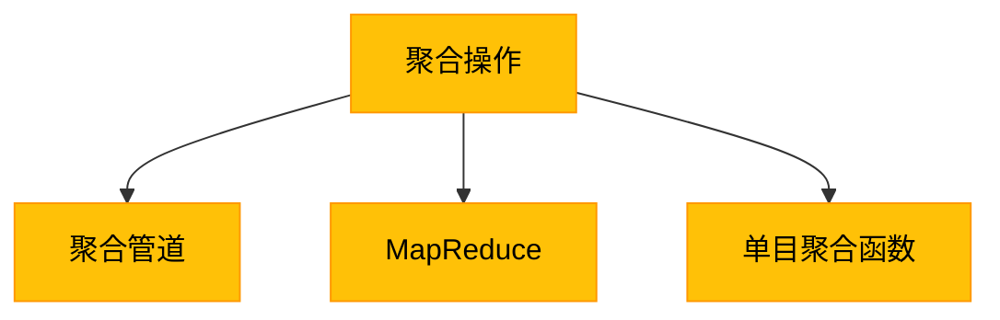

# 3. Mongo数据库进阶-聚合操作

## 概述
聚合操作是MongoDB中的高级查询功能，它允许我们对数据进行复杂的处理和分析，如分组、筛选、排序、计算等。MongoDB提供了两种主要的聚合方式：聚合管道和MapReduce。



## 知识要点
### 1. 聚合管道
聚合管道是一系列的操作，每个操作接收输入文档，处理后输出结果文档，然后传递给下一个操作。

- **常用管道阶段**: 
  - `$match`: 过滤文档
  - `$group`: 分组文档
  - `$sort`: 排序文档
  - `$skip`/`$limit`: 分页
  - `$project`: 投影文档
  - `$unwind`: 展开数组
  - `$lookup`: 左连接其他集合

```java
// 示例：聚合管道
List<Document> pipeline = Arrays.asList(
    new Document("$match", new Document("age", new Document("$gt", 25))),
    new Document("$group", new Document("_id", "$address.city")
        .append("count", new Document("$sum", 1))
        .append("avgAge", new Document("$avg", "$age"))),
    new Document("$sort", new Document("count", -1))
);

AggregateIterable<Document> result = collection.aggregate(pipeline);
```

### 2. MapReduce
MapReduce是一种分布式计算模型，它包括两个主要阶段：map阶段和reduce阶段。

- **map阶段**: 将数据分解成键值对
- **reduce阶段**: 合并相同键的值

```java
// 示例：MapReduce
String mapFunction = "function() { emit(this.address.city, 1); }";
String reduceFunction = "function(key, values) { return Array.sum(values); }";

MapReduceIterable<Document> result = collection.mapReduce(mapFunction, reduceFunction);
```

### 3. 单目聚合函数
单目聚合函数是针对整个集合的聚合操作，如计数、求和、平均值等。

- `count()`: 计算文档数量
- `distinct()`: 查找指定字段的不同值
- `aggregateOne()`: 执行聚合操作并返回单个结果

```java
// 示例：单目聚合函数
long count = collection.countDocuments();

List<String> cities = collection.distinct("address.city", String.class).into(new ArrayList<>());
```

## 知识扩展
### 1. 设计思想
MongoDB的聚合系统设计灵感来自于Unix管道，它允许我们通过组合简单的操作来构建复杂的查询。这种设计理念使得聚合操作既灵活又强大，可以满足各种复杂的数据处理需求。

### 2. 避坑指南
- 聚合管道的顺序很重要，尽量将`$match`放在前面，以减少后续操作的数据量。
- 对于大数据集，考虑使用索引来提高聚合操作的性能。
- 注意聚合操作的内存限制，如果操作的数据量过大，可能会导致性能问题或失败。
- MapReduce虽然强大，但性能通常比聚合管道低，尽量使用聚合管道。

### 3. 深度思考题
- 聚合管道和MapReduce的主要区别是什么？各自的适用场景是什么？
- 如何优化聚合操作的性能？
- 什么是覆盖索引？它在聚合操作中有什么作用？

**深度思考题回答:**
- 聚合管道是一系列的操作，每个操作处理输入文档并输出结果文档，然后传递给下一个操作；MapReduce是一种分布式计算模型，包括map阶段和reduce阶段。聚合管道适合处理中等规模的数据和复杂的查询；MapReduce适合处理大规模的数据和复杂的计算。
- 优化聚合操作的性能可以从以下几个方面入手：使用合适的索引、合理安排管道阶段的顺序、限制返回的数据量、避免不必要的计算等。
- 覆盖索引是一种特殊的索引，它包含了查询所需的所有字段，使得MongoDB不需要读取文档就可以返回查询结果。在聚合操作中，覆盖索引可以显著提高性能，特别是对于那些只需要访问索引中包含的字段的操作。