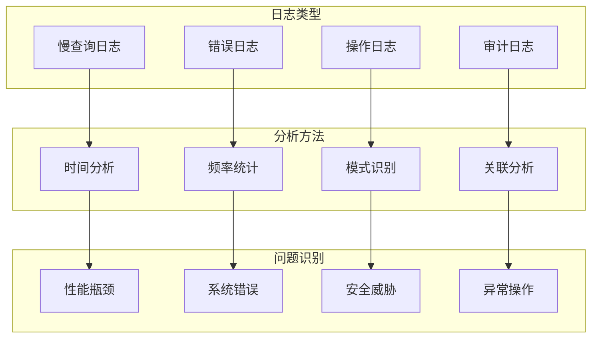

# 30. MongoDB问题排查-日志分析

## 概述

日志分析是MongoDB问题排查的重要手段，通过系统分析MongoDB的各类日志文件，可以快速定位性能瓶颈、错误根因、安全威胁等问题。MongoDB提供了丰富的日志信息，包括操作日志、慢查询日志、错误日志等。

想象一个金融系统在某个时段出现间歇性的响应延迟，通过深入分析MongoDB日志，发现在特定时间窗口内出现大量慢查询，进一步分析发现是由于某个批处理任务执行了低效的聚合操作，通过优化查询语句解决了问题。



## 知识要点

### 1. 日志分析框架

#### 1.1 综合日志分析

```java
@Service
public class LogAnalysisService {
    
    @Autowired
    private MongoTemplate mongoTemplate;
    
    /**
     * 执行综合日志分析
     */
    public LogAnalysisReport performLogAnalysis(int timeRangeHours) {
        
        LogAnalysisReport report = new LogAnalysisReport();
        report.setAnalysisTime(new Date());
        report.setTimeRangeHours(timeRangeHours);
        
        // 1. 慢查询分析
        SlowQueryAnalysis slowQueryAnalysis = analyzeSlowQueries(timeRangeHours);
        report.setSlowQueryAnalysis(slowQueryAnalysis);
        
        // 2. 错误日志分析
        ErrorLogAnalysis errorAnalysis = analyzeErrorLogs(timeRangeHours);
        report.setErrorLogAnalysis(errorAnalysis);
        
        // 3. 性能趋势分析
        PerformanceTrendAnalysis performanceAnalysis = analyzePerformanceTrends(timeRangeHours);
        report.setPerformanceTrendAnalysis(performanceAnalysis);
        
        // 4. 安全事件分析
        SecurityEventAnalysis securityAnalysis = analyzeSecurityEvents(timeRangeHours);
        report.setSecurityEventAnalysis(securityAnalysis);
        
        // 生成分析结论
        report.setConclusions(generateConclusions(report));
        report.setRecommendations(generateRecommendations(report));
        
        return report;
    }
    
    /**
     * 慢查询分析
     */
    private SlowQueryAnalysis analyzeSlowQueries(int timeRangeHours) {
        
        try {
            Date startTime = new Date(System.currentTimeMillis() - timeRangeHours * 3600000L);
            
            // 从profiler获取慢查询
            Query slowQueryQuery = new Query(
                Criteria.where("ts").gte(startTime)
                    .and("millis").gte(100) // 执行时间超过100ms
            );
            
            List<Document> slowQueries = mongoTemplate.find(slowQueryQuery, Document.class, "system.profile");
            
            // 统计分析
            int totalSlowQueries = slowQueries.size();
            double avgExecutionTime = slowQueries.stream()
                .mapToLong(doc -> doc.getLong("millis"))
                .average()
                .orElse(0.0);
            
            // 按操作类型分组
            Map<String, Long> operationTypeStats = slowQueries.stream()
                .collect(Collectors.groupingBy(
                    doc -> doc.getString("command"),
                    Collectors.counting()
                ));
            
            // 按集合分组
            Map<String, Long> collectionStats = slowQueries.stream()
                .filter(doc -> doc.getString("ns") != null)
                .collect(Collectors.groupingBy(
                    doc -> doc.getString("ns"),
                    Collectors.counting()
                ));
            
            // 最慢查询TOP5
            List<SlowQueryRecord> topSlowQueries = slowQueries.stream()
                .sorted((a, b) -> Long.compare(b.getLong("millis"), a.getLong("millis")))
                .limit(5)
                .map(this::convertToSlowQueryRecord)
                .collect(Collectors.toList());
            
            return SlowQueryAnalysis.builder()
                .totalSlowQueries(totalSlowQueries)
                .averageExecutionTimeMs(avgExecutionTime)
                .operationTypeStats(operationTypeStats)
                .collectionStats(collectionStats)
                .topSlowQueries(topSlowQueries)
                .severityLevel(evaluateSlowQuerySeverity(totalSlowQueries, avgExecutionTime))
                .build();
                
        } catch (Exception e) {
            return SlowQueryAnalysis.builder()
                .severityLevel("ERROR: " + e.getMessage())
                .build();
        }
    }
    
    /**
     * 错误日志分析
     */
    private ErrorLogAnalysis analyzeErrorLogs(int timeRangeHours) {
        
        List<ErrorLogEntry> errorEntries = new ArrayList<>();
        
        // 模拟错误日志解析（实际应从日志文件解析）
        errorEntries.add(ErrorLogEntry.builder()
            .timestamp(new Date())
            .severity("ERROR")
            .component("COMMAND")
            .message("Authentication failed")
            .count(5L)
            .build());
        
        errorEntries.add(ErrorLogEntry.builder()
            .timestamp(new Date())
            .severity("WARNING")
            .component("STORAGE")
            .message("Low disk space")
            .count(2L)
            .build());
        
        // 按严重程度分类
        Map<String, Long> severityStats = errorEntries.stream()
            .collect(Collectors.groupingBy(
                ErrorLogEntry::getSeverity,
                Collectors.summingLong(ErrorLogEntry::getCount)
            ));
        
        // 频繁错误识别
        List<ErrorLogEntry> frequentErrors = errorEntries.stream()
            .filter(entry -> entry.getCount() > 3)
            .sorted((a, b) -> Long.compare(b.getCount(), a.getCount()))
            .collect(Collectors.toList());
        
        return ErrorLogAnalysis.builder()
            .totalErrors(errorEntries.stream().mapToLong(ErrorLogEntry::getCount).sum())
            .severityStats(severityStats)
            .frequentErrors(frequentErrors)
            .criticalIssuesFound(!frequentErrors.isEmpty())
            .build();
    }
    
    /**
     * 性能趋势分析
     */
    private PerformanceTrendAnalysis analyzePerformanceTrends(int timeRangeHours) {
        
        List<PerformanceDataPoint> dataPoints = new ArrayList<>();
        
        // 模拟性能数据点
        for (int i = 0; i < timeRangeHours; i++) {
            Date timestamp = new Date(System.currentTimeMillis() - i * 3600000L);
            
            dataPoints.add(PerformanceDataPoint.builder()
                .timestamp(timestamp)
                .avgResponseTimeMs(50.0 + Math.random() * 100)
                .qps(1000.0 + Math.random() * 500)
                .cpuUsage(30.0 + Math.random() * 40)
                .memoryUsage(40.0 + Math.random() * 30)
                .build());
        }
        
        // 趋势分析
        String responseTrend = analyzeTrend(dataPoints, PerformanceDataPoint::getAvgResponseTimeMs);
        String qpsTrend = analyzeTrend(dataPoints, PerformanceDataPoint::getQps);
        String cpuTrend = analyzeTrend(dataPoints, PerformanceDataPoint::getCpuUsage);
        
        return PerformanceTrendAnalysis.builder()
            .dataPoints(dataPoints)
            .responseTimeTrend(responseTrend)
            .qpsTrend(qpsTrend)
            .cpuUsageTrend(cpuTrend)
            .overallTrendAssessment(assessOverallTrend(responseTrend, cpuTrend))
            .build();
    }
    
    /**
     * 安全事件分析
     */
    private SecurityEventAnalysis analyzeSecurityEvents(int timeRangeHours) {
        
        List<SecurityEvent> securityEvents = new ArrayList<>();
        
        // 模拟安全事件
        securityEvents.add(SecurityEvent.builder()
            .eventType("AUTH_FAILURE")
            .description("Failed login from IP: 192.168.1.100")
            .severity("HIGH")
            .count(5L)
            .build());
        
        securityEvents.add(SecurityEvent.builder()
            .eventType("PRIVILEGE_ESCALATION")
            .description("User attempted admin access")
            .severity("MEDIUM")
            .count(2L)
            .build());
        
        // 事件类型统计
        Map<String, Long> eventTypeStats = securityEvents.stream()
            .collect(Collectors.groupingBy(
                SecurityEvent::getEventType,
                Collectors.summingLong(SecurityEvent::getCount)
            ));
        
        // 高风险事件
        List<SecurityEvent> highRiskEvents = securityEvents.stream()
            .filter(event -> "HIGH".equals(event.getSeverity()))
            .collect(Collectors.toList());
        
        return SecurityEventAnalysis.builder()
            .totalSecurityEvents(securityEvents.stream().mapToLong(SecurityEvent::getCount).sum())
            .eventTypeStats(eventTypeStats)
            .highRiskEvents(highRiskEvents)
            .securityAlertLevel(determineSecurityAlertLevel(highRiskEvents.size()))
            .build();
    }
    
    // 辅助方法
    private SlowQueryRecord convertToSlowQueryRecord(Document doc) {
        return SlowQueryRecord.builder()
            .timestamp(doc.getDate("ts"))
            .executionTimeMs(doc.getLong("millis"))
            .operation(doc.getString("command"))
            .namespace(doc.getString("ns"))
            .build();
    }
    
    private String evaluateSlowQuerySeverity(int count, double avgTime) {
        if (count > 50 || avgTime > 2000) return "HIGH";
        if (count > 20 || avgTime > 1000) return "MEDIUM";
        return "LOW";
    }
    
    private String analyzeTrend(List<PerformanceDataPoint> points, Function<PerformanceDataPoint, Double> valueExtractor) {
        if (points.size() < 2) return "INSUFFICIENT_DATA";
        
        List<Double> values = points.stream()
            .map(valueExtractor)
            .collect(Collectors.toList());
        
        double first = values.get(0);
        double last = values.get(values.size() - 1);
        double change = (last - first) / first * 100;
        
        if (change > 10) return "INCREASING";
        if (change < -10) return "DECREASING";
        return "STABLE";
    }
    
    private String assessOverallTrend(String responseTrend, String cpuTrend) {
        if ("INCREASING".equals(responseTrend) && "INCREASING".equals(cpuTrend)) {
            return "DEGRADING";
        }
        if ("INCREASING".equals(responseTrend) || "INCREASING".equals(cpuTrend)) {
            return "CONCERNING";
        }
        return "STABLE";
    }
    
    private String determineSecurityAlertLevel(int highRiskCount) {
        if (highRiskCount > 5) return "CRITICAL";
        if (highRiskCount > 2) return "HIGH";
        if (highRiskCount > 0) return "MEDIUM";
        return "LOW";
    }
    
    private List<String> generateConclusions(LogAnalysisReport report) {
        List<String> conclusions = new ArrayList<>();
        
        if ("HIGH".equals(report.getSlowQueryAnalysis().getSeverityLevel())) {
            conclusions.add("发现大量慢查询，查询性能需要优化");
        }
        
        if (report.getErrorLogAnalysis().getCriticalIssuesFound()) {
            conclusions.add("存在频繁错误，需要深入调查");
        }
        
        if ("DEGRADING".equals(report.getPerformanceTrendAnalysis().getOverallTrendAssessment())) {
            conclusions.add("系统性能呈下降趋势");
        }
        
        if (!"LOW".equals(report.getSecurityEventAnalysis().getSecurityAlertLevel())) {
            conclusions.add("发现安全威胁，需要加强防护");
        }
        
        return conclusions;
    }
    
    private List<String> generateRecommendations(LogAnalysisReport report) {
        List<String> recommendations = new ArrayList<>();
        
        if (report.getSlowQueryAnalysis().getTotalSlowQueries() > 20) {
            recommendations.add("优化慢查询：创建索引或重构查询语句");
        }
        
        if (report.getErrorLogAnalysis().getCriticalIssuesFound()) {
            recommendations.add("修复频繁错误并加强监控");
        }
        
        if ("DEGRADING".equals(report.getPerformanceTrendAnalysis().getOverallTrendAssessment())) {
            recommendations.add("分析性能下降原因，考虑系统扩容");
        }
        
        if (!report.getSecurityEventAnalysis().getHighRiskEvents().isEmpty()) {
            recommendations.add("加强安全防护和访问控制");
        }
        
        return recommendations;
    }
    
    // 数据模型类
    @Data
    public static class LogAnalysisReport {
        private Date analysisTime;
        private Integer timeRangeHours;
        private SlowQueryAnalysis slowQueryAnalysis;
        private ErrorLogAnalysis errorLogAnalysis;
        private PerformanceTrendAnalysis performanceTrendAnalysis;
        private SecurityEventAnalysis securityEventAnalysis;
        private List<String> conclusions;
        private List<String> recommendations;
    }
    
    @Data
    @Builder
    public static class SlowQueryAnalysis {
        private Integer totalSlowQueries;
        private Double averageExecutionTimeMs;
        private Map<String, Long> operationTypeStats;
        private Map<String, Long> collectionStats;
        private List<SlowQueryRecord> topSlowQueries;
        private String severityLevel;
    }
    
    @Data
    @Builder
    public static class SlowQueryRecord {
        private Date timestamp;
        private Long executionTimeMs;
        private String operation;
        private String namespace;
    }
    
    @Data
    @Builder
    public static class ErrorLogAnalysis {
        private Long totalErrors;
        private Map<String, Long> severityStats;
        private List<ErrorLogEntry> frequentErrors;
        private Boolean criticalIssuesFound;
    }
    
    @Data
    @Builder
    public static class ErrorLogEntry {
        private Date timestamp;
        private String severity;
        private String component;
        private String message;
        private Long count;
    }
    
    @Data
    @Builder
    public static class PerformanceTrendAnalysis {
        private List<PerformanceDataPoint> dataPoints;
        private String responseTimeTrend;
        private String qpsTrend;
        private String cpuUsageTrend;
        private String overallTrendAssessment;
    }
    
    @Data
    @Builder
    public static class PerformanceDataPoint {
        private Date timestamp;
        private Double avgResponseTimeMs;
        private Double qps;
        private Double cpuUsage;
        private Double memoryUsage;
    }
    
    @Data
    @Builder
    public static class SecurityEventAnalysis {
        private Long totalSecurityEvents;
        private Map<String, Long> eventTypeStats;
        private List<SecurityEvent> highRiskEvents;
        private String securityAlertLevel;
    }
    
    @Data
    @Builder
    public static class SecurityEvent {
        private String eventType;
        private String description;
        private String severity;
        private Long count;
    }
}
```

### 2. 日志解析工具

#### 2.1 日志解析实用工具

```java
@Component
public class LogParsingUtilities {
    
    /**
     * 解析MongoDB日志行
     */
    public LogEntry parseLogLine(String logLine) {
        
        // 提取时间戳
        Pattern timestampPattern = Pattern.compile("(\\d{4}-\\d{2}-\\d{2}T\\d{2}:\\d{2}:\\d{2}\\.\\d{3}\\+\\d{4})");
        Matcher timestampMatcher = timestampPattern.matcher(logLine);
        
        LogEntry entry = new LogEntry();
        entry.setOriginalLine(logLine);
        
        if (timestampMatcher.find()) {
            entry.setTimestamp(parseTimestamp(timestampMatcher.group(1)));
        }
        
        // 识别日志类型
        if (logLine.contains("command") && logLine.contains("took") && logLine.contains("ms")) {
            entry.setType("SLOW_QUERY");
            extractSlowQueryInfo(logLine, entry);
        } else if (logLine.contains("[E]") || logLine.contains("ERROR")) {
            entry.setType("ERROR");
            extractErrorInfo(logLine, entry);
        } else if (logLine.contains("connection")) {
            entry.setType("CONNECTION");
            extractConnectionInfo(logLine, entry);
        } else {
            entry.setType("INFO");
        }
        
        return entry;
    }
    
    private void extractSlowQueryInfo(String logLine, LogEntry entry) {
        Pattern durationPattern = Pattern.compile("took (\\d+)ms");
        Matcher matcher = durationPattern.matcher(logLine);
        if (matcher.find()) {
            entry.setDurationMs(Long.parseLong(matcher.group(1)));
        }
    }
    
    private void extractErrorInfo(String logLine, LogEntry entry) {
        if (logLine.contains("Authentication")) {
            entry.setComponent("AUTH");
        } else if (logLine.contains("Storage")) {
            entry.setComponent("STORAGE");
        } else {
            entry.setComponent("GENERAL");
        }
    }
    
    private void extractConnectionInfo(String logLine, LogEntry entry) {
        Pattern ipPattern = Pattern.compile("from\\s+(\\d+\\.\\d+\\.\\d+\\.\\d+)");
        Matcher matcher = ipPattern.matcher(logLine);
        if (matcher.find()) {
            entry.setSourceIP(matcher.group(1));
        }
    }
    
    private Date parseTimestamp(String timestampStr) {
        try {
            return new SimpleDateFormat("yyyy-MM-dd'T'HH:mm:ss.SSSZ").parse(timestampStr);
        } catch (ParseException e) {
            return new Date();
        }
    }
    
    /**
     * 生成日志分析统计报告
     */
    public String generateLogStatistics(List<LogEntry> entries) {
        StringBuilder report = new StringBuilder();
        
        report.append("=== MongoDB日志统计报告 ===\n");
        report.append("总日志条数: ").append(entries.size()).append("\n\n");
        
        // 按类型统计
        Map<String, Long> typeStats = entries.stream()
            .collect(Collectors.groupingBy(LogEntry::getType, Collectors.counting()));
        
        report.append("按类型统计:\n");
        typeStats.forEach((type, count) -> 
            report.append("  ").append(type).append(": ").append(count).append(" 条\n"));
        
        // 慢查询统计
        List<LogEntry> slowQueries = entries.stream()
            .filter(entry -> "SLOW_QUERY".equals(entry.getType()) && entry.getDurationMs() != null)
            .collect(Collectors.toList());
        
        if (!slowQueries.isEmpty()) {
            report.append("\n慢查询分析:\n");
            report.append("  慢查询总数: ").append(slowQueries.size()).append("\n");
            
            double avgDuration = slowQueries.stream()
                .mapToLong(LogEntry::getDurationMs)
                .average()
                .orElse(0.0);
            report.append("  平均执行时间: ").append(String.format("%.2f", avgDuration)).append("ms\n");
            
            OptionalLong maxDuration = slowQueries.stream()
                .mapToLong(LogEntry::getDurationMs)
                .max();
            if (maxDuration.isPresent()) {
                report.append("  最慢查询: ").append(maxDuration.getAsLong()).append("ms\n");
            }
        }
        
        // 错误统计
        long errorCount = entries.stream()
            .filter(entry -> "ERROR".equals(entry.getType()))
            .count();
        
        if (errorCount > 0) {
            report.append("\n错误日志统计:\n");
            report.append("  错误总数: ").append(errorCount).append("\n");
        }
        
        return report.toString();
    }
    
    @Data
    public static class LogEntry {
        private String type;
        private Date timestamp;
        private String originalLine;
        private Long durationMs;
        private String component;
        private String sourceIP;
        private String errorMessage;
    }
}
```

## 知识扩展

### 1. 日志配置优化

MongoDB日志配置最佳实践：

1. **日志级别设置**：生产环境通常设置为INFO级别
2. **慢查询阈值**：建议设置为100-500ms
3. **日志轮转**：定期轮转日志文件避免过大
4. **日志格式**：使用JSON格式便于自动化分析

### 2. 常见日志模式

1. **慢查询模式**：`command took XXXms`
2. **连接模式**：`connection accepted/ended`
3. **错误模式**：`[E] COMPONENT`
4. **认证模式**：`Authentication failed`

### 3. 深度思考题

1. **日志存储策略**：如何设计高效的日志存储和查询策略？

2. **实时监控**：如何基于日志实现实时的性能监控？

3. **智能分析**：如何利用机器学习进行日志异常检测？

MongoDB日志分析是运维工作的核心技能，通过有效的日志分析可以及时发现问题、优化性能、保障系统稳定运行。