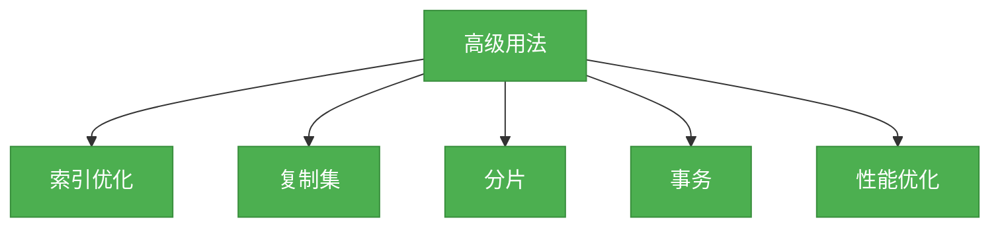

# 4. Mongo数据库高级用法

## 概述
MongoDB提供了许多高级功能，使得它可以适应各种复杂的业务场景。本章将介绍MongoDB的一些高级用法，包括索引优化、复制集、分片、事务等。



## 知识要点
### 1. 索引优化
索引是提高查询性能的关键，MongoDB支持多种类型的索引。

- **单字段索引**: 基于单个字段创建的索引
- **复合索引**: 基于多个字段创建的索引
- **多键索引**: 针对数组字段创建的索引
- **地理空间索引**: 针对地理空间数据创建的索引
- **文本索引**: 针对文本数据创建的索引
- **哈希索引**: 基于哈希函数创建的索引

```java
// 示例：创建复合索引
collection.createIndex(new Document("name", 1).append("age", -1));

// 示例：查看索引
List<Document> indexes = collection.listIndexes().into(new ArrayList<>());
```

### 2. 复制集
复制集是一组MongoDB实例，它们维护相同的数据集，提供高可用性和数据冗余。

- **主节点**: 负责处理写操作
- **从节点**: 复制主节点的数据，处理读操作
- **仲裁节点**: 不存储数据，只参与选举

```java
// 示例：连接到复制集
MongoClient mongoClient = MongoClients.create("mongodb://host1:27017,host2:27017,host3:27017/?replicaSet=myReplicaSet");
```

### 3. 分片
分片是一种水平扩展方式，它将数据分布在多个服务器上。

- **分片键**: 用于确定数据分布的字段
- **分片集群**: 由mongos、config服务器和分片服务器组成
- **分片策略**: 包括范围分片和哈希分片

```java
// 示例：连接到分片集群
MongoClient mongoClient = MongoClients.create("mongodb://mongos1:27017,mongos2:27017");
```

### 4. 事务
MongoDB支持多文档事务，使得我们可以在多个文档上执行原子操作。

- **开始事务**: 使用`startSession()`和`startTransaction()`方法
- **提交事务**: 使用`commitTransaction()`方法
- **回滚事务**: 使用`abortTransaction()`方法

```java
// 示例：使用事务
ClientSession clientSession = mongoClient.startSession();

try {
    clientSession.startTransaction();
    
    // 执行操作...
    
    clientSession.commitTransaction();
} catch (Exception e) {
    clientSession.abortTransaction();
} finally {
    clientSession.close();
}
```

## 知识扩展
### 1. 设计思想
MongoDB的高级功能设计遵循了可扩展性和高可用性的原则，使得它可以适应各种复杂的业务场景。无论是处理大量的数据、保证数据的可用性，还是确保数据的一致性，MongoDB都提供了相应的解决方案。

### 2. 避坑指南
- 索引虽然可以提高查询性能，但也会增加写操作的开销，要合理设计索引。
- 复制集可以提供高可用性，但不能提供水平扩展，对于大量的数据，需要使用分片。
- 分片虽然可以提供水平扩展，但也会增加系统的复杂性，要谨慎使用。
- 事务虽然可以保证数据的一致性，但也会增加性能开销，对于不需要严格一致性的场景，可以考虑使用其他方式。

### 3. 深度思考题
- 什么是MongoDB中的读写关注级别？它们有什么作用？
- 如何选择合适的分片键？
- 复制集和分片的主要区别是什么？各自的适用场景是什么？

**深度思考题回答:**
- 读写关注级别是控制MongoDB读写操作的一致性和可用性的机制。读关注级别控制了读取的数据的新鲜度；写关注级别控制了写操作的确认方式。
- 选择合适的分片键需要考虑以下几个因素：数据分布的均匀性、查询的频率、写入的频率等。一个好的分片键应该能够使得数据均匀分布在各个分片上，同时能够满足查询的需求。
- 复制集是一组维护相同数据集的MongoDB实例，主要用于提供高可用性和数据冗余；分片是一种水平扩展方式，主要用于处理大量的数据。复制集适合处理需要高可用性但数据量不是特别大的场景；分片适合处理数据量非常大，单个服务器无法处理的场景。