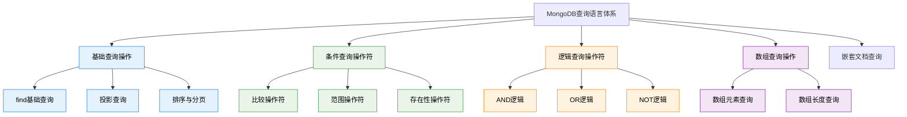

# 基础-查询语言基础

## 概述

MongoDB查询语言（MQL）是一套基于JSON的声明式查询语法，为开发者提供了灵活而强大的数据检索能力。与传统SQL不同，MQL更贴近现代应用的数据结构，能够直接操作嵌套文档和数组，这使得复杂数据的查询变得更加直观和高效。

从电商平台的商品搜索到社交媒体的内容过滤，MongoDB查询语言在各种业务场景中都发挥着关键作用。掌握MQL不仅是高效使用MongoDB的基础，更是构建高性能应用的关键技能。



## 知识要点

### 1. 基础查询操作

#### 1.1 find() 基础查询

MongoDB的基础查询使用find()方法，支持灵活的条件匹配：

```java
// 电商系统商品查询示例
{
  "_id": ObjectId("65a1b2c3d4e5f67890123456"),
  "productCode": "PHONE-IP15-PRO-256",
  "name": "iPhone 15 Pro 256GB",
  "brand": "Apple",
  "category": {
    "primary": "electronics",
    "secondary": "smartphones"
  },
  "price": {
    "original": NumberDecimal("7999.00"),
    "current": NumberDecimal("7199.00")
  },
  "inventory": {
    "stock": 150,
    "available": 125
  },
  "tags": ["5G", "Pro", "Titanium"],
  "isActive": true
}

// MongoDB Shell查询示例
// 简单相等查询
db.products.find({"brand": "Apple"})

// 多条件AND查询
db.products.find({
  "brand": "Apple",
  "isActive": true,
  "inventory.available": {$gt: 0}
})

// 嵌套字段查询
db.products.find({"category.primary": "electronics"})

// Java Spring Data MongoDB实现
@Repository
public class ProductQueryRepository {
    
    @Autowired
    private MongoTemplate mongoTemplate;
    
    // 基础查询方法
    public List<Product> findByBrand(String brand) {
        Query query = Query.query(Criteria.where("brand").is(brand));
        return mongoTemplate.find(query, Product.class);
    }
    
    // 复合条件查询
    public List<Product> findActiveProductsWithStock(String brand) {
        Criteria criteria = new Criteria().andOperator(
            Criteria.where("brand").is(brand),
            Criteria.where("isActive").is(true),
            Criteria.where("inventory.available").gt(0)
        );
        Query query = Query.query(criteria);
        return mongoTemplate.find(query, Product.class);
    }
}
```

#### 1.2 投影查询 (Projection)

投影查询允许指定返回哪些字段，优化查询性能：

```java
// MongoDB Shell投影查询
db.products.find(
  {"brand": "Apple"},           // 查询条件
  {                            // 投影条件
    "name": 1,                 // 包含name字段
    "price.current": 1,        // 包含价格字段
    "_id": 0                   // 排除_id字段
  }
)

// Java实现投影查询
@Service
public class ProductProjectionService {
    
    // 商品列表页面 - 只返回基本信息
    public List<ProductListItem> findProductsForListing(String category) {
        Query query = Query.query(Criteria.where("category.primary").is(category));
        
        query.fields()
            .include("name")
            .include("price.current")
            .include("inventory.available")
            .exclude("_id");
        
        return mongoTemplate.find(query, ProductListItem.class);
    }
}
```

### 2. 条件查询操作符

#### 2.1 比较操作符

MongoDB提供了丰富的比较操作符：

```java
// 订单管理系统数据样例
{
  "_id": ObjectId("order_65a1b2c3d4e5f678"),
  "orderNumber": "ORD-2024-0115-001",
  "totalAmount": NumberDecimal("1299.00"),
  "status": "completed",
  "priority": 2,
  "createdAt": ISODate("2024-01-15T10:30:00Z"),
  "customerRating": 4.5
}

// MongoDB Shell比较操作符查询
// $gt (大于)
db.orders.find({"totalAmount": {$gt: NumberDecimal("1000.00")}})

// $gte (大于等于)
db.orders.find({"customerRating": {$gte: 4.0}})

// $in (在指定值集合中)
db.orders.find({"status": {$in: ["pending", "processing", "shipped"]}})

// $ne (不等于)
db.orders.find({"status": {$ne: "cancelled"}})

// Java实现比较查询
@Service
public class OrderQueryService {
    
    // 查询高价值订单
    public List<Order> findHighValueOrders(BigDecimal minAmount) {
        Query query = Query.query(
            Criteria.where("totalAmount").gte(new Decimal128(minAmount))
        );
        return mongoTemplate.find(query, Order.class);
    }
    
    // 查询指定状态的订单
    public List<Order> findOrdersByStatus(List<String> statusList) {
        Query query = Query.query(
            Criteria.where("status").in(statusList)
        );
        return mongoTemplate.find(query, Order.class);
    }
}
```

#### 2.2 存在性和类型操作符

```java
// 存在性查询示例
// $exists - 字段是否存在
db.users.find({"phone": {$exists: true}})

// $type - 检查字段类型
db.users.find({"lastLoginAt": {$type: "date"}})

// $regex - 正则表达式匹配
db.users.find({"email": {$regex: "@gmail\\.com$", $options: "i"}})

// Java实现存在性查询
@Service
public class UserQueryService {
    
    // 查找完整档案的用户
    public List<User> findUsersWithCompleteProfile() {
        Criteria criteria = new Criteria().andOperator(
            Criteria.where("phone").exists(true),
            Criteria.where("profile.birthDate").exists(true)
        );
        Query query = Query.query(criteria);
        return mongoTemplate.find(query, User.class);
    }
    
    // 按邮箱域名查找用户
    public List<User> findUsersByEmailDomain(String domain) {
        String pattern = "@" + Pattern.quote(domain) + "$";
        Query query = Query.query(
            Criteria.where("email").regex(pattern, "i")
        );
        return mongoTemplate.find(query, User.class);
    }
}
```

### 3. 逻辑查询操作符

```java
// 复杂逻辑查询示例
// $and - 显式AND操作
db.products.find({
  $and: [
    {"category": "laptops"},
    {"price": {$lte: NumberDecimal("20000.00")}},
    {"rating.average": {$gte: 4.5}}
  ]
})

// $or - OR操作
db.products.find({
  $or: [
    {"brand": "Apple"},
    {"rating.average": {$gte: 4.8}}
  ]
})

// Java实现复杂逻辑查询
@Service
public class ProductRecommendationService {
    
    // 推荐高性价比产品
    public List<Product> findValueProducts(String category, BigDecimal maxPrice) {
        Criteria criteria = new Criteria().andOperator(
            Criteria.where("category").is(category),
            Criteria.where("availability.inStock").is(true),
            new Criteria().orOperator(
                Criteria.where("price").lte(new Decimal128(maxPrice)),
                Criteria.where("promotion.isOnSale").is(true)
            )
        );
        
        Query query = Query.query(criteria)
            .with(Sort.by(Sort.Order.desc("rating.average")))
            .limit(20);
        
        return mongoTemplate.find(query, Product.class);
    }
}
```

### 4. 数组查询操作

```java
// 数组查询示例数据
{
  "_id": ObjectId("course_65a1b2c3d4e5f678"),
  "title": "MongoDB从入门到精通",
  "tags": ["数据库", "NoSQL", "MongoDB"],
  "students": [
    {
      "studentId": ObjectId("student_001"),
      "name": "学生A",
      "progress": 75
    }
  ]
}

// MongoDB Shell数组查询
// 查询包含特定元素的数组
db.courses.find({"tags": "NoSQL"})

// 查询包含所有指定元素的数组
db.courses.find({"tags": {$all: ["数据库", "NoSQL"]}})

// 数组元素匹配
db.courses.find({
  "students": {
    $elemMatch: {
      "progress": {$gte: 50}
    }
  }
})

// Java实现数组查询
@Service
public class CourseQueryService {
    
    // 根据标签查找课程
    public List<Course> findCoursesByTags(List<String> tags) {
        Query query = Query.query(
            Criteria.where("tags").in(tags)
        );
        return mongoTemplate.find(query, Course.class);
    }
    
    // 查找包含所有必需标签的课程
    public List<Course> findCoursesWithAllTags(List<String> requiredTags) {
        Query query = Query.query(
            Criteria.where("tags").all(requiredTags)
        );
        return mongoTemplate.find(query, Course.class);
    }
    
    // 查找有活跃学生的课程
    public List<Course> findCoursesWithActiveStudents(int minProgress) {
        Query query = Query.query(
            Criteria.where("students").elemMatch(
                Criteria.where("progress").gte(minProgress)
            )
        );
        return mongoTemplate.find(query, Course.class);
    }
}
```

## 知识扩展

### 1. 查询性能优化策略

```java
// 查询性能优化最佳实践
@Service
public class OptimizedQueryService {
    
    // 使用索引优化查询
    public List<Product> findProductsOptimized(String category, BigDecimal minPrice) {
        // 确保在category和price字段上有合适的索引
        Query query = Query.query(
            new Criteria().andOperator(
                Criteria.where("category").is(category),
                Criteria.where("price").gte(new Decimal128(minPrice))
            )
        );
        
        // 使用投影减少网络传输
        query.fields()
            .include("name")
            .include("price")
            .exclude("_id");
        
        return mongoTemplate.find(query, Product.class);
    }
    
    // 避免全表扫描的查询
    public List<Product> findProductsWithTextSearch(String keyword) {
        TextCriteria textCriteria = TextCriteria.forDefaultLanguage().matching(keyword);
        Query query = TextQuery.queryText(textCriteria)
            .sortByScore()
            .limit(50);
        
        return mongoTemplate.find(query, Product.class);
    }
}
```

### 2. 动态查询构建

```java
// 动态查询构建示例
@Service
public class DynamicQueryService {
    
    public List<Product> findProductsWithDynamicCriteria(ProductSearchCriteria criteria) {
        List<Criteria> criteriaList = new ArrayList<>();
        
        // 动态添加查询条件
        if (StringUtils.hasText(criteria.getBrand())) {
            criteriaList.add(Criteria.where("brand").is(criteria.getBrand()));
        }
        
        if (criteria.getPriceRange() != null) {
            criteriaList.add(
                Criteria.where("price")
                    .gte(new Decimal128(criteria.getPriceRange().getMin()))
                    .lte(new Decimal128(criteria.getPriceRange().getMax()))
            );
        }
        
        if (!criteria.getTags().isEmpty()) {
            criteriaList.add(Criteria.where("tags").in(criteria.getTags()));
        }
        
        // 组合所有条件
        Criteria finalCriteria = criteriaList.isEmpty() 
            ? new Criteria() 
            : new Criteria().andOperator(criteriaList.toArray(new Criteria[0]));
        
        Query query = Query.query(finalCriteria);
        return mongoTemplate.find(query, Product.class);
    }
}
```

## 深度思考

### 1. 查询设计原则

设计高效的MongoDB查询需要考虑：
- **索引利用**：确保查询条件能够有效利用索引
- **数据局部性**：相关数据应存储在同一文档中
- **查询选择性**：优先使用高选择性的查询条件
- **投影优化**：只返回必要的字段

### 2. 常见查询反模式

避免以下查询反模式：
- 在大集合上进行全表扫描
- 使用正则表达式进行前缀模糊查询
- 在数组的深层嵌套中进行查询
- 忽略索引的字段顺序

### 3. 与关系型数据库的对比

MongoDB查询语言与SQL的主要差异：
- **文档导向**：直接操作嵌套结构，无需JOIN
- **数组原生支持**：内置数组查询操作符
- **动态模式**：字段存在性检查是常见需求
- **JSON语法**：更接近应用程序的数据结构

通过掌握MongoDB查询语言的核心概念和操作符，开发者能够构建高效、灵活的数据查询逻辑，充分发挥MongoDB作为文档数据库的优势。