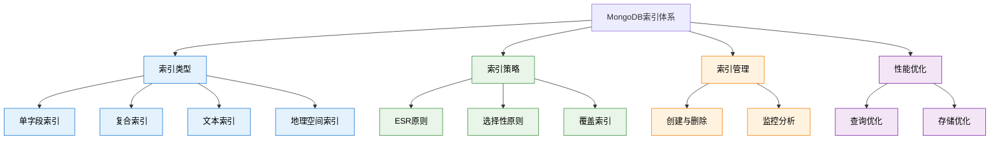

# 5. MongoDB基础-索引机制

## 概述

索引是MongoDB性能优化的核心机制，它通过创建数据结构来快速定位文档，显著提升查询效率。合理的索引设计可以将查询时间从秒级降低到毫秒级，但不当的索引策略也可能导致存储空间浪费和写入性能下降。

在企业级应用中，索引策略直接影响系统的响应时间和吞吐量。从电商平台的商品搜索到金融系统的交易查询，不同的业务场景需要不同的索引设计方案。



## 知识要点

### 1. 索引类型详解

#### 1.1 单字段索引

单字段索引是最简单也是最常用的索引类型：

```java
// 电商用户管理系统示例
{
  "_id": ObjectId("user_65a1b2c3d4e5f678"),
  "username": "john_doe",
  "email": "john.doe@example.com",
  "status": "active",
  "registeredAt": ISODate("2024-01-01T00:00:00Z"),
  "profile": {
    "age": 28,
    "city": "Beijing"
  }
}

// MongoDB Shell - 创建单字段索引
// 升序索引
db.users.createIndex({"email": 1})

// 降序索引
db.users.createIndex({"registeredAt": -1})

// 嵌套字段索引
db.users.createIndex({"profile.age": 1})

// 唯一索引
db.users.createIndex({"username": 1}, {unique: true})

// Java Spring Data MongoDB实现
@Document(collection = "users")
public class User {
    
    @Indexed(unique = true)
    private String username;
    
    @Indexed
    private String email;
    
    @Indexed(sparse = true)
    private String phone;
    
    @Indexed(expireAfterSeconds = 3600)  // TTL索引
    private Date tempToken;
}

// 索引管理服务
@Service
public class UserIndexService {
    
    @PostConstruct
    public void createOptimizedIndexes() {
        IndexOperations indexOps = mongoTemplate.indexOps(User.class);
        
        // 邮箱查询索引
        indexOps.ensureIndex(new Index().on("email", Sort.Direction.ASC));
        
        // 状态和注册时间复合索引
        indexOps.ensureIndex(new Index()
            .on("status", Sort.Direction.ASC)
            .on("registeredAt", Sort.Direction.DESC));
    }
}
```

#### 1.2 复合索引

复合索引支持多个字段的组合查询，字段顺序对性能影响巨大：

```java
// 电商订单系统示例
{
  "_id": ObjectId("order_65a1b2c3d4e5f678"),
  "customerId": ObjectId("customer_65a1b2c3d4e5f679"),
  "status": "completed",
  "totalAmount": NumberDecimal("1299.00"),
  "createdAt": ISODate("2024-01-15T10:30:00Z")
}

// MongoDB Shell - 复合索引创建
// 客户订单查询索引（高选择性字段在前）
db.orders.createIndex({"customerId": 1, "status": 1, "createdAt": -1})

// 状态和时间范围查询索引
db.orders.createIndex({"status": 1, "createdAt": -1})

// Java实现复合索引管理
@Service
public class OrderIndexService {
    
    public void createOrderIndexes() {
        IndexOperations indexOps = mongoTemplate.indexOps("orders");
        
        // 客户订单历史查询索引
        indexOps.ensureIndex(new Index()
            .on("customerId", Sort.Direction.ASC)      // 高选择性
            .on("status", Sort.Direction.ASC)          // 中等选择性
            .on("createdAt", Sort.Direction.DESC)      // 排序字段
            .named("customer_status_date_idx"));
    }
    
    // 查询示例 - 利用复合索引
    public List<Order> findCustomerOrders(String customerId, String status) {
        Query query = Query.query(
            new Criteria().andOperator(
                Criteria.where("customerId").is(customerId),
                Criteria.where("status").is(status)
            )
        ).with(Sort.by(Sort.Direction.DESC, "createdAt"));
        
        return mongoTemplate.find(query, Order.class);
    }
}
```

#### 1.3 特殊类型索引

```java
// 文本索引示例 - 商品搜索系统
{
  "name": "MacBook Pro 16英寸",
  "description": "专业级笔记本电脑，配备M3芯片",
  "tags": ["laptop", "apple", "professional"]
}

// MongoDB Shell - 文本索引
db.products.createIndex({
  "name": "text",
  "description": "text",
  "tags": "text"
}, {
  weights: {
    "name": 10,
    "description": 5,
    "tags": 1
  }
})

// 地理空间索引
db.stores.createIndex({"location": "2dsphere"})

// Java实现特殊索引
@Service
public class SpecialIndexService {
    
    // 创建文本搜索索引
    public void createTextSearchIndex() {
        IndexOperations indexOps = mongoTemplate.indexOps("products");
        
        TextIndexDefinition textIndex = new TextIndexDefinitionBuilder()
            .onField("name", 10.0f)
            .onField("description", 5.0f)
            .onField("tags", 1.0f)
            .build();
        
        indexOps.ensureIndex(textIndex);
    }
    
    // 文本搜索查询
    public List<Product> searchProducts(String searchTerm) {
        TextCriteria textCriteria = TextCriteria
            .forDefaultLanguage()
            .matching(searchTerm);
        
        Query query = TextQuery.queryText(textCriteria)
            .sortByScore()
            .limit(50);
        
        return mongoTemplate.find(query, Product.class);
    }
}
```

### 2. 索引设计策略

#### 2.1 ESR原则

```java
// ESR原则：Equality, Sort, Range
@Component
public class IndexDesignGuide {
    
    /**
     * ESR原则演示
     * 1. Equality字段（相等查询）放在最前面
     * 2. Sort字段（排序）放在中间
     * 3. Range字段（范围查询）放在最后
     */
    public void demonstrateESRPrinciple() {
        // 查询模式：等值查询status，按时间排序，价格范围查询
        // 正确的索引设计
        IndexOperations indexOps = mongoTemplate.indexOps("orders");
        indexOps.ensureIndex(new Index()
            .on("status", Sort.Direction.ASC)     // E: Equality
            .on("createdAt", Sort.Direction.DESC)  // S: Sort  
            .on("price", Sort.Direction.ASC)       // R: Range
            .named("status_time_price_idx"));
    }
    
    /**
     * 选择性原则：高选择性字段优先
     */
    public void demonstrateSelectivityPrinciple() {
        // 正确的索引顺序
        IndexOperations indexOps = mongoTemplate.indexOps("orders");
        indexOps.ensureIndex(new Index()
            .on("userId", Sort.Direction.ASC)      // 高选择性
            .on("category", Sort.Direction.ASC)    // 中等选择性
            .on("status", Sort.Direction.ASC)      // 低选择性
            .named("user_category_status_idx"));
    }
}
```

### 3. 索引管理与维护

#### 3.1 索引监控

```java
// 索引性能监控服务
@Service
public class IndexMonitoringService {
    
    // 获取索引使用统计
    public List<IndexStats> getIndexUsageStats(String collectionName) {
        List<IndexStats> stats = new ArrayList<>();
        
        ListIndexesIterable<Document> indexes = mongoTemplate
            .getCollection(collectionName)
            .listIndexes();
        
        for (Document indexDoc : indexes) {
            IndexStats stat = IndexStats.builder()
                .name(indexDoc.getString("name"))
                .keys(indexDoc.get("key", Document.class))
                .build();
            stats.add(stat);
        }
        
        return stats;
    }
    
    // 慢查询分析
    public void analyzeSlowQueries() {
        // 启用慢查询分析
        mongoTemplate.getDb().runCommand(
            new Document("profile", 2)
                .append("slowms", 100)
        );
        
        // 查询慢操作日志
        Query query = Query.query(
            Criteria.where("ts").gte(Date.from(Instant.now().minus(1, ChronoUnit.HOURS)))
                .and("millis").gt(100)
        );
        
        List<Document> slowQueries = mongoTemplate.find(
            query, Document.class, "system.profile"
        );
        
        for (Document slowQuery : slowQueries) {
            log.warn("Slow query detected: {}", slowQuery.toJson());
        }
    }
}
```

#### 3.2 索引维护

```java
// 索引维护服务
@Service
public class IndexMaintenanceService {
    
    // 定期索引维护
    @Scheduled(cron = "0 2 * * SUN")
    public void performWeeklyMaintenance() {
        try {
            analyzeIndexUsage();
            cleanupUnusedIndexes();
            updateIndexStatistics();
        } catch (Exception e) {
            log.error("Index maintenance failed", e);
        }
    }
    
    private void cleanupUnusedIndexes() {
        List<String> safeToDropIndexes = identifySafeToDropIndexes();
        
        for (String indexName : safeToDropIndexes) {
            try {
                mongoTemplate.indexOps("orders").dropIndex(indexName);
                log.info("Dropped unused index: {}", indexName);
            } catch (Exception e) {
                log.error("Failed to drop index: {}", indexName, e);
            }
        }
    }
}
```

## 知识扩展

### 1. 索引性能优化

```java
// 索引优化策略
@Component
public class IndexOptimization {
    
    // 部分索引优化
    public void createPartialIndexes() {
        IndexOperations indexOps = mongoTemplate.indexOps("users");
        
        // 只为活跃用户创建索引
        indexOps.ensureIndex(new Index()
            .on("lastLoginAt", Sort.Direction.DESC)
            .partial(PartialIndexFilter.of(
                Criteria.where("status").is("active")
            ))
            .named("active_users_idx"));
    }
    
    // TTL索引管理临时数据
    public void createTTLIndexes() {
        IndexOperations indexOps = mongoTemplate.indexOps("sessions");
        
        // 30分钟后自动删除
        indexOps.ensureIndex(new Index()
            .on("createdAt", Sort.Direction.ASC)
            .expire(Duration.ofMinutes(30))
            .named("session_ttl_idx"));
    }
}
```

### 2. 索引最佳实践

1. **查询模式驱动**：根据实际查询模式设计索引
2. **ESR原则**：Equality, Sort, Range的字段顺序
3. **选择性优先**：高选择性字段放在索引前面
4. **覆盖索引**：索引包含查询所需的所有字段
5. **定期维护**：监控和清理未使用的索引

## 深度思考

### 1. 索引设计权衡

索引设计需要权衡：
- **查询性能 vs 写入性能**
- **存储空间 vs 查询速度**
- **维护成本 vs 性能收益**

### 2. 索引失效场景

了解索引失效的情况：
- 查询条件包含函数运算
- 使用不等于操作符（$ne）
- 范围查询跨越多个字段
- 数据类型不匹配

### 3. 分片环境的索引

在分片集群中：
- 分片键必须是索引的前缀
- 考虑数据分布的均匀性
- 避免热点分片问题

通过深入理解MongoDB的索引机制，开发者能够设计出高效的数据访问模式，显著提升应用性能和用户体验。