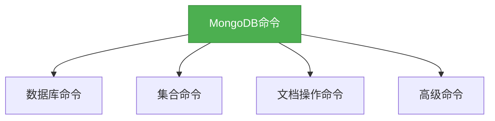

# 5. Mongo数据库命令参考

## 概述

MongoDB提供了丰富的命令集来操作数据库、集合和文档。本章节将详细介绍MongoDB的常用命令，包括数据库命令、集合命令、文档操作命令以及高级命令，帮助开发者快速掌握MongoDB的使用技巧。



## 知识要点

### 1. 数据库命令

#### 1.1 基本数据库命令

```javascript
# 查看所有数据库
show dbs

# 切换到指定数据库，如果不存在则创建
use databaseName

# 查看当前使用的数据库
db

# 删除当前数据库
db.dropDatabase()

# 查看数据库统计信息
db.stats()
```

#### 1.2 用户管理命令

```javascript
# 创建用户
use admin
 db.createUser({
   user: "username",
   pwd: "password",
   roles: [{
     role: "roleName",
     db: "databaseName"
   }]
 })

# 查看用户
show users

# 修改用户
 db.updateUser(
   "username",
   {
     pwd: "newPassword",
     roles: [{
       role: "newRole",
       db: "databaseName"
     }]
   }
 )

# 删除用户
 db.dropUser("username")
```

### 2. 集合命令

```javascript
# 查看当前数据库中的所有集合
show collections

# 创建集合
 db.createCollection("collectionName")

# 删除集合
 db.collectionName.drop()

# 查看集合统计信息
 db.collectionName.stats()

# 重命名集合
 db.collectionName.renameCollection("newCollectionName")
```

### 3. 文档操作命令

#### 3.1 插入文档

```javascript
# 插入单个文档
 db.collectionName.insertOne({
   name: "张三",
   age: 30,
   address: {
     city: "北京",
     street: "朝阳区"
   },
   hobbies: ["读书", "旅行"]
 })

# 插入多个文档
 db.collectionName.insertMany([
   {
     name: "张三",
     age: 30
   },
   {
     name: "李四",
     age: 25
   }
 ])
```

#### 3.2 查询文档

```javascript
# 查询所有文档
 db.collectionName.find()

# 查询单个文档
 db.collectionName.findOne()

# 条件查询
 db.collectionName.find({
   age: {
     $gt: 25
   }
 })

# 投影查询（只返回指定字段）
 db.collectionName.find({
   age: {
     $gt: 25
   }
 }, {
   name: 1,
   age: 1
 })

# 排序
 db.collectionName.find().sort({
   age: 1
 })

# 分页
 db.collectionName.find().skip(10).limit(5)
```

#### 3.3 更新文档

```javascript
# 更新单个文档
 db.collectionName.updateOne({
   name: "张三"
 }, {
   $set: {
     age: 31
   }
 })

# 更新多个文档
 db.collectionName.updateMany({
   age: {
     $lt: 30
   }
 }, {
   $inc: {
     age: 1
   }
 })

# 替换文档
 db.collectionName.replaceOne({
   name: "张三"
 }, {
   name: "张三",
   age: 31,
   address: "北京市朝阳区"
 })
```

#### 3.4 删除文档

```javascript
# 删除单个文档
 db.collectionName.deleteOne({
   name: "张三"
 })

# 删除多个文档
 db.collectionName.deleteMany({
   age: {
     $gt: 40
   }
 })
```

### 4. 高级命令

#### 4.1 聚合命令

```javascript
# 聚合管道
 db.collectionName.aggregate([
   {
     $match: {
       age: {
         $gt: 25
       }
     }
   },
   {
     $group: {
       _id: "$address.city",
       count: {
         $sum: 1
       }
     }
   },
   {
     $sort: {
       count: -1
     }
   }
 ])

# MapReduce
 db.collectionName.mapReduce(
   function() {
     emit(this.address.city, 1);
   },
   function(key, values) {
     return Array.sum(values);
   },
   {
     out: "resultCollection"
   }
 )

# 单目聚合函数
 db.collectionName.count()
 db.collectionName.distinct("age")
```

#### 4.2 索引命令

```javascript
# 创建索引
 db.collectionName.createIndex({
   name: 1
 })

# 创建复合索引
 db.collectionName.createIndex({
   name: 1,
   age: -1
 })

# 查看索引
 db.collectionName.getIndexes()

# 删除索引
 db.collectionName.dropIndex("indexName")
 db.collectionName.dropIndexes()  # 删除所有索引（除了_id索引）
```

#### 4.3 事务命令

```javascript
# 开始事务
const session = db.getMongo().startSession();
session.startTransaction();

try {
  # 执行操作
  session.getDatabase("test").collection("users").insertOne({
    name: "张三",
    age: 30
  });
  
  # 提交事务
  session.commitTransaction();
} catch (error) {
  # 回滚事务
  session.abortTransaction();
} finally {
  # 关闭会话
  session.endSession();
}
```

## 知识扩展

### 1. 设计思想

MongoDB的命令设计遵循了以下原则：

1. **简洁明了**：命令名称通常是描述性的英文单词或缩写，易于记忆和使用。
2. **一致性**：相同类型的命令具有相似的格式和行为。
3. **高效性**：命令被设计为尽可能高效地执行，减少网络传输和内存使用。
4. **灵活性**：许多命令支持多种参数组合，以适应不同的使用场景。

### 2. 避坑指南

1. **查询性能**：避免全表扫描，使用索引来提高查询性能。
2. **数据一致性**：MongoDB默认是最终一致性的，对于需要强一致性的场景，可以使用事务或读写关注级别。
3. **内存管理**：监控MongoDB的内存使用情况，避免内存溢出。
4. **批量操作**：对于大量数据的操作，使用批量命令（如insertMany、updateMany等），减少网络开销。
5. **命令安全**：避免在生产环境中使用某些危险命令（如dropDatabase、dropCollection等），除非你确信它们的执行是安全的。

### 3. 深度思考题

1. 什么是MongoDB的读写关注级别？

   回答：MongoDB的读写关注级别控制了读写操作的一致性和可用性。读关注级别决定了从哪个节点读取数据，写关注级别决定了写操作需要确认的节点数量。

2. 如何优化MongoDB的查询性能？

   回答：优化MongoDB的查询性能可以从以下几个方面入手：
   - 使用索引来加速查询
   - 避免全表扫描
   - 合理设计数据模型
   - 使用投影查询来减少返回的数据量
   - 分页查询时使用合适的策略

3. 什么是MongoDB的聚合管道？它有什么优势？

   回答：MongoDB的聚合管道是一种数据处理框架，它允许我们通过一系列的阶段来处理数据。每个阶段接收输入，处理数据，并将结果传递给下一个阶段。聚合管道的优势包括：
   - 灵活性：可以组合多个阶段来构建复杂的查询
   - 高效性：数据在管道中流动，减少了中间结果的存储
   - 可扩展性：可以处理大量的数据

4. 如何安全地执行MongoDB的危险命令？

   回答：安全地执行MongoDB的危险命令可以从以下几个方面入手：
   - 限制命令的执行权限
   - 在执行命令前进行备份
   - 在测试环境中验证命令的效果
   - 避免在高峰时段执行危险命令
   - 使用事务来确保操作的原子性