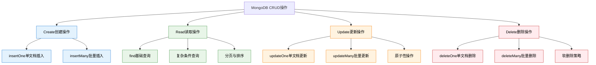

# 6. MongoDB核心-CRUD操作详解

## 概述

CRUD操作（Create、Read、Update、Delete）是数据库应用的核心功能，MongoDB提供了丰富而灵活的API来支持这些操作。与传统关系型数据库不同，MongoDB的CRUD操作直接面向文档和数组，支持原子性更新、批量操作和复杂的查询条件。

在实际业务中，CRUD操作的设计直接影响应用的性能和可维护性。从电商平台的商品管理到用户行为跟踪，不同的业务场景对CRUD操作有着不同的性能要求和一致性需求。



## 知识要点

### 1. Create 创建操作

#### 1.1 单文档插入 (insertOne)

单文档插入适用于实时数据录入场景：

```java
// 电商用户注册示例
{
  "username": "john_doe_2024",
  "email": "john.doe@example.com",
  "profile": {
    "firstName": "John",
    "lastName": "Doe",
    "dateOfBirth": ISODate("1995-03-15T00:00:00Z")
  },
  "preferences": {
    "language": "zh-CN",
    "currency": "CNY"
  },
  "metadata": {
    "registrationSource": "web",
    "createdAt": ISODate("2024-01-15T10:30:00Z"),
    "version": 1
  },
  "status": "active"
}

// MongoDB Shell操作
db.users.insertOne({
  "username": "john_doe_2024",
  "email": "john.doe@example.com",
  "createdAt": new Date()
})

// Java Spring Data MongoDB实现
@Service
public class UserRegistrationService {
    
    @Autowired
    private MongoTemplate mongoTemplate;
    
    public User registerUser(UserRegistrationRequest request) {
        // 验证用户名唯一性
        Query usernameQuery = Query.query(Criteria.where("username").is(request.getUsername()));
        if (mongoTemplate.exists(usernameQuery, User.class)) {
            throw new DuplicateUserException("Username already exists");
        }
        
        // 构建用户文档
        User user = User.builder()
            .username(request.getUsername())
            .email(request.getEmail())
            .profile(UserProfile.builder()
                .firstName(request.getFirstName())
                .lastName(request.getLastName())
                .build())
            .metadata(UserMetadata.builder()
                .registrationSource("web")
                .createdAt(Instant.now())
                .version(1)
                .build())
            .status("active")
            .build();
        
        // 插入用户文档
        return mongoTemplate.insert(user);
    }
}
```

#### 1.2 批量插入 (insertMany)

批量插入适用于数据导入、批处理场景：

```java
// 商品批量导入示例
// MongoDB Shell批量插入
db.products.insertMany([
  {
    "productCode": "PROD-001",
    "name": "iPhone 15 Pro",
    "price": NumberDecimal("7999.00")
  },
  {
    "productCode": "PROD-002", 
    "name": "MacBook Pro",
    "price": NumberDecimal("18999.00")
  }
])

// Java实现高效批量插入
@Service
public class ProductBulkImportService {
    
    public ImportResult importProductsBatch(List<ProductImportDTO> productDTOs) {
        int batchSize = 1000;
        int totalProcessed = 0;
        
        // 分批处理
        for (int i = 0; i < productDTOs.size(); i += batchSize) {
            List<ProductImportDTO> batch = productDTOs.subList(
                i, Math.min(i + batchSize, productDTOs.size())
            );
            
            List<Product> validProducts = new ArrayList<>();
            
            // 数据验证和转换
            for (ProductImportDTO dto : batch) {
                try {
                    Product product = validateAndConvertProduct(dto);
                    validProducts.add(product);
                } catch (ValidationException e) {
                    log.error("Product validation failed: {}", e.getMessage());
                }
            }
            
            // 批量插入
            if (!validProducts.isEmpty()) {
                BulkOperations bulkOps = mongoTemplate.bulkOps(
                    BulkOperations.BulkMode.ORDERED, Product.class);
                validProducts.forEach(bulkOps::insert);
                BulkWriteResult result = bulkOps.execute();
                totalProcessed += result.getInsertedCount();
            }
        }
        
        return ImportResult.builder()
            .totalProcessed(totalProcessed)
            .build();
    }
    
    private Product validateAndConvertProduct(ProductImportDTO dto) {
        if (StringUtils.isBlank(dto.getProductCode())) {
            throw new ValidationException("Product code is required");
        }
        
        return Product.builder()
            .productCode(dto.getProductCode())
            .name(dto.getName())
            .price(dto.getPrice())
            .createdAt(Instant.now())
            .build();
    }
}
```

### 2. Read 读取操作

#### 2.1 复杂查询条件

MongoDB支持丰富的查询条件：

```java
// 电商订单查询系统
@Service
public class OrderQueryService {
    
    // 客户订单历史查询
    public PagedResult<OrderSummary> findCustomerOrders(CustomerOrderQuery query) {
        List<Criteria> criteriaList = new ArrayList<>();
        
        // 基础条件
        criteriaList.add(Criteria.where("customerId").is(query.getCustomerId()));
        
        // 状态过滤
        if (!query.getStatusList().isEmpty()) {
            criteriaList.add(Criteria.where("status").in(query.getStatusList()));
        }
        
        // 时间范围过滤
        if (query.getStartDate() != null && query.getEndDate() != null) {
            criteriaList.add(Criteria.where("createdAt")
                .gte(query.getStartDate())
                .lt(query.getEndDate()));
        }
        
        // 金额范围过滤
        if (query.getMinAmount() != null) {
            criteriaList.add(Criteria.where("totalAmount").gte(
                new Decimal128(query.getMinAmount())));
        }
        
        // 组合条件
        Criteria finalCriteria = new Criteria().andOperator(
            criteriaList.toArray(new Criteria[0])
        );
        
        Query mongoQuery = Query.query(finalCriteria);
        
        // 投影 - 只返回需要的字段
        mongoQuery.fields()
            .include("orderNumber")
            .include("status")
            .include("totalAmount")
            .include("createdAt")
            .exclude("_id");
        
        // 分页和排序
        long totalCount = mongoTemplate.count(mongoQuery, Order.class);
        mongoQuery.with(PageRequest.of(query.getPage(), query.getSize()));
        mongoQuery.with(Sort.by(Sort.Direction.DESC, "createdAt"));
        
        List<OrderSummary> orders = mongoTemplate.find(mongoQuery, OrderSummary.class, "orders");
        
        return PagedResult.<OrderSummary>builder()
            .content(orders)
            .totalElements(totalCount)
            .build();
    }
}
```

### 3. Update 更新操作

#### 3.1 原子性更新操作

MongoDB的更新操作支持原子性：

```java
// 电商库存管理系统
@Service
public class InventoryManagementService {
    
    // 原子性库存扣减 - 防止超卖
    public InventoryUpdateResult decreaseStock(String productId, int quantity) {
        // 查询条件：确保有足够库存
        Query query = Query.query(
            new Criteria().andOperator(
                Criteria.where("productId").is(productId),
                Criteria.where("availableStock").gte(quantity),
                Criteria.where("status").is("active")
            )
        );
        
        // 原子性更新操作
        Update update = new Update()
            .inc("availableStock", -quantity)     // 减少可用库存
            .inc("reservedStock", quantity)       // 增加预留库存
            .inc("version", 1)                    // 乐观锁版本号
            .currentDate("updatedAt");            // 更新时间戳
        
        UpdateResult result = mongoTemplate.updateFirst(query, update, "inventory");
        
        if (result.getMatchedCount() == 0) {
            return InventoryUpdateResult.builder()
                .success(false)
                .errorMessage("Insufficient stock or product not found")
                .build();
        }
        
        return InventoryUpdateResult.builder()
            .success(true)
            .updatedQuantity(quantity)
            .build();
    }
    
    // 用户信息更新 - 部分字段更新
    public void updateUserProfile(String userId, UserProfileUpdateRequest request) {
        Query query = Query.query(Criteria.where("_id").is(userId));
        Update update = new Update();
        
        // 只更新非空字段
        if (StringUtils.hasText(request.getFirstName())) {
            update.set("profile.firstName", request.getFirstName());
        }
        
        if (StringUtils.hasText(request.getLastName())) {
            update.set("profile.lastName", request.getLastName());
        }
        
        // 数组操作 - 添加标签
        if (request.getTagsToAdd() != null && !request.getTagsToAdd().isEmpty()) {
            update.addToSet("tags").each(request.getTagsToAdd().toArray());
        }
        
        // 数组操作 - 移除标签
        if (request.getTagsToRemove() != null && !request.getTagsToRemove().isEmpty()) {
            update.pullAll("tags", request.getTagsToRemove().toArray());
        }
        
        update.set("updatedAt", Instant.now());
        update.inc("version", 1);
        
        UpdateResult result = mongoTemplate.updateFirst(query, update, User.class);
        
        if (result.getMatchedCount() == 0) {
            throw new UserNotFoundException("User not found: " + userId);
        }
    }
}
```

### 4. Delete 删除操作

#### 4.1 软删除策略

生产环境通常采用软删除策略：

```java
// 软删除管理服务
@Service
public class SoftDeleteService {
    
    // 软删除用户
    public void softDeleteUser(String userId, String deletionReason) {
        Query query = Query.query(Criteria.where("_id").is(userId));
        
        Update update = new Update()
            .set("status", "deleted")
            .set("deletedAt", Instant.now())
            .set("deletionReason", deletionReason)
            .set("deletedBy", getCurrentUserId())
            .inc("version", 1);
        
        UpdateResult result = mongoTemplate.updateFirst(query, update, User.class);
        
        if (result.getMatchedCount() == 0) {
            throw new UserNotFoundException("User not found: " + userId);
        }
        
        // 记录删除日志
        auditService.logUserDeletion(userId, deletionReason);
    }
    
    // 恢复软删除的用户
    public void restoreUser(String userId) {
        Query query = Query.query(
            new Criteria().andOperator(
                Criteria.where("_id").is(userId),
                Criteria.where("status").is("deleted")
            )
        );
        
        Update update = new Update()
            .set("status", "active")
            .unset("deletedAt")
            .unset("deletionReason")
            .unset("deletedBy")
            .inc("version", 1);
        
        UpdateResult result = mongoTemplate.updateFirst(query, update, User.class);
        
        if (result.getMatchedCount() == 0) {
            throw new UserNotFoundException("Deleted user not found: " + userId);
        }
    }
    
    // 批量删除
    public void batchDeleteProducts(List<String> productIds) {
        Query query = Query.query(Criteria.where("_id").in(productIds));
        
        Update update = new Update()
            .set("status", "deleted")
            .set("deletedAt", Instant.now());
        
        UpdateResult result = mongoTemplate.updateMulti(query, update, Product.class);
        
        log.info("Soft deleted {} products", result.getModifiedCount());
    }
}
```

## 知识扩展

### 1. 性能优化策略

```java
// CRUD性能优化服务
@Service
public class CRUDPerformanceService {
    
    // 批量操作优化
    public void optimizedBulkOperations(List<Order> orders) {
        BulkOperations bulkOps = mongoTemplate.bulkOps(
            BulkOperations.BulkMode.UNORDERED, "orders");
        
        // 混合操作：插入、更新、删除
        orders.forEach(order -> {
            if (order.isNew()) {
                bulkOps.insert(order);
            } else if (order.isModified()) {
                Query query = Query.query(Criteria.where("_id").is(order.getId()));
                Update update = createUpdateFromOrder(order);
                bulkOps.updateOne(query, update);
            }
        });
        
        BulkWriteResult result = bulkOps.execute();
        log.info("Bulk operation completed: {} operations", result.getMatchedCount());
    }
    
    // 读取优化：使用投影和限制
    public List<ProductSummary> findProductsOptimized(String category) {
        Query query = Query.query(Criteria.where("category").is(category));
        
        // 投影：只返回需要的字段
        query.fields()
            .include("name")
            .include("price")
            .include("rating")
            .exclude("_id");
        
        // 限制返回数量
        query.limit(100);
        
        return mongoTemplate.find(query, ProductSummary.class);
    }
}
```

### 2. 事务处理

```java
// 事务管理服务
@Service
public class TransactionalCRUDService {
    
    @Transactional
    public void transferFunds(String fromAccount, String toAccount, BigDecimal amount) {
        // 检查源账户余额
        Query fromQuery = Query.query(Criteria.where("accountId").is(fromAccount));
        Account fromAcc = mongoTemplate.findOne(fromQuery, Account.class);
        
        if (fromAcc.getBalance().compareTo(amount) < 0) {
            throw new InsufficientFundsException("Insufficient balance");
        }
        
        // 原子性更新两个账户
        Update debitUpdate = new Update().inc("balance", amount.negate());
        mongoTemplate.updateFirst(fromQuery, debitUpdate, Account.class);
        
        Query toQuery = Query.query(Criteria.where("accountId").is(toAccount));
        Update creditUpdate = new Update().inc("balance", amount);
        mongoTemplate.updateFirst(toQuery, creditUpdate, Account.class);
        
        // 记录交易
        Transaction transaction = Transaction.builder()
            .fromAccount(fromAccount)
            .toAccount(toAccount)
            .amount(amount)
            .timestamp(Instant.now())
            .build();
        
        mongoTemplate.insert(transaction);
    }
}
```

## 深度思考

### 1. CRUD设计原则

1. **原子性优先**：关键业务操作使用原子性更新
2. **批量优化**：大量数据操作使用批量API
3. **索引配合**：查询条件与索引设计配合
4. **投影使用**：只返回必要的字段
5. **软删除策略**：重要数据采用软删除

### 2. 常见性能陷阱

1. **N+1查询问题**：避免循环查询
2. **全表扫描**：确保查询使用索引
3. **过度更新**：只更新变化的字段
4. **缺少分页**：大结果集必须分页

### 3. 数据一致性考虑

1. **乐观锁**：使用版本号防止并发冲突
2. **事务边界**：合理定义事务范围
3. **幂等操作**：确保重复操作的安全性
4. **审计日志**：记录重要操作的历史

通过掌握MongoDB CRUD操作的核心概念和最佳实践，开发者能够构建高效、可靠的数据访问层，为应用提供坚实的数据支撑。