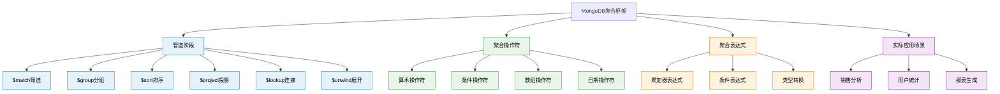

# 7. MongoDB核心-聚合框架

## 概述

MongoDB聚合框架是一个强大的数据处理管道，允许开发者对文档集合执行复杂的数据变换、分组、计算和分析操作。与传统SQL的GROUP BY相比，MongoDB聚合框架提供了更灵活的数据处理能力，支持多阶段管道操作、数组处理、条件逻辑和数学运算。

在现代数据驱动的应用中，聚合框架是实现实时分析、报表生成、数据挖掘的核心工具。从电商平台的销售统计到用户行为分析，从财务报表到业务指标监控，聚合框架为复杂的数据分析需求提供了高效的解决方案。



## 知识要点

### 1. 聚合管道基础

#### 1.1 管道阶段详解

聚合管道由多个阶段组成，每个阶段处理文档并将结果传递给下一阶段：

```java
// 电商订单分析示例数据
{
  "_id": ObjectId("order_65a1b2c3d4e5f678"),
  "orderNumber": "ORD-2024-0115-001",
  "customerId": ObjectId("customer_65a1b2c3d4e5f679"),
  "customerInfo": {
    "name": "张三",
    "email": "zhangsan@example.com",
    "city": "Beijing",
    "vipLevel": "Gold"
  },
  "status": "completed",
  "totalAmount": NumberDecimal("1299.00"),
  "createdAt": ISODate("2024-01-15T10:30:00Z"),
  "items": [
    {
      "productId": "PROD-001",
      "productName": "iPhone 15 Pro",
      "category": "Electronics",
      "quantity": 1,
      "unitPrice": NumberDecimal("7999.00"),
      "totalPrice": NumberDecimal("7999.00")
    },
    {
      "productId": "PROD-002",
      "productName": "保护壳",
      "category": "Accessories",
      "quantity": 2,
      "unitPrice": NumberDecimal("99.00"),
      "totalPrice": NumberDecimal("198.00")
    }
  ],
  "shipping": {
    "method": "express",
    "cost": NumberDecimal("15.00"),
    "address": {
      "city": "Beijing",
      "district": "Chaoyang"
    }
  }
}

// MongoDB Shell - 基础聚合管道
// 统计各城市的订单数量和总金额
db.orders.aggregate([
  // 第1阶段：筛选已完成的订单
  {
    $match: {
      "status": "completed",
      "createdAt": {
        $gte: ISODate("2024-01-01T00:00:00Z"),
        $lt: ISODate("2024-02-01T00:00:00Z")
      }
    }
  },
  // 第2阶段：按城市分组统计
  {
    $group: {
      "_id": "$customerInfo.city",
      "totalOrders": { $sum: 1 },
      "totalRevenue": { $sum: "$totalAmount" },
      "avgOrderValue": { $avg: "$totalAmount" },
      "maxOrderValue": { $max: "$totalAmount" },
      "minOrderValue": { $min: "$totalAmount" }
    }
  },
  // 第3阶段：按总收入降序排列
  {
    $sort: { "totalRevenue": -1 }
  },
  // 第4阶段：投影结果格式化
  {
    $project: {
      "city": "$_id",
      "totalOrders": 1,
      "totalRevenue": { $round: ["$totalRevenue", 2] },
      "avgOrderValue": { $round: ["$avgOrderValue", 2] },
      "maxOrderValue": 1,
      "minOrderValue": 1,
      "_id": 0
    }
  }
])

// Java Spring Data MongoDB实现
@Service
public class OrderAnalyticsService {
    
    @Autowired
    private MongoTemplate mongoTemplate;
    
    // 城市销售统计分析
    public List<CitySalesStats> getCitySalesStatistics(Date startDate, Date endDate) {
        // 构建聚合管道
        MatchOperation matchStage = Aggregation.match(
            Criteria.where("status").is("completed")
                .and("createdAt").gte(startDate).lt(endDate)
        );
        
        GroupOperation groupStage = Aggregation.group("customerInfo.city")
            .count().as("totalOrders")
            .sum("totalAmount").as("totalRevenue")
            .avg("totalAmount").as("avgOrderValue")
            .max("totalAmount").as("maxOrderValue")
            .min("totalAmount").as("minOrderValue");
        
        SortOperation sortStage = Aggregation.sort(
            Sort.by(Sort.Direction.DESC, "totalRevenue")
        );
        
        ProjectionOperation projectStage = Aggregation.project()
            .and("_id").as("city")
            .and("totalOrders").as("totalOrders")
            .and("totalRevenue").as("totalRevenue")
            .and("avgOrderValue").as("avgOrderValue")
            .and("maxOrderValue").as("maxOrderValue")
            .and("minOrderValue").as("minOrderValue")
            .andExclude("_id");
        
        Aggregation aggregation = Aggregation.newAggregation(
            matchStage, groupStage, sortStage, projectStage
        );
        
        AggregationResults<CitySalesStats> results = mongoTemplate.aggregate(
            aggregation, "orders", CitySalesStats.class
        );
        
        return results.getMappedResults();
    }
}
```

#### 1.2 $lookup 集合关联

$lookup操作类似于SQL的LEFT JOIN，用于关联不同集合的数据：

```java
// 订单与客户信息关联查询
// MongoDB Shell - $lookup示例
db.orders.aggregate([
  {
    $lookup: {
      from: "customers",           // 要关联的集合
      localField: "customerId",    // 本地字段
      foreignField: "_id",         // 外部字段
      as: "customerDetails"        // 结果字段名
    }
  },
  {
    $unwind: "$customerDetails"    // 展开数组结果
  },
  {
    $match: {
      "customerDetails.vipLevel": "Platinum"
    }
  },
  {
    $project: {
      "orderNumber": 1,
      "totalAmount": 1,
      "customerName": "$customerDetails.name",
      "customerEmail": "$customerDetails.email",
      "vipLevel": "$customerDetails.vipLevel"
    }
  }
])

// Java实现复杂关联查询
@Service
public class OrderCustomerAnalyticsService {
    
    // 查询VIP客户的订单详情
    public List<VipOrderDetails> getVipCustomerOrders(String vipLevel, Date startDate) {
        // 关联客户信息
        LookupOperation lookupCustomers = LookupOperation.newLookup()
            .from("customers")
            .localField("customerId")
            .foreignField("_id")
            .as("customerDetails");
        
        // 展开客户详情
        UnwindOperation unwindCustomers = Aggregation.unwind("customerDetails");
        
        // 筛选VIP客户
        MatchOperation matchVipCustomers = Aggregation.match(
            Criteria.where("customerDetails.vipLevel").is(vipLevel)
                .and("createdAt").gte(startDate)
        );
        
        // 关联产品信息
        LookupOperation lookupProducts = LookupOperation.newLookup()
            .from("products")
            .localField("items.productId")
            .foreignField("_id")
            .as("productDetails");
        
        // 投影结果
        ProjectionOperation projectStage = Aggregation.project()
            .and("orderNumber").as("orderNumber")
            .and("totalAmount").as("totalAmount")
            .and("createdAt").as("orderDate")
            .and("customerDetails.name").as("customerName")
            .and("customerDetails.email").as("customerEmail")
            .and("customerDetails.vipLevel").as("vipLevel")
            .and("items").as("orderItems")
            .and("productDetails").as("productInfo");
        
        Aggregation aggregation = Aggregation.newAggregation(
            lookupCustomers,
            unwindCustomers,
            matchVipCustomers,
            lookupProducts,
            projectStage
        );
        
        return mongoTemplate.aggregate(
            aggregation, "orders", VipOrderDetails.class
        ).getMappedResults();
    }
}
```

### 2. 数组处理与展开

#### 2.1 $unwind 数组展开

$unwind操作将文档中的数组字段展开为多个文档：

```java
// 商品销售分析 - 展开订单商品
// MongoDB Shell - $unwind示例
db.orders.aggregate([
  // 展开订单商品数组
  {
    $unwind: "$items"
  },
  // 按商品分组统计
  {
    $group: {
      "_id": "$items.productId",
      "productName": { $first: "$items.productName" },
      "category": { $first: "$items.category" },
      "totalQuantitySold": { $sum: "$items.quantity" },
      "totalRevenue": { $sum: "$items.totalPrice" },
      "orderCount": { $sum: 1 },
      "avgQuantityPerOrder": { $avg: "$items.quantity" }
    }
  },
  // 按销售量排序
  {
    $sort: { "totalQuantitySold": -1 }
  },
  // 限制前20名
  {
    $limit: 20
  }
])

// Java实现商品销售排行分析
@Service
public class ProductSalesAnalyticsService {
    
    // 商品销售排行榜
    public List<ProductSalesRanking> getProductSalesRanking(
            Date startDate, Date endDate, int topN) {
        
        // 筛选时间范围内的已完成订单
        MatchOperation matchCompletedOrders = Aggregation.match(
            Criteria.where("status").is("completed")
                .and("createdAt").gte(startDate).lt(endDate)
        );
        
        // 展开订单商品
        UnwindOperation unwindItems = Aggregation.unwind("items");
        
        // 按商品分组统计
        GroupOperation groupByProduct = Aggregation.group("items.productId")
            .first("items.productName").as("productName")
            .first("items.category").as("category")
            .sum("items.quantity").as("totalQuantitySold")
            .sum("items.totalPrice").as("totalRevenue")
            .count().as("orderCount")
            .avg("items.quantity").as("avgQuantityPerOrder");
        
        // 计算平均单价
        AddFieldsOperation addAvgPrice = Aggregation.addFields()
            .addField("avgUnitPrice")
            .withValue(ArithmeticOperators.Divide.valueOf("totalRevenue")
                .divideBy("totalQuantitySold"))
            .build();
        
        // 按销售量排序并限制结果
        SortOperation sortByQuantity = Aggregation.sort(
            Sort.by(Sort.Direction.DESC, "totalQuantitySold")
        );
        LimitOperation limitResults = Aggregation.limit(topN);
        
        // 格式化结果
        ProjectionOperation projectResults = Aggregation.project()
            .and("_id").as("productId")
            .and("productName").as("productName")
            .and("category").as("category")
            .and("totalQuantitySold").as("totalQuantitySold")
            .andExpression("round(totalRevenue, 2)").as("totalRevenue")
            .and("orderCount").as("orderCount")
            .andExpression("round(avgQuantityPerOrder, 2)").as("avgQuantityPerOrder")
            .andExpression("round(avgUnitPrice, 2)").as("avgUnitPrice")
            .andExclude("_id");
        
        Aggregation aggregation = Aggregation.newAggregation(
            matchCompletedOrders,
            unwindItems,
            groupByProduct,
            addAvgPrice,
            sortByQuantity,
            limitResults,
            projectResults
        );
        
        return mongoTemplate.aggregate(
            aggregation, "orders", ProductSalesRanking.class
        ).getMappedResults();
    }
}
```

### 3. 高级聚合操作

#### 3.1 条件聚合与时间分析

使用条件表达式和日期操作符进行复杂的时间维度分析：

```java
// 按月销售趋势分析
// MongoDB Shell - 时间维度聚合
db.orders.aggregate([
  {
    $match: {
      "status": "completed",
      "createdAt": {
        $gte: ISODate("2023-01-01T00:00:00Z"),
        $lt: ISODate("2024-01-01T00:00:00Z")
      }
    }
  },
  {
    $group: {
      "_id": {
        "year": { $year: "$createdAt" },
        "month": { $month: "$createdAt" }
      },
      "totalOrders": { $sum: 1 },
      "totalRevenue": { $sum: "$totalAmount" },
      "avgOrderValue": { $avg: "$totalAmount" },
      // 条件统计
      "highValueOrders": {
        $sum: {
          $cond: [
            { $gte: ["$totalAmount", 1000] },
            1,
            0
          ]
        }
      },
      "mobileOrders": {
        $sum: {
          $cond: [
            { $eq: ["$source", "mobile"] },
            1,
            0
          ]
        }
      }
    }
  },
  {
    $project: {
      "period": {
        $concat: [
          { $toString: "$_id.year" },
          "-",
          {
            $cond: [
              { $lt: ["$_id.month", 10] },
              { $concat: ["0", { $toString: "$_id.month" }] },
              { $toString: "$_id.month" }
            ]
          }
        ]
      },
      "totalOrders": 1,
      "totalRevenue": { $round: ["$totalRevenue", 2] },
      "avgOrderValue": { $round: ["$avgOrderValue", 2] },
      "highValueOrders": 1,
      "highValueOrderRate": {
        $round: [
          { $multiply: [{ $divide: ["$highValueOrders", "$totalOrders"] }, 100] },
          2
        ]
      },
      "mobileOrderRate": {
        $round: [
          { $multiply: [{ $divide: ["$mobileOrders", "$totalOrders"] }, 100] },
          2
        ]
      },
      "_id": 0
    }
  },
  {
    $sort: { "period": 1 }
  }
])

// Java实现销售趋势分析
@Service
public class SalesTrendAnalyticsService {
    
    // 月度销售趋势分析
    public List<MonthlySalesTrend> getMonthlySalesTrend(int year) {
        Date startDate = Date.from(
            LocalDate.of(year, 1, 1).atStartOfDay().atZone(ZoneId.systemDefault()).toInstant()
        );
        Date endDate = Date.from(
            LocalDate.of(year + 1, 1, 1).atStartOfDay().atZone(ZoneId.systemDefault()).toInstant()
        );
        
        // 筛选年度已完成订单
        MatchOperation matchYearOrders = Aggregation.match(
            Criteria.where("status").is("completed")
                .and("createdAt").gte(startDate).lt(endDate)
        );
        
        // 按年月分组
        GroupOperation groupByMonth = Aggregation.group(
            Fields.from(
                Fields.field("year", DateOperators.Year.yearOf("createdAt")),
                Fields.field("month", DateOperators.Month.monthOf("createdAt"))
            )
        )
        .count().as("totalOrders")
        .sum("totalAmount").as("totalRevenue")
        .avg("totalAmount").as("avgOrderValue")
        // 条件统计 - 高价值订单
        .sum(ConditionalOperators.Cond.when(
            ComparisonOperators.Gte.valueOf("totalAmount").greaterThanEqualToValue(1000))
            .then(1).otherwise(0)).as("highValueOrders")
        // 条件统计 - 移动端订单
        .sum(ConditionalOperators.Cond.when(
            ComparisonOperators.Eq.valueOf("source").equalToValue("mobile"))
            .then(1).otherwise(0)).as("mobileOrders");
        
        // 计算比率和格式化
        ProjectionOperation projectResults = Aggregation.project()
            .andExpression("concat(toString(_id.year), '-', " +
                "cond(lt(_id.month, 10), concat('0', toString(_id.month)), toString(_id.month)))")
            .as("period")
            .and("totalOrders").as("totalOrders")
            .andExpression("round(totalRevenue, 2)").as("totalRevenue")
            .andExpression("round(avgOrderValue, 2)").as("avgOrderValue")
            .and("highValueOrders").as("highValueOrders")
            .andExpression("round(multiply(divide(highValueOrders, totalOrders), 100), 2)")
            .as("highValueOrderRate")
            .andExpression("round(multiply(divide(mobileOrders, totalOrders), 100), 2)")
            .as("mobileOrderRate")
            .andExclude("_id");
        
        SortOperation sortByPeriod = Aggregation.sort(Sort.by("period"));
        
        Aggregation aggregation = Aggregation.newAggregation(
            matchYearOrders,
            groupByMonth,
            projectResults,
            sortByPeriod
        );
        
        return mongoTemplate.aggregate(
            aggregation, "orders", MonthlySalesTrend.class
        ).getMappedResults();
    }
}
```

## 知识扩展

### 1. 聚合性能优化

```java
// 聚合性能优化策略
@Service
public class AggregationOptimizationService {
    
    // 使用索引优化聚合查询
    public List<OptimizedSalesReport> getOptimizedSalesReport() {
        // 确保在筛选字段上有合适的索引
        // db.orders.createIndex({"status": 1, "createdAt": 1, "customerInfo.city": 1})
        
        Aggregation aggregation = Aggregation.newAggregation(
            // 1. 尽早使用$match减少数据量
            Aggregation.match(
                Criteria.where("status").is("completed")
                    .and("createdAt").gte(getLastMonthStart())
            ),
            
            // 2. 使用$project减少字段传递
            Aggregation.project()
                .and("customerInfo.city").as("city")
                .and("totalAmount").as("amount")
                .and("createdAt").as("date"),
            
            // 3. 再次筛选（如果需要）
            Aggregation.match(Criteria.where("amount").gt(100)),
            
            // 4. 分组聚合
            Aggregation.group("city")
                .sum("amount").as("totalRevenue")
                .count().as("orderCount"),
            
            // 5. 排序
            Aggregation.sort(Sort.by(Sort.Direction.DESC, "totalRevenue"))
        );
        
        return mongoTemplate.aggregate(
            aggregation, "orders", OptimizedSalesReport.class
        ).getMappedResults();
    }
    
    // 分页聚合查询
    public Page<CityStatsResult> getCityStatsPaginated(Pageable pageable) {
        // 聚合查询
        Aggregation aggregation = Aggregation.newAggregation(
            Aggregation.match(Criteria.where("status").is("completed")),
            Aggregation.group("customerInfo.city")
                .sum("totalAmount").as("totalRevenue")
                .count().as("orderCount"),
            Aggregation.sort(Sort.by(Sort.Direction.DESC, "totalRevenue"))
        );
        
        List<CityStatsResult> allResults = mongoTemplate.aggregate(
            aggregation, "orders", CityStatsResult.class
        ).getMappedResults();
        
        // 手动分页
        int start = (int) pageable.getOffset();
        int end = Math.min(start + pageable.getPageSize(), allResults.size());
        List<CityStatsResult> pageResults = allResults.subList(start, end);
        
        return PageableExecutionUtils.getPage(
            pageResults, pageable, allResults::size
        );
    }
}
```

### 2. 复杂业务场景应用

```java
// 用户行为分析聚合
@Service
public class UserBehaviorAnalyticsService {
    
    // 用户购买路径分析
    public List<UserJourneyAnalysis> analyzeUserJourney() {
        Aggregation aggregation = Aggregation.newAggregation(
            // 按用户分组，计算购买行为
            Aggregation.group("customerId")
                .first("customerInfo.name").as("customerName")
                .sum("totalAmount").as("totalSpent")
                .count().as("totalOrders")
                .avg("totalAmount").as("avgOrderValue")
                .addToSet("items.category").as("categoriesPurchased")
                .min("createdAt").as("firstOrderDate")
                .max("createdAt").as("lastOrderDate"),
            
            // 计算客户生命周期
            Aggregation.addFields()
                .addField("customerLifespanDays")
                .withValue(ArithmeticOperators.Divide.valueOf(
                    ArithmeticOperators.Subtract.valueOf("lastOrderDate")
                        .subtract("firstOrderDate"))
                    .divideBy(24 * 60 * 60 * 1000))
                .build(),
            
            // 客户价值分级
            Aggregation.addFields()
                .addField("customerSegment")
                .withValue(ConditionalOperators.Switch.switchBuilder()
                    .branch(ComparisonOperators.Gte.valueOf("totalSpent").greaterThanEqualToValue(10000))
                    .then("VIP")
                    .branch(ComparisonOperators.Gte.valueOf("totalSpent").greaterThanEqualToValue(5000))
                    .then("Premium")
                    .branch(ComparisonOperators.Gte.valueOf("totalSpent").greaterThanEqualToValue(1000))
                    .then("Standard")
                    .defaultTo("Basic"))
                .build(),
            
            Aggregation.sort(Sort.by(Sort.Direction.DESC, "totalSpent"))
        );
        
        return mongoTemplate.aggregate(
            aggregation, "orders", UserJourneyAnalysis.class
        ).getMappedResults();
    }
}
```

## 深度思考

### 1. 聚合框架 vs MapReduce

MongoDB聚合框架相比MapReduce的优势：
- **性能更优**：原生C++实现，比JavaScript更快
- **易于使用**：声明式语法，学习曲线平缓
- **功能丰富**：内置大量操作符和表达式
- **可维护性**：代码更清晰，便于调试

### 2. 聚合设计原则

1. **管道优化**：尽早过滤数据，减少后续处理量
2. **索引利用**：确保$match阶段能有效使用索引
3. **内存控制**：注意聚合操作的内存限制（默认100MB）
4. **结果预期**：设计合理的分页和限制策略

### 3. 实际应用建议

- **实时分析**：使用聚合框架进行实时数据统计
- **报表生成**：结合定时任务生成定期报表
- **数据清洗**：利用聚合管道进行数据转换和清洗
- **性能监控**：监控聚合查询的执行时间和资源消耗

通过掌握MongoDB聚合框架，开发者能够构建强大的数据分析和处理能力，为业务决策提供有价值的数据洞察。