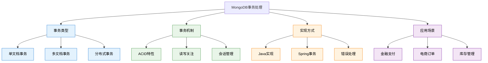

# 8. MongoDB核心-事务处理

## 概述

MongoDB从4.0版本开始引入多文档事务支持，为NoSQL数据库带来了ACID特性保证。事务处理确保一组操作要么全部成功，要么全部回滚，这对于需要数据一致性的业务场景至关重要。与传统关系型数据库不同，MongoDB的事务设计考虑了分布式环境和文档模型的特点。

在现代应用中，事务处理广泛应用于金融支付、电商下单、库存管理等关键业务流程。理解MongoDB事务的机制、性能特点和最佳实践，对于构建可靠的企业级应用具有重要意义。



## 知识要点

### 1. 事务基础概念

#### 1.1 ACID特性在MongoDB中的实现

MongoDB事务完全支持ACID特性：

```java
// 金融转账业务场景
// 账户数据结构
{
  "_id": ObjectId("account_65a1b2c3d4e5f678"),
  "accountNumber": "ACC-001-2024",
  "accountHolder": "张三",
  "balance": NumberDecimal("10000.00"),
  "currency": "CNY",
  "status": "active",
  "metadata": {
    "createdAt": ISODate("2024-01-01T00:00:00Z"),
    "lastTransactionAt": ISODate("2024-01-15T10:30:00Z"),
    "version": 15
  }
}

// 交易记录数据结构
{
  "_id": ObjectId("transaction_65a1b2c3d4e5f679"),
  "transactionId": "TXN-2024-0115-001",
  "type": "transfer",
  "fromAccount": "ACC-001-2024",
  "toAccount": "ACC-002-2024", 
  "amount": NumberDecimal("500.00"),
  "currency": "CNY",
  "status": "completed",
  "description": "转账给李四",
  "metadata": {
    "initiatedAt": ISODate("2024-01-15T10:30:00Z"),
    "completedAt": ISODate("2024-01-15T10:30:05Z"),
    "initiatedBy": "user_123",
    "channel": "mobile_app"
  }
}

// Java Spring Data MongoDB事务实现
@Service
@Transactional
public class BankTransferService {
    
    @Autowired
    private MongoTemplate mongoTemplate;
    
    @Autowired
    private TransactionTemplate transactionTemplate;
    
    // 原子性转账操作
    public TransferResult transferFunds(TransferRequest request) {
        return transactionTemplate.execute(status -> {
            try {
                // 1. 原子性(Atomicity): 所有操作要么全部成功，要么全部回滚
                return executeTransfer(request);
                
            } catch (Exception e) {
                // 回滚事务
                status.setRollbackOnly();
                throw new TransferException("Transfer failed: " + e.getMessage(), e);
            }
        });
    }
    
    private TransferResult executeTransfer(TransferRequest request) {
        String fromAccount = request.getFromAccount();
        String toAccount = request.getToAccount();
        BigDecimal amount = request.getAmount();
        
        // 2. 一致性(Consistency): 验证业务规则
        validateTransferRequest(request);
        
        // 3. 隔离性(Isolation): 使用适当的读写关注级别
        // 查询源账户（使用读关注确保数据一致性）
        Query fromAccountQuery = Query.query(Criteria.where("accountNumber").is(fromAccount));
        Account fromAcc = mongoTemplate.findOne(fromAccountQuery, Account.class);
        
        if (fromAcc == null) {
            throw new AccountNotFoundException("Source account not found: " + fromAccount);
        }
        
        if (fromAcc.getBalance().compareTo(amount) < 0) {
            throw new InsufficientFundsException("Insufficient balance");
        }
        
        // 查询目标账户
        Query toAccountQuery = Query.query(Criteria.where("accountNumber").is(toAccount));
        Account toAcc = mongoTemplate.findOne(toAccountQuery, Account.class);
        
        if (toAcc == null) {
            throw new AccountNotFoundException("Target account not found: " + toAccount);
        }
        
        // 4. 持久性(Durability): 使用写关注确保数据持久化
        // 创建交易记录
        Transaction transaction = Transaction.builder()
            .transactionId(generateTransactionId())
            .type("transfer")
            .fromAccount(fromAccount)
            .toAccount(toAccount)
            .amount(amount)
            .currency(request.getCurrency())
            .status("processing")
            .description(request.getDescription())
            .metadata(TransactionMetadata.builder()
                .initiatedAt(Instant.now())
                .initiatedBy(request.getInitiatedBy())
                .channel(request.getChannel())
                .build())
            .build();
        
        mongoTemplate.insert(transaction);
        
        // 原子性更新账户余额
        UpdateResult fromResult = mongoTemplate.updateFirst(
            Query.query(
                new Criteria().andOperator(
                    Criteria.where("accountNumber").is(fromAccount),
                    Criteria.where("version").is(fromAcc.getVersion())  // 乐观锁
                )
            ),
            new Update()
                .inc("balance", amount.negate())
                .inc("version", 1)
                .currentDate("metadata.lastTransactionAt"),
            Account.class
        );
        
        if (fromResult.getMatchedCount() == 0) {
            throw new ConcurrentModificationException("Account was modified by another transaction");
        }
        
        UpdateResult toResult = mongoTemplate.updateFirst(
            Query.query(
                new Criteria().andOperator(
                    Criteria.where("accountNumber").is(toAccount),
                    Criteria.where("version").is(toAcc.getVersion())
                )
            ),
            new Update()
                .inc("balance", amount)
                .inc("version", 1)
                .currentDate("metadata.lastTransactionAt"),
            Account.class
        );
        
        if (toResult.getMatchedCount() == 0) {
            throw new ConcurrentModificationException("Target account was modified");
        }
        
        // 更新交易状态为完成
        mongoTemplate.updateFirst(
            Query.query(Criteria.where("transactionId").is(transaction.getTransactionId())),
            new Update()
                .set("status", "completed")
                .currentDate("metadata.completedAt"),
            Transaction.class
        );
        
        return TransferResult.builder()
            .transactionId(transaction.getTransactionId())
            .success(true)
            .message("Transfer completed successfully")
            .build();
    }
    
    private void validateTransferRequest(TransferRequest request) {
        if (request.getAmount().compareTo(BigDecimal.ZERO) <= 0) {
            throw new IllegalArgumentException("Transfer amount must be positive");
        }
        
        if (request.getFromAccount().equals(request.getToAccount())) {
            throw new IllegalArgumentException("Cannot transfer to the same account");
        }
        
        // 每日转账限额检查
        BigDecimal dailyLimit = getDailyTransferLimit(request.getFromAccount());
        BigDecimal todayTransferred = getTodayTransferredAmount(request.getFromAccount());
        
        if (todayTransferred.add(request.getAmount()).compareTo(dailyLimit) > 0) {
            throw new DailyLimitExceededException("Daily transfer limit exceeded");
        }
    }
}
```

#### 1.2 会话管理和读写关注

MongoDB事务基于会话(Session)实现，需要正确管理会话生命周期：

```java
// 手动会话管理
@Service
public class ManualTransactionService {
    
    @Autowired
    private MongoClient mongoClient;
    
    @Autowired
    private MongoTemplate mongoTemplate;
    
    // 手动管理事务会话
    public OrderResult processOrder(OrderRequest request) {
        ClientSession session = mongoClient.startSession();
        
        try {
            // 配置事务选项
            TransactionOptions txnOptions = TransactionOptions.builder()
                .readConcern(ReadConcern.SNAPSHOT)           // 读关注：快照隔离
                .writeConcern(WriteConcern.MAJORITY)         // 写关注：多数节点确认
                .readPreference(ReadPreference.primary())    // 读偏好：主节点
                .maxCommitTime(Duration.ofSeconds(30))       // 最大提交时间
                .build();
            
            session.startTransaction(txnOptions);
            
            OrderResult result = executeOrderTransaction(session, request);
            
            // 提交事务
            session.commitTransaction();
            
            return result;
            
        } catch (Exception e) {
            // 回滚事务
            session.abortTransaction();
            log.error("Order transaction failed", e);
            throw new OrderProcessingException("Order processing failed: " + e.getMessage(), e);
            
        } finally {
            // 关闭会话
            session.close();
        }
    }
    
    private OrderResult executeOrderTransaction(ClientSession session, OrderRequest request) {
        // 在事务会话中执行操作
        
        // 1. 检查库存
        Query stockQuery = Query.query(Criteria.where("productId").is(request.getProductId()));
        Inventory inventory = mongoTemplate.findOne(stockQuery, Inventory.class);
        
        if (inventory == null || inventory.getAvailableStock() < request.getQuantity()) {
            throw new InsufficientStockException("Insufficient stock");
        }
        
        // 2. 扣减库存（在会话中执行）
        Update stockUpdate = new Update()
            .inc("availableStock", -request.getQuantity())
            .inc("reservedStock", request.getQuantity())
            .inc("version", 1);
        
        UpdateResult stockResult = mongoTemplate.updateFirst(
            stockQuery, stockUpdate, Inventory.class
        );
        
        if (stockResult.getMatchedCount() == 0) {
            throw new ConcurrentModificationException("Inventory was modified");
        }
        
        // 3. 创建订单
        Order order = Order.builder()
            .orderNumber(generateOrderNumber())
            .customerId(request.getCustomerId())
            .productId(request.getProductId())
            .quantity(request.getQuantity())
            .unitPrice(inventory.getPrice())
            .totalAmount(inventory.getPrice().multiply(BigDecimal.valueOf(request.getQuantity())))
            .status("confirmed")
            .createdAt(Instant.now())
            .build();
        
        mongoTemplate.insert(order);
        
        // 4. 记录库存变更日志
        InventoryLog inventoryLog = InventoryLog.builder()
            .productId(request.getProductId())
            .operation("DECREASE")
            .quantity(request.getQuantity())
            .orderId(order.getOrderNumber())
            .timestamp(Instant.now())
            .build();
        
        mongoTemplate.insert(inventoryLog);
        
        return OrderResult.builder()
            .orderNumber(order.getOrderNumber())
            .success(true)
            .build();
    }
}
```

### 2. 事务性能优化

#### 2.1 事务设计最佳实践

```java
// 事务性能优化服务
@Service
public class TransactionOptimizationService {
    
    // 批量事务处理 - 减少事务数量
    @Transactional
    public BatchProcessResult processBatchOrders(List<OrderRequest> orderRequests) {
        BatchProcessResult result = new BatchProcessResult();
        
        // 预处理：批量检查库存
        Map<String, Integer> stockRequirements = orderRequests.stream()
            .collect(Collectors.groupingBy(
                OrderRequest::getProductId,
                Collectors.summingInt(OrderRequest::getQuantity)
            ));
        
        // 批量验证库存
        validateBatchStock(stockRequirements);
        
        // 批量更新库存
        List<BulkOperations> bulkOps = prepareBulkInventoryUpdates(stockRequirements);
        
        // 执行批量操作
        for (BulkOperations bulkOp : bulkOps) {
            try {
                BulkWriteResult writeResult = bulkOp.execute();
                result.addSuccessCount(writeResult.getModifiedCount());
            } catch (Exception e) {
                result.addError("Bulk inventory update failed: " + e.getMessage());
            }
        }
        
        // 批量创建订单
        List<Order> orders = orderRequests.stream()
            .map(this::createOrderFromRequest)
            .collect(Collectors.toList());
        
        try {
            mongoTemplate.insertAll(orders);
            result.addSuccessCount(orders.size());
        } catch (Exception e) {
            result.addError("Bulk order creation failed: " + e.getMessage());
        }
        
        return result;
    }
    
    // 短事务原则 - 快速提交
    @Transactional
    public PaymentResult processPayment(PaymentRequest request) {
        long startTime = System.currentTimeMillis();
        
        try {
            // 快速验证
            Payment payment = createPaymentRecord(request);
            
            // 原子性更新账户余额
            boolean balanceUpdated = updateAccountBalance(
                request.getAccountId(), 
                request.getAmount().negate()
            );
            
            if (!balanceUpdated) {
                throw new PaymentProcessingException("Failed to update account balance");
            }
            
            // 更新支付状态
            payment.setStatus("completed");
            payment.setCompletedAt(Instant.now());
            mongoTemplate.save(payment);
            
            long duration = System.currentTimeMillis() - startTime;
            log.info("Payment transaction completed in {}ms", duration);
            
            return PaymentResult.builder()
                .paymentId(payment.getPaymentId())
                .success(true)
                .build();
                
        } catch (Exception e) {
            long duration = System.currentTimeMillis() - startTime;
            log.error("Payment transaction failed after {}ms", duration, e);
            throw e;
        }
    }
    
    // 乐观锁实现 - 减少锁争用
    public boolean updateAccountBalanceWithOptimisticLock(String accountId, BigDecimal amount) {
        int maxRetries = 3;
        int retryCount = 0;
        
        while (retryCount < maxRetries) {
            try {
                // 查询当前账户状态
                Query query = Query.query(Criteria.where("accountId").is(accountId));
                Account account = mongoTemplate.findOne(query, Account.class);
                
                if (account == null) {
                    throw new AccountNotFoundException("Account not found: " + accountId);
                }
                
                // 乐观锁更新
                Query updateQuery = Query.query(
                    new Criteria().andOperator(
                        Criteria.where("accountId").is(accountId),
                        Criteria.where("version").is(account.getVersion())
                    )
                );
                
                Update update = new Update()
                    .inc("balance", amount)
                    .inc("version", 1)
                    .currentDate("lastModified");
                
                UpdateResult result = mongoTemplate.updateFirst(updateQuery, update, Account.class);
                
                if (result.getMatchedCount() > 0) {
                    return true;  // 更新成功
                }
                
                // 版本冲突，重试
                retryCount++;
                Thread.sleep(10 * retryCount);  // 指数退避
                
            } catch (InterruptedException e) {
                Thread.currentThread().interrupt();
                throw new RuntimeException("Thread interrupted during retry", e);
            }
        }
        
        throw new OptimisticLockingException("Failed to update account after " + maxRetries + " retries");
    }
}
```

### 3. 错误处理和恢复

#### 3.1 事务错误处理策略

```java
// 事务错误处理和恢复服务
@Service
public class TransactionRecoveryService {
    
    @Autowired
    private MongoTemplate mongoTemplate;
    
    // 事务重试机制
    @Retryable(
        value = {TransientTransactionException.class},
        maxAttempts = 3,
        backoff = @Backoff(delay = 1000, multiplier = 2)
    )
    @Transactional
    public void retryableTransactionOperation(String operationId) {
        try {
            executeTransactionOperation(operationId);
        } catch (MongoTransientTransactionException e) {
            log.warn("Transient transaction error, will retry: {}", e.getMessage());
            throw new TransientTransactionException("Transient error: " + e.getMessage(), e);
        } catch (MongoException e) {
            log.error("Non-retryable transaction error: {}", e.getMessage());
            throw new PermanentTransactionException("Permanent error: " + e.getMessage(), e);
        }
    }
    
    // 补偿事务实现
    public void executeCompensatingTransaction(String originalTransactionId) {
        // 查询原始事务记录
        Query query = Query.query(Criteria.where("transactionId").is(originalTransactionId));
        Transaction originalTxn = mongoTemplate.findOne(query, Transaction.class);
        
        if (originalTxn == null) {
            throw new TransactionNotFoundException("Original transaction not found: " + originalTransactionId);
        }
        
        if (!"failed".equals(originalTxn.getStatus())) {
            throw new IllegalStateException("Cannot compensate non-failed transaction");
        }
        
        try {
            // 创建补偿事务
            Transaction compensatingTxn = Transaction.builder()
                .transactionId(generateTransactionId())
                .type("compensation")
                .originalTransactionId(originalTransactionId)
                .fromAccount(originalTxn.getToAccount())    // 反向操作
                .toAccount(originalTxn.getFromAccount())
                .amount(originalTxn.getAmount())
                .status("processing")
                .description("Compensation for failed transaction: " + originalTransactionId)
                .build();
            
            mongoTemplate.insert(compensatingTxn);
            
            // 执行补偿操作
            executeCompensation(originalTxn, compensatingTxn);
            
            // 更新补偿事务状态
            mongoTemplate.updateFirst(
                Query.query(Criteria.where("transactionId").is(compensatingTxn.getTransactionId())),
                new Update()
                    .set("status", "completed")
                    .currentDate("completedAt"),
                Transaction.class
            );
            
            // 更新原始事务状态
            mongoTemplate.updateFirst(
                Query.query(Criteria.where("transactionId").is(originalTransactionId)),
                new Update()
                    .set("status", "compensated")
                    .set("compensatedBy", compensatingTxn.getTransactionId())
                    .currentDate("compensatedAt"),
                Transaction.class
            );
            
        } catch (Exception e) {
            log.error("Compensation transaction failed for: {}", originalTransactionId, e);
            
            // 记录补偿失败
            mongoTemplate.updateFirst(
                Query.query(Criteria.where("transactionId").is(originalTransactionId)),
                new Update()
                    .set("status", "compensation_failed")
                    .set("compensationError", e.getMessage())
                    .currentDate("compensationFailedAt"),
                Transaction.class
            );
            
            throw new CompensationException("Compensation failed: " + e.getMessage(), e);
        }
    }
    
    // 事务状态检查和修复
    @Scheduled(fixedRate = 300000)  // 每5分钟执行一次
    public void checkAndRepairInconsistentTransactions() {
        // 查询长时间处于处理中状态的事务
        Date cutoffTime = Date.from(Instant.now().minus(10, ChronoUnit.MINUTES));
        
        Query query = Query.query(
            new Criteria().andOperator(
                Criteria.where("status").is("processing"),
                Criteria.where("initiatedAt").lt(cutoffTime)
            )
        );
        
        List<Transaction> stuckTransactions = mongoTemplate.find(query, Transaction.class);
        
        for (Transaction transaction : stuckTransactions) {
            try {
                repairTransaction(transaction);
            } catch (Exception e) {
                log.error("Failed to repair transaction: {}", transaction.getTransactionId(), e);
            }
        }
    }
    
    private void repairTransaction(Transaction transaction) {
        // 检查账户状态，确定事务实际结果
        boolean fromAccountUpdated = checkAccountUpdate(
            transaction.getFromAccount(), 
            transaction.getAmount().negate(),
            transaction.getInitiatedAt()
        );
        
        boolean toAccountUpdated = checkAccountUpdate(
            transaction.getToAccount(),
            transaction.getAmount(),
            transaction.getInitiatedAt()
        );
        
        if (fromAccountUpdated && toAccountUpdated) {
            // 事务实际已完成，更新状态
            mongoTemplate.updateFirst(
                Query.query(Criteria.where("transactionId").is(transaction.getTransactionId())),
                new Update()
                    .set("status", "completed")
                    .currentDate("completedAt"),
                Transaction.class
            );
            
        } else if (!fromAccountUpdated && !toAccountUpdated) {
            // 事务未执行，标记为失败
            mongoTemplate.updateFirst(
                Query.query(Criteria.where("transactionId").is(transaction.getTransactionId())),
                new Update()
                    .set("status", "failed")
                    .set("failureReason", "Transaction was not executed")
                    .currentDate("failedAt"),
                Transaction.class
            );
            
        } else {
            // 部分执行，需要补偿
            mongoTemplate.updateFirst(
                Query.query(Criteria.where("transactionId").is(transaction.getTransactionId())),
                new Update()
                    .set("status", "inconsistent")
                    .set("inconsistencyReason", "Partial execution detected")
                    .currentDate("inconsistencyDetectedAt"),
                Transaction.class
            );
            
            // 触发告警
            alertService.sendInconsistencyAlert(transaction.getTransactionId());
        }
    }
}
```

## 知识扩展

### 1. 事务性能考虑

```java
// 事务性能监控和优化
@Component
public class TransactionPerformanceMonitor {
    
    private final MeterRegistry meterRegistry;
    private final Timer transactionTimer;
    private final Counter transactionCounter;
    
    public TransactionPerformanceMonitor(MeterRegistry meterRegistry) {
        this.meterRegistry = meterRegistry;
        this.transactionTimer = Timer.builder("mongodb.transaction.duration")
            .description("MongoDB transaction execution time")
            .register(meterRegistry);
        this.transactionCounter = Counter.builder("mongodb.transaction.count")
            .description("MongoDB transaction count")
            .register(meterRegistry);
    }
    
    // 性能监控装饰器
    public <T> T monitorTransaction(String transactionType, Supplier<T> transactionLogic) {
        Timer.Sample sample = Timer.start(meterRegistry);
        
        try {
            T result = transactionLogic.get();
            
            transactionCounter.increment(
                Tags.of(
                    "type", transactionType,
                    "status", "success"
                )
            );
            
            return result;
            
        } catch (Exception e) {
            transactionCounter.increment(
                Tags.of(
                    "type", transactionType,
                    "status", "failure",
                    "error", e.getClass().getSimpleName()
                )
            );
            throw e;
            
        } finally {
            sample.stop(transactionTimer.tag("type", transactionType));
        }
    }
}
```

### 2. 分片环境下的事务

在分片集群中，事务具有一些限制和特殊考虑：

```java
// 分片环境事务处理
@Service
public class ShardedTransactionService {
    
    // 单分片事务（推荐）
    @Transactional
    public void singleShardTransaction(String shardKey, List<Operation> operations) {
        // 确保所有操作都在同一个分片上
        // 通过分片键确保数据局部性
        operations.forEach(op -> {
            if (!op.getShardKey().equals(shardKey)) {
                throw new IllegalArgumentException("All operations must use the same shard key");
            }
        });
        
        // 执行事务操作
        executeOperations(operations);
    }
    
    // 跨分片事务设计建议
    public void handleCrossShardScenario(CrossShardRequest request) {
        // 方案1：重新设计数据模型，避免跨分片事务
        // 方案2：使用Saga模式实现最终一致性
        // 方案3：在应用层实现分布式事务协调
        
        SagaTransaction saga = SagaTransaction.builder()
            .transactionId(UUID.randomUUID().toString())
            .steps(request.getOperations())
            .build();
        
        sagaOrchestrator.execute(saga);
    }
}
```

## 深度思考

### 1. 事务使用场景判断

选择是否使用事务的决策标准：
- **数据一致性要求**：严格要求原子性的操作
- **性能影响**：事务会带来额外的性能开销
- **分片考虑**：跨分片事务有性能和复杂性问题
- **业务特性**：评估是否可以通过最终一致性解决

### 2. MongoDB事务 vs 关系型数据库事务

主要差异：
- **粒度**：MongoDB支持文档级和集合级事务
- **性能**：MongoDB事务开销相对较大
- **分布式**：原生支持分片环境下的事务
- **灵活性**：文档模型减少了对事务的依赖

### 3. 事务设计原则

1. **最小化事务范围**：只在必要时使用事务
2. **快速提交**：保持事务执行时间尽可能短
3. **错误处理**：实现完善的异常处理和恢复机制
4. **监控告警**：建立事务性能和失败监控
5. **测试验证**：充分测试并发和异常场景

通过合理使用MongoDB事务处理，开发者能够在保证数据一致性的同时，构建高性能、可靠的企业级应用系统。