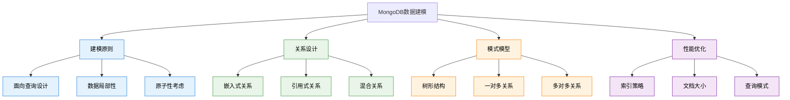

# 9. MongoDB核心-数据建模

## 概述

数据建模是MongoDB应用设计的核心环节，决定了应用的性能、可扩展性和维护性。与关系型数据库的规范化建模不同，MongoDB的文档模型更强调数据的使用模式和查询需求。合理的数据建模能够充分发挥MongoDB的优势，而不当的设计则可能导致性能问题。

在实际业务中，数据建模需要平衡查询性能、存储效率、数据一致性、开发复杂度等多个因素。从电商平台到社交媒体，不同的应用场景需要不同的建模策略。



## 知识要点

### 1. 数据建模基本原则

#### 1.1 面向查询的设计思路

MongoDB数据建模的核心是理解应用的查询模式：

```java
// 电商用户数据建模示例

// 嵌入式设计 - 适合频繁一起查询的数据
{
  "_id": ObjectId("user_65a1b2c3d4e5f678"),
  "username": "john_doe",
  "email": "john.doe@example.com",
  "profile": {
    "firstName": "John",
    "lastName": "Doe",
    "avatar": "https://cdn.example.com/avatars/john.jpg",
    "birthDate": ISODate("1990-05-15T00:00:00Z")
  },
  "address": {
    "primary": {
      "country": "China",
      "province": "Beijing",
      "city": "Beijing",
      "district": "Chaoyang",
      "street": "Sanlitun Street 123"
    }
  },
  "preferences": {
    "language": "zh-CN",
    "currency": "CNY",
    "notifications": {
      "email": true,
      "sms": false,
      "push": true
    }
  },
  "statistics": {
    "totalOrders": 25,
    "totalSpent": NumberDecimal("12580.50"),
    "lastOrderAt": ISODate("2024-01-10T14:30:00Z")
  },
  "metadata": {
    "accountStatus": "active",
    "createdAt": ISODate("2023-06-15T09:00:00Z"),
    "lastLoginAt": ISODate("2024-01-15T16:20:00Z")
  }
}

// Java实体设计
@Document(collection = "users")
public class User {
    
    @Id
    private String id;
    
    @Indexed(unique = true)
    private String username;
    
    @Indexed
    private String email;
    
    // 嵌入式文档
    private UserProfile profile;
    private Address address;
    private UserPreferences preferences;
    private UserStatistics statistics;
    private UserMetadata metadata;
}

// 业务查询场景
@Service
public class UserModelingService {
    
    // 用户登录 - 需要基本信息
    public UserLoginInfo getUserForLogin(String username) {
        Query query = Query.query(Criteria.where("username").is(username));
        
        query.fields()
            .include("username")
            .include("email")
            .include("metadata.accountStatus")
            .include("metadata.lastLoginAt");
        
        return mongoTemplate.findOne(query, UserLoginInfo.class);
    }
    
    // 用户档案页面 - 需要详细信息
    public UserProfile getUserProfile(String userId) {
        Query query = Query.query(Criteria.where("_id").is(userId));
        
        query.fields()
            .exclude("password")
            .exclude("metadata.registrationIP");
        
        return mongoTemplate.findOne(query, UserProfile.class);
    }
}
```

#### 1.2 嵌入 vs 引用的选择标准

数据关系建模的核心决策是选择嵌入还是引用：

```java
// 电商订单系统建模对比

// 方案A：嵌入式设计 - 订单包含完整商品快照
{
  "_id": ObjectId("order_65a1b2c3d4e5f678"),
  "orderNumber": "ORD-2024-0115-001",
  "customerId": ObjectId("customer_65a1b2c3d4e5f679"),
  "status": "completed",
  
  // 嵌入商品信息快照
  "items": [
    {
      "productId": "PROD-001",
      "productSnapshot": {
        "name": "iPhone 15 Pro 256GB",
        "price": NumberDecimal("7999.00"),
        "specifications": {
          "color": "Natural Titanium",
          "storage": "256GB"
        }
      },
      "quantity": 1,
      "unitPrice": NumberDecimal("7999.00")
    }
  ],
  "totalAmount": NumberDecimal("7999.00"),
  "createdAt": ISODate("2024-01-15T10:30:00Z")
}

// 方案B：引用式设计 - 订单引用商品ID
{
  "_id": ObjectId("order_65a1b2c3d4e5f679"),
  "orderNumber": "ORD-2024-0115-002",
  "customerId": ObjectId("customer_65a1b2c3d4e5f680"),
  "status": "completed",
  
  // 引用商品ID
  "items": [
    {
      "productId": ObjectId("product_65a1b2c3d4e5f681"),
      "quantity": 2,
      "unitPrice": NumberDecimal("299.00")  // 价格快照
    }
  ],
  "totalAmount": NumberDecimal("598.00"),
  "createdAt": ISODate("2024-01-15T11:00:00Z")
}

// 设计决策框架
@Component
public class DataModelingDecisionMatrix {
    
    public RelationshipType determineRelationshipType(RelationshipContext context) {
        
        // 查询模式分析
        if (context.isAlwaysQueriedTogether() && context.getRelationshipSize() <= 100) {
            return RelationshipType.EMBEDDED;
        }
        
        // 数据更新频率
        if (context.isChildDataFrequentlyUpdated()) {
            return RelationshipType.REFERENCED;
        }
        
        // 文档大小限制
        if (context.getDocumentSize() > 16 * 1024 * 1024) {
            return RelationshipType.REFERENCED;
        }
        
        // 原子性需求
        if (context.requiresAtomicUpdates()) {
            return RelationshipType.EMBEDDED;
        }
        
        // 数据重用性
        if (context.isDataSharedAcrossDocuments()) {
            return RelationshipType.REFERENCED;
        }
        
        return RelationshipType.HYBRID;
    }
}
```

### 2. 常见数据模式

#### 2.1 树形结构建模

```java
// 电商分类树建模

// 方案1：父节点引用模式
{
  "_id": ObjectId("category_electronics"),
  "name": "Electronics",
  "slug": "electronics", 
  "parentId": null,  // 根节点
  "level": 0,
  "sortOrder": 1
}

{
  "_id": ObjectId("category_mobile_phones"),
  "name": "Mobile Phones",
  "slug": "mobile-phones",
  "parentId": ObjectId("category_electronics"),
  "level": 1,
  "sortOrder": 1
}

// 方案2：祖先路径模式
{
  "_id": ObjectId("category_smartphones"),
  "name": "Smartphones",
  "slug": "smartphones",
  "parentId": ObjectId("category_mobile_phones"),
  "ancestors": [
    ObjectId("category_electronics"),
    ObjectId("category_mobile_phones")
  ],
  "level": 2,
  "path": "/electronics/mobile-phones/smartphones"
}

// Java实现树形结构操作
@Service
public class CategoryTreeService {
    
    // 获取完整分类树
    public List<CategoryNode> getCompleteCategoryTree() {
        Query query = Query.query(Criteria.where("isActive").is(true));
        query.with(Sort.by(Sort.Direction.ASC, "level", "sortOrder"));
        
        List<Category> allCategories = mongoTemplate.find(query, Category.class);
        return buildTree(allCategories, null);
    }
    
    private List<CategoryNode> buildTree(List<Category> categories, ObjectId parentId) {
        return categories.stream()
            .filter(cat -> Objects.equals(cat.getParentId(), parentId))
            .map(cat -> CategoryNode.builder()
                .category(cat)
                .children(buildTree(categories, cat.getId()))
                .build())
            .collect(Collectors.toList());
    }
    
    // 获取分类路径
    public List<Category> getCategoryPath(ObjectId categoryId) {
        Category category = mongoTemplate.findById(categoryId, Category.class);
        if (category == null || category.getAncestors() == null) {
            return Collections.emptyList();
        }
        
        Query ancestorQuery = Query.query(
            Criteria.where("_id").in(category.getAncestors())
        );
        ancestorQuery.with(Sort.by(Sort.Direction.ASC, "level"));
        
        List<Category> ancestors = mongoTemplate.find(ancestorQuery, Category.class);
        ancestors.add(category);
        return ancestors;
    }
}
```

#### 2.2 一对多关系优化

```java
// 博客系统文章评论建模

// 混合模式 - 热门评论嵌入，完整评论独立存储
{
  "_id": ObjectId("article_65a1b2c3d4e5f678"),
  "title": "MongoDB数据建模最佳实践",
  "content": "...",
  
  // 嵌入热门评论快照
  "featuredComments": [
    {
      "commentId": ObjectId("comment_65a1b2c3d4e5f680"),
      "authorName": "reader1",
      "content": "非常实用的文章...",
      "likes": 25,
      "createdAt": ISODate("2024-01-15T14:30:00Z")
    }
  ],
  
  "statistics": {
    "viewCount": 1250,
    "commentCount": 156,
    "likeCount": 89
  }
}

// 独立的评论集合
{
  "_id": ObjectId("comment_65a1b2c3d4e5f680"),
  "articleId": ObjectId("article_65a1b2c3d4e5f678"),
  "author": {
    "userId": ObjectId("user_65a1b2c3d4e5f681"),
    "username": "reader1"
  },
  "content": "非常实用的文章，学到了很多！",
  "likes": 25,
  "replies": 3,
  "createdAt": ISODate("2024-01-15T14:30:00Z"),
  "isFeatured": true
}

// Java实现混合模式评论系统
@Service
public class ArticleCommentService {
    
    // 发布评论
    @Transactional
    public Comment publishComment(CommentRequest request) {
        // 创建评论文档
        Comment comment = Comment.builder()
            .articleId(request.getArticleId())
            .author(getUserInfo(request.getAuthorId()))
            .content(request.getContent())
            .createdAt(Instant.now())
            .build();
        
        mongoTemplate.insert(comment);
        
        // 更新文章统计
        Update articleUpdate = new Update()
            .inc("statistics.commentCount", 1)
            .currentDate("lastCommentAt");
        
        mongoTemplate.updateFirst(
            Query.query(Criteria.where("_id").is(request.getArticleId())),
            articleUpdate,
            Article.class
        );
        
        // 更新热门评论
        updateFeaturedCommentsIfNeeded(request.getArticleId());
        
        return comment;
    }
    
    // 获取文章评论（分页）
    public Page<Comment> getArticleComments(ObjectId articleId, Pageable pageable) {
        Query query = Query.query(Criteria.where("articleId").is(articleId));
        query.with(pageable);
        query.with(Sort.by(Sort.Direction.DESC, "likes", "createdAt"));
        
        List<Comment> comments = mongoTemplate.find(query, Comment.class);
        long total = mongoTemplate.count(
            Query.query(Criteria.where("articleId").is(articleId)), 
            Comment.class
        );
        
        return PageableExecutionUtils.getPage(comments, pageable, () -> total);
    }
}
```

## 知识扩展

### 1. 性能优化建模

```java
// 高性能数据建模策略
@Service
public class PerformanceOptimizedModelingService {
    
    // 预聚合数据建模
    public void designPreAggregatedModel() {
        // 用户行为统计预聚合
        UserDailyStats dailyStats = UserDailyStats.builder()
            .userId("user123")
            .date(LocalDate.now())
            .pageViews(45)
            .sessionDuration(Duration.ofMinutes(25))
            .actionsPerformed(12)
            .build();
        
        mongoTemplate.save(dailyStats);
    }
    
    // 读写分离建模
    public void designReadWriteSeparatedModel() {
        // 写优化：规范化结构
        // 读优化：非规范化，包含冗余数据
    }
}
```

### 2. 数据版本控制

```java
// 数据版本控制和迁移
@Service
public class DataVersioningService {
    
    // 支持多版本数据结构
    public void handleDataVersioning() {
        // 版本控制字段
        Document document = new Document()
            .append("dataVersion", "2.1")
            .append("migrationStatus", "completed");
        
        // 兼容性处理逻辑
        if ("1.0".equals(document.getString("dataVersion"))) {
            migrateFromV1ToV2(document);
        }
    }
}
```

## 深度思考

### 1. 建模决策权衡

数据建模需要权衡：
- **查询性能 vs 存储效率**
- **数据一致性 vs 开发复杂度**
- **读性能 vs 写性能**
- **当前需求 vs 未来扩展**

### 2. 常见建模反模式

避免以下反模式：
- **过度嵌套**：超过3-4层嵌套
- **大数组**：包含数千个元素
- **频繁变化的嵌入数据**
- **完全关系型思维**

### 3. 建模演进策略

1. **从简单开始**：先满足核心需求
2. **逐步优化**：根据使用情况调整
3. **版本控制**：支持平滑升级
4. **性能监控**：持续优化

### 4. 实际应用建议

- **理解查询模式**：基于实际使用设计
- **考虑数据生命周期**：不同阶段的访问模式
- **平衡一致性与性能**：选择合适的一致性级别
- **预留扩展空间**：为未来需求预留设计空间

通过合理的数据建模，开发者能够充分发挥MongoDB的优势，构建高性能、可维护的数据存储方案。