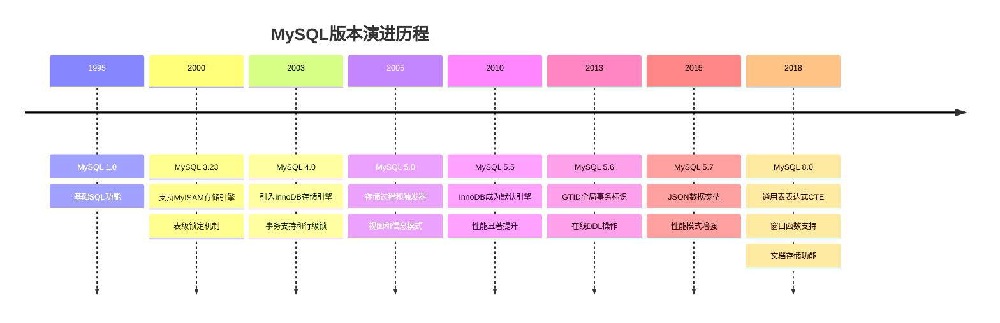
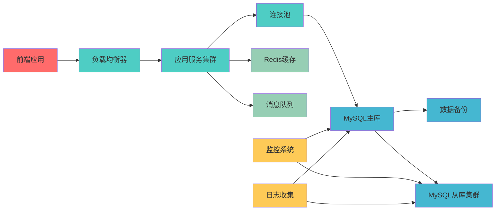

# 知识体系介绍

## 业务场景引入

在当今互联网企业中，数据库是核心基础设施，承载着企业的核心业务数据。以电商平台为例，从用户注册、商品浏览、订单处理到支付交易，每一个环节都离不开数据库的支撑。MySQL作为全球最受欢迎的开源关系型数据库，以其卓越的性能、稳定性和易用性，成为众多企业的首选数据库解决方案。

当我们构建一个完整的电商系统时，面临的核心挑战包括：
- **数据一致性保障**：如何确保订单、库存、支付数据的强一致性
- **高并发处理能力**：双十一期间如何应对百万级并发访问
- **数据安全可靠性**：如何保障用户数据和交易数据的安全性
- **系统扩展能力**：业务快速增长时如何实现数据库的水平扩展

## MySQL技术架构全览

### 整体知识体系架构

```mermaid
graph TB
    A[MySQL知识体系] --> B[基础概念层]
    A --> C[核心功能层]
    A --> D[高级特性层]
    A --> E[性能优化层]
    A --> F[运维管理层]
    A --> G[故障排查层]

    B --> B1[数据库概述]
    B --> B2[数据类型详解]
    B --> B3[SQL语言基础]
    B --> B4[索引机制]

    C --> C1[事务处理]
    C --> C2[存储过程]
    C --> C3[视图触发器]
    C --> C4[备份恢复]
    C --> C5[用户权限]

    D --> D1[主从复制]
    D --> D2[集群分片]
    D --> D3[SSL安全]
    D --> D4[JSON处理]
    D --> D5[分区表]

    E --> E1[查询优化]
    E --> E2[参数调优]
    E --> E3[监控分析]
    E --> E4[连接池]
    E --> E5[大数据处理]

    F --> F1[安装配置]
    F --> F2[版本升级]
    F --> F3[日志管理]
    F --> F4[自动化脚本]
    F --> F5[容器化部署]

    G --> G1[错误诊断]
    G --> G2[性能问题]
    G --> G3[死锁分析]
    G --> G4[数据恢复]

    classDef basic fill:#E8F5E8,stroke:#4CAF50
    classDef core fill:#E3F2FD,stroke:#2196F3
    classDef advanced fill:#FFF3E0,stroke:#FF9800
    classDef optimization fill:#F3E5F5,stroke:#9C27B0
    classDef operation fill:#FFEBEE,stroke:#F44336
    classDef troubleshoot fill:#E0F2F1,stroke:#009688

    class B,B1,B2,B3,B4 basic
    class C,C1,C2,C3,C4,C5 core
    class D,D1,D2,D3,D4,D5 advanced
    class E,E1,E2,E3,E4,E5 optimization
    class F,F1,F2,F3,F4,F5 operation
    class G,G1,G2,G3,G4 troubleshoot
```



### 技术发展历程

MySQL从1995年诞生至今，经历了多个重要版本演进：



## 核心技术特性

### 存储引擎架构

MySQL采用插件式存储引擎架构，支持多种存储引擎：

| 存储引擎 | 事务支持 | 锁粒度 | 适用场景 | 性能特点 |
|---------|---------|--------|---------|---------|
| InnoDB | 支持 | 行级锁 | OLTP事务处理 | 高并发读写 |
| MyISAM | 不支持 | 表级锁 | 只读或读多写少 | 查询速度快 |
| Memory | 不支持 | 表级锁 | 临时数据存储 | 内存访问速度 |
| Archive | 不支持 | 行级锁 | 数据归档 | 高压缩比 |

### ACID特性保障

以电商订单处理为例，展示MySQL的ACID特性：

```sql
-- 订单处理事务示例
START TRANSACTION;

-- 原子性：要么全部成功，要么全部失败
INSERT INTO orders (user_id, total_amount, status) 
VALUES (1001, 299.99, 'PENDING');

-- 一致性：库存减少与订单创建保持一致
UPDATE products SET stock = stock - 1 
WHERE product_id = 2001 AND stock > 0;

-- 隔离性：并发事务之间相互隔离
SELECT stock FROM products WHERE product_id = 2001 FOR UPDATE;

-- 持久性：事务提交后数据永久保存
COMMIT;
```

## 学习路径规划

### 初级阶段（基础概念层）
**学习目标**：掌握MySQL基础概念和基本操作
- 数据库设计理论和范式
- SQL语言基础和数据类型
- 索引机制和查询优化基础
- 基本的数据库设计实践

**实战项目**：构建简单的博客系统数据库

### 中级阶段（核心功能层）
**学习目标**：深入理解MySQL核心功能特性
- 事务处理和并发控制
- 存储过程和触发器开发
- 数据备份和恢复策略
- 用户权限管理系统

**实战项目**：构建完整的电商系统数据库

### 高级阶段（高级特性层）
**学习目标**：掌握MySQL高级特性和架构设计
- 主从复制和读写分离
- 分库分表和集群部署
- 数据库安全和SSL认证
- 新特性应用（JSON、分区表等）

**实战项目**：构建高可用的分布式数据库架构

### 专家阶段（优化运维层）
**学习目标**：具备生产环境优化和运维能力
- 深度性能调优和监控
- 自动化运维脚本开发
- 故障诊断和快速恢复
- 容器化和云原生部署

**实战项目**：构建企业级数据库运维平台

## 技术生态集成

### 与现代技术栈的集成



### Spring Boot集成最佳实践

在Spring Boot项目中集成MySQL的配置示例：

```yaml
# application.yml配置
spring:
  datasource:
    # 主数据源配置
    master:
      jdbc-url: jdbc:mysql://master-db:3306/ecommerce?useSSL=true&serverTimezone=UTC
      username: ${DB_USER:admin}
      password: ${DB_PASSWORD:secure_password}
      driver-class-name: com.mysql.cj.jdbc.Driver
      hikari:
        maximum-pool-size: 20
        minimum-idle: 5
        connection-timeout: 30000
        idle-timeout: 600000
        max-lifetime: 1800000
    
    # 从数据源配置（读写分离）
    slave:
      jdbc-url: jdbc:mysql://slave-db:3306/ecommerce?useSSL=true&serverTimezone=UTC
      username: ${DB_READONLY_USER:readonly}
      password: ${DB_READONLY_PASSWORD:readonly_password}
      driver-class-name: com.mysql.cj.jdbc.Driver
      hikari:
        maximum-pool-size: 15
        minimum-idle: 3

  jpa:
    hibernate:
      ddl-auto: validate
    show-sql: false
    properties:
      hibernate:
        dialect: org.hibernate.dialect.MySQL8Dialect
        format_sql: true
        use_sql_comments: true
```

## 实践应用场景

### 电商系统数据库设计案例

以下是一个典型的电商系统核心表结构设计：

```sql
-- 用户表
CREATE TABLE users (
    id BIGINT PRIMARY KEY AUTO_INCREMENT,
    username VARCHAR(50) UNIQUE NOT NULL,
    email VARCHAR(100) UNIQUE NOT NULL,
    password_hash VARCHAR(255) NOT NULL,
    phone VARCHAR(20),
    created_at TIMESTAMP DEFAULT CURRENT_TIMESTAMP,
    updated_at TIMESTAMP DEFAULT CURRENT_TIMESTAMP ON UPDATE CURRENT_TIMESTAMP,
    status ENUM('ACTIVE', 'INACTIVE', 'SUSPENDED') DEFAULT 'ACTIVE',
    
    INDEX idx_email (email),
    INDEX idx_phone (phone),
    INDEX idx_status_created (status, created_at)
) ENGINE=InnoDB DEFAULT CHARSET=utf8mb4 COLLATE=utf8mb4_unicode_ci;

-- 商品表
CREATE TABLE products (
    id BIGINT PRIMARY KEY AUTO_INCREMENT,
    name VARCHAR(200) NOT NULL,
    description TEXT,
    price DECIMAL(10,2) NOT NULL,
    stock INT NOT NULL DEFAULT 0,
    category_id BIGINT NOT NULL,
    brand_id BIGINT,
    sku VARCHAR(100) UNIQUE NOT NULL,
    status ENUM('ACTIVE', 'INACTIVE', 'OUT_OF_STOCK') DEFAULT 'ACTIVE',
    created_at TIMESTAMP DEFAULT CURRENT_TIMESTAMP,
    updated_at TIMESTAMP DEFAULT CURRENT_TIMESTAMP ON UPDATE CURRENT_TIMESTAMP,
    
    INDEX idx_category (category_id),
    INDEX idx_brand (brand_id),
    INDEX idx_sku (sku),
    INDEX idx_status_price (status, price),
    FULLTEXT INDEX ft_name_desc (name, description)
) ENGINE=InnoDB DEFAULT CHARSET=utf8mb4 COLLATE=utf8mb4_unicode_ci;

-- 订单表
CREATE TABLE orders (
    id BIGINT PRIMARY KEY AUTO_INCREMENT,
    order_no VARCHAR(32) UNIQUE NOT NULL,
    user_id BIGINT NOT NULL,
    total_amount DECIMAL(12,2) NOT NULL,
    discount_amount DECIMAL(10,2) DEFAULT 0.00,
    shipping_fee DECIMAL(8,2) DEFAULT 0.00,
    status ENUM('PENDING', 'PAID', 'SHIPPED', 'DELIVERED', 'CANCELLED') DEFAULT 'PENDING',
    payment_method ENUM('ALIPAY', 'WECHAT', 'BANK_CARD', 'CREDIT') NOT NULL,
    shipping_address TEXT NOT NULL,
    created_at TIMESTAMP DEFAULT CURRENT_TIMESTAMP,
    updated_at TIMESTAMP DEFAULT CURRENT_TIMESTAMP ON UPDATE CURRENT_TIMESTAMP,
    
    INDEX idx_user_id (user_id),
    INDEX idx_order_no (order_no),
    INDEX idx_status_created (status, created_at),
    INDEX idx_payment_method (payment_method)
) ENGINE=InnoDB DEFAULT CHARSET=utf8mb4 COLLATE=utf8mb4_unicode_ci;
```

## 学习资源推荐

### 官方文档和工具
- **MySQL官方文档**：https://dev.mysql.com/doc/
- **MySQL Workbench**：可视化数据库设计和管理工具
- **MySQL Performance Schema**：性能监控和诊断系统
- **MySQL Connector**：各种编程语言的连接器

### 实践练习平台
- **LeetCode Database**：SQL算法题练习
- **HackerRank SQL**：结构化查询语言挑战
- **SQLBolt**：交互式SQL教程
- **W3Schools SQL**：基础SQL语法学习

### 进阶学习方向
1. **数据库内核原理**：深入理解存储引擎实现
2. **分布式数据库**：学习MySQL集群和分片技术
3. **数据库安全**：掌握数据加密和访问控制
4. **云数据库服务**：学习RDS、Aurora等云服务

## 总结与展望

MySQL作为企业级数据库解决方案，不仅提供了强大的数据存储和查询能力，更在高可用、高性能、易扩展等方面持续演进。通过系统化的学习路径，我们将逐步掌握从基础操作到高级架构设计的完整技能体系。

在接下来的章节中，我们将深入探讨MySQL的各个技术层面，结合真实的业务场景和代码实例，帮助您构建扎实的MySQL技术基础，为应对复杂的生产环境挑战做好充分准备。

无论是初学者还是有经验的开发者，这套知识体系都将为您提供系统性的学习指导和实践参考，助力您在MySQL技术道路上不断精进。