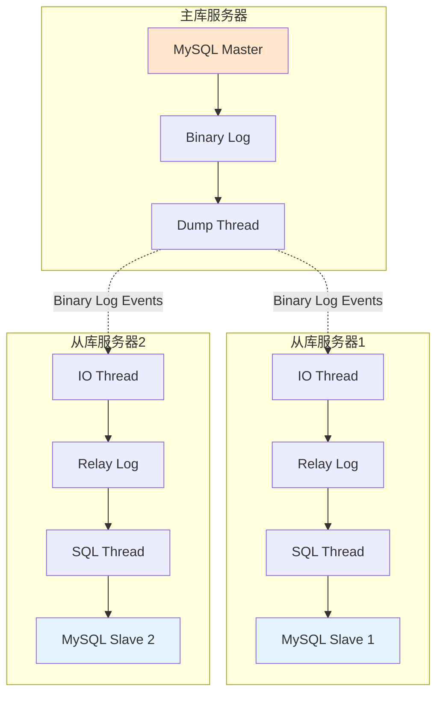
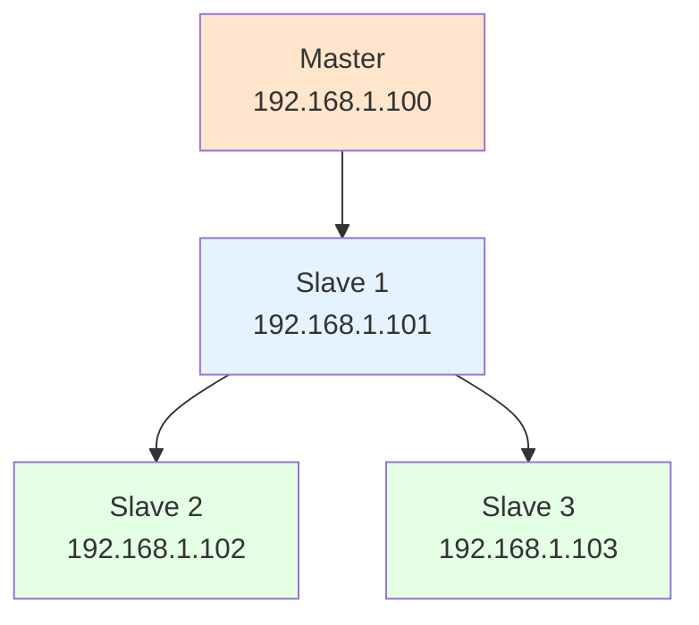

# 高级-主从复制

## 业务场景引入

某大型电商平台面临以下挑战：
- **读写分离需求**：大量查询操作影响写入性能，需要将读操作分离到从库
- **数据备份要求**：需要实时数据备份，确保数据安全
- **地域分布部署**：在不同城市部署读库，就近提供服务
- **高可用保障**：主库故障时能快速切换到从库继续服务

MySQL主从复制技术可以很好地解决这些问题，通过binlog实现数据的实时同步。

## 主从复制原理

### 复制架构图



### 复制过程详解

1. **主库写入**：应用程序向主库写入数据
2. **记录binlog**：主库将变更记录到二进制日志
3. **推送日志**：Dump线程将binlog事件推送给从库
4. **接收日志**：从库IO线程接收并写入relay log
5. **重放日志**：从库SQL线程读取relay log并执行SQL语句
6. **数据同步**：从库数据与主库保持一致

## 主从复制配置

### 主库配置

```ini
# /etc/my.cnf 主库配置
[mysqld]
# 服务器唯一标识
server-id = 1

# 启用二进制日志
log-bin = mysql-bin
binlog_format = ROW
max_binlog_size = 100M
expire_logs_days = 7

# GTID配置（推荐）
gtid_mode = ON
enforce_gtid_consistency = ON
log_slave_updates = ON

# 复制相关配置
sync_binlog = 1
innodb_flush_log_at_trx_commit = 1

# 复制过滤器（可选）
binlog_do_db = ecommerce
# binlog_ignore_db = test

# 自增ID配置（多主环境）
auto_increment_increment = 1
auto_increment_offset = 1

# 网络配置
bind-address = 0.0.0.0
port = 3306

# 性能优化
innodb_buffer_pool_size = 1G
innodb_log_file_size = 256M
```

### 从库配置

```ini
# /etc/my.cnf 从库配置
[mysqld]
# 服务器唯一标识（必须不同）
server-id = 2

# 启用中继日志
relay_log = mysql-relay-bin
relay_log_index = mysql-relay-bin.index
max_relay_log_size = 100M

# GTID配置
gtid_mode = ON
enforce_gtid_consistency = ON
log_slave_updates = ON

# 从库专用配置
read_only = ON
super_read_only = ON

# 复制过滤器
replicate_do_db = ecommerce
# replicate_ignore_db = test

# 并行复制（MySQL 5.7+）
slave_parallel_type = LOGICAL_CLOCK
slave_parallel_workers = 4
slave_preserve_commit_order = ON

# 复制安全配置
slave_type_conversions = ALL_NON_LOSSY
slave_sql_verify_checksum = ON
master_verify_checksum = ON

# 网络配置
bind-address = 0.0.0.0
port = 3306

# 性能优化
innodb_buffer_pool_size = 1G
```

### 复制用户创建

```sql
-- 在主库上创建复制用户
CREATE USER 'replication'@'192.168.1.%' IDENTIFIED BY 'ReplicationPass2024#';
GRANT REPLICATION SLAVE ON *.* TO 'replication'@'192.168.1.%';

-- 查看复制用户权限
SHOW GRANTS FOR 'replication'@'192.168.1.%';

-- 刷新权限
FLUSH PRIVILEGES;

-- 查看主库状态
SHOW MASTER STATUS;
```

## 配置复制关系

### 基于位置的复制

```sql
-- 在主库上锁定表并获取位置信息
FLUSH TABLES WITH READ LOCK;
SHOW MASTER STATUS;
-- 记录File和Position信息

-- 在从库上配置主从关系
CHANGE MASTER TO
    MASTER_HOST = '192.168.1.100',
    MASTER_PORT = 3306,
    MASTER_USER = 'replication',
    MASTER_PASSWORD = 'ReplicationPass2024#',
    MASTER_LOG_FILE = 'mysql-bin.000001',
    MASTER_LOG_POS = 154,
    MASTER_CONNECT_RETRY = 60;

-- 启动从库复制
START SLAVE;

-- 在主库上解锁
UNLOCK TABLES;

-- 检查从库状态
SHOW SLAVE STATUS\G
```

### 基于GTID的复制（推荐）

```sql
-- 在从库上配置GTID复制
CHANGE MASTER TO
    MASTER_HOST = '192.168.1.100',
    MASTER_PORT = 3306,
    MASTER_USER = 'replication',
    MASTER_PASSWORD = 'ReplicationPass2024#',
    MASTER_AUTO_POSITION = 1;

-- 启动从库复制
START SLAVE;

-- 检查复制状态
SHOW SLAVE STATUS\G

-- 查看GTID执行状态
SHOW GLOBAL VARIABLES LIKE 'gtid_executed';
```

## 复制监控与故障处理

### 复制状态监控

```sql
-- 详细检查从库状态
SHOW SLAVE STATUS\G

-- 关键指标说明：
-- Slave_IO_Running: Yes    # IO线程运行状态
-- Slave_SQL_Running: Yes   # SQL线程运行状态
-- Seconds_Behind_Master: 0 # 复制延迟（秒）
-- Last_IO_Error:           # IO错误信息
-- Last_SQL_Error:          # SQL错误信息

-- 查看复制性能指标
SELECT 
    CHANNEL_NAME,
    SERVICE_STATE,
    LAST_ERROR_MESSAGE,
    LAST_ERROR_TIMESTAMP
FROM performance_schema.replication_connection_status;

-- 查看复制延迟
SELECT 
    CHANNEL_NAME,
    COUNT_TRANSACTIONS_IN_QUEUE,
    COUNT_TRANSACTIONS_RETRIES,
    LAST_APPLIED_TRANSACTION_RETRIES_COUNT
FROM performance_schema.replication_applier_status_by_coordinator;
```

### 常见故障处理

```sql
-- 1. 复制中断处理
-- 查看错误信息
SHOW SLAVE STATUS\G

-- 跳过错误事务（谨慎使用）
STOP SLAVE;
SET GLOBAL sql_slave_skip_counter = 1;
START SLAVE;

-- 2. 主键冲突处理
-- 临时设置忽略主键错误
STOP SLAVE;
SET SESSION sql_slave_skip_counter = 1;
START SLAVE;

-- 或者设置忽略特定错误
STOP SLAVE;
SET GLOBAL slave_skip_errors = 1062,1032;
START SLAVE;

-- 3. 复制延迟处理
-- 检查网络延迟
SELECT 
    TIMER_WAIT/1000000000000 AS 'Seconds',
    EVENT_NAME
FROM performance_schema.events_waits_history 
WHERE EVENT_NAME LIKE 'wait/io/socket%'
ORDER BY TIMER_WAIT DESC LIMIT 10;

-- 调整并行复制参数
STOP SLAVE SQL_THREAD;
SET GLOBAL slave_parallel_workers = 8;
START SLAVE SQL_THREAD;
```

### 主从一致性检查

```sql
-- 创建数据一致性检查脚本
DELIMITER $$
CREATE PROCEDURE CheckReplicationConsistency()
BEGIN
    DECLARE done INT DEFAULT FALSE;
    DECLARE tbl_name VARCHAR(64);
    DECLARE tbl_schema VARCHAR(64);
    DECLARE master_checksum VARCHAR(32);
    DECLARE slave_checksum VARCHAR(32);
    
    DECLARE table_cursor CURSOR FOR
        SELECT table_schema, table_name 
        FROM information_schema.tables 
        WHERE table_schema = 'ecommerce' 
        AND table_type = 'BASE TABLE';
    
    DECLARE CONTINUE HANDLER FOR NOT FOUND SET done = TRUE;
    
    DROP TABLE IF EXISTS checksum_results;
    CREATE TABLE checksum_results (
        table_name VARCHAR(100),
        master_checksum VARCHAR(32),
        slave_checksum VARCHAR(32),
        is_consistent BOOLEAN,
        check_time TIMESTAMP DEFAULT CURRENT_TIMESTAMP
    );
    
    OPEN table_cursor;
    
    read_loop: LOOP
        FETCH table_cursor INTO tbl_schema, tbl_name;
        IF done THEN
            LEAVE read_loop;
        END IF;
        
        -- 计算主库校验和
        SET @sql = CONCAT('SELECT MD5(CONCAT_WS(",", *)) INTO @master_checksum FROM ', tbl_schema, '.', tbl_name);
        PREPARE stmt FROM @sql;
        EXECUTE stmt;
        DEALLOCATE PREPARE stmt;
        SET master_checksum = @master_checksum;
        
        -- 这里需要在从库上执行相同的查询获取slave_checksum
        -- 实际使用时需要通过外部脚本或工具实现
        
        INSERT INTO checksum_results (table_name, master_checksum, slave_checksum, is_consistent)
        VALUES (CONCAT(tbl_schema, '.', tbl_name), master_checksum, slave_checksum, 
                master_checksum = slave_checksum);
    END LOOP;
    
    CLOSE table_cursor;
    
    -- 显示检查结果
    SELECT * FROM checksum_results WHERE is_consistent = FALSE;
END$$
DELIMITER ;
```

## 高级复制架构

### 一主多从配置

```sql
-- 主库配置（192.168.1.100）
-- 使用前面的主库配置

-- 从库1配置（192.168.1.101）
server-id = 2
-- 从库2配置（192.168.1.102）
server-id = 3
-- 从库3配置（192.168.1.103）
server-id = 4

-- 在所有从库上配置复制
CHANGE MASTER TO
    MASTER_HOST = '192.168.1.100',
    MASTER_USER = 'replication',
    MASTER_PASSWORD = 'ReplicationPass2024#',
    MASTER_AUTO_POSITION = 1;

START SLAVE;
```

### 级联复制配置



```sql
-- 中继从库配置（Slave 1）
log_slave_updates = ON  -- 必须启用
read_only = ON

-- 下级从库配置指向中继从库
CHANGE MASTER TO
    MASTER_HOST = '192.168.1.101',  -- 指向中继从库
    MASTER_USER = 'replication',
    MASTER_PASSWORD = 'ReplicationPass2024#',
    MASTER_AUTO_POSITION = 1;
```

### 双主复制配置

```sql
-- Master 1 配置（192.168.1.100）
server-id = 1
auto_increment_increment = 2
auto_increment_offset = 1
log_slave_updates = ON

-- Master 2 配置（192.168.1.101）
server-id = 2
auto_increment_increment = 2
auto_increment_offset = 2
log_slave_updates = ON

-- 在Master 1上配置指向Master 2
CHANGE MASTER TO
    MASTER_HOST = '192.168.1.101',
    MASTER_USER = 'replication',
    MASTER_PASSWORD = 'ReplicationPass2024#',
    MASTER_AUTO_POSITION = 1;

-- 在Master 2上配置指向Master 1
CHANGE MASTER TO
    MASTER_HOST = '192.168.1.100',
    MASTER_USER = 'replication',
    MASTER_PASSWORD = 'ReplicationPass2024#',
    MASTER_AUTO_POSITION = 1;

-- 启动双向复制
START SLAVE;
```

## 复制性能优化

### 并行复制优化

```sql
-- MySQL 5.7+ 并行复制配置
SET GLOBAL slave_parallel_type = 'LOGICAL_CLOCK';
SET GLOBAL slave_parallel_workers = 4;
SET GLOBAL slave_preserve_commit_order = ON;

-- MySQL 8.0+ 增强并行复制
SET GLOBAL slave_parallel_type = 'LOGICAL_CLOCK';
SET GLOBAL slave_parallel_workers = 8;
SET GLOBAL binlog_transaction_dependency_tracking = 'WRITESET';
SET GLOBAL transaction_write_set_extraction = 'XXHASH64';
```

### 复制过滤优化

```sql
-- 表级复制过滤
CHANGE REPLICATION FILTER 
REPLICATE_DO_TABLE = (ecommerce.orders, ecommerce.order_items, ecommerce.products);

-- 数据库级复制过滤
CHANGE REPLICATION FILTER 
REPLICATE_DO_DB = (ecommerce, analytics);

-- 忽略特定表
CHANGE REPLICATION FILTER 
REPLICATE_IGNORE_TABLE = (ecommerce.temp_data, ecommerce.logs);
```

### 网络优化

```sql
-- 压缩复制流量
CHANGE MASTER TO MASTER_COMPRESSION_ALGORITHMS = 'zlib,lz4,zstd';

-- 调整复制心跳间隔
CHANGE MASTER TO MASTER_HEARTBEAT_PERIOD = 60;

-- 设置复制连接超时
CHANGE MASTER TO MASTER_CONNECT_RETRY = 60;
```

## 故障切换方案

### 手动故障切换

```bash
#!/bin/bash
# 主从切换脚本

OLD_MASTER="192.168.1.100"
NEW_MASTER="192.168.1.101"
SLAVES=("192.168.1.102" "192.168.1.103")

echo "Starting failover from $OLD_MASTER to $NEW_MASTER"

# 1. 停止应用写入
echo "Stop application writes to old master"

# 2. 确保所有从库同步完成
for slave in "${SLAVES[@]}"; do
    echo "Checking slave $slave synchronization"
    mysql -h$slave -e "SELECT MASTER_POS_WAIT('mysql-bin.000001', 12345, 300);"
done

# 3. 提升新主库
echo "Promoting $NEW_MASTER to master"
mysql -h$NEW_MASTER -e "
STOP SLAVE;
RESET SLAVE ALL;
SET GLOBAL read_only = OFF;
SET GLOBAL super_read_only = OFF;
"

# 4. 重新配置其他从库
for slave in "${SLAVES[@]}"; do
    if [ "$slave" != "$NEW_MASTER" ]; then
        echo "Reconfiguring slave $slave"
        mysql -h$slave -e "
        STOP SLAVE;
        CHANGE MASTER TO 
            MASTER_HOST = '$NEW_MASTER',
            MASTER_AUTO_POSITION = 1;
        START SLAVE;
        "
    fi
done

# 5. 更新应用配置
echo "Update application configuration to use $NEW_MASTER"

echo "Failover completed"
```

### 自动故障检测

```python
#!/usr/bin/env python3
import mysql.connector
import time
import smtplib
from email.mime.text import MIMEText

class MySQLReplicationMonitor:
    def __init__(self, master_host, slaves, monitor_interval=30):
        self.master_host = master_host
        self.slaves = slaves
        self.monitor_interval = monitor_interval
        
    def check_master_health(self):
        try:
            conn = mysql.connector.connect(
                host=self.master_host,
                user='monitor',
                password='monitor_pass',
                connection_timeout=5
            )
            cursor = conn.cursor()
            cursor.execute("SELECT 1")
            result = cursor.fetchone()
            conn.close()
            return True
        except Exception as e:
            print(f"Master health check failed: {e}")
            return False
    
    def check_slave_lag(self, slave_host):
        try:
            conn = mysql.connector.connect(
                host=slave_host,
                user='monitor',
                password='monitor_pass'
            )
            cursor = conn.cursor()
            cursor.execute("SHOW SLAVE STATUS")
            result = cursor.fetchone()
            if result:
                # Seconds_Behind_Master是结果中的一个字段
                lag = result[32]  # 根据实际位置调整
                return lag
            conn.close()
        except Exception as e:
            print(f"Slave lag check failed for {slave_host}: {e}")
            return None
    
    def send_alert(self, message):
        # 发送邮件告警
        msg = MIMEText(message)
        msg['Subject'] = 'MySQL Replication Alert'
        msg['From'] = 'monitor@company.com'
        msg['To'] = 'dba@company.com'
        
        try:
            server = smtplib.SMTP('smtp.company.com')
            server.send_message(msg)
            server.quit()
        except Exception as e:
            print(f"Failed to send alert: {e}")
    
    def monitor(self):
        while True:
            # 检查主库健康状态
            if not self.check_master_health():
                self.send_alert(f"Master {self.master_host} is down!")
            
            # 检查从库延迟
            for slave in self.slaves:
                lag = self.check_slave_lag(slave)
                if lag is not None and lag > 60:  # 延迟超过60秒告警
                    self.send_alert(f"Slave {slave} lag is {lag} seconds")
            
            time.sleep(self.monitor_interval)

if __name__ == "__main__":
    monitor = MySQLReplicationMonitor(
        master_host="192.168.1.100",
        slaves=["192.168.1.101", "192.168.1.102", "192.168.1.103"]
    )
    monitor.monitor()
```

## 读写分离实现

### ProxySQL配置

```sql
-- ProxySQL配置示例
-- 添加MySQL服务器
INSERT INTO mysql_servers(hostgroup_id, hostname, port, weight) VALUES
(0, '192.168.1.100', 3306, 1000),  -- 写组
(1, '192.168.1.101', 3306, 900),   -- 读组
(1, '192.168.1.102', 3306, 900),   -- 读组
(1, '192.168.1.103', 3306, 800);   -- 读组

-- 配置查询路由规则
INSERT INTO mysql_query_rules(rule_id, active, match_pattern, destination_hostgroup, apply) VALUES
(1, 1, '^SELECT.*', 1, 1),     -- 读请求路由到读组
(2, 1, '^INSERT.*', 0, 1),     -- 写请求路由到写组
(3, 1, '^UPDATE.*', 0, 1),
(4, 1, '^DELETE.*', 0, 1);

-- 加载配置
LOAD MYSQL SERVERS TO RUNTIME;
LOAD MYSQL QUERY RULES TO RUNTIME;
SAVE MYSQL SERVERS TO DISK;
SAVE MYSQL QUERY RULES TO DISK;
```

## 总结与最佳实践

### 复制部署建议

1. **配置规范**
   - 使用GTID模式，简化故障恢复
   - 启用半同步复制提高数据安全性
   - 合理配置并行复制提高性能

2. **监控告警**
   - 监控复制延迟和错误
   - 定期检查数据一致性
   - 建立自动故障检测机制

3. **性能优化**
   - 优化网络带宽和延迟
   - 合理配置复制过滤器
   - 调整binlog和relay log大小

4. **故障预案**
   - 制定详细的故障切换流程
   - 定期进行故障演练
   - 备份复制配置信息

MySQL主从复制是构建高可用数据库架构的基础技术，正确配置和管理对于保障业务连续性至关重要。