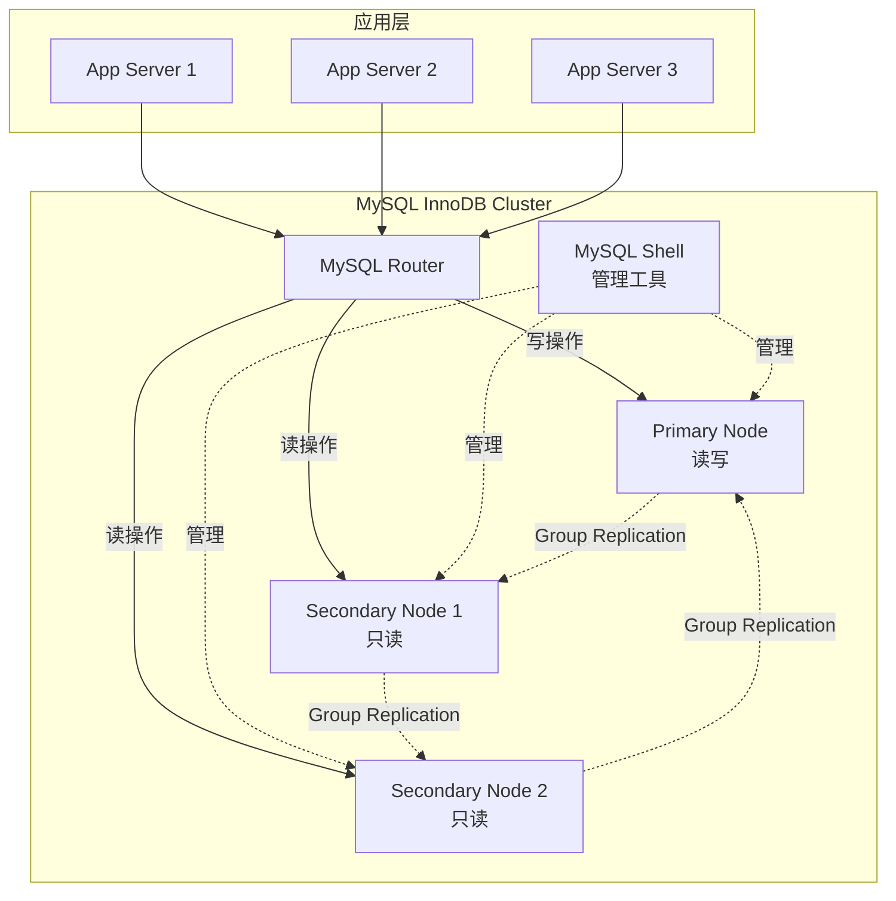
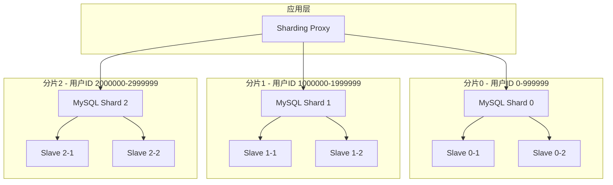

# 高级-集群与分片

## 业务场景引入

随着电商平台业务快速增长，单机MySQL面临挑战：
- **数据量爆炸**：用户表超过1亿条记录，单表查询缓慢
- **并发压力**：双十一期间数万QPS超出单机处理能力
- **存储瓶颈**：单机存储容量无法满足海量数据需求
- **可用性要求**：需要99.99%的服务可用性保障

MySQL集群与分片技术可以解决这些扩展性和可用性问题。

## MySQL集群方案

### MySQL InnoDB Cluster



#### InnoDB Cluster部署

```bash
# 1. 安装MySQL 8.0和MySQL Shell
sudo apt-get install mysql-server mysql-shell mysql-router

# 2. 配置实例
mysqlsh
# 连接到第一个节点
\connect root@mysql1:3306
# 检查实例配置
dba.checkInstanceConfiguration()
# 配置实例
dba.configureInstance()

# 3. 创建集群
cluster = dba.createCluster('prodCluster')

# 4. 添加实例到集群
cluster.addInstance('root@mysql2:3306')
cluster.addInstance('root@mysql3:3306')

# 5. 检查集群状态
cluster.status()

# 6. 配置MySQL Router
mysqlrouter --bootstrap root@mysql1:3306 --user=mysqlrouter
systemctl start mysqlrouter
```

### Galera Cluster配置

```ini
# /etc/mysql/mariadb.conf.d/galera.cnf
[galera]
wsrep_on = ON
wsrep_provider = /usr/lib/galera/libgalera_smm.so
wsrep_cluster_address = "gcomm://192.168.1.10,192.168.1.11,192.168.1.12"
binlog_format = row
default_storage_engine = InnoDB
innodb_autoinc_lock_mode = 2

# 节点特定配置
wsrep_node_address = "192.168.1.10"
wsrep_node_name = "galera-node1"
wsrep_cluster_name = "galera-cluster"

# SST方法
wsrep_sst_method = rsync
```

## 数据分片策略

### 水平分片（Sharding）



#### 分片规则设计

```sql
-- 用户表分片示例
-- 根据用户ID模运算分片
CREATE TABLE users_shard_0 (
    user_id BIGINT PRIMARY KEY,
    username VARCHAR(50),
    email VARCHAR(100),
    created_at TIMESTAMP
) ENGINE=InnoDB;

-- 分片函数
DELIMITER $$
CREATE FUNCTION get_shard_id(user_id BIGINT) 
RETURNS INT
READS SQL DATA
DETERMINISTIC
BEGIN
    RETURN user_id MOD 4;  -- 4个分片
END$$
DELIMITER ;

-- 订单表按时间分片
CREATE TABLE orders_202401 (
    order_id BIGINT PRIMARY KEY,
    user_id BIGINT,
    order_date DATE,
    total_amount DECIMAL(10,2)
) ENGINE=InnoDB;

CREATE TABLE orders_202402 (
    order_id BIGINT PRIMARY KEY,
    user_id BIGINT,
    order_date DATE,
    total_amount DECIMAL(10,2)
) ENGINE=InnoDB;
```

### 垂直分片策略

```sql
-- 用户基础信息表
CREATE TABLE user_basic (
    user_id BIGINT PRIMARY KEY,
    username VARCHAR(50),
    email VARCHAR(100),
    phone VARCHAR(20),
    created_at TIMESTAMP
) ENGINE=InnoDB;

-- 用户扩展信息表（低频访问）
CREATE TABLE user_profile (
    user_id BIGINT PRIMARY KEY,
    real_name VARCHAR(100),
    id_card VARCHAR(18),
    address TEXT,
    birth_date DATE,
    FOREIGN KEY (user_id) REFERENCES user_basic(user_id)
) ENGINE=InnoDB;

-- 用户统计信息表（高频更新）
CREATE TABLE user_statistics (
    user_id BIGINT PRIMARY KEY,
    login_count INT DEFAULT 0,
    last_login_at TIMESTAMP,
    total_orders INT DEFAULT 0,
    total_amount DECIMAL(12,2) DEFAULT 0,
    FOREIGN KEY (user_id) REFERENCES user_basic(user_id)
) ENGINE=InnoDB;
```

## 分片中间件

### ShardingSphere配置

```yaml
# application.yml
spring:
  shardingsphere:
    datasource:
      names: ds0,ds1,ds2,ds3
      ds0:
        type: com.zaxxer.hikari.HikariDataSource
        driver-class-name: com.mysql.cj.jdbc.Driver
        jdbc-url: jdbc:mysql://192.168.1.10:3306/ecommerce_shard_0
        username: app_user
        password: app_password
      ds1:
        type: com.zaxxer.hikari.HikariDataSource
        driver-class-name: com.mysql.cj.jdbc.Driver
        jdbc-url: jdbc:mysql://192.168.1.11:3306/ecommerce_shard_1
        username: app_user
        password: app_password
      ds2:
        type: com.zaxxer.hikari.HikariDataSource
        driver-class-name: com.mysql.cj.jdbc.Driver
        jdbc-url: jdbc:mysql://192.168.1.12:3306/ecommerce_shard_2
        username: app_user
        password: app_password
      ds3:
        type: com.zaxxer.hikari.HikariDataSource
        driver-class-name: com.mysql.cj.jdbc.Driver
        jdbc-url: jdbc:mysql://192.168.1.13:3306/ecommerce_shard_3
        username: app_user
        password: app_password
    
    rules:
      sharding:
        tables:
          users:
            actual-data-nodes: ds$->{0..3}.users
            table-strategy:
              standard:
                sharding-column: user_id
                sharding-algorithm-name: user_hash_mod
            key-generate-strategy:
              column: user_id
              key-generator-name: snowflake
          
          orders:
            actual-data-nodes: ds$->{0..3}.orders_$->{2024..2025}$->{01..12}
            database-strategy:
              standard:
                sharding-column: user_id
                sharding-algorithm-name: user_hash_mod
            table-strategy:
              standard:
                sharding-column: order_date
                sharding-algorithm-name: order_date_range
        
        sharding-algorithms:
          user_hash_mod:
            type: HASH_MOD
            props:
              sharding-count: 4
          order_date_range:
            type: INTERVAL
            props:
              datetime-pattern: yyyy-MM-dd
              datetime-lower: 2024-01-01
              datetime-upper: 2025-12-31
              sharding-suffix-pattern: yyyyMM
              datetime-interval-amount: 1
              datetime-interval-unit: MONTHS
        
        key-generators:
          snowflake:
            type: SNOWFLAKE
            props:
              worker-id: 1
```

### MyCat分片配置

```xml
<!-- schema.xml -->
<mycat:schema>
    <schema name="ecommerce" checkSQLschema="false" sqlMaxLimit="100">
        <!-- 分片表 -->
        <table name="users" dataNode="dn1,dn2,dn3,dn4" rule="user_hash_rule"/>
        <table name="orders" dataNode="dn1,dn2,dn3,dn4" rule="user_hash_rule"/>
        
        <!-- 全局表 -->
        <table name="products" dataNode="dn1,dn2,dn3,dn4" type="global"/>
        <table name="categories" dataNode="dn1,dn2,dn3,dn4" type="global"/>
    </schema>
    
    <dataNode name="dn1" dataHost="dh1" database="ecommerce_shard_0"/>
    <dataNode name="dn2" dataHost="dh2" database="ecommerce_shard_1"/>
    <dataNode name="dn3" dataHost="dh3" database="ecommerce_shard_2"/>
    <dataNode name="dn4" dataHost="dh4" database="ecommerce_shard_3"/>
    
    <dataHost name="dh1" maxCon="1000" minCon="10" balance="1" writeType="0">
        <heartbeat>select user()</heartbeat>
        <writeHost host="hostM1" url="192.168.1.10:3306" user="app_user" password="app_password">
            <readHost host="hostS1" url="192.168.1.14:3306" user="app_user" password="app_password"/>
        </writeHost>
    </dataHost>
</mycat:schema>

<!-- rule.xml -->
<mycat:rule>
    <tableRule name="user_hash_rule">
        <rule>
            <columns>user_id</columns>
            <algorithm>hash-int</algorithm>
        </rule>
    </tableRule>
    
    <function name="hash-int" class="io.mycat.route.function.PartitionByHashMod">
        <property name="count">4</property>
    </function>
</mycat:rule>
```

## 分布式事务处理

### XA事务实现

```java
@Service
@Transactional
public class DistributedOrderService {
    
    @Resource
    private DataSource shard0DataSource;
    
    @Resource
    private DataSource shard1DataSource;
    
    public void createDistributedOrder(Long userId, List<OrderItem> items) {
        // 分布式事务管理器
        UserTransaction userTransaction = getUserTransaction();
        
        try {
            userTransaction.begin();
            
            // 在用户所在分片创建订单
            int userShard = (int)(userId % 4);
            DataSource userDs = getDataSource(userShard);
            
            try (Connection conn = userDs.getConnection()) {
                // 创建订单主记录
                PreparedStatement ps = conn.prepareStatement(
                    "INSERT INTO orders (user_id, total_amount, order_date) VALUES (?, ?, ?)"
                );
                ps.setLong(1, userId);
                ps.setBigDecimal(2, calculateTotal(items));
                ps.setTimestamp(3, new Timestamp(System.currentTimeMillis()));
                ps.executeUpdate();
            }
            
            // 在商品分片更新库存
            for (OrderItem item : items) {
                int productShard = (int)(item.getProductId() % 4);
                DataSource productDs = getDataSource(productShard);
                
                try (Connection conn = productDs.getConnection()) {
                    PreparedStatement ps = conn.prepareStatement(
                        "UPDATE products SET stock = stock - ? WHERE product_id = ? AND stock >= ?"
                    );
                    ps.setInt(1, item.getQuantity());
                    ps.setLong(2, item.getProductId());
                    ps.setInt(3, item.getQuantity());
                    
                    int affected = ps.executeUpdate();
                    if (affected == 0) {
                        throw new InsufficientStockException("Stock not enough for product: " + item.getProductId());
                    }
                }
            }
            
            userTransaction.commit();
            
        } catch (Exception e) {
            try {
                userTransaction.rollback();
            } catch (SystemException se) {
                log.error("Failed to rollback transaction", se);
            }
            throw new OrderProcessingException("Failed to create distributed order", e);
        }
    }
}
```

### Saga模式实现

```java
@Component
public class OrderSagaOrchestrator {
    
    public void processOrder(OrderRequest request) {
        SagaTransaction saga = SagaTransaction.builder()
            .addStep(new CreateOrderStep(request))
            .addStep(new DeductInventoryStep(request))
            .addStep(new ProcessPaymentStep(request))
            .addStep(new UpdateUserBalanceStep(request))
            .build();
        
        try {
            saga.execute();
        } catch (Exception e) {
            saga.compensate();
            throw e;
        }
    }
    
    static class CreateOrderStep implements SagaStep {
        private OrderRequest request;
        
        @Override
        public void execute() {
            // 创建订单
            orderService.createOrder(request);
        }
        
        @Override
        public void compensate() {
            // 取消订单
            orderService.cancelOrder(request.getOrderId());
        }
    }
    
    static class DeductInventoryStep implements SagaStep {
        @Override
        public void execute() {
            // 扣减库存
            inventoryService.deductStock(request.getItems());
        }
        
        @Override
        public void compensate() {
            // 恢复库存
            inventoryService.restoreStock(request.getItems());
        }
    }
}
```

## 数据迁移与扩容

### 在线分片扩容

```python
#!/usr/bin/env python3
"""
在线数据迁移脚本
将4分片扩展到8分片
"""

import mysql.connector
import threading
import time
from typing import List, Dict

class ShardExpansion:
    def __init__(self, old_shards: List[str], new_shards: List[str]):
        self.old_shards = old_shards
        self.new_shards = new_shards
        self.migration_progress = {}
        
    def migrate_table(self, table_name: str, shard_key: str):
        """迁移单个表"""
        print(f"Starting migration for table: {table_name}")
        
        for old_shard_idx, old_shard in enumerate(self.old_shards):
            # 连接到源分片
            source_conn = mysql.connector.connect(**old_shard)
            cursor = source_conn.cursor()
            
            # 获取需要迁移的数据
            cursor.execute(f"""
                SELECT * FROM {table_name} 
                WHERE {shard_key} % 8 != {shard_key} % 4
            """)
            
            rows_to_migrate = cursor.fetchall()
            
            # 分批迁移数据
            batch_size = 1000
            for i in range(0, len(rows_to_migrate), batch_size):
                batch = rows_to_migrate[i:i + batch_size]
                self.migrate_batch(table_name, batch, shard_key)
                
                # 更新进度
                progress = (i + len(batch)) / len(rows_to_migrate) * 100
                print(f"Migration progress for {table_name} shard {old_shard_idx}: {progress:.2f}%")
            
            cursor.close()
            source_conn.close()
    
    def migrate_batch(self, table_name: str, batch: List, shard_key: str):
        """迁移数据批次"""
        for row in batch:
            # 计算新的分片位置
            shard_id = row[0] % 8  # 假设第一列是分片键
            target_shard = self.new_shards[shard_id]
            
            # 连接到目标分片
            target_conn = mysql.connector.connect(**target_shard)
            cursor = target_conn.cursor()
            
            try:
                # 插入数据到新分片
                placeholders = ','.join(['%s'] * len(row))
                cursor.execute(f"INSERT INTO {table_name} VALUES ({placeholders})", row)
                
                # 从原分片删除数据
                old_shard_id = row[0] % 4
                old_conn = mysql.connector.connect(**self.old_shards[old_shard_id])
                old_cursor = old_conn.cursor()
                old_cursor.execute(f"DELETE FROM {table_name} WHERE {shard_key} = %s", (row[0],))
                old_conn.commit()
                old_cursor.close()
                old_conn.close()
                
                target_conn.commit()
            except Exception as e:
                print(f"Error migrating row {row[0]}: {e}")
                target_conn.rollback()
            finally:
                cursor.close()
                target_conn.close()

# 使用示例
if __name__ == "__main__":
    old_shards = [
        {"host": "192.168.1.10", "database": "shard_0", "user": "app", "password": "pass"},
        {"host": "192.168.1.11", "database": "shard_1", "user": "app", "password": "pass"},
        {"host": "192.168.1.12", "database": "shard_2", "user": "app", "password": "pass"},
        {"host": "192.168.1.13", "database": "shard_3", "user": "app", "password": "pass"}
    ]
    
    new_shards = old_shards + [
        {"host": "192.168.1.14", "database": "shard_4", "user": "app", "password": "pass"},
        {"host": "192.168.1.15", "database": "shard_5", "user": "app", "password": "pass"},
        {"host": "192.168.1.16", "database": "shard_6", "user": "app", "password": "pass"},
        {"host": "192.168.1.17", "database": "shard_7", "user": "app", "password": "pass"}
    ]
    
    expansion = ShardExpansion(old_shards, new_shards)
    expansion.migrate_table("users", "user_id")
    expansion.migrate_table("orders", "user_id")
```

## 集群监控

### 集群状态监控

```sql
-- InnoDB Cluster状态监控
SELECT 
    MEMBER_ID,
    MEMBER_HOST,
    MEMBER_PORT,
    MEMBER_STATE,
    MEMBER_ROLE,
    MEMBER_VERSION
FROM performance_schema.replication_group_members;

-- 分片性能监控
SELECT 
    schema_name,
    COUNT(*) as connection_count,
    SUM(current_allocated) as total_memory_mb
FROM performance_schema.memory_summary_by_account_by_event_name m
JOIN information_schema.processlist p ON m.user = p.user
GROUP BY schema_name;

-- 跨分片查询性能
SELECT 
    digest_text,
    count_star,
    avg_timer_wait/1000000000000 as avg_time_sec,
    sum_rows_examined/count_star as avg_rows_examined
FROM performance_schema.events_statements_summary_by_digest
WHERE digest_text LIKE '%JOIN%'
ORDER BY avg_timer_wait DESC;
```

### 自动化运维脚本

```bash
#!/bin/bash
# MySQL集群健康检查脚本

CLUSTER_NODES=("192.168.1.10" "192.168.1.11" "192.168.1.12" "192.168.1.13")
ALERT_EMAIL="dba@company.com"
LOG_FILE="/var/log/mysql_cluster_health.log"

check_node_health() {
    local node=$1
    local result=$(mysql -h$node -u monitor -pmonitor_pass -e "SELECT 1" 2>/dev/null)
    
    if [ $? -eq 0 ]; then
        echo "$(date) - Node $node: HEALTHY" >> $LOG_FILE
        return 0
    else
        echo "$(date) - Node $node: FAILED" >> $LOG_FILE
        echo "MySQL cluster node $node is down" | mail -s "Cluster Alert" $ALERT_EMAIL
        return 1
    fi
}

check_replication_lag() {
    local node=$1
    local lag=$(mysql -h$node -u monitor -pmonitor_pass -e "SHOW SLAVE STATUS\G" | grep "Seconds_Behind_Master" | awk '{print $2}')
    
    if [ "$lag" != "NULL" ] && [ "$lag" -gt 60 ]; then
        echo "$(date) - Node $node: Replication lag is $lag seconds" >> $LOG_FILE
        echo "High replication lag on $node: $lag seconds" | mail -s "Replication Alert" $ALERT_EMAIL
    fi
}

# 主健康检查循环
for node in "${CLUSTER_NODES[@]}"; do
    check_node_health $node
    check_replication_lag $node
done

# 检查集群整体状态
healthy_nodes=0
for node in "${CLUSTER_NODES[@]}"; do
    if check_node_health $node; then
        ((healthy_nodes++))
    fi
done

if [ $healthy_nodes -lt 2 ]; then
    echo "Critical: Only $healthy_nodes nodes are healthy" | mail -s "Cluster Critical Alert" $ALERT_EMAIL
fi
```

## 总结与最佳实践

### 架构选择建议

1. **数据量场景**
   - 小于1TB：单机MySQL + 读写分离
   - 1TB-10TB：分库分表 + 中间件
   - 大于10TB：分布式数据库或NewSQL

2. **业务特点考虑**
   - OLTP场景：优先考虑分片
   - OLAP场景：考虑数据仓库方案
   - 混合场景：CQRS分离架构

3. **一致性要求**
   - 强一致性：单机事务或2PC
   - 最终一致性：Saga模式
   - 会话一致性：应用层控制

### 运维管理要点

- 建立完善的监控告警体系
- 制定详细的扩容和故障处理流程
- 定期进行容灾演练
- 优化跨分片查询性能
- 做好数据备份和恢复方案

MySQL集群与分片是解决大规模数据处理的重要技术，需要根据业务特点选择合适的方案并做好运维管理。