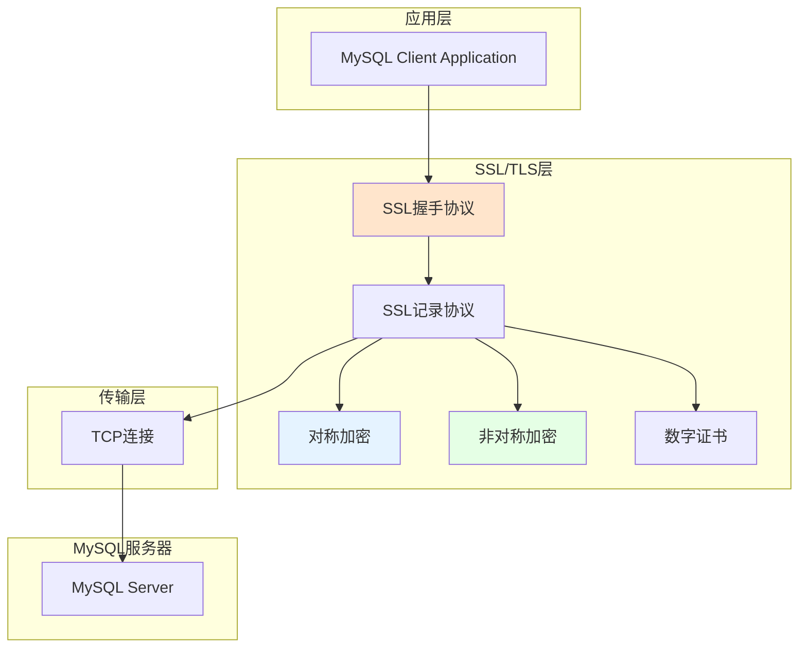
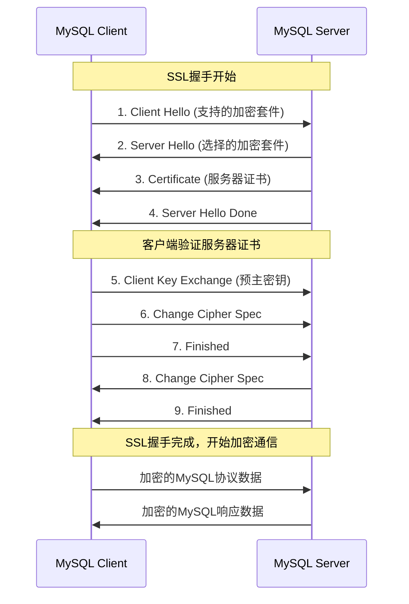

# MySQL高级-SSL安全认证

## 业务场景引入

在金融、医疗等对数据安全要求极高的行业中，数据传输的安全性至关重要：
- **数据传输加密**：防止网络窃听和中间人攻击
- **身份验证**：确保客户端和服务器的身份合法性
- **合规要求**：满足PCI DSS、HIPAA等合规标准
- **企业安全策略**：内部安全审计要求所有数据库连接必须加密

如果用户的传输不是通过SSL的方式，那么其在网络中数据都是以明文进行传输的，而这给别有用心的人带来了可乘之机。SSL提供数据加密、身份验证和消息完整性验证机制。

## SSL原理与安全机制

### SSL/TLS协议层次



### SSL握手过程



## MySQL SSL配置实战

### 服务器端SSL配置

在MySQL 5.7+版本中，SSL功能默认启用，安装时会自动生成SSL证书：

```bash
# 检查SSL文件是否存在
ls -la /var/lib/mysql/*.pem

# 输出示例：
# -rw------- 1 mysql mysql 1675 ca-key.pem         # CA私钥
# -rw-r--r-- 1 mysql mysql 1074 ca.pem             # 自签的CA证书
# -rw-r--r-- 1 mysql mysql 1078 client-cert.pem    # 客户端证书
# -rw------- 1 mysql mysql 1675 client-key.pem     # 客户端私钥
# -rw------- 1 mysql mysql 1675 private_key.pem    # 服务器私钥
# -rw-r--r-- 1 mysql mysql 451  public_key.pem     # 服务器公钥
# -rw-r--r-- 1 mysql mysql 1078 server-cert.pem    # 服务器证书
# -rw------- 1 mysql mysql 1675 server-key.pem     # 服务器私钥
```

#### my.cnf SSL配置

```ini
[mysqld]
# SSL基础配置
ssl_cert = /var/lib/mysql/server-cert.pem
ssl_key = /var/lib/mysql/server-key.pem
ssl_ca = /var/lib/mysql/ca.pem

# 客户端证书配置（可选）
ssl_capath = /var/lib/mysql/
ssl_crl = /var/lib/mysql/crl.pem
ssl_crlpath = /var/lib/mysql/crl/

# SSL加密套件配置
ssl_cipher = 'ECDHE-RSA-AES128-GCM-SHA256:ECDHE-RSA-AES256-GCM-SHA384'
tls_version = 'TLSv1.2,TLSv1.3'

# 强制SSL连接（可选）
require_secure_transport = ON

# SSL性能优化
ssl_fips_mode = OFF
```

#### 验证SSL配置

```sql
-- 查看SSL状态
SHOW VARIABLES LIKE 'have_ssl';
-- 输出：have_ssl | YES

-- 查看SSL配置信息
SHOW VARIABLES LIKE 'ssl_%';

-- 查看当前连接的SSL信息
SHOW STATUS LIKE 'Ssl_cipher';
SHOW STATUS LIKE 'Ssl_version';

-- 查看SSL证书信息
SELECT 
    @@ssl_cert AS server_cert,
    @@ssl_key AS server_key,
    @@ssl_ca AS ca_cert;
```

### 生产环境证书配置

#### 使用自签名证书

```bash
#!/bin/bash
# 生产环境SSL证书生成脚本

SSL_DIR="/etc/mysql/ssl"
mkdir -p $SSL_DIR
cd $SSL_DIR

# 1. 生成CA私钥
openssl genrsa -out ca-key.pem 4096

# 2. 生成CA证书
openssl req -new -x509 -nodes -days 365000 -key ca-key.pem -out ca.pem \
    -subj "/C=CN/ST=Beijing/L=Beijing/O=Company/OU=IT Department/CN=MySQL CA"

# 3. 生成服务器私钥
openssl genrsa -out server-key.pem 4096

# 4. 生成服务器证书签名请求
openssl req -new -key server-key.pem -out server.csr \
    -subj "/C=CN/ST=Beijing/L=Beijing/O=Company/OU=IT Department/CN=mysql.company.com"

# 5. 使用CA签名生成服务器证书
openssl x509 -req -in server.csr -CA ca.pem -CAkey ca-key.pem \
    -CAcreateserial -out server-cert.pem -days 365000 \
    -extensions v3_req -extfile <(
cat <<EOF
[v3_req]
basicConstraints = CA:FALSE
keyUsage = nonRepudiation, digitalSignature, keyEncipherment
subjectAltName = @alt_names

[alt_names]
DNS.1 = mysql.company.com
DNS.2 = mysql-master.company.com
DNS.3 = mysql-slave.company.com
IP.1 = 192.168.1.100
IP.2 = 192.168.1.101
EOF
)

# 6. 生成客户端私钥
openssl genrsa -out client-key.pem 4096

# 7. 生成客户端证书签名请求
openssl req -new -key client-key.pem -out client.csr \
    -subj "/C=CN/ST=Beijing/L=Beijing/O=Company/OU=IT Department/CN=mysql-client"

# 8. 使用CA签名生成客户端证书
openssl x509 -req -in client.csr -CA ca.pem -CAkey ca-key.pem \
    -CAcreateserial -out client-cert.pem -days 365000

# 9. 验证证书
openssl verify -CAfile ca.pem server-cert.pem client-cert.pem

# 10. 设置文件权限
chown mysql:mysql *.pem
chmod 600 *-key.pem
chmod 644 *.pem

# 11. 清理临时文件
rm server.csr client.csr

echo "SSL certificates generated successfully in $SSL_DIR"
```

#### 企业CA证书配置

```bash
# 使用企业CA签发的证书
# 1. 获取企业CA根证书
wget https://ca.company.com/root-ca.crt -O /etc/mysql/ssl/ca.pem

# 2. 申请MySQL服务器证书
# 通过企业内部证书申请流程获取：
# - server-cert.pem (服务器证书)
# - server-key.pem (服务器私钥)

# 3. 配置MySQL使用企业证书
# 在my.cnf中指向企业证书路径
```

## 客户端SSL连接

### 命令行客户端连接

```bash
# 基本SSL连接
mysql --ssl-mode=REQUIRED -h mysql.company.com -u app_user -p

# 指定SSL配置文件
mysql --defaults-file=/etc/mysql/client-ssl.cnf -h mysql.company.com -u app_user -p

# 完整SSL客户端验证
mysql \
    --ssl-mode=VERIFY_IDENTITY \
    --ssl-ca=/etc/mysql/ssl/ca.pem \
    --ssl-cert=/etc/mysql/ssl/client-cert.pem \
    --ssl-key=/etc/mysql/ssl/client-key.pem \
    -h mysql.company.com -u app_user -p

# 检查SSL连接状态
mysql> SHOW STATUS LIKE 'Ssl_cipher';
mysql> SELECT * FROM performance_schema.session_status WHERE VARIABLE_NAME LIKE 'Ssl%';
```

#### 客户端配置文件

```ini
# /etc/mysql/client-ssl.cnf
[client]
ssl-mode = VERIFY_IDENTITY
ssl-ca = /etc/mysql/ssl/ca.pem
ssl-cert = /etc/mysql/ssl/client-cert.pem
ssl-key = /etc/mysql/ssl/client-key.pem

# SSL协议版本
tls-version = TLSv1.2,TLSv1.3

# 指定服务器名称（SNI）
ssl-fips-mode = OFF
```

### 应用程序SSL配置

#### Java应用配置

```java
// JDBC连接字符串配置
String jdbcUrl = "jdbc:mysql://mysql.company.com:3306/ecommerce" +
    "?useSSL=true" +
    "&verifyServerCertificate=true" +
    "&trustCertificateKeyStoreUrl=file:/etc/mysql/ssl/truststore.jks" +
    "&trustCertificateKeyStorePassword=changeit" +
    "&clientCertificateKeyStoreUrl=file:/etc/mysql/ssl/keystore.jks" +
    "&clientCertificateKeyStorePassword=changeit";

// Spring Boot配置
@Configuration
public class DatabaseConfig {
    
    @Bean
    @Primary
    public DataSource dataSource() {
        HikariConfig config = new HikariConfig();
        config.setJdbcUrl("jdbc:mysql://mysql.company.com:3306/ecommerce");
        config.setUsername("app_user");
        config.setPassword("secure_password");
        
        // SSL配置
        config.addDataSourceProperty("useSSL", "true");
        config.addDataSourceProperty("verifyServerCertificate", "true");
        config.addDataSourceProperty("trustCertificateKeyStoreUrl", 
            "file:/etc/mysql/ssl/truststore.jks");
        config.addDataSourceProperty("trustCertificateKeyStorePassword", "changeit");
        
        // 连接池配置
        config.setMaximumPoolSize(20);
        config.setMinimumIdle(5);
        config.setConnectionTimeout(30000);
        
        return new HikariDataSource(config);
    }
}

// 生成Java KeyStore
// keytool -importcert -alias mysql-ca -file ca.pem -keystore truststore.jks -storepass changeit
```

#### Python应用配置

```python
import mysql.connector
import ssl

# SSL配置
ssl_config = {
    'ca': '/etc/mysql/ssl/ca.pem',
    'cert': '/etc/mysql/ssl/client-cert.pem',
    'key': '/etc/mysql/ssl/client-key.pem',
    'verify_cert': True,
    'verify_identity': True,
    'check_hostname': True
}

# 创建SSL连接
try:
    connection = mysql.connector.connect(
        host='mysql.company.com',
        port=3306,
        user='app_user',
        password='secure_password',
        database='ecommerce',
        ssl_disabled=False,
        ssl_verify_cert=True,
        ssl_verify_identity=True,
        ssl_ca='/etc/mysql/ssl/ca.pem',
        ssl_cert='/etc/mysql/ssl/client-cert.pem',
        ssl_key='/etc/mysql/ssl/client-key.pem'
    )
    
    # 验证SSL连接
    cursor = connection.cursor()
    cursor.execute("SHOW STATUS LIKE 'Ssl_cipher'")
    ssl_cipher = cursor.fetchone()
    print(f"SSL Cipher: {ssl_cipher[1]}")
    
except mysql.connector.Error as err:
    print(f"SSL connection failed: {err}")
finally:
    if connection.is_connected():
        connection.close()
```

## 用户SSL策略配置

### 强制用户使用SSL

```sql
-- 创建强制SSL用户
CREATE USER 'secure_user'@'%' 
IDENTIFIED BY 'SecurePassword2024#' 
REQUIRE SSL;

-- 要求特定的SSL配置
CREATE USER 'admin_user'@'10.0.1.%' 
IDENTIFIED BY 'AdminPassword2024#'
REQUIRE SSL 
AND SUBJECT '/C=CN/ST=Beijing/L=Beijing/O=Company/CN=admin'
AND ISSUER '/C=CN/ST=Beijing/L=Beijing/O=Company/CN=MySQL CA';

-- 要求特定的加密套件
CREATE USER 'crypto_user'@'%' 
IDENTIFIED BY 'CryptoPassword2024#'
REQUIRE SSL 
AND CIPHER 'AES256-SHA';

-- 查看用户SSL要求
SELECT 
    user, 
    host, 
    ssl_type, 
    ssl_cipher, 
    x509_issuer, 
    x509_subject 
FROM mysql.user 
WHERE ssl_type != '';

-- 修改现有用户SSL要求
ALTER USER 'app_user'@'%' REQUIRE SSL;

-- 取消SSL要求
ALTER USER 'test_user'@'localhost' REQUIRE NONE;
```

### SSL权限分级管理

```sql
-- 高安全级别用户（双向认证）
CREATE USER 'financial_app'@'%' 
IDENTIFIED BY 'FinancialApp2024#'
REQUIRE X509;

-- 中等安全级别用户（SSL + 特定来源）
CREATE USER 'business_app'@'192.168.1.%' 
IDENTIFIED BY 'BusinessApp2024#'
REQUIRE SSL;

-- 内网用户（可选SSL）
CREATE USER 'internal_user'@'10.0.0.%' 
IDENTIFIED BY 'InternalUser2024#';

-- 监控SSL连接状态
CREATE VIEW ssl_connections AS
SELECT 
    p.id,
    p.user,
    p.host,
    p.db,
    s.variable_value AS ssl_cipher,
    s2.variable_value AS ssl_version
FROM information_schema.processlist p
LEFT JOIN performance_schema.session_status s 
    ON p.id = s.processlist_id AND s.variable_name = 'Ssl_cipher'
LEFT JOIN performance_schema.session_status s2 
    ON p.id = s2.processlist_id AND s2.variable_name = 'Ssl_version'
WHERE p.user NOT IN ('root', 'mysql.session', 'mysql.sys');

-- 查看SSL连接统计
SELECT COUNT(*) as total_connections,
       SUM(CASE WHEN ssl_cipher IS NOT NULL THEN 1 ELSE 0 END) as ssl_connections,
       ROUND(SUM(CASE WHEN ssl_cipher IS NOT NULL THEN 1 ELSE 0 END) * 100.0 / COUNT(*), 2) as ssl_percentage
FROM ssl_connections;
```

## SSL性能优化

### 加密套件优化

```sql
-- 查看支持的加密套件
SHOW STATUS LIKE 'Ssl_cipher_list';

-- 配置高性能加密套件
SET GLOBAL ssl_cipher = 'ECDHE-RSA-AES128-GCM-SHA256:ECDHE-RSA-AES256-GCM-SHA384:ECDHE-RSA-CHACHA20-POLY1305';

-- 禁用较弱的加密算法
SET GLOBAL ssl_cipher = '!aNULL:!eNULL:!EXPORT:!DES:!RC4:!MD5:!PSK:!SRP:!CAMELLIA';
```

### SSL会话重用

```ini
# my.cnf SSL性能配置
[mysqld]
# SSL会话缓存
ssl_session_cache_mode = ON
ssl_session_cache_timeout = 300

# SSL会话票据
ssl_session_tickets = ON

# TLS版本优化
tls_version = TLSv1.2,TLSv1.3

# 禁用不必要的SSL功能
ssl_fips_mode = OFF
```

### 性能监控

```sql
-- SSL性能统计
SELECT 
    VARIABLE_NAME,
    VARIABLE_VALUE
FROM performance_schema.global_status 
WHERE VARIABLE_NAME LIKE 'Ssl_%'
ORDER BY VARIABLE_NAME;

-- SSL连接时间分析
SELECT 
    EVENT_NAME,
    COUNT_STAR,
    SUM_TIMER_WAIT/1000000000000 as total_time_sec,
    AVG_TIMER_WAIT/1000000000000 as avg_time_sec
FROM performance_schema.events_waits_summary_global_by_event_name 
WHERE EVENT_NAME LIKE '%ssl%' 
ORDER BY SUM_TIMER_WAIT DESC;
```

## SSL故障排查

### 常见SSL问题

```bash
# 1. 检查SSL证书有效性
openssl x509 -in /var/lib/mysql/server-cert.pem -text -noout
openssl x509 -in /var/lib/mysql/server-cert.pem -dates -noout

# 2. 验证证书链
openssl verify -CAfile /var/lib/mysql/ca.pem /var/lib/mysql/server-cert.pem

# 3. 测试SSL连接
openssl s_client -connect mysql.company.com:3306 -servername mysql.company.com

# 4. 检查证书匹配
openssl x509 -noout -modulus -in /var/lib/mysql/server-cert.pem | openssl md5
openssl rsa -noout -modulus -in /var/lib/mysql/server-key.pem | openssl md5

# 5. 证书权限检查
ls -la /var/lib/mysql/*.pem
# 确保MySQL用户有读取权限，私钥文件权限为600
```

### SSL错误处理

```sql
-- 常见SSL错误及解决方案

-- 错误1: SSL connection error: protocol version mismatch
-- 解决: 检查tls_version配置，确保客户端和服务器TLS版本兼容
SHOW VARIABLES LIKE 'tls_version';

-- 错误2: SSL certificate verification failed
-- 解决: 检查证书链和CA证书
SELECT @@ssl_ca, @@ssl_cert, @@ssl_key;

-- 错误3: SSL is required but the server doesn't support it
-- 解决: 检查服务器SSL配置
SHOW VARIABLES LIKE 'have_ssl';

-- 错误4: Access denied (using password: YES)
-- 解决: 检查用户SSL要求
SELECT user, host, ssl_type FROM mysql.user WHERE user = 'username';
```

### SSL调试工具

```bash
#!/bin/bash
# MySQL SSL诊断脚本

echo "=== MySQL SSL Configuration Check ==="

# 检查MySQL服务器SSL状态
mysql -e "SHOW VARIABLES LIKE 'have_ssl';"
mysql -e "SHOW VARIABLES LIKE 'ssl_%';"

# 检查SSL证书文件
SSL_DIR="/var/lib/mysql"
for cert in ca.pem server-cert.pem client-cert.pem; do
    if [ -f "$SSL_DIR/$cert" ]; then
        echo "Certificate: $cert"
        openssl x509 -in "$SSL_DIR/$cert" -noout -dates
        openssl x509 -in "$SSL_DIR/$cert" -noout -subject
        openssl x509 -in "$SSL_DIR/$cert" -noout -issuer
        echo "---"
    fi
done

# 检查证书权限
ls -la $SSL_DIR/*.pem

# 测试SSL连接
echo "Testing SSL connection..."
mysql --ssl-mode=REQUIRED -e "SHOW STATUS LIKE 'Ssl_cipher';"

echo "=== SSL Diagnosis Complete ==="
```

## 总结与最佳实践

### SSL安全配置建议

1. **证书管理**
   - 使用足够长的密钥长度（至少2048位RSA或256位ECC）
   - 定期更新证书，设置合理的有效期
   - 使用可信CA签发的证书（生产环境）
   - 安全存储私钥文件，设置适当的文件权限

2. **加密配置**
   - 禁用弱加密算法和协议
   - 使用强加密套件（AES-GCM、ChaCha20等）
   - 启用TLS 1.2和1.3，禁用旧版本

3. **访问控制**
   - 根据用户角色设置不同的SSL要求
   - 敏感操作强制使用双向认证
   - 监控非SSL连接并及时告警

4. **性能优化**
   - 启用SSL会话重用
   - 选择高性能的加密算法
   - 监控SSL连接性能指标

### 合规性考虑

- **PCI DSS要求**：信用卡数据传输必须加密
- **GDPR合规**：个人数据传输需要适当保护
- **行业标准**：金融、医疗行业的特殊安全要求
- **内部审计**：建立SSL使用率监控和审计机制

SSL安全认证是保护MySQL数据传输安全的重要措施，合理配置SSL不仅能提高数据安全性，还能满足各种合规要求。