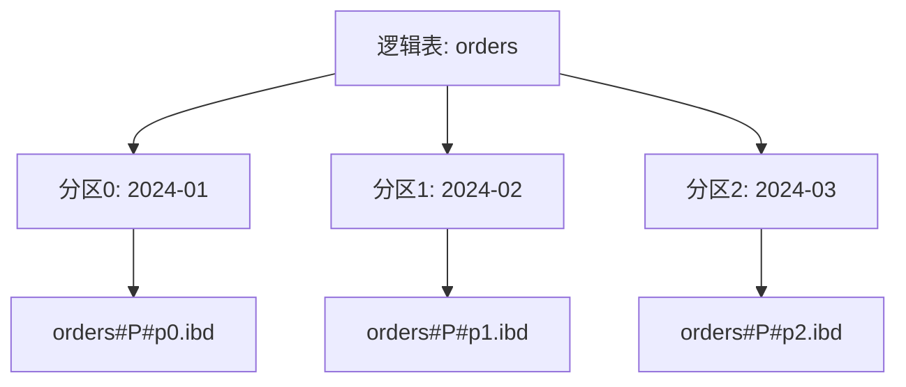

# MySQL高级-分区表技术

## 业务场景引入

大数据场景下单表数据量过大会带来性能问题：
- **订单表**：每天百万级订单，历史数据查询缓慢
- **日志表**：系统日志持续增长，需要定期清理
- **用户行为表**：按地区分布的数据查询频率不同
- **交易记录**：按月归档，历史查询需求差异大

MySQL分区表通过将大表拆分为多个物理分区，提升查询性能和管理效率。

## 分区表原理

### 分区架构



**分区裁剪**：查询时只扫描相关分区，跳过无关分区，大幅提升性能。

## 分区类型实战

### RANGE分区（按范围）

```sql
-- 按月份分区的订单表
CREATE TABLE orders_range (
    order_id BIGINT NOT NULL AUTO_INCREMENT,
    order_no VARCHAR(32) NOT NULL,
    user_id BIGINT NOT NULL,
    order_date DATE NOT NULL,
    total_amount DECIMAL(12,2) NOT NULL,
    order_status ENUM('PENDING', 'PAID', 'SHIPPED', 'DELIVERED') NOT NULL,
    
    PRIMARY KEY (order_id, order_date),
    KEY idx_user_date (user_id, order_date)
) ENGINE=InnoDB
PARTITION BY RANGE (YEAR(order_date) * 100 + MONTH(order_date)) (
    PARTITION p202401 VALUES LESS THAN (202402),
    PARTITION p202402 VALUES LESS THAN (202403),
    PARTITION p202403 VALUES LESS THAN (202404),
    PARTITION p202404 VALUES LESS THAN (202405),
    PARTITION p_future VALUES LESS THAN MAXVALUE
);
```

### LIST分区（按列表值）

```sql
-- 按地区分区的用户表
CREATE TABLE users_list (
    user_id BIGINT NOT NULL AUTO_INCREMENT,
    username VARCHAR(50) NOT NULL,
    region_code VARCHAR(10) NOT NULL,
    registration_date DATE NOT NULL,
    
    PRIMARY KEY (user_id, region_code),
    KEY idx_registration (registration_date)
) ENGINE=InnoDB
PARTITION BY LIST COLUMNS(region_code) (
    PARTITION p_north VALUES IN ('BJ', 'TJ', 'HE', 'SX'),     -- 华北
    PARTITION p_east VALUES IN ('SH', 'JS', 'ZJ', 'SD'),      -- 华东
    PARTITION p_south VALUES IN ('GD', 'GX', 'HN', 'HI'),     -- 华南
    PARTITION p_other VALUES IN ('TW', 'HK', 'OVERSEA')       -- 其他
);
```

### HASH分区（按哈希值）

```sql
-- 按用户ID哈希分区
CREATE TABLE user_activities (
    activity_id BIGINT NOT NULL AUTO_INCREMENT,
    user_id BIGINT NOT NULL,
    activity_type VARCHAR(50) NOT NULL,
    activity_data JSON,
    created_at TIMESTAMP DEFAULT CURRENT_TIMESTAMP,
    
    PRIMARY KEY (activity_id, user_id),
    KEY idx_user_type (user_id, activity_type)
) ENGINE=InnoDB
PARTITION BY HASH(user_id)
PARTITIONS 16;  -- 16个分区，数据均匀分布
```

### 子分区（复合分区）

```sql
-- RANGE-HASH复合分区
CREATE TABLE sales_data (
    sale_id BIGINT NOT NULL AUTO_INCREMENT,
    sale_date DATE NOT NULL,
    region_id INT NOT NULL,
    amount DECIMAL(12,2) NOT NULL,
    
    PRIMARY KEY (sale_id, sale_date, region_id)
) ENGINE=InnoDB
PARTITION BY RANGE (YEAR(sale_date))
SUBPARTITION BY HASH(region_id)
SUBPARTITIONS 4 (
    PARTITION p2023 VALUES LESS THAN (2024),
    PARTITION p2024 VALUES LESS THAN (2025),
    PARTITION p_future VALUES LESS THAN MAXVALUE
);
```

## 分区管理操作

### 查看分区信息

```sql
-- 查看分区详情
SELECT 
    table_name,
    partition_name,
    partition_method,
    partition_expression,
    table_rows,
    ROUND(data_length/1024/1024, 2) AS data_mb
FROM information_schema.partitions 
WHERE table_schema = 'ecommerce' 
  AND table_name = 'orders_range'
ORDER BY partition_ordinal_position;
```

### 分区维护操作

```sql
-- 添加新分区
ALTER TABLE orders_range 
ADD PARTITION (
    PARTITION p202405 VALUES LESS THAN (202406)
);

-- 删除旧分区
ALTER TABLE orders_range DROP PARTITION p202401;

-- 重组分区
ALTER TABLE orders_range 
REORGANIZE PARTITION p_future INTO (
    PARTITION p202406 VALUES LESS THAN (202407),
    PARTITION p_future VALUES LESS THAN MAXVALUE
);

-- 交换分区数据
CREATE TABLE orders_backup LIKE orders_range;
ALTER TABLE orders_backup REMOVE PARTITIONING;
ALTER TABLE orders_range EXCHANGE PARTITION p202403 WITH TABLE orders_backup;
```

## 查询优化

### 分区裁剪分析

```sql
-- 查看执行计划中的分区使用情况
EXPLAIN PARTITIONS
SELECT * FROM orders_range 
WHERE order_date BETWEEN '2024-02-01' AND '2024-02-29';

-- ✅ 好的查询（使用分区键）
SELECT * FROM orders_range 
WHERE order_date >= '2024-02-01' 
  AND order_date < '2024-03-01'
  AND user_id = 1001;

-- ❌ 避免的查询（无法分区裁剪）
SELECT * FROM orders_range WHERE user_id = 1001;  -- 全分区扫描
```

### 聚合查询优化

```sql
-- 跨分区聚合查询
SELECT 
    DATE_FORMAT(order_date, '%Y-%m') AS month,
    COUNT(*) AS order_count,
    SUM(total_amount) AS revenue
FROM orders_range 
WHERE order_date >= '2024-01-01' 
  AND order_date < '2024-07-01'
GROUP BY DATE_FORMAT(order_date, '%Y-%m');
```

## 自动化维护

### Python分区管理脚本

```python
import mysql.connector
import datetime

class PartitionManager:
    def __init__(self, db_config):
        self.db_config = db_config
        
    def add_future_partitions(self, table_name, months_ahead=3):
        """添加未来分区"""
        conn = mysql.connector.connect(**self.db_config)
        cursor = conn.cursor()
        
        try:
            current_date = datetime.datetime.now()
            for i in range(1, months_ahead + 1):
                future_date = current_date + datetime.timedelta(days=30 * i)
                partition_name = f"p{future_date.strftime('%Y%m')}"
                partition_value = f"{future_date.year * 100 + future_date.month + 1}"
                
                sql = f"""
                ALTER TABLE {table_name} 
                ADD PARTITION (PARTITION {partition_name} VALUES LESS THAN ({partition_value}))
                """
                cursor.execute(sql)
                print(f"Added partition {partition_name}")
            
            conn.commit()
        except Exception as e:
            print(f"Error: {e}")
            conn.rollback()
        finally:
            cursor.close()
            conn.close()
    
    def drop_old_partitions(self, table_name, retain_months=12):
        """删除过期分区"""
        conn = mysql.connector.connect(**self.db_config)
        cursor = conn.cursor()
        
        try:
            cutoff_date = datetime.datetime.now() - datetime.timedelta(days=30 * retain_months)
            cutoff_value = cutoff_date.year * 100 + cutoff_date.month
            
            cursor.execute("""
                SELECT partition_name 
                FROM information_schema.partitions 
                WHERE table_schema = %s AND table_name = %s 
                AND partition_name LIKE 'p%'
                AND CAST(SUBSTRING(partition_name, 2) AS UNSIGNED) < %s
            """, (self.db_config['database'], table_name, cutoff_value))
            
            old_partitions = [row[0] for row in cursor.fetchall()]
            
            for partition in old_partitions:
                cursor.execute(f"ALTER TABLE {table_name} DROP PARTITION {partition}")
                print(f"Dropped partition {partition}")
            
            conn.commit()
        except Exception as e:
            print(f"Error: {e}")
            conn.rollback()
        finally:
            cursor.close()
            conn.close()

# 使用示例
db_config = {
    'host': 'localhost',
    'user': 'admin',
    'password': 'password',
    'database': 'ecommerce'
}

manager = PartitionManager(db_config)
manager.add_future_partitions('orders_range', 3)
manager.drop_old_partitions('orders_range', 12)
```

### 定时维护脚本

```bash
#!/bin/bash
# MySQL分区维护定时任务

MYSQL_USER="admin"
MYSQL_PASS="password"
MYSQL_DB="ecommerce"

# 添加未来分区
add_partitions() {
    python3 /usr/local/bin/partition_manager.py --add-future --table=orders_range --months=3
}

# 删除过期分区
drop_partitions() {
    python3 /usr/local/bin/partition_manager.py --drop-old --table=orders_range --retain=12
}

# 更新统计信息
update_stats() {
    mysql -u$MYSQL_USER -p$MYSQL_PASS $MYSQL_DB -e "
        ANALYZE TABLE orders_range;
        ANALYZE TABLE users_list;
        ANALYZE TABLE user_activities;
    "
}

# 执行维护任务
add_partitions
drop_partitions
update_stats

echo "Partition maintenance completed at $(date)"

# crontab设置：每月1号凌晨2点执行
# 0 2 1 * * /usr/local/bin/partition_maintenance.sh
```

## 性能监控

### 分区使用分析

```sql
-- 分区数据分布分析
SELECT 
    partition_name,
    table_rows,
    ROUND(data_length/1024/1024, 2) AS data_mb,
    ROUND(index_length/1024/1024, 2) AS index_mb,
    partition_description
FROM information_schema.partitions 
WHERE table_schema = 'ecommerce' 
  AND table_name = 'orders_range'
  AND partition_name IS NOT NULL
ORDER BY partition_ordinal_position;

-- 分区查询性能统计
SELECT 
    table_name,
    COUNT(*) AS partition_count,
    SUM(table_rows) AS total_rows,
    ROUND(SUM(data_length + index_length)/1024/1024/1024, 2) AS total_gb
FROM information_schema.partitions 
WHERE table_schema = 'ecommerce' 
  AND partition_name IS NOT NULL
GROUP BY table_name;
```

## 最佳实践

### 设计原则

1. **分区键选择**
   - 选择查询中常用的时间或ID字段
   - 分区键必须是主键或唯一键的一部分
   - 避免使用NULL值

2. **分区数量控制**
   - 建议控制在100个分区以内
   - 平衡分区粒度和管理复杂度
   - 确保数据均匀分布

3. **查询优化**
   - WHERE条件包含分区键实现分区裁剪
   - 避免跨分区的复杂JOIN操作
   - 定期更新分区统计信息

### 常见问题避免

```sql
-- ❌ 错误做法
-- 1. 分区键不在主键中
CREATE TABLE orders_bad (
    order_id BIGINT PRIMARY KEY,  -- 主键不包含分区键
    order_date DATE
) PARTITION BY RANGE (YEAR(order_date));

-- 2. 在分区键上使用函数
SELECT * FROM orders_range WHERE MONTH(order_date) = 2;

-- ✅ 正确做法
-- 1. 分区键包含在主键中
CREATE TABLE orders_good (
    order_id BIGINT,
    order_date DATE,
    PRIMARY KEY (order_id, order_date)  -- 包含分区键
) PARTITION BY RANGE (YEAR(order_date));

-- 2. 直接使用分区键范围查询
SELECT * FROM orders_range 
WHERE order_date >= '2024-02-01' AND order_date < '2024-03-01';
```

### 监控告警

```sql
-- 创建分区监控视图
CREATE VIEW partition_monitor AS
SELECT 
    table_name,
    partition_name,
    table_rows,
    ROUND((data_length + index_length)/1024/1024, 2) AS size_mb,
    CASE 
        WHEN table_rows > 10000000 THEN 'LARGE'
        WHEN table_rows > 1000000 THEN 'MEDIUM' 
        ELSE 'SMALL'
    END AS size_category
FROM information_schema.partitions 
WHERE table_schema = 'ecommerce' 
  AND partition_name IS NOT NULL;

-- 查找需要关注的大分区
SELECT * FROM partition_monitor WHERE size_category = 'LARGE';
```

分区表是处理大数据量的有效方案，通过合理的分区设计和自动化维护，可以显著提升数据库性能和管理效率。