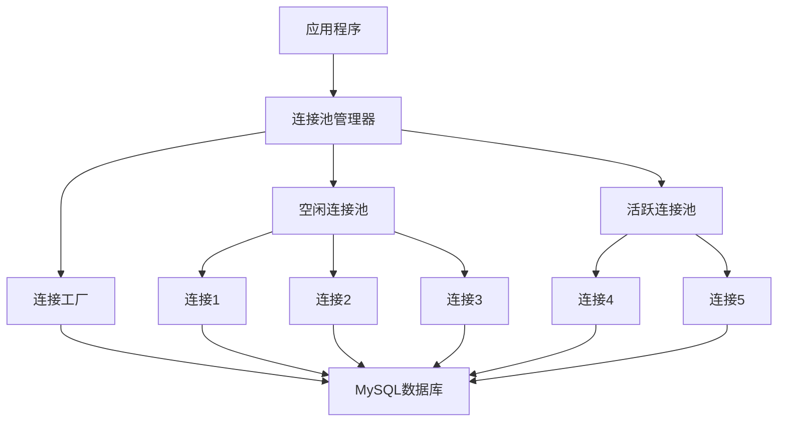

# MySQL优化-连接池管理

## 业务场景引入

在高并发应用中，数据库连接管理至关重要：
- **电商秒杀**：瞬间大量用户访问，需要高效的连接复用
- **微服务架构**：多个服务实例并发访问数据库
- **Web应用**：处理大量并发HTTP请求的数据库操作
- **批处理任务**：需要控制连接数量避免数据库过载

连接池技术可以有效解决连接创建开销和连接数限制问题。

## 连接池原理

### 连接池架构



**核心机制：**
- **连接预创建**：应用启动时预先创建一定数量的连接
- **连接复用**：多个请求共享连接，避免频繁创建销毁
- **动态调整**：根据负载动态增减连接数量
- **健康检查**：定期检测连接有效性，清理无效连接

## HikariCP连接池配置

### 基础配置

```yaml
# Spring Boot application.yml
spring:
  datasource:
    type: com.zaxxer.hikari.HikariDataSource
    url: jdbc:mysql://localhost:3306/ecommerce?useUnicode=true&characterEncoding=utf8&useSSL=false&serverTimezone=Asia/Shanghai
    username: ecommerce_user
    password: password
    driver-class-name: com.mysql.cj.jdbc.Driver
    
    hikari:
      # 连接池核心配置
      minimum-idle: 10          # 最小空闲连接数
      maximum-pool-size: 50     # 最大连接池大小
      idle-timeout: 300000      # 空闲连接超时时间(ms)
      max-lifetime: 1800000     # 连接最大生存时间(ms)
      connection-timeout: 20000 # 获取连接超时时间(ms)
      
      # 连接测试配置
      connection-test-query: SELECT 1
      validation-timeout: 3000  # 连接验证超时时间(ms)
      
      # 连接池名称和JMX监控
      pool-name: HikariCP-ecommerce
      register-mbeans: true
      
      # 数据库连接属性
      data-source-properties:
        cachePrepStmts: true
        prepStmtCacheSize: 250
        prepStmtCacheSqlLimit: 2048
        useServerPrepStmts: true
        useLocalSessionState: true
        rewriteBatchedStatements: true
        cacheResultSetMetadata: true
        cacheServerConfiguration: true
        elideSetAutoCommits: true
        maintainTimeStats: false
```

### Java配置方式

```java
@Configuration
public class DatabaseConfig {
    
    @Bean
    @Primary
    @ConfigurationProperties("spring.datasource.hikari")
    public HikariDataSource primaryDataSource() {
        HikariConfig config = new HikariConfig();
        
        // 基础连接信息
        config.setJdbcUrl("jdbc:mysql://localhost:3306/ecommerce");
        config.setUsername("ecommerce_user");
        config.setPassword("password");
        config.setDriverClassName("com.mysql.cj.jdbc.Driver");
        
        // 连接池配置
        config.setMinimumIdle(10);
        config.setMaximumPoolSize(50);
        config.setIdleTimeout(300000);
        config.setMaxLifetime(1800000);
        config.setConnectionTimeout(20000);
        
        // 性能优化配置
        config.addDataSourceProperty("cachePrepStmts", "true");
        config.addDataSourceProperty("prepStmtCacheSize", "250");
        config.addDataSourceProperty("prepStmtCacheSqlLimit", "2048");
        config.addDataSourceProperty("useServerPrepStmts", "true");
        
        // 连接池监控
        config.setPoolName("HikariCP-Primary");
        config.setRegisterMbeans(true);
        
        return new HikariDataSource(config);
    }
    
    @Bean
    public DataSource readOnlyDataSource() {
        HikariConfig config = new HikariConfig();
        config.setJdbcUrl("jdbc:mysql://readonly-server:3306/ecommerce");
        config.setUsername("readonly_user");
        config.setPassword("password");
        config.setMaximumPoolSize(30);  // 只读库连接数较少
        config.setReadOnly(true);
        config.setPoolName("HikariCP-ReadOnly");
        
        return new HikariDataSource(config);
    }
}
```

### 动态配置管理

```java
@Component
public class DynamicDataSourceManager {
    
    private HikariDataSource dataSource;
    
    @Autowired
    public DynamicDataSourceManager(HikariDataSource dataSource) {
        this.dataSource = dataSource;
    }
    
    /**
     * 动态调整连接池大小
     */
    public void adjustPoolSize(int newSize) {
        HikariConfigMXBean configMXBean = dataSource.getHikariConfigMXBean();
        configMXBean.setMaximumPoolSize(newSize);
        
        log.info("Connection pool size adjusted to: {}", newSize);
    }
    
    /**
     * 获取连接池状态
     */
    public PoolStatus getPoolStatus() {
        HikariPoolMXBean poolMXBean = dataSource.getHikariPoolMXBean();
        
        return PoolStatus.builder()
                .activeConnections(poolMXBean.getActiveConnections())
                .idleConnections(poolMXBean.getIdleConnections())
                .totalConnections(poolMXBean.getTotalConnections())
                .threadsAwaitingConnection(poolMXBean.getThreadsAwaitingConnection())
                .build();
    }
    
    /**
     * 连接池健康检查
     */
    @Scheduled(fixedRate = 60000) // 每分钟检查一次
    public void healthCheck() {
        PoolStatus status = getPoolStatus();
        
        // 连接使用率过高告警
        double usage = (double) status.getActiveConnections() / 
                      (status.getActiveConnections() + status.getIdleConnections());
        
        if (usage > 0.9) {
            log.warn("High connection pool usage: {}%", usage * 100);
            // 发送告警
            alertService.sendAlert("High connection pool usage detected");
        }
        
        // 等待连接的线程过多
        if (status.getThreadsAwaitingConnection() > 10) {
            log.warn("Too many threads waiting for connections: {}", 
                    status.getThreadsAwaitingConnection());
        }
    }
}

@Data
@Builder
class PoolStatus {
    private int activeConnections;
    private int idleConnections;
    private int totalConnections;
    private int threadsAwaitingConnection;
}
```

## 多数据源连接池

### 读写分离配置

```java
@Configuration
public class MultiDataSourceConfig {
    
    @Bean
    @Primary
    public DataSource masterDataSource() {
        return createHikariDataSource(
            "jdbc:mysql://master:3306/ecommerce",
            "master_user", "password", 50, "Master"
        );
    }
    
    @Bean
    public DataSource slaveDataSource() {
        return createHikariDataSource(
            "jdbc:mysql://slave:3306/ecommerce", 
            "slave_user", "password", 30, "Slave"
        );
    }
    
    private HikariDataSource createHikariDataSource(String url, String username, 
                                                   String password, int maxPoolSize, String poolName) {
        HikariConfig config = new HikariConfig();
        config.setJdbcUrl(url);
        config.setUsername(username);
        config.setPassword(password);
        config.setMaximumPoolSize(maxPoolSize);
        config.setMinimumIdle(5);
        config.setPoolName("HikariCP-" + poolName);
        
        return new HikariDataSource(config);
    }
    
    @Bean
    public DataSource routingDataSource() {
        RoutingDataSource routingDataSource = new RoutingDataSource();
        
        Map<Object, Object> dataSourceMap = new HashMap<>();
        dataSourceMap.put("master", masterDataSource());
        dataSourceMap.put("slave", slaveDataSource());
        
        routingDataSource.setTargetDataSources(dataSourceMap);
        routingDataSource.setDefaultTargetDataSource(masterDataSource());
        
        return routingDataSource;
    }
}

public class RoutingDataSource extends AbstractRoutingDataSource {
    
    @Override
    protected Object determineCurrentLookupKey() {
        return DataSourceContextHolder.getDataSourceType();
    }
}

public class DataSourceContextHolder {
    private static final ThreadLocal<String> contextHolder = new ThreadLocal<>();
    
    public static void setDataSourceType(String dataSourceType) {
        contextHolder.set(dataSourceType);
    }
    
    public static String getDataSourceType() {
        return contextHolder.get();
    }
    
    public static void clearDataSourceType() {
        contextHolder.remove();
    }
}

// 自动路由切面
@Aspect
@Component
public class DataSourceAspect {
    
    @Pointcut("@annotation(ReadOnly)")
    public void readOnlyPointcut() {}
    
    @Before("readOnlyPointcut()")
    public void before() {
        DataSourceContextHolder.setDataSourceType("slave");
    }
    
    @After("readOnlyPointcut()")
    public void after() {
        DataSourceContextHolder.clearDataSourceType();
    }
}

@Target({ElementType.METHOD, ElementType.TYPE})
@Retention(RetentionPolicy.RUNTIME)
public @interface ReadOnly {
}
```

### 分库分表连接池

```java
@Configuration
public class ShardingDataSourceConfig {
    
    @Bean
    public DataSource shardingDataSource() {
        Map<String, DataSource> dataSourceMap = new HashMap<>();
        
        // 创建多个分片数据源
        for (int i = 0; i < 4; i++) {
            String shardName = "shard" + i;
            dataSourceMap.put(shardName, createShardDataSource(i));
        }
        
        // 分片规则配置
        ShardingRuleConfiguration shardingRuleConfig = new ShardingRuleConfiguration();
        
        // 订单表分片配置
        TableRuleConfiguration orderTableRule = new TableRuleConfiguration("orders", 
                "shard${0..3}.orders_${0..15}");
        orderTableRule.setDatabaseShardingStrategyConfig(
                new InlineShardingStrategyConfiguration("user_id", "shard${user_id % 4}"));
        orderTableRule.setTableShardingStrategyConfig(
                new InlineShardingStrategyConfiguration("order_id", "orders_${order_id % 16}"));
        
        shardingRuleConfig.getTableRuleConfigs().add(orderTableRule);
        
        try {
            return ShardingDataSourceFactory.createDataSource(dataSourceMap, shardingRuleConfig, new Properties());
        } catch (SQLException e) {
            throw new RuntimeException("Failed to create sharding data source", e);
        }
    }
    
    private DataSource createShardDataSource(int shardIndex) {
        HikariConfig config = new HikariConfig();
        config.setJdbcUrl("jdbc:mysql://shard" + shardIndex + ":3306/ecommerce");
        config.setUsername("shard_user");
        config.setPassword("password");
        config.setMaximumPoolSize(20);  // 每个分片的连接数
        config.setPoolName("HikariCP-Shard" + shardIndex);
        
        return new HikariDataSource(config);
    }
}
```

## 连接池监控

### 监控指标收集

```java
@Component
public class ConnectionPoolMonitor {
    
    private final MeterRegistry meterRegistry;
    private final Map<String, HikariDataSource> dataSources;
    
    @Autowired
    public ConnectionPoolMonitor(MeterRegistry meterRegistry, 
                               Map<String, HikariDataSource> dataSources) {
        this.meterRegistry = meterRegistry;
        this.dataSources = dataSources;
        registerMetrics();
    }
    
    private void registerMetrics() {
        dataSources.forEach((name, dataSource) -> {
            // 注册连接池指标
            Gauge.builder("hikari.connections.active")
                    .tag("pool", name)
                    .register(meterRegistry, dataSource, ds -> ds.getHikariPoolMXBean().getActiveConnections());
                    
            Gauge.builder("hikari.connections.idle")
                    .tag("pool", name)
                    .register(meterRegistry, dataSource, ds -> ds.getHikariPoolMXBean().getIdleConnections());
                    
            Gauge.builder("hikari.connections.pending")
                    .tag("pool", name)
                    .register(meterRegistry, dataSource, ds -> ds.getHikariPoolMXBean().getThreadsAwaitingConnection());
                    
            Gauge.builder("hikari.connections.total")
                    .tag("pool", name)
                    .register(meterRegistry, dataSource, ds -> ds.getHikariPoolMXBean().getTotalConnections());
        });
    }
    
    @EventListener
    public void handleConnectionPoolEvent(ConnectionPoolEvent event) {
        Timer.Sample sample = Timer.start(meterRegistry);
        
        switch (event.getType()) {
            case CONNECTION_ACQUIRED:
                meterRegistry.counter("hikari.connections.acquired", "pool", event.getPoolName()).increment();
                break;
            case CONNECTION_RELEASED:
                sample.stop(Timer.builder("hikari.connections.usage")
                        .tag("pool", event.getPoolName())
                        .register(meterRegistry));
                break;
            case CONNECTION_TIMEOUT:
                meterRegistry.counter("hikari.connections.timeout", "pool", event.getPoolName()).increment();
                break;
        }
    }
}

@Data
@AllArgsConstructor
public class ConnectionPoolEvent {
    private String poolName;
    private EventType type;
    private long timestamp;
    
    public enum EventType {
        CONNECTION_ACQUIRED,
        CONNECTION_RELEASED,
        CONNECTION_TIMEOUT,
        CONNECTION_LEAK_DETECTED
    }
}
```

### 性能分析工具

```java
@RestController
@RequestMapping("/admin/datasource")
public class DataSourceAdminController {
    
    @Autowired
    private Map<String, HikariDataSource> dataSources;
    
    @GetMapping("/pools")
    public Map<String, Object> getPoolStatistics() {
        Map<String, Object> stats = new HashMap<>();
        
        dataSources.forEach((name, dataSource) -> {
            HikariPoolMXBean poolMXBean = dataSource.getHikariPoolMXBean();
            
            Map<String, Object> poolStats = new HashMap<>();
            poolStats.put("activeConnections", poolMXBean.getActiveConnections());
            poolStats.put("idleConnections", poolMXBean.getIdleConnections());
            poolStats.put("totalConnections", poolMXBean.getTotalConnections());
            poolStats.put("threadsAwaitingConnection", poolMXBean.getThreadsAwaitingConnection());
            
            stats.put(name, poolStats);
        });
        
        return stats;
    }
    
    @PostMapping("/pools/{poolName}/resize")
    public ResponseEntity<String> resizePool(@PathVariable String poolName, 
                                           @RequestParam int newSize) {
        HikariDataSource dataSource = dataSources.get(poolName);
        if (dataSource == null) {
            return ResponseEntity.notFound().build();
        }
        
        HikariConfigMXBean configMXBean = dataSource.getHikariConfigMXBean();
        int oldSize = configMXBean.getMaximumPoolSize();
        configMXBean.setMaximumPoolSize(newSize);
        
        return ResponseEntity.ok(String.format("Pool %s resized from %d to %d", 
                poolName, oldSize, newSize));
    }
    
    @PostMapping("/pools/{poolName}/refresh")
    public ResponseEntity<String> refreshPool(@PathVariable String poolName) {
        HikariDataSource dataSource = dataSources.get(poolName);
        if (dataSource == null) {
            return ResponseEntity.notFound().build();
        }
        
        // 软刷新：关闭空闲连接，强制重新创建
        dataSource.getHikariPoolMXBean().softEvictConnections();
        
        return ResponseEntity.ok("Pool " + poolName + " refreshed");
    }
}
```

## 故障处理

### 连接泄漏检测

```java
@Configuration
public class ConnectionLeakDetectionConfig {
    
    @Bean
    public HikariDataSource dataSourceWithLeakDetection() {
        HikariConfig config = new HikariConfig();
        // ... 基础配置
        
        // 连接泄漏检测
        config.setLeakDetectionThreshold(60000); // 60秒未归还视为泄漏
        
        return new HikariDataSource(config);
    }
}

@Component
public class ConnectionLeakDetector {
    
    private final Map<String, Long> connectionUsageTracker = new ConcurrentHashMap<>();
    
    @EventListener
    public void onConnectionAcquired(ConnectionAcquiredEvent event) {
        connectionUsageTracker.put(event.getConnectionId(), System.currentTimeMillis());
    }
    
    @EventListener  
    public void onConnectionReleased(ConnectionReleasedEvent event) {
        Long acquiredTime = connectionUsageTracker.remove(event.getConnectionId());
        if (acquiredTime != null) {
            long usageTime = System.currentTimeMillis() - acquiredTime;
            if (usageTime > 300000) { // 超过5分钟
                log.warn("Long connection usage detected: {} ms for connection {}", 
                        usageTime, event.getConnectionId());
            }
        }
    }
    
    @Scheduled(fixedRate = 300000) // 每5分钟检查
    public void detectLeakedConnections() {
        long currentTime = System.currentTimeMillis();
        
        connectionUsageTracker.entrySet().removeIf(entry -> {
            if (currentTime - entry.getValue() > 600000) { // 超过10分钟
                log.error("Connection leak detected: connection {} acquired at {}", 
                         entry.getKey(), new Date(entry.getValue()));
                return true;
            }
            return false;
        });
    }
}
```

### 连接池故障恢复

```java
@Component
public class ConnectionPoolFailureHandler {
    
    @Autowired
    private HikariDataSource primaryDataSource;
    
    @Autowired
    private HikariDataSource backupDataSource;
    
    private volatile boolean usingBackup = false;
    
    @EventListener
    public void handleConnectionPoolFailure(ConnectionPoolFailureEvent event) {
        if (!usingBackup && isPoolUnhealthy(primaryDataSource)) {
            switchToBackup();
        }
    }
    
    private boolean isPoolUnhealthy(HikariDataSource dataSource) {
        try {
            HikariPoolMXBean poolMXBean = dataSource.getHikariPoolMXBean();
            
            // 检查是否有可用连接
            if (poolMXBean.getIdleConnections() == 0 && 
                poolMXBean.getThreadsAwaitingConnection() > 10) {
                return true;
            }
            
            // 尝试获取连接测试
            try (Connection conn = dataSource.getConnection()) {
                return !conn.isValid(5);
            }
        } catch (Exception e) {
            log.error("Health check failed", e);
            return true;
        }
        
        return false;
    }
    
    private void switchToBackup() {
        log.warn("Switching to backup data source");
        usingBackup = true;
        
        // 更新路由配置
        DataSourceContextHolder.setDataSourceType("backup");
        
        // 启动恢复检查
        scheduleRecoveryCheck();
    }
    
    @Scheduled(fixedRate = 30000) // 每30秒检查一次恢复
    public void scheduleRecoveryCheck() {
        if (usingBackup && !isPoolUnhealthy(primaryDataSource)) {
            log.info("Primary data source recovered, switching back");
            usingBackup = false;
            DataSourceContextHolder.clearDataSourceType();
        }
    }
}
```

## 性能优化策略

### 连接池大小优化

```java
@Component
public class PoolSizeOptimizer {
    
    private final HikariDataSource dataSource;
    private final MeterRegistry meterRegistry;
    
    @Value("${app.connection-pool.auto-tune:true}")
    private boolean autoTune;
    
    public PoolSizeOptimizer(HikariDataSource dataSource, MeterRegistry meterRegistry) {
        this.dataSource = dataSource;
        this.meterRegistry = meterRegistry;
    }
    
    @Scheduled(fixedRate = 300000) // 每5分钟调整
    public void optimizePoolSize() {
        if (!autoTune) return;
        
        PoolMetrics metrics = collectMetrics();
        int recommendedSize = calculateOptimalSize(metrics);
        
        HikariConfigMXBean config = dataSource.getHikariConfigMXBean();
        int currentSize = config.getMaximumPoolSize();
        
        if (Math.abs(recommendedSize - currentSize) > 2) {
            log.info("Adjusting pool size from {} to {} based on metrics", 
                    currentSize, recommendedSize);
            config.setMaximumPoolSize(recommendedSize);
        }
    }
    
    private PoolMetrics collectMetrics() {
        HikariPoolMXBean poolMXBean = dataSource.getHikariPoolMXBean();
        
        return PoolMetrics.builder()
                .activeConnections(poolMXBean.getActiveConnections())
                .idleConnections(poolMXBean.getIdleConnections())
                .pendingThreads(poolMXBean.getThreadsAwaitingConnection())
                .totalConnections(poolMXBean.getTotalConnections())
                .build();
    }
    
    private int calculateOptimalSize(PoolMetrics metrics) {
        // 基于Little's Law: 连接数 = 吞吐量 × 平均响应时间
        double avgResponseTime = getAverageResponseTime(); // 秒
        double throughput = getThroughput(); // 每秒请求数
        
        int baseSize = (int) Math.ceil(throughput * avgResponseTime);
        
        // 添加缓冲区 (20%)
        int recommendedSize = (int) (baseSize * 1.2);
        
        // 考虑当前负载情况
        if (metrics.getPendingThreads() > 5) {
            recommendedSize += 5; // 有等待线程，增加连接
        }
        
        // 限制在合理范围内
        return Math.max(10, Math.min(100, recommendedSize));
    }
    
    private double getAverageResponseTime() {
        Timer timer = meterRegistry.find("database.query.time").timer();
        return timer != null ? timer.mean(TimeUnit.SECONDS) : 0.1;
    }
    
    private double getThroughput() {
        Counter counter = meterRegistry.find("database.query.count").counter();
        return counter != null ? counter.count() / 300.0 : 10.0; // 假设5分钟内的平均值
    }
}

@Data
@Builder
class PoolMetrics {
    private int activeConnections;
    private int idleConnections;
    private int pendingThreads;
    private int totalConnections;
}
```

## 总结与最佳实践

### 连接池配置原则

1. **合理的池大小**：
   - 最大连接数 = CPU核心数 × 2 + 硬盘数
   - 最小空闲连接数 = 最大连接数 × 0.2
   - 根据实际负载进行调整

2. **生命周期管理**：
   - 设置合适的连接超时时间
   - 定期回收长时间空闲的连接
   - 配置连接验证查询

3. **监控和告警**：
   - 监控连接池使用率
   - 设置连接泄漏检测
   - 配置性能指标收集

4. **故障处理**：
   - 配置多数据源冗余
   - 实现自动故障切换
   - 设置连接重试机制

连接池是数据库性能优化的重要组件，合理的配置和管理可以显著提升应用性能和稳定性。