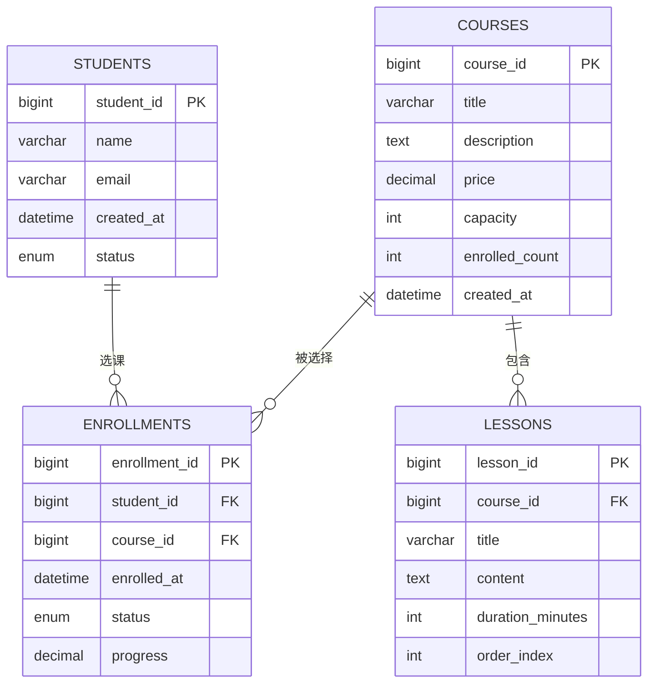
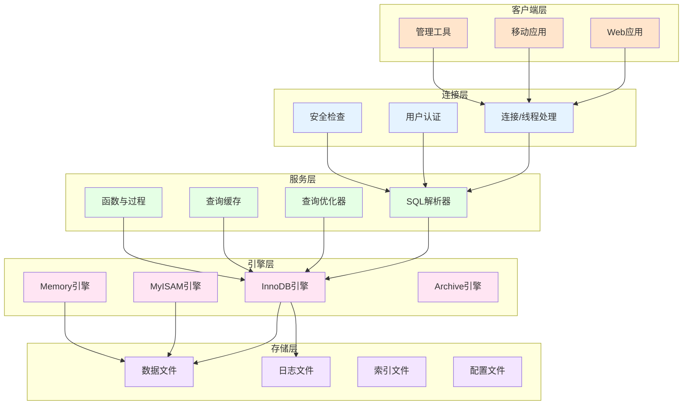
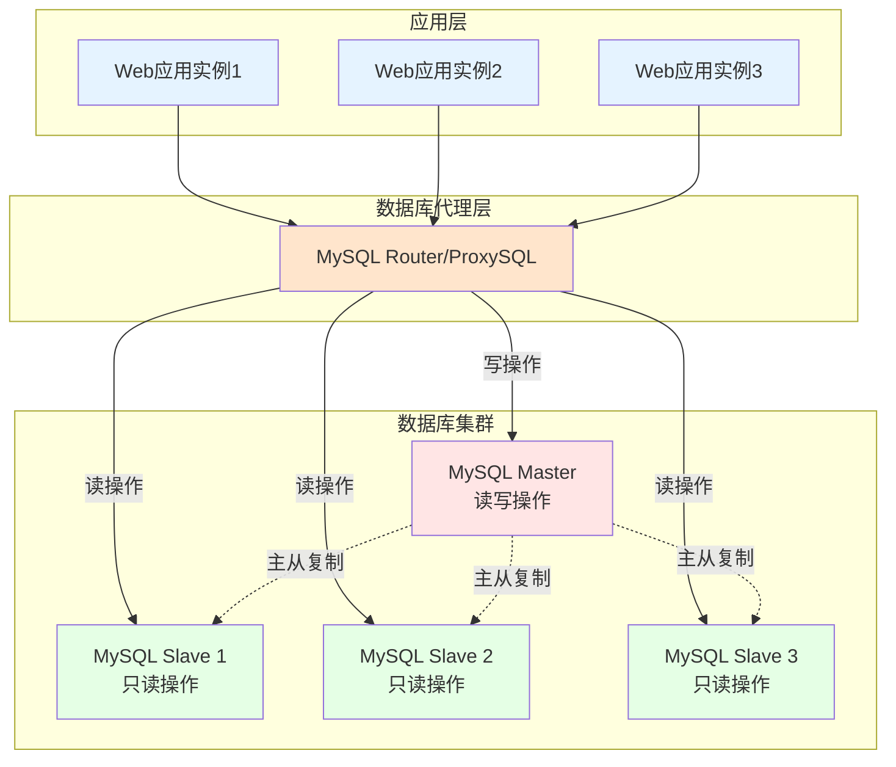

# 基础-概念与架构

## 业务场景引入

想象你正在设计一个在线教育平台，需要管理学生信息、课程数据、学习进度等复杂业务数据。在项目初期，业务负责人提出了这样的需求：

- **数据完整性要求**：学生选课后，课程容量必须相应减少，不能出现超额选课的情况
- **并发访问处理**：同时有数千名学生在线学习，系统必须保证数据的一致性
- **数据持久化保障**：学习记录和成绩数据绝不能丢失
- **查询性能优化**：课程搜索和学习报表生成要足够快速

这些需求背后涉及的正是数据库的核心概念：**数据一致性、并发控制、持久化存储和查询优化**。理解MySQL的基础概念和架构，是解决这些实际业务问题的关键。

## 数据库基础概念

### 关系型数据库理论基础

关系型数据库基于数学中的关系代数理论，通过表（关系）来组织和存储数据。以在线教育平台为例：



### 数据库设计三大范式

在设计教育平台数据库时，遵循范式设计原则：

**第一范式（1NF）**：原子性
```sql
-- ❌ 违反1NF：技能字段包含多个值
CREATE TABLE teachers_bad (
    teacher_id BIGINT PRIMARY KEY,
    name VARCHAR(100),
    skills VARCHAR(500)  -- "Java,Python,MySQL" 不符合原子性
);

-- ✅ 符合1NF：技能数据原子化
CREATE TABLE teachers (
    teacher_id BIGINT PRIMARY KEY,
    name VARCHAR(100)
);

CREATE TABLE teacher_skills (
    teacher_id BIGINT,
    skill_name VARCHAR(50),
    proficiency_level ENUM('BEGINNER', 'INTERMEDIATE', 'ADVANCED'),
    PRIMARY KEY (teacher_id, skill_name)
);
```

**第二范式（2NF）**：消除部分依赖
```sql
-- ❌ 违反2NF：存在部分依赖
CREATE TABLE course_enrollments_bad (
    student_id BIGINT,
    course_id BIGINT,
    student_name VARCHAR(100),  -- 只依赖于student_id
    course_title VARCHAR(200),  -- 只依赖于course_id
    enrolled_at DATETIME,
    PRIMARY KEY (student_id, course_id)
);

-- ✅ 符合2NF：消除部分依赖
CREATE TABLE enrollments (
    student_id BIGINT,
    course_id BIGINT,
    enrolled_at DATETIME,
    progress DECIMAL(5,2) DEFAULT 0.00,
    PRIMARY KEY (student_id, course_id),
    FOREIGN KEY (student_id) REFERENCES students(student_id),
    FOREIGN KEY (course_id) REFERENCES courses(course_id)
);
```

**第三范式（3NF）**：消除传递依赖
```sql
-- ❌ 违反3NF：存在传递依赖
CREATE TABLE students_bad (
    student_id BIGINT PRIMARY KEY,
    name VARCHAR(100),
    major_id BIGINT,
    major_name VARCHAR(100),    -- 传递依赖：student_id -> major_id -> major_name
    department_name VARCHAR(100) -- 传递依赖：student_id -> major_id -> department_name
);

-- ✅ 符合3NF：消除传递依赖
CREATE TABLE majors (
    major_id BIGINT PRIMARY KEY,
    major_name VARCHAR(100),
    department_name VARCHAR(100)
);

CREATE TABLE students (
    student_id BIGINT PRIMARY KEY,
    name VARCHAR(100),
    major_id BIGINT,
    FOREIGN KEY (major_id) REFERENCES majors(major_id)
);
```

## MySQL系统架构深度解析

### 整体架构图



### 连接层详解

连接层负责处理客户端连接和用户身份验证：

```sql
-- 查看当前连接状态
SHOW PROCESSLIST;

-- 查看连接统计信息
SHOW STATUS LIKE 'Connections';
SHOW STATUS LIKE 'Max_used_connections';
SHOW STATUS LIKE 'Threads_connected';

-- 配置最大连接数
SET GLOBAL max_connections = 1000;

-- 创建专用用户用于应用连接
CREATE USER 'edu_app'@'%' IDENTIFIED BY 'secure_password_2024';
GRANT SELECT, INSERT, UPDATE, DELETE ON education_platform.* TO 'edu_app'@'%';

-- 创建只读用户用于报表查询
CREATE USER 'edu_readonly'@'%' IDENTIFIED BY 'readonly_password_2024';
GRANT SELECT ON education_platform.* TO 'edu_readonly'@'%';
```

### 服务层核心组件

**SQL解析器**的工作流程：


**查询优化器**的优化策略示例：

```sql
-- 原始查询（性能较差）
SELECT s.name, c.title, e.progress
FROM students s, courses c, enrollments e
WHERE s.student_id = e.student_id
  AND c.course_id = e.course_id
  AND s.created_at >= '2024-01-01'
  AND c.price > 100;

-- 优化器可能重写为（使用合适的JOIN顺序和索引）
SELECT s.name, c.title, e.progress
FROM enrollments e
INNER JOIN students s ON s.student_id = e.student_id
INNER JOIN courses c ON c.course_id = e.course_id
WHERE s.created_at >= '2024-01-01'
  AND c.price > 100;

-- 查看执行计划
EXPLAIN FORMAT=JSON
SELECT s.name, c.title, e.progress
FROM students s
JOIN enrollments e ON s.student_id = e.student_id
JOIN courses c ON c.course_id = e.course_id
WHERE s.created_at >= '2024-01-01'
  AND c.price > 100;
```

## 存储引擎对比分析

### InnoDB存储引擎（推荐）

InnoDB是MySQL的默认存储引擎，特别适合事务性应用：

```sql
-- 创建使用InnoDB的表
CREATE TABLE student_payments (
    payment_id BIGINT PRIMARY KEY AUTO_INCREMENT,
    student_id BIGINT NOT NULL,
    course_id BIGINT NOT NULL,
    amount DECIMAL(10,2) NOT NULL,
    payment_method ENUM('ALIPAY', 'WECHAT', 'CREDIT_CARD') NOT NULL,
    transaction_id VARCHAR(64) UNIQUE NOT NULL,
    status ENUM('PENDING', 'SUCCESS', 'FAILED', 'REFUNDED') DEFAULT 'PENDING',
    created_at TIMESTAMP DEFAULT CURRENT_TIMESTAMP,
    updated_at TIMESTAMP DEFAULT CURRENT_TIMESTAMP ON UPDATE CURRENT_TIMESTAMP,
    
    INDEX idx_student_id (student_id),
    INDEX idx_course_id (course_id),
    INDEX idx_transaction_id (transaction_id),
    INDEX idx_status_created (status, created_at),
    
    FOREIGN KEY (student_id) REFERENCES students(student_id),
    FOREIGN KEY (course_id) REFERENCES courses(course_id)
) ENGINE=InnoDB DEFAULT CHARSET=utf8mb4 COLLATE=utf8mb4_unicode_ci;

-- InnoDB事务示例：学生选课业务
START TRANSACTION;

-- 检查课程容量
SELECT capacity, enrolled_count 
FROM courses 
WHERE course_id = 1001 FOR UPDATE;

-- 增加选课记录
INSERT INTO enrollments (student_id, course_id, enrolled_at)
VALUES (2001, 1001, NOW());

-- 更新课程选课人数
UPDATE courses 
SET enrolled_count = enrolled_count + 1
WHERE course_id = 1001;

-- 记录支付信息
INSERT INTO student_payments (student_id, course_id, amount, payment_method, transaction_id)
VALUES (2001, 1001, 299.99, 'ALIPAY', 'TXN_2024_001234567');

COMMIT;
```

### MyISAM存储引擎

适合读多写少的场景：

```sql
-- 创建统计报表表（读多写少场景）
CREATE TABLE course_statistics (
    stat_id BIGINT PRIMARY KEY AUTO_INCREMENT,
    course_id BIGINT NOT NULL,
    date_recorded DATE NOT NULL,
    total_students INT DEFAULT 0,
    active_students INT DEFAULT 0,
    completion_rate DECIMAL(5,2) DEFAULT 0.00,
    average_progress DECIMAL(5,2) DEFAULT 0.00,
    revenue DECIMAL(12,2) DEFAULT 0.00,
    
    INDEX idx_course_date (course_id, date_recorded),
    INDEX idx_date_recorded (date_recorded)
) ENGINE=MyISAM DEFAULT CHARSET=utf8mb4;
```

### Memory存储引擎

适合临时数据和缓存：

```sql
-- 创建在线用户会话表
CREATE TABLE online_sessions (
    session_id VARCHAR(128) PRIMARY KEY,
    student_id BIGINT NOT NULL,
    login_time TIMESTAMP DEFAULT CURRENT_TIMESTAMP,
    last_activity TIMESTAMP DEFAULT CURRENT_TIMESTAMP ON UPDATE CURRENT_TIMESTAMP,
    ip_address VARCHAR(45),
    user_agent TEXT,
    
    INDEX idx_student_id (student_id),
    INDEX idx_last_activity (last_activity)
) ENGINE=Memory DEFAULT CHARSET=utf8mb4;
```

### 存储引擎特性对比

| 特性 | InnoDB | MyISAM | Memory | Archive |
|------|--------|--------|--------|---------|
| 事务支持 | ✅ | ❌ | ❌ | ❌ |
| 行级锁 | ✅ | ❌ | ❌ | ✅ |
| 外键约束 | ✅ | ❌ | ❌ | ❌ |
| 崩溃恢复 | ✅ | ❌ | ❌ | ✅ |
| 压缩存储 | 部分支持 | ✅ | ❌ | ✅ |
| 内存使用 | 中等 | 低 | 高 | 低 |
| 适用场景 | OLTP事务处理 | 只读/读多写少 | 临时数据 | 数据归档 |

## 数据类型深度解析

### 数值类型最佳实践

```sql
-- 学生基础信息表
CREATE TABLE students (
    student_id BIGINT PRIMARY KEY AUTO_INCREMENT,        -- 主键使用BIGINT
    student_number VARCHAR(20) UNIQUE NOT NULL,          -- 学号
    name VARCHAR(100) NOT NULL,                          -- 姓名
    age TINYINT UNSIGNED,                               -- 年龄：0-255足够
    gender ENUM('MALE', 'FEMALE', 'OTHER') NOT NULL,    -- 性别枚举
    phone VARCHAR(20),                                   -- 手机号
    email VARCHAR(100) UNIQUE,                          -- 邮箱
    grade_level TINYINT UNSIGNED,                       -- 年级：1-12
    gpa DECIMAL(3,2),                                   -- 绩点：0.00-4.00
    total_credits SMALLINT UNSIGNED DEFAULT 0,          -- 总学分
    wallet_balance DECIMAL(10,2) DEFAULT 0.00,         -- 钱包余额
    is_active BOOLEAN DEFAULT TRUE,                     -- 是否活跃
    created_at TIMESTAMP DEFAULT CURRENT_TIMESTAMP,
    updated_at TIMESTAMP DEFAULT CURRENT_TIMESTAMP ON UPDATE CURRENT_TIMESTAMP,
    
    INDEX idx_student_number (student_number),
    INDEX idx_email (email),
    INDEX idx_grade_level (grade_level),
    INDEX idx_active_created (is_active, created_at)
) ENGINE=InnoDB DEFAULT CHARSET=utf8mb4 COLLATE=utf8mb4_unicode_ci;
```

### 字符串类型选择策略

```sql
-- 课程信息表：展示不同字符串类型的使用
CREATE TABLE courses (
    course_id BIGINT PRIMARY KEY AUTO_INCREMENT,
    course_code VARCHAR(20) NOT NULL,                   -- 课程代码：定长短字符
    title VARCHAR(200) NOT NULL,                        -- 课程标题：变长中等
    short_description VARCHAR(500),                     -- 短描述：变长较长
    full_description TEXT,                              -- 详细描述：长文本
    video_urls JSON,                                    -- 视频链接：JSON格式
    price DECIMAL(8,2) NOT NULL,                       -- 价格
    original_price DECIMAL(8,2),                       -- 原价
    discount_rate DECIMAL(3,2) DEFAULT 0.00,          -- 折扣率
    duration_hours DECIMAL(5,2) NOT NULL,             -- 课程时长
    difficulty_level ENUM('BEGINNER', 'INTERMEDIATE', 'ADVANCED') NOT NULL,
    language ENUM('CHINESE', 'ENGLISH', 'BILINGUAL') DEFAULT 'CHINESE',
    status ENUM('DRAFT', 'PUBLISHED', 'ARCHIVED') DEFAULT 'DRAFT',
    tags SET('Programming', 'Database', 'Frontend', 'Backend', 'Mobile', 'AI', 'Data Science'),
    created_at TIMESTAMP DEFAULT CURRENT_TIMESTAMP,
    updated_at TIMESTAMP DEFAULT CURRENT_TIMESTAMP ON UPDATE CURRENT_TIMESTAMP,
    
    UNIQUE KEY uk_course_code (course_code),
    INDEX idx_difficulty_price (difficulty_level, price),
    INDEX idx_status_created (status, created_at),
    FULLTEXT INDEX ft_title_description (title, short_description)
) ENGINE=InnoDB DEFAULT CHARSET=utf8mb4 COLLATE=utf8mb4_unicode_ci;
```

### 日期时间类型应用

```sql
-- 学习记录表：展示日期时间类型的使用
CREATE TABLE learning_progress (
    progress_id BIGINT PRIMARY KEY AUTO_INCREMENT,
    student_id BIGINT NOT NULL,
    lesson_id BIGINT NOT NULL,
    start_time DATETIME NOT NULL,                       -- 开始学习时间
    end_time DATETIME,                                  -- 结束学习时间
    study_duration TIME,                               -- 学习时长：HH:MM:SS
    completion_percentage DECIMAL(5,2) DEFAULT 0.00,   -- 完成百分比
    last_position_seconds INT DEFAULT 0,               -- 最后观看位置（秒）
    is_completed BOOLEAN DEFAULT FALSE,                -- 是否完成
    first_completed_at DATETIME,                       -- 首次完成时间
    notes TEXT,                                        -- 学习笔记
    created_at TIMESTAMP DEFAULT CURRENT_TIMESTAMP,
    updated_at TIMESTAMP DEFAULT CURRENT_TIMESTAMP ON UPDATE CURRENT_TIMESTAMP,
    
    UNIQUE KEY uk_student_lesson (student_id, lesson_id),
    INDEX idx_student_id (student_id),
    INDEX idx_lesson_id (lesson_id),
    INDEX idx_completion_time (is_completed, first_completed_at),
    INDEX idx_study_date (DATE(start_time)),
    
    FOREIGN KEY (student_id) REFERENCES students(student_id),
    FOREIGN KEY (lesson_id) REFERENCES lessons(lesson_id)
) ENGINE=InnoDB DEFAULT CHARSET=utf8mb4 COLLATE=utf8mb4_unicode_ci;
```

## 生产环境配置实践

### 核心参数配置

```ini
# my.cnf 生产环境配置示例
[mysqld]
# 基础配置
port = 3306
socket = /var/lib/mysql/mysql.sock
datadir = /var/lib/mysql
pid-file = /var/run/mysqld/mysqld.pid
user = mysql

# 字符集配置
character-set-server = utf8mb4
collation-server = utf8mb4_unicode_ci
init_connect = 'SET NAMES utf8mb4'

# InnoDB配置
default-storage-engine = INNODB
innodb_buffer_pool_size = 8G              # 总内存的70-80%
innodb_log_file_size = 1G                 # 日志文件大小
innodb_log_buffer_size = 64M              # 日志缓冲区
innodb_flush_log_at_trx_commit = 1        # 事务安全性
innodb_flush_method = O_DIRECT            # 避免双重缓冲
innodb_file_per_table = 1                 # 独立表空间

# 连接配置
max_connections = 1000                     # 最大连接数
max_user_connections = 800                 # 单用户最大连接
thread_cache_size = 50                    # 线程缓存
wait_timeout = 3600                       # 连接超时时间

# 查询缓存（MySQL 8.0中已移除）
# query_cache_type = 1
# query_cache_size = 256M

# 慢查询日志
slow_query_log = 1
slow_query_log_file = /var/log/mysql/slow.log
long_query_time = 2
log_queries_not_using_indexes = 1

# 二进制日志
log-bin = mysql-bin
binlog_format = ROW
max_binlog_size = 1G
expire_logs_days = 7

# 安全配置
bind-address = 0.0.0.0
skip-name-resolve = 1
sql_mode = STRICT_TRANS_TABLES,NO_ZERO_DATE,NO_ZERO_IN_DATE,ERROR_FOR_DIVISION_BY_ZERO
```

### 性能监控关键指标

```sql
-- 监控连接状态
SHOW STATUS LIKE 'Threads_%';
SHOW STATUS LIKE 'Connection%';

-- 监控InnoDB状态
SHOW ENGINE INNODB STATUS;

-- 监控缓冲池命中率
SHOW STATUS LIKE 'Innodb_buffer_pool_%';

-- 计算缓冲池命中率
SELECT 
    ROUND(
        (1 - (Innodb_buffer_pool_reads / Innodb_buffer_pool_read_requests)) * 100, 2
    ) AS buffer_pool_hit_rate_percent
FROM (
    SELECT VARIABLE_VALUE AS Innodb_buffer_pool_reads 
    FROM performance_schema.global_status 
    WHERE VARIABLE_NAME = 'Innodb_buffer_pool_reads'
) AS reads
CROSS JOIN (
    SELECT VARIABLE_VALUE AS Innodb_buffer_pool_read_requests 
    FROM performance_schema.global_status 
    WHERE VARIABLE_NAME = 'Innodb_buffer_pool_read_requests'
) AS requests;

-- 监控慢查询
SELECT 
    SCHEMA_NAME,
    DIGEST_TEXT,
    COUNT_STAR,
    AVG_TIMER_WAIT/1000000000000 AS avg_exec_time_sec,
    MAX_TIMER_WAIT/1000000000000 AS max_exec_time_sec
FROM performance_schema.events_statements_summary_by_digest
ORDER BY AVG_TIMER_WAIT DESC
LIMIT 10;
```

## 常见架构模式

### 读写分离架构



### 数据库连接池配置

```java
// Spring Boot中的HikariCP连接池配置
@Configuration
public class DatabaseConfig {
    
    @Bean
    @Primary
    @ConfigurationProperties("spring.datasource.master")
    public DataSource masterDataSource() {
        HikariConfig config = new HikariConfig();
        config.setJdbcUrl("jdbc:mysql://master-db:3306/education_platform");
        config.setUsername("edu_app");
        config.setPassword("secure_password_2024");
        config.setDriverClassName("com.mysql.cj.jdbc.Driver");
        
        // 连接池配置
        config.setMaximumPoolSize(20);              // 最大连接数
        config.setMinimumIdle(5);                   // 最小空闲连接
        config.setConnectionTimeout(30000);         // 连接超时：30秒
        config.setIdleTimeout(600000);              // 空闲超时：10分钟
        config.setMaxLifetime(1800000);             // 连接最大生命周期：30分钟
        config.setLeakDetectionThreshold(60000);    // 连接泄漏检测：60秒
        
        // 连接测试
        config.setConnectionTestQuery("SELECT 1");
        config.setValidationTimeout(5000);
        
        return new HikariDataSource(config);
    }
    
    @Bean
    @ConfigurationProperties("spring.datasource.slave")
    public DataSource slaveDataSource() {
        HikariConfig config = new HikariConfig();
        config.setJdbcUrl("jdbc:mysql://slave-db:3306/education_platform");
        config.setUsername("edu_readonly");
        config.setPassword("readonly_password_2024");
        config.setDriverClassName("com.mysql.cj.jdbc.Driver");
        
        // 只读连接池配置（连接数可以更多）
        config.setMaximumPoolSize(30);
        config.setMinimumIdle(10);
        config.setConnectionTimeout(30000);
        config.setIdleTimeout(600000);
        config.setMaxLifetime(1800000);
        
        return new HikariDataSource(config);
    }
}
```

## 总结与最佳实践

### 设计原则总结

1. **数据类型选择原则**
   - 选择能满足需求的最小数据类型
   - 避免使用NULL值，设置合理默认值
   - 使用ENUM和SET类型提高存储效率

2. **表结构设计原则**
   - 遵循三大范式，避免数据冗余
   - 合理使用外键约束保证数据完整性
   - 设计合适的索引策略提升查询性能

3. **存储引擎选择原则**
   - 事务性业务首选InnoDB
   - 读多写少场景考虑MyISAM
   - 临时数据使用Memory引擎

4. **字符集配置原则**
   - 统一使用utf8mb4字符集
   - 选择合适的排序规则（utf8mb4_unicode_ci）
   - 确保客户端连接字符集一致

### 性能优化建议

```sql
-- 定期优化表结构
ANALYZE TABLE students, courses, enrollments;

-- 检查表的碎片情况
SELECT 
    table_name,
    round(((data_length + index_length) / 1024 / 1024), 2) AS "Size_MB",
    round((data_free / 1024 / 1024), 2) AS "Free_MB"
FROM information_schema.tables 
WHERE table_schema = 'education_platform'
ORDER BY data_free DESC;

-- 重建有碎片的表
OPTIMIZE TABLE courses;
```

理解MySQL的基础概念和架构是构建高性能数据库应用的基石。在接下来的章节中，我们将深入探讨具体的技术实现和优化策略。