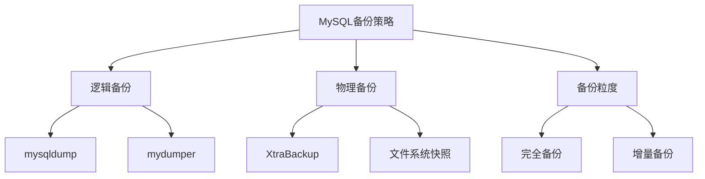

# MySQL运维-备份与恢复

## 业务场景引入

数据库备份与恢复是数据安全的最后一道防线：
- **数据保护**：防止硬件故障、人为误操作导致的数据丢失
- **业务连续性**：快速恢复服务，减少停机时间
- **合规要求**：满足数据保留和审计要求
- **灾难恢复**：应对自然灾害、机房故障等极端情况

## 备份策略设计

### 备份类型选择



### 备份策略矩阵

| 场景 | 数据量 | RTO要求 | RPO要求 | 推荐方案 |
|------|--------|---------|---------|----------|
| 小型业务 | <10GB | 1小时 | 1天 | mysqldump + binlog |
| 中型业务 | 10GB-1TB | 30分钟 | 4小时 | XtraBackup + binlog |
| 大型业务 | >1TB | 15分钟 | 1小时 | 快照 + XtraBackup |

## 逻辑备份实战

### mysqldump生产级配置

```bash
#!/bin/bash
# MySQL逻辑备份脚本

MYSQL_HOST="localhost"
MYSQL_USER="backup_user"
MYSQL_PASS="backup_password"
BACKUP_DIR="/backup/mysql"
DATE=$(date +%Y%m%d_%H%M%S)

mkdir -p ${BACKUP_DIR}/${DATE}

# 全库备份
mysqldump \
    --host=${MYSQL_HOST} \
    --user=${MYSQL_USER} \
    --password=${MYSQL_PASS} \
    --single-transaction \
    --routines \
    --triggers \
    --events \
    --master-data=2 \
    --quick \
    --lock-tables=false \
    --compress \
    --all-databases | gzip > ${BACKUP_DIR}/${DATE}/full_backup_${DATE}.sql.gz

# 分库备份
declare -a DATABASES=("ecommerce" "analytics" "logs")

for db in "${DATABASES[@]}"; do
    mysqldump \
        --host=${MYSQL_HOST} \
        --user=${MYSQL_USER} \
        --password=${MYSQL_PASS} \
        --single-transaction \
        --routines \
        --triggers \
        ${db} | gzip > ${BACKUP_DIR}/${DATE}/${db}_${DATE}.sql.gz
done

# 清理过期备份
find ${BACKUP_DIR} -type d -name "20*" -mtime +7 -exec rm -rf {} \;
```

### mydumper并行备份

```bash
#!/bin/bash
# mydumper高性能并行备份

BACKUP_DIR="/backup/mydumper"
DATE=$(date +%Y%m%d_%H%M%S)
THREADS=8

mkdir -p ${BACKUP_DIR}/${DATE}

mydumper \
    --host=localhost \
    --user=backup_user \
    --password=backup_password \
    --outputdir=${BACKUP_DIR}/${DATE} \
    --threads=${THREADS} \
    --compress \
    --events \
    --routines \
    --triggers \
    --single-transaction \
    --verbose=3

# 创建自动恢复脚本
cat > ${BACKUP_DIR}/${DATE}/restore.sh << EOF
#!/bin/bash
myloader \\
    --host=\${MYSQL_HOST:-localhost} \\
    --user=\${MYSQL_USER:-root} \\
    --password=\${MYSQL_PASS} \\
    --directory=${BACKUP_DIR}/${DATE} \\
    --threads=${THREADS} \\
    --overwrite-tables
EOF
chmod +x ${BACKUP_DIR}/${DATE}/restore.sh
```

## 物理备份实战

### XtraBackup应用

```bash
#!/bin/bash
# XtraBackup物理备份脚本

BACKUP_DIR="/backup/xtrabackup"
DATE=$(date +%Y%m%d_%H%M%S)
MYSQL_USER="backup_user"
MYSQL_PASS="backup_password"

mkdir -p ${BACKUP_DIR}/${DATE}

# 全量备份
xtrabackup \
    --backup \
    --user=${MYSQL_USER} \
    --password=${MYSQL_PASS} \
    --target-dir=${BACKUP_DIR}/${DATE}/full \
    --parallel=4 \
    --compress

if [ $? -eq 0 ]; then
    echo "Full backup completed: ${BACKUP_DIR}/${DATE}/full"
    
    # 记录LSN信息
    echo "Full backup: ${DATE}" > ${BACKUP_DIR}/${DATE}/backup_info.txt
    echo "LSN: $(cat ${BACKUP_DIR}/${DATE}/full/xtrabackup_checkpoints | grep to_lsn | awk '{print $3}')" >> ${BACKUP_DIR}/${DATE}/backup_info.txt
fi

# 增量备份函数
create_incremental_backup() {
    local base_dir=$1
    local inc_name=$2
    
    xtrabackup \
        --backup \
        --user=${MYSQL_USER} \
        --password=${MYSQL_PASS} \
        --target-dir=${BACKUP_DIR}/${DATE}/inc_${inc_name} \
        --incremental-basedir=${base_dir} \
        --parallel=4 \
        --compress
}
```

### 恢复脚本生成

```bash
# 创建XtraBackup恢复脚本
cat > ${BACKUP_DIR}/${DATE}/restore_full.sh << 'EOF'
#!/bin/bash
BACKUP_DATE=$1
BACKUP_PATH="/backup/xtrabackup/${BACKUP_DATE}"
MYSQL_DATADIR="/var/lib/mysql"

if [ -z "$BACKUP_DATE" ]; then
    echo "Usage: $0 <backup_date>"
    ls -1 /backup/xtrabackup/ | grep "^20"
    exit 1
fi

echo "准备恢复备份：${BACKUP_DATE}"
read -p "确认继续？(yes/no): " confirm
if [ "$confirm" != "yes" ]; then exit 1; fi

# 停止MySQL
systemctl stop mysql

# 备份当前数据
if [ -d "${MYSQL_DATADIR}" ]; then
    mv ${MYSQL_DATADIR} ${MYSQL_DATADIR}.backup.$(date +%Y%m%d_%H%M%S)
fi

# 解压和准备
cd ${BACKUP_PATH}/full
xtrabackup --decompress --target-dir=.
xtrabackup --prepare --target-dir=.
xtrabackup --copy-back --target-dir=.

# 修改权限并启动
chown -R mysql:mysql ${MYSQL_DATADIR}
systemctl start mysql

echo "恢复完成！"
EOF
chmod +x ${BACKUP_DIR}/${DATE}/restore_full.sh
```

## 高可用备份方案

### 主从环境备份

```bash
#!/bin/bash
# 主从环境备份策略

MASTER_HOST="192.168.1.10"
SLAVE_HOST="192.168.1.11"
BACKUP_USER="backup_user"
BACKUP_PASS="backup_password"

# 从库备份（推荐）
backup_from_slave() {
    local date=$(date +%Y%m%d_%H%M%S)
    
    # 检查从库状态
    slave_status=$(mysql -h${SLAVE_HOST} -u${BACKUP_USER} -p${BACKUP_PASS} \
        -e "SHOW SLAVE STATUS\G" | grep "Slave_SQL_Running" | awk '{print $2}')
    
    if [ "$slave_status" != "Yes" ]; then
        echo "WARNING: Slave SQL thread not running"
        exit 1
    fi
    
    # 备份
    mysqldump \
        --host=${SLAVE_HOST} \
        --user=${BACKUP_USER} \
        --password=${BACKUP_PASS} \
        --single-transaction \
        --master-data=2 \
        --dump-slave=2 \
        --all-databases | gzip > /backup/slave_backup_${date}.sql.gz
    
    # 记录位置信息
    mysql -h${SLAVE_HOST} -u${BACKUP_USER} -p${BACKUP_PASS} \
        -e "SHOW SLAVE STATUS\G" > /backup/slave_status_${date}.txt
}

backup_from_slave
```

### 跨机房备份同步

```bash
#!/bin/bash
# 跨机房备份同步

LOCAL_BACKUP_DIR="/backup/mysql"
REMOTE_HOST="backup-server.remote.com"
REMOTE_USER="backup"
REMOTE_DIR="/backup/mysql-remote"

# 加密备份
encrypt_backup() {
    local backup_file=$1
    local encrypted_file="${backup_file}.enc"
    
    openssl enc -aes-256-cbc -salt -in "$backup_file" -out "$encrypted_file" -k "encryption-key"
    rm "$backup_file"
    echo "$encrypted_file"
}

# 同步到远程
sync_to_remote() {
    rsync -avz \
        --progress \
        --partial \
        --delete-after \
        ${LOCAL_BACKUP_DIR}/ \
        ${REMOTE_USER}@${REMOTE_HOST}:${REMOTE_DIR}/
}

# 主流程
latest_backup=$(find ${LOCAL_BACKUP_DIR} -name "*.sql.gz" -mtime -1 | sort | tail -1)
if [ -n "$latest_backup" ]; then
    encrypted_backup=$(encrypt_backup "$latest_backup")
    sync_to_remote
fi
```

## 恢复操作实战

### 完整数据库恢复

```bash
#!/bin/bash
# MySQL完整恢复脚本

BACKUP_FILE=$1
if [ -z "$BACKUP_FILE" ]; then
    echo "Usage: $0 <backup_file.sql.gz>"
    find /backup/mysql -name "*.sql.gz" -mtime -30 | sort
    exit 1
fi

echo "备份文件: $BACKUP_FILE"
read -p "确认恢复？(yes/no): " confirm
if [ "$confirm" != "yes" ]; then exit 1; fi

# 创建恢复前备份
mysqldump --all-databases | gzip > /tmp/pre_restore_backup_$(date +%Y%m%d_%H%M%S).sql.gz

# 恢复数据
if [[ "$BACKUP_FILE" == *.gz ]]; then
    zcat "$BACKUP_FILE" | mysql
else
    mysql < "$BACKUP_FILE"
fi

echo "恢复完成"
```

### 点对点时间恢复(PITR)

```bash
#!/bin/bash
# MySQL点对点时间恢复

FULL_BACKUP=$1
TARGET_TIME=$2

if [ -z "$FULL_BACKUP" ] || [ -z "$TARGET_TIME" ]; then
    echo "Usage: $0 <full_backup.sql.gz> <target_time>"
    echo "Example: $0 backup.sql.gz '2024-03-15 14:30:00'"
    exit 1
fi

TEMP_DIR="/tmp/mysql_pitr"
mkdir -p $TEMP_DIR

# 1. 恢复全备
zcat "$FULL_BACKUP" > $TEMP_DIR/full_backup.sql

# 提取binlog位置
BACKUP_BINLOG=$(grep "CHANGE MASTER TO" $TEMP_DIR/full_backup.sql | head -1)
BINLOG_FILE=$(echo "$BACKUP_BINLOG" | grep -o "MASTER_LOG_FILE='[^']*'" | cut -d"'" -f2)
BINLOG_POS=$(echo "$BACKUP_BINLOG" | grep -o "MASTER_LOG_POS=[0-9]*" | cut -d"=" -f2)

echo "Backup binlog position: $BINLOG_FILE:$BINLOG_POS"

# 2. 创建临时数据库并恢复
mysql -e "CREATE DATABASE IF NOT EXISTS pitr_recovery;"
mysql pitr_recovery < $TEMP_DIR/full_backup.sql

# 3. 应用binlog到目标时间
mysqlbinlog \
    --start-position=$BINLOG_POS \
    --stop-datetime="$TARGET_TIME" \
    /var/lib/mysql/$BINLOG_FILE > $TEMP_DIR/binlog_changes.sql

mysql pitr_recovery < $TEMP_DIR/binlog_changes.sql

echo "PITR完成，数据在pitr_recovery数据库中"
```

## 备份监控与验证

### 备份完整性验证

```python
#!/usr/bin/env python3
import os
import gzip
import mysql.connector
import hashlib
from datetime import datetime

class BackupValidator:
    def __init__(self, db_config):
        self.db_config = db_config
    
    def validate_backup_file(self, backup_file):
        """验证备份文件完整性"""
        try:
            if backup_file.endswith('.gz'):
                with gzip.open(backup_file, 'rt') as f:
                    content = f.read(1024)  # 读取前1KB验证
            else:
                with open(backup_file, 'r') as f:
                    content = f.read(1024)
            
            # 检查备份文件头
            if 'mysqldump' in content and 'Dump completed' in content:
                return True
            return False
        except Exception as e:
            print(f"Backup validation failed: {e}")
            return False
    
    def test_restore(self, backup_file):
        """测试恢复到临时数据库"""
        test_db = f"backup_test_{datetime.now().strftime('%Y%m%d_%H%M%S')}"
        
        try:
            conn = mysql.connector.connect(**self.db_config)
            cursor = conn.cursor()
            
            # 创建测试数据库
            cursor.execute(f"CREATE DATABASE {test_db}")
            
            # 恢复备份到测试数据库
            if backup_file.endswith('.gz'):
                os.system(f"zcat {backup_file} | mysql {test_db}")
            else:
                os.system(f"mysql {test_db} < {backup_file}")
            
            # 验证表结构
            cursor.execute(f"USE {test_db}")
            cursor.execute("SHOW TABLES")
            tables = cursor.fetchall()
            
            print(f"Test restore successful: {len(tables)} tables restored")
            
            # 清理测试数据库
            cursor.execute(f"DROP DATABASE {test_db}")
            
        except Exception as e:
            print(f"Test restore failed: {e}")
        finally:
            if conn.is_connected():
                cursor.close()
                conn.close()

# 使用示例
validator = BackupValidator({
    'host': 'localhost',
    'user': 'backup_user',
    'password': 'password'
})

backup_file = '/backup/mysql/full_backup.sql.gz'
if validator.validate_backup_file(backup_file):
    validator.test_restore(backup_file)
```

## 总结与最佳实践

### 备份策略建议

1. **3-2-1原则**：
   - 3份副本：生产数据 + 2份备份
   - 2种介质：本地磁盘 + 远程存储
   - 1份离线：异地备份或冷存储

2. **分层备份**：
   - 全备：每周一次
   - 增量：每日一次
   - binlog：实时备份

3. **定期验证**：
   - 备份文件完整性检查
   - 定期恢复测试
   - 监控备份作业状态

4. **文档记录**：
   - 备份恢复流程文档
   - 紧急联系人信息
   - 恢复时间和步骤记录

备份与恢复是数据库运维的基础工作，需要建立完善的备份策略和定期验证机制。