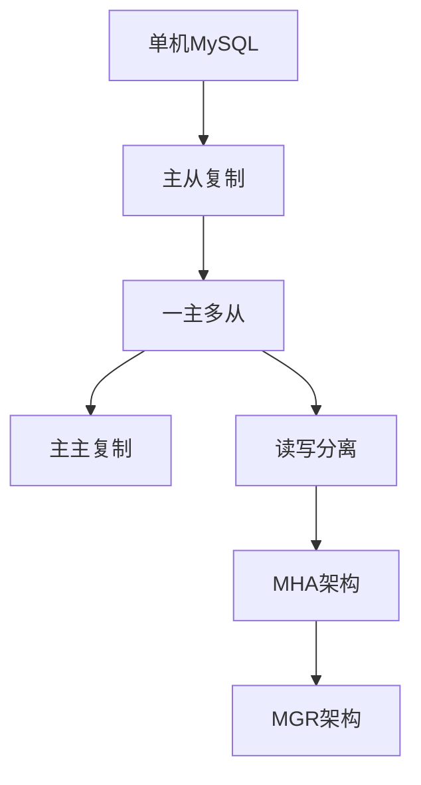

# MySQL运维-高可用架构

## 业务场景引入

高可用架构是保障业务连续性的关键：
- **7×24服务**：电商平台需要全天候不间断服务
- **故障容错**：单点故障不能影响整体业务
- **数据一致性**：确保数据在多个节点间保持一致
- **自动故障切换**：故障发生时快速自动恢复

## 高可用架构方案

### 架构演进路径



### 可用性级别对比

| 架构方案 | 可用性 | RTO | RPO | 复杂度 |
|----------|--------|-----|-----|--------|
| 主从复制 | 99.9% | 5-30分钟 | 分钟级 | 低 |
| MHA | 99.95% | 30-60秒 | 秒级 | 中 |
| MGR | 99.99% | 10-30秒 | 0 | 高 |

## 主从复制架构

### 基础配置

```sql
-- 主库配置 (my.cnf)
[mysqld]
server-id = 1
log-bin = mysql-bin
binlog-format = ROW
gtid-mode = ON
enforce-gtid-consistency = ON

-- 从库配置 (my.cnf)
[mysqld]
server-id = 2
read_only = 1
super_read_only = 1
relay_log_recovery = 1
```

### 主从搭建脚本

```bash
#!/bin/bash
# MySQL主从复制部署

MASTER_HOST="192.168.1.10"
SLAVE_HOST="192.168.1.11"
REPL_USER="repl"
REPL_PASS="password"

# 主库创建复制用户
mysql -h${MASTER_HOST} -uroot -p << EOF
CREATE USER '${REPL_USER}'@'%' IDENTIFIED BY '${REPL_PASS}';
GRANT REPLICATION SLAVE ON *.* TO '${REPL_USER}'@'%';
FLUSH PRIVILEGES;
EOF

# 获取主库状态
MASTER_STATUS=$(mysql -h${MASTER_HOST} -uroot -p -e "SHOW MASTER STATUS\G")
MASTER_FILE=$(echo "$MASTER_STATUS" | grep "File:" | awk '{print $2}')
MASTER_POS=$(echo "$MASTER_STATUS" | grep "Position:" | awk '{print $2}')

# 配置从库
mysql -h${SLAVE_HOST} -uroot -p << EOF
CHANGE MASTER TO 
  MASTER_HOST='${MASTER_HOST}',
  MASTER_USER='${REPL_USER}',
  MASTER_PASSWORD='${REPL_PASS}',
  MASTER_LOG_FILE='${MASTER_FILE}',
  MASTER_LOG_POS=${MASTER_POS};
START SLAVE;
EOF

echo "主从复制配置完成"
```

### 复制监控

```sql
-- 检查复制状态
SHOW SLAVE STATUS\G

-- 关键指标监控
SELECT 
    'Slave_IO_Running' as metric,
    IF(Slave_IO_Running='Yes', 'OK', 'ERROR') as status
FROM (SHOW SLAVE STATUS) s
UNION ALL
SELECT 
    'Slave_SQL_Running',
    IF(Slave_SQL_Running='Yes', 'OK', 'ERROR')
FROM (SHOW SLAVE STATUS) s
UNION ALL  
SELECT 
    'Seconds_Behind_Master',
    CASE 
        WHEN Seconds_Behind_Master IS NULL THEN 'ERROR'
        WHEN Seconds_Behind_Master > 60 THEN 'WARNING'
        ELSE 'OK'
    END
FROM (SHOW SLAVE STATUS) s;
```

## MHA架构实施

### MHA环境部署

```bash
#!/bin/bash
# MHA Manager部署脚本

# 安装MHA Manager
yum install -y perl-DBD-MySQL perl-Config-Tiny perl-Log-Dispatch
wget https://github.com/yoshinorim/mha4mysql-manager/releases/download/v0.58/mha4mysql-manager-0.58.tar.gz
tar xf mha4mysql-manager-0.58.tar.gz
cd mha4mysql-manager-0.58
perl Makefile.PL && make && make install

# 配置MHA
mkdir -p /etc/mha
mkdir -p /var/log/mha

# MHA配置文件
cat > /etc/mha/mysql_cluster.conf << EOF
[server default]
manager_log=/var/log/mha/mysql_cluster.log
manager_workdir=/var/log/mha
master_binlog_dir=/var/lib/mysql
user=mha
password=mha_password
ping_interval=1
repl_user=repl
repl_password=repl_password
ssh_user=root

[server1]
hostname=192.168.1.10
port=3306
candidate_master=1

[server2] 
hostname=192.168.1.11
port=3306
candidate_master=1

[server3]
hostname=192.168.1.12
port=3306
no_master=1
EOF
```

### MHA监控脚本

```bash
#!/bin/bash
# MHA状态监控

MHA_CONF="/etc/mha/mysql_cluster.conf"
MHA_LOG="/var/log/mha/mysql_cluster.log"

# 检查MHA Manager状态
check_mha_status() {
    masterha_check_status --conf=${MHA_CONF}
    return $?
}

# 检查复制状态
check_replication() {
    masterha_check_repl --conf=${MHA_CONF}
    return $?
}

# 启动MHA Manager
start_mha() {
    if ! check_mha_status; then
        echo "启动MHA Manager..."
        nohup masterha_manager --conf=${MHA_CONF} > ${MHA_LOG} 2>&1 &
        sleep 5
        
        if check_mha_status; then
            echo "MHA Manager启动成功"
        else
            echo "MHA Manager启动失败"
        fi
    else
        echo "MHA Manager已经运行"
    fi
}

# 主函数
case "$1" in
    status)
        check_mha_status
        ;;
    check)
        check_replication
        ;;
    start)
        start_mha
        ;;
    *)
        echo "Usage: $0 {status|check|start}"
        ;;
esac
```

## MGR集群架构

### MGR配置部署

```sql
-- MGR配置 (my.cnf)
[mysqld]
server-id = 1
gtid-mode = ON
enforce-gtid-consistency = ON
binlog-checksum = NONE
log-slave-updates = ON
log-bin = binlog
binlog-format = ROW

# MGR配置
plugin-load-add = group_replication.so
group_replication_group_name = "aaaaaaaa-aaaa-aaaa-aaaa-aaaaaaaaaaaa"
group_replication_start_on_boot = OFF
group_replication_local_address = "192.168.1.10:33061"
group_replication_group_seeds = "192.168.1.10:33061,192.168.1.11:33061,192.168.1.12:33061"

-- 初始化MGR
-- 在第一个节点执行
SET GLOBAL group_replication_bootstrap_group=ON;
START GROUP_REPLICATION;
SET GLOBAL group_replication_bootstrap_group=OFF;

-- 在其他节点执行
START GROUP_REPLICATION;
```

### MGR管理脚本

```python
#!/usr/bin/env python3
import mysql.connector
import time
import logging

class MGRManager:
    def __init__(self, hosts):
        self.hosts = hosts
        self.setup_logging()
    
    def setup_logging(self):
        logging.basicConfig(level=logging.INFO)
        self.logger = logging.getLogger(__name__)
    
    def get_connection(self, host):
        return mysql.connector.connect(
            host=host,
            user='admin',
            password='password',
            port=3306
        )
    
    def check_mgr_status(self):
        """检查MGR集群状态"""
        status_info = {}
        
        for host in self.hosts:
            try:
                conn = self.get_connection(host)
                cursor = conn.cursor(dictionary=True)
                
                # 检查节点状态
                cursor.execute("""
                    SELECT MEMBER_HOST, MEMBER_PORT, MEMBER_STATE, MEMBER_ROLE
                    FROM performance_schema.replication_group_members
                """)
                members = cursor.fetchall()
                
                # 检查是否有PRIMARY
                cursor.execute("""
                    SELECT COUNT(*) as primary_count
                    FROM performance_schema.replication_group_members
                    WHERE MEMBER_ROLE = 'PRIMARY'
                """)
                primary_count = cursor.fetchone()['primary_count']
                
                status_info[host] = {
                    'members': members,
                    'primary_count': primary_count,
                    'status': 'ONLINE' if primary_count > 0 else 'ERROR'
                }
                
                cursor.close()
                conn.close()
                
            except Exception as e:
                status_info[host] = {'status': 'ERROR', 'error': str(e)}
        
        return status_info
    
    def bootstrap_cluster(self, bootstrap_node):
        """引导MGR集群"""
        try:
            conn = self.get_connection(bootstrap_node)
            cursor = conn.cursor()
            
            # 引导集群
            cursor.execute("SET GLOBAL group_replication_bootstrap_group=ON")
            cursor.execute("START GROUP_REPLICATION")
            cursor.execute("SET GLOBAL group_replication_bootstrap_group=OFF")
            
            self.logger.info(f"MGR cluster bootstrapped on {bootstrap_node}")
            
            cursor.close()
            conn.close()
            
        except Exception as e:
            self.logger.error(f"Bootstrap failed: {e}")
    
    def join_cluster(self, node):
        """节点加入集群"""
        try:
            conn = self.get_connection(node)
            cursor = conn.cursor()
            
            cursor.execute("START GROUP_REPLICATION")
            
            # 等待节点加入
            for _ in range(30):
                cursor.execute("""
                    SELECT MEMBER_STATE FROM performance_schema.replication_group_members
                    WHERE MEMBER_HOST = %s
                """, (node,))
                result = cursor.fetchone()
                
                if result and result[0] == 'ONLINE':
                    self.logger.info(f"Node {node} joined cluster successfully")
                    break
                time.sleep(1)
            
            cursor.close()
            conn.close()
            
        except Exception as e:
            self.logger.error(f"Join cluster failed: {e}")

# 使用示例
mgr = MGRManager(['192.168.1.10', '192.168.1.11', '192.168.1.12'])
status = mgr.check_mgr_status()
print(status)
```

## ProxySQL读写分离

### ProxySQL配置

```sql
-- ProxySQL管理配置
INSERT INTO mysql_servers(hostgroup_id, hostname, port, weight) VALUES
(0, '192.168.1.10', 3306, 1000),  -- 写组
(1, '192.168.1.11', 3306, 900),   -- 读组
(1, '192.168.1.12', 3306, 900);   -- 读组

-- 用户配置
INSERT INTO mysql_users(username, password, default_hostgroup) VALUES
('app_user', 'app_password', 0);

-- 路由规则
INSERT INTO mysql_query_rules(rule_id, match_pattern, destination_hostgroup, apply) VALUES
(1, '^SELECT.*', 1, 1),
(2, '^INSERT.*', 0, 1),
(3, '^UPDATE.*', 0, 1),
(4, '^DELETE.*', 0, 1);

-- 应用配置
LOAD MYSQL SERVERS TO RUNTIME;
LOAD MYSQL USERS TO RUNTIME;  
LOAD MYSQL QUERY RULES TO RUNTIME;

SAVE MYSQL SERVERS TO DISK;
SAVE MYSQL USERS TO DISK;
SAVE MYSQL QUERY RULES TO DISK;
```

### 健康检查脚本

```bash
#!/bin/bash
# MySQL高可用健康检查

MYSQL_HOSTS=("192.168.1.10" "192.168.1.11" "192.168.1.12")
MYSQL_USER="monitor"
MYSQL_PASS="monitor_pass"

check_mysql_status() {
    local host=$1
    
    # 检查MySQL连接
    mysql -h${host} -u${MYSQL_USER} -p${MYSQL_PASS} \
          -e "SELECT 1" &>/dev/null
    
    if [ $? -eq 0 ]; then
        echo "MySQL ${host}: OK"
        
        # 检查复制延迟
        if [ "$host" != "${MYSQL_HOSTS[0]}" ]; then
            delay=$(mysql -h${host} -u${MYSQL_USER} -p${MYSQL_PASS} \
                   -e "SHOW SLAVE STATUS\G" | grep "Seconds_Behind_Master" | awk '{print $2}')
            
            if [ "$delay" != "NULL" ] && [ "$delay" -gt 60 ]; then
                echo "WARNING: Replication delay on ${host}: ${delay}s"
            fi
        fi
    else
        echo "ERROR: MySQL ${host} connection failed"
    fi
}

# 检查所有MySQL实例
for host in "${MYSQL_HOSTS[@]}"; do
    check_mysql_status $host
done

# 检查ProxySQL
mysql -h127.0.0.1 -P6032 -uadmin -padmin \
      -e "SELECT hostgroup_id, hostname, status FROM runtime_mysql_servers;" \
      2>/dev/null | grep -E "(ONLINE|OFFLINE)"
```

## 故障切换实战

### 自动故障切换

```python
#!/usr/bin/env python3
import mysql.connector
import time
import subprocess

class FailoverManager:
    def __init__(self, config):
        self.config = config
        self.master = config['master']
        self.slaves = config['slaves']
        self.vip = config['vip']
    
    def check_master_health(self):
        """检查主库健康状态"""
        try:
            conn = mysql.connector.connect(
                host=self.master,
                user='monitor',
                password='password',
                connection_timeout=5
            )
            conn.close()
            return True
        except:
            return False
    
    def promote_slave(self, slave_host):
        """提升从库为主库"""
        try:
            conn = mysql.connector.connect(
                host=slave_host,
                user='admin', 
                password='password'
            )
            cursor = conn.cursor()
            
            # 停止复制
            cursor.execute("STOP SLAVE")
            
            # 设置为可写
            cursor.execute("SET GLOBAL read_only = 0")
            cursor.execute("SET GLOBAL super_read_only = 0")
            
            # 切换VIP
            self.switch_vip(slave_host)
            
            print(f"Promoted {slave_host} to master")
            return True
            
        except Exception as e:
            print(f"Failed to promote {slave_host}: {e}")
            return False
    
    def switch_vip(self, new_master):
        """切换VIP到新主库"""
        # 这里实现VIP切换逻辑
        cmd = f"ip addr add {self.vip}/24 dev eth0"
        subprocess.run(cmd.split())
    
    def monitor_and_failover(self):
        """监控并执行故障切换"""
        failed_checks = 0
        
        while True:
            if not self.check_master_health():
                failed_checks += 1
                if failed_checks >= 3:  # 连续3次失败才切换
                    print(f"Master {self.master} failed, starting failover...")
                    
                    # 选择最适合的从库
                    for slave in self.slaves:
                        if self.promote_slave(slave):
                            break
                    break
            else:
                failed_checks = 0
            
            time.sleep(10)

# 配置示例
config = {
    'master': '192.168.1.10',
    'slaves': ['192.168.1.11', '192.168.1.12'],
    'vip': '192.168.1.100'
}

failover = FailoverManager(config)
failover.monitor_and_failover()
```

## 总结与最佳实践

### 高可用架构选择

1. **小型应用**：主从复制 + 手动切换
2. **中型应用**：MHA + 自动切换
3. **大型应用**：MGR + ProxySQL
4. **超大规模**：分布式架构

### 关键要素

- **监控告警**：实时监控集群状态
- **自动切换**：减少故障恢复时间  
- **数据一致性**：确保数据不丢失
- **测试验证**：定期进行故障演练

高可用架构需要根据业务需求选择合适方案，并建立完善的监控和运维体系。