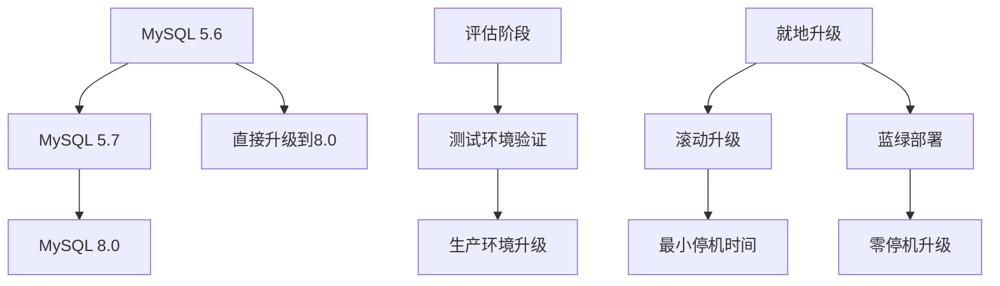

# 运维-升级与迁移

## 业务场景引入

数据库升级与迁移是运维工作中的重要环节：
- **版本升级**：从MySQL 5.7升级到8.0获取新特性
- **硬件迁移**：从物理机迁移到云环境
- **架构调整**：从单机迁移到集群架构
- **性能优化**：迁移到更高性能的硬件平台

## 升级策略规划

### 升级路径图



### 升级前评估

```sql
-- 检查当前版本
SELECT VERSION() as current_version;

-- 检查存储引擎
SELECT 
    engine,
    COUNT(*) as table_count,
    ROUND(SUM(data_length + index_length)/1024/1024/1024, 2) as size_gb
FROM information_schema.tables 
WHERE table_schema NOT IN ('information_schema', 'performance_schema', 'mysql', 'sys')
GROUP BY engine;

-- 检查字符集
SELECT 
    table_schema,
    table_name,
    table_collation
FROM information_schema.tables 
WHERE table_schema NOT IN ('information_schema', 'performance_schema', 'mysql', 'sys')
  AND table_collation NOT LIKE 'utf8mb4%'
ORDER BY table_schema, table_name;

-- 检查不兼容特性
SELECT 
    table_schema,
    table_name,
    column_name,
    data_type
FROM information_schema.columns
WHERE data_type IN ('timestamp', 'datetime') 
  AND is_nullable = 'NO' 
  AND column_default IS NULL
  AND table_schema NOT IN ('information_schema', 'performance_schema', 'mysql', 'sys');
```

### 升级兼容性检查

```python
#!/usr/bin/env python3
import mysql.connector
import re

class MySQLUpgradeChecker:
    def __init__(self, db_config):
        self.db_config = db_config
        self.warnings = []
        self.errors = []
    
    def connect(self):
        return mysql.connector.connect(**self.db_config)
    
    def check_version_compatibility(self):
        """检查版本兼容性"""
        conn = self.connect()
        cursor = conn.cursor()
        
        # 检查当前版本
        cursor.execute("SELECT VERSION()")
        current_version = cursor.fetchone()[0]
        
        print(f"当前版本: {current_version}")
        
        # 检查不推荐的特性
        deprecated_features = [
            "PASSWORD() function",
            "old_passwords system variable", 
            "mysql_old_password authentication plugin"
        ]
        
        for feature in deprecated_features:
            print(f"检查已弃用特性: {feature}")
        
        cursor.close()
        conn.close()
    
    def check_sql_mode(self):
        """检查SQL模式兼容性"""
        conn = self.connect()
        cursor = conn.cursor()
        
        cursor.execute("SELECT @@sql_mode")
        sql_mode = cursor.fetchone()[0]
        
        # MySQL 8.0默认SQL模式更严格
        strict_modes = [
            'ONLY_FULL_GROUP_BY',
            'STRICT_TRANS_TABLES', 
            'NO_ZERO_DATE',
            'NO_ZERO_IN_DATE',
            'ERROR_FOR_DIVISION_BY_ZERO'
        ]
        
        missing_modes = []
        for mode in strict_modes:
            if mode not in sql_mode:
                missing_modes.append(mode)
        
        if missing_modes:
            self.warnings.append(f"建议添加SQL模式: {', '.join(missing_modes)}")
        
        cursor.close()
        conn.close()
    
    def check_reserved_words(self):
        """检查保留字冲突"""
        conn = self.connect()
        cursor = conn.cursor()
        
        # MySQL 8.0新增保留字
        new_reserved_words = [
            'RANK', 'DENSE_RANK', 'ROW_NUMBER', 'NTILE',
            'LAG', 'LEAD', 'FIRST_VALUE', 'LAST_VALUE',
            'NTH_VALUE', 'CUME_DIST', 'PERCENT_RANK'
        ]
        
        for word in new_reserved_words:
            # 检查表名
            cursor.execute("""
                SELECT table_schema, table_name 
                FROM information_schema.tables
                WHERE table_name = %s 
                  AND table_schema NOT IN ('information_schema', 'performance_schema', 'mysql', 'sys')
            """, (word.lower(),))
            
            results = cursor.fetchall()
            for schema, table in results:
                self.errors.append(f"表名冲突: {schema}.{table} 与保留字 {word}")
            
            # 检查列名
            cursor.execute("""
                SELECT table_schema, table_name, column_name
                FROM information_schema.columns
                WHERE column_name = %s
                  AND table_schema NOT IN ('information_schema', 'performance_schema', 'mysql', 'sys')
            """, (word.lower(),))
            
            results = cursor.fetchall()
            for schema, table, column in results:
                self.warnings.append(f"列名可能冲突: {schema}.{table}.{column}")
        
        cursor.close()
        conn.close()
    
    def check_authentication(self):
        """检查认证插件兼容性"""
        conn = self.connect()
        cursor = conn.cursor()
        
        cursor.execute("""
            SELECT user, host, plugin 
            FROM mysql.user 
            WHERE plugin = 'mysql_old_password'
        """)
        
        old_password_users = cursor.fetchall()
        for user, host, plugin in old_password_users:
            self.errors.append(f"用户 {user}@{host} 使用已弃用的认证插件: {plugin}")
        
        cursor.close()
        conn.close()
    
    def generate_report(self):
        """生成升级检查报告"""
        print("\n=== MySQL 升级兼容性检查报告 ===")
        
        if self.errors:
            print("\n错误 (必须修复):")
            for error in self.errors:
                print(f"  ✗ {error}")
        
        if self.warnings:
            print("\n警告 (建议修复):")
            for warning in self.warnings:
                print(f"  ⚠ {warning}")
        
        if not self.errors and not self.warnings:
            print("\n✓ 未发现兼容性问题")
        
        return len(self.errors) == 0

# 使用示例
checker = MySQLUpgradeChecker({
    'host': 'localhost',
    'user': 'root',
    'password': 'password',
    'database': 'mysql'
})

checker.check_version_compatibility()
checker.check_sql_mode()
checker.check_reserved_words()
checker.check_authentication()

if checker.generate_report():
    print("\n可以开始升级流程")
else:
    print("\n请先修复错误后再升级")
```

## 就地升级实施

### MySQL 5.7 到 8.0 升级

```bash
#!/bin/bash
# MySQL 5.7 到 8.0 就地升级脚本

MYSQL_VERSION_OLD="5.7"
MYSQL_VERSION_NEW="8.0"
BACKUP_DIR="/backup/mysql_upgrade"
DATE=$(date +%Y%m%d_%H%M%S)

# 升级前检查
pre_upgrade_check() {
    echo "执行升级前检查..."
    
    # 检查当前版本
    CURRENT_VERSION=$(mysql -sNe "SELECT VERSION()")
    echo "当前版本: $CURRENT_VERSION"
    
    # 检查磁盘空间
    DATADIR=$(mysql -sNe "SELECT @@datadir")
    AVAILABLE_SPACE=$(df -BG "$DATADIR" | awk 'NR==2 {print $4}' | sed 's/G//')
    
    if [ "$AVAILABLE_SPACE" -lt 10 ]; then
        echo "错误: 磁盘空间不足，至少需要10GB"
        exit 1
    fi
    
    # 运行MySQL升级检查工具
    mysqlcheck -u root -p --all-databases --check-upgrade
    
    if [ $? -ne 0 ]; then
        echo "错误: 升级前检查失败"
        exit 1
    fi
}

# 创建备份
create_backup() {
    echo "创建升级前备份..."
    mkdir -p ${BACKUP_DIR}/${DATE}
    
    # 全库备份
    mysqldump \
        --all-databases \
        --single-transaction \
        --routines \
        --triggers \
        --events \
        --master-data=2 | gzip > ${BACKUP_DIR}/${DATE}/full_backup_before_upgrade.sql.gz
    
    if [ $? -eq 0 ]; then
        echo "备份完成: ${BACKUP_DIR}/${DATE}/full_backup_before_upgrade.sql.gz"
    else
        echo "错误: 备份失败"
        exit 1
    fi
    
    # 备份配置文件
    cp /etc/my.cnf ${BACKUP_DIR}/${DATE}/my.cnf.backup
}

# 停止MySQL服务
stop_mysql() {
    echo "停止MySQL服务..."
    systemctl stop mysql
    
    # 确认进程已停止
    sleep 5
    if pgrep mysqld > /dev/null; then
        echo "强制停止MySQL进程..."
        pkill -9 mysqld
    fi
}

# 升级MySQL软件包
upgrade_packages() {
    echo "升级MySQL软件包..."
    
    # 下载MySQL 8.0 RPM包
    if [ ! -f "mysql80-community-release-el7-3.noarch.rpm" ]; then
        wget https://dev.mysql.com/get/mysql80-community-release-el7-3.noarch.rpm
        rpm -ivh mysql80-community-release-el7-3.noarch.rpm
    fi
    
    # 升级MySQL
    yum update -y mysql-server mysql-client
    
    if [ $? -ne 0 ]; then
        echo "错误: 软件包升级失败"
        exit 1
    fi
}

# 启动MySQL并运行升级
start_and_upgrade() {
    echo "启动MySQL并运行mysql_upgrade..."
    
    # 启动MySQL
    systemctl start mysql
    
    # 等待MySQL启动
    for i in {1..30}; do
        if mysql -e "SELECT 1" 2>/dev/null; then
            break
        fi
        echo "等待MySQL启动... ($i/30)"
        sleep 2
    done
    
    # 运行mysql_upgrade
    mysql_upgrade -u root -p
    
    if [ $? -eq 0 ]; then
        echo "MySQL升级完成"
        systemctl restart mysql
    else
        echo "错误: mysql_upgrade失败"
        exit 1
    fi
}

# 升级后验证
post_upgrade_verification() {
    echo "升级后验证..."
    
    # 检查版本
    NEW_VERSION=$(mysql -sNe "SELECT VERSION()")
    echo "升级后版本: $NEW_VERSION"
    
    # 检查数据库完整性
    mysqlcheck -u root -p --all-databases
    
    # 检查关键表
    mysql -e "SELECT COUNT(*) FROM information_schema.tables" 2>/dev/null
    
    if [ $? -eq 0 ]; then
        echo "✓ 升级验证通过"
    else
        echo "✗ 升级验证失败"
        exit 1
    fi
}

# 主升级流程
main() {
    echo "开始MySQL ${MYSQL_VERSION_OLD} 到 ${MYSQL_VERSION_NEW} 升级"
    echo "升级时间: $(date)"
    
    pre_upgrade_check
    create_backup
    stop_mysql
    upgrade_packages
    start_and_upgrade
    post_upgrade_verification
    
    echo "MySQL升级成功完成!"
}

# 确认升级
read -p "确认开始MySQL升级？这将停机一段时间 (yes/no): " confirm
if [ "$confirm" = "yes" ]; then
    main
else
    echo "升级已取消"
fi
```

### 回滚方案

```bash
#!/bin/bash
# MySQL升级回滚脚本

BACKUP_DIR="/backup/mysql_upgrade"
BACKUP_DATE=$1

if [ -z "$BACKUP_DATE" ]; then
    echo "用法: $0 <backup_date>"
    echo "可用备份:"
    ls -1 $BACKUP_DIR | grep "^20"
    exit 1
fi

rollback_mysql() {
    echo "开始MySQL升级回滚..."
    
    # 停止MySQL
    systemctl stop mysql
    
    # 备份当前数据(以防万一)
    DATADIR=$(grep datadir /etc/my.cnf | cut -d= -f2)
    mv $DATADIR ${DATADIR}.rollback.$(date +%Y%m%d_%H%M%S)
    
    # 降级软件包
    yum downgrade -y mysql-server mysql-client
    
    # 恢复配置文件
    if [ -f "${BACKUP_DIR}/${BACKUP_DATE}/my.cnf.backup" ]; then
        cp ${BACKUP_DIR}/${BACKUP_DATE}/my.cnf.backup /etc/my.cnf
    fi
    
    # 初始化数据目录
    mysqld --initialize-insecure --user=mysql --datadir=$DATADIR
    
    # 启动MySQL
    systemctl start mysql
    
    # 恢复数据
    zcat ${BACKUP_DIR}/${BACKUP_DATE}/full_backup_before_upgrade.sql.gz | mysql
    
    echo "回滚完成"
}

echo "警告: 这将回滚MySQL升级并恢复到升级前状态"
read -p "确认继续？(yes/no): " confirm
if [ "$confirm" = "yes" ]; then
    rollback_mysql
fi
```

## 滚动升级方案

### 主从环境滚动升级

```bash
#!/bin/bash
# MySQL主从环境滚动升级

MASTER_HOST="192.168.1.10"
SLAVE_HOSTS=("192.168.1.11" "192.168.1.12")
MYSQL_USER="root"
MYSQL_PASS="password"

# 升级从库
upgrade_slave() {
    local slave_host=$1
    echo "升级从库: $slave_host"
    
    # 停止从库复制
    mysql -h$slave_host -u$MYSQL_USER -p$MYSQL_PASS -e "STOP SLAVE;"
    
    # 在从库上执行升级
    ssh root@$slave_host "
        systemctl stop mysql
        yum update -y mysql-server
        systemctl start mysql
        mysql_upgrade -u$MYSQL_USER -p$MYSQL_PASS
        systemctl restart mysql
    "
    
    # 重启复制
    mysql -h$slave_host -u$MYSQL_USER -p$MYSQL_PASS -e "START SLAVE;"
    
    # 检查复制状态
    SLAVE_STATUS=$(mysql -h$slave_host -u$MYSQL_USER -p$MYSQL_PASS -e "SHOW SLAVE STATUS\G")
    echo "$SLAVE_STATUS" | grep -E "(Slave_IO_Running|Slave_SQL_Running|Seconds_Behind_Master)"
}

# 升级主库
upgrade_master() {
    echo "升级主库: $MASTER_HOST"
    
    # 选择一个从库作为新主库
    local new_master=${SLAVE_HOSTS[0]}
    
    # 在新主库上停止复制
    mysql -h$new_master -u$MYSQL_USER -p$MYSQL_PASS -e "STOP SLAVE;"
    mysql -h$new_master -u$MYSQL_USER -p$MYSQL_PASS -e "RESET SLAVE ALL;"
    
    # 设置新主库为可写
    mysql -h$new_master -u$MYSQL_USER -p$MYSQL_PASS -e "SET GLOBAL read_only = 0;"
    
    # 更新应用配置指向新主库
    echo "请更新应用配置，将写操作指向: $new_master"
    read -p "配置已更新，按Enter继续..."
    
    # 升级原主库
    ssh root@$MASTER_HOST "
        systemctl stop mysql
        yum update -y mysql-server  
        systemctl start mysql
        mysql_upgrade -u$MYSQL_USER -p$MYSQL_PASS
        systemctl restart mysql
    "
    
    # 将原主库设置为从库
    MASTER_STATUS=$(mysql -h$new_master -u$MYSQL_USER -p$MYSQL_PASS -e "SHOW MASTER STATUS\G")
    MASTER_FILE=$(echo "$MASTER_STATUS" | grep "File:" | awk '{print $2}')
    MASTER_POS=$(echo "$MASTER_STATUS" | grep "Position:" | awk '{print $2}')
    
    mysql -h$MASTER_HOST -u$MYSQL_USER -p$MYSQL_PASS << EOF
CHANGE MASTER TO 
  MASTER_HOST='$new_master',
  MASTER_USER='repl',
  MASTER_PASSWORD='repl_password',
  MASTER_LOG_FILE='$MASTER_FILE',
  MASTER_LOG_POS=$MASTER_POS;
START SLAVE;
EOF
}

# 主升级流程
main() {
    echo "开始MySQL主从环境滚动升级"
    
    # 1. 升级所有从库
    for slave in "${SLAVE_HOSTS[@]}"; do
        upgrade_slave $slave
        echo "从库 $slave 升级完成，等待30秒..."
        sleep 30
    done
    
    # 2. 升级主库（含主从切换）
    upgrade_master
    
    echo "滚动升级完成"
}

main
```

## 数据迁移实战

### 不同版本间迁移

```python
#!/usr/bin/env python3
import mysql.connector
import subprocess
import threading
import time

class MySQLMigration:
    def __init__(self, source_config, target_config):
        self.source_config = source_config
        self.target_config = target_config
        
    def analyze_source(self):
        """分析源数据库"""
        conn = mysql.connector.connect(**self.source_config)
        cursor = conn.cursor(dictionary=True)
        
        # 获取数据库列表
        cursor.execute("SHOW DATABASES")
        databases = [db['Database'] for db in cursor.fetchall() 
                    if db['Database'] not in ('information_schema', 'performance_schema', 'mysql', 'sys')]
        
        migration_stats = {}
        
        for db in databases:
            cursor.execute(f"USE {db}")
            
            # 获取表信息
            cursor.execute("""
                SELECT table_name, table_rows, 
                       ROUND((data_length + index_length) / 1024 / 1024, 2) as size_mb
                FROM information_schema.tables 
                WHERE table_schema = %s AND table_type = 'BASE TABLE'
                ORDER BY (data_length + index_length) DESC
            """, (db,))
            
            tables = cursor.fetchall()
            migration_stats[db] = {
                'table_count': len(tables),
                'total_rows': sum(t['table_rows'] or 0 for t in tables),
                'total_size_mb': sum(t['size_mb'] or 0 for t in tables),
                'tables': tables
            }
        
        cursor.close()
        conn.close()
        
        return migration_stats
    
    def migrate_schema(self, database):
        """迁移数据库结构"""
        print(f"迁移数据库结构: {database}")
        
        # 使用mysqldump导出结构
        dump_cmd = [
            'mysqldump',
            f'--host={self.source_config["host"]}',
            f'--user={self.source_config["user"]}',
            f'--password={self.source_config["password"]}',
            '--no-data',
            '--routines',
            '--triggers',
            '--events',
            database
        ]
        
        # 导入到目标数据库
        import_cmd = [
            'mysql',
            f'--host={self.target_config["host"]}',
            f'--user={self.target_config["user"]}',
            f'--password={self.target_config["password"]}'
        ]
        
        # 执行结构迁移
        dump_process = subprocess.Popen(dump_cmd, stdout=subprocess.PIPE)
        import_process = subprocess.Popen(import_cmd, stdin=dump_process.stdout)
        
        dump_process.stdout.close()
        import_process.communicate()
        
        return import_process.returncode == 0
    
    def migrate_data_parallel(self, database, table, chunk_size=10000):
        """并行数据迁移"""
        source_conn = mysql.connector.connect(**self.source_config)
        target_conn = mysql.connector.connect(**self.target_config)
        
        try:
            # 获取表的主键
            source_cursor = source_conn.cursor()
            source_cursor.execute(f"USE {database}")
            source_cursor.execute(f"SHOW INDEX FROM {table} WHERE Key_name = 'PRIMARY'")
            primary_key = source_cursor.fetchone()
            
            if not primary_key:
                print(f"表 {table} 没有主键，使用单线程迁移")
                return self.migrate_table_single_thread(database, table)
            
            pk_column = primary_key[4]  # Column_name
            
            # 获取主键范围
            source_cursor.execute(f"SELECT MIN({pk_column}), MAX({pk_column}), COUNT(*) FROM {table}")
            min_id, max_id, total_rows = source_cursor.fetchone()
            
            if not min_id or not max_id:
                print(f"表 {table} 为空，跳过")
                return True
            
            print(f"迁移表 {database}.{table}: {total_rows} 行，主键范围 {min_id}-{max_id}")
            
            # 分块迁移
            current_id = min_id
            migrated_rows = 0
            
            while current_id <= max_id:
                end_id = min(current_id + chunk_size - 1, max_id)
                
                # 导出数据块
                export_query = f"""
                    SELECT * FROM {table} 
                    WHERE {pk_column} BETWEEN {current_id} AND {end_id}
                """
                
                source_cursor.execute(export_query)
                rows = source_cursor.fetchall()
                
                if rows:
                    # 构建INSERT语句
                    columns = [desc[0] for desc in source_cursor.description]
                    placeholders = ','.join(['%s'] * len(columns))
                    insert_query = f"INSERT INTO {database}.{table} ({','.join(columns)}) VALUES ({placeholders})"
                    
                    # 批量插入
                    target_cursor = target_conn.cursor()
                    target_cursor.execute(f"USE {database}")
                    target_cursor.executemany(insert_query, rows)
                    target_conn.commit()
                    target_cursor.close()
                    
                    migrated_rows += len(rows)
                    print(f"已迁移 {migrated_rows}/{total_rows} 行 ({migrated_rows/total_rows*100:.1f}%)")
                
                current_id = end_id + 1
            
            return True
            
        except Exception as e:
            print(f"数据迁移失败: {e}")
            return False
        finally:
            source_conn.close()
            target_conn.close()
    
    def verify_migration(self, database):
        """验证迁移结果"""
        source_conn = mysql.connector.connect(**self.source_config)
        target_conn = mysql.connector.connect(**self.target_config)
        
        try:
            source_cursor = source_conn.cursor()
            target_cursor = target_conn.cursor()
            
            # 比较表数量
            source_cursor.execute(f"SELECT COUNT(*) FROM information_schema.tables WHERE table_schema = '{database}'")
            source_table_count = source_cursor.fetchone()[0]
            
            target_cursor.execute(f"SELECT COUNT(*) FROM information_schema.tables WHERE table_schema = '{database}'")
            target_table_count = target_cursor.fetchone()[0]
            
            print(f"表数量对比 - 源: {source_table_count}, 目标: {target_table_count}")
            
            # 比较每个表的行数
            source_cursor.execute(f"""
                SELECT table_name, table_rows 
                FROM information_schema.tables 
                WHERE table_schema = '{database}' AND table_type = 'BASE TABLE'
            """)
            
            for table_name, source_rows in source_cursor.fetchall():
                target_cursor.execute(f"SELECT COUNT(*) FROM {database}.{table_name}")
                target_rows = target_cursor.fetchone()[0]
                
                if source_rows != target_rows:
                    print(f"⚠ 表 {table_name} 行数不匹配: 源({source_rows}) vs 目标({target_rows})")
                else:
                    print(f"✓ 表 {table_name} 验证通过: {target_rows} 行")
            
        finally:
            source_conn.close()
            target_conn.close()

# 使用示例
source_config = {
    'host': '192.168.1.10',
    'user': 'root',
    'password': 'password',
    'port': 3306
}

target_config = {
    'host': '192.168.1.20', 
    'user': 'root',
    'password': 'password',
    'port': 3306
}

migration = MySQLMigration(source_config, target_config)

# 分析源数据库
stats = migration.analyze_source()
for db, info in stats.items():
    print(f"数据库 {db}: {info['table_count']} 表, {info['total_rows']} 行, {info['total_size_mb']:.2f} MB")

# 执行迁移
for database in stats.keys():
    if migration.migrate_schema(database):
        print(f"数据库 {database} 结构迁移完成")
        
        # 迁移数据
        for table in stats[database]['tables']:
            migration.migrate_data_parallel(database, table['table_name'])
        
        # 验证迁移
        migration.verify_migration(database)
```

## 总结与最佳实践

### 升级策略选择

1. **就地升级**：适合测试环境，停机时间长
2. **滚动升级**：适合主从环境，停机时间短
3. **蓝绿部署**：适合云环境，零停机升级
4. **数据迁移**：适合跨版本大升级

### 关键成功要素

- **充分测试**：在测试环境完整验证升级流程
- **回滚方案**：准备完整的回滚计划和脚本
- **监控告警**：升级过程中持续监控系统状态
- **文档记录**：详细记录升级过程和问题处理

MySQL升级与迁移需要careful规划和充分测试，确保业务连续性和数据安全。