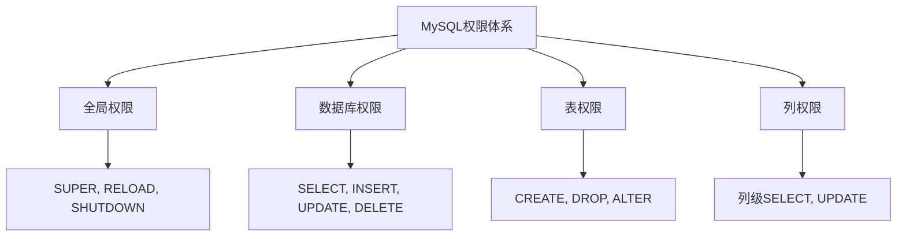

# MySQL运维-安全管理

## 业务场景引入

数据库安全是运维工作的重中之重：
- **数据保护**：防止敏感数据泄露和恶意访问
- **权限控制**：精细化用户权限管理
- **审计合规**：满足行业安全标准要求
- **攻击防护**：防范SQL注入、暴力破解等攻击

## 用户权限管理

### 权限体系架构



### 安全用户创建

```sql
-- 创建应用用户（最小权限原则）
CREATE USER 'app_user'@'192.168.1.%' IDENTIFIED BY 'StrongPassword123!';

-- 只授予必要的数据库权限
GRANT SELECT, INSERT, UPDATE, DELETE ON ecommerce.* TO 'app_user'@'192.168.1.%';

-- 创建只读用户
CREATE USER 'readonly_user'@'%' IDENTIFIED BY 'ReadOnlyPass456!';
GRANT SELECT ON ecommerce.* TO 'readonly_user'@'%';

-- 创建备份用户
CREATE USER 'backup_user'@'localhost' IDENTIFIED BY 'BackupPass789!';
GRANT SELECT, LOCK TABLES, SHOW VIEW, EVENT, TRIGGER, RELOAD ON *.* TO 'backup_user'@'localhost';

-- 创建监控用户
CREATE USER 'monitor_user'@'localhost' IDENTIFIED BY 'MonitorPass000!';
GRANT PROCESS, REPLICATION CLIENT ON *.* TO 'monitor_user'@'localhost';
GRANT SELECT ON performance_schema.* TO 'monitor_user'@'localhost';

-- 创建开发用户（限制开发库）
CREATE USER 'dev_user'@'%' IDENTIFIED BY 'DevPass111!';
GRANT ALL PRIVILEGES ON dev_ecommerce.* TO 'dev_user'@'%';
GRANT SELECT ON ecommerce.* TO 'dev_user'@'%';  -- 生产库只读

-- 应用权限
FLUSH PRIVILEGES;
```

### 角色管理(MySQL 8.0+)

```sql
-- 创建角色
CREATE ROLE 'app_role', 'admin_role', 'readonly_role';

-- 为角色分配权限
GRANT SELECT, INSERT, UPDATE, DELETE ON ecommerce.* TO 'app_role';
GRANT ALL PRIVILEGES ON *.* TO 'admin_role';
GRANT SELECT ON *.* TO 'readonly_role';

-- 将角色分配给用户
CREATE USER 'alice'@'%' IDENTIFIED BY 'AlicePassword123!';
GRANT 'app_role' TO 'alice'@'%';

CREATE USER 'bob'@'%' IDENTIFIED BY 'BobPassword456!';
GRANT 'readonly_role' TO 'bob'@'%';

-- 设置默认角色
ALTER USER 'alice'@'%' DEFAULT ROLE 'app_role';
ALTER USER 'bob'@'%' DEFAULT ROLE 'readonly_role';

-- 查看角色分配
SELECT * FROM mysql.role_edges;
SELECT * FROM mysql.default_roles;
```

### 权限审计脚本

```python
#!/usr/bin/env python3
import mysql.connector
from datetime import datetime

class MySQLSecurityAuditor:
    def __init__(self, db_config):
        self.db_config = db_config
        
    def connect(self):
        return mysql.connector.connect(**self.db_config)
    
    def audit_users(self):
        """用户权限审计"""
        conn = self.connect()
        cursor = conn.cursor(dictionary=True)
        
        print("=== 用户权限审计报告 ===")
        print(f"审计时间: {datetime.now()}")
        
        # 检查超级用户
        cursor.execute("""
            SELECT user, host, Super_priv 
            FROM mysql.user 
            WHERE Super_priv = 'Y'
        """)
        super_users = cursor.fetchall()
        
        print(f"\n超级用户 ({len(super_users)}个):")
        for user in super_users:
            print(f"  - {user['user']}@{user['host']}")
        
        # 检查空密码用户
        cursor.execute("""
            SELECT user, host 
            FROM mysql.user 
            WHERE authentication_string = '' OR authentication_string IS NULL
        """)
        empty_password_users = cursor.fetchall()
        
        if empty_password_users:
            print(f"\n⚠ 空密码用户 ({len(empty_password_users)}个):")
            for user in empty_password_users:
                print(f"  - {user['user']}@{user['host']}")
        
        # 检查所有权限用户
        cursor.execute("""
            SELECT grantee, privilege_type, table_schema 
            FROM information_schema.user_privileges 
            WHERE privilege_type = 'ALL PRIVILEGES'
        """)
        all_privileges_users = cursor.fetchall()
        
        if all_privileges_users:
            print(f"\n拥有ALL PRIVILEGES的用户:")
            for user in all_privileges_users:
                print(f"  - {user['grantee']}")
        
        cursor.close()
        conn.close()
    
    def check_password_policy(self):
        """密码策略检查"""
        conn = self.connect()
        cursor = conn.cursor()
        
        print("\n=== 密码策略检查 ===")
        
        # 检查密码验证插件
        cursor.execute("SHOW VARIABLES LIKE 'validate_password%'")
        password_vars = cursor.fetchall()
        
        for var_name, var_value in password_vars:
            print(f"{var_name}: {var_value}")
        
        cursor.close()
        conn.close()
    
    def audit_connections(self):
        """连接审计"""
        conn = self.connect()
        cursor = conn.cursor(dictionary=True)
        
        print("\n=== 连接审计 ===")
        
        # 当前连接统计
        cursor.execute("""
            SELECT user, host, db, command, time, state, 
                   LEFT(info, 50) as query_snippet
            FROM information_schema.processlist 
            WHERE command != 'Sleep'
            ORDER BY time DESC
        """)
        active_connections = cursor.fetchall()
        
        print(f"活跃连接数: {len(active_connections)}")
        for conn_info in active_connections[:10]:  # 显示前10个
            print(f"  {conn_info['user']}@{conn_info['host']} - {conn_info['command']} - {conn_info['time']}s")
        
        cursor.close()
        conn.close()

# 使用示例
auditor = MySQLSecurityAuditor({
    'host': 'localhost',
    'user': 'audit_user', 
    'password': 'password',
    'database': 'mysql'
})

auditor.audit_users()
auditor.check_password_policy()
auditor.audit_connections()
```

## 网络安全配置

### 防火墙和网络配置

```bash
#!/bin/bash
# MySQL网络安全配置

# 配置防火墙规则
configure_firewall() {
    echo "配置防火墙规则..."
    
    # 只允许特定IP访问MySQL
    iptables -A INPUT -p tcp --dport 3306 -s 192.168.1.0/24 -j ACCEPT
    iptables -A INPUT -p tcp --dport 3306 -j DROP
    
    # 保存规则
    iptables-save > /etc/iptables/rules.v4
    
    echo "防火墙配置完成"
}

# SSL/TLS配置
configure_ssl() {
    echo "配置SSL/TLS..."
    
    MYSQL_SSL_DIR="/etc/mysql/ssl"
    mkdir -p $MYSQL_SSL_DIR
    
    # 生成CA证书
    openssl genrsa 2048 > $MYSQL_SSL_DIR/ca-key.pem
    openssl req -new -x509 -nodes -days 3650 \
        -key $MYSQL_SSL_DIR/ca-key.pem \
        -out $MYSQL_SSL_DIR/ca.pem \
        -subj "/C=CN/ST=Beijing/L=Beijing/O=Company/CN=MySQL-CA"
    
    # 生成服务器证书
    openssl req -newkey rsa:2048 -days 3650 -nodes \
        -keyout $MYSQL_SSL_DIR/server-key.pem \
        -out $MYSQL_SSL_DIR/server-req.pem \
        -subj "/C=CN/ST=Beijing/L=Beijing/O=Company/CN=MySQL-Server"
    
    openssl rsa -in $MYSQL_SSL_DIR/server-key.pem \
        -out $MYSQL_SSL_DIR/server-key.pem
    
    openssl x509 -req -in $MYSQL_SSL_DIR/server-req.pem \
        -days 3650 -CA $MYSQL_SSL_DIR/ca.pem \
        -CAkey $MYSQL_SSL_DIR/ca-key.pem \
        -set_serial 01 \
        -out $MYSQL_SSL_DIR/server-cert.pem
    
    # 生成客户端证书
    openssl req -newkey rsa:2048 -days 3650 -nodes \
        -keyout $MYSQL_SSL_DIR/client-key.pem \
        -out $MYSQL_SSL_DIR/client-req.pem \
        -subj "/C=CN/ST=Beijing/L=Beijing/O=Company/CN=MySQL-Client"
    
    openssl rsa -in $MYSQL_SSL_DIR/client-key.pem \
        -out $MYSQL_SSL_DIR/client-key.pem
    
    openssl x509 -req -in $MYSQL_SSL_DIR/client-req.pem \
        -days 3650 -CA $MYSQL_SSL_DIR/ca.pem \
        -CAkey $MYSQL_SSL_DIR/ca-key.pem \
        -set_serial 01 \
        -out $MYSQL_SSL_DIR/client-cert.pem
    
    # 设置权限
    chown -R mysql:mysql $MYSQL_SSL_DIR
    chmod 600 $MYSQL_SSL_DIR/*-key.pem
    chmod 644 $MYSQL_SSL_DIR/*.pem
    
    echo "SSL证书生成完成"
}

# 更新my.cnf SSL配置
update_mysql_config() {
    cat >> /etc/mysql/my.cnf << EOF

# SSL Configuration
[mysqld]
ssl_cert = /etc/mysql/ssl/server-cert.pem
ssl_key = /etc/mysql/ssl/server-key.pem
ssl_ca = /etc/mysql/ssl/ca.pem
require_secure_transport = ON

[client]
ssl_cert = /etc/mysql/ssl/client-cert.pem
ssl_key = /etc/mysql/ssl/client-key.pem
ssl_ca = /etc/mysql/ssl/ca.pem
EOF

    systemctl restart mysql
    echo "MySQL SSL配置更新完成"
}

configure_firewall
configure_ssl
update_mysql_config
```

### SSL用户配置

```sql
-- 创建要求SSL的用户
CREATE USER 'secure_user'@'%' IDENTIFIED BY 'SecurePassword123!' REQUIRE SSL;

-- 创建要求X509证书的用户
CREATE USER 'cert_user'@'%' IDENTIFIED BY 'CertPassword456!' REQUIRE X509;

-- 创建要求特定证书的用户
CREATE USER 'specific_cert_user'@'%' IDENTIFIED BY 'SpecificPassword789!' 
REQUIRE SUBJECT '/C=CN/ST=Beijing/L=Beijing/O=Company/CN=MySQL-Client';

-- 验证SSL连接
SHOW STATUS LIKE 'Ssl_cipher';
SELECT * FROM performance_schema.session_status WHERE variable_name = 'Ssl_cipher';
```

## 数据加密

### 透明数据加密(TDE)

```sql
-- MySQL 8.0 数据加密配置

-- 安装keyring插件
INSTALL PLUGIN keyring_file SONAME 'keyring_file.so';

-- 配置加密
-- my.cnf 配置
/*
[mysqld]
early-plugin-load = keyring_file.so
keyring_file_data = /var/lib/mysql-keyring/keyring
innodb_encrypt_tables = ON
*/

-- 创建加密表
CREATE TABLE sensitive_data (
    id INT PRIMARY KEY,
    credit_card VARCHAR(20),
    ssn VARCHAR(11),
    password VARCHAR(100)
) ENCRYPTION = 'Y';

-- 加密现有表
ALTER TABLE users ENCRYPTION = 'Y';

-- 检查加密状态
SELECT 
    table_schema,
    table_name,
    create_options
FROM information_schema.tables 
WHERE create_options LIKE '%ENCRYPTION%';
```

### 列级加密

```sql
-- 使用AES加密敏感列
-- 创建加密函数
DELIMITER //
CREATE FUNCTION encrypt_data(data TEXT, key_str VARCHAR(128))
RETURNS BLOB
READS SQL DATA
DETERMINISTIC
BEGIN
    RETURN AES_ENCRYPT(data, key_str);
END//

CREATE FUNCTION decrypt_data(encrypted_data BLOB, key_str VARCHAR(128))
RETURNS TEXT
READS SQL DATA
DETERMINISTIC  
BEGIN
    RETURN AES_DECRYPT(encrypted_data, key_str);
END//
DELIMITER ;

-- 使用加密函数
INSERT INTO users (username, email, encrypted_phone) VALUES 
('john', 'john@example.com', encrypt_data('13888888888', 'encryption_key'));

-- 查询解密数据
SELECT 
    username,
    email,
    decrypt_data(encrypted_phone, 'encryption_key') as phone
FROM users;

-- 创建视图隐藏加密细节
CREATE VIEW user_info AS
SELECT 
    id,
    username,
    email,
    decrypt_data(encrypted_phone, 'encryption_key') as phone
FROM users;
```

## 审计日志

### 审计日志配置

```sql
-- 安装审计插件 (MySQL Enterprise版)
INSTALL PLUGIN audit_log SONAME 'audit_log.so';

-- 配置审计策略
-- my.cnf 配置
/*
[mysqld]
plugin-load = audit_log.so
audit_log_policy = ALL
audit_log_format = JSON
audit_log_file = /var/log/mysql/audit.log
audit_log_rotate_on_size = 100M
audit_log_rotations = 10
*/

-- 查看审计状态
SHOW VARIABLES LIKE 'audit_log%';

-- 设置审计过滤器
SELECT audit_log_filter_set_filter('login_filter', '
{
  "filter": {
    "class": {
      "name": "connection"
    }
  }
}');

-- 应用过滤器到用户
SELECT audit_log_filter_set_user('app_user@%', 'login_filter');
```

### 自定义审计脚本

```python
#!/usr/bin/env python3
import mysql.connector
import json
import time
from datetime import datetime

class MySQLAuditor:
    def __init__(self, db_config, audit_config):
        self.db_config = db_config
        self.audit_config = audit_config
        
    def log_connection(self, user, host, database, action):
        """记录连接审计日志"""
        audit_entry = {
            'timestamp': datetime.now().isoformat(),
            'event_type': 'CONNECTION',
            'user': user,
            'host': host, 
            'database': database,
            'action': action
        }
        
        with open(self.audit_config['log_file'], 'a') as f:
            f.write(json.dumps(audit_entry) + '\n')
    
    def log_query(self, user, database, query, execution_time):
        """记录查询审计日志"""
        # 敏感操作检测
        sensitive_operations = ['DROP', 'DELETE', 'TRUNCATE', 'ALTER', 'GRANT', 'REVOKE']
        is_sensitive = any(op in query.upper() for op in sensitive_operations)
        
        audit_entry = {
            'timestamp': datetime.now().isoformat(),
            'event_type': 'QUERY',
            'user': user,
            'database': database,
            'query': query[:500],  # 截断长查询
            'execution_time': execution_time,
            'is_sensitive': is_sensitive
        }
        
        with open(self.audit_config['log_file'], 'a') as f:
            f.write(json.dumps(audit_entry) + '\n')
    
    def monitor_activities(self):
        """监控数据库活动"""
        conn = mysql.connector.connect(**self.db_config)
        
        try:
            while True:
                cursor = conn.cursor(dictionary=True)
                
                # 监控当前连接
                cursor.execute("""
                    SELECT user, host, db, command, time, state, info
                    FROM information_schema.processlist
                    WHERE command != 'Sleep' AND user != 'system user'
                """)
                
                for process in cursor.fetchall():
                    if process['info']:  # 有SQL语句执行
                        self.log_query(
                            process['user'],
                            process['db'], 
                            process['info'],
                            process['time']
                        )
                
                cursor.close()
                time.sleep(5)  # 每5秒检查一次
                
        except KeyboardInterrupt:
            print("审计监控停止")
        finally:
            conn.close()

# 使用示例
auditor = MySQLAuditor(
    db_config={
        'host': 'localhost',
        'user': 'audit_user',
        'password': 'password'
    },
    audit_config={
        'log_file': '/var/log/mysql/custom_audit.log'
    }
)

auditor.monitor_activities()
```

## 安全加固检查

### 安全基线检查脚本

```bash
#!/bin/bash
# MySQL安全基线检查

check_mysql_security() {
    echo "=== MySQL安全基线检查 ==="
    
    # 检查MySQL版本
    MYSQL_VERSION=$(mysql -V)
    echo "MySQL版本: $MYSQL_VERSION"
    
    # 检查root用户
    echo "检查root用户配置..."
    mysql -e "SELECT user, host, authentication_string FROM mysql.user WHERE user = 'root';"
    
    # 检查匿名用户
    ANONYMOUS_USERS=$(mysql -sNe "SELECT COUNT(*) FROM mysql.user WHERE user = '';")
    if [ "$ANONYMOUS_USERS" -gt 0 ]; then
        echo "⚠ 发现匿名用户: $ANONYMOUS_USERS 个"
    else
        echo "✓ 无匿名用户"
    fi
    
    # 检查test数据库
    TEST_DB=$(mysql -sNe "SELECT COUNT(*) FROM information_schema.schemata WHERE schema_name = 'test';")
    if [ "$TEST_DB" -gt 0 ]; then
        echo "⚠ 发现test数据库"
    else
        echo "✓ 无test数据库"
    fi
    
    # 检查SSL配置
    SSL_STATUS=$(mysql -sNe "SHOW VARIABLES LIKE 'have_ssl';" | awk '{print $2}')
    echo "SSL状态: $SSL_STATUS"
    
    # 检查日志配置
    echo "检查日志配置..."
    mysql -e "SHOW VARIABLES LIKE '%log%';" | grep -E "(general_log|slow_query_log|log_bin)"
    
    # 检查网络配置
    BIND_ADDRESS=$(mysql -sNe "SHOW VARIABLES LIKE 'bind_address';" | awk '{print $2}')
    echo "绑定地址: $BIND_ADDRESS"
    
    # 检查权限
    echo "检查高权限用户..."
    mysql -e "SELECT user, host FROM mysql.user WHERE Super_priv = 'Y' OR Grant_priv = 'Y';"
}

check_mysql_security
```

## 总结与最佳实践

### 安全策略框架

1. **最小权限原则**
   - 用户只授予必要权限
   - 定期审计权限分配
   - 使用角色管理权限

2. **网络安全**
   - 配置防火墙规则
   - 启用SSL/TLS加密
   - 限制网络访问

3. **数据保护**
   - 敏感数据加密存储
   - 定期安全基线检查
   - 完善审计日志

4. **持续监控**
   - 实时监控异常活动
   - 建立安全告警机制
   - 定期安全评估

MySQL安全管理需要建立完善的安全体系，从用户权限、网络安全、数据加密到审计监控，全方位保护数据库安全。