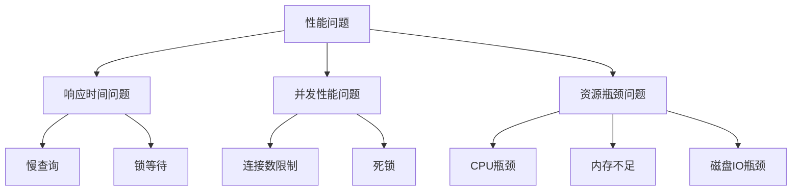

# 问题排查-性能问题诊断

## 业务场景引入

性能问题是MySQL运维中最常见的挑战：
- **查询缓慢**：用户反馈页面加载时间过长
- **连接超时**：高并发时出现连接池耗尽
- **CPU飙升**：服务器CPU使用率持续100%
- **锁等待**：业务操作频繁超时失败

## 性能问题分类

### 问题分析框架



### 关键性能指标

| 指标类别 | 关键指标 | 正常范围 | 告警阈值 |
|----------|----------|----------|----------|
| 响应时间 | 平均查询时间 | <100ms | >500ms |
| 吞吐量 | QPS | 根据业务 | 下降50% |
| 连接 | 活跃连接数 | <80% | >90% |
| 缓存 | 缓冲池命中率 | >95% | <90% |

## 慢查询诊断

### 慢查询日志分析

```bash
#!/bin/bash
# 慢查询分析脚本

SLOW_LOG="/var/log/mysql/slow.log"

# 分析最慢的10个查询
echo "=== Top 10 慢查询 (按执行时间) ==="
mysqldumpslow -s t -t 10 $SLOW_LOG

# 分析最频繁的慢查询
echo "=== Top 10 慢查询 (按执行次数) ==="
mysqldumpslow -s c -t 10 $SLOW_LOG

# 实时监控慢查询
tail -f $SLOW_LOG | grep -E "(Query_time|User@Host|^use)"
```

### Performance Schema分析

```sql
-- 查找最耗时的SQL语句
SELECT 
    digest_text,
    count_star as exec_count,
    ROUND(avg_timer_wait/1000000000, 3) as avg_time_sec,
    ROUND(sum_timer_wait/1000000000, 3) as total_time_sec,
    avg_rows_examined,
    avg_rows_sent
FROM performance_schema.events_statements_summary_by_digest
WHERE schema_name = 'ecommerce'
ORDER BY avg_timer_wait DESC
LIMIT 10;

-- 查找扫描行数最多的查询
SELECT 
    digest_text,
    count_star,
    avg_rows_examined,
    avg_rows_sent,
    ROUND(avg_rows_examined/avg_rows_sent, 2) as scan_ratio
FROM performance_schema.events_statements_summary_by_digest
WHERE avg_rows_examined > 10000
ORDER BY avg_rows_examined DESC
LIMIT 10;

-- 查看当前执行中的查询
SELECT 
    processlist_id,
    processlist_user,
    processlist_host,
    processlist_command,
    processlist_time,
    LEFT(processlist_info, 100) as query_snippet
FROM performance_schema.events_statements_current
WHERE processlist_command != 'Sleep'
ORDER BY processlist_time DESC;
```

### 索引使用分析

```sql
-- 未使用索引的表
SELECT 
    object_schema,
    object_name,
    count_read as table_reads,
    count_fetch as index_reads
FROM performance_schema.table_io_waits_summary_by_table
WHERE object_schema = 'ecommerce'
  AND count_fetch > 0
  AND count_read/count_fetch > 10
ORDER BY count_read DESC;

-- 从未使用的索引
SELECT 
    object_schema,
    object_name,
    index_name
FROM performance_schema.table_io_waits_summary_by_index_usage
WHERE object_schema = 'ecommerce'
  AND count_fetch = 0
  AND count_insert = 0
  AND count_update = 0
  AND count_delete = 0;
```

## 锁等待诊断

### 死锁和锁等待分析

```sql
-- 当前锁等待情况
SELECT 
    r.trx_id as waiting_trx,
    r.trx_mysql_thread_id as waiting_thread,
    LEFT(r.trx_query, 100) as waiting_query,
    b.trx_id as blocking_trx,
    b.trx_mysql_thread_id as blocking_thread,
    LEFT(b.trx_query, 100) as blocking_query,
    TIMESTAMPDIFF(SECOND, r.trx_wait_started, NOW()) as wait_seconds
FROM information_schema.innodb_lock_waits w
INNER JOIN information_schema.innodb_trx b ON b.trx_id = w.blocking_trx_id
INNER JOIN information_schema.innodb_trx r ON r.trx_id = w.requesting_trx_id;

-- 长时间运行的事务
SELECT 
    trx_id,
    trx_state,
    trx_started,
    TIMESTAMPDIFF(SECOND, trx_started, NOW()) as duration_sec,
    trx_rows_locked,
    trx_rows_modified,
    LEFT(trx_query, 100) as query_snippet
FROM information_schema.innodb_trx
WHERE TIMESTAMPDIFF(SECOND, trx_started, NOW()) > 60
ORDER BY trx_started;

-- 查看死锁信息
SHOW ENGINE INNODB STATUS;
```

### 锁监控脚本

```python
#!/usr/bin/env python3
import mysql.connector
import time
from datetime import datetime

class MySQLLockMonitor:
    def __init__(self, db_config):
        self.db_config = db_config
    
    def check_lock_waits(self):
        """检查锁等待情况"""
        conn = mysql.connector.connect(**self.db_config)
        cursor = conn.cursor(dictionary=True)
        
        cursor.execute("""
            SELECT 
                r.trx_id as waiting_trx,
                r.trx_mysql_thread_id as waiting_thread,
                SUBSTRING(r.trx_query, 1, 100) as waiting_query,
                b.trx_id as blocking_trx,
                TIMESTAMPDIFF(SECOND, r.trx_wait_started, NOW()) as wait_seconds
            FROM information_schema.innodb_lock_waits w
            INNER JOIN information_schema.innodb_trx b ON b.trx_id = w.blocking_trx_id
            INNER JOIN information_schema.innodb_trx r ON r.trx_id = w.requesting_trx_id
        """)
        
        lock_waits = cursor.fetchall()
        
        if lock_waits:
            print(f"发现 {len(lock_waits)} 个锁等待:")
            for wait in lock_waits:
                print(f"等待事务: {wait['waiting_trx']}, 等待时间: {wait['wait_seconds']}秒")
                print(f"查询: {wait['waiting_query']}")
                print("-" * 50)
        
        cursor.close()
        conn.close()
        return lock_waits
    
    def monitor_locks(self, interval=10):
        """持续监控锁情况"""
        try:
            while True:
                print(f"\n=== 锁监控 - {datetime.now()} ===")
                lock_waits = self.check_lock_waits()
                
                if not lock_waits:
                    print("✓ 未发现锁等待")
                
                time.sleep(interval)
        except KeyboardInterrupt:
            print("\n监控已停止")

# 使用示例
monitor = MySQLLockMonitor({
    'host': 'localhost',
    'user': 'monitor_user',
    'password': 'password'
})

monitor.check_lock_waits()
```

## 资源瓶颈诊断

### 系统资源分析

```bash
#!/bin/bash
# MySQL资源分析脚本

analyze_mysql_performance() {
    echo "=== MySQL性能分析 ==="
    
    # MySQL进程资源使用
    MYSQL_PID=$(pgrep mysqld | head -1)
    echo "MySQL PID: $MYSQL_PID"
    ps -p $MYSQL_PID -o pid,pcpu,pmem,time,cmd
    
    # InnoDB缓冲池命中率
    echo -e "\n缓冲池命中率:"
    mysql -e "
        SELECT ROUND(
            (1 - (
                SELECT VARIABLE_VALUE FROM performance_schema.global_status 
                WHERE VARIABLE_NAME = 'Innodb_buffer_pool_reads'
            ) / (
                SELECT VARIABLE_VALUE FROM performance_schema.global_status 
                WHERE VARIABLE_NAME = 'Innodb_buffer_pool_read_requests'
            )) * 100, 2
        ) as hit_ratio_percent;
    "
    
    # 连接使用情况
    echo -e "\n连接使用情况:"
    mysql -e "
        SELECT 
            (SELECT VARIABLE_VALUE FROM performance_schema.global_status WHERE VARIABLE_NAME = 'Threads_connected') as current_connections,
            (SELECT VARIABLE_VALUE FROM performance_schema.global_variables WHERE VARIABLE_NAME = 'max_connections') as max_connections;
    "
    
    # 磁盘IO统计
    echo -e "\n磁盘IO:"
    iostat -x 1 2 | tail -5
}

analyze_mysql_performance
```

### 自动诊断工具

```python
#!/usr/bin/env python3
import mysql.connector
import psutil

class MySQLDiagnostic:
    def __init__(self, db_config):
        self.db_config = db_config
        self.alerts = []
    
    def check_buffer_pool(self):
        """检查缓冲池命中率"""
        conn = mysql.connector.connect(**self.db_config)
        cursor = conn.cursor()
        
        cursor.execute("""
            SELECT ROUND((1 - (
                SELECT VARIABLE_VALUE FROM performance_schema.global_status 
                WHERE VARIABLE_NAME = 'Innodb_buffer_pool_reads'
            ) / (
                SELECT VARIABLE_VALUE FROM performance_schema.global_status 
                WHERE VARIABLE_NAME = 'Innodb_buffer_pool_read_requests'
            )) * 100, 2) as hit_ratio
        """)
        
        hit_ratio = cursor.fetchone()[0]
        
        if hit_ratio < 95:
            self.alerts.append(f"缓冲池命中率过低: {hit_ratio}%")
        
        cursor.close()
        conn.close()
    
    def check_connections(self):
        """检查连接使用率"""
        conn = mysql.connector.connect(**self.db_config)
        cursor = conn.cursor()
        
        cursor.execute("""
            SELECT 
                (SELECT VARIABLE_VALUE FROM performance_schema.global_status WHERE VARIABLE_NAME = 'Threads_connected') as current,
                (SELECT VARIABLE_VALUE FROM performance_schema.global_variables WHERE VARIABLE_NAME = 'max_connections') as max_conn
        """)
        
        result = cursor.fetchone()
        usage_rate = int(result[0]) / int(result[1])
        
        if usage_rate > 0.8:
            self.alerts.append(f"连接使用率过高: {usage_rate:.1%}")
        
        cursor.close()
        conn.close()
    
    def check_system_resources(self):
        """检查系统资源"""
        cpu_percent = psutil.cpu_percent()
        memory_percent = psutil.virtual_memory().percent
        
        if cpu_percent > 80:
            self.alerts.append(f"CPU使用率过高: {cpu_percent}%")
        
        if memory_percent > 85:
            self.alerts.append(f"内存使用率过高: {memory_percent}%")
    
    def run_diagnostic(self):
        """运行诊断"""
        print("开始MySQL性能诊断...")
        
        self.alerts = []
        
        try:
            self.check_buffer_pool()
            self.check_connections()
            self.check_system_resources()
        except Exception as e:
            print(f"诊断过程出错: {e}")
        
        if self.alerts:
            print(f"\n发现 {len(self.alerts)} 个问题:")
            for alert in self.alerts:
                print(f"⚠ {alert}")
        else:
            print("✅ 未发现性能问题")

# 使用示例
diagnostic = MySQLDiagnostic({
    'host': 'localhost',
    'user': 'monitor_user',
    'password': 'password'
})

diagnostic.run_diagnostic()
```

## 问题解决方案

### 常见性能问题及解决方案

**1. 慢查询问题**
```sql
-- 解决方案：添加索引
CREATE INDEX idx_user_date ON orders (user_id, order_date);

-- 优化查询语句
-- 原查询
SELECT * FROM orders WHERE user_id = 1001 AND DATE(order_date) = '2024-03-15';
-- 优化后
SELECT * FROM orders WHERE user_id = 1001 AND order_date >= '2024-03-15' AND order_date < '2024-03-16';
```

**2. 锁等待问题**
```sql
-- 减少事务持有时间
BEGIN;
SELECT * FROM products WHERE id = 1 FOR UPDATE;
-- 尽快处理业务逻辑
UPDATE products SET stock = stock - 1 WHERE id = 1;
COMMIT;

-- 使用乐观锁
UPDATE products SET stock = stock - 1, version = version + 1 
WHERE id = 1 AND version = @old_version;
```

**3. 连接数问题**
```sql
-- 优化连接池配置
-- 应用层：设置合理的连接池大小
-- 数据库层：调整max_connections
SET GLOBAL max_connections = 2000;
```

## 总结与最佳实践

### 性能诊断流程

1. **问题定义**：明确性能问题的具体表现
2. **数据收集**：收集监控指标和日志
3. **问题分析**：使用工具分析根本原因  
4. **解决方案**：制定优化方案
5. **效果验证**：验证优化效果

### 常用诊断工具

- **慢查询日志**：识别性能问题SQL
- **Performance Schema**：详细性能分析
- **SHOW PROCESSLIST**：查看当前执行状态
- **EXPLAIN**：分析查询执行计划

性能问题诊断需要系统化的方法和工具，结合监控数据快速定位问题根源。